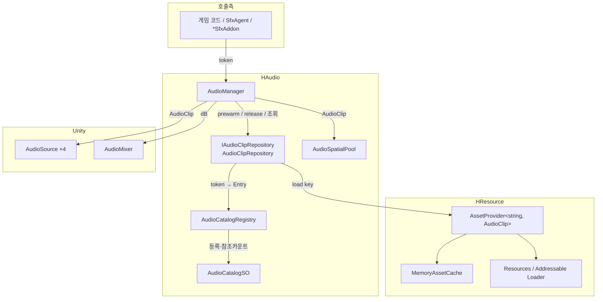
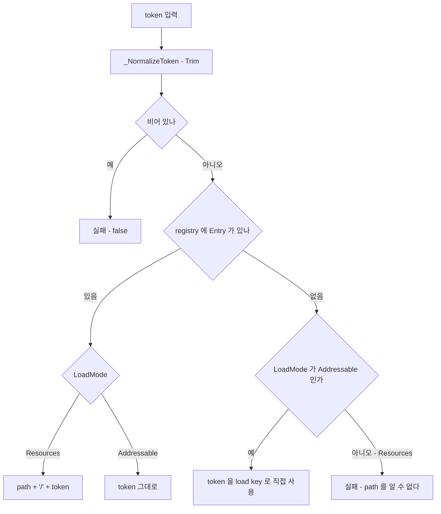
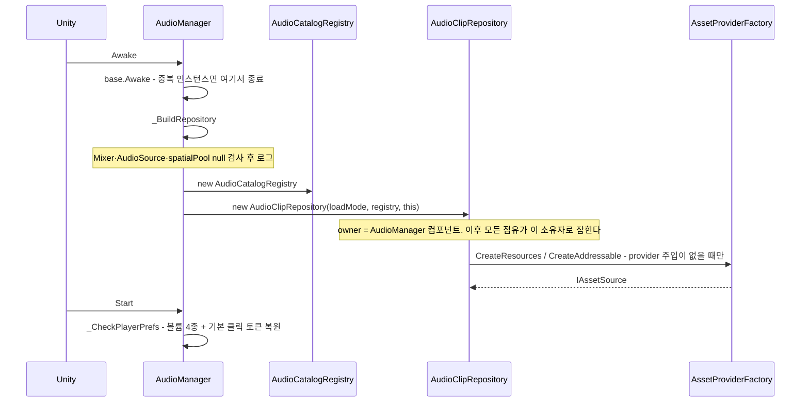
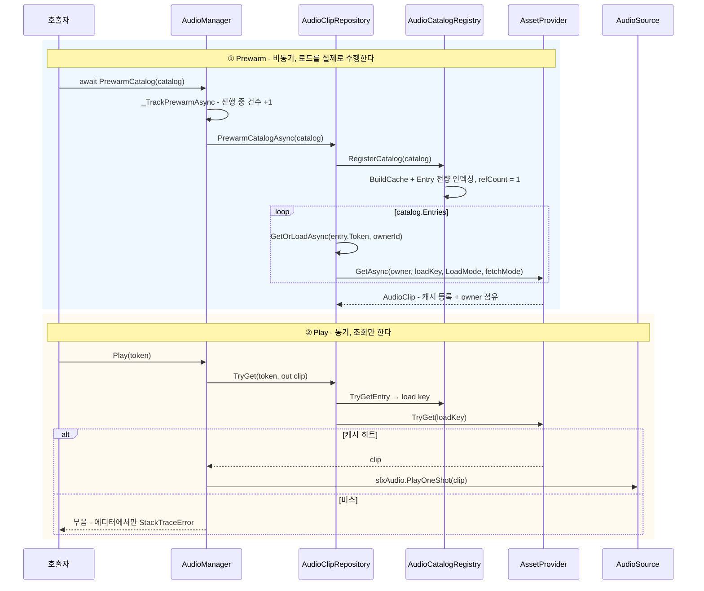
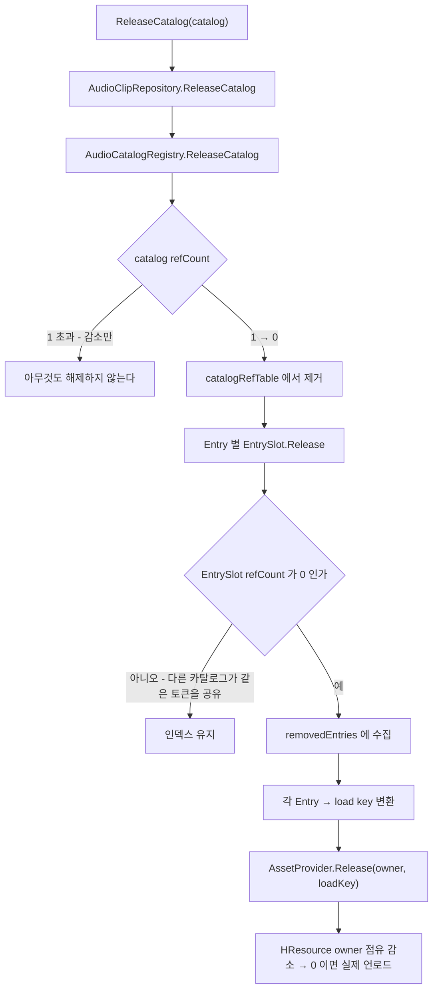
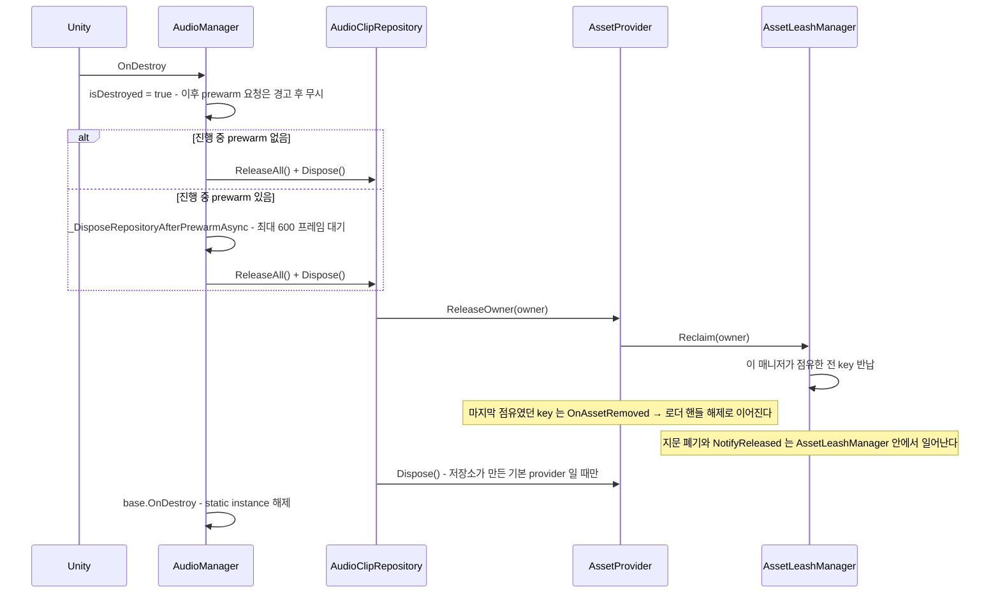
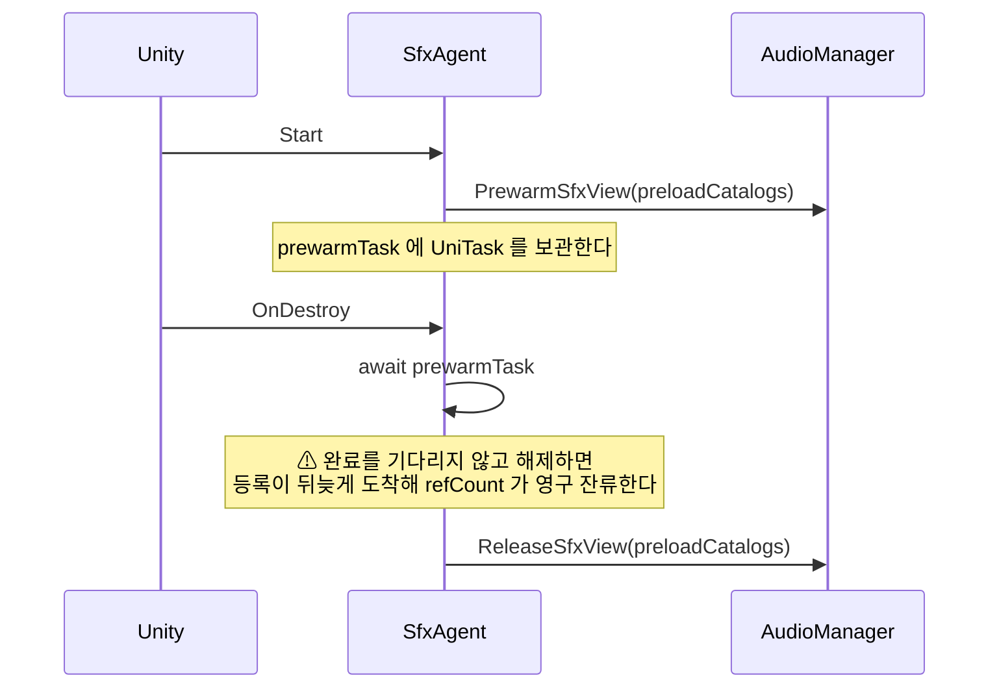
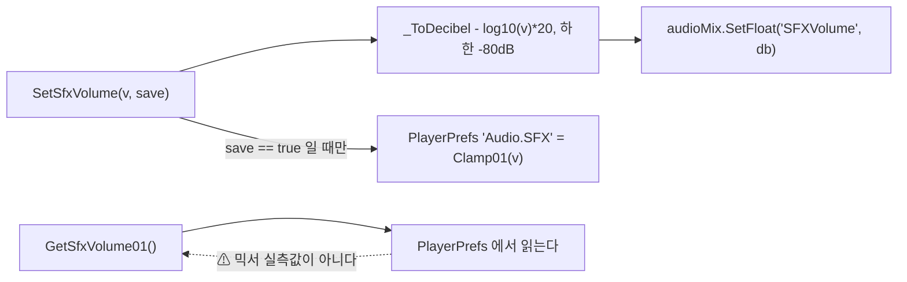
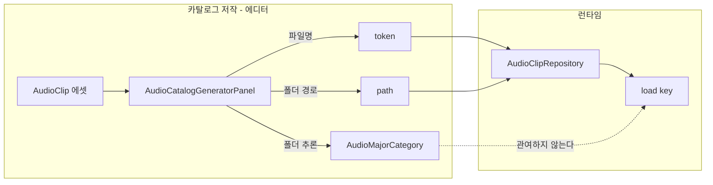

# HCUP.HAudio

> 어셈블리: `HCUP.HAudio` (`Runtime/HCUP.HAudio.asmdef`, rootNamespace `HAudio`)
> 의존: `UniTask`, `HCUP.HResource`, `HCUP.HCore`, `HCUP.HUtil`, `HCUP.HUI`, `HCUP.HInspector`, `HCUP.HDiagnosis`, `HCUP.HCollection`
> 동반 어셈블리: `HCUP.HAudio.Editor`(카탈로그 편집·생성·진단)

---

## 요약

HAudio 는 **`string token` 하나로 오디오를 지목하는 재생 계층**이다. 토큰이 실제 에셋 경로로
번역되는 과정과, 그 에셋의 수명을 누가 붙잡고 있는지를 추적하는 일은 전부 이 어셈블리 안에서
끝나고, **실제 로드·캐시·해제는 `HCUP.HResource` 의 `AssetProvider<string, AudioClip>` 에 위임**한다.

설계의 중심에 세 가지 규약이 있다.

1. **재생은 로드하지 않는다.** `Play*` 계열은 이미 메모리에 있는 클립만 재생한다. 없으면 조용히
   실패하고(에디터에서는 스택 트레이스 경고) 로드를 시작하지 않는다. 로드는 `Prewarm*` 의 몫이다.
2. **해제는 소유자(owner) 단위다.** `AudioClipRepository` 는 생성자에서 `AudioManager` 컴포넌트를 소유자로 한 번 받아 모든 점유를 그 이름으로 잡고, `AudioManager.OnDestroy` 에서 그 소유자의 점유를 한 번에 반납한다.
3. **식별자는 `string token` 과 `int uid` 두 축이다.** 두 축 모두 `AudioManager` 에 오버로드가 있고 레지스트리에 인덱스가 따로 있다. `AudioMajorCategory` 는 카탈로그를 읽을 때의 분류 라벨일 뿐 로드에 관여하지 않는다.

---

## 파일 지도

| 경로 | 역할 |
|---|---|
| `AudioManager.cs` | 런타임 진입점. prewarm/release/play/volume. `SingletonBehaviour<AudioManager>` |
| `AudioManager.Preview.cs` | 에디터 진단용 스냅샷 생성 + preview 추적 상태 (partial) |
| `AudioClipManagerSnapshot.cs` | 진단 창·Odin 인스펙터에 넘길 DTO |
| `Repository/IAudioClipRepository.cs` | 조회·로드·prewarm·release 계약 |
| `Repository/AudioClipRepository.cs` | **token → load key 번역** + `AssetProvider` 위임 |
| `Catalog/AudioCatalogRegistry.cs` | 활성 카탈로그 집합과 **토큰→Entry 인덱스**, 참조 카운트 |
| `Core/AudioCatalogSO.cs` | 데이터 원본. `Entry` 정의 + load key 빌더 |
| `Core/AudioCatalogPolicySO.cs` | 폴더 → 카테고리 매핑 규칙 (에디터 생성기용) |
| `Enum/AudioMajorCategory.cs` | BGM / SFX / UI / Voice - 카탈로그 분류 라벨 |
| `AddOn/AudioSpatialPool.cs` | 3D 원샷 재생용 `AudioSource` 풀 |
| `AddOn/SfxView.cs` | 카탈로그 묶음 직렬화 컨테이너 + 에디터 토큰 미리보기 |
| `AddOn/SfxAgent.cs` | 오브젝트 수명에 맞춘 prewarm/release + 재생 프록시 |
| `AddOn/BaseSfxAddon.cs` | 클릭 사운드 공통 필드 (`overrideClickUid`, 0 이면 오버라이드 없음) + 추상 `_HandleClick` |
| `AddOn/ButtonSfxAddon.cs` | `DelegateButton.OnPointUp` 배선. 오버라이드 uid 가 있으면 `PlayUI(uid)`, 없으면 `PlayClick()` |
| `AddOn/ToggleSfxAddon.cs` | `Toggle.onValueChanged` 배선 (on 일 때만) |

---

## 계층 구조



**책임 경계가 갈리는 지점은 `AudioClipRepository` 하나다.** 위쪽(AudioManager)은 토큰만 알고,
아래쪽(AssetProvider)은 load key 만 안다. 그 사이의 번역이 리포지토리의 존재 이유다.

---

## 데이터 모델

`AudioCatalogSO` 가 유일한 데이터 원본이고, `Entry` 하나가 클립 하나를 서술한다.

```csharp
// Core/AudioCatalogSO.cs - Entry
[Serializable]
public sealed class Entry {
    [SerializeField] AudioMajorCategory major;   // 분류 라벨. 읽기 편하라고 있는 것이지 키가 아니다
    [SerializeField] int uid;                    // 런타임 신원. token 접두 "{uid}_" 와 같은 값
    [SerializeField] string token;               // 카탈로그 키. 파일명에서 온다
    [SerializeField] string path;                // Resources 모드에서 폴더 경로
#if UNITY_EDITOR
    [SerializeField] AudioClip editorClip;       // 편집·미리보기 전용. 빌드에는 없다
#endif
}
```

**카탈로그 안의 키는 `token` 이다.** `AudioCatalogSO.BuildCache` 는 token 으로 인덱싱하고 중복을 그 기준으로 잡는다. `uid` 는 `EditorAddEntry` 가 token 의 `{uid}_{이름}` 접두에서 뽑아 채우는 값이고, 레지스트리의 uid 인덱스와 재생 경로의 `int` 오버로드가 이 값을 쓴다 (`AudioCatalogSO.TryParseUid`). `major` 는 정렬·검색·폴더 추론에만 쓰인다.

### load key 로의 번역

`token` 은 그 자체로 에셋을 찾지 못한다. 모드에 따라 두 갈래로 번역된다.

```csharp
// Core/AudioCatalogSO.cs:168-172
public static string BuildResourcesLoadKey(string path, string token) {
    if (string.IsNullOrWhiteSpace(token)) return string.Empty;
    if (string.IsNullOrWhiteSpace(path)) return token;
    return $"{path.Trim('/')}/{token}";     // 예: "Audio/UI" + "Click" → "Audio/UI/Click"
}
```



**Resources 모드에서는 카탈로그에 등록되지 않은 토큰이 절대 로드되지 않는다.** `path` 를 알
방법이 없기 때문이다(`AudioClipRepository.cs:213-226`). Addressable 모드에만 "토큰 = 주소"
폴백이 있다.

---

## 흐름 1 - 초기화



`_BuildRepository` 의 null 검사는 `Assert` 가 아니라 `HLogger.Error` 다. Assert 는 릴리즈
빌드에서 통째로 제거되므로, 인스펙터 배선 누락은 릴리즈에서도 드러나야 한다는 판단이다
(`AudioManager.cs:196`).

---

## 흐름 2 - Prewarm → Play

이 시스템을 이해하는 핵심이다. **두 흐름은 완전히 분리되어 있고, 서로를 기다리지 않는다.**



`Play` 계열이 로드를 트리거하지 않는 것은 **의도된 제약**이다. 재생 시점의 프레임 스파이크와
"소리가 한 박자 늦게 나는" 문제를 구조적으로 없애는 대신, 호출자에게 prewarm 책임을 지운다.

```csharp
// AudioManager.cs:402-419 - 조회 실패는 조용하다. 에디터에서만 시끄럽다.
private bool _TryGetLoadedClip(string token, out AudioClip clip) {
    if (clipRepository == null) { HLogger.Error("[AudioManager] clipRepository is null."); clip = null; return false; }
    string normalizedToken = _NormalizeToken(token);
#if UNITY_EDITOR
    _TrackPreviewToken(normalizedToken);
#endif
    if (clipRepository.TryGet(normalizedToken, out clip) && clip) return true;
#if UNITY_EDITOR
    HDebug.StackTraceError($"[AudioManager] Clip not loaded yet. Prewarm required. token={normalizedToken}", 10);
#endif
    clip = null;
    return false;
}
```

---

## 흐름 3 - 참조 카운트와 해제

해제는 **두 겹의 참조 카운트**를 통과해야 실제로 일어난다. 카탈로그 단위(레지스트리)와
에셋 단위(HResource 캐시의 owner 점유)다.



**같은 토큰을 두 카탈로그가 공유하는 경우**를 `EntrySlot` 이 처리한다. 카탈로그 A 를 내려도
카탈로그 B 가 그 토큰을 붙잡고 있으면 인덱스도 에셋도 살아남는다.

```csharp
// Catalog/AudioCatalogRegistry.cs:22-39
sealed class EntrySlot {
    public AudioCatalogSO.Entry Entry { get; private set; }
    public int RefCount { get; private set; }
    public EntrySlot(AudioCatalogSO.Entry entry) { Entry = entry; RefCount = 1; }
    public void Retain() { RefCount++; }
    public int Release() { if (RefCount > 0) RefCount--; return RefCount; }
}
```

### 매니저 수명 종료



카탈로그를 몇 개 붙잡고 있었든 **`OnDestroy` 한 번으로 전부 정리된다.** 개별 `ReleaseCatalog` 호출을 빠뜨려도 매니저 파괴 시점에 누수가 남지 않는 이유다. 폐기를 prewarm 완료 뒤로 미루는 이유는, 곧바로 폐기하면 await 중인 prewarm 이 뒤늦게 캐시에 등록돼 로더 핸들이 남기 때문이다 (`AudioManager.cs:132-148`). 600 프레임 안에 끝나지 않으면 경고를 남기고 그대로 폐기한다.

---

## 흐름 4 - SfxAgent 의 수명 결합

`SfxAgent` 는 "이 오브젝트가 살아 있는 동안만 이 카탈로그들이 메모리에 있으면 된다" 를 표현한다.



```csharp
// AddOn/SfxAgent.cs:74-80
private async UniTaskVoid _ReleaseViewsAfterPrewarm() {
    // prewarm 이 in-flight 인 채로 release 가 먼저 실행되면 등록이 뒤늦게 도착해
    // registry refCount 가 영구 잔류한다 - 완료를 기다린 뒤 해제한다.
    await prewarmTask;
    if (!AudioManager.HasInstance) return;
    AudioManager.Instance.ReleaseSfxView(preloadCatalogs);
}
```

이 주석이 가리키는 것은 **fire-and-forget prewarm 과 동기 release 의 경쟁**이다. 짧게 살다
사라지는 오브젝트(팝업, 이펙트)에서 실제로 발생하던 누수라, 같은 패턴을 다른 곳에서 쓸 때도
같은 방어가 필요하다.

---

## 재생 채널

모든 재생 API 는 `string token` 과 `int uid` 오버로드를 함께 갖는다 (`StopBGM` / `PlayClick` 제외).

| API | 출력 | 비고 |
|---|---|---|
| `Play(token)` | `sfxAudio.PlayOneShot` | 2D 효과음 |
| `PlayUI(token)` | `uiAudio.PlayOneShot` | UI 효과음 |
| `PlayClick()` | `PlayUI(기본 클릭 uid)` | 토큰이 아니라 uid 다. `SetGlobalClickUid` 로 지정하고 0 이면 무동작 |
| `Play3D(token, Transform)` | `AudioSpatialPool.PlayAt` | 부모를 바꾸지 않고 매 프레임 타깃 위치를 따라간다. 타깃이 파괴되면 마지막 위치에서 끝까지 재생 |
| `Play3D(token, Vector3)` | `AudioSpatialPool.PlayAt` | 월드 좌표 고정 |
| `PlayBGM(token, ignoreSameClip)` | `bgmAudio.clip` 교체 후 `Play` | 같은 클립 재생 중이면 기본 무시 |
| `StopBGM(fadeOut)` | 볼륨 램프 후 `Stop` | `Time.unscaledDeltaTime` 기준 |

`AudioSpatialPool` 은 `ComponentPool<AudioSource>` 위에 얹은 원샷 풀이다. 반납 시점을 타이머가 아니라 **`isPlaying` 감시**로 잡기 때문에, 외부에서 `Stop` 하거나 씬이 바뀌어도 소스가 새지 않는다. 풀이 파괴되면 취소 토큰이 감시를 끊고, 외부에서 파괴된 소스는 `_Release` 가 반납 대신 장부에서만 지운다.

```csharp
// AddOn/AudioSpatialPool.cs:161-170
try {
    // 종료 감시 : isPlaying 기준, 강제 Stop/씬 전환에도 안전
    await UniTask.WaitUntil(() => !audio || !audio.isPlaying, PlayerLoopTiming.Update, token);
}
catch (OperationCanceledException) {
    // 풀 파괴로 취소. 장부 정리는 finally 가 맡는다.
}
finally {
    _Release(audio);
}
```

---

## 볼륨

볼륨은 **믹서에 쓰고, PlayerPrefs 에서 읽는다.** 두 저장소가 분리되어 있다.



노출 파라미터 이름(`MasterVolume` / `SFXVolume` / `UIVolume` / `BGMVolume`)은 상수로 고정되어
있으므로, **AudioMixer 애셋에 같은 이름으로 파라미터를 Expose 해 두어야 한다**
(`AudioManager.cs:38-41`).

---

## 식별자 체계

키는 **`string token` 과 `int uid` 두 축**이다. `AudioManager` 의 `int` 오버로드, `AudioClipRepository._TryBuildLoadKey(int)`, `AudioCatalogRegistry` 의 uid 인덱스가 uid 축이다. uid 축 조회는 `loadKeyByUid` 캐시에 히트하면 문자열을 만지지 않는다 (`AudioClipRepository.cs:195-211`). uid 는 `Entry.Uid` 필드에서 오고, 그 값이 0 이면 token 앞머리에서 파싱한다(경고 로그). 둘이 어긋나거나 token 이 `{uid}_{이름}` 규약을 따르지 않으면 오류를 남기고 **uid 인덱스에만 등록되지 않는다** - token 축은 이미 등록돼 있어 토큰 조회는 정상 동작한다 (`AudioCatalogRegistry._TryResolveUid`). `AudioClips` enum 은 이 모듈에 없다. Enum Generator 가 사용처 어셈블리에 생성하고 원소 값이 곧 uid 라, 생성된 `Play(this AudioManager, AudioClips)` 확장은 `manager.Play((int)id)` 로 이어진다.



`AudioMajorCategory` 는 남아 있지만 **로드 경로에 들어가지 않는다.** 카탈로그 창의 정렬·검색,
생성기의 폴더 추론, 드롭다운 라벨(`AudioClipDropdownSource`), 레지스트리의 등가성 검사에 쓰인다.

## 에디터 도구 (`HCUP.HAudio.Editor`)

| 창 | 메뉴 | 용도 |
|---|---|---|
| `SoundToolsWindow` | HCUP/Audio/Sound Catalog Editor · Generator · Sound Clip Enum Generator | 아래 3개 패널을 탭으로 묶은 호스트 창 |
| ├ `AudioCatalogEditorPanel` | (Sound Catalogs 탭) | 기존 카탈로그 Entry 표시. 직접 편집은 `clip` 뿐이고 token/path 는 버튼으로 역산, major 는 읽기 전용, uid 는 미노출. **생성은 못 한다** |
| ├ `AudioCatalogGeneratorPanel` | (Catalog Generator 탭) | 폴더 스캔 → token·path·카테고리 자동 생성 |
| └ `AudioClipEnumPanel` | (Enum Generator 탭) | 카탈로그 → AudioClips enum + 재생 확장 메서드 생성 |
| `AudioClipDiagnosticsWindow` | HCUP/Audio/Sound Data Diagnostics | **Play Mode 전용.** 토큰별 로드 여부 실시간 확인 |
| `EditorAudioPreview` | (내부) | `UnityEditor.AudioUtil` 리플렉션 래퍼 - 에디터 미리듣기 |
| `AudioAuthoringSettingsSO` | Create > HCUP/Audio/Audio Authoring Settings | enum 생성 대상 카탈로그 목록, 출력 폴더·네임스페이스·타입명. 출력 폴더 기본값이 없다 |
| `AudioClipEnumGenerator` | (내부) | `{타입명}` enum 과 `{타입명}PlayExtensions.g.cs` 재생 확장을 쓴다 |
| `AudioClipDropdownSource` | (내부) | `[HDropdown(AudioCatalogSO.DROPDOWN_SOURCE_ID)]` 항목 공급자. 라벨은 `{Major}/{token}`, 값은 uid |

진단 창은 `AudioManager.CreateSnapshot()`(`AudioManager.Preview.cs`)이 만든
`AudioClipManagerSnapshot` 을 표시한다. 토큰을 올리는 경로는 `string` 오버로드와 카탈로그 단위
API(`_TrackPreviewCatalog` 가 Entry 토큰을 전부 등록) 두 갈래다. `int uid` 오버로드는 아무것도
남기지 않으므로 `PlayClick()` 과 생성된 enum 확장은 목록에 나타나지 않는다.

---

## 사용 예

```csharp
// 1) 씬 진입 시 - 카탈로그 단위 preload
await AudioManager.Instance.PrewarmCatalog(uiCatalog);

// 2) 재생 - 조회만 한다. prewarm 이 끝나 있어야 한다
AudioManager.Instance.PlayUI("Click");
AudioManager.Instance.Play3D("Explosion", transform);
AudioManager.Instance.PlayBGM("Dungeon");

// 3) 씬 이탈 시 - 카탈로그 반납 (생략해도 매니저 파괴 시 회수된다)
AudioManager.Instance.ReleaseCatalog(uiCatalog);
```

오브젝트 수명에 묶고 싶으면 `SfxAgent` 를 붙이고 `SfxView` 에 카탈로그를 넣는 편이 낫다 -
`Start`/`OnDestroy` 배선과 in-flight 경쟁 방어가 이미 되어 있다.

---

## 주의할 점

읽으면서 확인한 사실들이다. 대부분은 설계 의도지만, 몇 개는 정리 대상이다.

### 계약

1. **`Play*` 는 로드하지 않는다.** prewarm 없이 호출하면 무음이고, 릴리즈 빌드에서는 로그조차
   남지 않는다 (`AudioManager._TryGetLoadedClip` 의 진단이 `#if UNITY_EDITOR`).
2. **Resources 모드는 카탈로그 등록이 필수다.** 미등록 토큰은 레지스트리 조회에 실패하고, 그 뒤를
   받아 줄 폴백이 없어 그대로 끝난다 (`AudioClipRepository._TryBuildLoadKey(string)`).
   Addressable 모드에만 토큰 직접 사용 폴백이 있다. `path` 가 비어도 등록만 되어 있으면 키는 만들어진다.
3. **`Release(token)` 은 레지스트리에 Entry 가 남아 있어야 동작한다.** 카탈로그를 먼저 내리면
   토큰→load key 번역이 실패해 `false` 를 반환한다 (`AudioClipRepository.Release(string)`).
   Addressable 모드는 토큰 폴백이 있어 카탈로그를 내린 뒤에도 성공한다.
4. **`GetXVolume01()` 은 믹서가 아니라 PlayerPrefs 를 읽는다** (`AudioManager._GetLocalMixerVolume01`).
   `SetXVolume(v, save: false)` 로 바꾸면 게터와 실제 믹서 상태가 어긋난다. 시작 시
   `_CheckPlayerPrefs` 가 prefs 값으로 믹서를 맞추므로 초기 상태는 일치한다.

### 정리 대상

5. **`bgmAltAudio` 는 직렬화만 되고 이 패키지 코드는 그 필드를 읽지 않는다** (`AudioManager.cs:87`). private 필드라 외부에서도 쓸 수 없다. 크로스페이드용으로 예약된 슬롯으로 보이나(추론) 그 경로가 없다.
6. **`AudioClipRepository` 는 `AudioCatalogSO.BuildAddressableLoadKey` 를 쓰지 않는다.** `_ResolveAddressableLoadKey` 가 같은 로직을 자체 구현한다(이쪽은 Trim 을 더한다) - 둘 중 하나로 모아야 한다.

### 진단이 릴리즈에서 사라지는 지점

7. `AudioCatalogRegistry` 는 `UnityEngine.Assertions.Assert` 를 광범위하게 쓴다.
   Assert 는 릴리즈에서 제거되므로, 그 뒤의 런타임 가드
   (`if (!catalog) return 0;`)가 실제 방어선이다. 다만 **`_RegisterEntry` 의 "빈 토큰" 검사에는
   런타임 가드가 없어**, 토큰이 비어 있으면 빈 문자열 키로 인덱스에 들어간다.
   조회 측(`TryGetEntry`)이 빈 토큰을 거르므로 실피해는 없고 쓰레기 항목만 남는다.

### 저작

8. **생성기는 루트 아래 모든 `AudioClip` 을 발굴하지만 uid 는 파일명 규약에서만 나온다.** token 은 파일명에서 확장자를 뗀 값이고, `EditorAddEntry` 가 그 token 의 `{uid}_{이름}` 접두를 파싱해 `Entry.Uid` 를 채운다. 규약을 어긴 파일명은 오류 로그를 남기고 uid 가 0 으로 남아, 그 Entry 는 token 축으로만 조회된다 (`AudioCatalogSO.EditorAddEntry`).
9. **카탈로그 창의 Update(clip 에서 token/path 역산)는 uid 를 다시 채우지 않는다** (`AudioCatalogSO.EditorUpdateTokenAndPathFromClips`). 파일명의 uid 접두가 바뀐 클립에 적용하면 필드와 token 이 어긋나, 레지스트리가 등록 시 오류를 남기고 uid 인덱스에서 뺀다. 카탈로그를 생성기로 다시 만들면 맞춰진다.

---

## 확장 지점

| 하고 싶은 것 | 손댈 곳 |
|---|---|
| 로더 교체 (테스트 목킹 포함) | `AudioClipRepository` 생성자의 `assetProvider` 파라미터 - 기본값 대신 주입 |
| 새 재생 채널 (예: Voice) | `AudioManager` 에 `AudioSource` 추가 + 믹서 노출 파라미터 상수 추가 |
| 카탈로그 자동 생성 규칙 변경 | `AudioCatalogPolicySO` 의 `FolderMidMapping` + 생성기의 `_InferMajor` |
| 3D 재생 기본값 (감쇠·거리) | `AudioSpatialPool` 의 `[HTitle("3D Audio Settings")]` 필드군 |
| 클릭음 정책 | `BaseSfxAddon` 상속 후 `_HandleClick` 오버라이드 |

---

## 히스토리

### 2026-09-07 :: 상위 `HAudio/README.md` 갱신

- 이전: 상위 폴더 README 가 `Runtime/New` / `Runtime/Legacy` 구조를 서술해 낡아 있었고, 이 문서의 "정리 대상" 에 항목으로 올라 있었다.
- 현재: 상위 README 의 IMPORTANT 블록이 현행 구조를 서술하도록 갱신돼 항목을 닫았다.

### 2026-08-05 :: `*.Uid.cs` 제거로 바뀐 동작

- 이전: uid 축 코드가 `*.Uid.cs` 파일들로 분리돼 있었다 (개수는 이 저장소에 삭제 이력이 없어 상류에서 확인). 생성기는 `{uid}_{이름}.wav` 형식 파일만 발굴했다 (`_TryParseUid` 가 실패하면 스킵). `AudioCatalogPolicySO` 에 `UidRange` / `TryGetUidRange` / `OnValidate` 가 있었다.
- 현재: `*.Uid.cs` 파일은 없고 uid 축은 본 파일들 안에 남아 있다. 생성기는 루트 아래 모든 `AudioClip` 을 발굴한다. token 규칙(파일명에서 확장자 제거)은 그대로라 기존 파일의 token 값은 변하지 않는다. 정책 SO 의 uid 범위 API 는 제거됐고, 기존 정책 에셋의 `uidRanges` YAML 블록은 읽히지 않고 남는다 - 에셋을 한 번 저장하면 정리된다.
