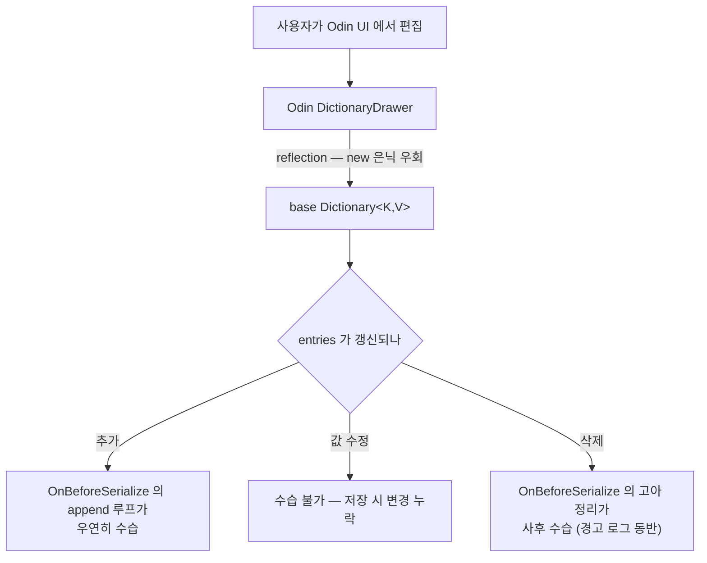
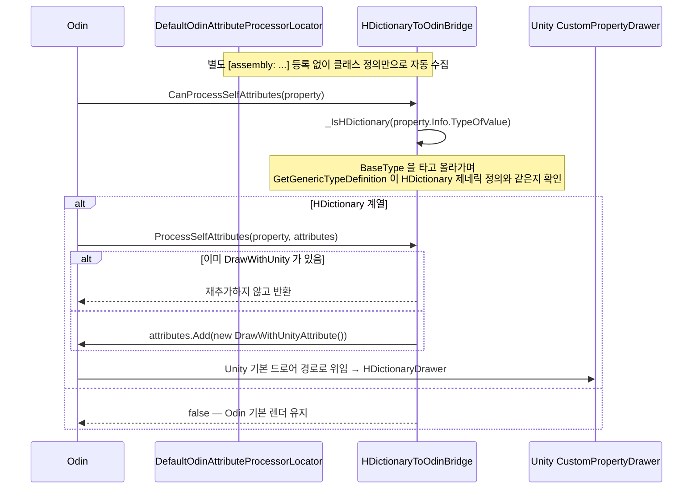

# HCUP.HCollection.Odin.Editor

> 어셈블리: `HCUP.HCollection.Odin.Editor` (`Editor/Odin/HCUP.HCollection.Odin.Editor.asmdef`, rootNamespace `HCollection.Odin.Editor`, `includePlatforms: ["Editor"]`)
> 의존: `HCUP.HCollection`
> 컴파일 조건: `defineConstraints: ["ODIN_INSPECTOR"]`
> 동반 어셈블리: `HCUP.HCollection`, `HCUP.HCollection.Editor`

---

## 요약

파일 1개, 61 행짜리 어셈블리다. 하는 일도 하나다 — **Odin 이 `HDictionary` 를 자기
드로어로 그리지 못하게 막는다.**

| 파일 | 타입 | 역할 |
|---|---|---|
| `HDictionaryToOdinBridge.cs` | `OdinAttributeProcessor` | `HDictionary<,>` 프로퍼티에 `[DrawWithUnity]` 자동 주입 |

어셈블리가 통째로 `ODIN_INSPECTOR` 제약 아래 있으므로, **Odin 미설치 환경에서는 컴파일조차
되지 않고 `HCollection` 본체는 아무 영향을 받지 않는다.**

---

## 왜 막는가

Odin 의 generic Dictionary drawer 는 **reflection 으로 base `Dictionary<K,V>` 를 직접
조작한다.** `HDictionary` 의 변경 API 는 `new` 키워드로 은닉된 오버라이드라, reflection
경로에는 잡히지 않는다.



거기에 더해, Odin 드로어는 `HDictionaryDrawer` 의 고유 기능을 전혀 모른다.

- 중복 키 붉은 오버레이 — 중복이면 PlayMode / Build / Save 가 **전부 차단**되는데
  (`HDictionaryValidator`), Odin 렌더는 그 상태를 시각으로 알려주지 못한다.
- `Sort by Key` 버튼, `[Key | Value | X]` 한 줄 `ReorderableList`, 검색 필드.

즉 **`HDictionary` 의 계약 전반을 이해하는 drawer 는 `HDictionaryDrawer` 뿐이다**
(`HDictionaryToOdinBridge.cs:12-17` 주석).

---

## 동작



| 메서드 | 반환 | 행 |
|---|---|---|
| `CanProcessSelfAttributes` | `_IsHDictionary(property.Info.TypeOfValue)` | `:39-41` |
| `CanProcessChildMemberAttributes` | 항상 `false` — 자식 멤버는 건드리지 않는다 | `:43-45` |
| `ProcessSelfAttributes` | 중복 없으면 `DrawWithUnityAttribute` 추가 | `:47-50` |
| `_IsHDictionary` | 상속 체인 순회 제네릭 정의 비교 | `:52-58` |

```csharp
// HDictionaryToOdinBridge.cs:52-58 — 직접 타입이 아니라 상속 체인을 본다.
private static bool _IsHDictionary(Type type) {
    if (type == null) return false;
    for (Type t = type; t != null; t = t.BaseType) {
        if (t.IsGenericType && t.GetGenericTypeDefinition() == typeof(HDictionary<,>)) return true;
    }
    return false;
}
```

상속 체인을 순회하는 것이 중요하다. `class StatTable : HDictionary<string, int> {}` 같은
비제네릭 파생 타입도 잡아내야 하기 때문이다.

---

## 사용 예

**호출할 것이 없다.** `OdinAttributeProcessor` 는
`DefaultOdinAttributeProcessorLocator` 가 자동 수집하므로, 클래스가 존재하는 것만으로
활성화된다 (`:8-9` 주석).

사용자가 필드에 직접 `[DrawWithUnity]` 를 달아 둔 경우에도 중복 추가하지 않으므로 정상
동작한다 (`:48`).

---

## 주의할 점

### 계약

1. **이 어셈블리가 있으면 `HDictionary` 는 Odin 으로 그려지지 않는다.** 프로젝트에 Odin 이
   설치돼 있어도 마찬가지다. 예외를 두려면 브릿지를 손봐야 한다.
2. **Odin 미설치 환경에서는 이 어셈블리가 통째로 사라진다.** `defineConstraints` 가
   `ODIN_INSPECTOR` 이고, 소스도 `#if ODIN_INSPECTOR` 로 이중 가드돼 있다 (`:1`, `:60`).
   그 환경에서는 Unity 기본 경로가 그대로 `HDictionaryDrawer` 를 찾아가므로 결과가 같다.
3. **`HCUP.HCollection.Editor` 를 참조하지 않는다.** asmdef references 는
   `HCUP.HCollection` 하나뿐이다. 브릿지는 `HDictionaryDrawer` 를 직접 부르지 않고
   `[DrawWithUnity]` 로 Unity 의 드로어 해석 경로에 넘길 뿐이므로 참조가 필요 없다.

### 정리 대상

4. **브릿지와 `HDictionary` 의 Odin 동기화 API 가 중복이다.** `HDictionary` 는
   `IsEntriesOutOfSync` + `ForceSyncEntriesFromDictionary` 콤보를 "컨테이너 오브젝트의
   `[OnInspectorGUI]` 에서 호출하라" 는 전제로 남겨 두고 있는데(파일 Dev Log 의
   "Odin DictionaryDrawer 자동 동기화 전략"), 이 브릿지가 Odin 렌더 자체를 막으므로 그
   시나리오는 발생하지 않는다. 둘 중 하나는 불필요하다. 상세는
   [../../docs/HDictionary.md](../../docs/HDictionary.md) 의 "정리 대상" 11번.
5. **`using System.Collections.Generic;` 외 불필요한 using 이 없는지 확인 필요.**
   `using HCollection;` (`:33`)은 이미 `namespace HCollection.Odin.Editor` 안에 있어
   중복이다 — 상위 네임스페이스는 자동으로 보인다.

---

## 확장 지점

| 하고 싶은 것 | 손댈 곳 |
|---|---|
| 특정 타입만 Odin 렌더 허용 | `_IsHDictionary` (`:52-58`)에 예외 타입 검사 추가 |
| 브릿지 전체 비활성화 | `CanProcessSelfAttributes` 가 `false` 를 반환하도록 (`:39-41`) — 단, 정리 대상 4번의 동기화 콤보를 컨테이너에 붙여야 한다 |
| 다른 HCollection 타입에도 적용 | 같은 패턴으로 `OdinAttributeProcessor` 추가 — 클래스 정의만으로 자동 등록된다 |
