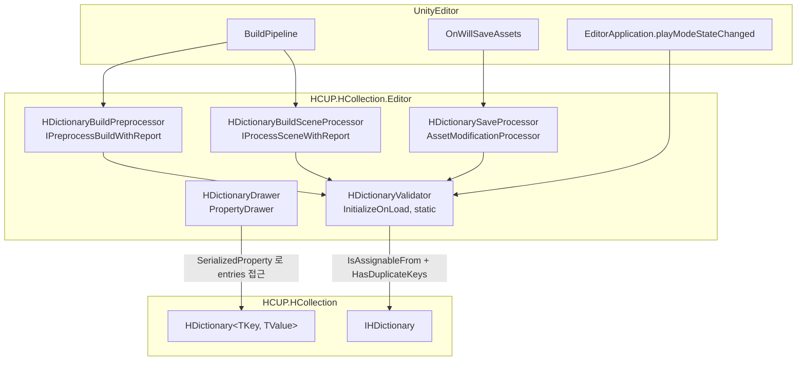
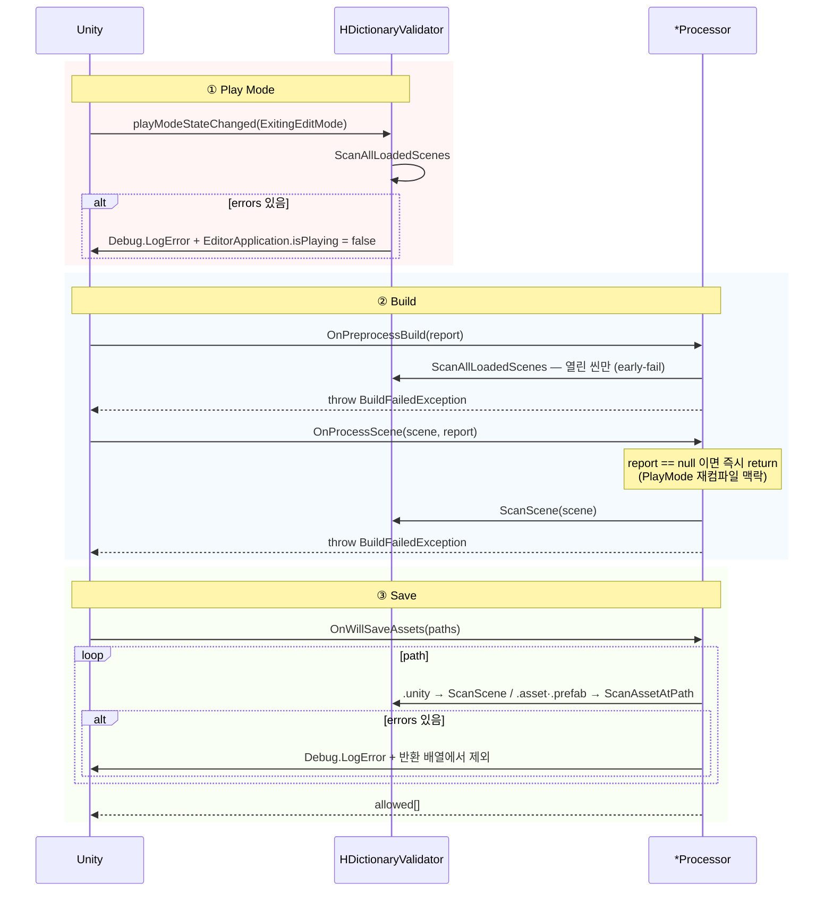
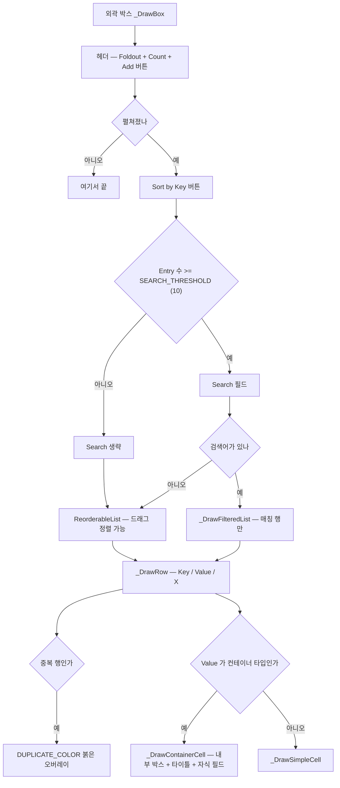

# HCUP.HCollection.Editor

> 어셈블리: `HCUP.HCollection.Editor` (`Editor/HCUP.HCollection.Editor.asmdef`, rootNamespace `HCollection.Editor`, `includePlatforms: ["Editor"]`)
> 의존: `HCUP.HCollection`
> 동반 어셈블리: `HCUP.HCollection` (런타임 본체), `HCUP.HCollection.Odin.Editor` (`ODIN_INSPECTOR` 조건부)

---

## 요약

이 어셈블리는 **`HDictionary` 전용**이다. 두 파일뿐이고 둘 다 하나의 정책을 구현한다 —
**중복 키는 경고가 아니라 하드 에러다.**

| 파일 | 역할 | 정책에서의 위치 |
|---|---|---|
| `Collection/HDictionaryDrawer.cs` (814행) | 인스펙터 렌더 | 중복 상태를 **보여준다** |
| `Collection/HDictionaryValidator.cs` (279행) | PlayMode / Build / Save 차단 | 중복 상태를 **막는다** |

`HCollection` 의 다른 타입(`CircularList` / `EnumArray` / `CollectionUtil`)에 대한 에디터
코드는 이 어셈블리에 없다.

상세한 계약과 설계 배경은 → **[../docs/HDictionary.md](../docs/HDictionary.md)**

---

## 계층 구조



`Validator` 는 `internal static` 이고 `[InitializeOnLoad]` 로 정적 생성자에서 PlayMode
훅을 건다 (`HDictionaryValidator.cs:36-51`). 나머지 셋은 Unity 가 인터페이스 구현을
스스로 찾아 호출하는 `internal class` 다.

---

## HDictionaryValidator

### 스캔 진입점

| 공개 API | 범위 | 행 |
|---|---|---|
| `ScanAllLoadedScenes(errors)` | 로드된 전 씬 | `:68-75` |
| `ScanScene(scene, errors)` | 씬 루트 GameObject 전체 재귀 | `:77-82` |
| `ScanAssetAtPath(path, errors)` | 메인 에셋. prefab 이면 하위 재귀 | `:84-94` |
| `ScanObject(target, context, errors)` | 한 오브젝트의 필드 순회 (실제 판정) | `:96-114` |

`ScanObject` 가 판정의 전부다.

```csharp
// HDictionaryValidator.cs:99-113 — BaseType 을 타고 올라가며 DeclaredOnly 필드를 본다.
System.Type currentType = target.GetType();
while (currentType != null && currentType != typeof(object)) {
    FieldInfo[] fields = currentType.GetFields(MEMBER_FLAGS);
    for (int k = 0; k < fields.Length; k++) {
        if (!typeof(IHDictionary).IsAssignableFrom(fields[k].FieldType)) continue;
        ...
        errors.Add($"{context}.{fields[k].Name} → {dictionary.DuplicateKeyCount()} duplicate key(s)");
    }
    currentType = currentType.BaseType;
}
```

`MEMBER_FLAGS` 는 `Instance | Public | NonPublic | DeclaredOnly` 다 (`:40-44`).
`DeclaredOnly` 를 쓰기 때문에 `BaseType` 을 수동으로 타고 올라가는 while 루프가 필요하다 —
상속 계층에 `private` 필드가 있어도 잡힌다.

### 3게이트



`OnPreprocessBuild` 는 **현재 열려 있는 씬만** 본다. 빌드 씬 리스트 전체는
`IProcessSceneWithReport` 가 각 씬 로드 시점에 개별 검사한다 — 전자는 early-fail 용도다
(`:138-139` 주석).

`OnWillSaveAssets` 는 반환 배열에 없는 경로를 **조용히** 저장하지 않는다. 사용자가
"저장이 안 됐다" 를 인지할 수 있게 `Debug.LogError` 를 반드시 병행한다 (`:184`).

---

## HDictionaryDrawer

`[CustomPropertyDrawer(typeof(HDictionary<,>), true)]` — 제네릭 정의에 붙어 모든
`HDictionary<*, *>` 를 담당한다 (`HDictionaryDrawer.cs:39-40`).

### 렌더 구성



### 알아둘 동작 3가지

**1. `+` 버튼은 직전 요소를 복제하지 않는다.**
Unity 의 `InsertArrayElementAtIndex` 는 기존 요소를 복제한다. 그래서 삽입 직후 모든 하위
프로퍼티를 타입별 기본값으로 재귀 리셋한다 (`_ResetElementToDefault` `:629-639`,
`_ResetPropertyToDefault` `:640-675`).

**2. 캐시 3종을 `(InstanceID + propertyPath)` 로 잡는다.**

```csharp
// HDictionaryDrawer.cs:83-85
static readonly Dictionary<string, ReorderableList> listCache = new();
static readonly Dictionary<string, string> searchCache = new();
static readonly Dictionary<string, HashSet<int>> duplicateCache = new();
```

매 `OnGUI` 마다 `ReorderableList` 를 새로 만들면 드래그 hot-index 가 풀린다. 캐시된
리스트가 여전히 유효한지는 `_IsCachedListValid` 가 확인한다 (`:677-694`).

**3. Sort / Search 는 `ToString()` 기반이다.**
`_PropertyToString` (`:702-734`)이 `SerializedProperty.propertyType` 별로 문자열을 만든다.
사용자 정의 키 타입은 `ToString` 을 구현해야 정렬·검색이 의미를 갖는다.

---

## 사용 예

에디터 코드는 직접 호출할 일이 거의 없다 — 드로어와 프로세서 모두 Unity 가 호출한다.
스캔 API 만 재사용 가능하다.

```csharp
// 커스텀 에디터 창에서 특정 에셋의 중복 키를 직접 점검한다
List<string> errors = new List<string>();
HDictionaryValidator.ScanAssetAtPath("Assets/Data/Localization_Korean.asset", errors);
if (errors.Count > 0) Debug.LogError(string.Join("\n", errors));
```

단, `HDictionaryValidator` 는 `internal static` 이므로 **이 어셈블리 안에서만** 호출할 수
있다 (`:37`).

---

## 주의할 점

### 계약

1. **드로어는 `HDictionary` 의 필드명 문자열에 묶여 있다** — `"entries"` / `"Key"` /
   `"Value"` (`HDictionaryDrawer.cs:42-44`). 런타임 쪽 필드명을 바꾸면 컴파일 에러 없이
   조용히 깨진다.
2. **`IHDictionary` 를 구현하지 않는 직렬화 딕셔너리는 검증되지 않는다.** 판정이
   `IsAssignableFrom(IHDictionary)` 한 줄이기 때문이다 (`HDictionaryValidator.cs:103`).
3. **`OnProcessScene` 은 `report == null` 이면 아무것도 하지 않는다** (`:158-161`).
   PlayMode 진입 중 스크립트 재컴파일 맥락일 수 있어서, PlayMode 는 별도 훅이 담당한다.
4. **`ScanAssetAtPath` 는 `.asset` / `.prefab` 만 본다** (`:203-206`). ScriptableObject
   가 다른 확장자로 저장돼 있으면 저장 게이트를 그냥 통과한다.

### 정리 대상

5. ~~드로어 헤더가 존재하지 않는 필드를 계약으로 서술한다.~~ `logDuplicateKeyWarning`
   언급을 주석 2곳(`HDictionaryDrawer.cs:24`, `:813`)에서 제거 — 실제로는 "entries"
   필드만 참조한다 (2026-08-07 반영).
6. ~~`DuplicateKeyCount()` 의 반환값이 메시지와 어긋난다.~~ 이 API 는 중복 "행" 수를
   센다(같은 키 3행 → `2`). 검증 메시지를 `"{n} duplicate row(s) (rows sharing an
   already-used key)"` 로 정정 (`HDictionaryValidator.cs:110`, 2026-08-07 반영).
7. **`HDictionaryDrawer` 는 814 행 단일 파일이다.** 레이아웃 상수 20여 개 + 컨테이너 셀
   렌더 + 필터 리스트 + 리셋 로직 + 캐시 관리가 한 클래스에 있다. partial 분할
   (`HDictionaryDrawer.Row.cs` / `.Cache.cs` 등)이 유력하다.

---

## 확장 지점

| 하고 싶은 것 | 손댈 곳 |
|---|---|
| 검증 항목 추가 (값 null, 키 공백 등) | `HDictionaryValidator.ScanObject` (`:96-114`) — 판정 조건만 교체 |
| 차단을 경고로 완화 | `HDictionaryBuildPreprocessor` (`:143-152`) / `HDictionarySaveProcessor` (`:177-190`) 의 throw·필터 제거 |
| 검색 노출 임계치 | `HDictionaryDrawer.SEARCH_THRESHOLD` (`:72`, 현재 10) |
| 중복 하이라이트 색상 | `HDictionaryDrawer.DUPLICATE_COLOR` (`:74`) |
| 행 레이아웃 (Key/Value 비율) | `_DrawRow` (`:358-384`) + `VALUE_LABEL_WIDTH_RATIO` (`:69`) |
| 컨테이너 Value 의 접힘 UI | `_DrawContainerCell` (`:402-437`) / `_DrawContainerTitle` (`:438-451`) |
