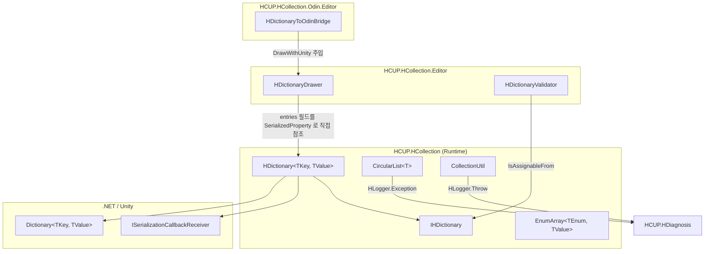
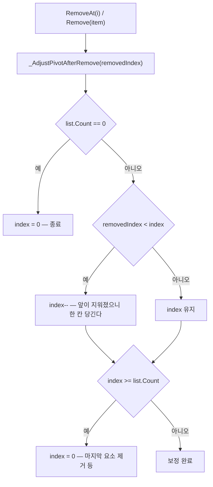

# HCUP.HCollection

> 어셈블리: `HCUP.HCollection` (`Runtime/HCUP.HCollection.asmdef`, rootNamespace `HCollection`)
> 의존: `HCUP.HDiagnosis`
> 동반 어셈블리: `HCUP.HCollection.Editor`(드로어·검증 게이트), `HCUP.HCollection.Odin.Editor`(`ODIN_INSPECTOR` 조건부)

---

## 요약

HCollection 은 **Unity 직렬화가 다루지 못하는 자료구조를 다루게 만드는 어셈블리**다. 서로
독립적인 네 조각으로 되어 있고, 조각끼리는 참조하지 않는다.

| 조각 | 성격 | 무엇을 해결하나 |
|---|---|---|
| `HDictionary<TKey, TValue>` | 직렬화 컨테이너 | Unity 가 `Dictionary` 를 직렬화하지 못하는 문제 |
| `EnumArray<TEnum, TValue>` | 직렬화 컨테이너 | enum 을 인덱스로 쓰는 배열의 타입 안전성 |
| `CircularList<T>` | 런타임 컨테이너 | pivot 을 중심으로 순환 이동하는 리스트 |
| `CollectionUtil` | 확장 메서드 모음 | 셔플·랜덤·조건부 제거·컬렉션 변환 |

**`HDictionary` 만 별도 문서로 분리했다** — 563 행 단일 파일에 직렬화 콜백 계약이 몰려 있고,
이 어셈블리에서 실제 데이터 유실이 발생했던 유일한 지점이기 때문이다.

→ **[../docs/HDictionary.md](../docs/HDictionary.md)**

---

## 파일 지도

| 경로 | 행수 | 역할 |
|---|---|---|
| `Collection/HDictionary.cs` | 563 | 직렬화 가능 `Dictionary`. `Dictionary<K,V>` 상속 + `ISerializationCallbackReceiver` |
| `Collection/IHDictionary.cs` | 75 | 비제네릭 마커 인터페이스. 에디터 검증의 reflection 진입점 |
| `Collection/CircularList.cs` | 219 | pivot 순환 리스트. `IEnumerable<T>` + `IDisposable` |
| `Collection/EnumArray.cs` | 81 | enum 인덱스 배열 래퍼 |
| `Collection/CollectionUtil.cs` | 330 | 컬렉션 확장 메서드 정적 클래스 |

---

## 계층 구조



`CircularList` / `EnumArray` / `CollectionUtil` 은 `HDictionary` 와 아무 관계가 없다.
같은 어셈블리에 있을 뿐이다.

---

## CircularList

`index`(=Pivot) 하나를 내부 `List<T>` 위에서 순환시키는 컨테이너다. **Pivot 이 항상 유효
범위 안에 있다는 보장이 이 클래스의 유일한 계약**이고, 최근 재설계도 전부 그 보장을 위한
것이다.

### Pivot 보정 규칙



`_AdjustPivotAfterRemove` 는 `CircularList.cs:106-113` 이다. `RemoveCurrent`
(`:84-88`)만은 이 헬퍼를 거치지 않는데, `removedIndex == index` 인 경우라 첫 분기가 항상
거짓이어서 결과가 같기 때문이다.

### deferred 채움 패턴

`CircularList(int pivot, int size)` 는 **size 를 capacity 로만 쓰고 요소를 만들지 않는다**
(`:68-71`). pivot 을 먼저 정해 두고 나중에 `Add` 로 채우는 사용처(`HGame` 의
`ParallexLayer.cs:44`)를 위한 생성자다.

- 이 상태에서는 `Count <= index` 가 정상 상태이므로, `CurrentItem` 이
  `((uint)index < (uint)list.Count)` 범위 가드로 `default` 를 반환한다 (`:37`).
- 그래서 이 생성자만 pivot 을 clamp 하지 않고 **음수만 차단**한다 (`:70`).
- 반면 요소가 즉시 확정되는 `CircularList(int pivot, IEnumerable<T> list)` 는
  `Math.Clamp(pivot, 0, Count - 1)` 로 강제 clamp 한다 (`:58`).

| 멤버 | 빈 리스트에서의 동작 |
|---|---|
| `NextPivot` / `PrevPivot` | `0` — 가드 없이는 `% 0` 으로 DivideByZero (`:31-32`) |
| `CurrentItem` | `default` (`:37`) |
| `IsAtLast` | `false` — `list.Count > 0` 조건 포함 (`:34`) |
| `IsAtFirst` | `false` — `list.Count > 0` 조건 포함 (`:34`, 2026-08-07 반영) |
| `MoveNext` / `MovePrev` / `MoveToLast` / `MoveBy` | 무동작 |
| `MoveTo(int)` | `HLogger.Exception` 로그 후 무동작 (`:150-153`) |

---

## EnumArray

`Convert.ToInt32(key)` 로 enum 을 인덱스로 바꿔 `TValue[]` 에 접근한다 (`EnumArray.cs:30-37`).
전제는 **enum 값이 `0..N-1` 연속**이라는 것이며, 이를 검사하는 코드는 없다.

```csharp
// EnumArray.cs:43-52 — TryGetValue 만 범위를 검사한다. 인덱서는 검사하지 않는다.
public bool TryGetValue(TEnum key, out TValue value) {
    var index = Convert.ToInt32(key);
    if ((uint)index >= (uint)values.Length) { value = default; return false; }
    value = values[index]; return true;
}
```

`Length` 프로퍼티만 `values?.Length ?? 0` 로 null 을 견디고(`:26`), 인덱서와
`TryGetValue` 는 `values` 가 null 이면 `NullReferenceException` 이다.

---

## CollectionUtil

전부 `static` 확장 메서드다. 상태를 갖지 않는다.

| 구역 | API | 비고 |
|---|---|---|
| Range Check | `IsIndexInRange` / `IsRangeValid` ×2 | `AggressiveInlining`, `(uint)` 캐스팅 한 번으로 음수·초과 동시 검사 |
| Shuffle | `Shuffle` | `System.Random` (UnityEngine.Random 아님) Fisher-Yates |
| AddRange | `AddRange` (Dictionary / Queue / Stack) | Dictionary 판은 **기존 키를 덮지 않는다** (`:47-48`) |
| Random | `RandomElement` / `RandomEntry` / `RandomKey` / `RandomValue` + `Try*` 3종 | 인덱스는 `UnityEngine.Random.Range` (`:109`) |
| Nullify / Search | `NullifyTarget` / `IndexOfReference` / `TryGetIndexOf` | `where T : class` — **참조 비교(`==`)** 이지 `Equals` 가 아니다 |
| Remove | `RemoveIf` (IList / T[] / IDictionary) | IList 판은 `List<T>` 면 `RemoveAll` 로 위임 (`:157`) |
| 변환 | `ToListFast` / `CloneList` / `ToHashSetFast` / `ToStack` / `ToQueue` / `ToIndexDictionary` | `ToListFast` 는 입력이 `List<T>` 면 **복사하지 않고 그대로 반환** (`:211`) |

`ToListFast` 와 `CloneList` 의 차이가 이 파일에서 가장 오해하기 쉬운 지점이다.

```csharp
// CollectionUtil.cs:209-218 — ToListFast: 입력이 List<T> 면 같은 인스턴스를 돌려준다.
if (source is List<T> list) return list;   // ← 호출자가 수정하면 원본이 바뀐다
// CollectionUtil.cs:220-228 — CloneList: 항상 새 List 를 만든다.
```

null 처리도 두 갈래다. `RandomElement` / `RemoveIf` 계열은 `HLogger.Throw` 를 거치고
(`:68, :154`), 변환 계열은 `throw new ArgumentNullException` 을 직접 던진다 (`:210`).
전자만 `HDiagnosis` 로그에 남는다.

---

## 사용 예

```csharp
// 1) 직렬화 딕셔너리 — 인스펙터에서 편집한다
[SerializeField] HDictionary<string, int> stats = new();
int hp = stats["HP"];                     // 런타임 조회는 O(1)

// 2) 순환 리스트 — pivot 을 먼저 정하고 나중에 채운다
CircularList<Transform> tiles = new CircularList<Transform>(pivot: 1, size: 3);
tiles.Add(a); tiles.Add(b); tiles.Add(c);
tiles.MoveNext();
Transform current = tiles.CurrentItem;

// 3) enum 배열
EnumArray<RarityType, Color> colors;
if (colors.TryGetValue(RarityType.Rare, out Color c)) { /* ... */ }

// 4) 확장 메서드
list.Shuffle();
int removed = dict.RemoveIf(v => v.expired);
```

---

## 주의할 점

### 계약

1. **`HDictionary` 의 변경 API 는 `HDictionary` 참조로만 호출해야 한다.**
   `Dictionary<K,V>` 로 업캐스팅하면 `new` 은닉이 풀려 `entries` 동기화가 끊긴다.
   상세는 [../docs/HDictionary.md](../docs/HDictionary.md) 의 "계약" 절.
2. **`CircularList.Items` 는 원본 `List<T>` 를 그대로 노출한다** (`CircularList.cs:39`).
   `IReadOnlyList<T>` 로 반환하지만 런타임 타입은 `List<T>` 이므로, 다운캐스팅해 제거하면
   `_AdjustPivotAfterRemove` 를 우회해 pivot 이 어긋난다. 주석이 이 위험을 명시한다 (`:38`).
3. **`EnumArray` 는 `0..N-1` 연속 enum 만 지원한다** (`EnumArray.cs:55` 주석). 명시적
   값을 가진 enum(`Flags` 등)에 쓰면 인덱스가 배열을 벗어난다.
4. **`CollectionUtil` 의 참조 비교 API 는 값 타입에 쓸 수 없다.** `NullifyTarget` /
   `IndexOfReference` / `TryGetIndexOf` 는 `where T : class` 제약 + `==` 비교라,
   `Equals` 를 오버라이드한 타입이어도 참조가 다르면 못 찾는다 (`:122, :134, :141`).

### 정리 대상

5. **`EnumArray._GetEnumCount` 는 호출처가 0건이다** (`EnumArray.cs:54-57`, 패키지 전역
   grep 0건). `private static` 이라 외부에서 쓸 수도 없는 완전한 죽은 코드다.
6. **`EnumArray` 자체의 사용처가 패키지 안에 0건이다** (전역 grep — 선언 파일 외 0건).
   외부 게임 코드 전용이거나, 도입만 되고 쓰이지 않은 상태다.
7. **`CircularList.Clear()` 는 `[Obsolete("Change it to 'Dispose'")]` 상태로 남아 있다**
   (`CircularList.cs:174-175`). 패키지 내 호출처 0건이므로 제거 가능하다.
8. ~~`CircularList.IsAtFirst` 만 빈 리스트 가드가 없다~~ — `IsAtLast` 와 동일하게
   `list.Count > 0` 조건을 추가해 대칭을 맞췄다 (`:34`, 2026-08-07 반영).
9. **`CircularList.MoveTo(int)` 만 실패를 로그한다** (`:150-153`). 같은 클래스의 다른
   이동/제거 API 는 전부 조용히 무동작이라 실패 처리 정책이 일관되지 않다.
10. **로거가 두 갈래다.** `CircularList` / `CollectionUtil` 은 `HDiagnosis.Logger.HLogger`
    를 쓰지만 `HDictionary` 는 `UnityEngine.Debug` 를 직접 쓴다
    (`HDictionary.cs:94, :130, :142, :150, :273`). asmdef 는 `HCUP.HDiagnosis` 를 참조하고
    있으므로 기술적 제약이 아니라 미정리다.

---

## 확장 지점

| 하고 싶은 것 | 손댈 곳 |
|---|---|
| `HDictionary` 의 키 비교자 교체 | 현재 불가 — `Comparer` 는 base `Dictionary` 기본값 고정. 생성자 오버로드 추가 필요 |
| 중복 키 정책을 "last-wins" 로 변경 | `HDictionary.OnAfterDeserialize` 의 `rebuilt.ContainsKey` 분기 (`:148-155`) |
| 순환 이동에 이벤트 훅 추가 | `CircularList` 의 `index` 대입 지점 5곳을 private setter 로 모을 것 |
| `EnumArray` 의 비연속 enum 지원 | `Convert.ToInt32` 대신 `Array.IndexOf(Enum.GetValues(...))` 매핑 테이블 |
| 새 컬렉션 확장 메서드 | `CollectionUtil` 에 region 추가 — 상태가 없으므로 부작용 없음 |
