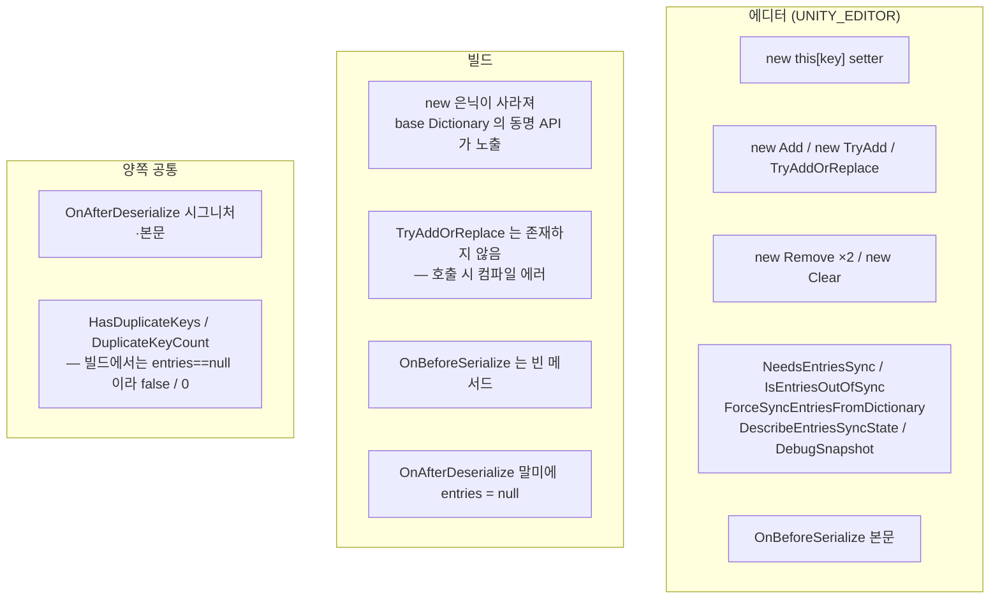
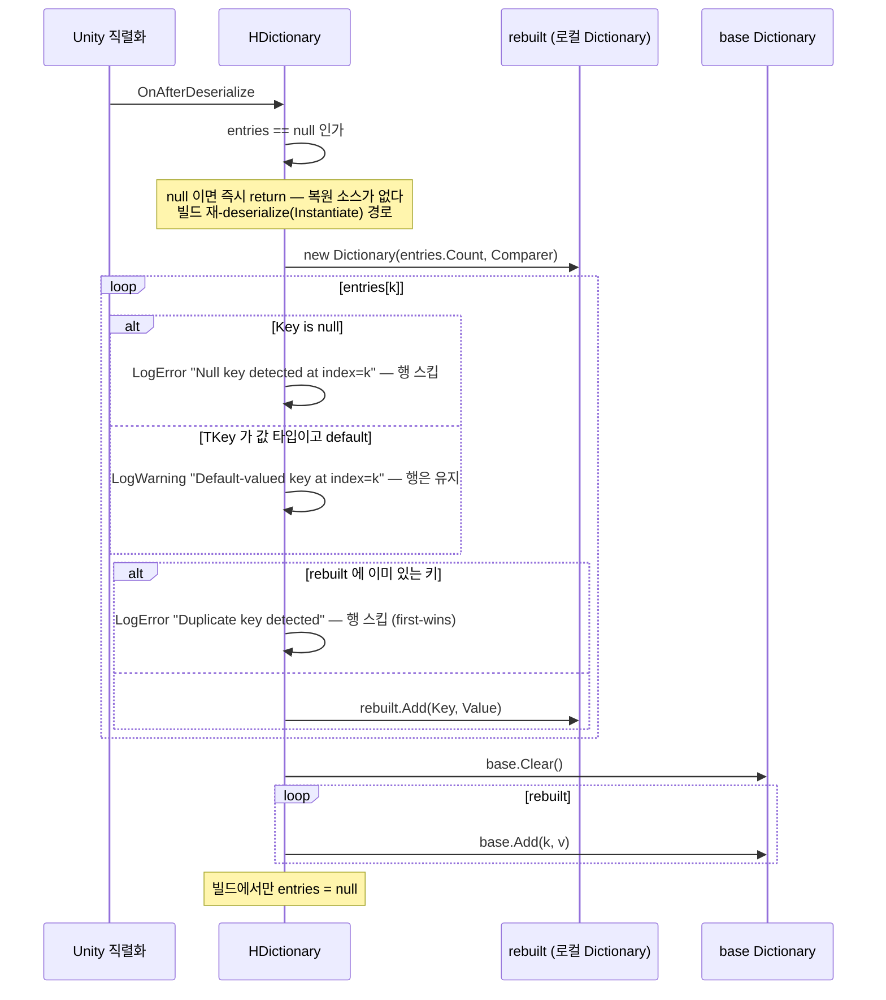
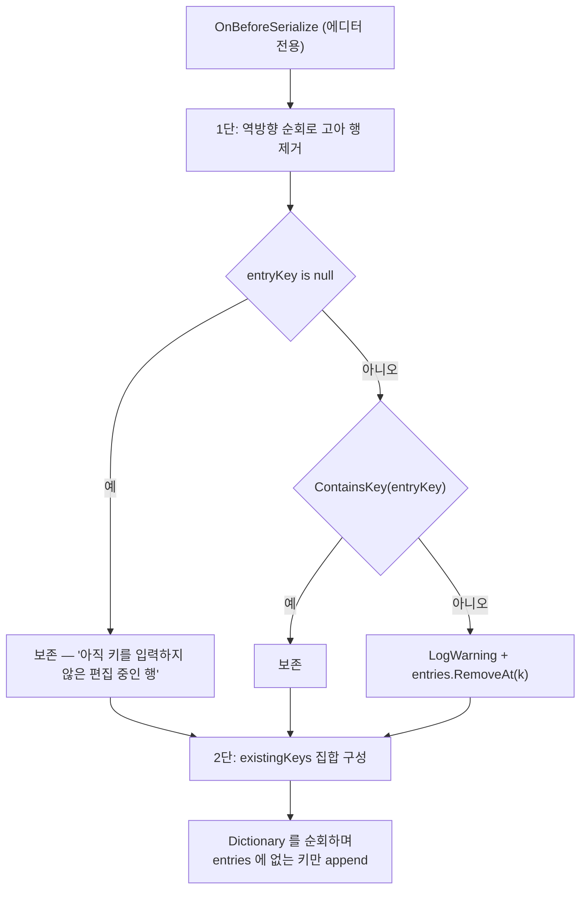
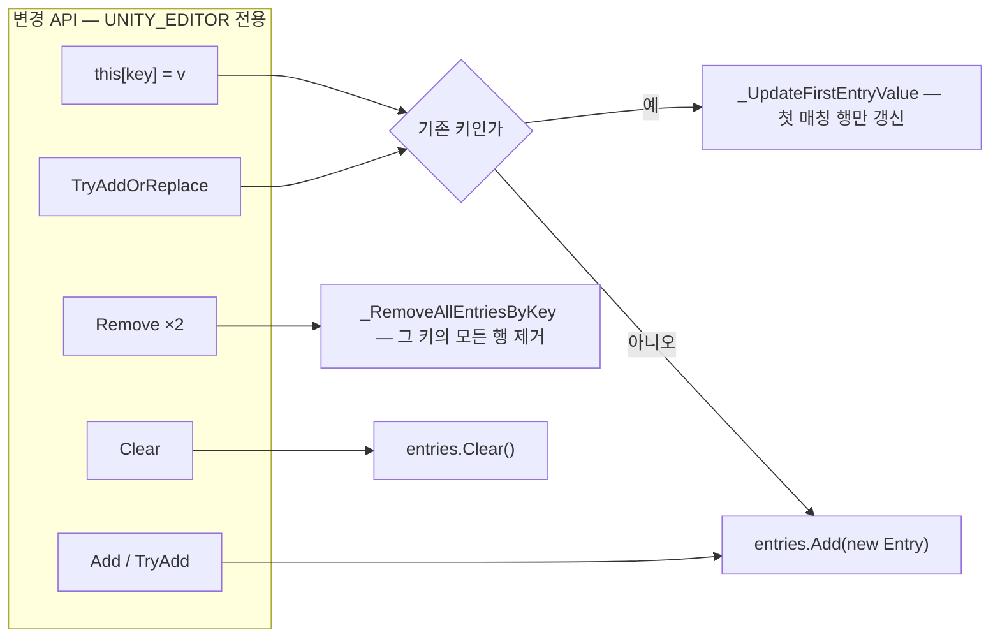
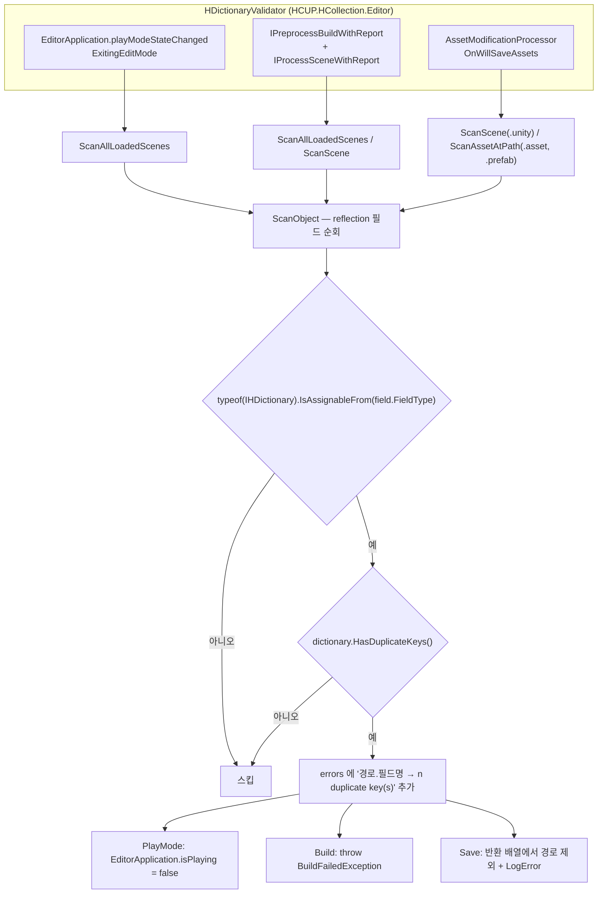
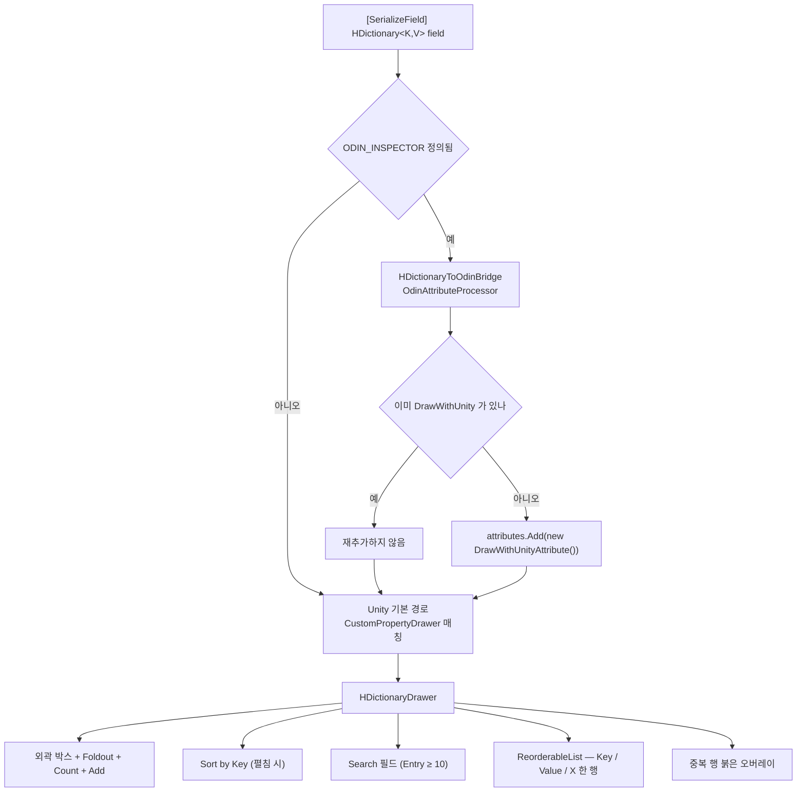

# HDictionary

> 소속 어셈블리: `HCUP.HCollection` (`HCollection/Runtime/Collection/HDictionary.cs`, 563 행)
> 관련 어셈블리: `HCUP.HCollection.Editor`(드로어·검증), `HCUP.HCollection.Odin.Editor`(Odin 우회)
> 상위 문서: [../Runtime/README.md](../Runtime/README.md)

---

## 요약

`HDictionary<TKey, TValue>` 는 **`Dictionary<TKey, TValue>` 를 상속하면서
`ISerializationCallbackReceiver` 를 구현한 직렬화 래퍼**다. 런타임 조회는 상속받은
`Dictionary` 그대로 O(1) 이고, Unity 가 저장하는 실체는 `List<Entry> entries` 다.

이 클래스를 이해하는 축은 **두 컬렉션이 어느 시점에 어느 방향으로 동기화되는가** 하나다.

| 저장소 | 역할 | 에디터 | 빌드 |
|---|---|---|---|
| `List<Entry> entries` | 영속 source of truth. Unity 직렬화 대상 | 항상 살아 있음 | `OnAfterDeserialize` 직후 `null` |
| `Dictionary<TKey, TValue>` (base) | 런타임 조회 뷰 | 살아 있음 | 유일한 실체 |

**직렬화 콜백이 이 모듈의 데이터 유실 원점이었다.** 아래 "계약" 절이 문서의 핵심이다.

---

## 파일 지도

| 경로 | 어셈블리 | 역할 |
|---|---|---|
| `Runtime/Collection/HDictionary.cs` | `HCUP.HCollection` | 본체. 변경 API + 직렬화 콜백 + 진단 API |
| `Runtime/Collection/IHDictionary.cs` | `HCUP.HCollection` | 비제네릭 마커 (`HasDuplicateKeys` / `DuplicateKeyCount`). 빌드에도 노출 |
| `Editor/Collection/HDictionaryDrawer.cs` | `HCUP.HCollection.Editor` | `[CustomPropertyDrawer(typeof(HDictionary<,>), true)]` |
| `Editor/Collection/HDictionaryValidator.cs` | `HCUP.HCollection.Editor` | PlayMode / Build / Save 3게이트 차단 |
| `Editor/Odin/HDictionaryToOdinBridge.cs` | `HCUP.HCollection.Odin.Editor` | Odin 드로어 우회 (`[DrawWithUnity]` 주입) |

---

## 데이터 모델

```csharp
// HDictionary.cs:48-57
[Serializable]
private struct Entry {
    public TKey Key;
    public TValue Value;
}

[SerializeField]
List<Entry> entries = new();
```

`Entry` 는 `private struct` 이고 `entries` 는 `private` 필드다. 그럼에도 드로어가 이 둘을
`SerializedProperty` 문자열로 직접 집는다 — **필드명이 계약의 일부**다.

```csharp
// HDictionaryDrawer.cs:42-44
const string ENTRIES_FIELD = "entries";
const string KEY_FIELD     = "Key";
const string VALUE_FIELD   = "Value";
```

---

## 컴파일 경계

이 클래스는 **에디터와 빌드에서 서로 다른 타입**이 된다. `#if UNITY_EDITOR` 가 변경 API
전체를 감싸기 때문이다.



`ISerializationCallbackReceiver` 시그니처는 양쪽에 보존된다. 본문만 가드된다
(`HDictionary.cs:84-85, :115-116`).

---

## 흐름 1 — OnAfterDeserialize (entries → Dictionary)

**재구축을 로컬 임시 딕셔너리에서 먼저 끝내고, 성공한 뒤에만 base 를 갈아엎는다.** 콜백
도중 예외가 나가도 기존 데이터가 파괴되지 않게 하려는 순서다 (`:123` 주석).



| 단계 | 코드 | 행 |
|---|---|---|
| 복원 소스 부재 시 조기 반환 | `if (entries == null) return;` | `:121` |
| 로컬 재구축 버퍼 | `Dictionary<TKey, TValue> rebuilt = new(...)` | `:124` |
| null 키 스킵 + LogError | `if (entry.Key is null) { ...; continue; }` | `:128-135` |
| default 값 키 경고 (스킵 아님) | `typeof(TKey).IsValueType && Equals(default)` | `:140-145` |
| 중복 키 스킵 + LogError (first-wins) | `if (rebuilt.ContainsKey(entry.Key))` | `:148-155` |
| 반영 — **반드시 `base.*`** | `base.Clear()` / `base.Add(...)` | `:160-163` |
| 빌드에서 프록시 해제 | `#if !UNITY_EDITOR entries = null;` | `:165-168` |

**`base.Clear()` / `base.Add()` 를 쓰는 것이 필수다.** 오버라이드된 `Clear` / `Add` 는
`entries` 를 건드리므로, 역직렬화 도중 호출하면 복원 소스를 스스로 지우거나 무한히 append
한다 (파일 헤더 `:33-34` 가 이를 명시한다).

**null 키와 default 키의 처리가 다르다.** null 키는 행을 버리고, 값 타입의 default 키는
경고만 하고 행을 살린다. 값 타입에서는 `0` / `false` 가 정당한 키일 수 있으므로 버릴 수
없기 때문이다 (`:138-139` 주석).

---

## 흐름 2 — OnBeforeSerialize (Dictionary → entries)

방향이 반대다. **고아 행 제거 → 신규 키 append** 2단이다.



| 단계 | 코드 | 행 |
|---|---|---|
| 역방향 순회 (`RemoveAt` 안전) | `for (int k = entries.Count - 1; k >= 0; k--)` | `:90` |
| **null 키 행 보존** | `if (entryKey is null) continue;` | `:92` |
| 고아 판정 | `if (ContainsKey(entryKey)) continue;` | `:93` |
| 고아 제거 + 경고 | `Debug.LogWarning(...)` / `entries.RemoveAt(k)` | `:94-97` |
| 신규 키 append | `foreach (var kv in this) { ... }` | `:105-114` |

**null 키 행을 보존하는 것이 의도된 예외다.** 인스펙터에서 `+` 를 눌러 행을 만들고 아직
키를 입력하지 않은 상태가 정확히 "null 키 고아 행" 이라, 여기서 지우면 사용자가 방금 만든
행이 저장 시점에 사라진다 (`:89` 주석).

고아 행이 생기는 원인은 하나다 — **`Dictionary<K,V>` 로 업캐스팅해서 제거한 경우**.
`new` 은닉이 풀려 `entries` 동기화가 일어나지 않고, 키는 딕셔너리에서만 사라진다. 이
고아 행이 다음 `OnAfterDeserialize` 에서 그대로 부활하던 것이 원래의 결함이다
(`:87-88` 주석).

---

## 흐름 3 — 변경 API 와 entries 동기화



`_RemoveAllEntriesByKey` (`:380-385`)가 **모든** 행을 지우는 것이 최근 수정 지점이다.

```csharp
// HDictionary.cs:378-385
// 종전에는 첫 행만 제거해, 중복 키 상태에서 Remove 하면 둘째 행이 승격되어
// "삭제했는데 값이 바뀐 채 살아있는" 결과가 나왔다. 키가 사라지면 그 키의 모든 행이 사라져야 한다.
private void _RemoveAllEntriesByKey(TKey key) {
    IEqualityComparer<TKey> comparer = Comparer;
    for (int k = entries.Count - 1; k >= 0; k--) {
        if (comparer.Equals(entries[k].Key, key)) entries.RemoveAt(k);
    }
}
```

반대로 `_UpdateFirstEntryValue` (`:366-377`)는 **첫 행만** 갱신한다. `OnAfterDeserialize`
가 중복 키를 first-wins 로 처리하므로(`:148-155`) 두 번째 이후 행은 어차피 딕셔너리에
반영되지 않는다 — 정책이 일치한다.

---

## 흐름 4 — 중복 키 3게이트

중복 키는 경고가 아니라 **하드 에러**다. `HDictionaryValidator` 가 세 곳을 막는다.



| 게이트 | 진입점 | 차단 방법 | 행 |
|---|---|---|---|
| Play Mode | `_OnPlayModeStateChanged` | `EditorApplication.isPlaying = false` | `HDictionaryValidator.cs:54-64` |
| Build (사전) | `HDictionaryBuildPreprocessor.OnPreprocessBuild` | `BuildFailedException` | `:140-153` |
| Build (씬별) | `HDictionaryBuildSceneProcessor.OnProcessScene` | `BuildFailedException` | `:155-172` |
| Save | `HDictionarySaveProcessor.OnWillSaveAssets` | 허용 경로 배열에서 제외 | `:176-190` |

**`IHDictionary` 가 존재하는 이유가 이 스캔이다.** 제네릭 타입 파라미터를 모른 채
`IsAssignableFrom` 한 줄로 모든 `HDictionary<*, *>` 필드를 잡아내기 위한 비제네릭 마커다
(`HDictionaryValidator.cs:103`).

`OnWillSaveAssets` 는 반환 배열에서 빠진 경로를 **조용히** 무시한다. 사용자가 "저장이 안
됐다" 를 인지할 수 있도록 `Debug.LogError` 를 병행한다 (`:184`).

`OnProcessScene` 은 `report == null` 이면 아무것도 하지 않는다 — Play Mode 진입 중 스크립트
재컴파일 맥락일 수 있어서 Build 전용 로직만 돌린다 (`:158-161`).

---

## 흐름 5 — 인스펙터 렌더와 Odin 우회



브릿지가 필요한 이유는 **Odin 의 generic Dictionary drawer 가 reflection 으로 base
`Dictionary<K,V>` 를 직접 조작해 `new` 은닉 오버라이드를 전부 우회**하기 때문이다. 그
경로로 편집하면 `entries` 에 반영되지 않아 저장 시점에 변경이 사라진다. 브릿지는
`OdinAttributeProcessor` 를 통해 `[DrawWithUnity]` 를 자동 주입해 Odin 렌더 자체를
비활성화한다 (`HDictionaryToOdinBridge.cs:47-50`).

`OdinAttributeProcessor` 는 `DefaultOdinAttributeProcessorLocator` 가 자동 수집하므로
`[assembly: ...]` 등록 코드가 없다 (`:8-9` 주석). 어셈블리 자체가
`defineConstraints: ["ODIN_INSPECTOR"]` 이라 Odin 미설치 환경에서는 컴파일되지 않는다.

### 드로어의 캐시

`ReorderableList` / 검색어 / 중복 인덱스 집합을 `(InstanceID + propertyPath)` 키로 캐시한다
(`HDictionaryDrawer.cs:83-85`). 매 `OnGUI` 마다 `ReorderableList` 를 새로 만들면 드래그
hot-index 가 풀리기 때문이다.

`+` 버튼은 `InsertArrayElementAtIndex` 가 **직전 요소를 복제**하는 Unity 동작을 상쇄하기
위해, 삽입 직후 모든 하위 프로퍼티를 타입별 기본값으로 재귀 리셋한다
(`_ResetElementToDefault` / `_ResetPropertyToDefault`, `:629-675`).

---

## 진단 API

전부 `#if UNITY_EDITOR` 다 (`IHDictionary` 구현 2종 제외).

| API | 판정 기준 | 행 |
|---|---|---|
| `HasDuplicateKeys()` | `entries` 안에 같은 키가 2행 이상 | `:173-184` |
| `DuplicateKeyCount()` | **중복 "행" 수** (키 1개가 3행이면 2) | `:186-200` |
| `NeedsEntriesSync()` | Dictionary 에만 있고 `entries` 에 없는 키 존재 여부 (단방향) | `:253-267` |
| `IsEntriesOutOfSync()` | Count 일치 + 중복 없음 + 키·값 전량 일치 (엄격) | `:337-364` |
| `DescribeEntriesSyncState()` | 위 불일치를 사람이 읽을 문자열로 | `:289-335` |
| `ForceSyncEntriesFromDictionary()` | `entries` 를 Dictionary 로 전량 덮어씀 | `:269-287` |
| `DebugSnapshot()` | `(Key, Value)` 튜플 리스트 | `:357-363` |

`IsEntriesOutOfSync` 는 `TryGetValue` 앞에서 null 키를 먼저 걸러낸다 —
`Dictionary.TryGetValue` 가 null 키에 `ArgumentNullException` 을 던지기 때문이다
(`:349-350`).

`ForceSyncEntriesFromDictionary` 는 **사용자 데이터를 조용히 지우던** API 였다. 지금은
버려지는 행 수를 경고한다.

```csharp
// HDictionary.cs:269-278
public void ForceSyncEntriesFromDictionary() {
    // 중복 키 정책은 "하드 에러 + first-wins" 인데, 이 함수는 사용자 데이터를 조용히
    // 지워서 오류를 없앴다. 무엇이 사라지는지 반드시 알린다.
    if (entries != null && entries.Count > Count) {
        Debug.LogWarning(
            $"[HDictionary] ForceSyncEntriesFromDictionary discards {entries.Count - Count} entry row(s) "
            + $"(duplicates and/or orphans). Fix duplicate keys before syncing if they were intentional.");
    }
    ...
}
```

---

## 사용 예

```csharp
// 선언 — 인스펙터에서 편집한다
[SerializeField] HDictionary<string, string> table = new();

// 조회 — 상속받은 Dictionary API 그대로. O(1)
if (table.TryGetValue(uid, out string text)) { /* ... */ }

// 변경 — 반드시 HDictionary 참조로. 에디터에서만 컴파일되는 API 가 섞여 있다
table.TryAddOrReplace(uid, text);   // ← 빌드에서는 존재하지 않는다
table.Remove(uid);
table.Clear();
```

실제 사용처는 `HcupLocalization/LocalizationSO.cs:31`(UID→번역 테이블),
`HDialogue/DialogueManager.cs`, `HWindows/NodeCatalogSO.cs`, `HWindows/NodeUID.cs` 다.
`LocalizationSO` 의 변경 API 4종은 전부 `#if UNITY_EDITOR` 안에 있다
(`LocalizationSO.cs:36-42`) — 이 계약을 지킨 형태다.

---

## 주의할 점

### 계약

1. **변경 API 는 `HDictionary` 참조로만 호출한다.** `Dictionary<K,V>` 로 업캐스팅해
   `Add`/`Remove`/인덱서를 부르면 `new` 은닉이 풀려 `entries` 동기화가 끊긴다. 삭제는
   `OnBeforeSerialize` 의 고아 정리가(`:90-98`), 추가는 append 루프가(`:105-114`) 뒤늦게
   수습하지만 **기존 키의 값 변경은 어느 쪽도 수습하지 못한다**.
2. **`OnAfterDeserialize` 안에서는 `base.Clear` / `base.Add` 만 쓴다** (`:160-163`).
   오버라이드된 것을 쓰면 복원 소스를 스스로 지운다.
3. **`entries == null` 이면 `OnAfterDeserialize` 는 아무것도 하지 않는다** (`:121`).
   빌드에서 프리팹을 `Instantiate` 하면 콜백이 재호출되는데, 이때 `entries` 는 이미
   해제돼 있으므로 현재 Dictionary 상태를 유지하는 것이 유일한 정답이다.
4. **빌드에서 `entries` 는 `null` 이다** (`:165-168`). 따라서 빌드에서
   `HasDuplicateKeys()` 는 항상 `false`, `DuplicateKeyCount()` 는 항상 `0` 을 반환한다
   (`:174, :187`). 이 두 API 는 `IHDictionary` 구현이라 빌드에도 노출되지만 의미가 없다.
5. **빌드에서 `TryAddOrReplace` 호출은 컴파일 에러다.** base 에 없는 신규 API 이고
   `#if UNITY_EDITOR` 안에 있다 (`:220-228`). 나머지 변경 API 는 `new` 은닉이 풀리면서
   base 동명 메서드로 바인딩되어 컴파일은 통과한다.
6. **null 키 행은 `OnBeforeSerialize` 가 보존하고 `OnAfterDeserialize` 가 버린다**
   (`:92` vs `:128-135`). 편집 중인 빈 행이 저장 시점에 사라지지 않으면서도 딕셔너리에는
   들어가지 않게 하는 조합이다. 저장된 씬/에셋의 YAML 에는 키 없는 행이 남는다.
7. **중복 키는 first-wins 이고, 그전에 3게이트가 막는다.** 게이트를 우회한 경우에만
   `OnAfterDeserialize` 의 `LogError` + 스킵이 최후 방어선이다 (`:148-155`).
8. **드로어는 `"entries"` / `"Key"` / `"Value"` 문자열에 묶여 있다**
   (`HDictionaryDrawer.cs:42-44`). `HDictionary` 의 필드명을 바꾸면 드로어가 조용히
   깨진다 — 컴파일 에러가 나지 않는 종류의 결합이다.
9. **Sort / Search 는 `ToString()` 에 의존한다** (`_PropertyToString`,
   `HDictionaryDrawer.cs:702`). 사용자 정의 키 타입은 `ToString` 을 구현해야 정렬·검색이
   의미를 갖는다.

### 정리 대상

10. ~~드로어 헤더가 존재하지 않는 필드를 계약으로 서술한다.~~ `logDuplicateKeyWarning`
    언급을 주석 2곳(`HDictionaryDrawer.cs:24`, `:813`)에서 제거 — 실제로는 "entries"
    필드만 참조한다 (2026-08-07 반영).
11. **진단 API 5종의 호출처가 패키지 안에 0건이다.** `NeedsEntriesSync` /
    `IsEntriesOutOfSync` / `ForceSyncEntriesFromDictionary` / `DescribeEntriesSyncState` /
    `DebugSnapshot` 전부 grep 0건. 이 중 `IsEntriesOutOfSync` +
    `ForceSyncEntriesFromDictionary` 콤보는 **컨테이너 오브젝트가 `[OnInspectorGUI]` 에서
    직접 호출하도록 설계된 것**이라(파일 Dev Log 의 "Odin DictionaryDrawer 자동 동기화
    전략") 의도된 미사용일 수 있으나, 지금은 `HDictionaryToOdinBridge` 가 Odin 렌더를
    통째로 막으므로 그 시나리오 자체가 발생하지 않는다. **브릿지와 콤보 중 하나는
    중복이다.**
12. **`NeedsEntriesSync` 와 `IsEntriesOutOfSync` 는 이름이 비슷하고 판정이 다르다.**
    전자는 단방향(Dictionary→entries 누락만, `:253-267`), 후자는 양방향 엄격 비교
    (`:337-364`). 전자는 고아 행도 중복 행도 값 불일치도 잡지 못한다. 둘 중 하나로
    모으는 것이 맞다.
13. ~~`DuplicateKeyCount()` 는 "중복 키 개수" 가 아니라 "중복 행 개수" 다~~ (`:186-200`).
    같은 키가 3행이면 `2` 를 반환한다. 검증 메시지를 `"{n} duplicate row(s) (rows sharing
    an already-used key)"` 로 정정 (`HDictionaryValidator.cs:110`, 2026-08-07 반영).
14. **`UnityEngine.Debug` 를 직접 쓴다** (`:94, :130, :142, :150, :273`). 같은 어셈블리의
    `CircularList` / `CollectionUtil` 은 `HDiagnosis.Logger.HLogger` 를 쓰고, asmdef 도
    `HCUP.HDiagnosis` 를 참조하고 있어 기술적 제약이 아니다.
15. **파일 안의 Dev Log 가 200 행을 넘는다** (`:391-563`). `_RemoveFirstEntryByKey`
    (`:453`) 처럼 지금은 존재하지 않는 이름을 참조하는 항목이 있다. 다른 파일처럼
    `docs/history/` 로 이관 대상이다.

---

## 확장 지점

| 하고 싶은 것 | 손댈 곳 |
|---|---|
| 중복 키 정책을 last-wins 로 | `OnAfterDeserialize` 의 `rebuilt.ContainsKey` 분기 (`:148-155`) |
| 키 비교자 주입 (`OrdinalIgnoreCase` 등) | 현재 불가 — base `Dictionary` 생성자 오버로드를 노출해야 한다 |
| 검증 게이트 추가 (예: 값 null 검사) | `HDictionaryValidator.ScanObject` (`:96-114`) — 판정만 교체 |
| 게이트를 경고로 완화 | `HDictionaryBuildPreprocessor` / `SaveProcessor` 의 throw·필터 제거 |
| 드로어 행 레이아웃 변경 | `HDictionaryDrawer._DrawRow` (`:358-384`) + `_GetRowHeight` (`:322-334`) |
| 검색 노출 임계치 변경 | `HDictionaryDrawer.SEARCH_THRESHOLD` (`:72`, 현재 10) |
| Odin 렌더를 다시 허용 | `HDictionaryToOdinBridge.CanProcessSelfAttributes` 를 `false` 반환으로 (`:39-41`) — 단, 항목 11의 동기화 콤보를 컨테이너에 붙여야 한다 |
