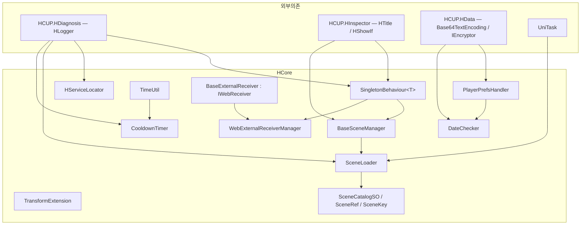
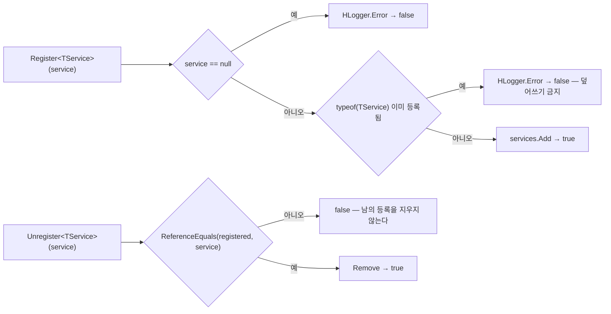
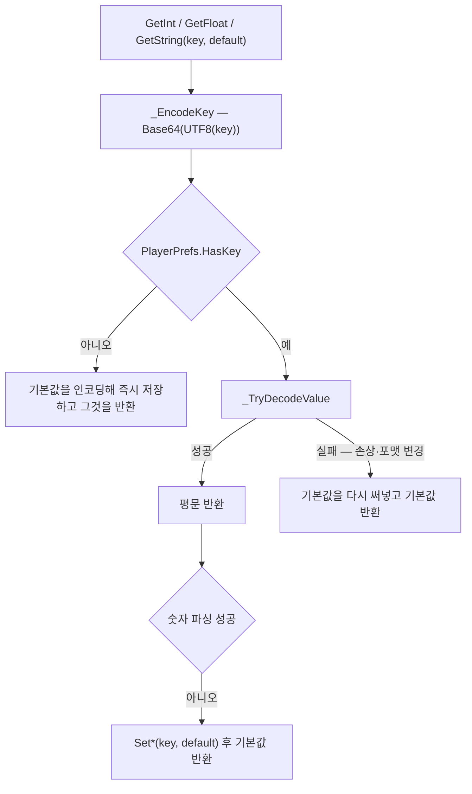
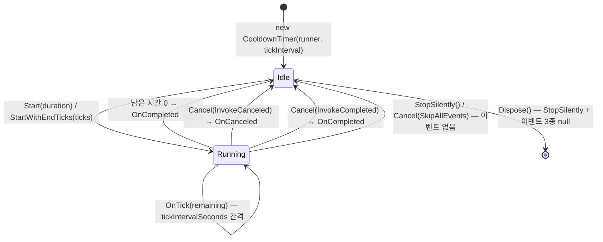
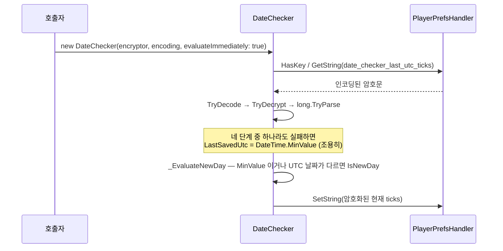
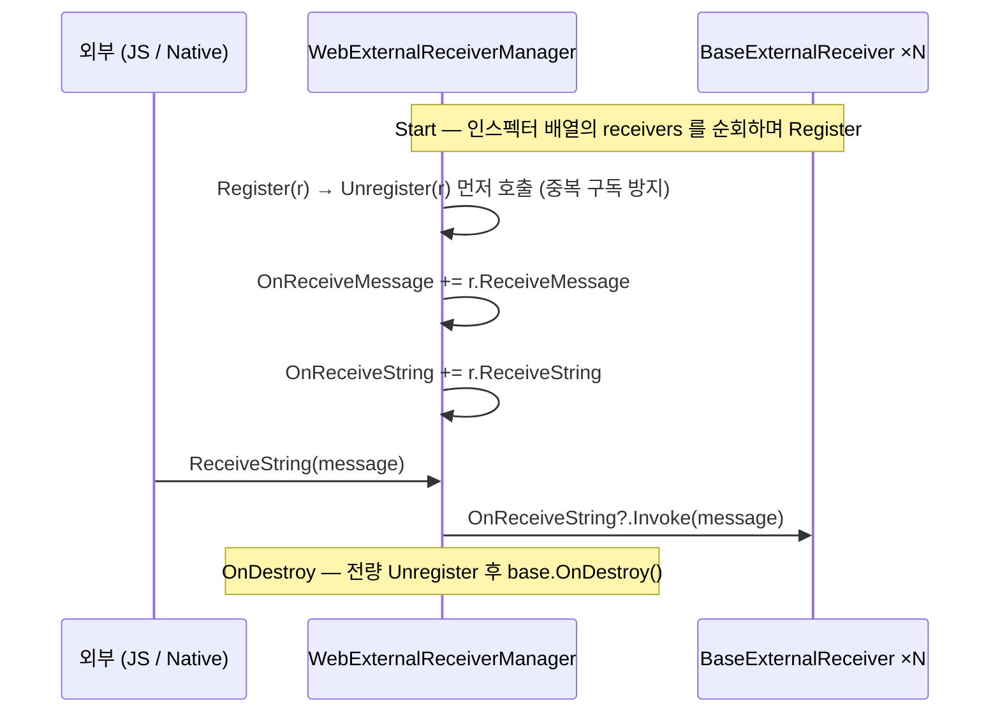

# HCUP.HCore

> 어셈블리: `HCUP.HCore` (`Runtime/HCUP.HCore.asmdef`, rootNamespace `HCore`)
> 의존: `HCUP.HData`, `HCUP.HDiagnosis`, `HCUP.HInspector`, `HCUP.HUtil`, `UniTask`, `UniTask.Addressables`, `Unity.Addressables`, `Unity.ResourceManager`
> 동반 어셈블리: 없음 (Editor 어셈블리 없음)

---

## 요약

HCore 는 **패키지의 나머지 전부가 딛고 서는 기반 어셈블리**다. 하나의 시스템이 아니라 네 갈래의
독립 묶음이며, 서로를 거의 참조하지 않는다.

| 묶음 | 파일 | 성격 | 문서 |
|---|---|---|---|
| **Core** | 4 / 410행 | 싱글톤 기반 타입, 서비스 로케이터, PlayerPrefs 래퍼, Transform 확장 | 이 문서 + [SingletonBehaviour](../docs/SingletonBehaviour.md) |
| **Scene** | 6+1 / 612행 | `SceneKey` 기반 씬 전환 시스템 | [Scene.md](../docs/Scene.md) |
| **Time** | 3 / 433행 | UTC 기준 쿨타임·날짜 판정·시간 포맷 | 이 문서 |
| **Web** | 3 / 97행 | 외부(WebGL/Native) 메시지 수신 배선 | 이 문서 |

**분리 기준은 "독립적으로 이해·사용되는 덩어리인가" 다.** Scene 은 자체 데이터 모델(카탈로그)과
비동기 흐름·정적 상태 계약을 가진 시스템이라 별도 문서로 뺐다. `SingletonBehaviour<T>` 는 코드가
40행뿐이지만 패키지 12종 이상이 상속하고 **계약 위반이 반복 결함의 원인**이라 별도 문서로 뺐다.
Time·Web 은 상호 의존 없는 유틸리티 묶음이라 이 문서 안의 절로 둔다.

---

## 파일 지도

| 경로 | 행수 | 역할 |
|---|---|---|
| `Core/SingletonBehaviour.cs` | 87 | `MonoBehaviour` 싱글톤 기반 타입. **패키지 전역 의존** |
| `Core/HServiceLocator.cs` | 106 | 타입 키 정적 서비스 레지스트리. `SubsystemRegistration` 리셋 |
| `Core/PlayerPrefsHandler.cs` | 172 | Base64 키·값 인코딩 `PlayerPrefs` 래퍼. 손상 시 기본값 복구 |
| `Core/TransformExtension.cs` | 45 | `Transform.DestroyAllChildren()` 확장 |
| `Scene/SceneLoader.cs` | 304 | 씬 로드/언로드/재로드 정적 진입점 → [Scene.md](../docs/Scene.md) |
| `Scene/BaseSceneManager.cs` | 101 | `SingletonBehaviour` 파사드 + `SceneLoader.Initialize` |
| `Scene/ISceneControl.cs` | 60 | 씬 제어 계약 (`UniTask<bool>` 반환 규약) |
| `Scene/SceneCatalogSO.cs` | 83 | `SceneKey → 씬 이름` 매핑 SO |
| `Scene/SceneRef.cs` | 37 | `SceneAsset` ↔ `sceneName` 동기화 |
| `Scene/SceneKey.cs` | 27 | 씬 식별 enum |
| `Scene/Demo/SceneTester.cs` | 19 | 데모. 대기 후 다음 씬 전환 |
| `Time/CooldownTimer.cs` | 180 | 코루틴 기반 UTC 쿨타임 타이머 |
| `Time/DateChecker.cs` | 141 | UTC 날짜 변경 판정 + 암호화 저장 |
| `Time/TimeUtil.cs` | 112 | 남은 시간 계산·포맷·UTC 날짜 비교 확장 메서드 |
| `Web/WebExternalReceiverManager.cs` | 62 | 외부 메시지 브로드캐스트 싱글톤 |
| `Web/BaseExternalReceiver.cs` | 17 | 수신 컴포넌트 기반 클래스 |
| `Web/IWebReceiver.cs` | 18 | 수신 계약 (`ReceiveMessage` / `ReceiveString`) |

---

## 계층 구조



**HCore 내부의 실제 결합은 다섯 줄뿐이다** — `SingletonBehaviour → BaseSceneManager / WebExternalReceiverManager`,
`BaseSceneManager → SceneLoader`, `TimeUtil → CooldownTimer`, `PlayerPrefsHandler → DateChecker`.
나머지는 서로 모른다.

---

## Core — 기반 타입

### SingletonBehaviour&lt;T&gt;

패키지 전역이 상속하는 기반 타입이다. `Awake`/`OnDestroy` 의 정확한 계약, 파생 클래스가 지켜야 할
`base` 호출 규약, 중복 인스턴스 파괴 시점은 **[../docs/SingletonBehaviour.md](../docs/SingletonBehaviour.md)** 에 있다.
요약하면 세 줄이다.

```csharp
protected override void Awake()     { base.Awake(); if (instance != this) return; /* 초기화 */ }
private void Start()                { if (instance != this) return; /* 초기화 */ }
protected override void OnDestroy() { /* 정리 */ base.OnDestroy(); }
```

`Destroy(gameObject)` 는 프레임 종료 시점 파괴 예약일 뿐이라 **중복 인스턴스의 `Start` 는 여전히
실행된다**(`SingletonBehaviour.cs:47-50`). `private void OnDestroy()` 로 선언하면 base 훅이 가려져
`instance` 가 영구 잔류한다(`:59-63`).

### HServiceLocator

`Dictionary<Type, object>` 하나로 된 정적 레지스트리다. `SingletonBehaviour` 의 정적 `Instance` 접근을
대체·보완하는 용도로 작성됐다(`HServiceLocator.cs:3-5`).



| 계약 | 근거 |
|---|---|
| 키는 **`TService` 제네릭 인자 타입**이지 인스턴스의 실제 타입이 아니다 | `:44` `services.Add(typeof(TService), service)` |
| 중복 등록은 거부된다. 교체는 `Unregister` 후 `Register` | `:39-42` |
| 인스턴스 인자 오버로드는 등록된 것과 동일할 때만 해제한다 | `:53-57` |
| `Get<T>()` 은 미등록 시 **에러 로그 + `null`**, `TryGet` 은 조용하다 | `:59-76` |
| Domain Reload 비활성 대응으로 `SubsystemRegistration` 에서 전량 clear | `:28-31` |

### PlayerPrefsHandler

키와 값을 모두 Base64 로 인코딩해 저장하는 `PlayerPrefs` 래퍼다. `HData.Encode.Base64TextEncoding` 에
prefix(`JPXKEY::` / `JPXVLU::`)를 붙여 쓴다(`:21-27`).



**`Get*` 는 읽기 전용이 아니다.** 키가 없으면 기본값을 그 자리에서 써넣는다
(`_GetOrCreateEncodedValue`, `:135-142`). 값이 깨졌거나 파싱에 실패해도 기본값으로 덮어쓴다
(`:144-151`, `:44-46`). "조회했더니 `HasKey` 가 참으로 바뀌어 있다" 가 정상 동작이다.

`Set*` 는 매 호출마다 `PlayerPrefs.Save()` 를 부른다(`:55, :78, :101`). 다량 저장 시 I/O 비용이 있다.
**Base64 는 난독화이지 암호화가 아니다** — 값 보호가 필요하면 `DateChecker` 처럼
`HData.Encrypt.IEncryptor` 를 한 겹 더 씌운다.

### TransformExtension

```csharp
// Core/TransformExtension.cs:13-24 — 컴파일 심볼이 아니라 런타임 판정이다
if (Application.isPlaying) Object.Destroy(...);
else                        Object.DestroyImmediate(...);
```

`#if UNITY_EDITOR` 가 아니라 `Application.isPlaying` 으로 가르는 것이 핵심이다. 에디터 플레이 모드에서
`DestroyImmediate` 를 쓰면 파괴 시점과 `OnDestroy` 순서가 빌드와 달라져 **빌드에서만 재현되는 버그**를
만든다(`:16-17` 주석). 역순(`childCount - 1 → 0`) 순회로 인덱스 이동을 피한다.

---

## Time

세 타입은 서로 독립적이며, `CooldownTimer` 만 `TimeUtil` 을, `DateChecker` 만 `PlayerPrefsHandler` 를
쓴다. **공통 기준은 `DateTime.UtcNow` 다** — `Time.time` 이 아니므로 앱을 껐다 켜도 경과가 유지되고,
일시정지(`Time.timeScale = 0`)의 영향을 받지 않는다.

### CooldownTimer

`MonoBehaviour` 하나를 코루틴 러너로 빌려 쓰는 `IDisposable` 타이머다.



| 항목 | 동작 | 근거 |
|---|---|---|
| 기준 시각 | `endUtcTicks` (UTC ticks 절대값) | `:39, :53` |
| Tick 간격 판정 | `Time.unscaledTime` — 일시정지 중에도 흐른다 | `:148-152` |
| `tickIntervalSeconds <= 0` | 매 프레임 Tick | `:144-146` |
| 재시작 | `StartWithEndTicks` 가 먼저 `StopSilently()` 를 부른다 | `:80` |
| dispose 후 사용 | `ObjectDisposedException` — **릴리즈에서도** fail-fast | `:91-94` |
| `runner == null` | 생성자에서 `ArgumentNullException` | `:58-60` |

`_ThrowIfDisposed` 가 `Assert` 대신 `HLogger.Throw` 인 이유는 주석에 있다 — Assert 는 릴리즈에서
제거되므로 dispose 후 사용이 조용히 통과한다(`:91`).

`StartWithEndTicks(endUtcTicks)` 는 서버가 준 만료 시각을 그대로 넣는 용도다. `Start(TimeSpan)` 은
`TimeUtil.StartCooldownTicks(DateTime.UtcNow, duration)` 로 ticks 를 만든 뒤 같은 경로를 탄다(`:73-74`).

### DateChecker

"오늘 처음 접속인가" 판정기다. 마지막 확인 시각을 **암호화 → 인코딩 → `PlayerPrefsHandler`** 순으로
저장한다(`:96-107`).



**복호화 실패는 예외가 아니라 "기록 없음"으로 처리된다**(`:121-135`). 저장 데이터가 손상되면
`IsNewDay` 가 참이 되어 보상이 한 번 더 지급될 수 있다 — 이 시스템은 클라이언트 판정이므로 서버
검증이 필요한 값에는 쓰지 않는다.

`ClearSavedStamp()` 는 저장을 지우고 `IsNewDay = true` 로 만든다(`:68-74`) — 테스트용 리셋 경로다.

### TimeUtil

전부 `static` 확장 메서드다. 상태가 없다.

| 메서드 | 반환 | 비고 |
|---|---|---|
| `GetRemaining(this DateTime utcNow, long ticks)` | `TimeSpan` | `ticks <= 0` 이면 `Zero` (`:23`) |
| `IsReady(this DateTime utcNow, long ticks)` | `bool` | 남은 시간 0 이하 |
| `FormatRemaining(this TimeSpan, ...)` | `string` | 포맷 문자열 주입 가능 |
| `FormatRemainingAuto(this TimeSpan)` | `string` | 1시간 미만 `mm:ss`, 이상 `hh:mm:ss` |
| `ToTime(this float)` / `ToTime(this float?)` | `string` | 초 → 시계 표기. `null` → 빈 문자열 |
| `FormatTimeMs(long \| float, format)` | `string` | **분:초:밀리초** — 시간 단위가 빠진다 |
| `StartCooldownTicks(this DateTime, TimeSpan)` | `long` | `utcNow + cooldown` 의 ticks |
| `IsSameUtcDate` / `IsTodayUtc` | `bool` | `Kind` 가 Utc 가 아니면 `ToUniversalTime()` 로 변환 |

`FormatRemaining` 계열은 음수 입력을 `TimeSpan.Zero` 로 클램프한다(`:36, :49, :66`).
날짜 비교 두 개는 `Kind` 를 스스로 보정하지만(`:101-102, :108`), `GetRemaining` 계열은 보정하지 않고
`Ticks` 를 그대로 뺀다(`:24`) — **로컬 시각을 넘기면 시차만큼 어긋난다.**

---

## Web

WebGL `SendMessage` 나 네이티브 브리지가 부르는 진입 지점을 한 곳으로 모으는 얇은 배선이다.



| 타입 | 역할 |
|---|---|
| `IWebReceiver` | `ReceiveMessage()` / `ReceiveString(string)` 두 개짜리 계약 |
| `BaseExternalReceiver` | `MonoBehaviour` + `IWebReceiver`. 두 메서드가 **빈 `virtual`** — 상속해서 채운다 |
| `WebExternalReceiverManager` | `SingletonBehaviour` 파생. 이벤트 두 개로 브로드캐스트 |

`Register` 가 먼저 `Unregister` 를 부르는 것(`:51`)이 중복 구독 방지 장치다. `OnDestroy` 는 구독을 전부
끊은 뒤 `base.OnDestroy()` 를 호출한다(`:41-46`) — [SingletonBehaviour 계약](../docs/SingletonBehaviour.md) 준수 예시다.

---

## 사용 예

```csharp
// 1) 싱글톤 정의 — base 호출 규약을 반드시 지킨다
public sealed class MyManager : SingletonBehaviour<MyManager> {
    protected override void Awake() { base.Awake(); if (instance != this) return; /* 초기화 */ }
    protected override void OnDestroy() { /* 정리 */ base.OnDestroy(); }
}

// 2) 서비스 로케이터 — 인터페이스로 등록하고 인스턴스 일치 해제
HServiceLocator.Register<IInventory>(this);
if (HServiceLocator.TryGet(out IInventory inv)) inv.Add(item);
HServiceLocator.Unregister<IInventory>(this);   // OnDestroy 에서

// 3) 설정 저장 — Get 은 키가 없으면 기본값을 써넣는다
PlayerPrefsHandler.SetFloat("Audio.BGM", 0.8f);
float bgm = PlayerPrefsHandler.GetFloat("Audio.BGM", 1f);

// 4) 쿨타임 — UTC 절대 시각 기준이라 앱을 껐다 켜도 이어진다
var timer = new CooldownTimer(this, tickIntervalSeconds: 0.5f);
timer.OnTick += remaining => label.text = remaining.FormatRemainingAuto();
timer.OnCompleted += () => button.interactable = true;
timer.Start(TimeSpan.FromMinutes(30));
// ...
timer.Dispose();   // 러너(this)가 파괴되기 전에

// 5) 씬 전환 → ../docs/Scene.md
await BaseSceneManager.Instance.LoadSceneAsync(SceneKey.Game, loadingKey: SceneKey.Loading);
```

---

## 주의할 점

### 계약

1. **`SingletonBehaviour` 파생은 `base.Awake()` + `instance != this` 가드, `base.OnDestroy()` 를
   반드시 지킨다.** 전체 계약은 [../docs/SingletonBehaviour.md](../docs/SingletonBehaviour.md).
2. **`HServiceLocator` 의 키는 제네릭 인자 타입이다**(`HServiceLocator.cs:44`).
   `Register(myImpl)` 로 타입 추론에 맡기면 구현 타입으로 등록되어 `Get<IMyService>()` 가 실패한다 —
   인터페이스로 조회할 거면 `Register<IMyService>(...)` 로 명시한다.
3. **`PlayerPrefsHandler.Get*` 는 부작용이 있다.** 키가 없거나 값이 깨지면 기본값을 저장한다
   (`:135-151`). 순수 조회가 필요하면 `HasKey` 를 먼저 본다.
4. **`CooldownTimer` 는 러너 `MonoBehaviour` 에 수명이 묶인다.** 러너가 비활성/파괴되면 코루틴이
   멈추고 `OnCompleted` 는 오지 않는다. 러너의 `OnDestroy` 에서 `Dispose()` 를 부르는 것이 규약이다.
5. **`TimeUtil.GetRemaining` / `StartCooldownTicks` 는 `Kind` 를 보정하지 않는다**(`:24, :95`).
   `DateTime.UtcNow` 를 넘겨야 한다. `IsSameUtcDate`/`IsTodayUtc` 만 스스로 변환한다(`:101-102, :108`).
6. **`DateChecker` 의 저장 손상은 조용히 "기록 없음"이 된다**(`:121-135`) → `IsNewDay == true`.
   일일 보상처럼 재현되면 곤란한 판정에는 서버 검증을 병행한다.

### 정리 대상

7. **`HServiceLocator` 는 패키지 내 호출처가 0건이다.** 정의 파일(`Core/HServiceLocator.cs`) 외
   `HServiceLocator` 문자열이 전 패키지 `.cs` 에서 검출되지 않는다. 설계상 `SingletonBehaviour` 의
   대체재로 만들어졌으나 아직 아무도 쓰지 않는다 — 채택하거나 제거하거나 결정이 필요하다.
8. **asmdef 참조 4건이 코드에 근거가 없다.** `Unity.Addressables`, `Unity.ResourceManager`,
   `UniTask.Addressables`, `HCUP.HUtil` — HCore 전체 `.cs` 에 `Addressables` / `HUtil` 식별자가 0건이다
   (`HCUP.HCore.asmdef:4-12`). **HCore 를 참조하는 모든 어셈블리에 Addressables 패키지 의존을
   전파**하므로 제거 후보다. 실제로 쓰이는 것은 `HCUP.HData`(`PlayerPrefsHandler`, `DateChecker`),
   `HCUP.HDiagnosis`, `HCUP.HInspector`, `UniTask`(Scene) 넷이다.
9. **`CooldownTimer.cancelBehavior` 필드는 쓰이지 않는다.** `:40` 선언, `:83` 대입뿐이고 읽는 곳이
   없다. `Cancel(behavior)` 는 항상 인자를 쓰고(`:97-104`), 자연 완료는 `SkipAllEvents` 하드코딩이다
   (`:139`). "Start 때 정한 취소 정책" 이 의도였다면 미구현이고, 아니라면 필드 자체가 죽은 코드다.
10. **`WebExternalReceiverManager` 는 사용처가 0건이고 null 방어가 없다.**
    `Start`(`:35-39`)와 `OnDestroy`(`:41-46`)가 `receivers` 배열을 무조건 순회한다 — 인스펙터 슬롯을
    비워두면 `NullReferenceException`, 원소가 비어 있으면 `Register` 안에서 터진다(`:52`).
    또 `base.Awake()` 후 `instance != this` 가드가 없어 **중복 인스턴스도 `Start` 에서 구독을 건다**.
11. **`Demo/` 가 Runtime 폴더 안에 있다.** `SceneTester.cs` 와 `Test1~3.unity`, `TestScenes.asset` 이
    빌드에 포함된다. 상세는 [Scene.md](../docs/Scene.md) "정리 대상" 10번.
13. **`SceneCatalogSO` 만 `UnityEngine.Debug` 를 직접 쓴다**(`SceneCatalogSO.cs:54, 60, 66`).
    나머지 HCore 파일은 전부 `HLogger` 경유다.

---

## 확장 지점

| 하고 싶은 것 | 손댈 곳 |
|---|---|
| 전역 접근 매니저 추가 | `SingletonBehaviour<T>` 상속 + [계약 체크리스트](../docs/SingletonBehaviour.md) 준수 |
| 정적 `Instance` 대신 DI 로 전환 | `HServiceLocator` 채택 — `Register` 는 제공측 `Awake`, `Unregister` 는 `OnDestroy` |
| 저장 값 암호화 강화 | `PlayerPrefsHandler` 위에 `HData.Encrypt.IEncryptor` 를 얹는다 (`DateChecker` 가 선례) |
| 시간 표기 포맷 변경 | `TimeUtil.FormatRemaining` 의 포맷 인자, 또는 `FormatRemainingAuto` 복제 |
| 쿨타임을 서버 시각 기준으로 | `CooldownTimer.StartWithEndTicks(serverEndUtcTicks)` |
| 씬 전환 커스터마이즈 | [Scene.md](../docs/Scene.md) 확장 지점 표 |
| 외부 메시지 수신 | `BaseExternalReceiver` 상속 후 `WebExternalReceiverManager.receivers` 에 등록 |
