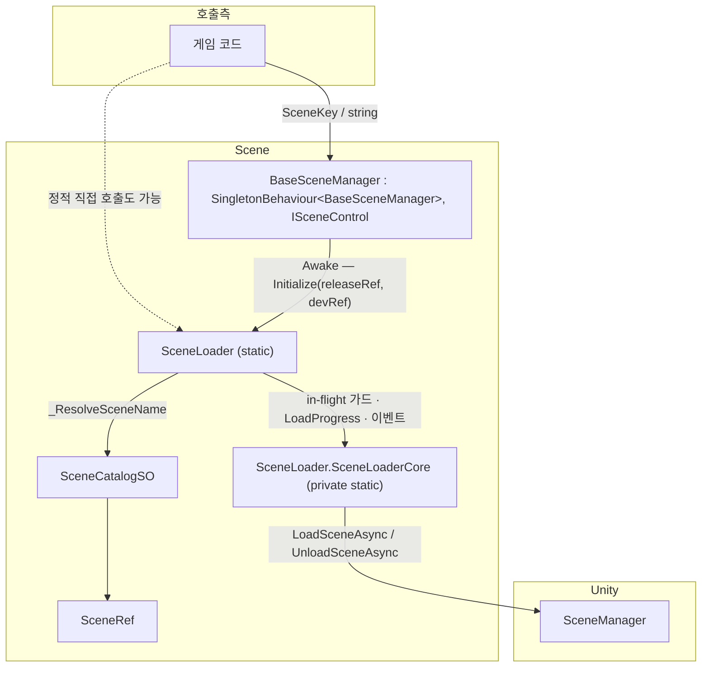
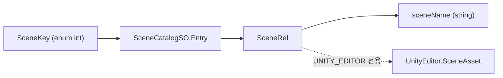
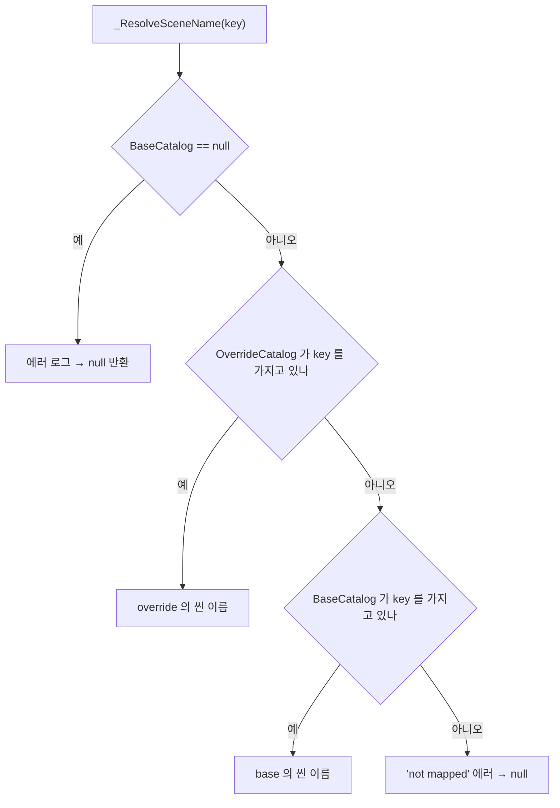
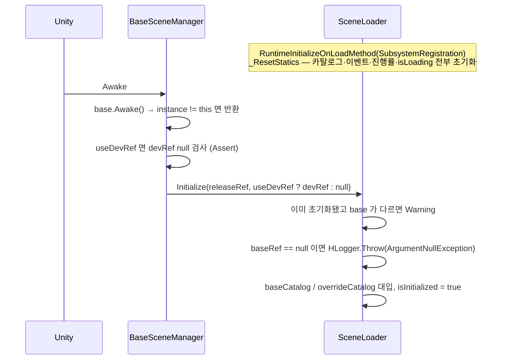
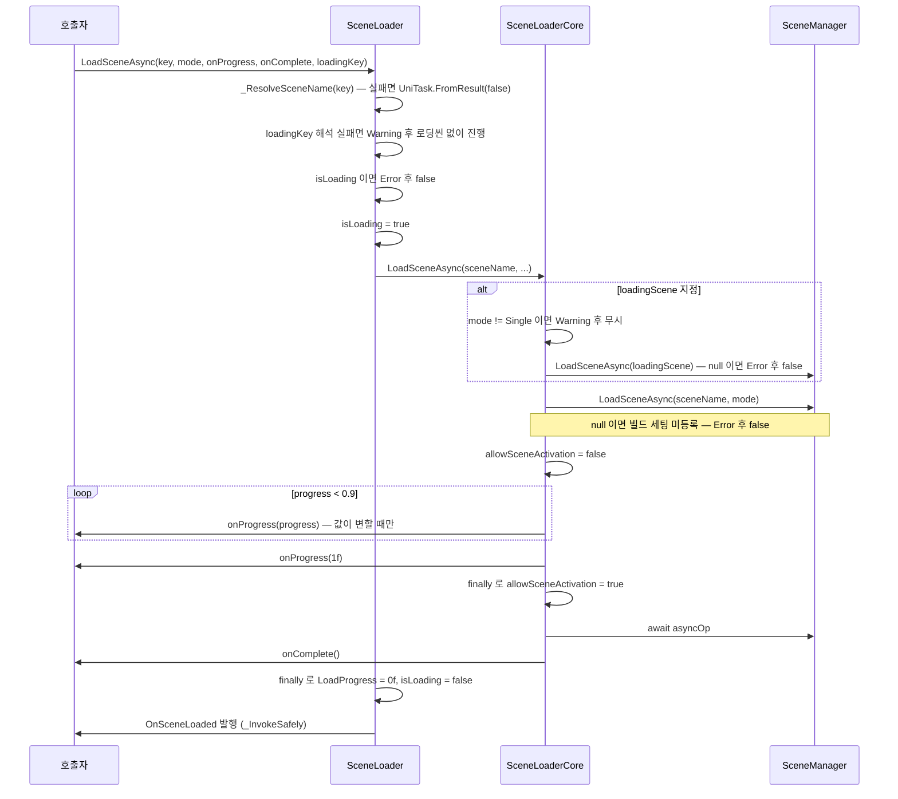
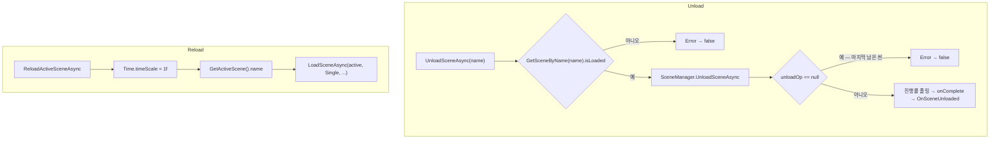

# Scene — 씬 전환 시스템

> 소속: `HCUP.HCore` (`Runtime/Scene/`, 6파일 + Demo 1파일 / 612행)
> 진입점: `SceneLoader`(정적) / `BaseSceneManager`(컴포넌트 파사드)

---

## 요약

씬 전환 계층은 **문자열 씬 이름을 `SceneKey` enum 뒤로 숨기고, 모든 API 가 `UniTask<bool>` 을
반환하는 구조**다. `bool` 은 "요청이 실제로 수행되었는가" 를 뜻하며, 매핑 실패·미등록 씬·중복 로드
요청·언로드 대상 부재를 호출자가 전부 구분할 수 있다(`ISceneControl.cs:10-13`).

세 가지 규약이 설계의 중심이다.

1. **상태는 정적이다.** 카탈로그·진행률·in-flight 플래그가 전부 `SceneLoader` 의 정적 필드다.
   그래서 `SubsystemRegistration` 리셋 훅이 필수다(`SceneLoader.cs:158-167`).
2. **동시 로드는 거부한다.** 정적 `LoadProgress` 와 Unity 의 씬 활성화가 동시 로드를 표현하지
   못하므로 두 번째 요청을 `false` 로 반려한다(`SceneLoader.cs:123-128, 223-226`).
3. **정리 이벤트는 구독자 예외를 격리한다.** 멀티캐스트 델리게이트의 "일부만 정리되고 중단" 을
   막는다(`SceneLoader.cs:272-284`).

---

## 파일 지도

| 경로 | 역할 |
|---|---|
| `SceneLoader.cs` (304) | 실제 로드/언로드/재로드. 정적 상태·in-flight 가드·이벤트 발행 |
| `BaseSceneManager.cs` (101) | `SingletonBehaviour` 파사드. `SceneLoader.Initialize` 호출 + 6개 API 위임 |
| `ISceneControl.cs` (60) | 씬 제어 계약. `UniTask<bool>` 반환 규약의 근거 문서 |
| `SceneCatalogSO.cs` (83) | `SceneKey → 씬 이름` 매핑 ScriptableObject |
| `SceneRef.cs` (37) | `SceneAsset`(에디터) ↔ `sceneName`(런타임) 동기화 |
| `SceneKey.cs` (27) | 씬 식별 enum. 프로젝트마다 수정 대상 |
| `Demo/SceneTester.cs` (19) | 대기 후 다음 씬 전환. 데모 씬 3종 동봉 |

---

## 계층 구조



`SceneLoader` 는 정적이므로 `BaseSceneManager` 없이도 문자열 API 를 쓸 수 있다. 다만 **`SceneKey` API
는 `Initialize` 로 카탈로그가 주입돼 있어야 성립**한다(`SceneLoader.cs:286-291`).

---

## 데이터 모델



`SceneRef` 는 에디터에서 `SceneAsset` 참조를 들고 있다가 `SyncNameFromAsset()` 으로 `sceneName` 필드에
이름을 굽는다(`SceneRef.cs:31-34`). 굽는 시점은 `SceneCatalogSO.OnValidate`(`SceneCatalogSO.cs:76-79`)
— 인스펙터에서 값이 바뀔 때다. **빌드에는 `sceneName` 문자열만 남는다.**

### 카탈로그 인덱싱

`TryResolve` 최초 호출 시 `entries` 를 `Dictionary<SceneKey, string>` 으로 굽고 캐시한다
(`SceneCatalogSO.cs:47-71`). 편집 실수는 조용히 넘기지 않는다.

| 상황 | 처리 | 근거 |
|---|---|---|
| `Entry.Scene == null` | 에러 로그 후 스킵 | `SceneCatalogSO.cs:53-56` |
| `SceneRef.SceneName` 이 빈 문자열 | 에러 로그 후 스킵 | `:59-62` |
| `SceneKey` 중복 | 에러 로그 후 **last-wins 로 덮어씀** | `:65-69` |

첫 두 케이스를 조용히 스킵하면 `SceneLoader` 가 "매핑되지 않음" 으로 오진한다 — 실제 원인은 깨진
`SceneRef` 다. 그래서 로그를 남긴다(`:51` 주석).

### 카탈로그 이중화 — base / override



`BaseSceneManager` 는 `UNITY_EDITOR || DEBUG` 에서만 `useDevRef` 토글과 `devRef` 슬롯을 노출하고,
켜져 있으면 `devRef` 를 override 로 넘긴다(`BaseSceneManager.cs:31-51`). 릴리즈 빌드에서는 필드 자체가
컴파일되지 않아 override 는 항상 `null` 이다.

---

## 흐름 1 — 초기화



**`Initialize` 는 재초기화를 허용한다**(`SceneLoader.cs:136-147`). 씬 재로드로 매니저가 교체되면 새
카탈로그로 갈아끼워져야 하기 때문이다. 종전에는 첫 호출만 살아남아 새 씬의 카탈로그가 조용히
무시됐다. 지금은 base 카탈로그가 바뀌는 경우 경고만 남기고 교체한다.

**`baseRef` 가 `null` 이면 예외를 던진다**(`:141-144`). `HLogger.Throw` 는 기본값 `doThrow: true` 로
실제로 `throw` 하므로 뒤의 `return` 은 도달하지 않고, 예외는 `BaseSceneManager.Awake` 밖으로 나간다.

`_ResetStatics`(`:158-167`)가 `OnSceneLoaded` / `OnSceneUnloaded` 를 `null` 로 되돌리는 이유는 Domain
Reload 비활성(Enter Play Mode Options) 환경에서 **이전 플레이 세션의 구독자가 잔존**하기 때문이다.
`isLoading` 도 함께 리셋된다 — 로드 중 플레이를 멈추면 `true` 로 고착돼 다음 플레이의 모든 로드가
거부되던 상태를 막는다.

---

## 흐름 2 — 로드



핵심 세 가지가 전부 `SceneLoaderCore.LoadSceneAsync`(`:24-75`)에 있다.

1. **`finally` 로 `allowSceneActivation = true` 를 보장한다**(`:68-70`). `onProgress` 는 사용자 코드고,
   예외가 이 구간을 빠져나가면 플래그가 `false` 로 남아 **이후 모든 씬 전환이 영구 정지**한다.
2. **진행률 중복 호출을 억제한다**(`:56-63`). `allowSceneActivation = false` 때문에 `progress` 는 0.9 에서
   멈추는데, 종전에는 그 구간에서 매 프레임 같은 값으로 콜백이 불렸다.
3. **`SceneManager.LoadSceneAsync` 가 `null` 을 반환하는 경우를 잡는다**(`:46-50`). 빌드 세팅 미등록
   씬이면 Unity 는 자체 오류만 남기고 `null` 을 준다.

`onProgress` 는 `SceneLoader` 가 한 겹 감싸서 `LoadProgress` 정적 프로퍼티에도 반영한다
(`:234-237`). 완료 후 `LoadProgress` 는 `1f` 가 아니라 **`0f`(유휴)로 되돌아간다**(`:242-243`).

---

## 흐름 3 — 언로드 / 재로드 / 이벤트



재로드가 `Time.timeScale = 1f` 를 무조건 대입하는 것은 의도다(`:264-265`). 종전에는 1 미만만
보정해 **배속(>1) 상태가 새 씬으로 이월**됐다.

### 이벤트 예외 격리

```csharp
// SceneLoader.cs:272-284
// 멀티캐스트 델리게이트는 구독자 하나가 던지면 뒤 구독자를 호출하지 않는다.
// 정리(clean-up) 성격의 이벤트에서 "일부만 정리되고 중단" 은 최악의 반쪽 상태다.
private static void _InvokeSafely(Action handlers, string eventName) {
    if (handlers == null) return;
    foreach (Action handler in handlers.GetInvocationList()) {
        try { handler(); }
        catch (Exception e) { HLogger.Error($"[SceneLoader] {eventName} subscriber threw: {e}"); }
    }
}
```

`OnSceneLoaded` 는 **로드가 성공했을 때만** 발행된다(`:247`). 로딩 씬 자체의 로드에는 발행되지 않는다.

---

## 사용 예

```csharp
// 1) 부트스트랩 씬에 BaseSceneManager 를 두면 Awake 에서 SceneLoader.Initialize 가 끝난다.

// 2) SceneKey 로 전환 — 로딩 씬을 끼워 넣는다
bool ok = await BaseSceneManager.Instance.LoadSceneAsync(
    SceneKey.Game,
    LoadSceneMode.Single,
    onProgress: p => progressBar.value = p,
    loadingKey: SceneKey.Loading);
if (!ok) { /* 매핑 실패 · 미등록 · 중복 요청 중 하나 */ }

// 3) 정리 훅 — 씬 언로드 직전 자원 반납 등
SceneLoader.OnSceneUnloaded += _ReleaseSceneAssets;

// 4) 추가 로드 씬 내리기
await BaseSceneManager.Instance.UnloadSceneAsync(SceneKey.InGameTutorial);
```

`loadingKey` 는 `LoadSceneMode.Single` 에서만 동작한다. Additive 에 넘기면 경고 후 무시된다
(`SceneLoader.cs:31-34`).

---

## 주의할 점

### 계약

1. **`SceneKey` API 는 `Initialize` 이후에만 쓸 수 있다.** `BaseCatalog` 가 `null` 이면 에러 로그 후
   `null` 반환 → `false`(`SceneLoader.cs:286-291`). 문자열 API 는 카탈로그 없이도 동작한다.
2. **동시 로드는 거부된다.** 두 번째 `LoadSceneAsync` 는 `false` 를 받는다(`:223-226`). 이 가드는
   **문자열 `LoadSceneAsync` 에만** 있다 — `UnloadSceneAsync` 는 로드 중에도 그대로 진행된다.
3. **`loadingScene` 로드는 `Single` 모드다.** 지정하면 현재 씬이 먼저 언로드된다.
   로딩 화면의 종료 시점은 이 시스템이 결정하지 않는다 — 목표 씬 초기화를 끝낸 쪽이 내려야 한다
   (`SceneLoader.cs:8-9` 헤더).
4. **`Initialize(null)` 은 예외를 던진다**(`:141-144`). `BaseSceneManager` 의 `releaseRef` 슬롯을
   비워두면 `Awake` 에서 터진다.
5. **`onComplete` / `onProgress` 는 예외 격리되지 않는다.** `_InvokeSafely` 의 보호는 정적 이벤트
   두 개(`OnSceneLoaded` / `OnSceneUnloaded`)에만 적용된다.

### 정리 대상

6. **`SceneLoader.SetOverrideCatalog` 는 호출처가 0건이다**(`SceneLoader.cs:150`, 패키지 전역 grep
   결과 정의부와 자체 로그 문자열뿐). `BaseSceneManager` 도 `Initialize` 의 두 번째 인자만 쓴다.
7. **`ReloadActiveSceneAsync` 는 요청이 거부돼도 `Time.timeScale` 을 이미 바꿔 놓는다.**
   `Time.timeScale = 1f`(`:265`)가 in-flight 가드(`:223`)보다 먼저 실행되므로, 로드 중에 재로드를
   부르면 `false` 를 받으면서 배속만 초기화된다.
8. **`SceneCatalogSO` 는 `HLogger` 가 아니라 `UnityEngine.Debug.LogError` 를 직접 쓴다**
   (`SceneCatalogSO.cs:54, 60, 66`). `HCUP.HCore` 는 `HCUP.HDiagnosis` 를 참조하므로 다른 파일들처럼
   `HLogger` 로 통일할 수 있다. 현재는 이 세 로그만 `HLogger.OnLogPublished` 를 타지 않는다.
9. **`SceneCatalogSO` 의 인덱스는 런타임에 무효화되지 않는다.** `scenes = null` 리셋은
   `#if UNITY_EDITOR` 인 `OnValidate` 안에만 있다(`:74-81`). 런타임 중 `entries` 를 바꿔도 반영되지 않는다.
10. **`Demo/` 가 Runtime asmdef 폴더 안에 있다.** `SceneTester.cs` 와 테스트 씬 3종(`Test1~3.unity`),
    `TestScenes.asset` 이 빌드에 포함된다. `SceneTester` 는 전역 네임스페이스에 있고
    (`Demo/SceneTester.cs:5`) `HUtil/Samples~/SceneUtil/SceneTester.cs` 에 동일 이름 사본이 있다
    (Samples~ 는 컴파일되지 않아 충돌하지는 않는다). 또한 `LoadSceneAsync` 반환 `UniTask<bool>` 을
    `Forget()` 없이 버린다(`:17`).
11. **`BaseSceneManager` 는 `Assert` 를 쓴다**(`BaseSceneManager.cs:47`). `UNITY_EDITOR || DEBUG` 블록
    안이라 릴리즈에서는 블록째 사라지므로 실해는 없으나, 같은 상황을 `SceneLoader` 는 `HLogger` 로
    처리하고 있어 방식이 갈린다.
12. **`SceneKey` 는 패키지에 고정 값으로 들어 있다**(`SceneKey.cs:12-26`). 프로젝트마다 수정이
    전제된 enum 이 서브모듈 안에 있어, 값 추가가 서브모듈 커밋을 강제한다.

---

## 확장 지점

| 하고 싶은 것 | 손댈 곳 |
|---|---|
| 프로젝트 씬 목록 정의 | `SceneKey` enum + `SceneCatalogSO` 에셋 생성 (`HCUP/Scene/Scene Catalog`) |
| 개발용 씬 세트 분기 | `BaseSceneManager.useDevRef` + `devRef` (에디터·DEBUG 전용) |
| 로드 전후 자원 정리 | `SceneLoader.OnSceneLoaded` / `OnSceneUnloaded` 구독 |
| 로딩 화면 연출 | `onProgress` 콜백 또는 `SceneLoader.LoadProgress` 폴링 |
| 씬 전환 API 커스터마이즈 | `BaseSceneManager` 상속 후 `virtual` 6종 재정의 (`ISceneControl` 계약 유지) |
