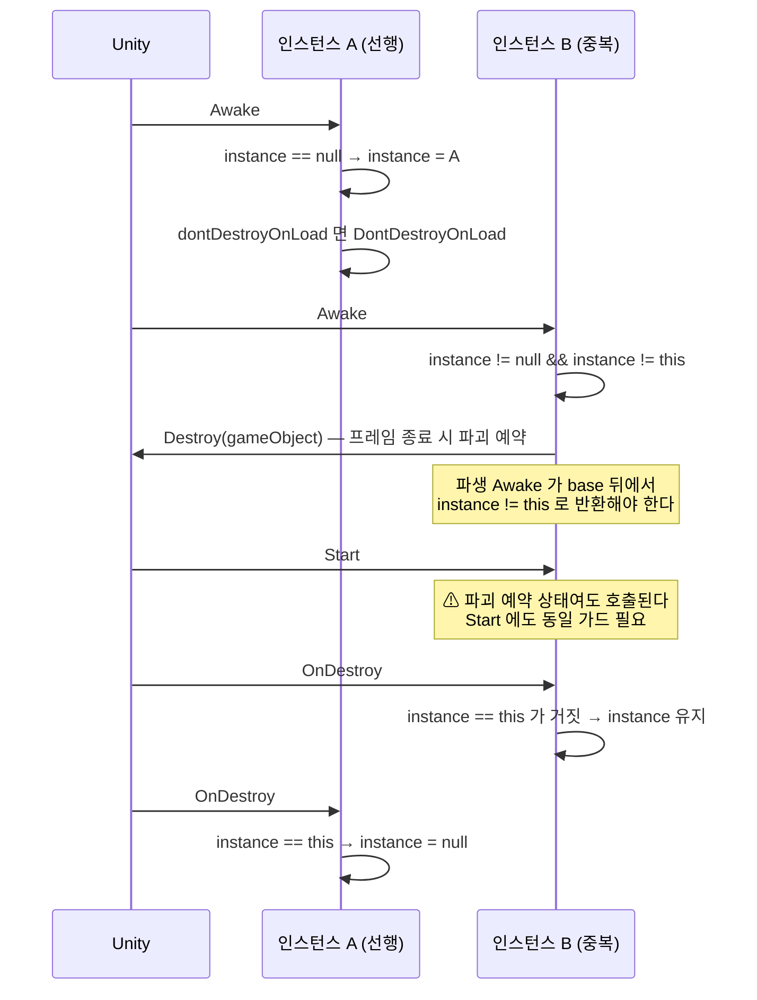

# SingletonBehaviour&lt;T&gt;

> 소속: `HCUP.HCore` (`Runtime/Core/SingletonBehaviour.cs`, 87행)
> 파생 클래스: 패키지 내 12종 이상 (`AudioManager`, `InitManager<TSelf>`, `PopupManager<T>`, `SpinnerManager`, `HLogConsole`, `DialogueManager`, `LocalizationManager`, `MapManager`, `SkillManager`, `CameraManager`, `WorldEventManager`, `BaseSceneManager`, `WebExternalReceiverManager`)

---

## 요약

`SingletonBehaviour<T>` 는 **정적 `instance` 필드 하나와 `Awake`/`OnDestroy` 두 훅으로만 구성된 최소 싱글톤**이다.
코드량은 40행이 안 되지만 패키지 전체가 여기에 걸려 있고, **파생 클래스의 `base` 호출 규약 위반이 이
패키지의 반복 결함 원인**이었다. 아래 계약은 추론이 아니라 코드 그대로다.

---

## 전체 코드 (계약 부분)

```csharp
// Runtime/Core/SingletonBehaviour.cs:23-63
public class SingletonBehaviour<T> : BehaviourBase where T : SingletonBehaviour<T> {
    [HTitle("Singleton")]
    [SerializeField] bool dontDestroyOnLoad;              // :26  인스펙터 옵션. 기본 false

    protected static T instance = null;                   // :28
    public static T Instance {                            // :29
        get {
            if (instance == null) {
                instance = FindFirstObjectByType(typeof(T)) as T;   // :32
                if (instance == null) { HLogger.Log("Instance is null"); return null; }  // :34
            }
            return instance;
        }
    }
    public static bool HasInstance => instance != null;   // :42

    protected virtual void Awake() {                      // :46
        if (instance != null && instance != this) {       // :47
            Destroy(gameObject);                          // :48  ← GameObject 통째로 파괴
            return;                                       // :49
        }
        instance = (T)this;                               // :52
        if (dontDestroyOnLoad) DontDestroyOnLoad(gameObject);  // :53-55
    }

    protected virtual void OnDestroy() {                  // :59
        if (instance == this) instance = null;            // :60-62  자기 자신일 때만 해제
    }
}
```

---

## 계약

### 1. 승자는 "먼저 `Awake` 한 쪽"이다

`Awake` 진입 시 `instance` 가 이미 비어 있지 않고 자신이 아니면 **자기 `gameObject` 를 파괴하고 즉시
반환한다**(`:47-50`). 이때 `instance` 는 건드리지 않는다. 즉 기존 인스턴스가 유지되고 신규가 죽는다.

파괴 대상이 **컴포넌트가 아니라 `gameObject` 전체**라는 점이 중요하다(`:48`). 싱글톤 컴포넌트를
다른 오브젝트에 곁다리로 붙이면 그 오브젝트의 무관한 컴포넌트까지 함께 사라진다.

### 2. `Destroy` 는 즉시가 아니다 — 중복 인스턴스의 `Start` 는 여전히 실행된다

`Destroy(gameObject)` 는 프레임 종료 시점에 실제 파괴를 예약할 뿐이다. `Awake` 에서 파괴가 예약된
오브젝트도 같은 프레임의 `Start` 는 호출된다. **따라서 파생 클래스는 `base.Awake()` 호출 뒤
`instance != this` 를 직접 확인하고 초기화를 건너뛰어야 한다.**

```csharp
// 준수 예 — Scene/BaseSceneManager.cs:42-52
protected override void Awake() {
    base.Awake();
    // base 가 중복 인스턴스를 Destroy 한 경우 초기화를 진행하지 않는다 (InitManager 와 동일 규약).
    if (instance != this) return;
    ...
}
```

```csharp
// 준수 예 — HAudio/Runtime/AudioManager.cs:100-110
protected override void Awake() { base.Awake(); if (instance != this) return; ... }
private void Start()          { if (instance != this) return; ... }   // Start 에도 같은 가드
```

`AudioManager` 가 `Start` 에도 같은 가드를 둔 것(`AudioManager.cs:108`)이 이 항목의 직접적인 증거다.

### 3. `OnDestroy` 는 자기 자신일 때만 `instance` 를 지운다

`if (instance == this)` 검사(`:60`)가 없으면, 뒤늦게 파괴되는 중복 인스턴스가 살아 있는 정본의
`instance` 를 `null` 로 지운다. 이 검사가 그 사고를 막는다. **파생 클래스가 `OnDestroy` 를 재정의하면
반드시 `base.OnDestroy()` 를 호출해야 하며, 관례상 자신의 정리를 마친 뒤 마지막에 부른다.**

```csharp
// 준수 예 — HGame/Runtime/HGame/H2D/Map/MapManager.cs:83-94 (주석이 결함 이력을 남기고 있다)
// SingletonBehaviour 파생이므로 override + base 호출 — private 선언은 base 의 instance 정리를
// 숨겨(CS0114) 싱글톤 해제가 영구 미실행된다. 감사 P1-3 과 동일 결함 유형.
protected override void OnDestroy() { /* 구독 해제 */ base.OnDestroy(); }
```

**`private void OnDestroy()` 로 선언하면 `base` 의 `OnDestroy` 가 가려진다.** Unity 는 가장 파생된
`OnDestroy` 하나만 호출하므로 `instance` 가 영구히 해제되지 않고, 다음 씬에서 파괴된 오브젝트를
가리키는 `instance` 가 남는다. `Awake`/`OnDestroy` 는 **반드시 `protected override`** 여야 한다.

### 4. `dontDestroyOnLoad` 는 `Awake` 에서만 적용된다

기본값 `false`(`:26`). 인스펙터에서 켠 경우에만 `DontDestroyOnLoad(gameObject)` 가 호출된다(`:53-55`).
**`Instance` 게터를 통한 지연 발견 경로(`:32`)는 이 처리를 하지 않는다** — 발견된 오브젝트의 `Awake`
가 결국 실행되면서 적용되므로 최종 결과는 같지만, `Awake` 이전 프레임에는 적용돼 있지 않다.

### 5. `Instance` 게터는 비활성 오브젝트를 찾지 못한다

`FindFirstObjectByType(typeof(T))`(`:32`)는 기본 인자가 `FindObjectsInactive.Exclude` 다.
**비활성 GameObject 에 붙은 싱글톤은 발견되지 않고 `null` 이 반환된다.** 실패 시 로그는
`HLogger.Log`(Error 아님, `:34`)이고 타입명도 남기지 않아 원인 추적이 어렵다 — 정리 대상.

### 6. 정적 상태 리셋 훅이 없어도 되는 이유

`HServiceLocator`(`:28-31`)와 `SceneLoader`(`:158-167`)는 `SubsystemRegistration` 리셋 훅을 가지지만
`SingletonBehaviour` 에는 없다. `instance` 가 `UnityEngine.Object` 파생이라 **파괴된 인스턴스가 `== null`
비교에서 참**이 되고, `Awake`(`:47`)·`HasInstance`(`:42`)·`Instance`(`:31`)의 모든 판정이 그 연산자를
거치기 때문이다. Domain Reload 를 꺼도 잔존 참조가 스스로 무효화된다.

---

## 흐름 — 중복 인스턴스 처리



---

## 파생 클래스 체크리스트

| 항목 | 규약 |
|---|---|
| `Awake` 재정의 | `protected override`, 첫 줄 `base.Awake()`, 다음 줄 `if (instance != this) return;` |
| `Start` 정의 | 초기화가 있다면 `if (instance != this) return;` 로 시작 |
| `OnDestroy` 재정의 | `protected override`, 자기 정리 후 마지막에 `base.OnDestroy()` |
| `private void Awake/OnDestroy` | **금지.** base 훅이 가려져 `instance` 가 영구 잔류한다 |
| 싱글톤 컴포넌트 배치 | 전용 GameObject 에. 중복 시 `gameObject` 통째로 파괴된다 |
| 비활성 오브젝트 배치 | **금지.** `Instance` 게터가 찾지 못한다 |

---

## 정리 대상

1. **`Instance` 실패 로그가 `HLogger.Log` 이고 타입명이 없다**(`SingletonBehaviour.cs:34`).
   `HLogger.Error($"[Singleton] {typeof(T).Name} instance not found.")` 가 맞다.
2. **`base.Awake()` 만 부르고 `instance != this` 가드가 없는 파생이 있다.**
   `HUI/Runtime/HUI/DebugConsole/HLogConsole.Lifecycle.cs:7-16` 은 `base.Awake()` 뒤에 곧바로
   `_InitializePanelState()` / `_RefreshVisibleEntries()` 를 호출한다 — 중복 인스턴스에서도 실행된다.
3. **`ODIN_INSPECTOR` 정의 시 base 타입이 `Sirenix.OdinInspector.SerializedMonoBehaviour` 로 바뀌지만**
   (`:13-17`) `HCUP.HCore.asmdef` 에 `versionDefines` 도 Odin 참조도 없다. Odin 이 auto-reference 되는
   precompiled 플러그인으로 설치돼 있을 때만 컴파일된다(`overrideReferences: false` 라 성립).
   패키지 차원의 후속 과제로 `docs/2026-08-04_ModuleStatus.md` 에 기록돼 있다.
