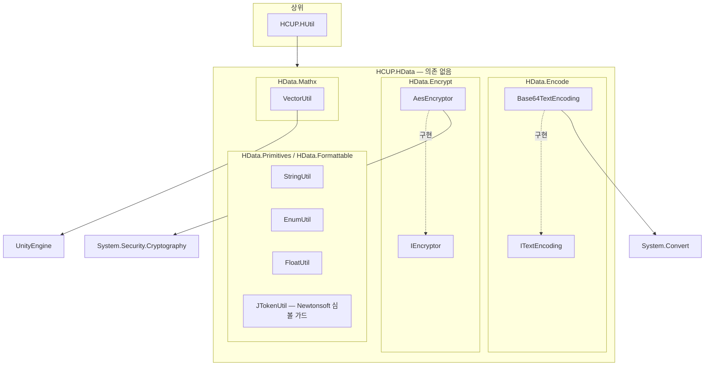
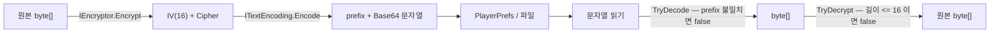

# HCUP.HData

> 어셈블리: `HCUP.HData` (`Runtime/HCUP.HData.asmdef`, rootNamespace `HData`)
> 의존: **없음** (`references: []`)
> 동반 어셈블리: 없음 (Editor 어셈블리 없음)

---

## 요약

HData 는 **의존이 하나도 없는 최하위 유틸 어셈블리**다. `HCUP.HUtil` 이 이 어셈블리를
참조하며, 그 위로 대부분의 패키지가 간접 의존한다.

내용물은 서로 관계가 없는 네 도메인이고, 공통점은 "상태를 갖지 않는다" 는 것뿐이다.

| 네임스페이스 | 성격 | 파일 |
|---|---|---|
| `HData.Encode` | 인터페이스 + 구현 1종 | `ITextEncoding` / `Base64TextEncoding` |
| `HData.Encrypt` | 인터페이스 + 구현 1종 | `IEncryptor` / `AesEncryptor` |
| `HData.Mathx` | 정적 확장 | `VectorUtil` |
| `HData.Primitives` / `HData.Formattable` | 정적 확장 | `EnumUtil` / `FloatUtil` / `JTokenUtil` / `StringUtil` |

**네임스페이스와 폴더가 한 곳에서 어긋난다** — `Primitives/StringUtil.cs` 의 네임스페이스는
`HData.Formattable` 이다 (`StringUtil.cs:21`).

---

## 파일 지도

| 경로 | 행수 | 네임스페이스 | 역할 |
|---|---|---|---|
| `Encode/ITextEncoding.cs` | 32 | `HData.Encode` | `Encode(byte[])` / `TryDecode(string, out byte[])` 계약 |
| `Encode/Base64TextEncoding.cs` | 82 | `HData.Encode` | prefix 붙은 Base64 인코딩 |
| `Encrypt/IEncryptor.cs` | 24 | `HData.Encrypt` | `Encrypt(byte[])` / `TryDecrypt(byte[], out byte[])` 계약 |
| `Encrypt/AesEncryptor.cs` | 117 | `HData.Encrypt` | AES-CBC/PKCS7. IV 를 payload 앞에 붙임 |
| `Mathx/VectorUtil.cs` | 61 | `HData.Mathx` | RectTransform 랜덤 위치 / 스크린 좌표 / 각도→방향 |
| `Primitives/EnumUtil.cs` | 17 | `HData.Primitives` | `GetValues<T>()` 한 개 |
| `Primitives/FloatUtil.cs` | 17 | `HData.Primitives` | `MidAngleDegree` 한 개 |
| `Primitives/JTokenUtil.cs` | 38 | `HData.Primitives` | Newtonsoft `JToken` 확장 — **컴파일되지 않는다** (아래 참조) |
| `Primitives/StringUtil.cs` | 160 | `HData.Formattable` | 쿼리 파싱 / Base64 / 숫자·시간 포맷 / 필터 |

---

## 계층 구조



`Encode` 와 `Encrypt` 는 **서로를 모른다.** "암호화 후 Base64 로 저장" 파이프라인은
상위 계층(`HCUP.HUtil` 등)에서 두 인터페이스를 조합해 만들어야 한다.

---

## 저장 파이프라인 (의도된 조합)



**두 인터페이스 모두 "쓰기는 예외, 읽기는 `Try`" 형태다.** `Encode` / `Encrypt` 는 실패를
예외로 알리고, `TryDecode` / `TryDecrypt` 는 `bool` 로 알린다. 저장된 데이터가 손상됐을 때
게임을 죽이지 않기 위한 비대칭이다.

### AesEncryptor 의 payload 규격

```csharp
// Encrypt/AesEncryptor.cs:54-56 (Encrypt 본문)
var payload = new byte[aes.IV.Length + cipher.Length];   // IV(16) + CIPHER
Buffer.BlockCopy(aes.IV, 0, payload, 0, aes.IV.Length);
Buffer.BlockCopy(cipher, 0, payload, aes.IV.Length, cipher.Length);
```

| 항목 | 값 | 근거 |
|---|---|---|
| 모드 | CBC + PKCS7 | `:47-48` |
| 키 유도 | `SHA256(UTF8(pepper))` → 32 byte | `:92-95` |
| IV | 매 `Encrypt` 마다 `GenerateIV()` — payload 앞 16 byte | `:50`, `:55-56` |
| 복호 실패 판정 | `cipher == null \|\| cipher.Length <= 16` → `false` | `:65` |

**같은 평문을 두 번 암호화하면 결과가 다르다** (IV 가 매번 새로 생성되므로). 암호문 비교로
동일성을 판정하면 안 된다.

### Base64TextEncoding 의 prefix

```csharp
// Encode/Base64TextEncoding.cs:43-46 (TryDecode 본문 일부)
if (!string.IsNullOrEmpty(prefix)) {
    if (!text.StartsWith(prefix, StringComparison.Ordinal)) return false;
    text = text.Substring(prefix.Length);
}
```

prefix 는 **데이터 형식 식별자**다. 다른 시스템이 쓴 문자열을 실수로 디코딩하는 것을
`TryDecode` 단계에서 막는다. `prefix` 는 생성자에서 `?? string.Empty` 로 정규화된다
(`:24`).

---

## StringUtil

가장 많이 쓰이는 파일이고, 두 지점에 함정이 있다.

| 구역 | API | 행 |
|---|---|---|
| 쿼리 파싱 | `ParseQueryString` | `:24-40` |
| Base64 | `EncodeStringToBase64` / `DecodeBase64ToString` | `:43-54` |
| 숫자 포맷 | `FormatNumber<T>` / `NumToAlpha<T>` | `:61-90` |
| 시간 포맷 | `ToClock(float)` / `ToClock(TimeSpan)` | `:94-105` |
| 필터 | `FilterText` | `:109-121` |
| 개행 검사 | `IsMultiLine` | `:124-130` |

**`NumToAlpha` 의 단위 경계가 1,000 이 아니라 10,000 이다.**

```csharp
// Primitives/StringUtil.cs:85-88 — 마지막 분기가 10_000 이다
else if (num >= 10_000)
    return $"{Format(num / 1_000.0):0.0}" + (useKoreanUnit ? "천" : "K");
return num.ToString("0");
```

결과적으로 `1,000` ~ `9,999` 구간은 축약되지 않고 `"9999"` 처럼 그대로 나오고, `10,000` 은
`"10.0K"` / `"10.0천"` 이 된다. 영문 K 기준으로는 의도된 경계일 수 있으나, 한국어 단위로는
10,000 이 "만" 이므로 `"10.0천"` 은 어색하다.

`ToClock` 은 1시간 미만이면 `MM:SS`, 이상이면 `HH:MM:SS` 로 형식 자체가 바뀐다 (`:99`).
UI 폭이 고정된 곳에서는 이 전환을 고려해야 한다.

---

## 사용 예

```csharp
// 1) 암호화 + 인코딩 조합 — 두 인터페이스는 서로를 모르므로 호출측이 엮는다
IEncryptor encryptor = new AesEncryptor("my-pepper");
ITextEncoding encoding = new Base64TextEncoding("SAVE::");

string stored = encoding.Encode(encryptor.Encrypt(payloadBytes));
PlayerPrefs.SetString("Save.Slot0", stored);

// 2) 읽기 — 두 단계 모두 Try
if (encoding.TryDecode(PlayerPrefs.GetString("Save.Slot0"), out byte[] cipher)
    && encryptor.TryDecrypt(cipher, out byte[] plain)) {
    // plain 사용
}

// 3) 포맷
string gold  = 1_250_000.NumToAlpha();          // "1.2M"
string timer = 95f.ToClock();                   // "01:35"
Vector2 dir  = 90f.DegreeToDirection();         // (0, 1)
```

---

## 주의할 점

### 계약

1. **같은 `pepper` 문자열이 유지되어야 복호화된다** (`AesEncryptor.cs:16` 헤더). 키는
   `SHA256(pepper)` 로 유도되므로 pepper 를 바꾸면 기존 세이브가 전부 무효가 된다.
2. **`AesEncryptor.Encrypt` 는 IV 때문에 매번 다른 결과를 낸다** (`:50`). 암호문 동일성
   비교로 데이터 변경을 판정하면 안 된다.
3. **`Base64TextEncoding` 의 prefix 는 인코딩·디코딩 양쪽에서 같아야 한다.** prefix 가
   다른 인스턴스로 `TryDecode` 하면 `false` 를 반환한다 (`:44`).
4. **`ParseQueryString` 은 `=` 가 정확히 하나인 쌍만 받는다** (`:31` —
   `keyValue.Length == 2`). 값에 `=` 가 포함된 항목(Base64 패딩 등)은 조용히 버려진다.
5. **`ToClock` 은 음수를 0 으로 클램프한다** (`:95`, `Mathf.Max(0, ...)`). 남은 시간이
   음수여도 `"00:00"` 이지 음수 표기가 아니다.

### 정리 대상

6. **`Primitives/JTokenUtil.cs` 는 컴파일되지 않는다.** 파일 전체가 `#if Newtonsoft` 로
   감싸여 있는데(`:1`, `:39`), 이 심볼을 정의하는 곳이 없다 —
   `HCUP.HData.asmdef` 의 `versionDefines` 는 비어 있고 `references` 도 `[]` 라
   `Newtonsoft.Json` 어셈블리가 참조되지도 않는다. 심볼을 켜면 즉시 컴파일 에러가 난다.
   **살리려면 asmdef 에 `versionDefines`(`com.unity.nuget.newtonsoft-json` →
   `NEWTONSOFT_JSON`)와 `precompiledReferences` 를 추가해야 하고, 아니면 파일을 삭제해야
   한다.** 같은 패키지의 `HExcel` / `HUnityLocalization` 은 Newtonsoft 를 정상 참조하고
   있으므로 참고 대상이 된다.
7. **`Assert` 기반 인자 검사는 릴리즈에서 사라진다.** `Base64TextEncoding.Encode` 의 null
   검사(`:30-32`)와 `AesEncryptor` 의 pepper·plain 검사(`:33-35`, `:42-44`)는 전부
   `#if UNITY_ASSERTIONS` 다. 릴리즈 빌드에서 `Encode(null)` 은 `Assert` 없이
   `Convert.ToBase64String` 이 던지는 `ArgumentNullException` 으로 나간다.
8. ~~`VectorUtil.GetCanvasPosition` 은 캔버스 좌표를 반환하지 않는다~~ (`:33-34`).
   호출처 0건 확인 후 `GetScreenPosition` 으로 개명해 이름과 동작(World→Screen 변환)을
   일치시켰다 (2026-08-07 반영).
9. ~~`VectorUtil` 의 파라미터 명명이 컨벤션을 벗어난다~~ (`_target`, `_camera`) — 개명
   작업에서 `target`/`camera` 로 함께 정정 (2026-08-07 반영).
10. **`EnumUtil` / `FloatUtil` 은 메서드 1개짜리 파일이다** (17행씩). `Primitives` 하위에
    합치거나, 사용처를 확인해 제거 대상인지 판단할 여지가 있다.
11. **`StringUtil` 만 네임스페이스가 `HData.Formattable` 이다** (`:21`). 폴더는
    `Primitives/` 다. 폴더-네임스페이스 대응을 맞추려면 둘 중 하나를 옮겨야 한다.

---

## 확장 지점

| 하고 싶은 것 | 손댈 곳 |
|---|---|
| 다른 인코딩 (Hex, Base32 등) | `ITextEncoding` 구현 추가 — 호출측은 인터페이스만 안다 |
| 다른 암호 알고리즘 | `IEncryptor` 구현 추가. payload 규격(IV 선행)은 구현체 자유 |
| AES 키 유도 강화 (PBKDF2 등) | `AesEncryptor._DeriveKeyBytes` (`:92-95`) — 32 byte 만 반환하면 된다 |
| 숫자 축약 단위 경계 변경 | `StringUtil.NumToAlpha` 의 분기 (`:79-88`) |
| Newtonsoft 확장 복구 | `HCUP.HData.asmdef` 에 `versionDefines` 추가 + `JTokenUtil.cs` 의 `#if Newtonsoft` 를 그 심볼로 교체 |
