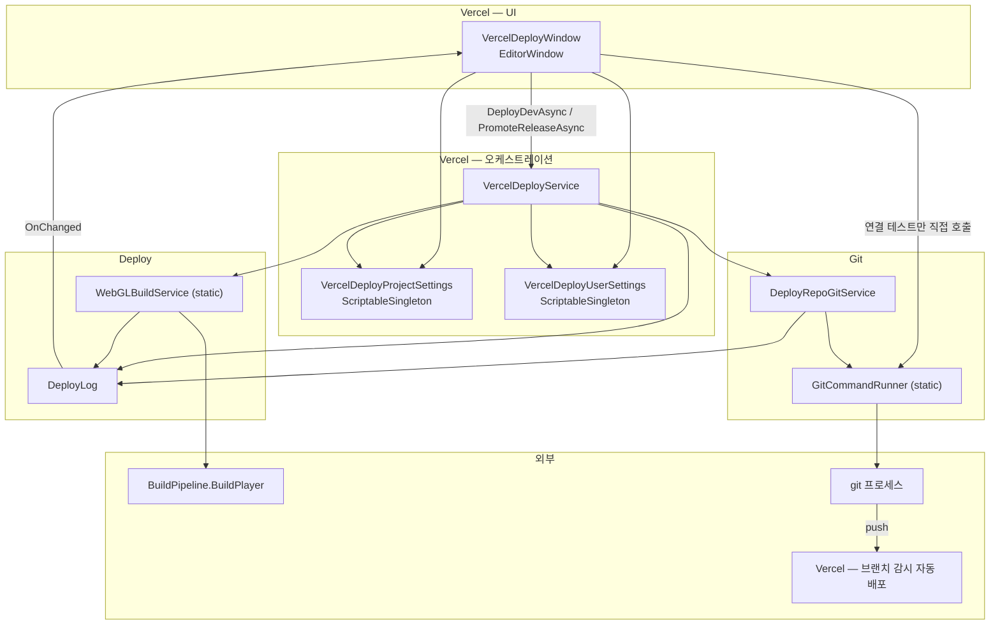
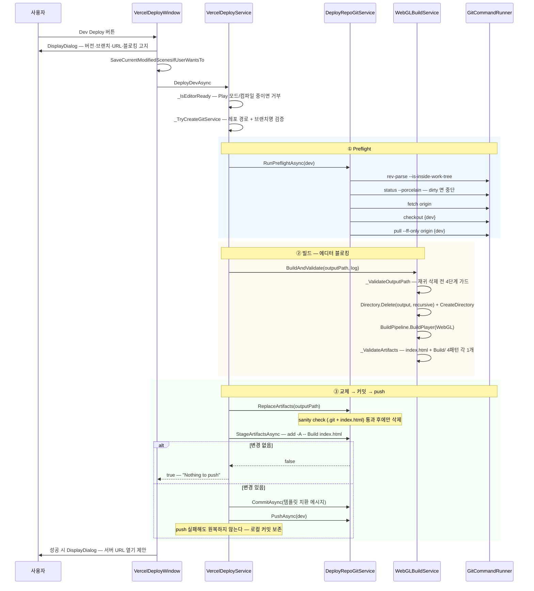
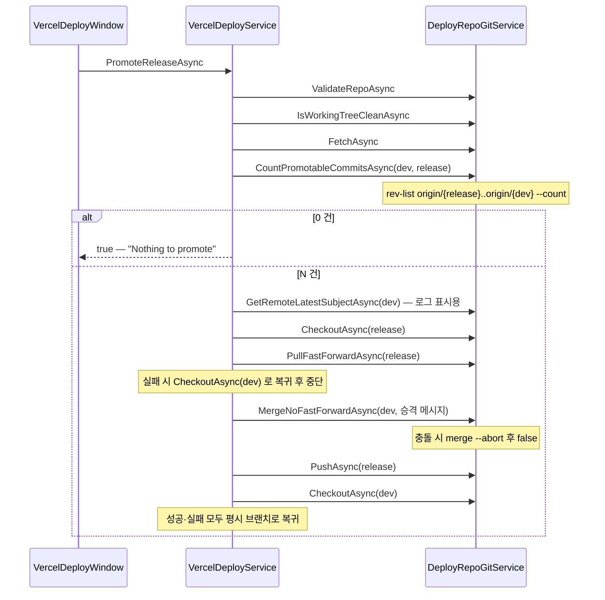
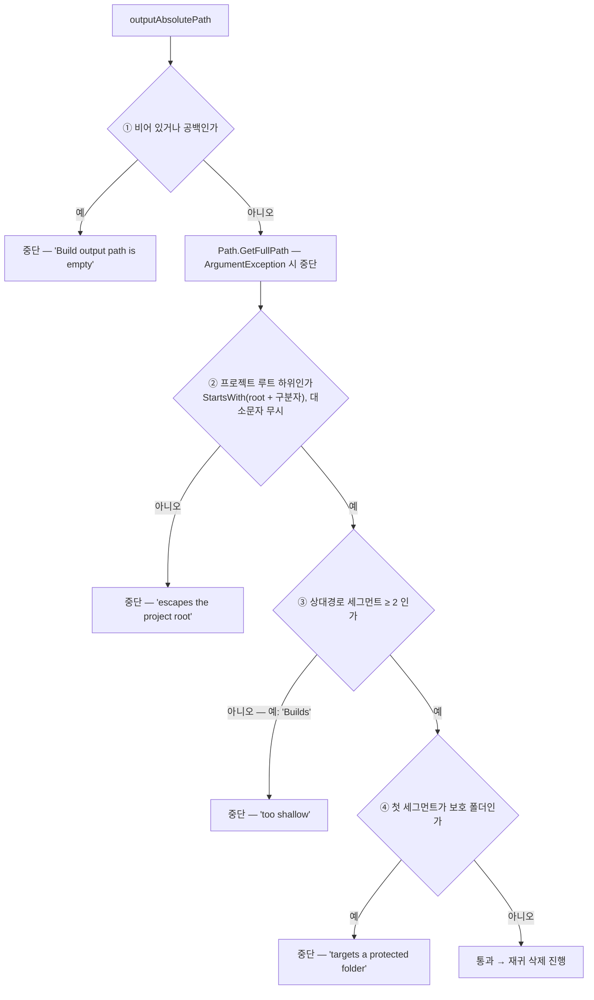

# HCUP.HDeploy.Editor

> 어셈블리: `HCUP.HDeploy.Editor` (`Editor/HCUP.HDeploy.Editor.asmdef`, rootNamespace `HDeploy`)
> 의존: `HCUP.HInspector.Editor` / `includePlatforms: ["Editor"]` / `autoReferenced: false`
> 동반 어셈블리: 없음 (단일 어셈블리 패키지)

---

## 요약

Unity 에디터 안에서 **WebGL 빌드 → 배포 전용 git 레포에 산출물 교체 → push → Vercel 자동 배포**를
버튼 하나로 수행한다. Vercel API 는 호출하지 않는다 — Vercel 이 배포 레포의 브랜치를 감시하고
있다는 전제 위에서, 이 패키지가 하는 일은 **git push 까지**다.

세 갈래 폴더가 그대로 세 계층이다.

| 폴더 | 네임스페이스 | 계층 |
|---|---|---|
| `Vercel/` | `HDeploy.Vercel` | UI + 시퀀스 오케스트레이션 + 설정 2종 |
| `Deploy/` | `HDeploy.Deploy` | WebGL 빌드·검증 + 로그 버퍼 |
| `Git/` | `HDeploy.Git` | git 프로세스 실행 + 고수준 git 시나리오 |

설계의 중심에 세 가지 규약이 있다.

1. **파괴적 자동 복구를 하지 않는다.** dirty 레포 자동 stash 없음, force push 없음,
   push 실패 시 `reset --hard` 없음. 충돌·거부는 전부 사용자에게 넘긴다.
2. **커밋 이후 실패는 원복하지 않는다.** 로컬 커밋을 보존하는 편이 재시도에 안전하다
   (`VercelDeployService.cs:81-85`).
3. **재귀 삭제 전에 경로를 검증한다.** 빌드 출력 폴더는 통째로 지워지므로, 삭제 전에
   4단계 가드를 통과해야 한다 (아래 "파괴적 동작" 절).

---

## 파일 지도

| 경로 | 행수 | 역할 |
|---|---|---|
| `Vercel/VercelDeployWindow.cs` | 334 | `EditorWindow`. UI·입력·확인 다이얼로그만. 로직 없음 |
| `Vercel/VercelDeployService.cs` | 202 | Dev/Release 시퀀스 조립 + 커밋 메시지 템플릿 치환 |
| `Vercel/VercelDeployProjectSettings.cs` | 61 | 팀 공유 설정 `ScriptableSingleton`. `ProjectSettings/` 저장 |
| `Vercel/VercelDeployUserSettings.cs` | 49 | 머신 종속 설정 `ScriptableSingleton`. `UserSettings/` 저장 |
| `Deploy/WebGLBuildService.cs` | 167 | 출력 경로 검증 → 폴더 비우기 → `BuildPlayer` → 산출물 검증 |
| `Deploy/DeployLog.cs` | 96 | 로그 버퍼 + `OnChanged` 이벤트 + Unity Console 미러 |
| `Deploy/DeployLogEntry.cs` | 38 | 불변 로그 엔트리 구조체 |
| `Deploy/DeployLogSeverity.cs` | 34 | Info / Warning / Error |
| `Git/DeployRepoGitService.cs` | 300 | preflight / 산출물 교체 / 커밋 push / 승격 / 원복 |
| `Git/GitCommandRunner.cs` | 97 | `Process` 1회 실행 + 타임아웃 + UTF-8 캡처 |
| `Git/GitResult.cs` | 60 | 실행 결과 불변 구조체. `IsSuccess` / `IsTimeout` |

---

## 계층 구조



**창은 서비스 2개 메서드만 부른다.** 예외가 하나 있다 — "연결 테스트" 버튼은
`GitCommandRunner.RunAsync` 를 직접 호출한다 (`VercelDeployWindow.cs:252`, `:259`).
`DeployRepoGitService` 를 거치지 않는 유일한 경로다.

---

## 설정 모델

머신 종속 값과 팀 공유 값이 **두 파일로 분리 저장**된다. 둘 다
`ScriptableSingleton<T>` + `[FilePath(..., Location.ProjectFolder)]` 이고, 값 변경 후
`SaveSettings()`(내부적으로 `Save(true)`)를 호출해야 파일에 기록된다.

### `UserSettings/VercelDeployUserSettings.asset` — 미커밋

| 필드 | 타입 | 기본값 |
|---|---|---|
| `DeployRepoAbsolutePath` | `string` | `string.Empty` |
| `LocalGitTimeoutSeconds` | `int` | `15` |
| `RemoteGitTimeoutSeconds` | `int` | `120` |

### `ProjectSettings/VercelDeployProjectSettings.asset` — 커밋 대상

| 필드 | 기본값 |
|---|---|
| `DevBranchName` | `dev` |
| `ReleaseBranchName` | `main` |
| `CommitMessageTemplate` | `[Build] 🛠️ : WebGL 빌드 배포 v{version} ({timestamp})` |
| `PromoteCommitMessageTemplate` | `[Build] 🛠️ : Release 배포 v{version} — {devBranch} → {releaseBranch} ({timestamp})` |
| `BuildOutputRelativePath` | `Builds/VercelDeploy` |
| `DevServerUrl` | `string.Empty` |
| `ReleaseServerUrl` | `string.Empty` |

### 템플릿 placeholder

`VercelDeployService._BuildMessage` 가 4종을 치환한다 (`:173-179`).

| Placeholder | 치환 값 |
|---|---|
| `{version}` | `PlayerSettings.bundleVersion` |
| `{timestamp}` | `DateTime.Now`, 포맷 `yyyy-MM-dd HH:mm` |
| `{devBranch}` / `{releaseBranch}` | 설정된 브랜치명 |

---

## 흐름 1 — Dev Deploy



**실패 시 원복 지점은 3곳뿐이다** (`VercelDeployService.cs:60-79`):
`ReplaceArtifacts` 실패 / `StageArtifactsAsync` 에러 / `CommitAsync` 실패.
`RestoreArtifactsAsync` 가 `checkout -- .` + `clean -fd -- Build index.html` 을 수행한다.
**커밋 이후 push 실패는 원복 대상이 아니다.**

---

## 흐름 2 — Release Promote

재빌드가 없다. Dev 에서 검증된 바이너리를 그대로 승격한다.



---

## git 실행 계층

`GitCommandRunner.RunAsync` 가 모든 git 호출의 단일 통로다.

```csharp
// Git/GitCommandRunner.cs:57-72 — 프롬프트 무한 대기 차단이 핵심
ProcessStartInfo startInfo = new ProcessStartInfo {
    FileName = "git",
    Arguments = arguments,
    WorkingDirectory = workingDirectory,
    UseShellExecute = false,
    CreateNoWindow = true,
    RedirectStandardInput = true,
    RedirectStandardOutput = true,
    RedirectStandardError = true,
    StandardOutputEncoding = Encoding.UTF8,
    StandardErrorEncoding = Encoding.UTF8,
};
startInfo.EnvironmentVariables["GIT_TERMINAL_PROMPT"] = "0";
```

| 항목 | 동작 |
|---|---|
| 표준 입력 | `process.Start()` 직후 즉시 `Close()` (`:37`) |
| 타임아웃 | `Task.Run(() => process.WaitForExit(ms))`. 초과 시 `Kill()` + `TIMEOUT_EXIT_CODE = -1000` |
| 출력 | `Trim()` 후 `GitResult` 에 담아 반환 |
| 타임아웃 값 | 로컬 명령 `LocalGitTimeoutSeconds`, 네트워크 명령(`fetch`/`pull`/`push`) `RemoteGitTimeoutSeconds` |

`DeployRepoGitService` 는 `_RunLocalAsync` / `_RunRemoteAsync` 두 래퍼로 타임아웃을 가른다
(`DeployRepoGitService.cs:253-259`).

---

## 파괴적 동작 — 재귀 삭제 2곳

이 패키지는 **두 곳에서 `Directory.Delete(path, recursive: true)` 를 호출한다.** 양쪽 다
삭제 직전에 가드가 있다.

### ① 빌드 출력 폴더 — `WebGLBuildService.cs:47`

```csharp
// 해시 파일명 특성상 이전 빌드 파일이 스테일로 남으므로 출력 폴더를 통째로 비운다.
if (Directory.Exists(outputAbsolutePath)) Directory.Delete(outputAbsolutePath, true);
Directory.CreateDirectory(outputAbsolutePath);
```

이 줄에 도달하려면 `_ValidateOutputPath`(`:69-109`)의 **4단계를 모두 통과**해야 한다.
검증은 삭제보다 먼저 실행되며(`:38`), 통과 시 `outputAbsolutePath` 를 정규화된 절대경로로
덮어쓴다(`ref` 파라미터, `:107`).



| 가드 | 상수 / 조건 | 막는 것 |
|---|---|---|
| ② 루트 봉쇄 | `projectRoot + DirectorySeparatorChar` 접두 검사 (`OrdinalIgnoreCase`) | `../../` 나 절대경로로 프로젝트 밖 삭제 |
| ③ 최소 깊이 | `MIN_OUTPUT_PATH_DEPTH = 2` | 오타 값이 최상위 폴더를 통째로 지우는 것 |
| ④ 보호 폴더 | `FORBIDDEN_ROOT_FOLDERS = { Assets, Library, Packages, ProjectSettings, UserSettings, Temp, Logs, .git }` | 프로젝트 필수 폴더 지정 |

**즉 `Builds/VercelDeploy` 는 통과하고, `Builds` / `Assets/WebGL` / `../out` 은 전부 중단된다.**

### ② 배포 레포의 `Build/` 폴더 — `DeployRepoGitService.cs:138`

```csharp
// 삭제 전 sanity check — 배포 레포가 맞는지(.git + index.html) 확인 후에만 삭제 진행.
if (Directory.Exists(targetGitPath) == false || File.Exists(targetIndexPath) == false) {
    log.Error($"Sanity check failed :: '{repoPath}' does not look like a deploy repo (.git + index.html). Abort.");
    return false;
}
try {
    if (Directory.Exists(targetBuildPath)) Directory.Delete(targetBuildPath, true);
    File.Delete(targetIndexPath);
    ...
```

가드는 **`{repoPath}/.git` 폴더 존재 + `{repoPath}/index.html` 파일 존재** 두 조건이다.
삭제 대상은 `{repoPath}/Build/` 와 `{repoPath}/index.html` 로 고정이며 `repoPath` 자체는
지우지 않는다. 그 외 레포 파일은 손대지 않는다.

---

## 에디터 도구 — 메뉴 경로

| 창 | 메뉴 경로 | 용도 |
|---|---|---|
| `VercelDeployWindow` | **`HCUP/Deployment/Vercel Deployment`** | 설정 편집 + Dev/Release 배포 + 연결 테스트 + 로그 |

경로는 `MENU_PATH` 상수에 있고 `[MenuItem(MENU_PATH)]` 가 이를 참조한다
(`VercelDeployWindow.cs:31`, `:76`). 최소 창 크기는 420×560.

창 구성(위→아래): `배포 설정`(레포 경로 + 접이식 프로젝트 설정) → `버전 (bundleVersion)` →
`배포`(Dev/Release 버튼 + 연결 테스트) → `Log`. 섹션 헤더는 전부
`HInspector.Editor.HTitleDrawer.Draw` 다 — 이것이 `HCUP.HInspector.Editor` 를 참조하는 유일한 이유다.

---

## 사용 예

```csharp
// 창 없이 프로그래밍으로 배포하려면 서비스를 직접 조립한다.
DeployLog log = new DeployLog();                  // Unity Console 에 미러됨
VercelDeployService service = new VercelDeployService(log);

bool ok = await service.DeployDevAsync();         // 설정 2종은 ScriptableSingleton 에서 자동 로드
if (!ok) {
    foreach (DeployLogEntry e in log.Entries) Debug.Log($"{e.Level} {e.Message}");
}
```

설정 값을 코드로 바꾸려면:

```csharp
VercelDeployProjectSettings ps = VercelDeployProjectSettings.instance;
ps.BuildOutputRelativePath = "Builds/VercelDeploy";   // 2 세그먼트 이상 필수
ps.SaveSettings();                                     // 호출해야 파일에 기록된다
```

---

## 주의할 점

### 계약

1. **빌드는 동기이고 에디터를 블로킹한다.** `BuildPipeline.BuildPlayer` 는 메인 스레드에서만
   호출 가능하며 진행 중 에디터가 응답 없음 상태가 된다. 창이 확인 다이얼로그에 이 사실을
   명시한다 (`VercelDeployWindow.cs:201`).
2. **Play 모드 / 컴파일 중에는 시작을 거부한다** (`VercelDeployService._IsEditorReady`, `:140-150`).
3. **활성 빌드 타깃이 WebGL 이어야 한다.** `BuildPlayerOptions.target = BuildTarget.WebGL` 을
   지정하지만 타깃 전환 자체는 하지 않는다. 씬 목록은 `EditorBuildSettings` 의 `enabled` 씬이며,
   0개면 즉시 중단한다 (`WebGLBuildService.cs:41-44`).
4. **산출물 검증은 정확히 1개씩을 요구한다.** `index.html` + `Build/` 안의 `*.wasm` /
   `*.data` / `*.framework.js` / `*.loader.js` 가 **각 1개**여야 하며, 0개나 2개면 실패한다
   (`WebGLBuildService.cs:131-137`). 압축(Brotli/Gzip) 을 켜면 확장자가 `.wasm.br` 등으로
   바뀌어 이 검증이 실패한다 — 패턴 보완이 필요하다 (`:163` 의 설계 메모).
5. **dirty 레포는 자동 stash 없이 중단한다.** 변경 목록을 로그로 남기고 사용자가 직접 정리한다
   (`DeployRepoGitService.cs:83-86`).
6. **force push 를 하지 않는다.** push 거부 시 로컬 커밋을 보존하고 수동 해결을 안내한다
   (`DeployRepoGitService.cs:199`).
7. **merge 충돌 시 즉시 `merge --abort`.** abort 마저 실패하면 에러만 남기고 반환한다
   (`DeployRepoGitService.cs:243-247`).
8. **버전 필드는 SemVer 3자리만 받는다.** `^\d+\.\d+\.\d+$` 정규식 검증 후
   `PlayerSettings.bundleVersion` 에 반영하며, ProjectSettings 변경의 커밋은 사용자 몫이다
   (`VercelDeployWindow.cs:185-192`).

### 위험

9. **커밋 메시지가 셸 인용을 완전히 처리하지 않는다.** `CommitAsync` / `MergeNoFastForwardAsync`
   는 `message.Replace("\"", "\\\"")` 만 하고 인자를 `-m "메시지"` 로 문자열 조립한다
   (`DeployRepoGitService.cs:185`, `:236`). `UseShellExecute = false` 라 셸을 거치지 않으므로
   임의 명령 실행 위험은 없으나, 커밋 템플릿에 백슬래시나 개행이 들어가면 인자 파싱이
   어긋날 수 있다. 템플릿에 따옴표·백슬래시를 넣지 않는 것이 안전하다.
10. **`RestoreArtifactsAsync` 는 `checkout -- .` 로 워킹트리 전체를 되돌린다**
    (`DeployRepoGitService.cs:155`). 산출물 경로만 되돌리는 것이 아니다. preflight 가 클린 상태를 이미 확인했으므로
    정상 경로에서는 안전하지만, 배포 도중 사용자가 배포 레포의 다른 파일을 수정하면 그
    변경도 함께 사라진다.
11. **`_RunConnectionTestAsync` 는 `DeployRepoGitService` 를 우회한다**
    (`VercelDeployWindow.cs:252`, `:259`). 레포 유효성 검증 없이 임의 경로에서 git 을 실행하므로,
    잘못된 경로를 넣으면 상위 디렉터리의 다른 레포 상태를 보고할 수 있다.
12. **`GitCommandRunner` 가 `git` 실행 실패를 예외로 흘린다.** `process.Start()` 가
    `Win32Exception`(git 미설치·PATH 누락)을 던지면 `RunAsync` 안에 try/catch 가 없어 호출자까지
    전파된다. `async void` 인 창 핸들러(`_RunDevDeployAsync` 등)까지 올라가면 `finally` 의
    `isBusy = false` 는 실행되지만 예외는 Unity Console 에 원시 형태로 남는다.

### 기존 문서와의 불일치 (상위 `HDeploy/README.md`)

`HDeploy/README.md` 는 아래 4항목이 현재 코드와 다르다. **이 문서의 값이 현행이다.**

| 항목 | 상위 README | 실제 코드 |
|---|---|---|
| 메뉴 경로 | `Tools/HDeploy/Vercel Deploy` | `HCUP/Deployment/Vercel Deployment` (`VercelDeployWindow.cs:31`) |
| 외부 참조 | "Editor 전용, 외부 참조 0" | `HCUP.HInspector.Editor` 참조 (asmdef `references`) |
| 빌드 출력 기본값 | `Builds/WebGL_Deploy` | `Builds/VercelDeploy` (`VercelDeployProjectSettings.cs:34`) |
| 커밋 템플릿 | `chore: WebGL 빌드 배포 v{version} ({timestamp})` | `[Build] 🛠️ : WebGL 빌드 배포 v{version} ({timestamp})` (`VercelDeployProjectSettings.cs:30-31`) |

---

## 확장 지점

| 하고 싶은 것 | 손댈 곳 |
|---|---|
| 다른 빌드 타깃 지원 | `WebGLBuildService.BuildAndValidate` 의 `BuildPlayerOptions.target` + `REQUIRED_ARTIFACT_PATTERNS` |
| 압축(Brotli/Gzip) 대응 | `WebGLBuildService.REQUIRED_ARTIFACT_PATTERNS` 에 `*.wasm.br` 등 추가 |
| 보호 폴더 목록 조정 | `WebGLBuildService.FORBIDDEN_ROOT_FOLDERS` / `MIN_OUTPUT_PATH_DEPTH` |
| 배포 산출물 구조 변경 | `DeployRepoGitService` 의 `ARTIFACT_BUILD_FOLDER` / `ARTIFACT_INDEX_FILE` 상수 + sanity check |
| Vercel API 직접 호출 | `VercelDeployService` 에 단계 추가 — 현재 Vercel 의존은 "브랜치 push" 하나뿐 |
| 다른 호스팅(Netlify 등) | `VercelDeployService` 를 본떠 새 오케스트레이터. `Deploy/` · `Git/` 은 그대로 재사용 |
| 로그를 파일로 남기기 | `DeployLog._Append` — 현재는 메모리 리스트 + Unity Console 미러 |
