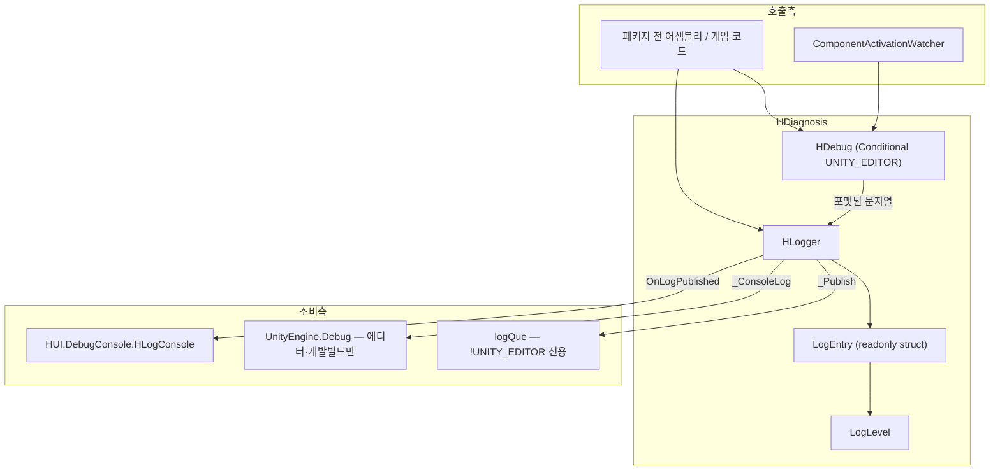
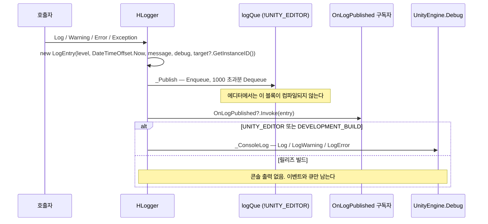

# HCUP.HDiagnosis

> 어셈블리: `HCUP.HDiagnosis` (`Runtime/HCUP.HDiagnosis.asmdef`, rootNamespace `HDiagnosis`)
> 의존: 없음 (`references: []` — `UnityEngine` 만)
> 동반 어셈블리: 없음 (Editor 어셈블리 없음)

---

## 요약

HDiagnosis 는 **패키지의 의존 최말단(leaf)** 이다. 다른 HCUP 어셈블리를 하나도 참조하지 않기 때문에
`HCore` 를 포함한 거의 모든 어셈블리가 이것을 참조할 수 있다. 제공물은 두 가지뿐이다.

1. **`HLogger`** — 로그 진입점. `Debug.Log` 를 직접 부르지 않고 **`LogEntry` 구조체를 만들어
   `OnLogPublished` 이벤트로 발행**한 뒤, 에디터·개발 빌드에서만 콘솔에도 찍는다. 이 이벤트가
   인게임 콘솔(`HUI.DebugConsole.HLogConsole`)의 유일한 공급원이다.
2. **`HDebug`** — `[Conditional("UNITY_EDITOR")]` 스택 트레이스 유틸. 릴리즈 빌드에서는
   **호출 코드 자체가 컴파일러에 의해 제거된다.**

단일 README 로 충분한 규모다(4파일 398행). 두 갈래는 `HDebug → HLogger` 한 방향으로만 결합돼 있다.

---

## 파일 지도

| 경로 | 행수 | 역할 |
|---|---|---|
| `Logger/HLogger.cs` | 194 | 로그 진입점 + `LogEntry` 구조체 + `OnLogPublished` 이벤트 |
| `Logger/LogLevel.cs` | 17 | `Debug / Log / Warn / Error / Fatal / Assert` (byte enum) |
| `Debug/HDebug.cs` | 118 | 호출자·스택 트레이스 포맷 후 `HLogger` 로 전달. 에디터 전용 |
| `Debug/ComponentActivationWatcher.cs` | 69 | `OnEnable`/`OnDisable` 을 스택과 함께 로깅하는 디버깅 컴포넌트 |

---

## 계층 구조



---

## 데이터 모델

```csharp
// Logger/HLogger.cs:28-46
public readonly struct LogEntry {
    public readonly LogLevel Level;
    public readonly DateTimeOffset Timestamp;
    public readonly string Message;
    public readonly string Debug;              // Error 에서만 채워지는 부가 문자열
    public readonly int? TargetInstanceId;     // target?.GetInstanceID() — 콘솔에서 오브젝트 핑용
}
```

`TargetInstanceId` 는 `GameObject` 참조를 들고 있지 않고 **int id 만** 보관한다(`:96, :109, :122`).
소비측(`HUI/Runtime/HUI/DebugConsole/HLogConsole.Actions.cs:216-223`)이 `EditorUtility.InstanceIDToObject`
로 되살린다 — 로그가 오브젝트 수명을 붙잡지 않게 하는 설계다.

### 콘솔 문자열 포맷

```
@{(int)Level} [{Level}] [yyyy-MM-dd HH:mm:ss zzz] {Message}
@{(int)Level} [{Level}] Debug :: {Debug}          ← Debug 가 비어 있지 않을 때만 둘째 줄
```

레벨 태그는 에디터·개발 빌드에서만 `<color=...>` 로 감싸인다(`:56-63`). 색은 Log `#7ED957`,
Warn `#FFD54F`, Error `#FF5252` (`:65-72`).

---

## 흐름 — 로그 한 건의 경로



**릴리즈 빌드에서 `HLogger` 는 침묵하지 않는다.** `_Publish` 는 항상 실행되므로 `OnLogPublished`
구독자는 릴리즈에서도 로그를 받는다(`:162-168`). 사라지는 것은 `UnityEngine.Debug` 출력뿐이다
(`:170-191`). 인게임 콘솔이 릴리즈 빌드에서도 동작하는 근거가 여기다.

### API 표

| API | 레벨 | 비고 |
|---|---|---|
| `Log(message, target, popupActivate)` | `Log` | `popupActivate` 는 **TODO 스텁** (`:103-105`) |
| `Warning(message, target, popupActivate)` | `Warn` | 동일 스텁 (`:116-118`) |
| `Error(message, target, showPopup, debug)` | `Error` | `debug` 는 이 API 에서만 채워진다 |
| `Exception(ex, extra)` | `Error` | `extra` 가 있으면 `"{extra}\n{ex}"` (`:135`) |
| `Throw(ex, extra, doThrow = true)` | `Error` | 로그 후 **실제로 `throw`** (`:144-148`) |
| `Assert(condition, message, target)` | — | `[Conditional]` 2종. 실패 시 `Debug.Assert` (`:150-154`) |
| `SendLogsToServer()` | — | **빈 스텁** (`:156-158`) |

`HLogger.Throw` 는 `doThrow` 기본값이 `true` 라 **호출 지점에서 예외가 실제로 던져진다.**
컴파일러는 이를 알 수 없으므로 뒤따르는 `return` 이 도달 불가 코드가 되지만 경고는 나지 않는다
(`HCore/Runtime/Scene/SceneLoader.cs:142-143`, `HCore/Runtime/Time/CooldownTimer.cs:59-62` 가 그 형태다).

### HDebug

```csharp
// Debug/HDebug.cs:20-48 — 6개 API 전부 동일 형태
[Conditional("UNITY_EDITOR")]
public static void StackTraceLog(string message = "", int frameCount = 3)
    => HLogger.Log(_GetFormattedStackTrace(frameCount, message));
```

| API | 출력 |
|---|---|
| `LogCaller` / `WarningCaller` / `ErrorCaller` | `[DEBUG (클래스명.메서드명)] {message}` — 직속 호출자 1프레임 |
| `StackTraceLog` / `StackTraceWarning` / `StackTraceError` | `{message}` + `1. 클래스.메서드()` 형태 N줄 |

두 헬퍼 모두 `new StackTrace(2, false)` 로 시작한다(`:54, :69`) — `HDebug` 자신의 프레임 2개를 건너뛰어
호출자부터 잡는다. `false` 는 파일/라인 정보를 수집하지 않는다는 뜻으로, 심볼 조회 비용을 피한다.

`ComponentActivationWatcher` 는 이 API 의 유일한 패키지 내 소비자다. 클래스 본문 전체가
`#if UNITY_EDITOR` 로 감싸여 있어(`:21-42`) 빌드에서는 **필드도 `OnEnable`/`OnDisable` 도 없는 빈
`MonoBehaviour`** 가 된다 — 프리팹에 붙여둔 채 빌드해도 안전하다.

---

## 사용 예

```csharp
using HDiagnosis.Logger;
using HDiagnosis.HDebug;

HLogger.Log("[Boot] initialized");
HLogger.Warning("[Scene] loadingKey is not mapped.", gameObject);
HLogger.Error("[Audio] clipRepository is null.", gameObject, debug: repositoryDump);

// 인자 검증 실패를 릴리즈에서도 fail-fast 로 만든다 (Assert 는 릴리즈에서 제거된다)
if (runner == null) HLogger.Throw(new ArgumentNullException(nameof(runner)));

// 에디터에서만 남는 진단 — 릴리즈에서는 이 줄 자체가 사라진다
HDebug.StackTraceError($"[Audio] Clip not loaded yet. token={token}", 10);

// 인게임 콘솔 등 구독측
HLogger.OnLogPublished += entry => buffer.Add(entry.ToConsoleString());
```

---

## 주의할 점

### 계약

1. **`HLogger.Throw` 는 던진다.** `doThrow: false` 를 명시하지 않는 한 호출 지점에서 예외가 나간다
   (`:144-148`). `Awake` 안에서 부르면 그 프레임의 초기화가 중단된다.
2. **`HLogger.Assert` 는 릴리즈에서 호출째 사라진다**(`:150`, `[Conditional]` 2종). 릴리즈에서도
   지켜져야 하는 검증에는 `HLogger.Error` 나 `HLogger.Throw` 를 쓴다 — 패키지 내 다른 모듈들이
   `Assert` 에서 `HLogger` 로 옮겨 온 이유다.
3. **릴리즈에서도 `OnLogPublished` 는 발행된다**(`:162-168`). 구독자를 해제하지 않으면 정적 이벤트가
   객체를 붙잡는다. `HLogConsole` 은 `OnEnable`/`OnDisable` 쌍으로 관리한다.
4. **`HDebug` 호출은 릴리즈에서 인자 평가까지 사라진다.** `[Conditional]` 은 호출문 전체를 제거하므로
   `HDebug.LogCaller(BuildExpensiveString())` 의 문자열 생성 비용도 릴리즈에는 없다. 반대로
   **부작용이 있는 식을 인자로 넘기면 릴리즈에서 그 부작용이 사라진다.**
5. **`LogEntry.Timestamp` 는 로컬 시각이다.** 프로퍼티 이름이 `_UtcNow` 지만 값은
   `DateTimeOffset.Now` 다(`:91`). 포맷에 오프셋(`zzz`)이 포함되어 표시상 모호하지는 않다.

### 정리 대상

6. **정적 상태 리셋 훅이 에디터에서 컴파일되지 않는다.** `_ResetStatics`(`:82-86`)가
   `#if !UNITY_EDITOR` 블록 안에 있다(`:77-87`). Domain Reload 비활성은 **에디터 전용 기능**이므로,
   이 훅이 필요한 유일한 환경에서 정확히 존재하지 않는다. 결과적으로 에디터에서 Domain Reload 를
   끄면 이전 플레이 세션의 `OnLogPublished` 구독자가 잔존한다. `OnLogPublished` 리셋만이라도
   `#if` 밖으로 빼는 것이 맞다.
7. **`logQue` 는 쓰기 전용이다.** `:78` 선언, `:164-165` Enqueue/Dequeue, `:85` Clear 뿐이고 읽는
   코드가 없다. 소비처로 예정됐던 `SendLogsToServer()` 는 빈 스텁이다(`:156-158`).
   현재는 릴리즈 빌드에서 최대 1000건의 `LogEntry` 를 메모리에 붙잡아 두기만 한다.
8. **`HLogger` 가 `static class` 가 아니다**(`:18` `public class HLogger`). 멤버는 전부 static 인데
   암묵적 public 생성자가 있어 `new HLogger()` 가 가능하다. `static class` 로 봉인하는 게 맞다.
9. **`LogLevel` 6종 중 3종은 아무도 생성하지 않는다.** `HLogger` 가 만드는 값은 `Log`/`Warn`/`Error`
   뿐이며(`:96, :109, :122, :136`), `Debug`/`Fatal`/`Assert` 는 생산자가 없다. 소비측
   `HUI/.../HLogCellView.cs:62-63`, `HLogConsole.Actions.cs:179-183` 은 이 셋을 분기 처리하고 있어
   **도달 불가 분기**다.
10. **`popupActivate` / `showPopup` 는 세 곳 모두 TODO 스텁이다**(`:103-105, :116-118, :129-131`).
    인자를 주더라도 아무 일도 일어나지 않는다. 인자명도 `Log`/`Warning` 은 `popupActivate`,
    `Error` 는 `showPopup` 으로 갈린다.
11. **네임스페이스와 타입 이름이 같다.** `namespace HDiagnosis.HDebug` 안의 `class HDebug`
    (`Debug/HDebug.cs:17-18`) → 정규명이 `HDiagnosis.HDebug.HDebug` 다. 내부 스코프에서는 타입이
    우선 해석되어 컴파일되지만, 외부에서 `using HDiagnosis;` 만 한 뒤 `HDebug.LogCaller` 를 쓰면
    네임스페이스로 해석되어 실패한다. 네임스페이스를 `HDiagnosis.Debugging` 등으로 바꾸는 편이 낫다.
12. **비에디터 빌드의 private 폴백 2종은 죽은 코드다**(`:92-93`). 호출자가 전부 `[Conditional]` 로
    제거되므로 `_LogInternal` / `_GetFormattedStackTrace` 폴백은 호출되지 않는다. 컴파일 통과를
    위한 장치이므로 남겨두더라도 무해하다.

---

## 확장 지점

| 하고 싶은 것 | 손댈 곳 |
|---|---|
| 로그를 파일·서버로 보내기 | `HLogger.OnLogPublished` 구독 (릴리즈에서도 발행된다) |
| 인게임 콘솔 표시 | `HUI.DebugConsole.HLogConsole` 이 이미 구독한다 — `LogEntry` 를 소비 |
| 새 로그 레벨 활성화 | `LogLevel` 에 값은 이미 있다. `HLogger` 에 생산 API + `_GetLevelColor` 분기 추가 |
| 팝업 연동 | `HLogger` 의 TODO 3곳 (`:103, :116, :129`) — `popupActivate` 경로 구현 |
| 레벨 색상 변경 | `LogEntry._GetLevelColor` (`:65-72`) |
| 활성화 추적 대상 확대 | `ComponentActivationWatcher` 를 대상 GameObject 에 부착 + `stackTraceDepth` 조정 |
