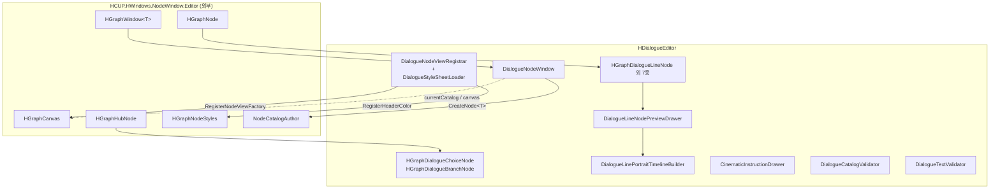
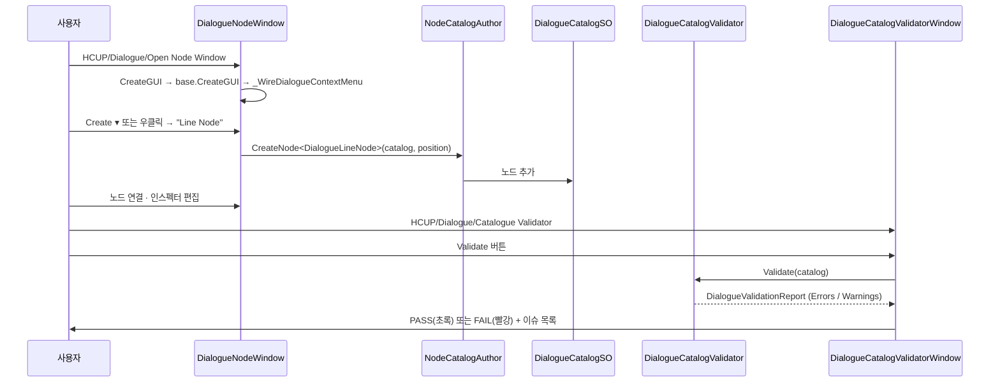

# HCUP.HDialogue.Editor

> 어셈블리: `HCUP.HDialogue.Editor` (`Editor/HCUP.HDialogue.Editor.asmdef`, rootNamespace `HDialogue.Editor`)
> 의존: `Unity.Addressables`, `Unity.Addressables.Editor`, `Unity.ResourceManager`, `UniTask`, `UniTask.Addressables`, `HCUP.HDialogue`, `HCUP.HWindows.NodeWindow`, `HCUP.HWindows.NodeWindow.Editor`
> 동반 어셈블리: `HCUP.HDialogue`(런타임 — [`Runtime/README.md`](../Runtime/README.md))
> 플랫폼: `includePlatforms: ["Editor"]`

---

## 요약

에디터 어셈블리는 **저작과 검증** 둘만 담당한다.

1. **저작** — `DialogueNodeWindow` 가 `HGraphWindow<DialogueCatalogSO>` 를 상속해 노드
   그래프 편집기를 열고, `DialogueNodeViewRegistrar` 가 노드 9종의 시각 표현과 헤더 색을
   등록한다. 노드 생성 메뉴·Play 모드 하이라이트·Trace 토글이 창의 확장분이다.
2. **검증** — `DialogueCatalogValidator` 가 그래프 구조를 정적 검사(E001~E010 / W001~W007)
   하고, `DialogueTextValidator` 가 태그 구조를 검사한다. 둘 다 **수동 실행 전용**이며
   자동 훅이 없다.

런타임 어셈블리를 참조하지만 그 반대는 없다. 카탈로그의 로컬라이제이션 조회는
런타임 쪽의 `#if UNITY_EDITOR` API `DialogueCatalogSO.EditorTryGetLocalizedText` 를 통해
이루어져, 에디터 asmdef 가 `HCUP.HcupLocalization` 을 참조하지 않아도 되게 되어 있다
(`DialogueCatalogSO.cs:68-73`).

---

## 시스템 목록

| 시스템 | 문서 | 파일 수 | 진입점 |
|---|---|---|---|
| 노드 뷰 · 그래프 창 | [`../docs/Editor-NodeView.md`](../docs/Editor-NodeView.md) | 14 | `HCUP/Dialogue/Open Node Window` |
| 검증기 | [`../docs/Editor-Validator.md`](../docs/Editor-Validator.md) | 6 | `HCUP/Dialogue/Catalogue Validator`, `Tools/HDialogue/Dialogue Tag Validator` |

---

## 파일 지도

| 경로 | 역할 | 시스템 |
|---|---|---|
| `Window/DialogueNodeWindow.cs` | 노드 그래프 창. 생성 메뉴 · Play 하이라이트 · Trace | NodeView |
| `NodeView/DialogueNodeViewRegistrar.cs` | `[InitializeOnLoadMethod]` 팩토리·헤더색 등록 + USS 로더 | NodeView |
| `NodeView/HGraphDialogue{Entry,Exit,Line,Choice,Branch,Event,Variable,Wait,Cinematic}Node.cs` | 노드 9종 시각 표현 | NodeView |
| `NodeView/DialogueLineNodePreviewDrawer.cs` | LineNode 바디 빌더 (화자·텍스트·슬롯/포즈·포트레이트 스트립) | NodeView |
| `NodeView/DialogueLinePortraitTimelineBuilder.cs` | 로컬라이즈 텍스트 → `portrait.*` 이벤트 추출 + 스프라이트 해석 | NodeView |
| `Drawers/CinematicInstructionDrawer.cs` | `CinematicInstruction` 3컬럼 인라인 드로어 | NodeView |
| `UI/HDialogueNode.uss` | 노드 뷰 스타일시트 (코드 아님) | NodeView |
| `Validator/DialogueCatalogValidator.cs` | 그래프 정적 검증 17규칙 | Validator |
| `Validator/DialogueCatalogValidatorWindow.cs` | 검증 결과 표시 창 | Validator |
| `Validator/DialogueTextValidator.cs` | 태그 구조 검증 | Validator |
| `Validator/DialogueTextValidatorWindow.cs` | 태그 검증 창 | Validator |
| `Validator/DialogueValidationIssue.cs` / `DialogueValidationReport.cs` | 검증 결과 DTO | Validator |

---

## 계층 구조

`HGraphHubNode` 를 상속하는 것은 `Choice` / `Branch` 둘뿐이다 — 런타임의 `HubNode`
상속 구조와 정확히 대응한다.

---

## 흐름 — 저작에서 검증까지

**검증은 저작 파이프라인에 물려 있지 않다.** 저장·빌드·플레이 진입 어디에도 훅이 없고,
사용자가 창을 열어 버튼을 눌러야 실행된다. 런타임의 순회 상한
(`DialogueDirector.MAX_NODE_TRANSITIONS`)이 필요한 이유가 여기 있다 —
[`Graph.md`](../docs/Graph.md) 참조.

---

## 메뉴 진입점

| 메뉴 | 클래스 | 용도 |
|---|---|---|
| `HCUP/Dialogue/Open Node Window` | `DialogueNodeWindow` | 그래프 편집 (`DialogueNodeWindow.cs:38`) |
| `HCUP/Dialogue/Catalogue Validator` | `DialogueCatalogValidatorWindow` | 그래프 구조 검증 (`:23`) |
| `Tools/HDialogue/Dialogue Tag Validator` | `DialogueTextValidatorWindow` | 태그 구조 검증 (`:63`) |

**세 창의 메뉴 루트가 통일되어 있지 않다.** 둘은 `HCUP/Dialogue/…`, 하나는
`Tools/HDialogue/…` 다.

---

## 주의할 점

### 계약

1. **`DialogueNodeViewRegistrar._Register` 는 `[InitializeOnLoadMethod]` 다**
   (`:25-26`). 도메인 리로드마다 팩토리와 헤더 색이 재등록된다. 이 파일에는 등록 외의
   로직을 넣지 않는 것이 규칙으로 명시되어 있다 (`:12`).
2. **로컬라이즈 텍스트는 런타임 API 를 경유해 읽는다.**
   `DialogueCatalogSO.EditorTryGetLocalizedText`(`DialogueCatalogSO.cs:68-73`)가 그
   창구이며, 덕분에 에디터 asmdef 가 `HCUP.HcupLocalization` 을 참조하지 않는다.
3. **검증기는 순수 정적 클래스다.** 상태가 없고 로그를 남기지 않으며 결과 DTO 만
   반환한다 (`DialogueCatalogValidator.cs:25`, `DialogueTextValidator.cs:26`).
   부작용이 없으므로 CI 배치에 그대로 쓸 수 있다.
4. **`DialogueNodeWindow` 의 `AdditionalContextMenuActions` 는 인스턴스 레벨이다**
   (`:87`). 이 창의 캔버스에만 적용되고 베이스 창에는 영향이 없다.
5. **`CreateGUI` 는 `base.CreateGUI()` 를 먼저 부른다** (`:56-59`). `canvas` 가 그 안에서
   초기화되므로 순서를 바꾸면 `_WireDialogueContextMenu` 가 null 을 만진다.

### 정리 대상

6. **Play 모드 하이라이트가 첫 번째 디렉터만 추적한다** (`:102-107`).
   `FindObjectsByType` 결과의 `[0]` 을 고정으로 쓴다. 씬에 `DialogueDirector` 가 둘
   이상이면 잘못된 것을 볼 수 있다.
7. **Play 모드 진입 전에 창이 열려 있어야 한다** (`:96-99`). `EnteredPlayMode` 이벤트를
   `OnEnable` 에서 구독하므로, 플레이 중에 창을 열면 그 세션의 하이라이트가 붙지 않는다.
8. **메뉴 루트가 갈린다** — `Tools/HDialogue/Dialogue Tag Validator` 만 다른 계열이다
   (`DialogueTextValidatorWindow.cs:63`).

각 시스템의 상세는 [`Editor-NodeView.md`](../docs/Editor-NodeView.md) 와
[`Editor-Validator.md`](../docs/Editor-Validator.md) 에 있다.

---

## 확장 지점

| 하고 싶은 것 | 손댈 곳 |
|---|---|
| 새 노드의 시각 표현 | `HGraphNode`/`HGraphHubNode` 파생 클래스 + `DialogueNodeViewRegistrar._Register` 2곳(색·팩토리) |
| 새 노드의 생성 메뉴 | `DialogueNodeWindow._AppendDialogueNodeItems` (메뉴바·우클릭 공용) |
| 노드 뷰 스타일 | `Editor/UI/HDialogueNode.uss` — 클래스명 `hdialogue-*` |
| 새 그래프 검증 규칙 | `DialogueCatalogValidator` 의 `_CheckErrors` / `_CheckWarnings` + 코드 상수 |
| 새 태그 검증 규칙 | `DialogueTextValidator._CheckTag` + `DialogueTagRegistry` 집합 |
| 검증 자동화 | `DialogueCatalogValidator.Validate` 는 부작용이 없다 — `AssetPostprocessor` 나 빌드 훅에서 직접 호출 가능 |
