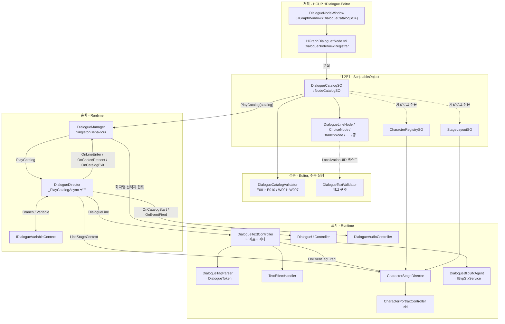
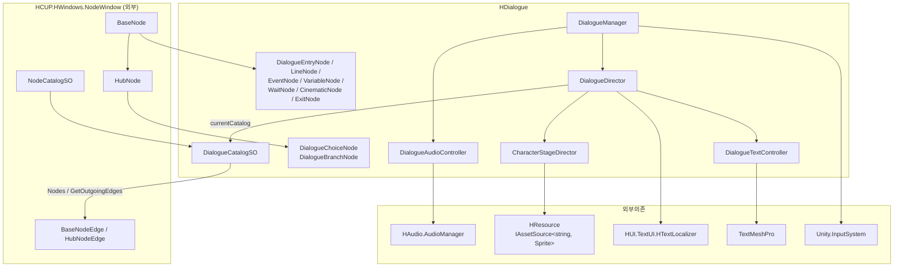
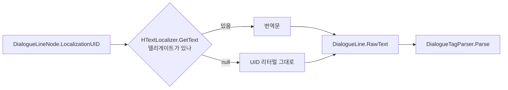
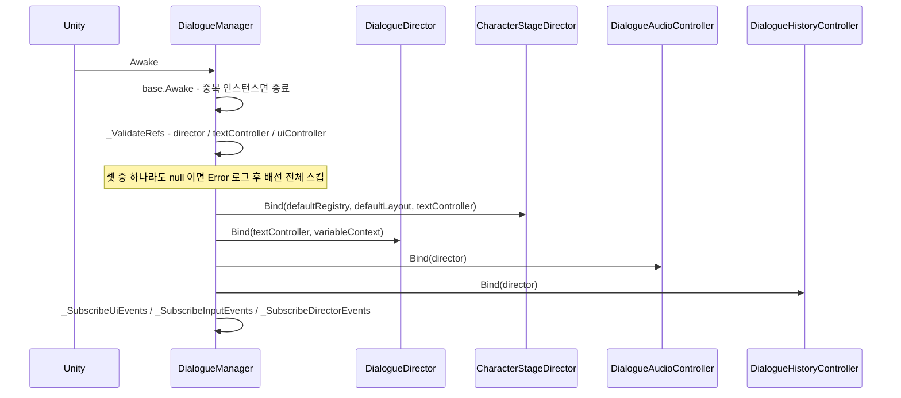
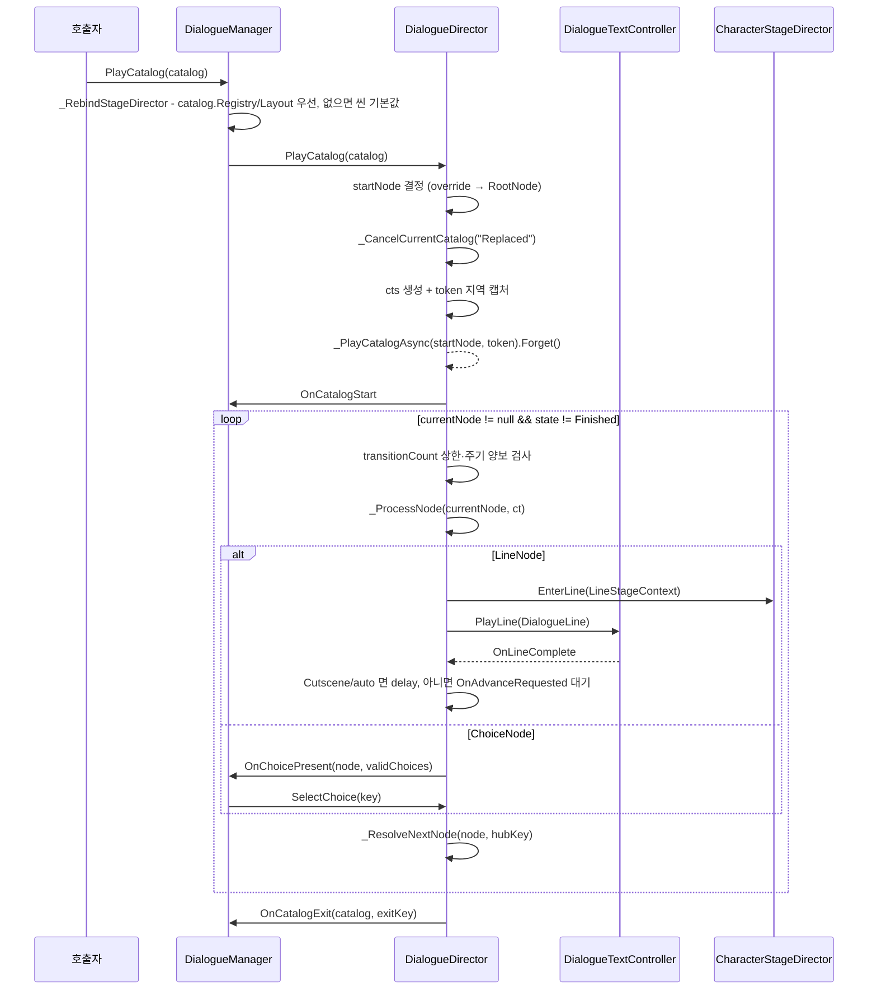
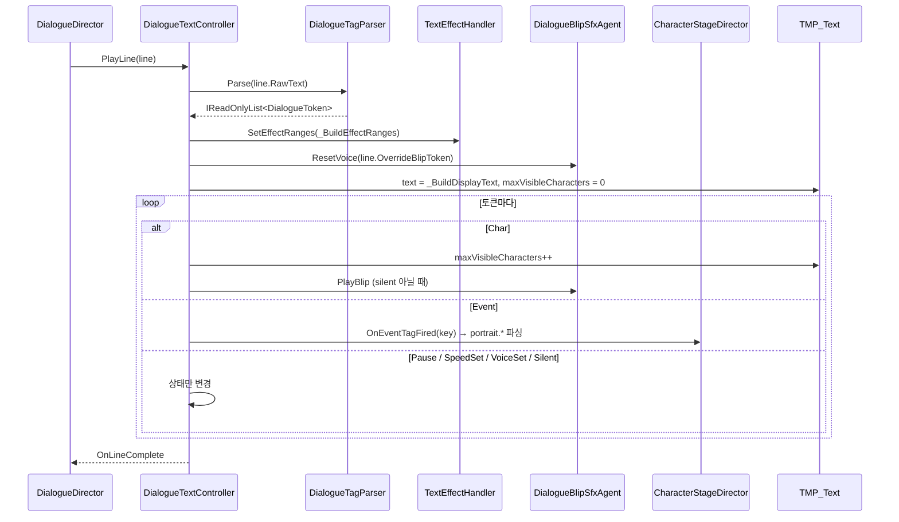

# HCUP.HDialogue

> 어셈블리: `HCUP.HDialogue` (`Runtime/HCUP.HDialogue.asmdef`, rootNamespace `HDialogue`)
> 의존: `Unity.TextMeshPro`, `Unity.InputSystem`, `UniTask`, `UniTask.TextMeshPro`, `HCUP.HUtil`, `HCUP.HUI`, `HCUP.HAudio`, `HCUP.HCore`, `HCUP.HInspector`, `HCUP.HDiagnosis`, `HCUP.HWindows.NodeWindow`, `HCUP.HCollection`, `HCUP.HcupLocalization`, `HCUP.HResource`
> 동반 어셈블리: `HCUP.HDialogue.Editor`(노드 그래프 창·노드 뷰·검증기)

---

## 요약

HDialogue 는 **노드 그래프로 저작된 대화를 런타임에 순회해 화면에 뿌리는 계층**이다.
그래프 데이터 구조(노드·엣지·UID)는 전부 `HCUP.HWindows.NodeWindow` 의 `NodeCatalogSO` /
`BaseNode` / `HubNode` 를 상속해 얻고, HDialogue 는 **대화 도메인의 노드 9종과 그 노드를
해석하는 순회 엔진**만 정의한다.

설계의 중심에 세 가지 규약이 있다.

1. **순회 엔진은 하나다.** `DialogueDirector._PlayCatalogAsync` 의 while 루프가 유일한 진행
   주체다. 모든 노드는 `_ProcessNode` 의 타입 switch 를 통과하고, 다음 노드는
   `_ResolveNextNode` 가 엣지에서 결정한다 (`DialogueDirector.cs:180-196`).
2. **분기 결과는 `string hubKey` 하나로 표현한다.** 단순 노드는 `null`, `HubNode` 파생
   (Choice/Branch)은 선택된 포트 키를 반환한다. 루프는 두 경우를 같은 시그니처로 다룬다
   (`DialogueDirector.cs:208-240`).
3. **비정상 종료도 반드시 `OnCatalogExit` 를 발행한다.** 실패 경로는 전부 `_FinishWithError`
   한 곳으로 모이고, exitKey `"Error"` 로 종료를 알린다 (`DialogueDirector.cs:547-553`).
   이 규약이 없으면 대화 UI 가 열린 채 좀비 상태로 남는다.

텍스트 표시·포트레이트·오디오는 **디렉터가 이벤트로 밀어내고 각 컨트롤러가 받는** 단방향
구조다. 컨트롤러 쪽에서 디렉터를 역참조하는 경로는 없다.

---

## 파이프라인 한 장

대화 그래프가 저작 → 검증 → 순회 → 표시로 이어지는 전체 경로다.



**책임 경계가 갈리는 지점은 `DialogueDirector` 하나다.** 위쪽(그래프·카탈로그)은 노드와
엣지만 알고, 아래쪽(컨트롤러)은 라인·컨텍스트·이벤트만 안다. 그 사이의 번역이 디렉터의
존재 이유다.

---

## 시스템 목록

| 시스템 | 문서 | 파일 수 | 핵심 타입 |
|---|---|---|---|
| 순회 엔진 | [`../docs/Graph.md`](../docs/Graph.md) | 6 | `DialogueDirector` · `DialogueCatalogSO` · `IDialogueVariableContext` |
| 노드 타입 | [`../docs/Nodes.md`](../docs/Nodes.md) | 12 | `DialogueLineNode` 외 노드 9종 + 열거형 3종 |
| 조율·UI·입력 | [`../docs/Controller.md`](../docs/Controller.md) | 4 | `DialogueManager` · `DialogueUiController` · `DialogueInputController` · `DialogueHistoryController` |
| 텍스트 표시 | [`../docs/Text.md`](../docs/Text.md) | 11 | `DialogueTextController` · `DialogueTagParser` · `DialogueToken` · `TextEffectHandler` |
| 포트레이트 무대 | [`../docs/Portrait.md`](../docs/Portrait.md) | 18 | `CharacterStageDirector` · `CharacterPortraitController` · `PortraitEventParser` |
| 오디오 연동 | [`../docs/Audio.md`](../docs/Audio.md) | 4 | `DialogueAudioController` · `DialogueBlipSfxAgent` · `IBlipSfxService` |

에디터 어셈블리는 [`Editor/README.md`](../Editor/README.md) 를 볼 것.

---

## 파일 지도

| 경로 | 역할 | 시스템 |
|---|---|---|
| `DialogueManager.cs` | 씬 싱글톤. 배선·이벤트 중계·카탈로그 선택 재생 | Controller |
| `Graph/DialogueDirector.cs` | **순회 엔진.** 노드 처리·분기·종료 계약 | Graph |
| `Graph/DialogueCatalogSO.cs` | 그래프 데이터 원본 (`NodeCatalogSO` 상속) | Graph |
| `Graph/DialogueCatalogTag.cs` | Normal / Cutscene / Tutorial / SystemMessage | Graph |
| `Graph/DialogueDirectorState.cs` | 디렉터 상태 6종 | Graph |
| `Graph/IDialogueVariableContext.cs` | 변수 저장소 DI 계약 | Graph |
| `Graph/MemoryDialogueVariableContext.cs` | Dictionary 기반 기본 구현 (세션 한정) | Graph |
| `Graph/Nodes/*.cs` (12) | 노드 9종 + `BranchMode` / `VariableOp` / `WaitMode` | Nodes |
| `Controller/DialogueTextController.cs` | 타이프라이터. 토큰 순회 + 상태 머신 | Text |
| `Controller/DialogueUiController.cs` | UI 이벤트 발화 전용 (버튼·토글·선택지 패널) | Controller |
| `Controller/DialogueInputController.cs` | Input System `"Dialogue"` 액션맵 → 이벤트 | Controller |
| `Controller/DialogueHistoryController.cs` | 라인 이력 FIFO 누적 + 패널 토글 | Controller |
| `Controller/DialogueAudioController.cs` | 카탈로그 BGM + `sfx.*` EventNode SFX | Audio |
| `Parser/DialogueTagParser.cs` | RawText → `DialogueToken` 목록 | Text |
| `Parser/DialogueTagRegistry.cs` | 태그 집합 단일 소스 | Text |
| `Data/DialogueLine.cs` | 디렉터 → 텍스트 컨트롤러 1라인 DTO | Text |
| `Data/DialogueToken.cs` / `DialogueTokenType.cs` | 파싱 결과 토큰 (struct, 12종) | Text |
| `Data/TextDisplayState.cs` / `TextSpeedMode.cs` / `TextSpeedConstants.cs` | 표시 상태·속도 정의 | Text |
| `Effect/TextEffectHandler.cs` / `TextEffectRange.cs` | TMP 버텍스 효과 (shake / wave / rainbow) | Text |
| `Portrait/CharacterStageDirector.cs` | 무대 감독. 슬롯 점유·등퇴장·인라인 이벤트 | Portrait |
| `Portrait/CharacterPortraitController.cs` | 포트레이트 1인 렌더·트랜지션 3채널 | Portrait |
| `Portrait/CharacterRegistrySO.cs` / `CharacterPortraitSetSO.cs` / `StageLayoutSO.cs` | 무대 데이터 | Portrait |
| `Portrait/PortraitEventParser.cs` | `portrait.*` 이벤트 키 파서 | Portrait |
| `Audio/IBlipSfxService.cs` / `AudioManagerBlipAdapter.cs` / `DialogueBlipSfxAgent.cs` | 글자 블립 DI 사슬 | Audio |
| `Input/DialogueInputActions.inputactions` | Input System 액션 에셋 (코드 아님) | Controller |

---

## 계층 구조



`DialogueChoiceNode` 와 `DialogueBranchNode` 만 `HubNode` 를 상속한다. 나머지 7종은
`BaseNode` 직속이고 출구 엣지가 하나뿐이다 - 이 상속 차이가 곧 `_ResolveNextNode` 의
두 갈래다 (`DialogueDirector.cs:249-275`).

---

## 데이터 모델

`DialogueCatalogSO` 하나가 대화 하나를 통째로 담는다. 노드·엣지·루트 UID 는 상속으로,
대화 도메인 값은 자체 필드로 갖는다.

```csharp
// Graph/DialogueCatalogSO.cs:30-56
public sealed class DialogueCatalogSO : NodeCatalogSO {
    [SerializeField] DialogueCatalogTag catalogTag = DialogueCatalogTag.Normal; // Cutscene 이면 자동 진행
    [SerializeField] string bgmKey;              // DialogueAudioController 가 소비
    [SerializeField] CharacterRegistrySO registry; // null 이면 DialogueManager 씬 기본값
    [SerializeField] StageLayoutSO layout;         // null 이면 DialogueManager 씬 기본값
#if UNITY_EDITOR
    [SerializeField] LocalizationSO editorLocalizationSO; // 에디터 미리보기 전용, 빌드 제외
#endif
    public BaseNode RootNode { get { if (!HasRoot) return null; Nodes.TryGetValue(RootUID, out var n); return n; } }
}
```

**라인 텍스트는 카탈로그에 없다.** `DialogueLineNode` 는 `localizationUID` 만 갖고,
런타임에 `HTextLocalizer.GetText` 로 해석된다. 로컬라이저가 없으면 UID 문자열이 그대로
표시된다 (`DialogueDirector.cs:520`).



---

## 흐름 1 - 초기화와 배선



`_ValidateRefs` 가 false 를 반환하면 `_Bind` 이하가 전부 건너뛰어진다
(`DialogueManager.cs:120-128`). 자세한 계약은 [`Controller.md`](../docs/Controller.md) 에 있다.

---

## 흐름 2 - 카탈로그 재생 한 사이클



**`PlayCatalog` 는 큐잉하지 않는다.** 재호출은 이전 카탈로그를 `"Replaced"` exitKey 로 즉시
종료시킨다 (`DialogueDirector.cs:134`). 순회 엔진의 방어 장치 전체는
[`Graph.md`](../docs/Graph.md) 에 있다.

---

## 흐름 3 - 라인 하나가 화면에 뿌려지기까지



**인라인 `<event=...>` 태그의 수신자는 `CharacterStageDirector` 뿐이다**
(`CharacterStageDirector.cs:89-92`). `DialogueDirector.OnEventFired` 는 그래프의
`DialogueEventNode` 에서만 발행되므로(`DialogueDirector.cs:428`), 인라인 태그와 그래프
이벤트는 서로 다른 경로다. 자세한 것은 [`Audio.md`](../docs/Audio.md) 의 "정리 대상" 절에 있다.

---

## 사용 예

```csharp
// 1) 씬 배선 - DialogueManager 인스펙터에 director / textController / uiController 필수 연결.
//    나머지(stageDirector, audioController, inputController, historyController)는 선택.

// 2) 재생
DialogueManager.Instance.PlayCatalog(introCatalog);
DialogueManager.Instance.PlayByKey("chapter1_intro");   // catalogMap 경유
DialogueManager.Instance.PlayDefault();                 // targetCatalog, 없으면 catalogMap 첫 항목

// 3) 종료 구독
DialogueManager.Instance.OnCatalogExit += (catalog, exitKey) => {
    if (exitKey == "Error") { /* 그래프 결함 - 검증기 실행 */ }
};

// 4) 변수 주입 - 기본값은 MemoryDialogueVariableContext(세션 한정).
//    영구 저장이 필요하면 IDialogueVariableContext 를 구현해 director.Bind 로 넣는다.
director.Bind(textController, new SaveBackedVariableContext());

// 5) WaitNode(Condition) 해제
DialogueManager.Instance.Director.NotifyWaitConditionMet();
```

---

## 주의할 점

### 계약

1. **`OnCatalogExit` 는 종료마다 정확히 한 번이다.** 정상 종료(`ExitNode`)·실패 종료
   (`_FinishWithError`)·강제 중단(`Stop`)·교체(`PlayCatalog` 재호출) 네 경로 모두 발행하되,
   이미 `Finished` 상태면 재발행하지 않는다 (`DialogueDirector.cs:555-566`). 보상 지급처럼
   멱등하지 않은 구독자를 붙여도 안전하다.
2. **`DialogueManager` 의 공개 API 는 `director` null 을 가정하지 않는다.**
   `PlayCatalog` / `Stop` / `IsSkipping` / `AutoAdvanceDelay` 는 `director` 를 무조건
   역참조한다 (`DialogueManager.cs:149`, `:181`, `:108`, `:112`). `_ValidateRefs` 실패
   상태에서 호출하면 `NullReferenceException` 이다.
3. **인라인 `<event=...>` 와 `DialogueEventNode` 는 다른 채널이다.** 전자는
   `CharacterStageDirector` 만 받고, 후자는 `DialogueDirector.OnEventFired` 로만 나간다.
   인라인 태그로 SFX 를 울릴 수는 없다 - [`Audio.md`](../docs/Audio.md) 참조.
4. **`Play` 계열 오디오는 prewarm 을 요구한다.** HDialogue 는 토큰만 넘기고 로드하지
   않는다. `AudioManager.PrewarmCatalog` 는 게임 코드 책임이다.
5. **스프라이트는 `CharacterStageDirector` 가 소유한다.** `Awake` 에서 Addressable
   provider 를 만들고 `OnDestroy` 에서 `ReleaseAll` 한다
   (`CharacterStageDirector.cs:70`, `:77`). 개별 포트레이트는 반납하지 않는다.

### 정리 대상

6. **`DialogueUiController` 의 텍스트 슬롯 3종 중 `dialogueContentText` 는 런타임에 쓰이지
   않는다.** `ShowDialogueContent`(`:87`) / `SetPlayButtonInteractable`(`:95`) /
   `DialogueContentText`(`:124`) 전부 호출처 0건(패키지 전역 grep). 실제 대사는
   `DialogueTextController.tmpText` 가 그린다 - 두 슬롯을 같은 오브젝트에 물려야 하는
   암묵 규칙이 남아 있다.
7. **호출처 0건 공개 API 목록** (패키지 전역 grep, 주석 제외):
   `DialogueTextController.Clear` / `Pause` / `Resume` / `SetSpeedMode` / `SetHoldAccelerate`
   / `IsTyping` / `IsWaiting` / `OnLineStart` / `OnCharPrinted`,
   `DialogueDirector.CurrentNode`,
   `CharacterStageDirector.OnCharacterEntered` / `OnCharacterExited` / `OnPoseChanged`,
   `CharacterPortraitController.CurrentFacing` / `CurrentSlot` / `IsVisible`,
   `CharacterPortraitSetSO.Poses` / `PivotOffset`, `CharacterRegistrySO.Characters`,
   `DialogueLine.Simple`. 외부 게임 코드용 확장점인 것과 순수 사문(死文)인 것이 섞여 있다.
8. **`CharacterPortraitSetSO.pivotOffset` 은 읽는 코드가 없다** (`:41`, `:51`).
   슬롯 기준 보정은 `PortraitPose.PoseOffset` 이 담당한다
   (`CharacterPortraitController.cs:338`) - 필드가 중복 설계로 남았다.
9. **`PortraitTransitionType.SlideIn` / `Scale` 은 팩토리만 있고 처리 분기가 없다.**
   `PortraitTransition.SlideIn`(`:36`) / `Scale`(`:46`) 은 타입만 채우고,
   `CharacterPortraitController` 의 분기는 `Instant` / `Crossfade` / 그 외(=Fade) 셋뿐이다
   (`:134`, `:219`). 두 타입을 지정하면 Fade 로 동작한다.
10. **`PortraitPoseType.Sequence` 는 코드 전역에서 참조되지 않는다** (grep 0건).
    `_ApplyPoseImmediate` 는 `Static` / `Animated` 만 처리하고 `Sequence` 는 무동작이다
    (`CharacterPortraitController.cs:328-340`).
11. **`DialogueWaitNode.conditionKey` 는 런타임이 읽지 않는다.** `WaitMode.Condition` 은
    키와 무관한 전역 신호 `NotifyWaitConditionMet()` 로만 풀린다
    (`DialogueDirector.cs:483-497`). 이 필드는 에디터 노드 뷰 표시에만 쓰인다
    (`HGraphDialogueWaitNode.cs:32`).
12. **`DialogueTokenType.Sfx` 는 파서·검증기까지만 살아 있고 런타임은 no-op 이다**
    (`DialogueTextController.cs:238-239`). 검증기가 이를 경고로 명시한다
    (`DialogueTextValidator.cs:104-105`).

### 진단이 릴리즈에서 사라지는 지점

13. `DialogueTextController.Awake` 의 `tmpText` 검사는 `Debug.Assert` 다
    (`:79`). Assert 는 릴리즈 빌드에서 제거되므로, 배선 누락은 릴리즈에서 조용히
    `tmpText == null` 가드로 흡수되어 **글자가 한 자도 안 나오는 무증상 실패**가 된다.
    같은 패키지의 `CharacterStageDirector.Awake`(`:67-69`)와
    `DialogueManager._ValidateRefs`(`:189-203`)는 `HLogger.Error` 를 쓴다 - 기준이 갈린다.

---

## 확장 지점

| 하고 싶은 것 | 손댈 곳 |
|---|---|
| 변수 영속화 (세이브 연동) | `IDialogueVariableContext` 구현 후 `DialogueDirector.Bind` 에 주입 |
| 새 노드 타입 추가 | `BaseNode`/`HubNode` 상속 → `DialogueDirector._ProcessNode` switch → `DialogueNodeViewRegistrar` 등록 → `DialogueNodeWindow._AppendDialogueNodeItems` |
| 새 인라인 태그 추가 | `DialogueTagRegistry` 집합 → `DialogueTagParser._ParseTag` → `DialogueToken` 팩토리 → `DialogueTextController._ProcessTokenAsync` → `DialogueTextValidator` |
| 블립 사운드 백엔드 교체 | `IBlipSfxService` 구현체를 `DialogueBlipSfxAgent.blipServiceSource` 에 배선 |
| 새 텍스트 이펙트 | `DialogueTagRegistry.EffectTags` + `TextEffectHandler.Update` 의 `range.EffectName` switch |
| 포트레이트 트랜지션 추가 | `PortraitTransitionType` + `CharacterPortraitController` 의 `transition.Type` 분기 |
| 입력 바인딩 변경 | `Runtime/Input/DialogueInputActions.inputactions` 의 `"Dialogue"` 액션맵 |
| 카탈로그별 무대 교체 | `DialogueCatalogSO.registry` / `layout` - null 이면 `DialogueManager` 씬 기본값 |
