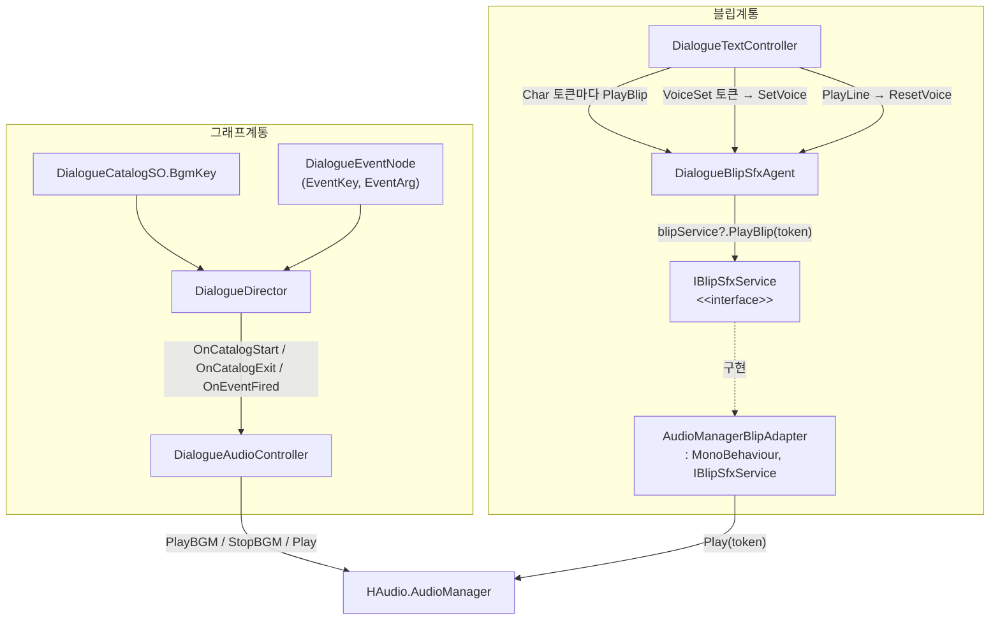
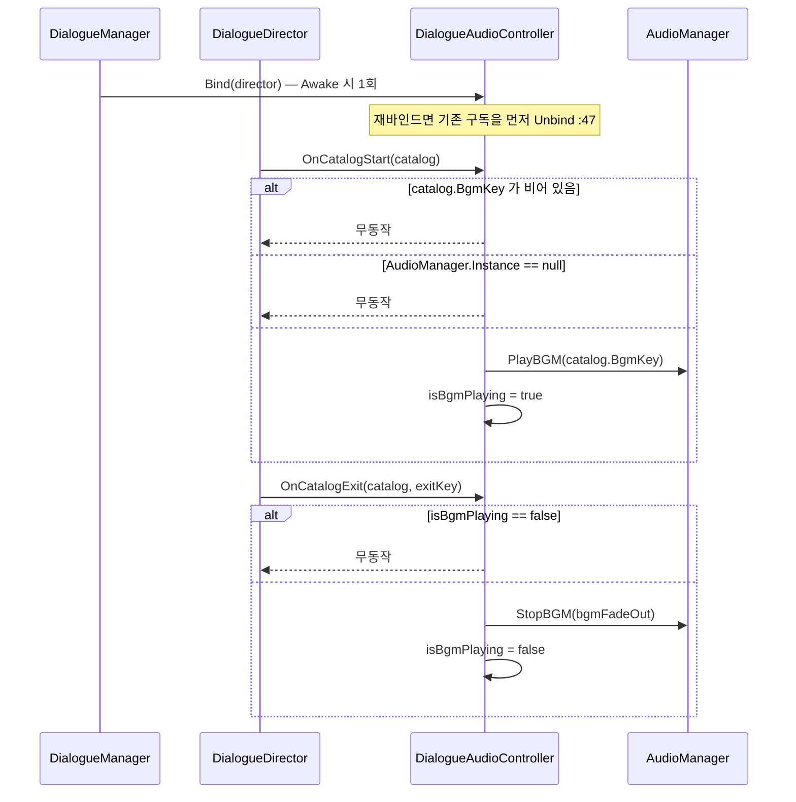
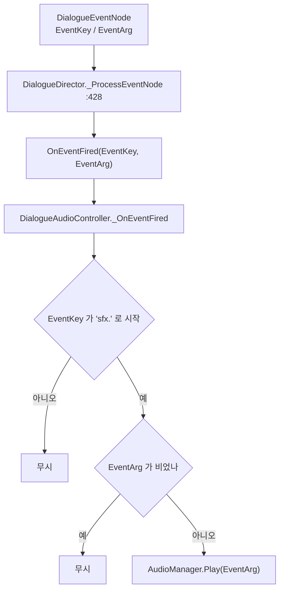
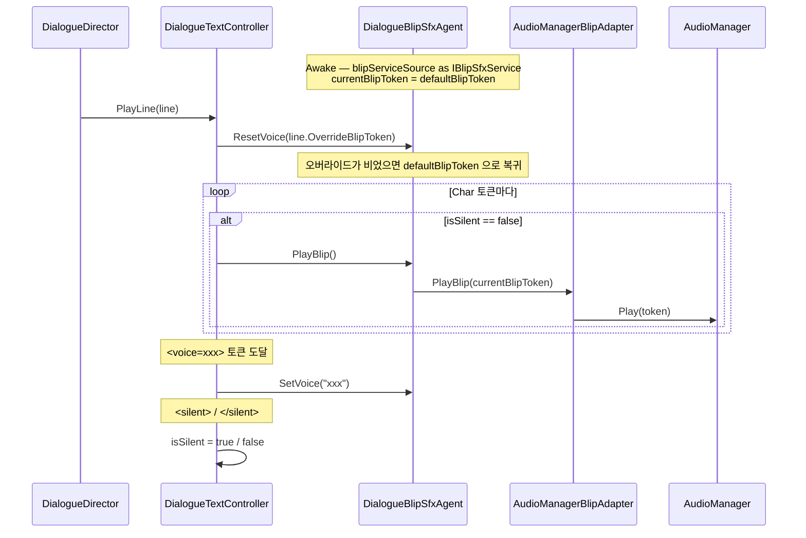
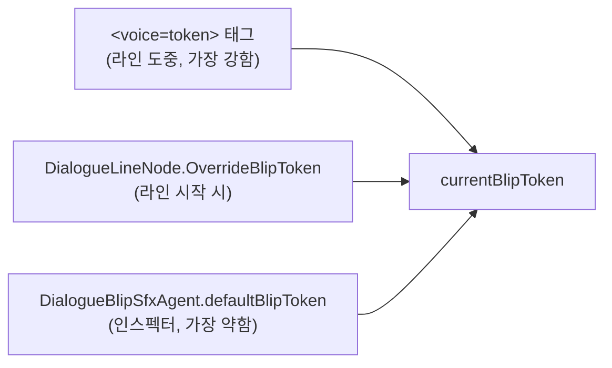

# Audio — 오디오 연동

> 대상: `Runtime/Audio/*.cs` · `Runtime/Controller/DialogueAudioController.cs` (4 파일, 346 행)
> 상위: [`Runtime/README.md`](../Runtime/README.md)
> 연관: [`Text.md`](Text.md) · [`Graph.md`](Graph.md)

---

## 요약

HDialogue 의 오디오는 **두 계통**으로 나뉘고, 둘 다 `HAudio.AudioManager` 로 수렴한다.

| 계통 | 단위 | 경로 |
|---|---|---|
| **BGM / SFX** | 카탈로그 · 그래프 이벤트 | `DialogueAudioController` → `AudioManager` |
| **블립(글자 소리)** | 글자 1개 | `DialogueTextController` → `DialogueBlipSfxAgent` → `IBlipSfxService` → `AudioManager` |

블립 계통에 인터페이스가 한 겹 끼어 있는 이유가 설계의 핵심이다.

1. **`IBlipSfxService` 는 의존성 역전용 계약이다.** 텍스트 표시 계층이 `HAudio` 를 직접
   알지 않아도 되게 하기 위한 것으로, 구현체 `AudioManagerBlipAdapter` 가 HDialogue 안에서
   그 연결을 맡는다 (`IBlipSfxService.cs:10-12`).
2. **오디오는 토큰만 지목한다.** `string token` 하나가 유일한 식별자이고, 로드는
   HDialogue 의 책임이 아니다 — 호출자가 `AudioManager` 에 prewarm 해 두어야 한다.
3. **`AudioManager.Instance` 는 매 호출마다 검사된다.** null 이면 조용히 무동작이다
   (`DialogueAudioController.cs:66`, `:73`, `:81`, `AudioManagerBlipAdapter.cs:26`).

---

## 파일 지도

| 파일 | 행 | 역할 |
|---|---|---|
| `Controller/DialogueAudioController.cs` | 106 | 카탈로그 BGM + `sfx.*` 그래프 이벤트 SFX |
| `Audio/IBlipSfxService.cs` | 61 | `PlayBlip(string token)` 단일 메서드 계약 |
| `Audio/AudioManagerBlipAdapter.cs` | 74 | 계약 구현. `AudioManager.Instance.Play` 위임 |
| `Audio/DialogueBlipSfxAgent.cs` | 105 | 현재 블립 토큰 보유. `ResetVoice` / `SetVoice` / `PlayBlip` |

---

## 계층 구조



**두 계통이 서로를 모른다.** 블립은 `DialogueDirector` 를 거치지 않고, BGM/SFX 는
`DialogueTextController` 를 거치지 않는다.

---

## 흐름 1 — BGM 수명



```csharp
// Controller/DialogueAudioController.cs:64-76
private void _OnCatalogStart(DialogueCatalogSO catalog) {
    if (string.IsNullOrEmpty(catalog.BgmKey)) return;   // BGM 없는 카탈로그
    if (AudioManager.Instance == null) return;
    AudioManager.Instance.PlayBGM(catalog.BgmKey);
    isBgmPlaying = true;
}
private void _OnCatalogExit(DialogueCatalogSO catalog, string exitKey) {
    if (!isBgmPlaying) return;                          // 자기가 튼 것만 끈다
    if (AudioManager.Instance == null) return;
    AudioManager.Instance.StopBGM(bgmFadeOut);
    isBgmPlaying = false;
}
```

**`isBgmPlaying` 플래그가 "내가 튼 BGM 만 끈다"를 보장한다** (`:36`, `:68`, `:72`).
`BgmKey` 가 없는 카탈로그를 재생해도 게임의 기존 BGM 이 꺼지지 않는다.

**카탈로그 교체 시 BGM 이 한 번 끊긴다.** `PlayCatalog` 재호출은
`OnCatalogExit("Replaced")` → `OnCatalogStart` 순으로 발행되므로
(`DialogueDirector.cs:134`, `:147`), 두 카탈로그의 `BgmKey` 가 같아도
`StopBGM(fadeOut)` 후 `PlayBGM` 이 다시 일어난다.

`exitKey` 는 읽히지 않는다 (`:71`) — `"Error"` 종료든 정상 종료든 동일하게 정지한다.

---

## 흐름 2 — `sfx.*` 이벤트

```csharp
// Controller/DialogueAudioController.cs:78-83
private void _OnEventFired(string key, string arg) {
    if (!key.StartsWith(SFX_PREFIX, StringComparison.Ordinal)) return;  // "sfx."
    if (string.IsNullOrEmpty(arg)) return;
    if (AudioManager.Instance == null) return;
    AudioManager.Instance.Play(arg);      // ⚠ key 의 접미부가 아니라 arg 를 재생한다
}
```



**키는 라우팅에만 쓰이고, 재생 토큰은 `EventArg` 다.** 즉 노드를
`EventKey = "sfx."`, `EventArg = "coin_drop"` 으로 채워야 한다. `EventKey` 의 `sfx.`
뒤에 무엇을 쓰든 재생에는 영향이 없다.

```mermaid
flowchart TD
    subgraph 인라인경로["인라인 태그 — 텍스트 안"]
    T["&lt;event=sfx.coin&gt;"] --> P1["DialogueTagParser → Event 토큰"]
    P1 --> TC["DialogueTextController<br/>OnEventTagFired(key) :224"]
    TC --> SD["CharacterStageDirector<br/>_OnEventTagFired :226"]
    SD --> PP["PortraitEventParser.TryParse"]
    PP --> DROP["'portrait.' 접두어 아님 → false<br/>여기서 사라진다"]
    end

    subgraph 그래프경로["그래프 이벤트 — EventNode"]
    EN["DialogueEventNode"] --> DIR["DialogueDirector<br/>OnEventFired :428"]
    DIR --> AC2["DialogueAudioController :78"]
    AC2 --> PLAY["AudioManager.Play(arg)"]
    end
```

### 인라인 `<event=sfx.*>` 는 도달하지 않는다



`DialogueTextController.OnEventTagFired` 의 구독자는
`CharacterStageDirector.Bind` 하나뿐이다 (`CharacterStageDirector.cs:89-92`, 패키지 전역
grep). 텍스트 컨트롤러와 `DialogueDirector.OnEventFired` 사이를 잇는 코드는 없다.

**따라서 인라인 태그로 효과음을 울릴 수 있는 경로가 현재 존재하지 않는다.**
`<sfx=token>` 태그는 런타임 no-op 이고(`DialogueTextController.cs:238-239`),
`<event=sfx.*>` 는 포트레이트 파서에서 버려진다.

---

## 흐름 3 — 블립 사슬



```csharp
// Audio/DialogueBlipSfxAgent.cs:37-56
private void Awake() {
    blipService = blipServiceSource as IBlipSfxService;
    if (blipService == null && blipServiceSource != null)
        HLogger.Error("[DialogueBlipSfxAgent] blipServiceSource does not implement IBlipSfxService.");
    currentBlipToken = defaultBlipToken;
}
public void ResetVoice(string lineOverrideToken) {
    currentBlipToken = string.IsNullOrEmpty(lineOverrideToken) ? defaultBlipToken : lineOverrideToken;
}
public void SetVoice(string token) { currentBlipToken = token; }
public void PlayBlip() { blipService?.PlayBlip(currentBlipToken); }
```

**토큰 우선순위는 3단이다.**



`<voice>` 는 `ResetVoice` 가 다음 라인에서 되돌린다 (`:47`) — 라인을 넘어 지속되지 않는다.

**두 겹의 null 무시가 있다.** `blipServiceSource` 를 배선하지 않으면
`blipService` 가 null 이라 `PlayBlip` 이 무동작이고(`:55`), 배선했더라도
`AudioManager.Instance` 가 null 이면 어댑터가 무동작이다
(`AudioManagerBlipAdapter.cs:26`). `defaultBlipToken` 이 비어 있으면
`Play("")` 가 되어 `AudioManager` 쪽에서 걸러진다.

**어댑터에는 상태가 없다** (`AudioManagerBlipAdapter.cs:22-28`). `MonoBehaviour` 인
이유는 인스펙터의 `blipServiceSource` 슬롯에 드래그하기 위해서다 — 인터페이스 필드는
Unity 가 직렬화하지 못하므로 `MonoBehaviour` 로 받아 `as` 캐스트한다
(`DialogueBlipSfxAgent.cs:30`, `:38`).

---

## 사용 예

```csharp
// 1) 인스펙터 배선
//    DialogueTextController.blipAgent   → DialogueBlipSfxAgent (같은 GameObject 권장)
//    DialogueBlipSfxAgent.blipServiceSource → AudioManagerBlipAdapter
//    DialogueManager.audioController    → DialogueAudioController

// 2) 사전 로드 — HDialogue 는 로드하지 않는다
await AudioManager.Instance.PrewarmCatalog(dialogueAudioCatalog);

// 3) 카탈로그 BGM — DialogueCatalogSO 의 bgmKey 필드에 토큰을 넣는다

// 4) 그래프 SFX — DialogueEventNode
//    EventKey = "sfx."          ← 라우팅용 접두어
//    EventArg = "coin_drop"     ← 실제 재생 토큰

// 5) 라인 블립 교체
//    DialogueLineNode.overrideBlipToken = "blip_child"
//    또는 라인 텍스트 안에서 "<voice=blip_child>안녕!"

// 6) 무음 구간
//    "<silent>[발소리가 들렸다]</silent>"
```

---

## 주의할 점

### 계약

1. **HDialogue 는 오디오를 로드하지 않는다.** 토큰만 넘기며, prewarm 은 게임 코드
   책임이다. 미로드 토큰은 `AudioManager` 쪽에서 무음 처리된다.
2. **`isBgmPlaying` 이 소유권 표시다** (`DialogueAudioController.cs:36`).
   자기가 틀지 않은 BGM 은 끄지 않는다.
3. **`sfx.` 이벤트의 재생 토큰은 `EventArg` 다** (`:82`). `EventKey` 는 접두어 매칭에만
   쓰인다.
4. **`<voice>` 는 라인 단위로 리셋된다** (`DialogueBlipSfxAgent.cs:47`,
   `DialogueTextController.cs:97`).
5. **`Bind` 는 재바인드 시 이전 구독을 해제한다** (`DialogueAudioController.cs:47`).
   `Unbind` 는 `OnDestroy` 에서도 불린다 (`:41`).
6. **`AudioManager.Instance` 는 매 호출 검사된다.** 오디오 매니저 없이도 대화는 정상
   진행된다 — 소리만 나지 않는다.

### 정리 대상

7. **인라인 `<event=sfx.*>` 가 오디오 컨트롤러에 도달하지 않는다.**
   `DialogueTextController.OnEventTagFired`(`:67`, `:224`)의 구독자는
   `CharacterStageDirector`(`CharacterStageDirector.cs:91`) 하나뿐이고, 거기서
   `PortraitEventParser.TryParse` 가 `portrait.` 접두어가 아닌 키를 `false` 로 버린다
   (`PortraitEventParser.cs:27-29`). **인라인 태그로 SFX 를 울릴 방법이 없다.**
   `<sfx=token>` 태그도 런타임 no-op 이므로(`DialogueTextController.cs:238-239`),
   현재 라인 텍스트 안에서 효과음을 재생하는 수단이 전무하다.
   기존 문서 `docs/TagUsage.md` §6·§8·§12(예시 4)가 이 경로를 동작하는 것으로 서술하나
   코드와 맞지 않는다.
8. **`TagUsage.md` §8 의 토큰 규약이 코드와 다르다.** 문서는
   `<event=sfx.<token>>` 에서 `token`(키 접미부)이 재생된다고 적었으나, 코드는
   `EventArg` 를 재생한다 (`DialogueAudioController.cs:82`). 인라인 태그에는 `arg` 를
   실을 자리 자체가 없다 — 문서의 예시가 성립할 수 없는 구조다.
9. **`bgmFadeOut` 만 노출되고 fade-in 은 없다** (`:33`). `PlayBGM` 은 인자 없이 호출되어
   `HAudio` 기본 동작(같은 클립이면 무시)을 그대로 쓴다 (`:67`).
10. **`AudioManagerBlipAdapter` 가 `MonoBehaviour` 인 것은 순수 직렬화 사정이다.**
    상태도 수명도 없으므로, 인터페이스 직렬화 지원(`[SerializeReference]` 등)으로
    바꾸면 컴포넌트 하나를 줄일 수 있다.
11. **글자마다 `AudioManager.Play` 를 호출한다** (`DialogueTextController.cs:195`).
    `Slow`(0.08s/글자)에서는 문제없지만 `Fast`(0.015s/글자) 또는 홀드 가속(×0.5,
    0.0075s/글자)에서는 초당 130회 이상의 `PlayOneShot` 이 된다 — 최소 간격 제한이
    이 계층에 없다.
