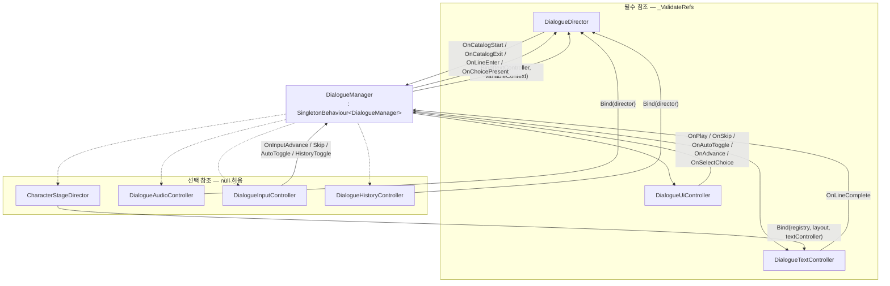
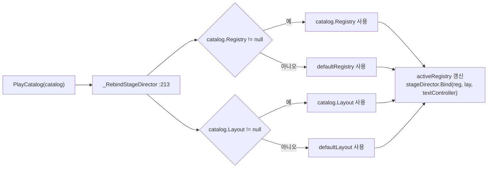
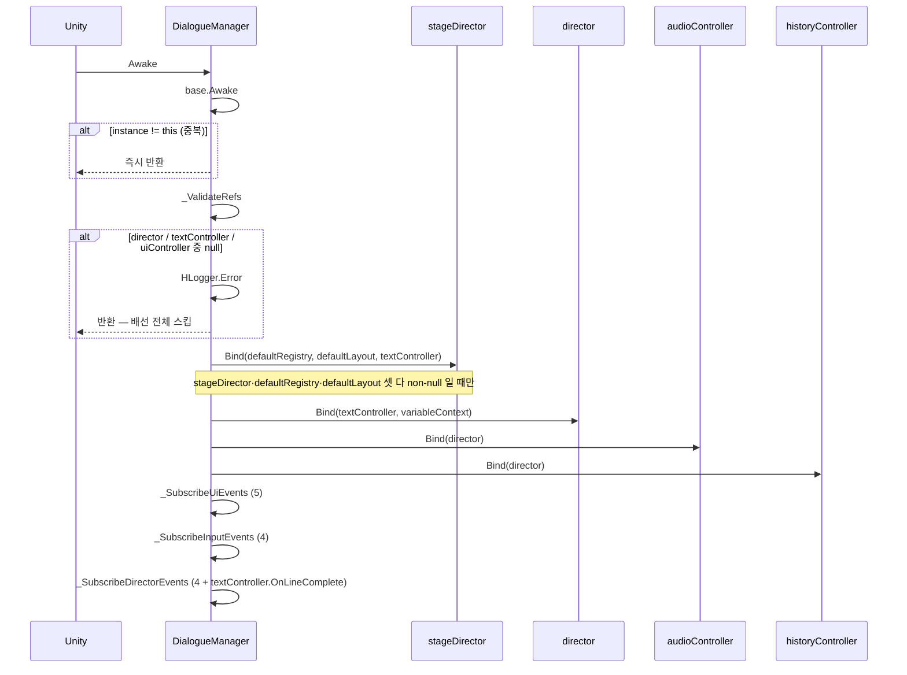
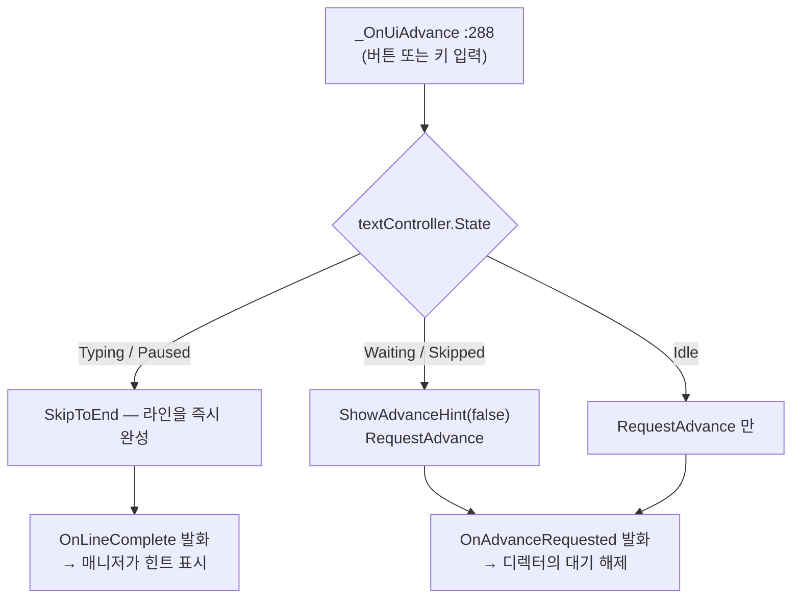
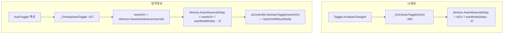
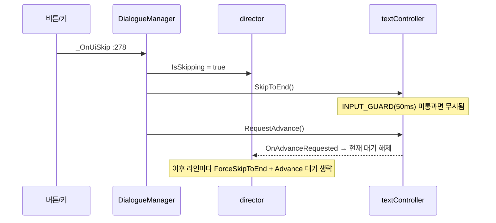
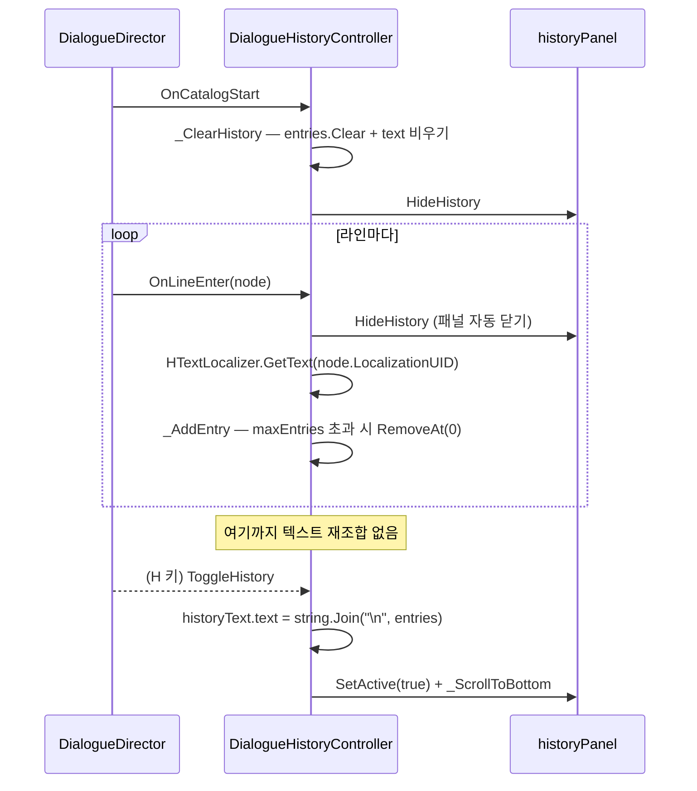
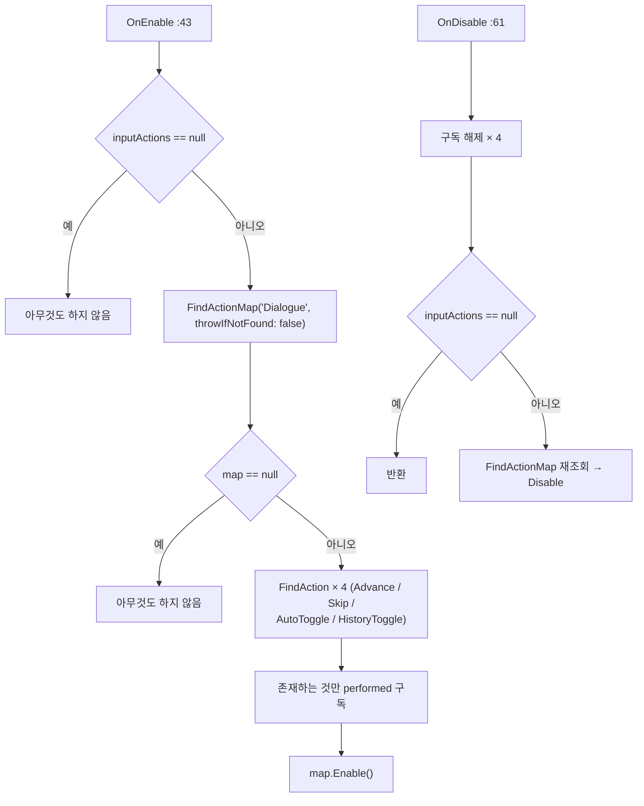
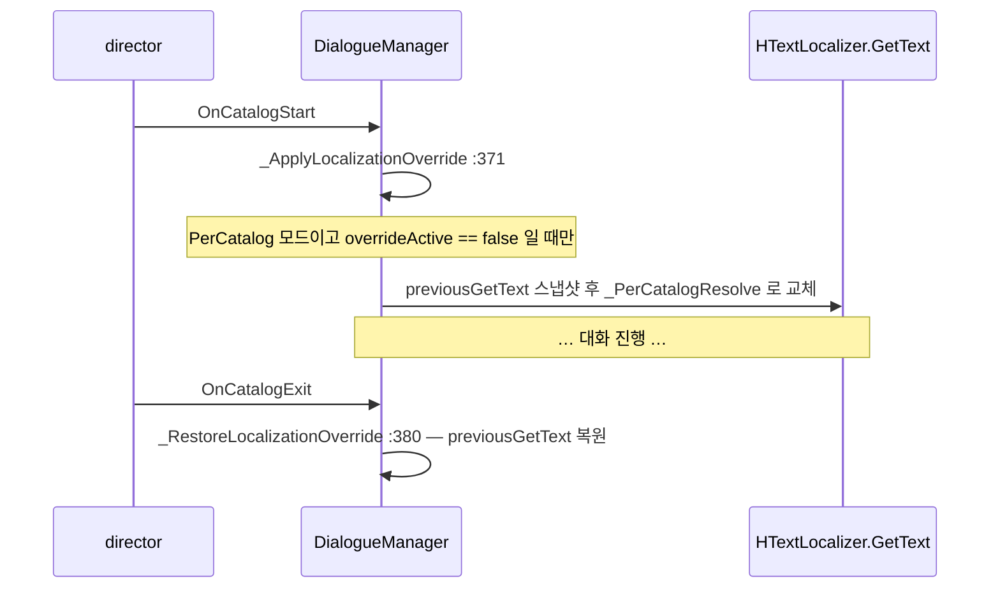

# Controller — 조율 · UI · 입력 · 이력

> 대상: `Runtime/DialogueManager.cs` · `Runtime/Controller/{DialogueUiController, DialogueInputController, DialogueHistoryController}.cs` (4 파일, 938 행)
> 상위: [`Runtime/README.md`](../Runtime/README.md)
> 연관: [`Graph.md`](Graph.md) · [`Text.md`](Text.md) · [`Audio.md`](Audio.md)

---

## 요약

`DialogueManager` 는 **씬 단위 배선판**이다. 로직을 거의 갖지 않고, 인스펙터에 물린
컴포넌트들을 `Awake` 에서 서로 연결한 뒤, 이벤트를 한 방향으로 중계한다.

책임 분리 원칙이 명시적으로 적용된 시스템이다.

1. **UI 는 이벤트만 발화한다.** `DialogueUiController` 는 버튼·토글에서 이벤트를 쏘고
   표시 갱신 메서드를 제공할 뿐, 디렉터를 모른다 (`DialogueUiController.cs:59-79`).
2. **입력도 이벤트만 발화한다.** `DialogueInputController` 는 액션맵을 열고 닫으며
   `performed` 를 이벤트로 바꾼다 (`DialogueInputController.cs:74-77`).
3. **판단은 전부 매니저에 있다.** 스킵·자동진행·진행 요청의 상태 분기는
   `DialogueManager._OnUi*` 핸들러에 모여 있다 (`DialogueManager.cs:274-323`).

`DialogueHistoryController` 와 `DialogueAudioController` 는 이 규칙에서 빠져 있다 —
매니저를 거치지 않고 **디렉터를 직접 `Bind` 한다** (`DialogueManager.cs:209-210`).

---

## 파일 지도

| 파일 | 행 | 역할 |
|---|---|---|
| `DialogueManager.cs` | 589 | 씬 싱글톤. 배선·이벤트 중계·카탈로그 선택 재생·에디터 로컬라이제이션 토글 |
| `Controller/DialogueUiController.cs` | 179 | 버튼/토글/선택지 패널 → 이벤트. 표시 갱신 메서드 |
| `Controller/DialogueInputController.cs` | 114 | Input System `"Dialogue"` 액션맵 → 이벤트 4종 |
| `Controller/DialogueHistoryController.cs` | 156 | 라인 이력 FIFO + 패널 토글 + 레이지 렌더 |

---

## 계층 구조



`stageDirector` 는 매니저가 두 번 바인드한다 — `Awake` 에서 씬 기본값으로,
`PlayCatalog` 마다 카탈로그 전용값으로 (`DialogueManager.cs:206-207`, `:213-219`).

---

## 데이터 모델

```csharp
// DialogueManager.cs:69-93
[HTitle("Stage Data")]
CharacterRegistrySO defaultRegistry;      // 카탈로그가 지정하지 않을 때의 폴백
StageLayoutSO defaultLayout;

[HTitle("Catalogs")]
DialogueCatalogSO targetCatalog;                          // PlayDefault 의 1순위
HDictionary<string, DialogueCatalogSO> catalogMap = new(); // PlayByKey 대상

[HTitle("Auto Mode")]
float autoModeDelay = 1.5f;               // auto 토글 on 일 때 디렉터에 넣는 값

DialogueCatalogSO currentCatalog;         // 마지막 재생 카탈로그 (Play 버튼 재생용)
CharacterRegistrySO activeRegistry;       // 화자 표시명 조회용
readonly MemoryDialogueVariableContext variableContext = new();
```

**변수 컨텍스트는 매니저가 소유하고 생성한다** (`:93`). 세션 한정 구현이 하드코딩되어
있으므로, 영속 저장이 필요하면 `director.Bind` 를 외부에서 다시 호출해야 한다.

### 무대 데이터 폴백



`stageDirector == null` 이면 통째로 건너뛴다 (`:214`) — 이 경우 `activeRegistry` 가
갱신되지 않아 **화자 표시명이 영원히 빈 문자열이다** (`:334-344`).

---

## 흐름 1 — Awake 배선



`OnDestroy` 는 세 구독 해제를 역순으로 수행하고, 에디터 로컬라이제이션 오버라이드를
복원한 뒤 `base.OnDestroy` 를 부른다 (`:130-138`).

**해제 쪽은 null 가드가 있고 구독 쪽은 없다** (`:229-236` vs `:221-227`). `_ValidateRefs`
가 통과했다면 구독 시점의 non-null 은 보장되므로 의도된 비대칭이다.

---

## 흐름 2 — Advance 요청의 상태 분기

이 시스템에서 유일하게 실질적인 판단 로직이다.



`Idle` 분기가 있어야 하는 이유가 코드에 남아 있다.

```csharp
// DialogueManager.cs:299-303
case TextDisplayState.Idle:
    // 첫 노드가 Cinematic/Wait 등 비텍스트 노드면 State 가 Idle 인 채 입력을 받는다.
    // 미처리 시 버튼·키보드 전부 무반응으로 대화가 영구 정지 — advance 요청만 전달.
    textController.RequestAdvance();
    break;
```

`WaitMode.UserInput` WaitNode 나 `waitForInput = true` 인 Cinematic 노드가 첫 노드일 때
텍스트 컨트롤러는 한 번도 `PlayLine` 되지 않아 `Idle` 이다. 이 분기가 없으면 그 대기를
풀 방법이 없었다.

---

## 흐름 3 — Auto 토글의 두 경로

Auto 모드를 켜고 끄는 경로가 UI 토글과 키 입력 두 갈래인데, **판정 방식이 다르다.**



```csharp
// DialogueManager.cs:317-323
private void _OnInputAutoToggle() {
    // 종전에는 AutoAdvanceDelay < 0f 로 off 를 판정했으나, 게터가 유효값을 반환하도록
    // 바뀌어 항상 false 가 된다 — 재정의 여부를 직접 묻는다.
    bool newIsOn = !director.HasAutoAdvanceOverride;
    director.AutoAdvanceDelay = newIsOn ? autoModeDelay : -1f;
    uiController.SetAutoToggle(newIsOn);
}
```

**입력 경로만 UI 토글을 되맞춘다** (`:322`). `SetIsOnWithoutNotify` 를 쓰므로
`_OnUiAutoToggle` 이 재귀 호출되지 않는다 (`DialogueUiController.cs:100`). 반대로
UI 토글을 직접 조작하면 되맞출 대상이 없어 문제가 없다.

`director.AutoAdvanceDelay = -1f` 은 세터가 `autoAdvanceOverride = -1f` 로 해석해
"해제"가 된다 (`DialogueDirector.cs:90`) — `ClearAutoAdvanceOverride()` 와 같은 효과지만
매니저는 그쪽 API 를 쓰지 않는다.

---

## 흐름 4 — Skip



**`isSkipping` 은 매니저가 끄지 않는다.** `PlayCatalog` 진입 시 디렉터가 false 로
리셋하는 것이 유일한 해제 경로다 (`DialogueDirector.cs:139`). 즉 한 번 스킵을 누르면
그 카탈로그가 끝날 때까지 유지된다 — 의도된 "카탈로그 단위 스킵"이다.

`SkipToEnd` 는 입력 가드를 지키고 `ForceSkipToEnd` 는 무시한다. 매니저의 스킵 버튼은
전자를, 디렉터의 라인 진입 시 자동 스킵은 후자를 쓴다
(`DialogueTextController.cs:115-123` vs `:148-156`).

---

## 흐름 5 — 이력 (`DialogueHistoryController`)



**레이지 렌더가 이 컨트롤러의 요점이다.** 라인마다 문자열을 다시 잇지 않고, 패널을 열
때 한 번만 `string.Join` 한다 (`DialogueHistoryController.cs:70`).

`_ScrollToBottom` 은 `Canvas.ForceUpdateCanvases` + `LayoutRebuilder.ForceRebuildLayoutImmediate`
후 `verticalNormalizedPosition = 0f` 다 (`:110-115`). 레이아웃 확정 전에 스크롤을 주면
위치가 어긋나기 때문이다.

**이력이 화자 키를 그대로 쓴다** (`:89`, `:100`). 매니저가 UI 에 넣는 표시명
(`portraitSet.DisplayName`, `DialogueManager.cs:338-340`)과 달라서, 히스토리에는
`[alice]` 같은 내부 키가 보인다.

---

## 흐름 6 — 입력 (`DialogueInputController`)



**액션 4종이 전부 선택적이다.** `throwIfNotFound: false` 로 조회하고 null 이면 구독을
건너뛴다 (`:48-56`). 에셋에 일부 액션만 있어도 나머지가 동작한다.

`OnDisable` 은 구독 해제를 먼저 하고 map 조회를 나중에 한다 (`:62-69`) — 필드에 캐시된
`InputAction` 참조로 해제하므로 에셋이 중간에 교체돼도 누수가 없다.

---

## 사용 예

```csharp
// 1) 인스펙터 필수 배선 — 하나라도 비면 Awake 에서 배선 전체가 스킵된다
//    director / textController / uiController

// 2) 재생 3종
DialogueManager.Instance.PlayCatalog(catalog);      // 직접
DialogueManager.Instance.PlayByKey("ch1_intro");    // catalogMap, bool 반환
DialogueManager.Instance.PlayDefault();             // targetCatalog → catalogMap 첫 항목

// 3) 외부 게임 코드 훅
DialogueManager.Instance.OnCatalogStart += c => playerController.enabled = false;
DialogueManager.Instance.OnCatalogExit  += (c, key) => playerController.enabled = true;

// 4) 설정 UI 연동
DialogueManager.Instance.AutoAdvanceDelay = 2.0f;   // auto 켜기
DialogueManager.Instance.AutoAdvanceDelay = -1f;    // auto 끄기
bool isOn = DialogueManager.Instance.IsAutoAdvanceOn;  // HasAutoAdvanceOverride 위임
```

---

## 에디터 도구 — 로컬라이제이션 소스 토글

`#if UNITY_EDITOR` 로 감싼 매니저 전용 기능이다 (`DialogueManager.cs:365-405`).

| 모드 | 동작 |
|---|---|
| `Manager` (기본) | `HTextLocalizer.GetText` 를 그대로 둔다 (LocalizationManager 경로) |
| `PerCatalog` | 카탈로그의 `editorLocalizationSO` 를 직조회. miss 면 UID 리터럴 |



`Stop()` 과 `OnDestroy` 도 복원을 호출한다 (`:183`, `:135`). `overrideActive` 플래그가
중복 적용과 중복 복원을 둘 다 막는다 (`:373`, `:381`).

`[HButton("Test Play(Current Catalog)")]` 은 Play 모드에서만 동작하며 `PlayDefault()` 를
부른다 (`:396-403`).

---

## 주의할 점

### 계약

1. **`_ValidateRefs` 실패 후에도 공개 API 는 호출 가능하다.** `PlayCatalog`(`:149`) /
   `Stop`(`:181`) / `IsSkipping`(`:108`) / `AutoAdvanceDelay`(`:112`) /
   `IsAutoAdvanceOn`(`:116`) 전부 `director` 를 null 검사 없이 역참조한다. 배선이 빠진
   씬에서 이들을 부르면 `NullReferenceException` 이다.
2. **`stageDirector` 가 없으면 화자 표시명이 나오지 않는다.** `activeRegistry` 는
   `_RebindStageDirector` 안에서만 갱신되고(`:217`), 그 함수는 `stageDirector == null`
   이면 즉시 반환한다(`:214`). 포트레이트를 쓰지 않고 이름표만 쓰려는 구성이 막힌다.
3. **`isSkipping` 해제는 `PlayCatalog` 뿐이다.** 매니저에 "스킵 취소" API 가 없다.
4. **`OnCatalogStart` / `OnCatalogExit` 는 디렉터 이벤트를 그대로 중계한다**
   (`:331`, `:357`). 따라서 exitKey `"Error"` / `"Replaced"` / `""` 규약이 매니저
   구독자에게도 그대로 노출된다 — [`Graph.md`](Graph.md) 참조.
5. **`_OnDirectorCatalogExit` 는 UI 를 초기화한다** (`:354-356`): 화자명 비우기,
   힌트 숨기기, 선택지 패널 닫기. 종료 사유와 무관하게 실행된다.

### 정리 대상

6. **`DialogueUiController` 의 대사 텍스트 슬롯이 사문이다.**
   `dialogueContentText`(`:33`)와 그 접근자 `ShowDialogueContent`(`:87`),
   `DialogueContentText`(`:124`), 그리고 `SetPlayButtonInteractable`(`:95`) 전부
   호출처 0건이다(패키지 전역 grep). 실제 대사는 `DialogueTextController.tmpText` 가
   그리므로, 인스펙터에서 두 슬롯을 같은 TMP 오브젝트에 물려야 한다는 암묵 규칙이 남는다.
7. **`DialogueUiController.Awake` 는 `choiceButtons` 와 `choiceButtonTexts` 의 길이
   일치를 검증하지 않는다** (`:75-78`). `ShowChoices` 는 인덱스 범위를 매번 확인하지만
   (`:113`), 텍스트 배열이 짧으면 **버튼은 보이는데 라벨이 갱신되지 않는** 조용한 실패가 된다.
8. **`_OnChoiceButtonClick` 은 상한만 검사한다** (`:129`). `index >= choiceKeys.Length`
   면 반환하지만, `ShowChoices` 가 한 번도 불리지 않은 상태에서 버튼이 눌리면
   `choiceKeys` 가 길이 0 이라 정상적으로 무시된다 — 실피해는 없다.
9. **`DialogueHistoryController` 는 화자 키를 표시한다** (`:89`). 매니저가 UI 에 쓰는
   `DisplayName` 과 다르다. 레지스트리를 참조하지 않는 구조라 표시명을 쓰려면
   `Bind` 시그니처를 늘려야 한다.
10. **`historyPanel == null` 이면 `ToggleHistory` 가 조용히 무동작이다** (`:80`).
    입력이 정상 발화되고 아무 일도 일어나지 않아 원인 추적이 어렵다 — `historyText` 는
    null 가드에 로그가 없다 (`:70`, `:107`).
