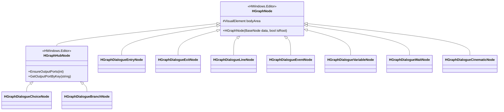
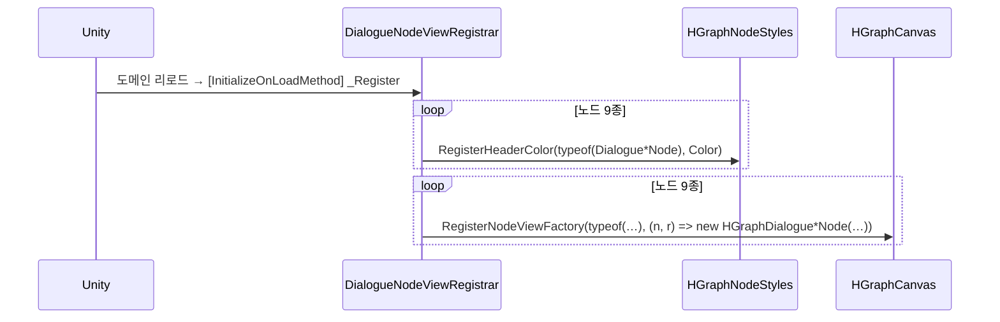
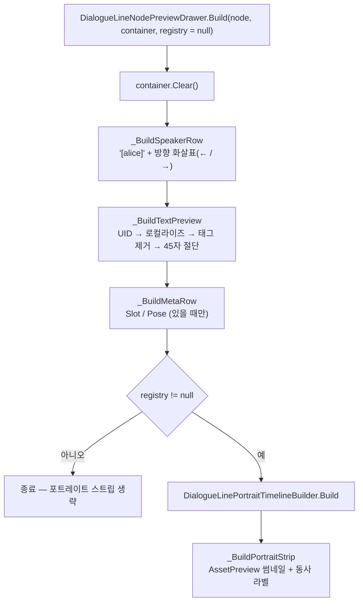
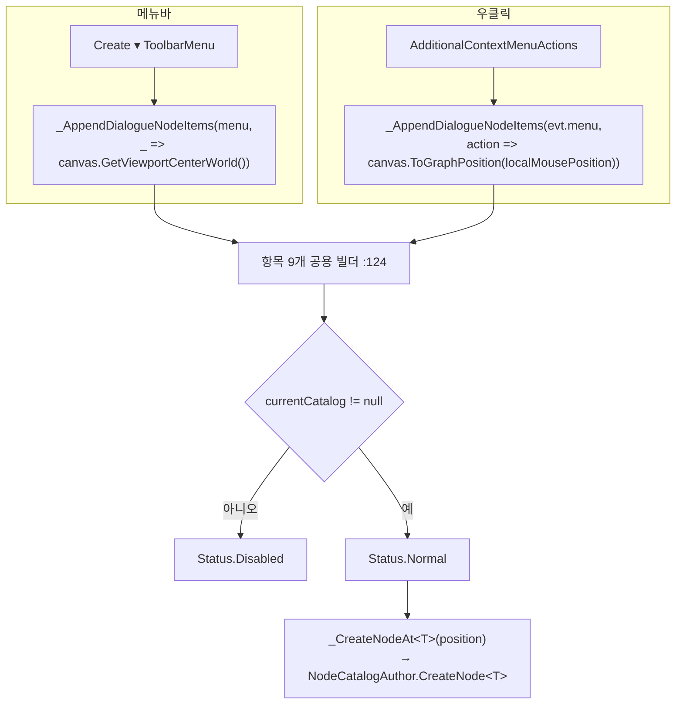
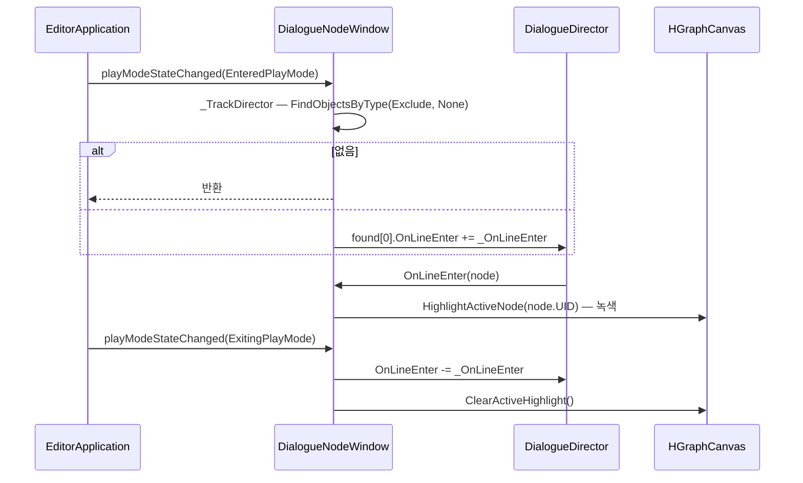
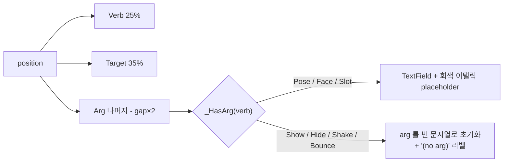

# Editor — 노드 뷰 · 그래프 창

> 대상: `Editor/Window/DialogueNodeWindow.cs` · `Editor/NodeView/*.cs` · `Editor/Drawers/*.cs` (14 파일, 1108 행)
> 상위: [`Editor/README.md`](../Editor/README.md)
> 연관: [`Nodes.md`](Nodes.md) · [`Editor-Validator.md`](Editor-Validator.md)

---

## 요약

노드 뷰 계층은 **런타임 노드 데이터를 GraphView 요소로 그린다.** 편집 기능 자체는
`HCUP.HWindows.NodeWindow.Editor` 가 전부 제공하고, HDialogue 는 세 가지만 얹는다.

1. **타입별 팩토리와 헤더 색 등록** — `DialogueNodeViewRegistrar` 가
   `[InitializeOnLoadMethod]` 로 노드 9종을 등록한다 (`:25-55`).
2. **노드별 바디 표현** — `HGraphDialogue*Node` 9종이 `bodyArea` 를 자기 데이터로 채운다.
3. **창 확장** — 생성 메뉴 2종(메뉴바·우클릭), Play 모드 하이라이트, Trace 토글.

모든 뷰 클래스가 같은 3단 구조를 따른다: 클래스 리스트 추가 → USS 부착 → `bodyArea` 구성.

---

## 파일 지도

| 파일 | 행 | 기반 | 바디 내용 |
|---|---|---|---|
| `Window/DialogueNodeWindow.cs` | 201 | `HGraphWindow<DialogueCatalogSO>` | — |
| `NodeView/DialogueNodeViewRegistrar.cs` | 94 | (정적) | 팩토리 9 + 헤더색 9 + USS 로더 |
| `NodeView/HGraphDialogueEntryNode.cs` | 47 | `HGraphNode` | 비움 |
| `NodeView/HGraphDialogueExitNode.cs` | 60 | `HGraphNode` | exitKey + "clear stage" |
| `NodeView/HGraphDialogueLineNode.cs` | 45 | `HGraphNode` | `DialogueLineNodePreviewDrawer` 위임 |
| `NodeView/HGraphDialogueEventNode.cs` | 55 | `HGraphNode` | `eventKey(eventArg)` |
| `NodeView/HGraphDialogueVariableNode.cs` | 68 | `HGraphNode` | variableKey + `Op 값` |
| `NodeView/HGraphDialogueWaitNode.cs` | 65 | `HGraphNode` | mode + 초수/키 |
| `NodeView/HGraphDialogueCinematicNode.cs` | 88 | `HGraphNode` | 지시 목록 + 대기 라벨 |
| `NodeView/HGraphDialogueChoiceNode.cs` | 61 | `HGraphHubNode` | promptText 삽입 |
| `NodeView/HGraphDialogueBranchNode.cs` | 65 | `HGraphHubNode` | conditionKey + `[Mode]` 삽입 |
| `NodeView/DialogueLineNodePreviewDrawer.cs` | 181 | (정적) | LineNode 바디 4행 빌더 |
| `NodeView/DialogueLinePortraitTimelineBuilder.cs` | 148 | (정적) | `portrait.*` 추출 + 스프라이트 해석 |
| `Drawers/CinematicInstructionDrawer.cs` | 146 | `PropertyDrawer` | 인스펙터 3컬럼 |

---

## 계층 구조



---

## 흐름 1 — 등록



헤더 색 9종이다 (`DialogueNodeViewRegistrar.cs:27-35`).

| 노드 | RGB | 인상 |
|---|---|---|
| `Entry` | 0.35, 0.35, 0.35 | 회색 |
| `Exit` | 0.25, 0.25, 0.25 | 짙은 회색 |
| `Line` | 0.18, 0.40, 0.72 | 파랑 |
| `Choice` | 0.60, 0.50, 0.08 | 노랑 |
| `Branch` | 0.42, 0.15, 0.70 | 보라 |
| `Event` | 0.15, 0.52, 0.18 | 초록 |
| `Variable` | 0.12, 0.48, 0.35 | 청록 |
| `Wait` | 0.65, 0.38, 0.08 | 주황 |
| `Cinematic` | 0.70, 0.15, 0.28 | 빨강 |

USS 는 지연 로드 후 정적 캐시된다.

```csharp
// NodeView/DialogueNodeViewRegistrar.cs:58-68
internal static class DialogueStyleSheetLoader {
    static StyleSheet sheet;
    internal static StyleSheet Get() {
        if (sheet != null) return sheet;
        string[] guids = AssetDatabase.FindAssets("t:StyleSheet HDialogueNode");
        if (guids.Length == 0) return null;
        sheet = AssetDatabase.LoadAssetAtPath<StyleSheet>(AssetDatabase.GUIDToAssetPath(guids[0]));
        return sheet;
    }
}
```

**이름으로 찾으므로 프로젝트에 `HDialogueNode` 라는 StyleSheet 가 둘 이상 있으면
첫 번째가 잡힌다** (`:63-65`). 캐시는 도메인 리로드 시 null 로 돌아가 자동 복원된다.

---

## 흐름 2 — Hub 노드의 클래스 교체

`Choice` / `Branch` 뷰는 베이스가 붙인 클래스를 즉시 떼고 자기 클래스를 붙인다.

```csharp
// NodeView/HGraphDialogueChoiceNode.cs:24-27
public HGraphDialogueChoiceNode(DialogueChoiceNode data, bool isRoot = false) : base(data, isRoot) {
    RemoveFromClassList("hgraph-hub-node");    // 베이스 생성자가 붙인 것
    AddToClassList("hdialogue-choice-node");
    _AddDialogueStyleSheet();
    …
}
```

`bodyArea` 는 **비우지 않고 앞에 끼워 넣는다** (`:34`, `HGraphDialogueBranchNode.cs:40`).
허브 포트 키 목록(`hub-entry-list`)을 베이스가 이미 채워 놨기 때문이다.

반대로 `HubNode` 가 아닌 7종은 전부 `bodyArea.Clear()` 로 시작한다
(`HGraphDialogueEntryNode.cs:23`, `ExitNode:24`, `LineNode:26`, `EventNode:24`,
`VariableNode:25`, `WaitNode:24`, `CinematicNode:26`).

---

## 흐름 3 — LineNode 바디

가장 복잡한 뷰다. 4개 구성 요소를 순서대로 쌓는다.



텍스트 미리보기가 카탈로그를 스스로 찾아낸다.

```csharp
// NodeView/DialogueLineNodePreviewDrawer.cs:60-82
string uid = node.LocalizationUID ?? string.Empty;
string previewText = uid;
if (!string.IsNullOrEmpty(uid)) {
    string path = AssetDatabase.GetAssetPath(node);                      // 노드는 카탈로그의 서브에셋
    if (!string.IsNullOrEmpty(path)) {
        var catalog = AssetDatabase.LoadAssetAtPath<DialogueCatalogSO>(path);
        if (catalog != null && catalog.EditorTryGetLocalizedText(uid, out string localized))
            previewText = localized;
    }
}
string plain = _StripTags(previewText);            // '<'…'>' 구간 제거
if (plain.Length > 45) plain = plain[..45] + "…";
```

**노드가 카탈로그의 서브에셋이라는 점을 이용한다** — 노드의 에셋 경로가 곧 카탈로그
경로다. 표시 규칙은 3단이다: UID 없음 → `(no uid)`, 로컬라이즈 실패 → `[uid]`,
성공 → `"본문…"` (`:75-77`).

### 포트레이트 스트립 — 도달 불가

`DialogueLinePortraitTimelineBuilder` 는 로컬라이즈 텍스트에서 `<event=portrait.*>` 를
뽑아 썸네일을 만든다.

```csharp
// NodeView/DialogueLinePortraitTimelineBuilder.cs:52-60
IReadOnlyList<DialogueToken> tokens = DialogueTagParser.Parse(rawText);
for (int k = 0; k < tokens.Count; k++) {
    if (tokens[k].Type != DialogueTokenType.Event) continue;
    if (!PortraitEventParser.TryParse(tokens[k].StringArg, out var ins)) continue;
    (result ??= new List<PortraitEventInstruction>()).Add(ins);
}
```

**그러나 유일한 호출처가 `registry` 를 넘기지 않는다.**

```csharp
// NodeView/HGraphDialogueLineNode.cs:27
DialogueLineNodePreviewDrawer.Build(data, bodyArea);   // 3번째 인자 생략 → registry == null
```

`Build` 의 `registry != null` 가드(`DialogueLineNodePreviewDrawer.cs:34`)에 걸려
스트립이 항상 생략되므로, **`DialogueLinePortraitTimelineBuilder`(148행) 전체와
`_BuildPortraitStrip`(`:105-130`)이 현재 도달 불가 코드다.**

캐시 구조는 아래와 같다 (실행되지 않지만 설계로 남아 있다).

| 캐시 | 키 | 내용 | 무효화 |
|---|---|---|---|
| `cache` (`:29`) | `rawText.GetHashCode()` | 파싱 결과 목록 | 없음 — 도메인 리로드까지 유지 |
| `spriteCache` (`:30`) | `SpriteKey` | 로드된 스프라이트 (실패 시 null 캐시) | 없음 |
| `addrHandles` (`:31`) | `SpriteKey` | Addressable 핸들 | **해제 경로 없음** |

```csharp
// NodeView/DialogueLinePortraitTimelineBuilder.cs:84-97
AsyncOperationHandle<Sprite> handle = Addressables.LoadAssetAsync<Sprite>(key);
Sprite sprite = handle.WaitForCompletion();          // 에디터 동기 로드
if (handle.Status == AsyncOperationStatus.Succeeded && sprite != null) {
    addrHandles[key] = handle; spriteCache[key] = sprite; return sprite;
}
Addressables.Release(handle);                        // 실패 시에만 해제
```

성공한 핸들은 `addrHandles` 에 담기지만 `Release` 하는 코드가 없다. 실패 시에만
해제된다 — 성공 핸들의 수명이 도메인 리로드까지다.

**해시 캐시는 텍스트 내용만 본다** (`:48`). 서로 다른 라인이 같은 텍스트를 쓰면 캐시를
공유하는데, 파싱 결과가 텍스트에만 의존하므로 문제되지 않는다. 해시 충돌 시에는 잘못된
미리보기가 나오지만 에디터 한정이다 — 파일 헤더가 이를 명시한다 (`:13`).

---

## 흐름 4 — 노드 생성



**위치 계산만 다르고 항목 목록은 공용이다** (`DialogueNodeWindow.cs:124-146`).
`Func<DropdownMenuAction, Vector2>` 를 주입해 메뉴바는 뷰포트 중앙, 우클릭은 마우스
그래프 좌표를 쓴다.

메뉴 라벨은 9개다: `Entry Node` / `Line Node` / `Choice Node (Hub)` /
`Branch Node (Hub)` / `Exit Node` / `Event Node` / `Variable Node` / `Wait Node` /
`Cinematic Node` (`:128-145`).

---

## 흐름 5 — Play 모드 하이라이트 · Trace



Trace 토글은 캔버스에 위임한다.

```csharp
// Window/DialogueNodeWindow.cs:68-76
ToolbarToggle toggle = new ToolbarToggle { text = "Trace" };
toggle.tooltip = "선택 노드에서 도달 가능한 모든 노드를 청록으로 표시 (선택 없으면 Root 기준)";
toggle.RegisterValueChangedCallback(evt => {
    if (canvas == null) return;
    canvas.SetTraceMode(evt.newValue);
});
```

`OnDisable` 이 `_UntrackDirector` 를 부르므로 창을 닫아도 구독이 남지 않는다 (`:51-54`).

---

## 흐름 6 — `CinematicInstructionDrawer`

인스펙터의 `List<CinematicInstruction>` 항목을 한 줄 3컬럼으로 그린다.



```csharp
// Drawers/CinematicInstructionDrawer.cs:50-56
PortraitVerb verb = (PortraitVerb)verbProp.enumValueIndex;
if (_HasArg(verb)) {
    _DrawArgField(argRect, argProp, _ArgPlaceholder(verb));
} else {
    if (!string.IsNullOrEmpty(argProp.stringValue)) argProp.stringValue = string.Empty;
    EditorGUI.LabelField(argRect, "(no arg)", _NoArgStyle());
}
```

**Verb 를 인자 없는 동사로 바꾸면 기존 arg 가 지워진다** (`:54`). 되돌려도 값은
복구되지 않는다.

placeholder 는 포커스가 없고 값이 빌 때만 그린다 (`:83-88`). 컨트롤 이름을
`"CinematicArg_" + propertyPath` 로 만들어 리스트 항목마다 구분한다 (`:76`).

GUIStyle 은 지연 초기화한다 (`:106-123`) — `EditorStyles` 접근이 `OnGUI` 최초 호출
이전에는 안전하지 않기 때문이다.

---

## 주의할 점

### 계약

1. **`bodyArea` 처리가 기반 클래스에 따라 갈린다.** `HGraphNode` 파생 7종은
   `Clear()` 후 채우고, `HGraphHubNode` 파생 2종은 `Insert(0, …)` 로 앞에 끼운다 —
   허브 포트 목록을 지우면 안 되기 때문이다.
2. **USS 부착은 각 뷰가 개별 수행한다.** 9종 모두 `_AddDialogueStyleSheet()` 를 자기
   생성자에서 부른다. 시트가 없으면(`Get()` 이 null) 조용히 넘어간다.
3. **`Show` 동사의 arg 필드는 드로어에서 막혀 있다** (`:91-93`). 인라인 태그에서는
   슬롯·포즈·방향 3인자가 가능하지만, Cinematic 노드 인스펙터에서는 입력할 수 없다 —
   [`Nodes.md`](Nodes.md) 참조.
4. **`AssetPreview.GetAssetPreview` 는 비동기다** (`DialogueLineNodePreviewDrawer.cs:119`).
   첫 호출에서 null 이 나올 수 있고 다음 리페인트에서 채워진다.

### 정리 대상

5. **`DialogueLinePortraitTimelineBuilder`(148행) 전체가 도달 불가다.**
   `DialogueLineNodePreviewDrawer.Build` 의 `registry` 파라미터에 값을 넘기는 호출처가
   없다(`HGraphDialogueLineNode.cs:27` 이 유일한 호출, 2인자). `registry != null`
   가드(`DialogueLineNodePreviewDrawer.cs:34`)에 막혀 `_BuildPortraitStrip`(`:105-130`)과
   빌더 전체가 실행되지 않는다. 살리려면 뷰가 카탈로그의 `Registry` 를 찾아 넘겨야 한다.
6. **성공한 Addressable 핸들의 해제 경로가 없다**
   (`DialogueLinePortraitTimelineBuilder.cs:87`). `addrHandles` 에 담기기만 하고
   `Release` 하는 코드가 없다 — 현재는 5번 때문에 실행되지 않아 실피해가 없지만,
   스트립을 되살리면 곧바로 핸들 누수가 된다.
7. **`HGraphDialogueCinematicNode` 의 헤더 주석이 코드와 다르다** (`:9`).
   "autoAdvance == false 이면 'wait next' 라벨"이라 적혀 있으나 실제 조건은
   `data.WaitForInput` 이다 (`:49`). `autoAdvance` 라는 필드는 런타임에 존재하지 않는다.
8. **`DialogueNodeViewRegistrar` 헤더의 "9종"은 정확하다** (`:8`). 다만 `Graph/Nodes/`
   폴더에는 12개 파일이 있어(노드 9 + 열거형 3) 파일 수와 노드 수가 다르다.
9. **Play 모드 하이라이트가 첫 디렉터 고정이다** (`Window/DialogueNodeWindow.cs:104`).
   `found[0]` 을 쓰므로 씬에 디렉터가 둘 이상이면 임의의 하나를 본다.
10. **`DialogueStyleSheetLoader.Get()` 은 이름 검색이다** (`:63`).
    `t:StyleSheet HDialogueNode` 로 찾은 첫 결과를 쓰므로 동명 에셋이 있으면 어느 쪽이
    잡힐지 정해지지 않는다.
