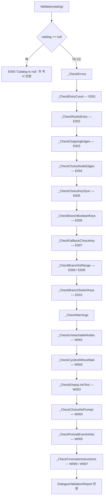
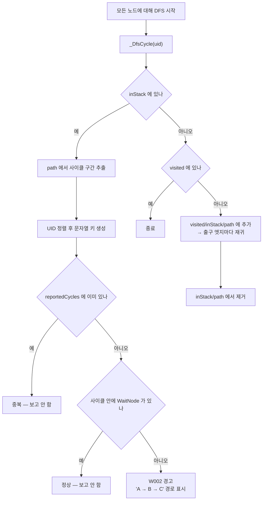
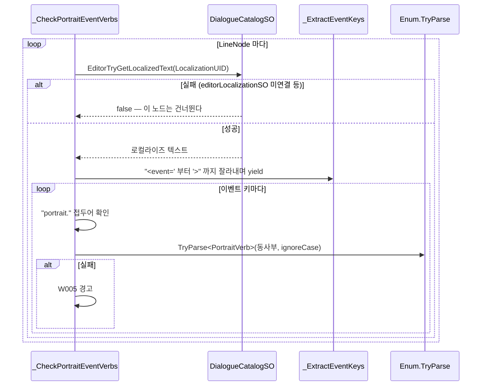
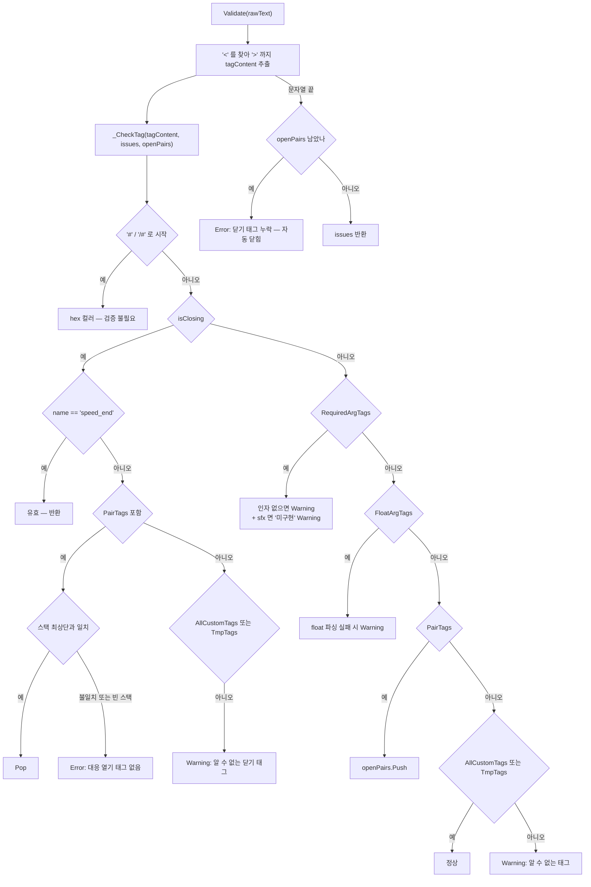
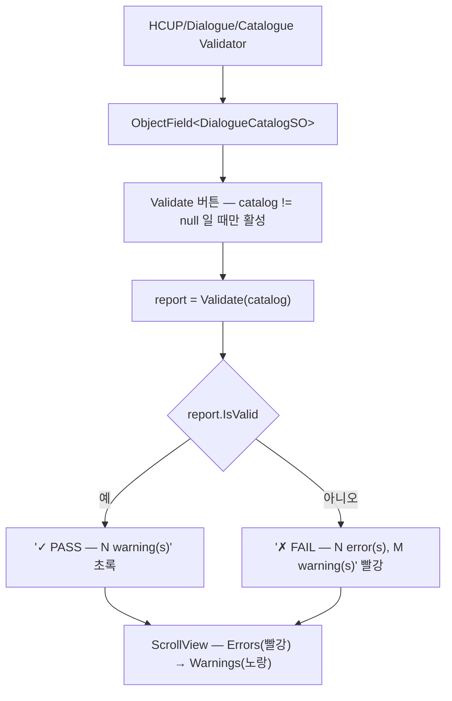

# Editor — 검증기

> 대상: `Editor/Validator/*.cs` (6 파일, 968 행)
> 상위: [`Editor/README.md`](../Editor/README.md)
> 연관: [`Graph.md`](Graph.md) · [`Nodes.md`](Nodes.md) · [`Text.md`](Text.md)

---

## 요약

검증기는 둘이고 서로 독립이다.

| 검증기 | 대상 | 결과 타입 | 창 |
|---|---|---|---|
| `DialogueCatalogValidator` | 그래프 구조 (노드·엣지·포트 키) | `DialogueValidationReport` | `HCUP/Dialogue/Catalogue Validator` |
| `DialogueTextValidator` | 태그 구조 (문자열 1개) | `IReadOnlyList<ValidationIssue>` | `Tools/HDialogue/Dialogue Tag Validator` |

규약 셋.

1. **순수 정적 클래스다.** 상태가 없고, `Debug.Log` 를 남기지 않으며, 결과 DTO 만
   반환한다 (`DialogueCatalogValidator.cs:25`, `DialogueTextValidator.cs:26`).
   부작용이 없으므로 CI·배치 스크립트에서 그대로 호출할 수 있다.
2. **오류와 경고가 구분된다.** `IsValid` 는 `Errors.Count == 0` 이다
   (`DialogueValidationReport.cs:25`). 경고는 실행을 막지 않는다.
3. **수동 실행 전용이다.** 저장·빌드·플레이 진입 어디에도 훅이 없다.

---

## 파일 지도

| 파일 | 행 | 역할 |
|---|---|---|
| `DialogueCatalogValidator.cs` | 478 | 그래프 규칙 17종 (E001~E010, W001~W007) |
| `DialogueCatalogValidatorWindow.cs` | 105 | 카탈로그 필드 + Validate 버튼 + 색상 목록 |
| `DialogueTextValidator.cs` | 194 | 태그 구조 검사. `IssueSeverity` / `ValidationIssue` 내포 |
| `DialogueTextValidatorWindow.cs` | 98 | TextArea + Validate 버튼 + HelpBox 목록 |
| `DialogueValidationIssue.cs` | 49 | `NodeUID` / `Code` / `Message` (readonly struct) |
| `DialogueValidationReport.cs` | 44 | `Errors` / `Warnings` / `IsValid` |

---

## 데이터 모델

```csharp
// Validator/DialogueValidationIssue.cs:21-30
public readonly struct DialogueValidationIssue {
    public readonly NodeUID NodeUID;   // None = 카탈로그 수준 이슈
    public readonly string Code;       // "E001" … "W007", 널 카탈로그는 "E000"
    public readonly string Message;
}
// Validator/DialogueValidationReport.cs:21-26
public struct DialogueValidationReport {
    public List<DialogueValidationIssue> Errors;
    public List<DialogueValidationIssue> Warnings;
    public readonly bool IsValid => Errors == null || Errors.Count == 0;
}
```

`DialogueTextValidator` 는 별도 타입을 쓴다 — 노드가 아니라 문자열을 보므로 `NodeUID`
가 필요 없다.

```csharp
// Validator/DialogueTextValidator.cs:28-38
public enum IssueSeverity { Error, Warning }
public readonly struct ValidationIssue {
    public readonly IssueSeverity Severity;
    public readonly string Message;      // 한국어 메시지
}
```

---

## 흐름 1 — 카탈로그 검증



### 오류 규칙 10종

| 코드 | 규칙 | 근거 |
|---|---|---|
| `E001` | EntryNode 가 정확히 1개 | `:79-86` |
| `E002` | EntryNode 가 `RootUID` 와 일치 | `:87-96` |
| `E003` | `ExitNode` 외 모든 노드에 출구 엣지 존재 | `:97-107` |
| `E004` | `ChoiceNode` 출구 엣지 2개 이상 | `:108-118` |
| `E005` | `choices` 와 허브 포트 entries 의 개수·키 집합 일치 (양방향) | `:119-148` |
| `E006` | `BranchMode.Boolean` 의 포트 키가 `"true"` / `"false"` | `:149-163` |
| `E007` | `FallbackChoiceKey` 가 `choices` 안에 존재 | `:164-175` |
| `E008` | `IntRange` 포트 키 형식 `min_max` 이고 `min <= max` | `:176-198` |
| `E009` | `IntRange` 구간끼리 겹치지 않음 | `:199-208` |
| `E010` | `Switch` 포트 키가 비어 있지 않고 중복 없음 | `:211-233` |

E005 가 양방향인 것이 특징이다.

```csharp
// Validator/DialogueCatalogValidator.cs:130-146
var choiceKeySet = new HashSet<string>(choices.Select(c => c.Key));
var entryKeySet  = new HashSet<string>(entries.Select(e => e.Key));
foreach (string key in choiceKeySet)
    if (!entryKeySet.Contains(key)) errors.Add(… $"choice key '{key}' has no matching port entry.");
foreach (string key in entryKeySet)
    if (!choiceKeySet.Contains(key)) errors.Add(… $"port entry key '{key}' has no matching choice.");
```

개수 불일치면 키 비교를 건너뛰고 한 건만 보고한다 (`:123-129`) — 개수가 어긋난 상태에서
키 차집합을 나열하면 노이즈가 되기 때문이다.

E009 의 겹침 검사는 O(n²) 이중 루프다 (`:199-208`). 구간 수가 작다는 전제다.

### 경고 규칙 7종

| 코드 | 규칙 | 근거 |
|---|---|---|
| `W001` | EntryNode 로부터 도달 불가한 노드 (BFS) | `:256-277` |
| `W002` | `WaitNode` 없는 사이클 (DFS) | `:278-323` |
| `W003` | `LineNode.LocalizationUID` 가 빈 문자열 | `:324-333` |
| `W004` | `ChoiceNode` 에 `PromptText` 도 없고 앞 노드가 `LineNode` 도 아님 | `:334-345` |
| `W005` | `<event=portrait.*>` 의 알 수 없는 동사 | `:346-361` |
| `W006` | `CinematicNode.Instructions` 가 비어 있음 | `:363-370` |
| `W007` | `CinematicInstruction.TargetCharacterKey` 가 빈 문자열 | `:371-379` |

---

## 흐름 2 — W002 사이클 탐지



**`WaitNode` 가 하나라도 있는 사이클은 경고하지 않는다** (`:300-304`). 대기가 있으면
프레임이 진행되므로 하드 프리즈로 이어지지 않는다는 판단이다.

사이클 중복 제거는 **UID 를 정렬해 만든 키**로 한다 (`:297-300`). 같은 순환을 진입점만
바꿔 여러 번 발견해도 한 번만 보고된다.

```csharp
// Validator/DialogueCatalogValidator.cs:296-300
List<NodeUID> cycle = path.GetRange(cycleStart, path.Count - cycleStart);
var sorted = cycle.Select(n => n.Value).OrderBy(s => s).ToList();
string cycleKey = string.Join(",", sorted);
if (!reportedCycles.Add(cycleKey)) return;
```

`_DfsCycle` 은 **재귀다** (`:291-323`). 대화 그래프 규모에서는 문제없지만 노드가 수천
단위로 깊게 이어지면 스택 깊이가 곧 경로 길이다.

**이 규칙이 런타임 방어를 대신하지 못한다.** 수동 실행이므로, `DialogueDirector` 가
`MAX_NODE_TRANSITIONS`(10000)와 `SYNC_YIELD_INTERVAL`(32)로 별도 방어를 둔다 —
`DialogueDirector.cs:64-68` 의 주석이 W002 를 명시적으로 가리킨다.

---

## 흐름 3 — W005 포트레이트 동사 검사



**`editorLocalizationSO` 를 연결하지 않으면 W005 가 전혀 동작하지 않는다**
(`:351`). 조용히 건너뛰므로 "경고 0건"이 "검사했는데 문제없음"인지 "검사 자체를 못 함"
인지 구분되지 않는다.

동사부 추출은 `@` 와 `:` 중 먼저 오는 위치까지다.

```csharp
// Validator/DialogueCatalogValidator.cs:382-391
static bool _IsKnownPortraitVerb(string eventKey, int prefixLen) {
    string body = eventKey.Substring(prefixLen);
    int end = body.Length;
    int atIdx = body.IndexOf('@');
    int colonIdx = body.IndexOf(':');
    if (atIdx >= 0 && atIdx < end) end = atIdx;
    if (colonIdx >= 0 && colonIdx < end) end = colonIdx;
    return Enum.TryParse<PortraitVerb>(body.Substring(0, end), ignoreCase: true, out _);
}
```

**`PortraitEventParser.TryParse` 를 쓰지 않고 직접 구현한 이유는 부작용 회피다** —
런타임 파서는 실패 시 `HLogger.Warning` 을 낸다 (`PortraitEventParser.cs:50`).
검증기는 로그를 남기지 않는다는 규약을 지키기 위해 파싱을 중복 구현했다.

`_ExtractEventKeys` 는 `<event=` 부터 `>` 까지를 잘라내는 반복자다 (`:392-404`).
`DialogueTagParser` 의 완전 파싱과 달리 문자열 검색만 한다.

---

## 흐름 4 — 태그 검증



심각도 배정이 명확하다.

| 심각도 | 조건 |
|---|---|
| `Error` | 짝 태그 미닫힘 (`:62-63`), 대응 없는 닫기 태그 (`:91`) |
| `Warning` | 필수 인자 누락 (`:103`), `sfx` 미구현 (`:105`), 잘못된 float (`:113`), 알 수 없는 태그 (`:95`, `:127`) |

**짝 검사가 런타임 파서보다 엄격하다.** 파서는 이름 불일치를 경고 후 Pop 하지만
(`DialogueTagParser.cs:134-141`), 검증기는 최상단과 이름이 다르면 `Error` 를 낸다
(`:90-91`). 또 파서는 `silent` 의 짝을 추적하지 않지만 검증기는 `PairTags` 에 포함해
검사한다 (`DialogueTagRegistry.cs:44-46`).

두 검증기 모두 **`DialogueTagRegistry` 를 단일 소스로 읽는다** (`:89`, `:94`, `:101`,
`:110`, `:118`, `:124`). 태그를 추가할 때 레지스트리만 고치면 검증기는 따라온다.

---

## 에디터 창

### `DialogueCatalogValidatorWindow`



이슈 한 줄 형식은 `[코드] [UID앞8자] 메시지` 다 (`:79-85`). 카탈로그 수준 이슈
(`NodeUID.None`)는 UID 부분이 생략된다.

`report` 는 `DialogueValidationReport?` 다 (`:27`) — 아직 실행하지 않은 상태와 결과가
없는 상태를 구분한다.

### `DialogueTextValidatorWindow`

`TextArea` 에 문자열을 붙여 넣고 Validate 를 누르는 단순 창이다 (`:29-59`).
결과 0건이면 `"태그 구조 이상 없음."` HelpBox 를 띄운다 (`:45-48`).

**노드에서 텍스트를 가져오는 경로가 없다.** 손으로 붙여 넣어야 한다.

---

## 사용 예

```csharp
// 코드에서 직접 호출 — 부작용이 없으므로 배치·CI 에 적합
DialogueValidationReport report = DialogueCatalogValidator.Validate(catalog);
if (!report.IsValid) {
    foreach (var issue in report.Errors)
        Debug.LogError($"[{issue.Code}] {issue.Message}", catalog);
}

// 태그 검증
foreach (var issue in DialogueTextValidator.Validate(rawText)) {
    if (issue.Severity == DialogueTextValidator.IssueSeverity.Error)
        Debug.LogError(issue.Message);
}
```

---

## 주의할 점

### 계약

1. **`IsValid` 는 오류만 본다** (`DialogueValidationReport.cs:25`). 경고가 있어도
   PASS 다. `Errors` 가 null 이어도 true 이지만, `Validate` 는 항상 초기화하므로
   실제로 null 이 되는 경로는 없다 (`:48-49`).
2. **`E003` 과 `_ResolveNextNode` 가 같은 규칙을 검사한다.** 검증기는 저작 시점에
   (`:97-107`), 런타임은 `_FinishWithError` 로 (`DialogueDirector.cs:271-273`).
   `ExitNode` 예외도 양쪽에서 동일하다.
3. **`W002` 는 런타임 방어를 대신하지 못한다.** 수동 실행이므로,
   `MAX_NODE_TRANSITIONS` / `SYNC_YIELD_INTERVAL` 이 실제 방어선이다 —
   [`Graph.md`](Graph.md) 참조.
4. **검증기는 로그를 남기지 않는다.** `PortraitEventParser` 대신 동사 파싱을 중복
   구현한 이유가 이것이다 (`:382-391`).

### 정리 대상

5. **`W005` 가 `editorLocalizationSO` 미연결 시 조용히 전체 스킵된다** (`:351`).
   "검사했으나 문제없음"과 "검사하지 못함"이 결과에서 구분되지 않는다. 카탈로그 수준
   정보 이슈로 한 건 남기는 편이 낫다.
6. **`IntRange` 키 파싱이 런타임과 검증기에서 따로 구현되어 있다.**
   런타임은 `Split('_')` + `parts.Length == 2` (`DialogueDirector.cs:403-407`),
   검증기는 첫 `_` 기준 `Substring` (`:236-243`). `"1_2_3"` 처럼 `_` 가 여럿인 키에서
   두 구현의 거부 경로가 다르다.
7. **`DialogueValidationIssue` 헤더 주석이 낡았다** (`:8`).
   "E001~E006 오류, W001~W004 경고"라 적혀 있으나 실제 범위는 E001~E010 / W001~W007 이다.
8. **`W003` 의 의미가 기존 문서와 다르다.** `docs/TagUsage.md` §11 표는 W003 을
   "CinematicNode 의 instructions 목록 개수 불일치"로 적었으나, 코드의 W003 은
   `LineNode.LocalizationUID` 가 빈 문자열인 경우다 (`:40`, `:324-332`).
9. **`_DfsCycle` 이 재귀다** (`:291-323`). 경로 길이가 곧 스택 깊이다. 매우 긴 선형
   그래프에서 `StackOverflowException` 가능성이 이론상 남는다.
10. **태그 검증 창이 노드와 연결되어 있지 않다.** 문자열을 손으로 붙여 넣어야 한다 —
    `DialogueCatalogValidator` 가 `_ExtractEventKeys` 로 텍스트를 이미 읽고 있으므로
    (`:392-404`), 카탈로그 검증에 태그 검증을 합칠 여지가 있다.
11. **메뉴 루트가 다른 두 창과 갈린다** — `Tools/HDialogue/Dialogue Tag Validator`
    (`DialogueTextValidatorWindow.cs:63`) vs `HCUP/Dialogue/Catalogue Validator`
    (`DialogueCatalogValidatorWindow.cs:23`).
