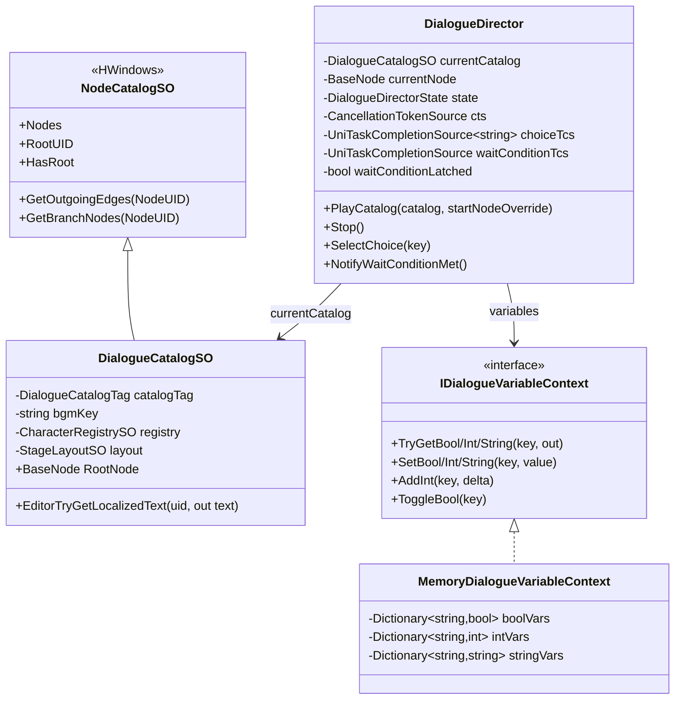
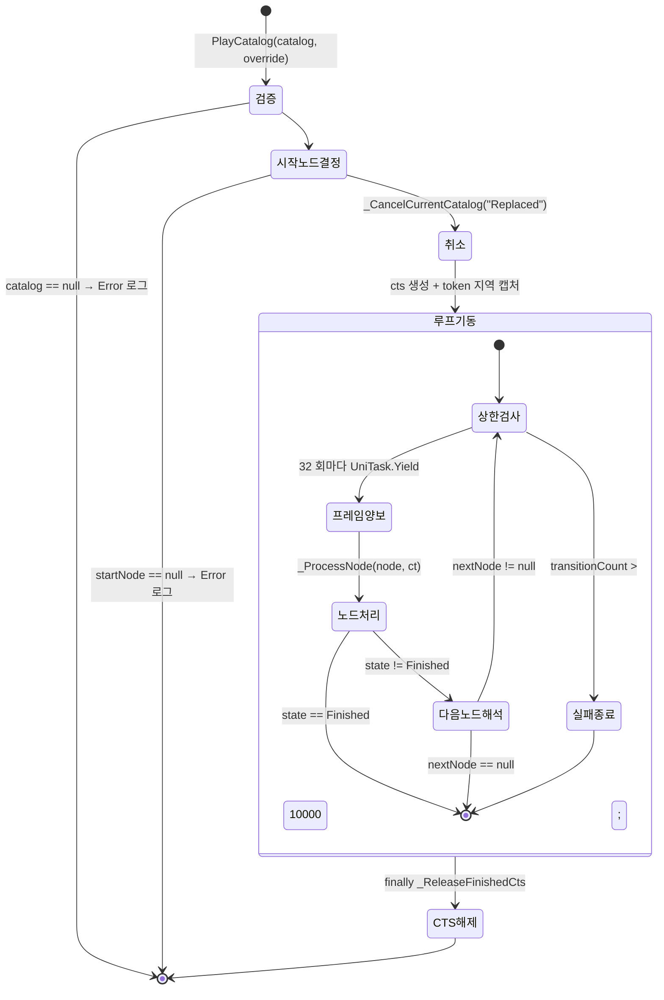
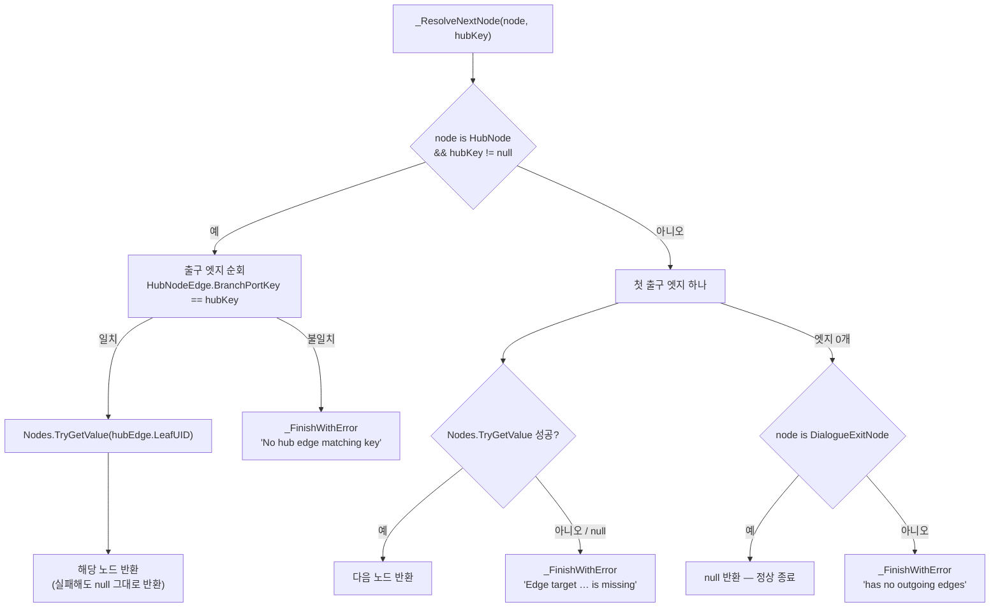
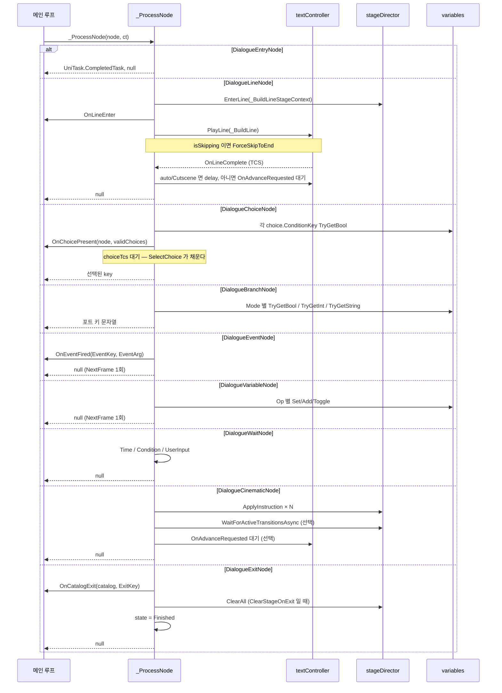
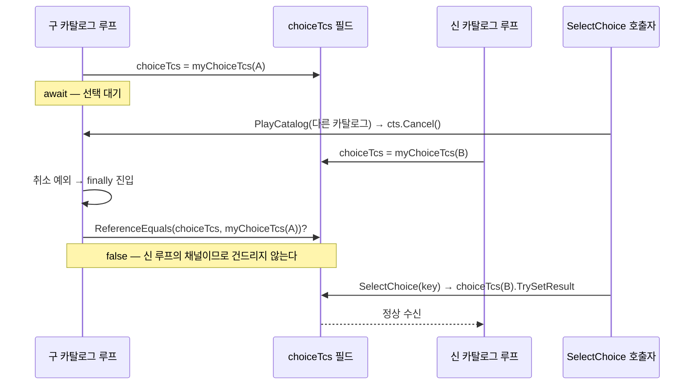
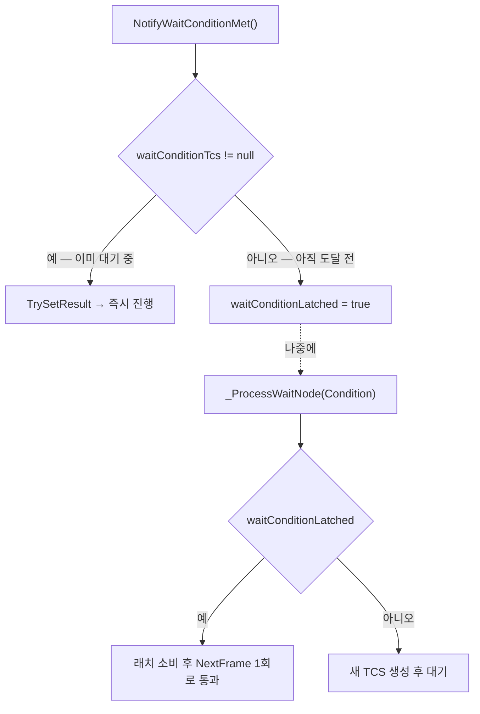
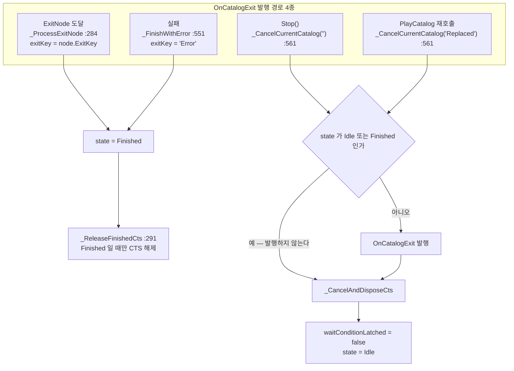
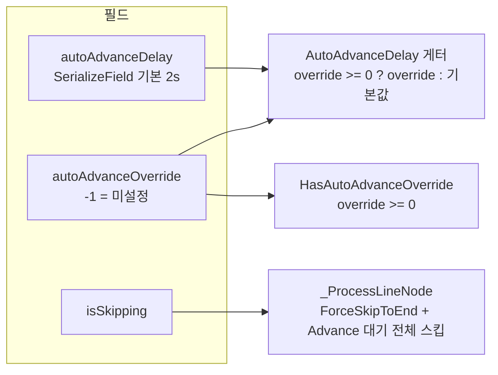

# Graph — 순회 엔진

> 대상: `Runtime/Graph/*.cs` (6 파일, 1032 행)
> 상위: [`Runtime/README.md`](../Runtime/README.md)
> 연관: [`Nodes.md`](Nodes.md) · [`Controller.md`](Controller.md)

---

## 요약

`DialogueDirector` 는 **대화 그래프를 순회하는 유일한 주체**다. 카탈로그의 시작 노드에서
출발해, 노드 타입별 처리를 거치고, 엣지를 따라 다음 노드로 이동하는 while 루프
하나가 전부다 (`DialogueDirector.cs:180-196`).

이 시스템을 이해하는 데 필요한 규약은 셋이다.

1. **분기 결과는 `string hubKey`.** `_ProcessNode` 는 `UniTask<string>` 을 반환한다.
   단순 노드는 `null`, `HubNode` 파생(Choice/Branch)은 선택된 포트 키를 돌려준다.
   메인 루프는 두 경우를 같은 코드로 다룬다 (`DialogueDirector.cs:208-240`).
2. **모든 실패는 `_FinishWithError` 로 모인다.** state 를 `Finished` 로 바꾸고
   `OnCatalogExit(catalog, "Error")` 를 발행한다 (`DialogueDirector.cs:547-553`).
3. **CTS 소유권은 지역 변수로 캡처한다.** `PlayCatalog` 는 `cts.Token` 을 지역에 담아
   루프에 넘긴다 — 구독자가 `PlayCatalog` 를 재진입해도 이 루프는 자기 토큰으로 돈다
   (`DialogueDirector.cs:135-146`).

---

## 파일 지도

| 파일 | 행 | 역할 |
|---|---|---|
| `DialogueDirector.cs` | 715 | 순회 엔진. 노드 처리기 9종 + 종료·취소 계약 |
| `DialogueCatalogSO.cs` | 146 | `NodeCatalogSO` 상속 카탈로그. 태그·BGM·무대 데이터 |
| `DialogueDirectorState.cs` | 48 | 상태 6종 (`Idle` … `Finished`) |
| `DialogueCatalogTag.cs` | 43 | `Normal` / `Cutscene` / `Tutorial` / `SystemMessage` |
| `IDialogueVariableContext.cs` | 51 | 변수 저장소 DI 계약 (bool/int/string × get/set/add/toggle) |
| `MemoryDialogueVariableContext.cs` | 68 | Dictionary 3벌 기본 구현. 세션 한정 |

---

## 계층 구조



---

## 데이터 모델

### 상태 6종

| 상태 | 진입 지점 | 의미 |
|---|---|---|
| `Idle` | `PlayCatalog` 초기값(`:143`), `_CancelCurrentCatalog`(`:565`) | 정지 또는 비텍스트 노드 처리 중 |
| `PlayingLine` | `_ProcessLineNode`(`:315`) | `PlayLine` 호출 직전 |
| `WaitingForLineEnd` | `_ProcessLineNode`(`:320`) | `OnLineComplete` 대기 |
| `WaitingForChoice` | `_ProcessChoiceNode`(`:370`) | **`SelectChoice` 가 유효한 유일한 상태** |
| `Waiting` | `_ProcessWaitNode`(`:477`) | WaitNode 3모드 처리 중 |
| `Finished` | `_ProcessExitNode`(`:286`), `_FinishWithError`(`:550`) | 종료. 루프 탈출 조건 |

`PlayingLine` 은 `PlayLine` 과 `state = WaitingForLineEnd` 사이 동기 구간뿐이라
**외부에서 관측될 여지가 사실상 없다** (`:315-320`).

### 변수 컨텍스트

```csharp
// Graph/MemoryDialogueVariableContext.cs:38-46 — 키가 없으면 default 에서 시작
public void AddInt(string key, int delta) {
    intVars.TryGetValue(key, out int current);   // 없으면 0
    intVars[key] = current + delta;
}
public void ToggleBool(string key) {
    boolVars.TryGetValue(key, out bool current); // 없으면 false
    boolVars[key] = !current;
}
```

**타입별로 사전이 분리되어 있다** (`:24-26`). 같은 키 이름을 bool 과 int 로 각각 쓸 수
있고 서로 충돌하지 않는다 — 의도된 것이지만 오타를 잡아주지 못하는 면이기도 하다.

---

## 흐름 1 — 메인 루프



핵심 코드다.

```csharp
// Graph/DialogueDirector.cs:180-196
while (currentNode != null && state != DialogueDirectorState.Finished) {
    if (++transitionCount > MAX_NODE_TRANSITIONS) {          // 10000
        _FinishWithError($"Node transition limit ({MAX_NODE_TRANSITIONS}) exceeded at '{currentNode.Title}' …");
        break;
    }
    if (transitionCount % SYNC_YIELD_INTERVAL == 0) {         // 32
        await UniTask.Yield(ct);
    }
    string hubKey = await _ProcessNode(currentNode, ct);
    if (state == DialogueDirectorState.Finished) break;
    currentNode = _ResolveNextNode(currentNode, hubKey);
}
```

**두 상수가 함께 방어선을 이룬다** (`:66`, `:68`). `Branch → Variable → Branch` 순환처럼
await 가 없는 동기 노드만 이어지면 루프가 프레임을 한 번도 놓지 않아 메인 스레드를
하드 프리즈시킨다. `SYNC_YIELD_INTERVAL` 이 32 회마다 프레임을 양보해 게임이 살아 있는
채로 `MAX_NODE_TRANSITIONS` 상한 로그까지 도달하게 만든다. 에디터 검증기의 W002
(WaitNode 없는 사이클 경고)는 수동 실행이라 런타임 방어가 되지 못한다는 판단이다.

---

## 흐름 2 — 다음 노드 해석



**엣지 대상 조회 실패를 침묵으로 넘기지 않는 것이 이 함수의 요점이다**
(`DialogueDirector.cs:262-267`). 종전에는 `TryGetValue` 실패 시 그냥 `null` 을 돌려줘,
경고도 종료 이벤트도 없이 루프가 빠져나갔다 — 구독자 입장에서는 "대화가 영원히 진행 중"
인 상태가 됐다.

**단, `HubNode` 경로에는 같은 방어가 없다** (`:253-254`). `hubEdge.LeafUID` 조회에
실패하면 `hubNext` 는 `null` 이 되고 그대로 반환되어, 루프가 조용히 끝난다.
Hub 경로만 구 동작이 남아 있다.

---

## 흐름 3 — 노드 처리기 9종



노드별 필드 의미는 [`Nodes.md`](Nodes.md) 에 있다.

### 분기 평가 (`BranchMode` 3종)

```csharp
// Graph/DialogueDirector.cs:392-424 — 요약
case BranchMode.Boolean:                                  // 값이 없어도 "false" 로 진행
    return (variables.TryGetBool(node.ConditionKey, out bool b) && b) ? "true" : "false";
case BranchMode.IntRange:                                 // 키 없으면 실패 종료
    if (!variables.TryGetInt(node.ConditionKey, out int v)) { _FinishWithError(…); return null; }
    foreach (entry in node.Entries)                       // "min_max" 파싱 후 포함 검사
        if (parts.Length == 2 && v >= min && v <= max) return entry.Key;
    _FinishWithError($"… int value {v} matched no IntRange port."); return null;
case BranchMode.Switch:                                   // 문자열 값을 그대로 포트 키로
    if (!variables.TryGetString(node.ConditionKey, out string s)) { _FinishWithError(…); return null; }
    return s;
```

세 모드의 미매칭 처리가 다르다. **Boolean 은 관대하고(값이 없으면 `"false"`),
IntRange 는 엄격하며(실패 종료), Switch 는 검증하지 않는다.** Switch 가 반환한 문자열에
대응하는 허브 엣지가 없으면 진단이 `_ResolveNextNode` 의 `"No hub edge matching key"` 로
나가, 원인(변수 값)이 아니라 증상(엣지 없음)을 가리킨다.

같은 문제를 `ChoiceNode` 의 fallback 경로는 이미 해결해 두었다.

```csharp
// Graph/DialogueDirector.cs:354-361
if (!string.IsNullOrEmpty(node.FallbackChoiceKey)) {
    // 검증 없이 넘기면 진단이 허브 엣지 쪽으로 어긋난다 — 원인은 ChoiceNode 설정이다.
    if (!_HasHubEdge(node, node.FallbackChoiceKey)) {
        _FinishWithError($"ChoiceNode '{node.Title}' fallback key '{node.FallbackChoiceKey}' has no matching hub edge.");
        return null;
    }
    return node.FallbackChoiceKey;
}
```

---

## 흐름 4 — 대기 채널의 소유권

디렉터에는 외부 신호로 풀리는 대기 채널이 둘 있다. 둘 다 **필드 교체 경쟁**을 겪는다:
카탈로그가 교체되면 구 루프의 취소 처리가 뒤늦게 도착해 신 루프의 채널을 지울 수 있다.



```csharp
// Graph/DialogueDirector.cs:373-383
var myChoiceTcs = new UniTaskCompletionSource<string>();
choiceTcs = myChoiceTcs;
try {
    return await myChoiceTcs.Task.AttachExternalCancellation(ct);
} finally {
    // 구 루프의 취소 연속이 뒤늦게 도착해도 신 루프의 대기 채널을 지우지 않는다.
    if (ReferenceEquals(choiceTcs, myChoiceTcs)) {
        choiceTcs = null;
        validChoiceKeys.Clear();
    }
}
```

`waitConditionTcs` 도 같은 패턴이다 (`:489-496`).

### 조건 신호 래치

`WaitNode(Condition)` 에는 추가 방어가 있다. **WaitNode 에 도달하기 전에 도착한 신호를
한 번 보관한다.**



```csharp
// Graph/DialogueDirector.cs:60-62 (필드 주석)
// WaitNode 에 도달하기 전에 도착한 조건 신호는 종전에 소실됐고, 이후 WaitNode 는
// 이미 보내진 신호를 영원히 기다렸다 (탈출구는 Stop() 뿐). 래치로 한 번 보관한다.
bool waitConditionLatched;
```

래치는 `_CancelCurrentCatalog` 에서 해제된다 (`:564`) — 카탈로그를 넘어 신호가 새지
않는다.

---

## 흐름 5 — 종료와 취소



```csharp
// Graph/DialogueDirector.cs:555-566
private void _CancelCurrentCatalog(string exitKey) {
    // Finished 는 이미 종료 이벤트를 발행한 상태다 — 종전에는 여기서 한 번 더 발행되어
    // 보상 지급 같은 구독자가 두 번 실행됐다.
    if (state != DialogueDirectorState.Idle
        && state != DialogueDirectorState.Finished
        && currentCatalog != null) {
        OnCatalogExit?.Invoke(currentCatalog, exitKey);
    }
    _CancelAndDisposeCts();
    waitConditionLatched = false;
    state = DialogueDirectorState.Idle;
}
```

`_FinishWithError` 역시 `state != Finished` 를 확인하고 발행한다 (`:549`). 두 가드가
합쳐져 **"종료마다 정확히 한 번"** 을 보장한다.

정상 종료의 CTS 해제는 `finally` 의 `_ReleaseFinishedCts` 가 맡는다 (`:203-205`, `:291-294`).
이게 없으면 `ExitNode` 로 끝난 뒤에도 CTS 가 다음 `PlayCatalog` 까지 살아 있었다.

---

## Auto / Skip



```csharp
// Graph/DialogueDirector.cs:86-94
// 게터가 override 원본(-1 = 미설정)을 그대로 반환해, 설정 UI 가 읽으면 -1 이 표시됐다.
// 실제 적용되는 유효값을 반환하고, 해제는 별도 API 로 분리한다.
public float AutoAdvanceDelay {
    get => autoAdvanceOverride >= 0f ? autoAdvanceOverride : autoAdvanceDelay;
    set => autoAdvanceOverride = value;
}
public bool HasAutoAdvanceOverride => autoAdvanceOverride >= 0f;
public void ClearAutoAdvanceOverride() => autoAdvanceOverride = -1f;
```

**"auto 모드가 켜져 있는가"는 `HasAutoAdvanceOverride` 로 물어야 한다.** 게터가 유효값을
반환하므로 `AutoAdvanceDelay < 0f` 판정은 항상 false 다 — `DialogueManager._OnInputAutoToggle`
이 이를 반영해 고쳐져 있다 (`DialogueManager.cs:317-323`).

`isSkipping` 은 `PlayCatalog` 진입 시 false 로 리셋된다 (`:139`). 카탈로그 단위 플래그다.

---

## 사용 예

```csharp
// 1) 바인드 — 둘 다 null 허용
director.Bind(textController, variableContext);
// textController == null → LineNode 는 워닝 1회 후 즉시 통과 (:302-309)
// variables      == null → BranchNode 는 "false", VariableNode 는 무동작 (:387-390, :459-463)

// 2) 특정 노드부터 시작
director.PlayCatalog(catalog, someNodeUID);   // UID 가 무효하면 RootNode 로 폴백 (:124-127)

// 3) 선택
director.SelectChoice("accept");              // WaitingForChoice + validChoiceKeys 통과 필요

// 4) 조건 대기 해제 — WaitNode 도달 전에 불러도 래치에 보관된다
director.NotifyWaitConditionMet();

// 5) 강제 중단
director.Stop();                              // OnCatalogExit(catalog, "") 발행 후 Idle
```

---

## 주의할 점

### 계약

1. **`SelectChoice` 는 두 겹의 검증을 통과해야 한다.** `state == WaitingForChoice` 이고
   `validChoiceKeys` 에 있는 키여야 한다 (`:154-164`). 조건에 걸려 표시되지 않은 선택지
   키를 외부에서 밀어 넣어도 분기가 일어나지 않는다 — UI 버그·조건 우회 입력에 대한
   무결성 경계다.
2. **`OnCatalogStart` 는 루프 기동 뒤에 발행된다** (`:146-147`). 구독자가 그 안에서
   `PlayCatalog` 를 재호출해도 기동 자체가 오염되지 않게 하려는 순서다. 대신
   **구독자가 재진입하면 방금 시작한 카탈로그가 즉시 `"Replaced"` 로 끝난다.**
3. **토큰은 지역 캡처된다** (`:136-138`). `cts` 필드가 교체돼도 실행 중인 루프는 자기
   토큰으로 계속 돈다. 이 캡처가 없으면 새 카탈로그의 시작 노드가 남의 토큰으로 실행됐다.
4. **`textController` null 경고는 카탈로그당 1회다** (`hasWarnedNullController`, `:58`,
   `:303-306`). `Bind` 호출 시 리셋된다 (`:111`).
5. **`autoAdvanceOverride >= 0` 또는 `CatalogTag == Cutscene` 이면 라인이 자동 진행된다**
   (`:329-332`). 둘 다 아니면 `OnAdvanceRequested` 를 기다린다.
6. **`ignoreTimeScale: true` 가 일관 적용된다** (`:332`, `:481`). `Time.timeScale = 0`
   으로 게임을 멈춰도 대화 타이머는 흐른다.

### 정리 대상

7. **`_ProcessBranchNode` 는 `async` 인데 `await` 가 없다** (`:386-425`). 컴파일러 경고
   CS1998 대상이고, 실제로는 완전 동기 실행이다. Branch 가 연쇄되면 프레임을 놓지 않는
   구간이 되므로 `SYNC_YIELD_INTERVAL` 방어가 필요해진 직접 원인이다.
8. **`_ProcessEntryNode` / `_ProcessExitNode` 의 `ct` 파라미터는 쓰이지 않는다**
   (`:279-288`). 둘 다 `UniTask.CompletedTask` 를 반환하도록 바뀌면서 남은 흔적이다.
9. **`_ResolveNextNode` 의 Hub 경로에 엣지 대상 조회 실패 방어가 없다** (`:253-254`).
   일반 경로(`:264-267`)만 `_FinishWithError` 로 이어진다. Hub 엣지의 `LeafUID` 가
   카탈로그에 없으면 경고도 종료 이벤트도 없이 루프가 끝난다.
10. **`BranchMode.Switch` 는 반환 키를 검증하지 않는다** (`:414-420`).
    `ChoiceNode` fallback 이 쓰는 `_HasHubEdge`(`:242-247`)를 여기서도 쓰면 진단이
    원인 쪽을 가리킨다.
11. **`DialogueDirector.CurrentNode` 는 호출처가 없다** (`:85`, 패키지 전역 grep 0건).
12. **`DialogueCatalogSO.BgmKey` 이외에 `catalogTag` 를 읽는 곳은 한 군데뿐이다**
    (`DialogueDirector.cs:329`). `Tutorial` / `SystemMessage` 태그는 코드상 `Normal` 과
    완전히 동일하게 동작한다 — 분류 라벨이다.

### 진단이 릴리즈에서 사라지는 지점

13. `_FinishWithError` 는 `HLogger.Warning` 을 쓴다 (`:548`). 그래프 결함(엣지 누락,
    포트 키 불일치, 순회 상한 초과)이 전부 Warning 레벨로만 나가므로, 로그 필터를
    Error 로 좁혀 둔 빌드에서는 **`exitKey == "Error"` 구독이 유일한 감지 수단**이다.
