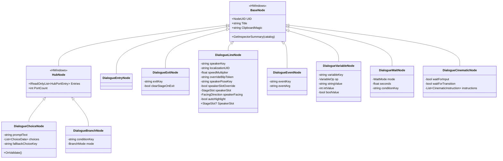
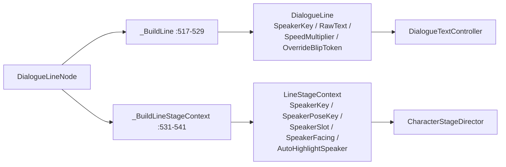
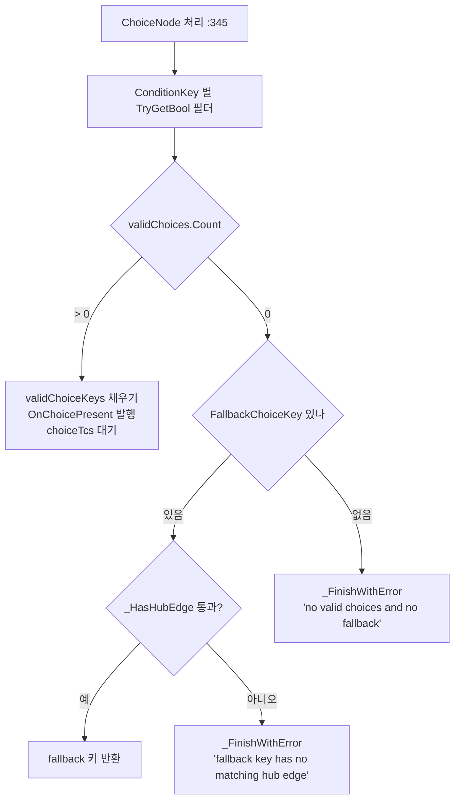
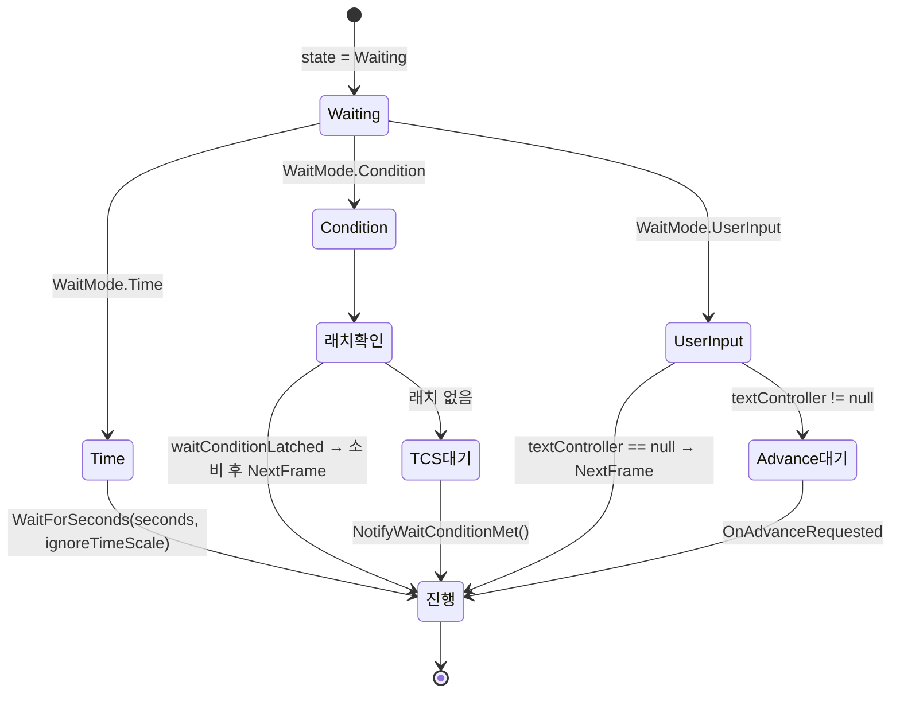
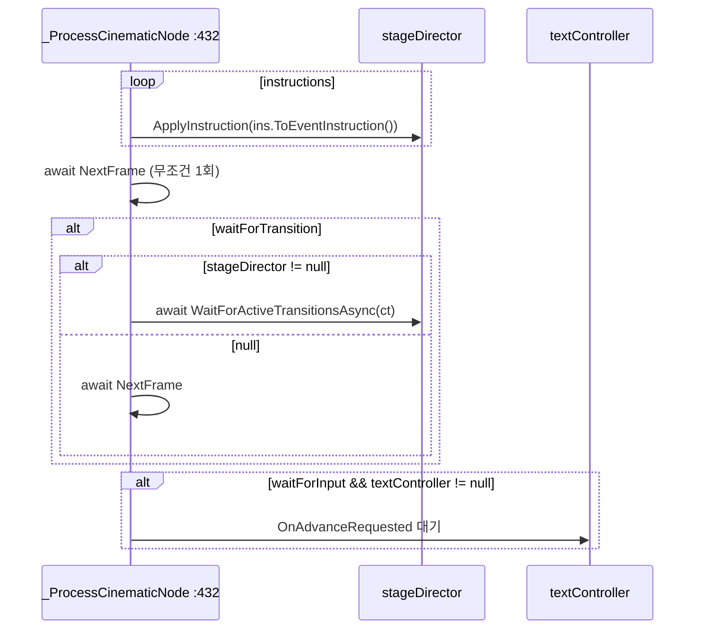

# Nodes — 노드 타입

> 대상: `Runtime/Graph/Nodes/*.cs` (12 파일 = 노드 9종 + 열거형 3종, 774 행)
> 상위: [`Runtime/README.md`](../Runtime/README.md)
> 연관: [`Graph.md`](Graph.md) · [`Editor-NodeView.md`](Editor-NodeView.md)

---

## 요약

HDialogue 는 **노드 9종**을 정의한다. 전부 `HCUP.HWindows.NodeWindow` 의 `BaseNode` 를
직접 또는 `HubNode` 를 거쳐 상속하고, **도메인 필드와 `ClipboardMagic` 문자열만** 자기
몫으로 갖는다. UID·제목·위치·엣지 관리는 전부 기반 클래스 소관이다.

노드 파일 12개 중 3개(`BranchMode` / `VariableOp` / `WaitMode`)는 노드가 아니라 노드
필드용 열거형이다.

규약 둘.

1. **노드는 로직을 갖지 않는다.** 전부 `[SerializeField]` + 읽기 전용 프로퍼티다.
   해석은 전적으로 `DialogueDirector._ProcessNode` 의 몫이다.
2. **에셋 직접 참조를 하지 않는다.** 스프라이트·오디오클립은 전부 문자열 키
   (`SpriteKey` / `overrideBlipToken` / `bgmKey`)로만 지목한다. SO 저장 용량과 로드
   타이밍을 분리하기 위한 규칙이다.

---

## 파일 지도

| 파일 | 행 | 기반 | 도메인 필드 |
|---|---|---|---|
| `DialogueEntryNode.cs` | 41 | `BaseNode` | 없음 |
| `DialogueLineNode.cs` | 141 | `BaseNode` | 텍스트 4 + 포트레이트 5 |
| `DialogueChoiceNode.cs` | 100 | `HubNode` | `promptText` / `choices` / `fallbackChoiceKey` |
| `DialogueBranchNode.cs` | 65 | `HubNode` | `conditionKey` / `mode` |
| `DialogueEventNode.cs` | 56 | `BaseNode` | `eventKey` / `eventArg` |
| `DialogueVariableNode.cs` | 70 | `BaseNode` | `variableKey` / `op` / 값 3종 |
| `DialogueWaitNode.cs` | 64 | `BaseNode` | `mode` / `seconds` / `conditionKey` |
| `DialogueCinematicNode.cs` | 90 | `BaseNode` | `instructions` / `waitForTransition` / `waitForInput` |
| `DialogueExitNode.cs` | 55 | `BaseNode` | `exitKey` / `clearStageOnExit` |
| `BranchMode.cs` | 34 | (enum) | `Boolean` / `IntRange` / `Switch` |
| `VariableOp.cs` | 36 | (enum) | `SetBool` / `SetInt` / `SetString` / `AddInt` / `ToggleBool` |
| `WaitMode.cs` | 34 | (enum) | `Time` / `Condition` / `UserInput` |

---

## 계층 구조



**`HubNode` 를 상속한 둘만 출구가 여럿이다.** 나머지 7종은 출구 엣지가 하나뿐이고,
`_ResolveNextNode` 가 첫 엣지를 그대로 따라간다 (`DialogueDirector.cs:261-269`).

---

## 노드별 계약

### DialogueEntryNode

도메인 필드가 없다 (`DialogueEntryNode.cs:20-22`). 카탈로그당 정확히 1개, `RootUID` 와
일치해야 한다 — 검증기 E001 / E002 가 강제한다
(`DialogueCatalogValidator.cs:80-95`).

디렉터는 아무 일도 하지 않고 통과시킨다.

```csharp
// Graph/DialogueDirector.cs:279-281
private UniTask _ProcessEntryNode(DialogueEntryNode node, CancellationToken ct) {
    return UniTask.CompletedTask;
}
```

`UniTask.NextFrame` 조차 쓰지 않는다. MCP 환경에서 메인 스레드가 점유되면
`NextFrame` 이 영구 블록되던 문제 때문이다.

### DialogueLineNode

가장 필드가 많은 노드다. 텍스트 4개 + 포트레이트 5개.

```csharp
// Graph/Nodes/DialogueLineNode.cs:26-58
[HTitle("Dialogue")]
string speakerKey;          // 화자 키. 레지스트리 조회 + 무대 배치의 기준
string localizationUID;     // 실제 텍스트가 아니라 로컬라이제이션 UID
float speedMultiplier = 1f; // 라인 전체 속도 배수
string overrideBlipToken;   // 블립 토큰. AudioClip 아님

[HTitle("Portrait")]
string speakerPoseKey;                       // 빈 문자열이면 포즈 유지
bool speakerSlotOverride;                    // false 면 SpeakerSlot 이 null
StageSlot speakerSlot;
FacingDirection speakerFacing = FacingDirection.Left;
bool autoHighlight = true;

public StageSlot? SpeakerSlot => speakerSlotOverride ? speakerSlot : (StageSlot?)null;
```

**`SpeakerSlot` 이 `Nullable<StageSlot>` 인 것이 핵심이다** (`:56`). `null` 은 "슬롯을
지정하지 않음"을 뜻하고, 무대 감독이 이를 "현재 슬롯 유지, 처음이면 기본 슬롯"으로
해석한다 (`CharacterStageDirector.cs:104-105`). enum 만으로는 `Left` 와 "미지정"을
구분할 수 없어 override 플래그를 함께 둔 것이다.

디렉터가 이 노드를 두 개의 DTO 로 쪼갠다.



`speedMultiplier <= 0` 이면 1 로 보정된다 (`DialogueDirector.cs:519`).

### DialogueChoiceNode

```csharp
// Graph/Nodes/DialogueChoiceNode.cs:31-53
[Serializable] public struct ChoiceData {
    public string Key;          // HubNode 포트 키와 일치해야 한다
    public string DisplayText;
    public string ConditionKey; // 빈 문자열 = 무조건 표시
}
string promptText;
List<ChoiceData> choices = new();
string fallbackChoiceKey;       // 유효 선택지 0개일 때 자동 선택
```

**`choices[i].Key` 와 허브 포트 키의 동기화가 이 노드의 유일한 계약이다.** 런타임은
동기화를 가정하고 동작하고, 강제는 검증기 E005 가 한다
(`DialogueCatalogValidator.cs:119-147`).

노드 자신의 `OnValidate` 는 **경고만 낸다.**

```csharp
// Graph/Nodes/DialogueChoiceNode.cs:58-67
#if UNITY_EDITOR
private void OnValidate() {
    if (choices.Count != PortCount) {
        HLogger.Warning($"[DialogueChoiceNode] '{Title}' — choices.Count({choices.Count}) != PortCount({PortCount}). " +
            "HubNode entries sync required via HDialogue.Editor bridge (Phase 5).");
    }
}
#endif
```

허브 entries 의 mutation 은 Editor asmdef 의 `NodeCatalogAuthor` 경유가 필수라 런타임
어셈블리에서 자동 동기화할 수 없다.



`ConditionKey` 가 비어 있지 않은데 `variables` 가 `null` 이면 그 선택지는 탈락한다
(`DialogueDirector.cs:348-349`).

### DialogueBranchNode

`conditionKey` + `mode` 둘뿐이다 (`DialogueBranchNode.cs:26-30`). 포트 키의 의미가
`mode` 에 따라 바뀐다.

| `BranchMode` | 조회 | 포트 키 형식 | 예 |
|---|---|---|---|
| `Boolean` | `TryGetBool` | `"true"` / `"false"` 두 개만 | `true`, `false` |
| `IntRange` | `TryGetInt` | `"min_max"` (`_` 구분, 양끝 포함) | `0_5`, `6_10`, `11_99` |
| `Switch` | `TryGetString` | 값 문자열 그대로 | `alice`, `bob` |

검증기가 셋 다 강제한다: E006(Boolean 키), E008/E009(IntRange 형식·중첩), E010(Switch
빈 키·중복) — `DialogueCatalogValidator.cs:149-233`.

`IntRange` 파싱은 런타임과 검증기가 **각자 구현한다.** 런타임은 `Split('_')` 후
`parts.Length == 2` 검사(`DialogueDirector.cs:403-407`), 검증기는 첫 `_` 위치 기준
`Substring`(`DialogueCatalogValidator.cs:236-243`). `"1_2_3"` 같은 키에서 두 구현의
결론이 갈린다 — 런타임은 매칭 실패, 검증기는 `int.TryParse("2_3")` 실패로 E008.
결과적으로 둘 다 거부하지만 경로가 다르다.

### DialogueEventNode

```csharp
// Graph/Nodes/DialogueEventNode.cs:26-34
string eventKey;
string eventArg;
```

디렉터가 그대로 중계한다.

```csharp
// Graph/DialogueDirector.cs:427-430
private async UniTask _ProcessEventNode(DialogueEventNode node, CancellationToken ct) {
    OnEventFired?.Invoke(node.EventKey, node.EventArg);
    await UniTask.NextFrame(cancellationToken: ct);
}
```

**이 노드가 `DialogueDirector.OnEventFired` 의 유일한 발행처다.** 인라인
`<event=...>` 태그는 `DialogueTextController.OnEventTagFired` 로 나가 다른 경로를 탄다 —
[`Audio.md`](Audio.md) 참조.

### DialogueVariableNode

`op` 하나가 어느 값 필드를 읽을지 결정한다. 나머지 값 필드는 무시된다.

```csharp
// Graph/DialogueDirector.cs:465-471
switch (node.Op) {
    case VariableOp.SetBool:    variables.SetBool(node.VariableKey, node.BoolValue);     break;
    case VariableOp.SetInt:     variables.SetInt(node.VariableKey, node.IntValue);       break;
    case VariableOp.SetString:  variables.SetString(node.VariableKey, node.StringValue); break;
    case VariableOp.AddInt:     variables.AddInt(node.VariableKey, node.IntValue);       break;
    case VariableOp.ToggleBool: variables.ToggleBool(node.VariableKey);                  break;
}
```

`variables == null` 이면 워닝 후 그냥 통과한다 (`:459-463`) — 실패 종료가 아니다.

### DialogueWaitNode

```csharp
// Graph/Nodes/DialogueWaitNode.cs:24-30
WaitMode mode;
float seconds = 1f;
string conditionKey;   // ⚠ 런타임이 읽지 않는다
```



**`conditionKey` 는 사문이다.** `WaitMode.Condition` 은 키와 무관한 전역 신호
`NotifyWaitConditionMet()` 하나로만 풀린다 (`DialogueDirector.cs:483-497`). 필드는
에디터 노드 뷰의 표시 문자열로만 쓰인다 (`HGraphDialogueWaitNode.cs:32`). 카탈로그 안에
Condition WaitNode 가 둘 이상이면 서로 구분할 수단이 없다.

### DialogueCinematicNode

대사 없는 다중 캐릭터 연출 전용이다. 화자 1인 포트레이트는 `DialogueLineNode` 의
포트레이트 필드를 쓴다.

```csharp
// Graph/Nodes/DialogueCinematicNode.cs:26-32
bool waitForInput;                // 기본 false — 자동 진행
bool waitForTransition = true;    // 기본 true — 트랜지션 완료 대기
List<CinematicInstruction> instructions = new();
```



`waitForInput = true` + `stageDirector == null` 조합이면 트랜지션 대기가 통째로
`NextFrame` 하나로 대체되고 곧바로 입력 대기로 들어간다 (`:439-443`).

`CinematicInstruction` 의 `arg` 는 **단일 문자열이다** (`CinematicInstruction.cs:28-29`).
`ToEventInstruction()` 이 이를 길이 0 또는 1 의 배열로 감싼다 (`:35-40`) — 인라인
`portrait.*` 태그가 쉼표로 다중 인자를 넘길 수 있는 것과 대비된다. 따라서
`Show` 동사의 슬롯·포즈·방향 3인자 조합은 Cinematic 노드로는 표현할 수 없다.

### DialogueExitNode

```csharp
// Graph/DialogueDirector.cs:283-288
private UniTask _ProcessExitNode(DialogueExitNode node, CancellationToken ct) {
    OnCatalogExit?.Invoke(currentCatalog, node.ExitKey);
    if (node.ClearStageOnExit) stageDirector?.ClearAll();
    state = DialogueDirectorState.Finished;
    return UniTask.CompletedTask;
}
```

한 카탈로그에 여러 개 있어도 무방하다. `exitKey` 로 구분한다. **출구 엣지가 없어도
`_ResolveNextNode` 가 오류로 처리하지 않는 유일한 노드다** (`:271-273`).

`ClearAll()` 은 `PortraitTransition.Fade(0.2f)` 로 실행되며(`CharacterStageDirector.cs:208`),
디렉터는 완료를 기다리지 않는다 — 카탈로그가 끝난 뒤에도 페이드가 남아 진행된다.

---

## `ClipboardMagic`

노드마다 고유 문자열을 반환한다.

| 노드 | 값 |
|---|---|
| `DialogueEntryNode` | `HGRAPH_DIALOGUE_ENTRY_NODE_V1` |
| `DialogueLineNode` | `HGRAPH_DIALOGUE_LINE_NODE_V1` |
| `DialogueChoiceNode` | `HGRAPH_DIALOGUE_CHOICE_NODE_V1` |
| `DialogueBranchNode` | `HGRAPH_DIALOGUE_BRANCH_NODE_V1` |
| `DialogueEventNode` | `HGRAPH_DIALOGUE_EVENT_NODE_V1` |
| `DialogueVariableNode` | `HGRAPH_DIALOGUE_VARIABLE_NODE_V1` |
| `DialogueWaitNode` | `HGRAPH_DIALOGUE_WAIT_NODE_V1` |
| `DialogueCinematicNode` | `HGRAPH_DIALOGUE_CINEMATIC_NODE_V1` |
| `DialogueExitNode` | `HGRAPH_DIALOGUE_EXIT_NODE_V1` |

`_V1` 접미사가 붙어 있으므로 **필드 구조를 바꾸면 `_V2` 로 올려** 구 클립보드 데이터를
붙여넣지 못하게 하는 것이 의도다.

---

## 주의할 점

### 계약

1. **`ChoiceNode.choices[i].Key` 는 허브 포트 키와 1:1 이어야 한다.** 런타임은
   동기화를 검증하지 않는다 — 검증기 E005 를 저작 단계에서 돌려야 한다.
2. **`LineNode.localizationUID` 는 텍스트가 아니다.** 로컬라이저 미초기화 시 UID 문자열이
   그대로 화면에 나온다 (`DialogueDirector.cs:520`). 이것이 정상 동작이며, 빈 UID 는
   검증기 W003 이 잡는다 (`DialogueCatalogValidator.cs:325-332`).
3. **에셋 직접 참조 금지가 노드 전반의 규칙이다.** `overrideBlipToken` / `SpriteKey` /
   `ClipKey` / `bgmKey` 전부 문자열이다.
4. **`ExitNode` 를 제외한 모든 노드는 출구 엣지가 필수다.** 없으면 런타임은
   `_FinishWithError`(`DialogueDirector.cs:272`), 검증기는 E003 이다.

### 정리 대상

5. **`DialogueWaitNode.conditionKey` 는 런타임이 읽지 않는다** (`:30`, `:36`).
   `WaitMode.Condition` 은 키 없는 전역 신호로만 풀린다. 필드를 살리려면
   `NotifyWaitConditionMet(string key)` 오버로드와 키 비교가 필요하고, 지우려면
   `HGraphDialogueWaitNode.cs:32` 의 표시도 함께 지워야 한다.
6. **`DialogueChoiceNode.OnValidate` 는 경고만 낸다** (`:59-66`). 주석이 가리키는
   "Phase 5 HDialogue.Editor 브리지"는 현재 코드에 없다 — 실제 동기화 강제는 검증기
   E005 를 수동 실행할 때만 일어난다.
7. **`CinematicInstruction.arg` 가 단일 문자열이라 `Show` 동사의 다중 인자를 표현할 수
   없다** (`CinematicInstruction.cs:29`, `:35-40`). 같은 동사를 인라인 태그로 쓰면
   `left,neutral,right` 3인자가 가능하다 (`PortraitEventParser.cs:54-56`) — 두 저작
   경로의 표현력이 비대칭이다.
8. **`DialogueCatalogTag` 4종 중 분기에 쓰이는 것은 `Cutscene` 뿐이다**
   (`DialogueDirector.cs:329`). `Tutorial` / `SystemMessage` 는 코드상 `Normal` 과 동일하다.
