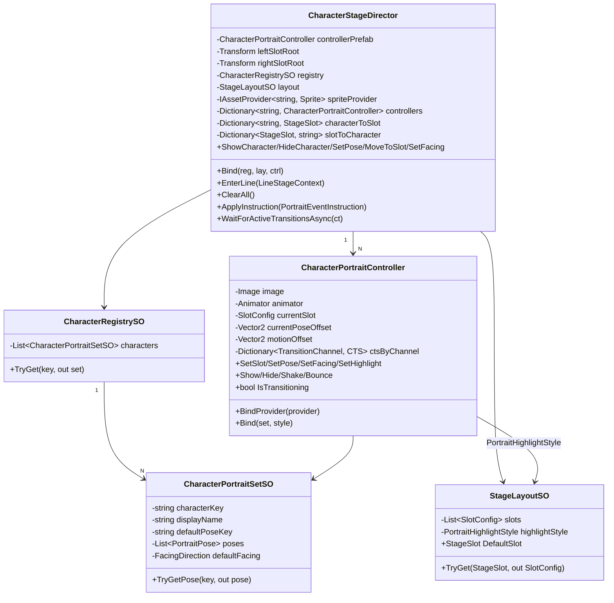
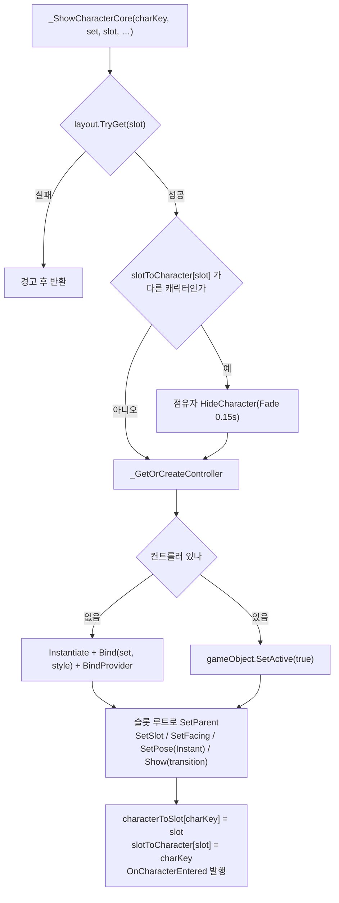
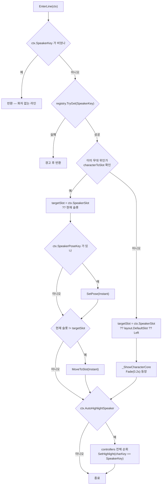
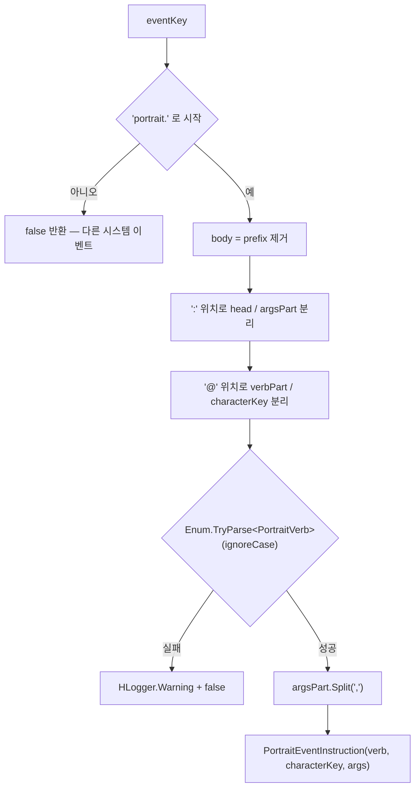
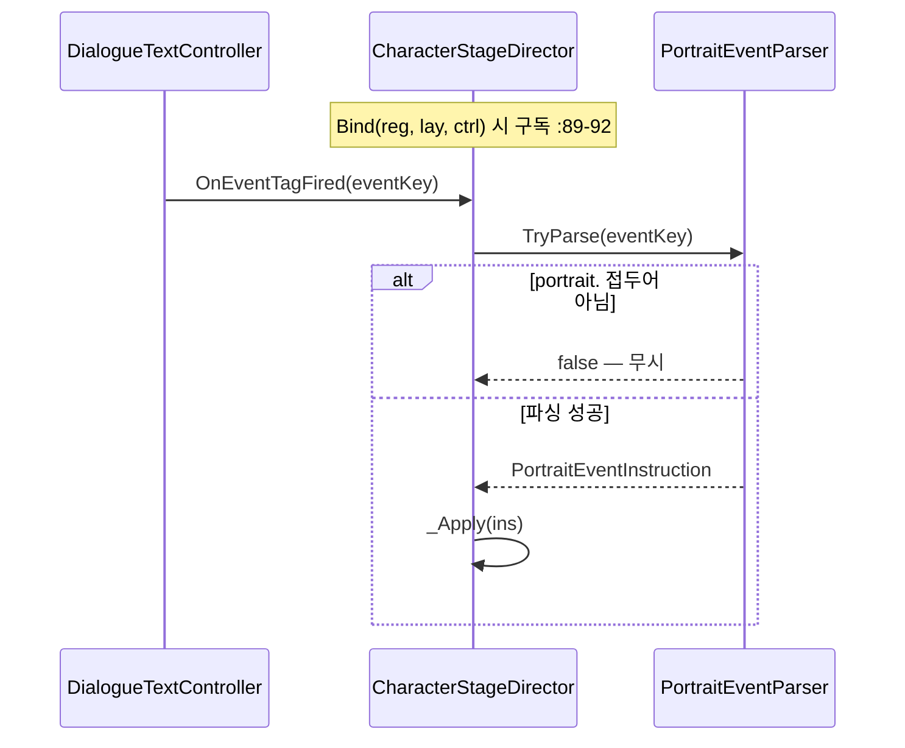
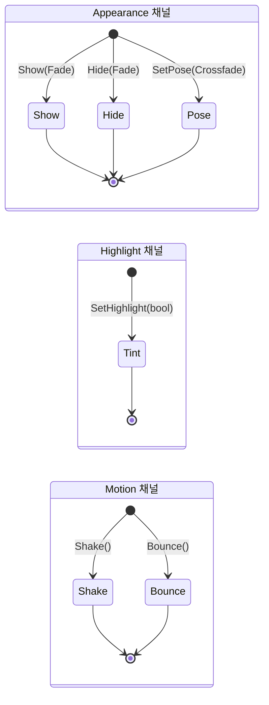
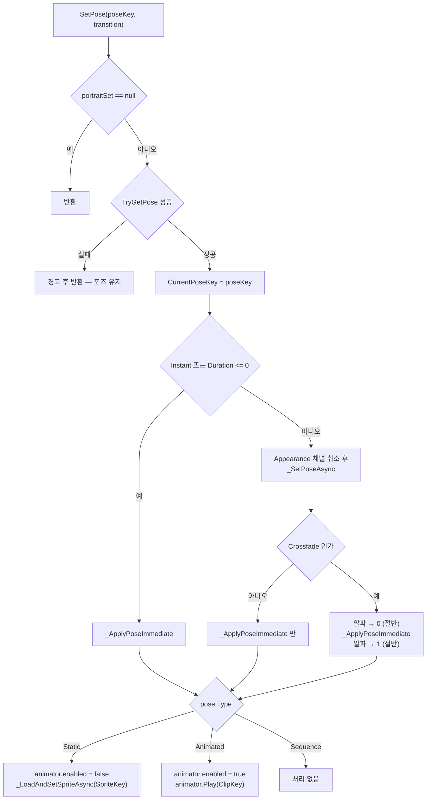
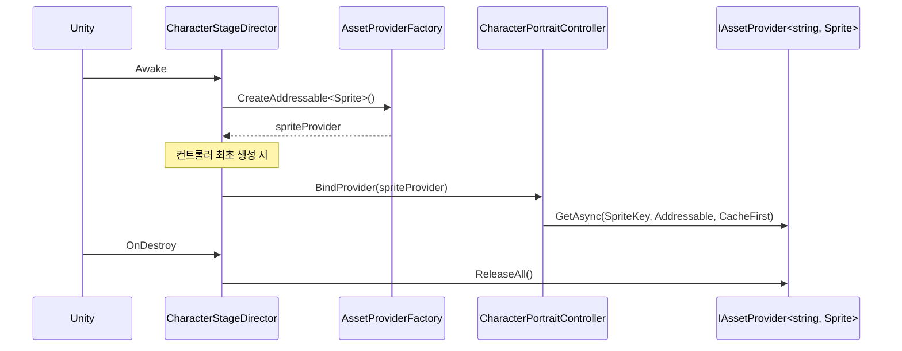

# Portrait — 캐릭터 무대

> 대상: `Runtime/Portrait/*.cs` (18 파일, 1900 행)
> 상위: [`Runtime/README.md`](../Runtime/README.md)
> 연관: [`Nodes.md`](Nodes.md) · [`Text.md`](Text.md)

---

## 요약

포트레이트 시스템은 **"어느 캐릭터가 어느 슬롯에 어떤 포즈로 서 있는가"** 하나를
관리한다. 무대 전체를 보는 `CharacterStageDirector` 와, 캐릭터 하나만 보는
`CharacterPortraitController` 로 나뉜다.

규약 넷.

1. **슬롯은 배타적이다.** 한 슬롯에 두 캐릭터가 설 수 없다. 점유자가 있으면 먼저
   퇴장시킨다 (`CharacterStageDirector.cs:142-144`).
2. **컨트롤러는 캐릭터당 하나이며 재사용된다.** 한 번 만든 인스턴스는 파괴하지 않고
   비활성화만 한다 (`:292-308`, `:184`).
3. **트랜지션은 3채널로 독립 관리한다.** `Appearance` / `Highlight` / `Motion` 이
   각자 CTS 를 갖고, 같은 채널 안에서만 서로를 취소한다
   (`CharacterPortraitController.cs:44-48`, `:72`).
4. **스프라이트는 문자열 키로만 지목한다.** `PortraitPose.SpriteKey` 는 Addressable
   주소이고, 로드는 `HResource` 의 `IAssetProvider<string, Sprite>` 에 위임한다.

무대에 지시를 내리는 입구가 셋이다: 라인 진입(`EnterLine`), 인라인 `portrait.*` 태그,
`DialogueCinematicNode` 의 `CinematicInstruction`.

---

## 파일 지도

| 파일 | 행 | 역할 |
|---|---|---|
| `CharacterStageDirector.cs` | 489 | 무대 감독. 슬롯 점유·등퇴장·인라인 이벤트 적용 |
| `CharacterPortraitController.cs` | 559 | 포트레이트 1인. 렌더·트랜지션 3채널 |
| `CharacterRegistrySO.cs` | 55 | `characterKey` → `CharacterPortraitSetSO` (O(n)) |
| `CharacterPortraitSetSO.cs` | 83 | 캐릭터 1인의 포즈 집합·표시명·기본 방향 |
| `StageLayoutSO.cs` | 84 | 슬롯 배치 목록 + 하이라이트 스타일 |
| `SlotConfig.cs` | 74 | 슬롯 1개의 앵커·정렬순서·스케일 |
| `PortraitPose.cs` | 72 | 포즈 1개 (`Key` / `SpriteKey` / `ClipKey` / `Type` / `PoseOffset`) |
| `PortraitTransition.cs` | 74 | 트랜지션 값 struct + 팩토리 5종 + `EvaluateCurve` |
| `PortraitHighlightStyle.cs` | 60 | 화자/비화자 틴트·스케일·전환 시간 |
| `LineStageContext.cs` | 62 | 디렉터 → 무대 감독 1라인 DTO |
| `PortraitEventParser.cs` | 90 | `portrait.<verb>[@key][:args]` 파서 |
| `PortraitEventInstruction.cs` | 43 | 파싱 결과 (readonly struct) |
| `CinematicInstruction.cs` | 60 | SO 직렬화용 지시. `ToEventInstruction()` 변환 |
| `PortraitVerb.cs` | 43 | `Pose` `Face` `Slot` `Show` `Hide` `Shake` `Bounce` |
| `StageSlot.cs` | 36 | `Left` / `Right` — **위치** |
| `FacingDirection.cs` | 43 | `Left` / `Right` — **방향** |
| `PortraitPoseType.cs` | 39 | `Static` / `Animated` / `Sequence` |
| `PortraitTransitionType.cs` | 43 | `Instant` `Fade` `SlideIn` `Crossfade` `Scale` |

`StageSlot` 과 `FacingDirection` 이 같은 원소 이름을 갖는 별개 enum 인 것이 이 시스템의
가장 흔한 혼동 지점이다 — 파일 헤더가 양쪽에서 이를 명시하고 있다
(`StageSlot.cs:11`, `FacingDirection.cs:11`).

---

## 계층 구조



`CharacterRegistrySO.TryGet` 과 `CharacterPortraitSetSO.TryGetPose` 는 둘 다 선형 탐색이다
(`CharacterRegistrySO.cs:31-40`, `CharacterPortraitSetSO.cs:55-64`). 캐릭터·포즈 수가
작다는 전제다.

---

## 데이터 모델

### 슬롯 점유 — 양방향 사전

```csharp
// Portrait/CharacterStageDirector.cs:52-54
readonly Dictionary<string, CharacterPortraitController> controllers = new();  // 수명 소유
readonly Dictionary<string, StageSlot> characterToSlot = new();                // 무대 위 캐릭터
readonly Dictionary<StageSlot, string> slotToCharacter = new();                // 슬롯 점유자
```

**`controllers` 와 `characterToSlot` 의 의미가 다르다.** 전자는 "한 번이라도 등장한 적
있음"(인스턴스 존재), 후자는 "지금 무대 위에 있음"이다. `HideCharacter` 는 후자에서만
지우고 컨트롤러는 남긴다 (`:164-172`).



### 앵커 위치의 3분할

```csharp
// Portrait/CharacterPortraitController.cs:324-326
private void _ApplyAnchoredPosition() {
    ((RectTransform)transform).anchoredPosition = currentSlot.AnchorPos + currentPoseOffset + motionOffset;
}
```

| 성분 | 출처 | 갱신 시점 |
|---|---|---|
| `currentSlot.AnchorPos` | `SlotConfig` (레이아웃) | `SetSlot` (`:116-125`) |
| `currentPoseOffset` | `PortraitPose.PoseOffset` | `_ApplyPoseImmediate` (`:338`) |
| `motionOffset` | Shake / Bounce 런타임 | 매 프레임 (`:276`, `:296`) |

**세 성분이 분리되어 있어 서로 덮어쓰지 않는다.** Shake 중에 `SetSlot` 이 들어와도
슬롯 성분만 바뀌고 진동은 유지되며, Shake 가 끝나면 `motionOffset` 만 0 으로 복구된다
(`:283-286`, `:303-306`).

### 스케일의 2분할

```csharp
// Portrait/CharacterPortraitController.cs:350-355
private void _ApplyScale() {
    // 원본 스프라이트는 Left facing 기준. Right 요청 시 X 반전.
    float facingSign = currentFacing == FacingDirection.Right ? -1f : 1f;
    float s = baseScale * highlightScaleMultiplier;
    transform.localScale = new Vector3(facingSign * s, s, 1f);
}
```

`baseScale` 은 슬롯에서(`:118`), `highlightScaleMultiplier` 는 하이라이트 트랜지션에서
온다(`:256`). 방향 반전은 X 부호로만 표현한다.

---

## 흐름 1 — 라인 진입 (`EnterLine`)



**신규 등장은 Fade, 무대 위 갱신은 Instant 다** (`:109`, `:112`, `:115`). 대사가 이어지는
동안 포즈가 부드럽게 바뀌지 않는 것은 의도다 — 라인 진입 지연을 만들지 않기 위해서다.

**하이라이트는 `controllers` 전체를 순회한다** (`:120-122`). 무대에서 내려간(=
`characterToSlot` 에 없는) 캐릭터도 컨트롤러가 남아 있으면 대상이 된다. 비활성
게임오브젝트라 시각적 영향은 없지만 트랜지션 태스크는 생성된다.

---

## 흐름 2 — 인라인 이벤트 (`portrait.*`)

### 파싱 문법

```
portrait.<verb>[@<characterKey>][:<arg1>[,<arg2>...]]
```



`@characterKey` 를 생략하면 `characterKey` 는 **빈 문자열이 된다**
(`PortraitEventParser.cs:34`, `:45-47`). "현재 화자로 폴백" 같은 처리는 없다 — 빈 키로
`registry.TryGet("")` 이 실패하거나 `controllers.TryGetValue("")` 가 실패해 조용히
무동작이 된다.

### 동사별 처리

`CharacterStageDirector._Apply` (`:233-288`) 기준이다.

| Verb | 필요 인자 | 인자 없을 때 | 트랜지션 |
|---|---|---|---|
| `Pose` | `args[0]` = 포즈 키 | 경고 후 반환 (`:239`) | `Crossfade(0.2s)` |
| `Face` | `args[0]` = `left` / `right` | 경고 후 반환 (`:243`, `:245`) | 즉시 |
| `Slot` | `args[0]` = `left` / `right` | 경고 후 반환 (`:251-253`) | `Instant` |
| `Show` | `args[0]` 슬롯, `args[1]` 포즈, `args[2]` 방향 — **전부 선택** | 기본 슬롯 / 기본 포즈 / 기본 방향 | `Fade(0.2s)` |
| `Hide` | 없음 | — | `Fade(0.2s)` |
| `Shake` | 없음 | — | Motion 채널 0.4s |
| `Bounce` | 없음 | — | Motion 채널 0.3s |

**`Face` 와 `Slot` 은 `left` / `right` 만 받는다** (`_TryParseFacing` `:319-324`,
`_TryParseSlot` `:326-331`). 다른 문자열은 경고 후 무시된다.

`Show` 의 방향 결정 분기가 다소 꼬여 있다.

```csharp
// Portrait/CharacterStageDirector.cs:257-272
case PortraitVerb.Show: {
    StageSlot showSlot = (args.Length > 0 && _TryParseSlot(args[0], out var parsedShow))
        ? parsedShow : layout?.DefaultSlot ?? StageSlot.Left;
    string poseKey = args.Length > 1 ? args[1] : string.Empty;
    FacingDirection facing = FacingDirection.Right;
    if (args.Length > 2 && _TryParseFacing(args[2], out var parsedFacing)) {
        facing = parsedFacing;                       // ① 인자로 방향 지정
    } else if (registry != null && registry.TryGet(charKey, out var s)) {
        facing = s.DefaultFacing;                    // ② 캐릭터 기본 방향
        _ShowCharacterCore(charKey, s, showSlot, poseKey, facing, PortraitTransition.Fade(0.2f));
        break;                                       //    여기서 끝난다
    }
    ShowCharacter(charKey, showSlot, poseKey, facing, PortraitTransition.Fade(0.2f));
    break;
}
```

경로가 셋이다: ① 방향 인자가 있으면 `ShowCharacter`(레지스트리 재조회), ② 없고 레지스트리
히트면 `_ShowCharacterCore` 직행, ③ 레지스트리 미스면 `ShowCharacter` 가 다시 조회해
실패 경고를 낸다. **동작은 맞지만 ①과 ②가 서로 다른 함수를 타는 구조**다.

### 수신 경로



`Bind` 는 재바인드 시 이전 구독을 먼저 해제한다 (`:85-87`). 매니저가 `PlayCatalog` 마다
`Bind` 를 부르므로(`DialogueManager.cs:218`) 이 해제가 없으면 구독이 중첩됐다.

---

## 흐름 3 — 트랜지션 3채널



```csharp
// Portrait/CharacterPortraitController.cs:365-383
private void _Cancel(TransitionChannel channel) {          // 같은 채널의 기존 것만 취소
    if (!ctsByChannel.TryGetValue(channel, out var cts)) return;
    cts.Cancel(); cts.Dispose(); ctsByChannel.Remove(channel);
}
private CancellationToken _RegisterToken(TransitionChannel channel) {
    var cts = CancellationTokenSource.CreateLinkedTokenSource(destroyCancellationToken);
    ctsByChannel[channel] = cts;
    return cts.Token;
}
private void _Cleanup(TransitionChannel channel, CancellationToken token) {
    if (!ctsByChannel.TryGetValue(channel, out var cts)) return;
    if (cts.Token != token) return;                        // 남의 CTS 는 건드리지 않는다
    cts.Dispose(); ctsByChannel.Remove(channel);
}
```

**`_Cleanup` 의 토큰 비교가 소유권 확인이다.** 취소된 구 태스크의 `finally` 가 신
태스크의 CTS 를 지우지 못한다. `_ShakeAsync` / `_BounceAsync` 의 `finally` 도 같은
비교로 `motionOffset` 복구 여부를 정한다 (`:283-286`, `:303-306`).

모든 채널 CTS 는 `destroyCancellationToken` 과 링크된다 (`:373`) — 오브젝트가 파괴되면
전부 자동 취소된다.

`IsTransitioning` 은 **채널을 구분하지 않는다** (`:81`).

```csharp
public bool IsTransitioning => ctsByChannel.Count > 0;
```

따라서 `CharacterStageDirector.WaitForActiveTransitionsAsync`(`:210-222`)와, 그것을
기다리는 `DialogueCinematicNode.WaitForTransition` 은 **하이라이트 전환과 Shake/Bounce
까지 함께 기다린다.**

### 포즈 적용



스프라이트 로드는 비동기이고, 완료 후 **포즈 키가 아직 유효한지 다시 확인한다.**

```csharp
// Portrait/CharacterPortraitController.cs:342-348
private async UniTaskVoid _LoadAndSetSpriteAsync(string key, string poseKey, CancellationToken ct) {
    if (spriteProvider == null || string.IsNullOrEmpty(key)) return;
    Sprite sprite = await spriteProvider.GetAsync(key, AssetLoadMode.Addressable, AssetFetchMode.CacheFirst);
    if (ct.IsCancellationRequested || image == null) return;
    if (CurrentPoseKey != poseKey) return;      // 로드 중 포즈가 또 바뀌었다면 버린다
    image.sprite = sprite;
}
```

**이 검사가 없으면 늦게 도착한 로드가 최신 포즈를 덮어쓴다.** 빠른 연속 포즈 변경에서
실제로 발생하는 경쟁이다.

`ct` 는 채널 CTS 가 아니라 `destroyCancellationToken` 이다 (`:331`) — 포즈 트랜지션이
취소돼도 로드 자체는 계속되고, 위 포즈 키 검사가 결과를 버린다.

---

## 흐름 4 — 스프라이트 수명



**모든 포트레이트 스프라이트를 무대 감독 하나가 소유한다** (`:70`, `:77`). 개별 캐릭터
퇴장으로는 아무것도 반납되지 않는다 — 무대 감독이 파괴될 때 통째로 정리된다.
카탈로그를 여러 개 재생하는 긴 세션에서는 등장했던 모든 캐릭터의 스프라이트가 계속
메모리에 남는다.

---

## 사용 예

```csharp
// 1) 인스펙터 배선 — controllerPrefab / registry / layout 필수, 슬롯 루트는 선택
//    leftSlotRoot / rightSlotRoot 미연결 시 this.transform 을 쓰고 경고를 낸다 (:310-317)

// 2) 코드에서 직접
stageDirector.ShowCharacter("alice", StageSlot.Left, "neutral",
                            FacingDirection.Right, PortraitTransition.Fade(0.3f));
stageDirector.SetPose("alice", "happy", PortraitTransition.Crossfade(0.2f));
stageDirector.MoveToSlot("alice", StageSlot.Right, PortraitTransition.Instant);
stageDirector.HideCharacter("alice", PortraitTransition.Fade(0.2f));
stageDirector.ClearAll();                       // Fade(0.2f) 로 전원 퇴장

// 3) 인라인 태그 (라인 텍스트 안)
"<event=portrait.show@alice:left,neutral,right>안녕!"
"<event=portrait.pose@alice:shocked>…뭐라고?"
"<event=portrait.shake@alice>"
"<event=portrait.hide@alice>"

// 4) CinematicNode — arg 는 단일 문자열이라 Show 의 다중 인자는 표현 불가
//    Verb=Pose / Target=alice / Arg=happy
```

---

## 주의할 점

### 계약

1. **`StageSlot` 은 위치, `FacingDirection` 은 방향이다.** 이름이 겹치는 별개 enum 이다
   (`StageSlot.cs:11`, `FacingDirection.cs:11`).
2. **원본 스프라이트는 `Left` facing 기준이다.** `Right` 요청 시 X 를 반전한다
   (`CharacterPortraitController.cs:351-352`). 에셋 제작 규약이다.
3. **슬롯은 배타적이다.** 다른 캐릭터가 점유 중이면 `Fade(0.15s)` 로 밀어낸다
   (`CharacterStageDirector.cs:142-144`).
4. **컨트롤러는 파괴되지 않는다.** `Hide` 는 `SetActive(false)` 까지만 하고
   (`CharacterPortraitController.cs:184`, `:211`), 재등장 시 `SetActive(true)` 로
   되살린다 (`CharacterStageDirector.cs:305`).
5. **`WaitForActiveTransitionsAsync` 는 채널을 가리지 않는다** (`:210-222`,
   `CharacterPortraitController.cs:81`). Cinematic 노드의 `waitForTransition` 은
   하이라이트·Shake·Bounce 까지 기다린다.
6. **`Bind` 는 이전 `OnEventTagFired` 구독을 해제한다** (`:85-92`). 매니저가 카탈로그마다
   재바인드하므로 필수 처리다.
7. **`_ApplyPoseImmediate` 는 `Animated` 포즈에서 `animator.Play(ClipKey)` 를 부른다**
   (`CharacterPortraitController.cs:332-337`). Animator 컨트롤러에 같은 이름 상태가
   있어야 한다 — 없으면 Unity 가 자체 경고를 낸다.

### 정리 대상

8. **`PortraitTransitionType.SlideIn` 과 `Scale` 은 팩토리만 있고 처리 분기가 없다.**
   `PortraitTransition.SlideIn`(`:36`) / `Scale`(`:46`) 이 타입 값을 채우지만,
   컨트롤러의 분기는 `Instant`(`:134`, `:157`, `:181`)와 `Crossfade`(`:219`)뿐이라
   나머지는 전부 `_LerpAlphaAsync` = Fade 로 흡수된다.
9. **`PortraitPoseType.Sequence` 는 전역 참조 0건이다**(grep). `_ApplyPoseImmediate` 가
   `Static` / `Animated` 만 처리하므로 Sequence 포즈는 아무 일도 하지 않는다
   (`:328-340`) — 스프라이트도 애니메이터도 바뀌지 않은 채 `CurrentPoseKey` 만 갱신된다.
10. **`CharacterPortraitSetSO.pivotOffset` 은 읽는 코드가 없다** (`:41`, `:51`).
    슬롯 기준 위치 보정은 `PortraitPose.PoseOffset` 이 담당한다
    (`CharacterPortraitController.cs:338`) — 캐릭터 단위 보정 축이 설계만 남고 비어 있다.
11. **호출처 0건 공개 멤버**: `CharacterStageDirector.OnCharacterEntered`(`:60`) /
    `OnCharacterExited`(`:61`) / `OnPoseChanged`(`:62`),
    `CharacterPortraitController.OnTransitionComplete`(`:85`) / `CurrentSlot`(`:77`) /
    `CurrentFacing`(`:79`) / `IsVisible`(`:80`),
    `CharacterPortraitSetSO.Poses`(`:50`), `CharacterRegistrySO.Characters`(`:29`),
    `StageLayoutSO.Slots`(`:34`). 외부 게임 코드용 훅으로 남긴 것과 사문이 섞여 있다.
12. **개별 스프라이트 반납 경로가 없다.** `spriteProvider.ReleaseAll()` 은 `OnDestroy`
    에서만 불린다 (`:77`). 캐릭터 퇴장·카탈로그 종료로는 아무것도 해제되지 않아,
    무대 감독이 살아 있는 동안 등장했던 전 캐릭터의 스프라이트가 누적된다.
13. **`_Apply` 의 `Show` 분기가 두 경로로 갈린다** (`:257-272`). 방향 인자 유무에 따라
    `ShowCharacter`(레지스트리 재조회)와 `_ShowCharacterCore`(직행)가 나뉜다. 동작은
    같지만 레지스트리 미스 시 경고 지점이 달라진다.
14. **`EnterLine` 의 하이라이트가 무대 밖 캐릭터까지 순회한다** (`:120-122`).
    `characterToSlot` 이 아니라 `controllers` 를 돈다 — 퇴장한 캐릭터마다 불필요한
    Highlight 트랜지션 태스크가 생성되고, 그동안 `IsTransitioning` 이 true 가 되어
    `waitForTransition` 대기를 늘린다.

### 진단이 릴리즈에서 사라지는 지점

15. `CharacterStageDirector.Awake` 는 `HLogger.Error` 를 쓰고 그대로 진행한다
    (`:67-69`). `controllerPrefab` 이 null 이면 `_GetOrCreateController` 가 다시 에러를
    내고 null 을 반환해(`:294-297`) 캐릭터가 등장하지 않는다 — 로그는 릴리즈에도
    남으므로 원인 추적은 가능하다.
16. `CharacterPortraitController.Awake` 도 `HLogger.Error` 다 (`:90`). 이 패키지에서
    `Debug.Assert` 를 쓰는 것은 `DialogueTextController` 하나뿐이다 — 기준이 갈린다.
