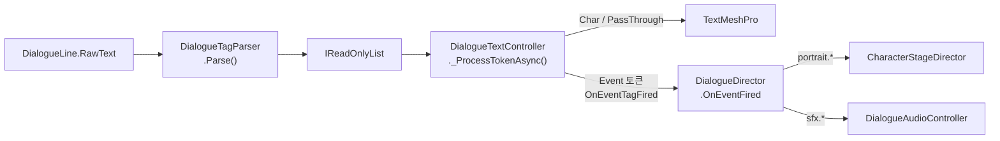
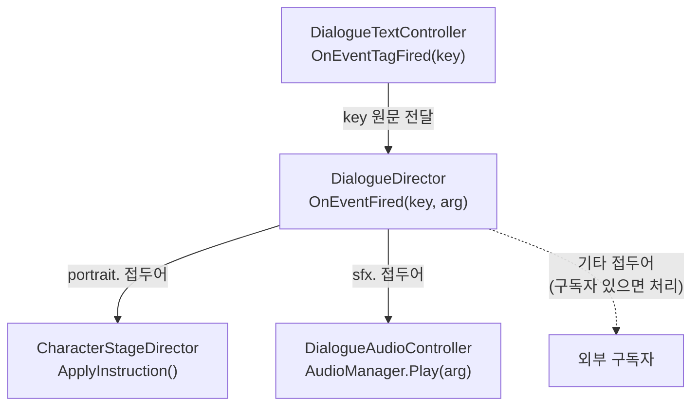
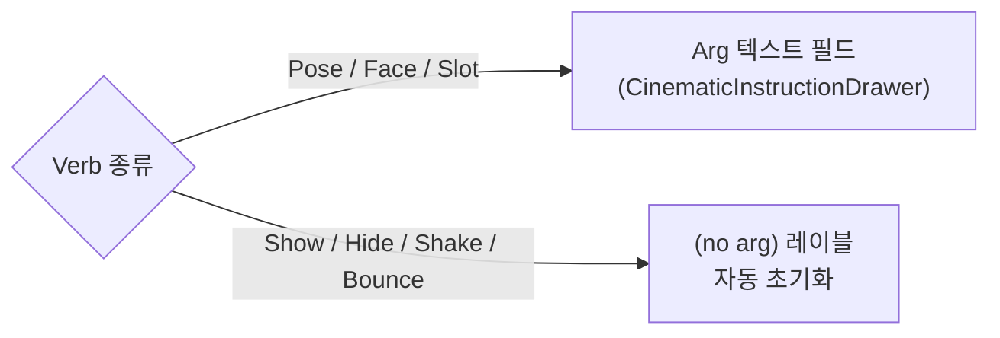
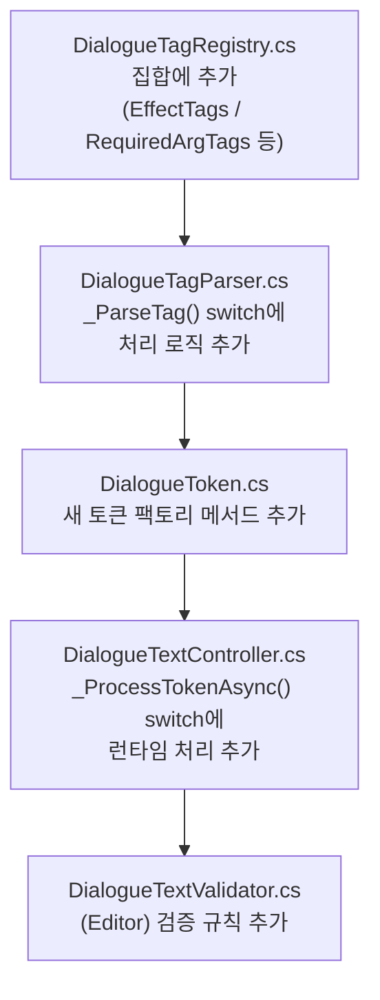

# HDialogue 태그 사용 가이드

> 최종 갱신: 2026-05-19  
> 대상: HCUP-2.4.0 `dev/feat-custom-node-view` 브랜치  
> 관련 파일: `DialogueTagParser.cs` · `DialogueTagRegistry.cs` · `DialogueTextController.cs` · `PortraitEventParser.cs`

---

## 1. 개요

HDialogue의 대화 텍스트(RawText)는 두 종류의 태그를 지원합니다.

| 종류 | 처리 주체 | 설명 |
|---|---|---|
| **커스텀 태그** | `DialogueTagParser` | HDialogue 전용. 타이프라이터·이벤트·이펙트 등 런타임 동작 제어 |
| **TMP 표준 태그** | TextMeshPro 내부 | `<b>`, `<color>`, `<size>` 등 렌더링 전용. 파서가 원본 그대로 TMP에 전달 |

### 태그 처리 흐름



---

## 2. 커스텀 태그 전체 목록

| 태그 | 형식 | 닫기 태그 | 인자 | 설명 |
|---|---|---|---|---|
| `pause` | `<pause=N>` | 없음 | `N`: 초(float) | N초 대기. Instant 모드에서는 스킵됨 |
| `speed` | `<speed=N>` | `<speed_end>` or `</speed_end>` | `N`: 배율(float) | 구간 내 타이핑 속도 배율. 1.0 = 기본 |
| `speed_end` | `<speed_end>` | — | 없음 | 속도를 1.0으로 복원 |
| `silent` | `<silent>` | `</silent>` | 없음 | 구간 내 블립 SFX 억제 |
| `voice` | `<voice=token>` | 없음 | `token`: 오디오 토큰 문자열 | 이 줄 이후 블립 음색 변경 |
| `shake` | `<shake>` | `</shake>` | 없음 | 텍스트 흔들기 이펙트 구간 |
| `wave` | `<wave>` | `</wave>` | 없음 | 텍스트 파도 이펙트 구간 |
| `rainbow` | `<rainbow>` | `</rainbow>` | 없음 | 텍스트 무지개색 이펙트 구간 |
| `event` | `<event=key>` | 없음 | `key`: 이벤트 키 문자열 | 임의 이벤트 발화. 하위 시스템이 구독 |
| `sfx` | `<sfx=token>` | 없음 | `token`: 오디오 토큰 문자열 | **미구현** (Phase 5+ 예정) |

> **인자 생략 규칙**: `sfx` / `event` / `voice` 는 인자가 없으면 토큰 자체가 무시됩니다(콘솔 경고 발생).  
> `pause` / `speed` 는 인자가 잘못된 경우 기본값(각각 `0f` / `1.0f`)으로 대체합니다.

---

## 3. 텍스트 제어 태그

### 3-1. 일시 정지 — `<pause>`

```
<pause=N>
```

- 타이프라이터가 N초 멈춘 뒤 다음 글자부터 재개합니다.
- **TextSpeedMode.Instant** 일 때는 pause 토큰이 스킵됩니다.
- 인자는 **소수점 구분자 `.`** (영미권 포맷) 사용 — 로케일 무관하게 파싱합니다.

```
"잠깐...<pause=1.5>계속할게."
→ "잠깐..." 출력 후 1.5초 대기 → "계속할게." 출력
```

### 3-2. 속도 제어 — `<speed>` / `<speed_end>`

```
<speed=N>   ... 텍스트 ...   <speed_end>
<speed=N>   ... 텍스트 ...   </speed_end>
```

- 구간 내 타이프라이터 딜레이를 `base × (1 / N)` 로 조정합니다.
- `N > 1` : 빠름, `N < 1` : 느림, `N = 1` : 기본.
- `<speed_end>` 와 `</speed_end>` 는 동일하게 처리됩니다(테스트 데이터 호환).

| N 값 | 효과 |
|---|---|
| `0.5` | 기본의 절반 속도 (느림) |
| `1.0` | 기본 속도 |
| `2.0` | 기본의 2배 속도 (빠름) |

```
"천천히...<speed=0.5>이 부분은 느리게</speed_end> 계속."
```

---

## 4. 블립 SFX 제어 태그

### 4-1. 무음 구간 — `<silent>`

```
<silent>   ...텍스트...   </silent>
```

- 구간 내 글자 출력 시 블립 SFX가 재생되지 않습니다.
- **쌍(PairTag)** 이므로 반드시 `</silent>` 로 닫아야 합니다.
- 줄 끝까지 닫히지 않은 경우 파서가 자동 닫기 + 콘솔 경고를 발생시킵니다.

```
"[나레이션]<silent>이 텍스트는 소리 없이 나옵니다</silent>"
```

### 4-2. 음색 변경 — `<voice>`

```
<voice=token>
```

- 이후 줄의 블립 SFX를 `token` 오디오로 변경합니다.
- `token` 은 `AudioManager` 에 등록된 오디오 토큰 문자열입니다.
- 닫기 태그 없음 — 이후 다음 `<voice=...>` 가 나올 때까지 유지됩니다.

```
"<voice=sfx_blip_child>아이: 안녕하세요!"
```

---

## 5. 텍스트 이펙트 태그

이펙트 태그는 **쌍(EffectTag)** 이며 중첩이 허용됩니다.

```
<shake>흔들리는 텍스트</shake>
<wave>파도 텍스트</wave>
<rainbow>무지개 텍스트</rainbow>
<wave><rainbow>복합 이펙트</rainbow></wave>
```

| 태그 | 이펙트 |
|---|---|
| `shake` | 진동 (랜덤 오프셋) |
| `wave` | 상하 사인파 |
| `rainbow` | 컬러 사이클 |

> **중첩 순서 주의**: `<shake><wave>...</wave></shake>` — 열기/닫기 순서가 역전되면 콘솔에 mismatch 경고가 발생하지만 동작은 유지됩니다.

---

## 6. 이벤트 태그 — `<event>`

```
<event=key>
```

- 타이프라이터가 이 토큰에 도달하는 순간 `DialogueTextController.OnEventTagFired(key)` 가 발화됩니다.
- `DialogueDirector` 가 이를 중계하여 `OnEventFired(key, arg)` 이벤트를 발화합니다.
- **`key`의 접두어**에 따라 각 하위 시스템이 구독하고 처리합니다.



### 이벤트 키 접두어 규약

| 접두어 | 처리 주체 | 설명 |
|---|---|---|
| `portrait.` | `CharacterStageDirector` | 캐릭터 포트레이트 스테이지 지시 |
| `sfx.` | `DialogueAudioController` | 효과음 재생 |
| 그 외 | 외부 구독자 | `OnEventFired` 이벤트를 직접 구독하는 컴포넌트 |

---

## 7. Portrait 이벤트 — `portrait.*`

### 형식

```
portrait.<verb>[@<characterKey>][:<arg1>[,<arg2>...]]
```

| 구성 요소 | 필수 여부 | 설명 |
|---|---|---|
| `portrait.` | 필수 | 접두어. 이 접두어가 없으면 portrait 파서가 무시 |
| `<verb>` | 필수 | 동작 동사 (아래 동사 표 참조). 대소문자 무관 |
| `@<characterKey>` | 선택 | 대상 캐릭터 키. 생략 시 현재 활성 캐릭터에 적용 |
| `:<arg>` | 동사에 따라 필수/선택 | 동작의 세부 파라미터. 쉼표(`,`)로 복수 인자 가능 |

### 동사(Verb) 목록

| Verb | 인자 필요 | 인자 의미 | 예시 |
|---|---|---|---|
| `Pose` | 필수 | 포즈 Addressables 키 | `portrait.pose@alice:happy` |
| `Face` | 필수 | 방향 (`left` / `right` / `center`) | `portrait.face@alice:right` |
| `Slot` | 필수 | 슬롯 키 | `portrait.slot@alice:slot_left` |
| `Show` | 없음 | — | `portrait.show@alice:left,center` (*) |
| `Hide` | 없음 | — | `portrait.hide@alice:` |
| `Shake` | 없음 | — | `portrait.shake@alice:` |
| `Bounce` | 없음 | — | `portrait.bounce@alice:` |

> (*) `Show` 의 경우 위치 인자(`left,center`)를 추가로 전달할 수 있습니다. 처리는 `CharacterStageDirector._Apply()` 에 위임됩니다.

### 완전한 사용 예시

```
"<event=portrait.pose@alice:happy>안녕!"
→ alice 캐릭터의 포즈를 'happy'로 변경 후 "안녕!" 출력

"<event=portrait.show@bob:left>여기 있어."
→ bob을 왼쪽에 등장시킨 뒤 대화 출력

"<event=portrait.shake@alice:>뭐라고?!"
→ alice를 흔든 뒤 대화 출력

"<event=portrait.hide@alice:>..."
→ alice를 퇴장시킨 뒤 대화 출력
```

### Verb별 인자 여부 요약 (Inspector 표시 방식)



---

## 8. SFX 이벤트 — `sfx.*`

```
<event=sfx.<token>>
```

- `DialogueAudioController` 가 `sfx.` 접두어를 감지하면 `AudioManager.Play(token)` 을 호출합니다.
- `token` 은 `AudioManager` 에 등록된 효과음 토큰입니다.

```
"<event=sfx.sword_slash>검을 뽑았다."
→ "sword_slash" SFX 재생 후 텍스트 출력
```

> `DialogueAudioController.SFX_PREFIX = "sfx."` — 상수로 정의되어 있습니다.

---

## 9. `<sfx>` 태그 (미구현)

```
<sfx=token>
```

- `<event=sfx.*>` 와 별개인 직접 SFX 태그입니다.
- **현재 미구현** (Phase 5+ 예정). 파서는 토큰을 생성하지만 `DialogueTextController` 가 처리를 건너뜁니다.

---

## 10. TMP 패스스루 태그

파서가 인식하지 못하는 태그는 원본 형태로 TMP에 전달됩니다.  
아래 태그들은 `DialogueTagRegistry.TmpTags` 에 등록된 표준 TMP 태그로, HDialogue 파서를 거쳐 그대로 렌더러로 전달됩니다.

| 카테고리 | 태그 |
|---|---|
| **서식** | `<b>`, `<i>`, `<u>`, `<s>`, `<sup>`, `<sub>` |
| **크기/간격** | `<size>`, `<cspace>`, `<mspace>`, `<width>` |
| **색상** | `<color>`, `<alpha>`, `<gradient>`, `<mark>` |
| **폰트/스타일** | `<font>`, `<style>`, `<material>` |
| **인라인 요소** | `<sprite>`, `<link>` |
| **레이아웃** | `<indent>`, `<line-height>`, `<line-indent>`, `<margin>`, `<pos>`, `<voffset>`, `<space>`, `<align>` |
| **변환** | `<lowercase>`, `<uppercase>`, `<smallcaps>`, `<rotate>` |
| **기타** | `<nobr>`, `<noparse>`, `<page>`, `<char>` |
| **헥스 컬러** | `<#FF0000>` (단축형) |

---

## 11. 유효성 검증 — Validator 경고 코드

`DialogueCatalogValidator` 가 Inspector 검증 시 발생시키는 태그 관련 경고입니다.

| 코드 | 조건 | 대상 |
|---|---|---|
| `W003` | CinematicNode의 `instructions` 목록 개수 불일치 | 이벤트 태그 일반 |
| `W005` | `<event=portrait.*>` 에서 알 수 없는 Verb 감지 | Portrait 이벤트 |
| `W006` | CinematicNode의 `instructions` 목록이 비어 있음 | CinematicNode |
| `W007` | CinematicNode의 instruction에서 `targetCharacterKey` 가 빈 문자열 | CinematicNode |

> W005 검증 방식: `Enum.TryParse<PortraitVerb>` 직접 사용.  
> `PortraitEventParser.TryParse()` 는 사이드 이펙트(`HLogger.Warning`)가 있으므로 Validator에서 호출하지 않습니다.

---

## 12. 실전 예시 — 복합 태그 조합

### 예시 1: 감정 강조 + 포트레이트 변경

```
"<event=portrait.pose@alice:shocked><shake>뭐—?!</shake><pause=0.5>그게 정말이야?"
```

1. `portrait.pose@alice:shocked` → alice 표정 변경
2. `<shake>뭐—?!</shake>` → "뭐—?!" 텍스트 흔들림
3. `<pause=0.5>` → 0.5초 정지
4. `"그게 정말이야?"` 정상 출력

---

### 예시 2: 나레이션 구간 (소리 없음 + 느린 속도)

```
"<silent><speed=0.4>[어둠 속에서 발소리가 들려왔다.]</speed_end></silent>"
```

- 블립 SFX 없이, 절반 이하 속도로 나레이션 텍스트 출력.

---

### 예시 3: 캐릭터 등장 + 대사 + 퇴장

```
"<event=portrait.show@bob:right>"
"지금 왔어."
"<event=portrait.hide@bob:>"
```

- (첫 번째 라인) bob 오른쪽 등장
- (두 번째 라인) 대사 출력
- (세 번째 라인) bob 퇴장

---

### 예시 4: 효과음 + TMP 서식

```
"<event=sfx.coin_drop><color=#FFD700><b>골드를 획득했다!</b></color>"
```

1. `sfx.coin_drop` SFX 재생
2. 금색 볼드체로 텍스트 출력

---

## 13. 새 태그 추가 절차



> `DialogueTagRegistry.cs` 가 단일 소스이므로, 태그 집합 변경은 반드시 여기서 시작합니다.

---

## 참고 파일 경로

| 파일 | 경로 |
|---|---|
| `DialogueTagRegistry` | `HDialogue/Runtime/Parser/DialogueTagRegistry.cs` |
| `DialogueTagParser` | `HDialogue/Runtime/Parser/DialogueTagParser.cs` |
| `DialogueTextController` | `HDialogue/Runtime/Controller/DialogueTextController.cs` |
| `PortraitEventParser` | `HDialogue/Runtime/Portrait/PortraitEventParser.cs` |
| `PortraitVerb` | `HDialogue/Runtime/Portrait/PortraitVerb.cs` |
| `DialogueCatalogValidator` | `HDialogue/Editor/Validator/DialogueCatalogValidator.cs` |
| `DialogueAudioController` | `HDialogue/Runtime/Controller/DialogueAudioController.cs` |
