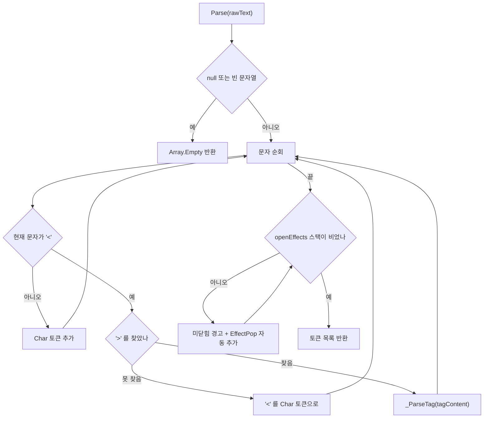
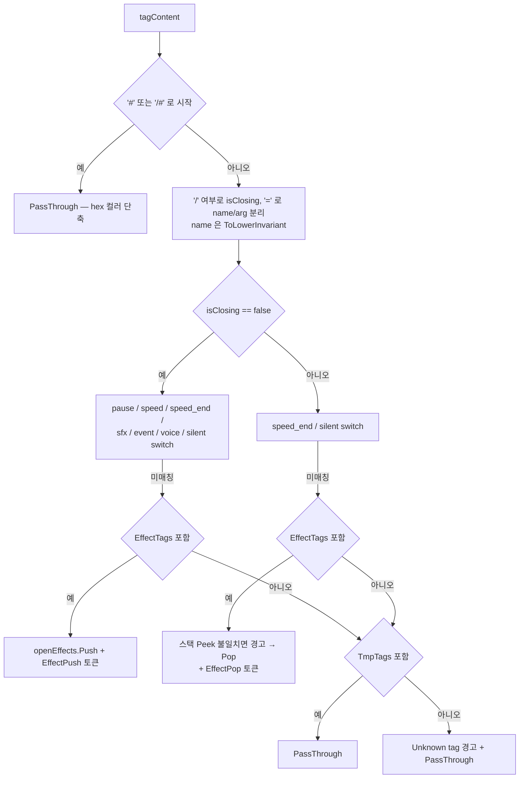
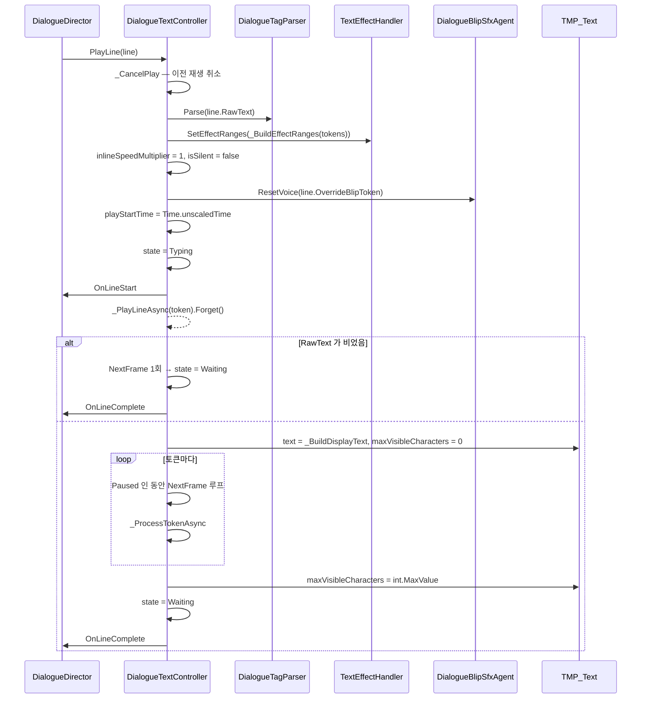
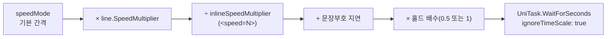
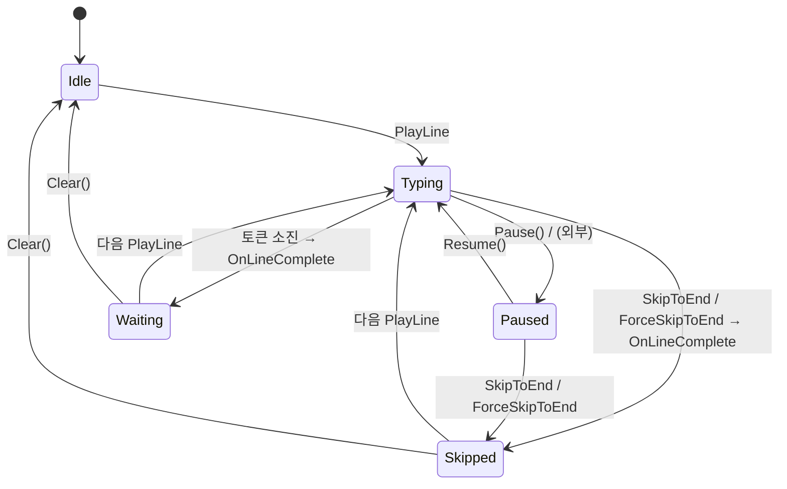
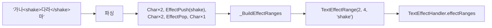

# Text — 태그 파싱 · 타이프라이터 · 이펙트

> 대상: `Runtime/Controller/DialogueTextController.cs` · `Runtime/Parser/*` · `Runtime/Data/*` · `Runtime/Effect/*` (11 파일, 1520 행)
> 상위: [`Runtime/README.md`](../Runtime/README.md)
> 연관: [`Audio.md`](Audio.md) · [`Portrait.md`](Portrait.md) · [`Editor-Validator.md`](Editor-Validator.md)

---

## 요약

이 시스템은 **문자열 하나를 토큰 목록으로 쪼갠 뒤, 그 목록을 시간축 위에서 재생한다.**

1. **파싱은 라인당 1회다.** `DialogueTagParser.Parse` 가 `RawText` 를
   `IReadOnlyList<DialogueToken>` 으로 바꾸고, 이후 재생은 그 목록만 본다
   (`DialogueTextController.cs:93`).
2. **가시 텍스트와 부수 효과가 분리된다.** TMP 에 들어가는 문자열은
   `Char` / `PassThrough` 토큰만으로 미리 조립되고(`_BuildDisplayText`, `:269-279`),
   나머지 토큰은 `maxVisibleCharacters` 를 늘리는 동안 부수 효과만 일으킨다.
3. **글자 공개는 `maxVisibleCharacters` 증가로 한다.** TMP 문자열을 매 글자 다시 만들지
   않으므로 라인당 문자열 할당이 1회다 (`:194`).

태그 정의의 단일 소스는 `DialogueTagRegistry` 다. 파서와 에디터 검증기가 같은 집합을 읽는다.

---

## 파일 지도

| 파일 | 행 | 역할 |
|---|---|---|
| `Controller/DialogueTextController.cs` | 398 | 타이프라이터 본체. 상태 머신 + 토큰 재생 |
| `Parser/DialogueTagParser.cs` | 232 | `RawText` → 토큰 목록. 정적 클래스 |
| `Parser/DialogueTagRegistry.cs` | 84 | 태그 집합 6종 단일 소스 |
| `Data/DialogueToken.cs` | 97 | 토큰 struct + 팩토리 12종 |
| `Data/DialogueTokenType.cs` | 65 | 토큰 종류 12종 |
| `Data/DialogueLine.cs` | 84 | 디렉터 → 컨트롤러 1라인 DTO |
| `Data/TextDisplayState.cs` | 57 | 표시 상태 5종 |
| `Data/TextSpeedMode.cs` | 52 | `Slow` / `Normal` / `Fast` / `Instant` |
| `Data/TextSpeedConstants.cs` | 75 | 간격·부호 지연·홀드 배수·입력 가드 상수 |
| `Effect/TextEffectHandler.cs` | 177 | TMP 버텍스 효과 3종 (`Update` 기반) |
| `Effect/TextEffectRange.cs` | 55 | 효과 적용 반개구간 `[start, end)` |

---

## 데이터 모델

### `DialogueToken`

```csharp
// Data/DialogueToken.cs:25-31 — GC 0 을 위해 struct
public struct DialogueToken {
    public DialogueTokenType Type;
    public char Character;    // Char 전용
    public float NumericArg;  // Pause, SpeedSet
    public string StringArg;  // Sfx, Event, VoiceSet, EffectPush, PassThrough
}
```

12종 토큰의 성격을 셋으로 나눌 수 있다.

| 성격 | 토큰 | 처리 시점 |
|---|---|---|
| **가시 텍스트 기여** | `Char`, `PassThrough` | `_BuildDisplayText` 사전 조립 |
| **사전 처리** | `EffectPush`, `EffectPop` | `_BuildEffectRanges` 사전 계산 |
| **재생 중 부수 효과** | `Pause`, `SpeedSet`, `SpeedReset`, `SilentPush`, `SilentPop`, `Event`, `VoiceSet`, `Sfx` | `_ProcessTokenAsync` |

`Char` 는 가시 텍스트 기여이면서 동시에 재생 중 처리 대상이다 — 유일하게 두 축에 걸친다.

### 태그 집합 (`DialogueTagRegistry`)

| 집합 | 원소 | 소비처 |
|---|---|---|
| `EffectTags` | `shake` `wave` `rainbow` | 파서(`:116`, `:134`), `TextEffectHandler` |
| `PairTags` | `shake` `wave` `rainbow` `silent` | 검증기(`DialogueTextValidator.cs:89`, `:118`) |
| `RequiredArgTags` | `sfx` `event` `voice` | 검증기(`:101`) |
| `FloatArgTags` | `pause` `speed` | 검증기(`:110`) |
| `AllCustomTags` | 위 전부 + `speed_end` (10종) | 검증기(`:94`, `:124`) |
| `TmpTags` | TMP 표준 34종 | 파서(`:146`), 검증기 |

전부 `StringComparer.OrdinalIgnoreCase` 다 (`DialogueTagRegistry.cs:27`, `:40-58`) —
태그 이름은 대소문자를 가리지 않는다.

**`EffectTags` / `PairTags` 는 검증기와 파서가 나눠 쓴다.** 런타임 파서는 `PairTags` 를
읽지 않고 `EffectTags` 만 본다 (`DialogueTagParser.cs:116`, `:134`) — `silent` 의 짝
검사는 파서에 없고 검증기에만 있다.

### 속도 상수

```csharp
// Data/TextSpeedConstants.cs:32-46
BASE_INTERVAL_SLOW    = 0.08f;   BASE_INTERVAL_NORMAL = 0.04f;
BASE_INTERVAL_FAST    = 0.015f;  BASE_INTERVAL_INSTANT = 0f;
PUNCT_DELAY_SENTENCE  = 0.25f;   // . ! ?
PUNCT_DELAY_COMMA     = 0.12f;   // ,
PUNCT_DELAY_NEWLINE   = 0.15f;   // \n
HOLD_SPEED_MULTIPLIER = 0.5f;    // 키 홀드 시 2배 빠름
INPUT_GUARD_DURATION  = 0.05f;   // PlayLine 후 50ms 입력 무시
```

---

## 흐름 1 — 파싱



`_ParseTag` 의 판정 순서다 (`DialogueTagParser.cs:70-154`).



**알 수 없는 태그는 버리지 않고 TMP 에 넘긴다** (`:152-153`). 파서가 모르는 TMP 신규
태그가 나와도 렌더링은 살아 있다.

인자 처리 규칙이 태그별로 다르다.

| 태그 | 인자 없음 / 잘못됨 |
|---|---|
| `pause` | 기본값 `0f` + 경고 (`_ParseFloat`, `:156-162`) |
| `speed` | 기본값 `1f` + 경고 |
| `sfx` / `event` / `voice` | **토큰 자체를 만들지 않음** + 경고 (`_RequireArg`, `:164-168`) |

float 파싱은 `CultureInfo.InvariantCulture` 고정이다 (`:158`) — 로케일이 쉼표 소수점인
환경에서도 `<pause=1.5>` 가 동일하게 동작한다.

**효과 태그의 짝은 스택 최상단만 본다** (`:134-141`). `</wave>` 가 `<shake>` 를 닫으면
mismatch 경고를 내고도 그냥 Pop 한다. 즉 `<shake><wave>…</shake></wave>` 는 경고 2회와
함께 범위가 서로 뒤바뀐 채 적용된다.

---

## 흐름 2 — 라인 재생



### 글자 간격 계산

```csharp
// Controller/DialogueTextController.cs:243-267
private float _CalcCharDelay(char c) {
    if (speedMode == TextSpeedMode.Instant) return 0f;
    float holdMult = isHoldAccelerate ? TextSpeedConstants.HOLD_SPEED_MULTIPLIER : 1f;
    return (_GetBaseInterval() + _GetPunctuationDelay(c)) * holdMult;
}
private float _GetBaseInterval() {
    float baseInterval = speedMode switch { Slow => 0.08f, Fast => 0.015f, Instant => 0f, _ => 0.04f };
    // 스펙: BaseInterval × LineSpeedMultiplier ÷ InlineSpeedMultiplier
    return baseInterval * currentLine.SpeedMultiplier / inlineSpeedMultiplier;
}
```



**문장부호 지연은 `inlineSpeedMultiplier` 로 나뉘지 않는다** (`:246`). `<speed=4>` 안에서도
마침표 뒤 0.25초는 그대로 붙는다 — 빠른 구간에서 부호 지연이 상대적으로 두드러진다.

`inlineSpeedMultiplier` 는 나눗셈의 분모다. `0` 을 넣으면 `Infinity` 가 되어 대기가
끝나지 않는다 — 파서는 `<speed=0>` 을 유효한 float 로 받아들이고(`_ParseFloat` 는 값
범위를 보지 않음, `:156-162`), 검증기도 float 파싱만 확인한다
(`DialogueTextValidator.cs:110-114`).

### 상태 머신



`Waiting` 과 `Skipped` 를 구분하는 이유는 `DialogueManager._OnUiAdvance` 가 둘을
동일하게 처리하므로 현재 코드에서는 드러나지 않는다 (`DialogueManager.cs:294-298`).
`TextDisplayState.cs:15-16` 의 주석은 "Waiting 은 자동 진행 가능, Skipped 는 입력 1회
필요"를 의도로 적고 있으나 **그 분기는 구현되어 있지 않다.**

### 입력 가드

```csharp
// Controller/DialogueTextController.cs:115-123, :317-318
public void SkipToEnd() {
    if (state != TextDisplayState.Typing && state != TextDisplayState.Paused) return;
    if (!_IsInputGuardPassed()) return;      // PlayLine 후 50ms
    _CancelPlay();
    if (tmpText != null) tmpText.maxVisibleCharacters = int.MaxValue;
    _SetState(TextDisplayState.Skipped);
    OnLineComplete?.Invoke();
}
private bool _IsInputGuardPassed() =>
    Time.unscaledTime - playStartTime >= TextSpeedConstants.INPUT_GUARD_DURATION;
```

**진행 입력 한 번이 두 라인을 넘기는 것을 막는 장치다.** 라인 N 을 완료시킨 키 입력이
같은 프레임에 라인 N+1 의 `SkipToEnd` 로 흘러들어가는 경우가 실제로 있었다.

`ForceSkipToEnd` 는 가드를 지나치고 `Idle` / `Waiting` / `Skipped` 만 거른다
(`:148-156`). 카탈로그 스킵 모드에서 디렉터가 라인마다 호출하는 경로다
(`DialogueDirector.cs:318`).

---

## 흐름 3 — 이펙트 범위 계산

`EffectPush` / `EffectPop` 은 재생 중에 처리되지 않는다. `PlayLine` 시점에
**문자 인덱스 기준 반개구간으로 미리 접힌다.**

```csharp
// Controller/DialogueTextController.cs:281-305
var stack = new Stack<(int startIdx, string effectName)>();
int charIdx = 0;
foreach (token) {
    case Char:       charIdx++;                              break;
    case EffectPush: stack.Push((charIdx, t.StringArg));      break;
    case EffectPop:  if (stack.Count > 0) {
                         var (startIdx, effectName) = stack.Pop();
                         ranges.Add(new TextEffectRange(startIdx, charIdx, effectName));
                     }                                        break;
}
```



**`PassThrough` 토큰은 `charIdx` 를 올리지 않는다** (`:286-301`). TMP 태그는 가시 문자가
아니므로 `characterInfo` 인덱스와 어긋나지 않기 위해서다.

`EffectPop` 이 남는 스택 없이 오면 무시된다 (`:296`) — 범위가 생기지 않는다.

### 렌더링

```csharp
// Effect/TextEffectHandler.cs:47-92 — Update 매 프레임
if (!hasEffects || tmpText == null) return;      // 효과 없으면 즉시 반환
tmpText.ForceMeshUpdate();
foreach (range in effectRanges)
    for (i = range.StartCharIndex; i < range.EndCharIndex && i < textInfo.characterCount; i++) {
        if (i >= maxVisible) break;              // 아직 공개 안 된 글자는 건너뛴다
        if (!charInfo.isVisible) continue;       // 공백 등
        switch (range.EffectName) { "shake" / "wave" / "rainbow" }
    }
if (!vertexModified && !colorModified) return;
tmpText.UpdateVertexData(flags);                 // Vertices / Colors32 플래그 선택 적용
```

**`hasEffects` 조기 반환이 비용 방어의 전부다** (`:48`, `:100`). 효과 태그가 없는 라인은
`ForceMeshUpdate` 조차 호출되지 않는다. 반대로 효과가 하나라도 있으면 **라인이 끝난
뒤에도 계속 돈다** — `ClearEffects()` 를 부르는 곳은 `DialogueTextController.Clear()`
하나뿐이고(`:111`), 그 `Clear()` 는 호출처가 없다.

| 효과 | 구현 | 수정 대상 |
|---|---|---|
| `shake` | `Random.Range(±2)` 오프셋을 4버텍스에 (`:110-121`) | `Vertices` |
| `wave` | `Sin(Time.time × 2 + charIndex × 0.5) × 3` (`:123-134`) | `Vertices` |
| `rainbow` | `HSVToRGB(Repeat(Time.time × 0.5 + charIndex × 0.1, 1))` (`:136-146`) | `Colors32` |

`Time.time` 기준이므로 **`Time.timeScale = 0` 이면 wave·rainbow 가 정지한다.**
타이프라이터 본체는 `ignoreTimeScale: true` 로 계속 도는 것과 어긋난다.

`rainbow` 는 색을 무조건 채도 1·명도 1 로 덮어쓴다 (`:138-141`) — `<color>` PassThrough
태그와 겹치면 rainbow 가 이긴다.

---

## 사용 예

```csharp
// 태그 조합
"평범한 대사입니다."
"잠깐<pause=1.5>… 그게 정말이야?"
"<speed=0.4>천천히 말할게</speed_end> 이제 보통 속도."
"<silent>[발소리가 들렸다]</silent>"
"<voice=blip_child>아이: 안녕하세요!"
"<shake>뭐—?!</shake>"
"<event=portrait.pose@alice:shocked>…설마."
"<color=#FFD700><b>골드 획득!</b></color>"   // TMP PassThrough

// 코드에서 직접 재생 (디렉터 없이)
textController.PlayLine(DialogueLine.Simple("테스트 문장", "alice"));
textController.SetSpeedMode(TextSpeedMode.Fast);
```

---

## 주의할 점

### 계약

1. **`PlayLine` 은 이전 재생을 취소한다** (`:89`). 라인 경계에서 토큰이 섞이지 않는다.
2. **빈 `RawText` 도 정상 경로다.** `NextFrame` 1회 후 `OnLineComplete` 를 발화한다
   (`:161-167`). 디렉터의 대기가 풀리므로 빈 라인이 대화를 멈추지 않는다.
3. **`Instant` 모드는 `Pause` 토큰도 스킵한다** (`:203-204`). 반면 `Event` /
   `VoiceSet` / `SilentPush` 는 모드와 무관하게 항상 처리된다 (`:223-229`).
4. **파싱은 라인당 1회, 재생은 그 결과만 본다.** `RawText` 를 재생 중에 바꿔도 반영되지
   않는다.
5. **`maxVisibleCharacters` 는 라인 완료 시 `int.MaxValue` 로 열린다** (`:186`, `:120`,
   `:153`). 스킵·정상 완료 모두 같다.
6. **`playCts` 는 `PlayLine` / `Clear` / `SkipToEnd` / `ForceSkipToEnd` / `OnDestroy`
   에서 취소·해제된다** (`:311-315`). 라인당 CTS 하나다.

### 정리 대상

7. **호출처 0건 공개 API**(패키지 전역 grep, 주석 제외): `Clear()`(`:105`),
   `Pause()`(`:125`), `Resume()`(`:130`), `SetSpeedMode`(`:135`),
   `SetHoldAccelerate`(`:139`), `IsTyping`(`:73`), `IsWaiting`(`:74`),
   `OnLineStart`(`:64`), `OnCharPrinted`(`:66`), `DialogueLine.Simple`(`DialogueLine.cs:30`).
   `SetSpeedMode` / `SetHoldAccelerate` 는 설정 UI 용 확장점으로 보이나, 현재 패키지
   안에 그 UI 가 없다.
8. **`TextEffectHandler.ClearEffects()` 가 실질적으로 도달 불가다.** 유일한 호출처가
   `DialogueTextController.Clear()`(`:111`)이고 그 `Clear()` 의 호출처가 0건이다.
   결과적으로 **효과가 붙은 라인이 끝나도 `Update` 가 계속 버텍스를 흔든다** — 다음
   라인의 `SetEffectRanges` 가 목록을 덮어써야 멎는다. 마지막 라인이 효과를 포함하면
   대화가 끝난 뒤에도 계속 돈다.
9. **`TextDisplayState.Waiting` / `Skipped` 의 구분이 소비되지 않는다.**
   `TextDisplayState.cs:15-16` 주석이 서술한 auto 진행 차등 정책이 코드에 없다 —
   `DialogueManager._OnUiAdvance` 는 둘을 같은 분기로 처리한다 (`:294-298`).
10. **`DialogueTokenType.Sfx` 는 런타임 no-op 이다** (`:238-239`). 파서는 토큰을 만들고
    (`DialogueTagParser.cs:99-102`), 검증기는 "미구현" 경고를 낸다
    (`DialogueTextValidator.cs:104-105`). `<event=sfx.*>` 로 대체하려 해도 인라인 이벤트가
    오디오 컨트롤러에 도달하지 않는다 — [`Audio.md`](Audio.md) 참조.
11. **`<speed=0>` 이 무한 대기를 만든다** (`:257`). 파서(`:156-162`)와
    검증기(`DialogueTextValidator.cs:110-114`) 모두 값 범위를 검사하지 않는다.
    `line.SpeedMultiplier` 쪽은 디렉터가 `> 0` 을 보정하지만(`DialogueDirector.cs:519`)
    인라인 배수에는 같은 보정이 없다.
12. **`TextEffectHandler` 의 wave/rainbow 는 `Time.time` 을 쓴다** (`:127`, `:139`).
    타이프라이터가 `ignoreTimeScale: true` 인 것과 달라, 일시정지 중 텍스트는 계속
    타이핑되는데 이펙트만 멈춘다.
13. **`DialogueTagParser` 헤더 주석의 "스레드 안전하지 않음"은 근거가 약하다**
    (`DialogueTagParser.cs:14`). `Parse` 의 상태는 전부 지역 변수이고 `TmpTags` /
    `EffectTags` 는 읽기 전용 조회다. 실제 제약은 `HLogger` 호출이 Unity API 에
    의존한다는 점이다.

### 진단이 릴리즈에서 사라지는 지점

14. `Awake` 의 `tmpText` 검사는 `Debug.Assert` 다 (`:79`). 릴리즈에서 제거되면
    이후 `tmpText != null` 가드들이 조용히 흡수해 **글자가 한 자도 표시되지 않는데
    로그도 없는** 상태가 된다. 같은 패키지의 `CharacterStageDirector`(`:67-69`)와
    `DialogueManager`(`:189-203`)는 `HLogger.Error` 를 쓴다.
