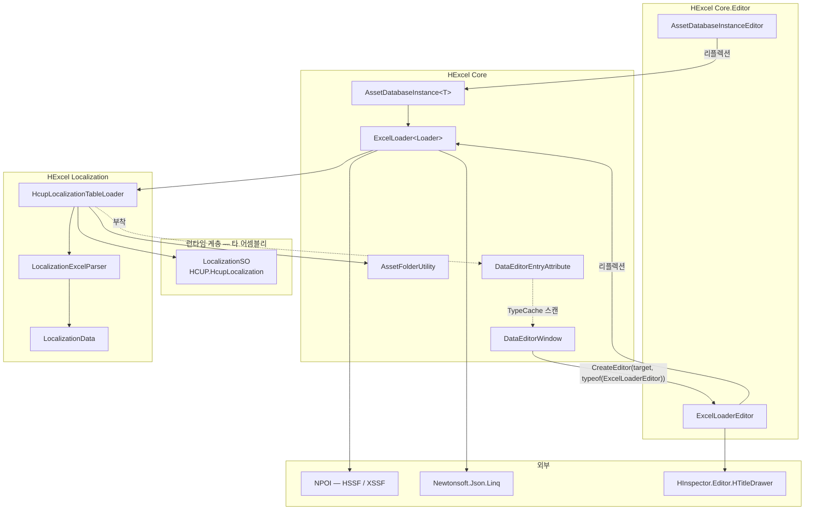
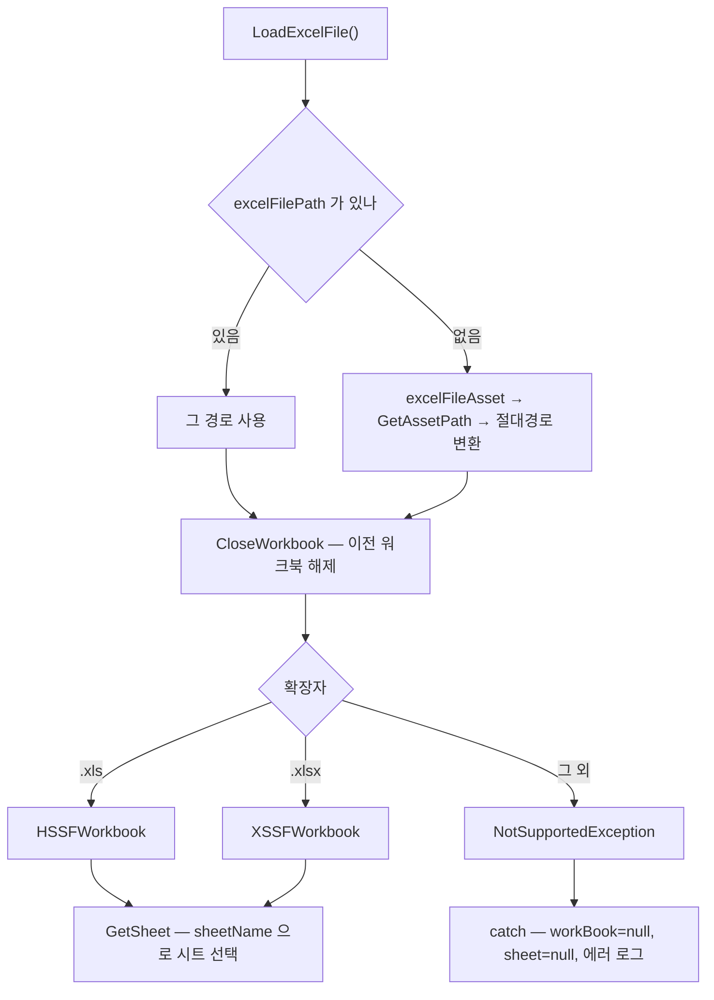
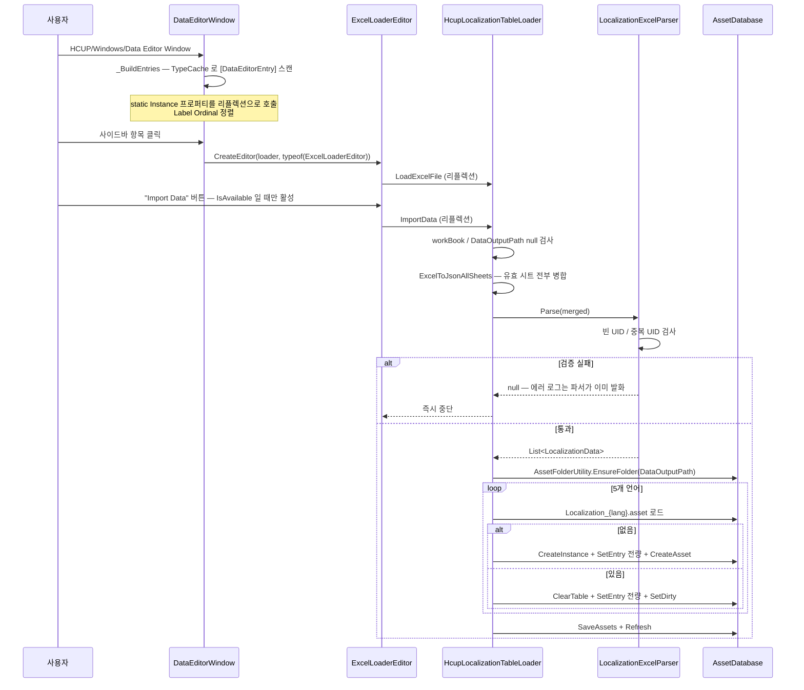

# HCUP.HExcel.Editor

> 어셈블리: `HCUP.HExcel.Editor` (`Editor/HCUP.HExcel.asmdef` — **파일명과 어셈블리명이 다름**, rootNamespace `HExcel`)
> 의존: `HCUP.HcupLocalization`, `HCUP.HInspector.Editor`, GUID 참조 4건(아래 표) / `includePlatforms: ["Editor"]`
> 동반 어셈블리: `HCUP.HExcel.Tests`([`Tests/README.md`](Tests/README.md))

---

## 요약

NPOI 로 Excel 파일을 읽어 **ScriptableObject 데이터 에셋을 생성하는 에디터 전용 파이프라인**이다.
런타임 코드는 없다 — 모든 클래스가 Editor 어셈블리에 있고, 그중 다수가 클래스 본체까지
`#if UNITY_EDITOR` 로 한 번 더 감싸여 있다.

두 갈래로 나뉜다.

| 갈래 | 폴더 | 성격 |
|---|---|---|
| **Core** | `Core/` (7파일) | 재사용 인프라. `ExcelLoader<T>` 베이스 + 싱글톤 접근 + IMGUI 에디터 + 로더 목록 창 |
| **Localization** | `Localization/` (3파일) | Core 위에 얹은 **구체 구현 1종**. 로컬라이제이션 Excel → 언어별 SO |

Localization 갈래는 Core 의 확장 방식을 보여주는 **유일한 실사용 예제**이기도 하다. 새 도메인
로더를 만들 때 이 3파일 구성을 그대로 복제하면 된다.

### GUID 참조

asmdef 의 `references` 중 4건이 이름이 아닌 GUID 로 걸려 있다. 패키지에 `.meta` 파일이 없어
소스만으로는 이름을 확정할 수 없으므로 원문 그대로 기록한다.

| GUID | 코드가 요구하는 것 |
|---|---|
| `8713a21b18988d64a80416a73699dc20` | 아래 4종 중 하나 — NPOI, Newtonsoft.Json, `HCUP.HDiagnosis`(`HDiagnosis.Logger`), 기타 |
| `2687c067fc80bbd448e188188cdbe214` | 〃 |
| `7912ec58de9231c47aa15fe05be8f6e4` | 〃 |
| `e36d0f774dc645c4d87e8e20a72bcdde` | 〃 |

이름 참조는 `HCUP.HcupLocalization`(`LocalizationSO` / `LocalizationLanguage`)과
`HCUP.HInspector.Editor`(`HTitleDrawer`) 2건이다. `overrideReferences` 는 `false` 이므로
NPOI·Newtonsoft DLL 은 자동 참조 경로로 해결된다.

---

## 파일 지도

| 경로 | 행수 | 역할 |
|---|---|---|
| `Core/ExcelLoader.cs` | 485 | `ExcelLoader<T>` 추상 베이스. 워크북 로드 / 시트 선택 / Excel↔JSON / 미리보기 |
| `Core/AssetDatabaseInstance.cs` | 151 | `AssetDatabaseInstance<T>` — `AssetDatabase` 기반 SO 싱글톤 + 에셋 생성 |
| `Core/AssetFolderUtility.cs` | 52 | `Assets/` 하위 폴더 재귀 생성 |
| `Core/DataEditorEntryAttribute.cs` | 41 | `DataEditorWindow` 사이드바 자동 등록 마커 |
| `Core/DataEditorWindow.cs` | 324 | `EditorWindow`. 사이드바(검색+목록) + 우측 인스펙터 임베딩 |
| `Core/Editor/ExcelLoaderEditor.cs` | 330 | `ExcelLoader<>` open generic `CustomEditor`. 리플렉션 경유 IMGUI |
| `Core/Editor/AssetDatabaseInstanceEditor.cs` | 49 | `AssetDatabaseInstance<>` open generic `CustomEditor`. 에셋 생성 버튼 |
| `Localization/HcupLocalizationTableLoader.cs` | 182 | 로컬라이제이션 Import/Export 구현 |
| `Localization/LocalizationExcelParser.cs` | 89 | 헤더 규격 상수 + UID 검증 파서 (양 로더 공용) |
| `Localization/LocalizationData.cs` | 73 | 행 1개 DTO + 언어→필드 매핑 |

---

## 계층 구조



`ADI --> EL` 은 상속이다 — `ExcelLoader<Loader> : AssetDatabaseInstance<Loader>`
(`ExcelLoader.cs:68-70`). `AssetDatabaseInstance<T> : ScriptableObject` 이므로
모든 로더는 ScriptableObject 다.

**두 `CustomEditor` 가 같은 타입 계층을 노린다.** `AssetDatabaseInstanceEditor` 는
`AssetDatabaseInstance<>` 를, `ExcelLoaderEditor` 는 그 파생인 `ExcelLoader<>` 를 open generic
으로 등록한다. Unity 는 open generic 간 우선순위를 신뢰할 수 없게 결정하므로,
`DataEditorWindow` 는 **타입을 명시해 모호성을 제거한다** (`DataEditorWindow.cs:212`).

---

## 데이터 모델 — `ExcelLoader<Loader>`

```csharp
// Core/ExcelLoader.cs:68-90
public abstract class ExcelLoader<Loader> : AssetDatabaseInstance<Loader>
    where Loader : ExcelLoader<Loader>, new() {

    [SerializeField] UnityEngine.Object excelFileAsset;  // Project 창 드래그드롭 대상
    string excelFilePath;                                // 직렬화 없음 — 테스트/코드 경로 전용
    [SerializeField] string sheetName;
    [SerializeField] string dataOutputPath;              // "Assets/..." 상대경로

    protected IWorkbook workBook;
    protected ISheet sheet;

    protected abstract string[] keys { get; }            // Excel 헤더와 정확히 일치해야 한다
}
```

`keys` 가 이 시스템의 계약이다. 헤더 검증(`IsAvailable`), 시트 필터링(`ExcelToJsonBySheet` /
`ExcelToJsonAllSheets`), Export 컬럼 순서가 전부 이 배열을 기준으로 한다.

| 멤버 | 접근 | 용도 |
|---|---|---|
| `SetDefaultExcelSettings(string)` | `public` | 경로 직접 지정 후 즉시 로드. 테스트·코드 경로 |
| `ImportData()` / `ExportData()` | `public abstract` | 파생 구현 지점 |
| `ExcelToJson()` | `protected` | **현재 시트만** → `JArray` |
| `ExcelToJsonBySheet()` | `protected` | 유효 시트별 `Dictionary<string, JArray>` |
| `ExcelToJsonAllSheets()` | `protected` | 유효 시트 전부를 하나의 `JArray` 로 병합 |
| `JsonToExcel(JArray, fileName)` | `protected` | 확인 다이얼로그 → `SaveFilePanel` → xlsx 저장 |
| `LoadExcelFile()` / `GetSheet()` / `CloseWorkbook()` | `internal` | 에디터·테스트가 리플렉션으로 호출 |
| `Sheets` / `IsAvailable` | `internal` | 시트 목록 / 헤더 검증 결과 |
| `GetPreviewHeaders()` / `GetPreviewRows(int)` | `internal` | 미리보기 표 (기본 200행) |

### 워크북 수명



**로드 실패는 상태를 비운다.** 예외를 삼키고 이전 워크북을 남기면 사용자는 새 파일을 보고
있다고 믿으면서 이전 데이터를 Import 하게 된다 (`ExcelLoader.cs:353-360`).

`ExcelToJsonBySheet` / `ExcelToJsonAllSheets` 는 `sheet` 필드를 임시로 바꿔가며 `ExcelToJson`
을 재사용하고 **`finally` 로 원래 시트를 복원한다** (`:191-224`, `:235-270`).

---

## 흐름 — Import (로컬라이제이션 예)



### Excel 규격

`LocalizationExcelParser.HEADER_KEYS` 가 단일 소스다 (`LocalizationExcelParser.cs:26-33`). 언어 컬럼명은
`nameof(LocalizationLanguage.Korean)` 형태라 **enum 과 컬럼명이 자동 동기화**된다.

| UID | Korean | English | Japanese | Chinese | Russian |
|---|---|---|---|---|---|

검증 규칙은 두 가지이고 **둘 다 즉시 중단(`null` 반환)**이다 (`LocalizationExcelParser.cs:45-54`).

1. 빈 UID (`IsNullOrWhiteSpace`)
2. 중복 UID (`HashSet<string>`, `StringComparer.Ordinal`)

언어 셀은 누락 시 `""` 로 채운다 (`LocalizationExcelParser.cs:57-61`) — 번역 누락은 허용, 식별자 문제는 불허다.

---

## 에디터 도구 — 메뉴 경로

| 창 | 메뉴 경로 | 용도 |
|---|---|---|
| `DataEditorWindow` | **`HCUP/Windows/Data Editor Window`** | 로더 목록 사이드바 + 선택 로더의 인스펙터 임베딩 |

`[MenuItem("HCUP/Windows/Data Editor Window")]` (`DataEditorWindow.cs:43`). 창 제목은
`"NPOI Data Editor"`, 크기는 1200×700, 메인 윈도우 중앙에 배치된다.
**이 어셈블리의 `MenuItem` 은 이것 하나뿐이다.**

`CustomEditor` 2종은 메뉴 항목이 아니라 인스펙터에 자동 적용된다.

| 에디터 | 대상 | 표시 내용 |
|---|---|---|
| `ExcelLoaderEditor` | `ExcelLoader<>` 파생 전체 | 엑셀 파일 / 시트 선택 / 데이터 출력 경로 / 실행 / 데이터 미리보기 |
| `AssetDatabaseInstanceEditor` | `AssetDatabaseInstance<>` 파생 전체 | 기본 인스펙터 + 미저장 시 "파일 저장하기" 버튼 |

### `DataEditorWindow` 의 로더 발견

하드코딩 목록이 아니라 `TypeCache.GetTypesWithAttribute<DataEditorEntryAttribute>()` 스캔이다
(`:183`). 이유는 순환 참조 회피다 — `HUnityLocalization.Editor` 가 `HCUP.HExcel.Editor` 를
참조하므로 반대 방향 참조를 만들 수 없다 (`DataEditorEntryAttribute.cs:35-38`).

```csharp
[DataEditorEntry("00. HcupLocalization")]      // Label 은 표기 겸 Ordinal 정렬 키
public class HcupLocalizationTableLoader : ExcelLoader<HcupLocalizationTableLoader> { ... }
```

부착 클래스에 `static Instance` 가 없으면 에러 로그를 남기고 건너뛴다 (`:187-191`).

---

## 리플렉션 경계

`ExcelLoader<>` 와 `AssetDatabaseInstance<>` 가 **open generic** 이라 `CustomEditor` 의
`target` 을 직접 캐스팅할 수 없다. 그래서 모든 멤버 접근이 리플렉션이다.

```csharp
// Core/Editor/ExcelLoaderEditor.cs:163-191
static readonly BindingFlags FLAGS =
    BindingFlags.Instance | BindingFlags.Public | BindingFlags.NonPublic;

private void _CallMethod(string methodName) {
    target.GetType()
          .GetMethod(methodName, FLAGS)
          ?.Invoke(target, null);
}
```

| 문자열 키 | 대상 멤버 | 사용처 |
|---|---|---|
| `"IsLoadedFromAsset"` | `AssetDatabaseInstance.IsLoadedFromAsset` | 저장 섹션 표시 분기 (양 에디터) |
| `"CreateAsset"` | `AssetDatabaseInstance.CreateAsset` | 저장 버튼 |
| `"Sheets"` / `"IsAvailable"` | `ExcelLoader` internal 프로퍼티 | 시트 드롭다운 / Import 버튼 활성 |
| `"LoadExcelFile"` / `"GetSheet"` | `ExcelLoader` internal 메서드 | 파일 변경·시트 변경 시 |
| `"ImportData"` / `"ExportData"` | `public abstract` | 실행 버튼 |
| `"GetPreviewHeaders"` / `"GetPreviewRows"` | `ExcelLoader` internal | 미리보기 갱신 |
| `"excelFileAsset"` / `"sheetName"` / `"dataOutputPath"` | `SerializedProperty` | `FindProperty` |
| `"Instance"` (static, `FlattenHierarchy`) | `AssetDatabaseInstance<T>.Instance` | `DataEditorWindow._BuildEntries` |
| `"sheetName"` / `"GetSheet"` | 〃 | `HCUP.HExcel.Tests` 도 같은 우회를 쓴다 |

**이 문자열들은 컴파일러가 검증하지 않는다.** 필드·메서드 리네임이 무음 실패로 이어진다 —
`?.Invoke` 가 null 을 흘려보내 버튼이 아무 일도 하지 않는 형태로 나타난다.

미리보기는 `previewDirty` 플래그로 보호된다 (`:195-202`). 파일·시트 변경 시에만 재파싱하므로
매 프레임 NPOI 파싱이 일어나지 않는다.

---

## 사용 예 — 새 로더 추가

```csharp
using HExcel.Core;
using Newtonsoft.Json.Linq;

[DataEditorEntry("01. Equipment")]                       // 사이드바 자동 등록
public class EquipmentTableLoader : ExcelLoader<EquipmentTableLoader> {
    protected override string[] keys => new[] { "Id", "Name", "Level" };

    public override void ImportData() {
        if (workBook == null) return;                    // 로드 여부 확인 필수
        if (string.IsNullOrEmpty(DataOutputPath)) return;

        JArray rows = ExcelToJson();                     // 현재 시트만
        AssetFolderUtility.EnsureFolder(DataOutputPath);
        // rows → ScriptableObject 생성/갱신
    }

    public override void ExportData() {
        JArray rows = /* SO → JArray */ null;
        JsonToExcel(rows, "Equipment");                  // 확인 다이얼로그 + 저장 패널
    }
}
```

이후 `HCUP/Windows/Data Editor Window` 를 열면 `01. Equipment` 항목이 나타난다.
별도 등록 코드는 없다.

---

## 주의할 점

### 계약

1. **헤더는 Row 0 이고 `keys` 와 정확히 일치해야 한다.** `ExcelToJson` 은
   `keys.Length` 만큼 헤더 셀을 읽으며, 빈 헤더 셀을 만나면 `Assert.IsNotNull` 로 중단한다
   (`ExcelLoader.cs:148-153`). 다만 **헤더 순서가 `keys` 순서와 다르면 컬럼 매핑이 어긋난다** —
   `cols.Add(headerCell.ToString(), k)` 가 인덱스 `k` 를 그대로 쓰기 때문이다.
2. **`ExcelToJson` 은 빈 셀을 JSON 에서 생략한다** (`:167-168`). 소비 측은 항상
   `row["key"]?.Value<T>() ?? 기본값` 형태로 읽어야 한다.
3. **`cell.ToString()` 결과가 값이다.** NPOI 수치 셀의 `ToString()` 은 서식에 따라 편차가
   있으므로, 테스트는 모든 셀을 문자열로 저장해 이를 회피한다
   (`Tests/ExcelLoaderTests.cs:164`).
4. **`AssetDatabaseInstance.Instance` 는 타입당 첫 에셋 하나만 잡는다.**
   `FindAssets($"t:{typeof(T).Name}").FirstOrDefault()` (`AssetDatabaseInstance.cs:63`).
   같은 타입 에셋이 둘 이상이면 어느 쪽이 잡힐지 정의되지 않는다.
5. **에셋이 없으면 메모리 인스턴스만 생성된다.** `IsLoadedFromAsset == false` 상태이며,
   "파일 저장하기" / "Loader 저장하기" 버튼을 눌러야 영구 저장된다. 저장 전 설정한
   엑셀 파일·시트·출력 경로는 세션 종료 시 사라진다.
6. **`LocalizationData.GetText` 에 기본 arm 이 없다** (`LocalizationData.cs:32-38`).
   `LocalizationLanguage` 에 값을 추가하고 이 switch 를 갱신하지 않으면
   `SwitchExpressionException` 이 발생한다 — 조용한 빈 문자열 기록을 막으려는 의도적 설계다.
7. **`ExportData` 는 Import 를 먼저 요구한다.** 5개 언어 SO 중 하나라도 없으면 에러 후 중단한다
   (`HcupLocalizationTableLoader.cs:84-87`). Export 순서는 Korean SO 의 UID 를
   `StringComparer.Ordinal` 로 정렬한 결과다.

### 정리 대상

8. **asmdef 파일명과 어셈블리명이 다르다.** 파일은 `HCUP.HExcel.asmdef`, `name` 필드는
   `HCUP.HExcel.Editor`. 동작에는 문제가 없으나 검색·추적을 방해한다.
9. **`AssetDatabaseInstanceEditor` 는 사실상 죽은 경로다.** `DataEditorWindow` 가
   `ExcelLoaderEditor` 를 타입 명시로 강제하고(`DataEditorWindow.cs:212`),
   `ExcelLoaderEditor._DrawLoaderSaveSection` 이 같은 "저장" 기능을 자체 구현한다
   (`ExcelLoaderEditor.cs:61-72`, 근거는 `:273`). Project 창에서 `AssetDatabaseInstance` 파생
   에셋을 직접 선택했을 때만 이 에디터가 보인다.
10. **`AssetDatabaseInstance.CreateAsset` / `CreateAssetAt` 이 `instance`(static) 에 쓴다**
    (`:86`, `:101`). `target` 이 아니라 static 싱글톤 필드다. 인스펙터에서 보고 있는 객체와
    `Instance` 가 다른 객체일 때 잘못된 대상이 저장된다. 또 `CreateAsset` 은
    `instance` 가 아직 초기화되지 않은 상태(프로퍼티 미접근)에서 호출되면
    `NullReferenceException` 이다 — `Instance` 게터를 거치지 않고 필드를 직접 쓴다.
11. **`HLogger.Log(guid)` / `HLogger.Log(path)` 가 정보 없는 로그를 남긴다**
    (`AssetDatabaseInstance.cs:64`, `:70`, `:84`; `ExcelLoader.cs:314`, `:342`). 접두사도
    맥락도 없는 원시 문자열이라 콘솔에서 출처를 알기 어렵다.
12. **`ExcelToJsonAllSheets` 와 `ExcelToJsonBySheet` 가 같은 로직을 두 번 구현한다**
    (`ExcelLoader.cs:184-226` vs `:228-272`). 헤더 검사·키 포함 검사·시트 스왑이 동일하고
    결과 수집만 다르다.
13. **`CloseWorkbook` 을 부르는 곳이 `LoadExcelFile` 하나뿐이다** (`:339`). 로더 인스턴스가
    파괴될 때 워크북을 닫는 경로가 없어, XSSF 의 OPCPackage 와 인메모리 시트 트리가
    도메인 리로드까지 남는다.

### 기존 문서와의 불일치

14. **이 파일의 종전 내용은 코드와 맞지 않아 대체됐다.** 종전 문서는 "NPOI — Odin Inspector →
    Unity 네이티브 IMGUI 전환 문서 패키지" 인덱스였고, 아래 문제가 있었다.
    - `00_OVERVIEW.md` ~ `05_TEST_CASES.md` 6개 문서를 링크했으나 **전부 존재하지 않는다.**
    - 코드 위치를 `Assets/01_Scripts/02_Data/NPOI/...` 로 적었으나 현재는 `HExcel/Editor/Core/...` 다.
    - `SpriteCatalogSO.cs` 를 "가장 Odin 의존이 강한 SO" 로 가리키나 이 패키지에 없다.
    - 진행 상태를 `M2`~`M8` 미완료로 표시하나, **현재 코드에는 Odin 참조가 한 줄도 없다**
      (`HExcel` 전체 `Sirenix` grep 0건). M2·M3·M4 는 완료 상태다.
15. **`DataEditorWindow` 헤더 주석이 `Unity Menu → HData/NPOI 에서 오픈` 이라 적고 있다**
    (`DataEditorWindow.cs:6`). 실제 경로는 `HCUP/Windows/Data Editor Window` 다.

---

## 확장 지점

| 하고 싶은 것 | 손댈 곳 |
|---|---|
| 새 데이터 로더 추가 | `ExcelLoader<T>` 상속 + `keys` + `ImportData`/`ExportData` + `[DataEditorEntry]` |
| 다중 시트 병합 정책 변경 | `ExcelToJsonAllSheets` / `ExcelToJsonBySheet` 의 헤더 필터 |
| 로더별 커스텀 인스펙터 | `ExcelLoaderEditor` 상속 후 구체 타입에 `[CustomEditor]` — open generic 보다 우선 |
| 미리보기 행 수 조정 | `ExcelLoaderEditor._RefreshPreviewIfNeeded` 의 `new object[] { 200 }` |
| 로컬라이제이션 언어 추가 | `HCUP.HcupLocalization` 의 `LocalizationLanguage` enum + `LocalizationData` 필드·switch + `HcupLocalizationTableLoader._WriteLanguageSO` 호출 |
| 사이드바 정렬 규칙 | `DataEditorWindow._BuildEntries` 의 `string.CompareOrdinal` — 현재 Label 접두 번호가 정렬 키 |
