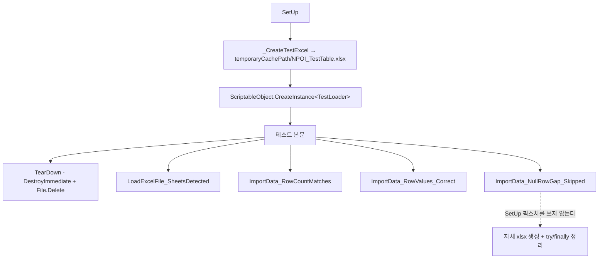

# HCUP.HExcel.Tests

> 어셈블리: `HCUP.HExcel.Tests` (`Tests/HCUP.HExcel.Tests.asmdef`, rootNamespace `HExcel.Tests`)
> 의존: GUID 참조 3건 + **`overrideReferences: true` 로 precompiled DLL 6개 명시** (아래 참조)
> 동반 어셈블리: `HCUP.HExcel.Editor`([`../README.md`](../README.md))

---

## 요약

`ExcelLoader<T>` 의 **데이터 추출 파이프라인만** 검증하는 EditMode 테스트 4건이다.
`AssetDatabase` 도, 실제 프로젝트 에셋도 건드리지 않는다 - 테스트가 xlsx 를
`Application.temporaryCachePath` 에 직접 만들고 `TearDown` 에서 지운다.

이 어셈블리의 asmdef 설정은 다른 HCUP 어셈블리와 다르게 **참조를 완전히 수동 통제한다.**

---

## asmdef 설정 - 현행

```jsonc
{
    "name": "HCUP.HExcel.Tests",
    "rootNamespace": "HExcel.Tests",
    "references": [
        "GUID:f28a2e8676c17864f91ad121f10398ac",
        "GUID:27619889b8ba8c24980f49ee34dbb44a",
        "GUID:0acc523941302664db1f4e527237feb3"
    ],
    "includePlatforms": ["Editor"],
    "excludePlatforms": [],
    "allowUnsafeCode": false,
    "overrideReferences": true,
    "precompiledReferences": [
        "nunit.framework.dll",
        "NPOI.Core.dll",
        "NPOI.OOXML.dll",
        "NPOI.OpenXml4Net.dll",
        "NPOI.OpenXmlFormats.dll",
        "Newtonsoft.Json.dll"
    ],
    "autoReferenced": false,
    "defineConstraints": ["UNITY_INCLUDE_TESTS"],
    "versionDefines": [],
    "noEngineReferences": false
}
```

| 설정 | 값 | 의미 |
|---|---|---|
| `includePlatforms` | `["Editor"]` | **에디터 전용.** 플레이어 빌드에 포함되지 않는다 |
| `excludePlatforms` | `[]` | 별도 제외 없음 |
| `overrideReferences` | **`true`** | 자동 DLL 참조를 끄고 `precompiledReferences` 만 쓴다 |
| `precompiledReferences` | 6개 DLL | NUnit 1 + NPOI 4 + Newtonsoft 1 |
| `defineConstraints` | `["UNITY_INCLUDE_TESTS"]` | 테스트가 비활성인 프로젝트에서는 컴파일되지 않는다 |
| `autoReferenced` | `false` | 다른 어셈블리가 이 어셈블리를 자동 참조하지 않는다 |
| `noEngineReferences` | `false` | `UnityEngine` 사용 (`ScriptableObject.CreateInstance`, `Application.temporaryCachePath`) |

**`overrideReferences: true` 가 이 asmdef 의 핵심이다.** NPOI 는 4개 DLL 로 쪼개져 있고
(`NPOI.Core` / `NPOI.OOXML` / `NPOI.OpenXml4Net` / `NPOI.OpenXmlFormats`), `XSSFWorkbook`
하나를 쓰려면 4개가 모두 있어야 한다. `precompiledReferences` 에서 하나라도 빠지면
타입 로드 실패로 컴파일이 깨진다.

### GUID 참조 3건

저장소와 Unity Test Framework 패키지의 `.meta` 로 확인한 대상은 아래와 같다. 코드가 요구하는 것은 `HExcel.Core`(테스트 대상 `ExcelLoader<T>`, `ExcelLoaderTests.cs:30`)와 Unity Test Framework 런타임/에디터 어셈블리다.

| GUID | 대상 asmdef |
|---|---|
| `f28a2e8676c17864f91ad121f10398ac` | `HCUP.HExcel.Editor` (`HExcel/Editor/HCUP.HExcel.asmdef`) |
| `27619889b8ba8c24980f49ee34dbb44a` | `UnityEngine.TestRunner` (`com.unity.test-framework`) |
| `0acc523941302664db1f4e527237feb3` | `UnityEditor.TestRunner` (`com.unity.test-framework`) |

픽스처 DTO `SampleData` 는 외부 모듈이 아니라 테스트 파일 안에 있다 (`ExcelLoaderTests.cs:36-40`).

---

## 파일 지도

| 경로 | 행수 | 역할 |
|---|---|---|
| `ExcelLoaderTests.cs` | 237 | 픽스처 DTO + `TestLoader` + `[TestFixture] ExcelLoaderTests` (4건) |

파일 하나에 세 타입이 들어 있다.

| 타입 | 역할 |
|---|---|
| `SampleData` | 픽스처 DTO. `Id` / `Name` / `Value` |
| `TestLoader : ExcelLoader<TestLoader>` | `AssetDatabase` 없이 결과를 메모리 `List` 에 담는 테스트 전용 로더 |
| `ExcelLoaderTests` | `[TestFixture]`. SetUp/TearDown + 테스트 4건 + 헬퍼 4개 |

---

## 테스트 구조



| 테스트 | 검증 대상 |
|---|---|
| `LoadExcelFile_SheetsDetected` | 로드 후 `Sheets` 가 1건, 이름이 `Sheet1` |
| `ImportData_RowCountMatches` | 파싱 행 수 == `TEST_ROWS.Length` (3) |
| `ImportData_RowValues_Correct` | 각 행의 `Id` / `Name` / `Value` 가 원본과 일치 |
| `ImportData_NullRowGap_Skipped` | Row 2 를 건너뛴 xlsx 에서 예외 없이 2건만 파싱 |

`ImportData_NullRowGap_Skipped` 만 `SetUp` 픽스처를 쓰지 않고 자체 파일
(`NPOI_Gap.xlsx`)을 만들며, `try/finally` 로 로더와 파일을 직접 정리한다 (`:134-148`).
이 경우 `SetUp` 이 만든 파일과 로더는 사용되지 않은 채 `TearDown` 에서 정리된다.

---

## 리플렉션 우회

`ExcelLoader` 의 시트 선택 경로가 `private` 필드 + `internal` 메서드라 테스트도
`ExcelLoaderEditor` 와 같은 우회를 쓴다.

```csharp
// Tests/ExcelLoaderTests.cs:67-68, :153-159
static readonly BindingFlags MEMBER_FLAGS =
    BindingFlags.Instance | BindingFlags.Public | BindingFlags.NonPublic;

void _SelectSheet(object target, string sheetName) {
    target.GetType().GetField("sheetName", MEMBER_FLAGS)?.SetValue(target, sheetName);
    target.GetType().GetMethod("GetSheet",  MEMBER_FLAGS)?.Invoke(target, null);
}

List<string> _GetSheets(object target) =>
    target.GetType().GetProperty("Sheets", MEMBER_FLAGS)?.GetValue(target) as List<string>;
```

`SetDefaultExcelSettings(path)` 는 `public` 이라 리플렉션 없이 호출한다 - 이 메서드가
직렬화되지 않는 `excelFilePath` 를 채우고 `LoadExcelFile()` 을 호출하므로,
`excelFileAsset`(Project 창 에셋) 없이 임의 절대경로로 로드할 수 있다.

---

## 실행

`Window → General → Test Runner → EditMode` 탭.

---

## 주의할 점

### 계약

1. **모든 셀을 문자열로 저장한다** (`:164`, `:176-178`). NPOI 수치 셀의 `ToString()` 은 서식에
   따라 `"1"` 이 될 수도 `"1.0"` 이 될 수도 있다. `ExcelToJson` 이 `cell.ToString()` 을 값으로
   쓰므로, 픽스처를 문자열로 고정해 이 편차를 제거한다.
2. **`_SelectSheet` 의 문자열 키가 컴파일러 검증을 받지 않는다.** `ExcelLoader` 의
   `sheetName` 필드나 `GetSheet` 메서드를 리네임하면 `?.` 가 null 을 흘려보내
   **시트가 선택되지 않은 채 테스트가 진행**된다. `ImportData` 가
   `sheet` null 로 `NullReferenceException` 을 던지는 형태로 드러나므로 무음 통과는 아니지만,
   실패 메시지가 원인을 가리키지 않는다.
3. **`ImportData_NullRowGap_Skipped` 는 `ExcelToJson` 의 null 행 처리를 검증하고, 그 경로는 에러 로그를 남긴다.** null 행은 `HLogger.Error` 를 발화하며 건너뛰고(`ExcelLoader.cs:158`), `HLogger.Error` 는 에디터에서 `Debug.LogError` 로 이어진다 (`HDiagnosis/Runtime/Logger/HLogger.cs:188-190`). Unity Test Framework 는 기본적으로 테스트 중 미예상 `LogError` 를 실패로 처리하는데 이 테스트에는 `LogAssert.Expect` / `LogAssert.ignoreFailingMessages` 가 없다. 따라서 기본 설정에서는 `Assert` 가 전부 통과해도 테스트가 실패로 보고될 수 있다.

### 정리 대상

4. **`ExportData()` 에 테스트가 없다.** `TestLoader.ExportData` 는 빈 구현이다 (`:62`).
   `JsonToExcel` 은 `EditorUtility.DisplayDialog` + `SaveFilePanel` 을 호출해 사용자 상호작용을
   요구하므로 현재 구조로는 자동 테스트가 불가능하다.
5. **`ExcelToJsonAllSheets` / `ExcelToJsonBySheet` 에 테스트가 없다.** 다중 시트 병합과
   키 기반 시트 필터링이 로컬라이제이션 Import 의 핵심 경로인데 검증되지 않는다.
6. **`CloseWorkbook` 이 `TearDown` 에서 호출되지 않는다** (`:86-90`).
   `DestroyImmediate(loader)` 만 하므로 워크북(XSSF OPCPackage)이 명시적으로 닫히지 않고,
   테스트가 만든 xlsx 파일을 `File.Delete` 할 때 파일 잠금 문제가 생길 여지가 있다.
   다만 `LoadExcelFile` 이 `FileStream` 을 `using` 으로 닫으므로 파일 핸들은 남지 않는다.
7. **테스트 파일명이 고정이다** (`NPOI_TestTable.xlsx` / `NPOI_Gap.xlsx`). 테스트를 병렬
   실행하거나 이전 실행이 비정상 종료해 파일이 남으면 충돌한다.

---

## 확장 지점

| 하고 싶은 것 | 손댈 곳 |
|---|---|
| 새 테스트 추가 | `ExcelLoaderTests` 에 `[Test]` 메서드 + 필요 시 `_CreateTestExcel*` 헬퍼 복제 |
| 다중 시트 경로 검증 | `_CreateTestExcel` 에 시트 추가 후 `ExcelToJsonAllSheets` 를 부르는 `TestLoader` 변형 |
| Export 경로 테스트 | `ExcelLoader.JsonToExcel` 에서 다이얼로그·저장 패널을 주입 가능한 형태로 분리해야 가능 |
| DLL 참조 추가 | `precompiledReferences` 에 명시 - `overrideReferences: true` 라 자동 참조가 없다 |

---

## 히스토리

### 2026-08-05 :: 테스트 어셈블리 복구

- 이전: 모듈 분리 전 `HCUP.HData.NPOI.Tests` 는 `excludePlatforms` 에 `Editor` 가 들어 있어 EditMode 러너에 잡히지 않았고, 삭제된 `HData.NPOI.Samples` 의 `SampleData` 를 참조해 컴파일되지 않았다. 원인은 참조 설정이 아니라 소스의 외부 타입 의존이었다.
- 현재: HExcel 로 분리하면서 `includePlatforms: ["Editor"]` 로 바꾸고, `precompiledReferences` 에 NPOI 4종과 Newtonsoft.Json 을 추가하고, 픽스처 전용 DTO `SampleData` 를 테스트 파일 안에 두었다.
