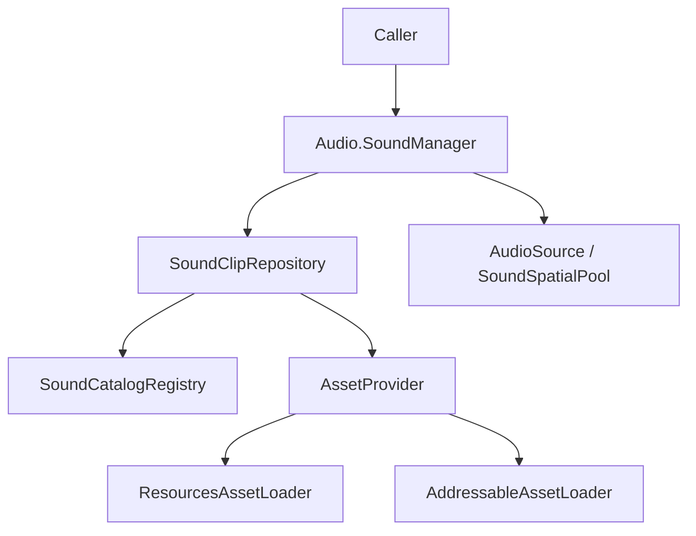
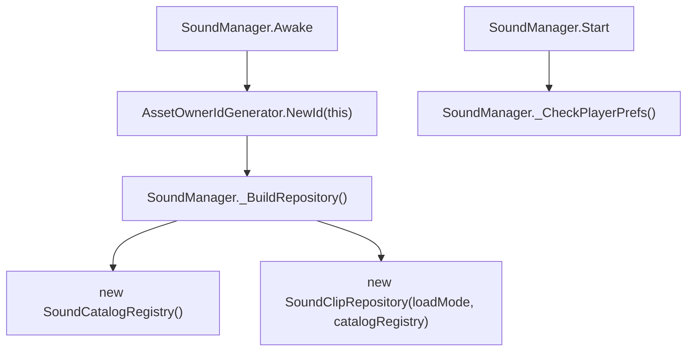
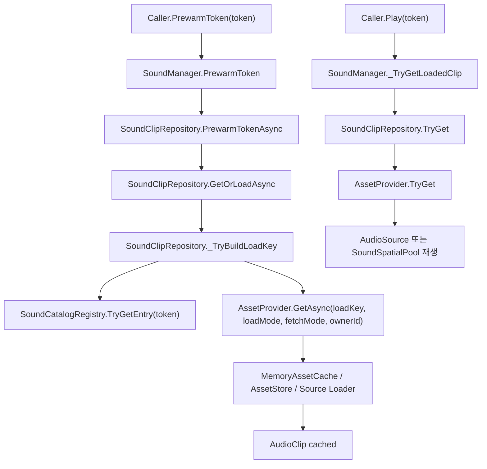
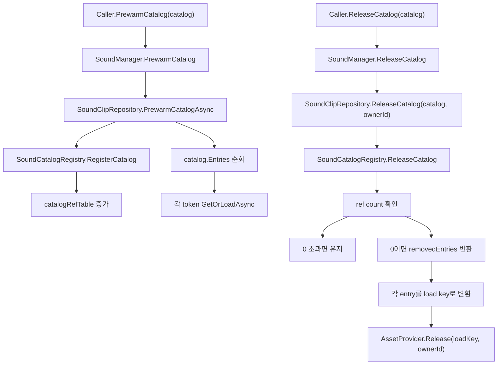
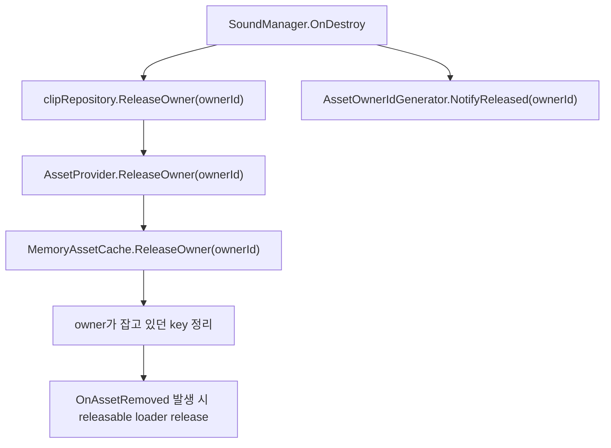

# HGame.Audio

## 개요
`HGame.Audio`는 신규 오디오 시스템이다.  
기준 키는 `string token`이며, 실제 asset 로드는 `HUtil.AssetHandler`에 위임한다.

핵심 구성은 아래와 같다.

- `SoundManager`
  오디오 도메인의 런타임 진입점이다. preload, release, playback, volume 제어를 맡는다.
- `SoundClipRepository`
  `token -> load key` 해석과 `AssetProvider<string, AudioClip>` 위임을 맡는다.
- `SoundCatalogRegistry`
  활성 `SoundCatalogSO`를 등록하고 `token -> SoundCatalogSO.Entry` 조회를 맡는다.
- `Legacy/*`
  기존 `int`/`enum` 호출부를 임시로 유지하기 위한 partial 분리 영역이다.

## 시스템 구조

### 선분 설명
| From | To | 작업 |
|---|---|---|
| Caller | Audio.SoundManager | 오디오 preload, release, playback 요청을 보낸다. |
| Audio.SoundManager | SoundClipRepository | token 또는 catalog 기준으로 clip 조회와 해제를 위임한다. |
| SoundClipRepository | SoundCatalogRegistry | token에 대응하는 `SoundCatalogSO.Entry`를 조회한다. |
| SoundClipRepository | AssetProvider<string, AudioClip> | 실제 asset 조회와 owner 기반 해제를 요청한다. |
| AssetProvider<string, AudioClip> | ResourcesAssetLoader | `AssetLoadMode.Resources`일 때 Resources source 로드를 수행한다. |
| AssetProvider<string, AudioClip> | AddressableAssetLoader | `AssetLoadMode.Addressable`일 때 Addressable source 로드를 수행한다. |
| Audio.SoundManager | AudioSource / SoundSpatialPool | preload된 `AudioClip`을 실제 재생 채널에 전달한다. |

## 흐름 1. 초기화
`SoundManager`는 자신의 owner를 만들고 repository를 조립한다.

### 선분 설명
| From | To | 작업 |
|---|---|---|
| SoundManager.Awake | AssetOwnerIdGenerator.NewId(this) | 매니저 수명에 묶인 owner 식별자를 발급한다. |
| AssetOwnerIdGenerator.NewId(this) | SoundManager._BuildRepository() | 발급된 owner를 바탕으로 로드 시스템 조립 단계로 넘어간다. |
| SoundManager._BuildRepository() | new SoundCatalogRegistry() | catalog 인덱싱용 레지스트리를 생성한다. |
| SoundManager._BuildRepository() | new SoundClipRepository(loadMode, catalogRegistry) | load mode와 registry를 바탕으로 repository를 생성한다. |
| SoundManager.Start | SoundManager._CheckPlayerPrefs() | 볼륨과 기본 클릭 token 초기값을 로딩한다. |

## 흐름 2. Prewarm 후 재생
이 시스템은 기본적으로 `prewarm -> play` 흐름을 전제로 한다.

### 선분 설명
| From | To | 작업 |
|---|---|---|
| Caller.PrewarmToken(token) | SoundManager.PrewarmToken | caller가 token preload를 요청한다. |
| SoundManager.PrewarmToken | SoundClipRepository.PrewarmTokenAsync | token 정규화 후 repository preload로 넘긴다. |
| SoundClipRepository.PrewarmTokenAsync | SoundClipRepository.GetOrLoadAsync | preload도 결국 일반 로드 경로를 사용한다. |
| SoundClipRepository.GetOrLoadAsync | SoundClipRepository._TryBuildLoadKey | token을 실제 source key로 해석한다. |
| SoundClipRepository._TryBuildLoadKey | SoundCatalogRegistry.TryGetEntry(token) | 등록된 catalog에서 token entry를 찾는다. |
| SoundClipRepository._TryBuildLoadKey | AssetProvider.GetAsync(loadKey, loadMode, fetchMode, ownerId) | 해석된 key로 asset handler 조회를 요청한다. |
| AssetProvider.GetAsync(loadKey, loadMode, fetchMode, ownerId) | MemoryAssetCache / AssetStore / Source Loader | fetch mode에 따라 cache, store, source 순서를 조율한다. |
| MemoryAssetCache / AssetStore / Source Loader | AudioClip cached | 결과 clip을 cache와 owner 점유 상태에 반영한다. |
| Caller.Play(token) | SoundManager._TryGetLoadedClip | 재생 요청 시 preload된 clip 조회를 시작한다. |
| SoundManager._TryGetLoadedClip | SoundClipRepository.TryGet | repository에 즉시 조회를 요청한다. |
| SoundClipRepository.TryGet | AssetProvider.TryGet | 최종 cache hit 여부를 provider에 위임한다. |
| AssetProvider.TryGet | AudioSource 또는 SoundSpatialPool 재생 | clip이 있으면 실제 재생 채널로 전달한다. |

## 흐름 3. Catalog preload와 release
catalog 단위 preload와 release는 `SoundCatalogRegistry`의 ref count에 의존한다.

### 선분 설명
| From | To | 작업 |
|---|---|---|
| Caller.PrewarmCatalog(catalog) | SoundManager.PrewarmCatalog | catalog preload 요청을 매니저가 받는다. |
| SoundManager.PrewarmCatalog | SoundClipRepository.PrewarmCatalogAsync | repository에 catalog preload를 위임한다. |
| SoundClipRepository.PrewarmCatalogAsync | SoundCatalogRegistry.RegisterCatalog | catalog를 활성 registry에 등록한다. |
| SoundCatalogRegistry.RegisterCatalog | catalogRefTable 증가 | 동일 catalog 재사용 여부를 ref count로 추적한다. |
| SoundClipRepository.PrewarmCatalogAsync | catalog.Entries 순회 | catalog 내부 entry를 순회한다. |
| catalog.Entries 순회 | 각 token GetOrLoadAsync | 각 token을 일반 로드 경로로 preload한다. |
| Caller.ReleaseCatalog(catalog) | SoundManager.ReleaseCatalog | catalog 해제 요청을 매니저가 받는다. |
| SoundManager.ReleaseCatalog | SoundClipRepository.ReleaseCatalog(catalog, ownerId) | owner 기준 catalog 해제를 repository에 위임한다. |
| SoundClipRepository.ReleaseCatalog(catalog, ownerId) | SoundCatalogRegistry.ReleaseCatalog | registry ref count를 감소시킨다. |
| SoundCatalogRegistry.ReleaseCatalog | ref count 확인 | 아직 다른 사용자가 catalog를 잡고 있는지 판별한다. |
| ref count 확인 | 0 초과면 유지 | 아직 살아있는 참조가 있으면 실제 clip release를 하지 않는다. |
| ref count 확인 | 0이면 removedEntries 반환 | 마지막 참조가 끝났으면 제거 대상 entry 목록을 만든다. |
| removedEntries 반환 | 각 entry를 load key로 변환 | 각 entry를 Resources key 또는 Addressable key로 바꾼다. |
| 각 entry를 load key로 변환 | AssetProvider.Release(loadKey, ownerId) | provider에 owner 기준 해제를 전달한다. |

## 흐름 4. 매니저 수명 종료

### 선분 설명
| From | To | 작업 |
|---|---|---|
| SoundManager.OnDestroy | clipRepository.ReleaseOwner(ownerId) | 매니저가 점유한 모든 clip 정리를 시작한다. |
| clipRepository.ReleaseOwner(ownerId) | AssetProvider.ReleaseOwner(ownerId) | owner 기준 release를 asset handler에 위임한다. |
| AssetProvider.ReleaseOwner(ownerId) | MemoryAssetCache.ReleaseOwner(ownerId) | cache에 기록된 owner 점유 key를 해제한다. |
| MemoryAssetCache.ReleaseOwner(ownerId) | owner가 잡고 있던 key 정리 | owner set과 key 테이블을 기준으로 제거 가능한 항목을 정리한다. |
| owner가 잡고 있던 key 정리 | OnAssetRemoved 발생 시 releasable loader release | 실제 제거된 key는 Addressable handle release 같은 후속 정리로 이어진다. |
| SoundManager.OnDestroy | AssetOwnerIdGenerator.NotifyReleased(ownerId) | owner 수명 종료를 시스템에 통지한다. |

## 운영 규칙
- 신규 코드의 기준 키는 `string token`이다.
- `Play*` 계열은 기본적으로 preload된 clip이 있다고 가정한다.
- `SoundCatalogSO`는 runtime entry source이며, `SoundCatalogRegistry`가 활성 catalog 집합만 추적한다.
- Addressable key는 현재 token과 동일하게 해석한다.
- 레거시 `int`/`enum` 경로는 `Legacy/*` partial에만 남긴다.

## 관련 파일
- `SoundManager.cs`
- `SoundManager.Preivew.cs`
- `Repository/SoundClipRepository.cs`
- `Catalog/SoundCatalogRegistry.cs`
- `Legacy/*`
