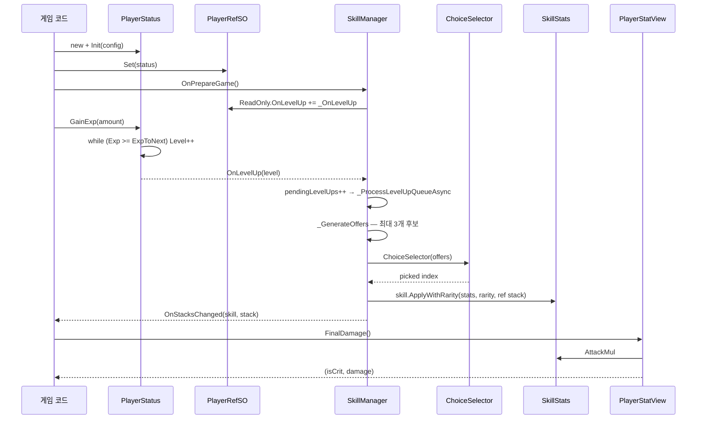

# HCUP.HGame

> 어셈블리: `HCUP.HGame` (`Runtime/HCUP.HGame.asmdef`, rootNamespace `HGame`)
> 의존: `UniTask`, `HCUP.HUtil`, `HCUP.HUI`, `HCUP.HDiagnosis`, `HCUP.HInspector`, `HCUP.HCollection`, `HCUP.HCore`
> 동반 어셈블리: 없음 (1.0.3 에서 `HCUP.HGame.Editor` / `HCUP.HGame.Odin` 삭제)

---

## 요약

HGame 은 **게임 진행 계층의 조립 부품 모음**이다. 하나의 프레임워크가 아니라, 서로 독립적으로
동작하는 6개 시스템이 같은 어셈블리에 모여 있다. 시스템 사이의 결합은 아래 4개 간선이 전부다.

- `SkillManager` → `PlayerRefSO` (레벨업 이벤트 구독)
- `PlayerStatView` → `SkillStats` (최종 데미지 합성)
- `MapManager` → `CameraManager` (미니맵 클릭 → 카메라 이동 요청)
- `BaseEventPoint<T>` → `ICharacterCommand` (제약 조건)

`InitModule` 은 어디에도 연결되어 있지 않다. **다른 시스템을 자동으로 초기화하지 않으며**,
`InitManager` 의 modules 리스트에 무엇을 넣을지는 전적으로 프로젝트 코드의 몫이다.

설계상 관통하는 규약은 두 가지다.

1. **매니저는 `HCore.SingletonBehaviour<T>` 파생이다.** `InitManager<TSelf>`, `SkillManager`,
   `CameraManager`, `MapManager`, `WorldEventManager` 전부. `OnDestroy` 를 재정의할 때는
   반드시 `protected override` + `base.OnDestroy()` 여야 static 참조가 해제된다.
2. **데이터는 `ScriptableObject`, 상태는 POCO/MonoBehaviour 다.** `PlayerConfig`/`BaseSkillSO`/
   `SkillCatalogSO` 는 읽기 전용 설정이고, `PlayerStatus`(순수 C# 클래스)/`SkillStats`(MonoBehaviour)
   가 변하는 값을 든다. `PlayerRefSO` 만 예외로 SO 가 런타임 참조를 중계한다.

---

## 시스템 문서

| 문서 | 범위 | 파일 수 |
|---|---|---|
| [`../docs/InitModule.md`](../docs/InitModule.md) | 게임 페이즈 상태머신 (`InitManager<TSelf>` / `BaseInitModule` / `InitContext` / `InitPhaseType`) | 5 |
| [`../docs/Player.md`](../docs/Player.md) | 캐릭터 기반 계약 + 플레이어 스탯/레벨/HP + SO 참조 중계 | 9 |
| [`../docs/Skill.md`](../docs/Skill.md) | 레벨업 → 3택 제안 → 스택 적용 → 곱연산 스탯 | 8 |
| [`../docs/Camera.md`](../docs/Camera.md) | 카메라 추종·경계 클램프 (2D / TopDown3D / Perspective) + 패럴랙스 | 7 |
| [`../docs/Map.md`](../docs/Map.md) | 월드 경계 소스 4종 + 미니맵 마커·뷰포트·클릭 내비게이션 | 8 |
| [`../docs/World.md`](../docs/World.md) | 트리거 이벤트 포인트 + 액션 디스패치 + 전역 이벤트 허브 | 7 |

---

## 파일 지도

| 경로 | 역할 | 시스템 |
|---|---|---|
| `HGame/InitModule/InitManager.cs` | 페이즈 상태머신 싱글톤 베이스 | InitModule |
| `HGame/InitModule/BaseInitModule.cs` | 페이즈 훅 7종 베이스 (`MonoBehaviour`) | InitModule |
| `HGame/InitModule/IInitModule.cs` | 훅 계약 5종 (**전역 네임스페이스**) | InitModule |
| `HGame/InitModule/InitContext.cs` | 훅 공유 컨텍스트 (`TimeScale` 1개) | InitModule |
| `HGame/InitModule/InitPhaseType.cs` | 페이즈 열거형 8종 (**전역 네임스페이스**) | InitModule |
| `HGame/Character/ICharacterReadOnly.cs` | uid / 이름 / 아이콘 조회 계약 | Player |
| `HGame/Character/ICharacterCommand.cs` | Heal / TakeDamage / Attack / OnHitTarget | Player |
| `HGame/Character/BaseCharacterConfig.cs` | 캐릭터 설정 SO 베이스 | Player |
| `HGame/Player/IPlayerReadOnly.cs` | 레벨·경험치·HP 조회 + 이벤트 8종 | Player |
| `HGame/Player/IPlayerCommand.cs` | `ICharacterCommand` + GainExp / UseUlt | Player |
| `HGame/Player/PlayerConfig.cs` | 레벨 곡선·데미지·크리티컬 설정 SO | Player |
| `HGame/Player/PlayerStatus.cs` | 런타임 상태 소유 (순수 C# 클래스) | Player |
| `HGame/Player/PlayerRefSO.cs` | `PlayerStatus` 를 SO 로 중계 | Player |
| `HGame/Player/PlayerStatView.cs` | Config × SkillStats 합성 뷰 | Player |
| `HGame/Skill/SkillManager.cs` | 레벨업 큐 → 제안 생성 → 선택 → 적용 | Skill |
| `HGame/Skill/BaseSkillSO.cs` | 스킬 정의 베이스 (제안 가능 여부 / 적용) | Skill |
| `HGame/Skill/SkillCatalogSO.cs` | 스킬 풀 (`List<BaseSkillSO>`) | Skill |
| `HGame/Skill/SkillStats.cs` | 곱연산 스탯 보유 `MonoBehaviour` | Skill |
| `HGame/Skill/SkillConst.cs` | 희귀도 가중치 + 스택당 계수 | Skill |
| `HGame/Skill/SkillOffer.cs` | (스킬, 희귀도) 제안 구조체 | Skill |
| `HGame/Skill/SkillRarityStack.cs` | 희귀도별 부여 스택 수 (`RarityStackGrant`) | Skill |
| `HGame/Skill/SkillRarityType.cs` | `SkillRarity` 4종 | Skill |
| `HGame/Camera/BaseCameraBoundry.cs` | 추종 대상·스무딩·Unity 수명주기 골격 | Camera |
| `HGame/Camera/CameraBoundry.cs` | **Legacy.** `BaseCameraBoundry` 미상속 3D 클램프 | Camera |
| `HGame/Camera/CameraManager.cs` | 추종 컴포넌트 1개를 감싸는 싱글톤 파사드 | Camera |
| `HGame/H2D/Camera/CameraBoundry2D.cs` | 직교 2D — 뷰포트 인셋 클램프 | Camera |
| `HGame/H3D/Camera/CameraBoundryTopDown3D.cs` | 직교 XZ 탑다운 — 뷰포트 인셋 클램프 | Camera |
| `HGame/H3D/Camera/CameraBoundryPerspective.cs` | 원근 TPS — 오프셋 추종 + LookAt | Camera |
| `HGame/H2D/Layer/ParallexLayer.cs` | 카메라 델타 기반 배경 스크롤 + 타일 순환 | Camera |
| `HGame/Map/IWorldBoundSource.cs` | `TryGetWorldRect(out Rect)` 단일 계약 | Map |
| `HGame/Map/MapBoundType.cs` | WorldBox / BoundSource / Absolute | Map |
| `HGame/H2D/Map/Box2DBoundSource.cs` | `BoxCollider2D.bounds` → Rect | Map |
| `HGame/H2D/Map/CompositeBoundSource.cs` | `CompositeCollider2D.bounds` → Rect | Map |
| `HGame/H2D/Map/SpriteRendererBoundSource.cs` | `SpriteRenderer.bounds` → Rect (타입명 `SpriteRendererBoundsSource`) | Map |
| `HGame/H2D/Map/TilemapBoundSource.cs` | `Tilemap.cellBounds` → 월드 Rect | Map |
| `HGame/H2D/Map/MinimapTracker.cs` | 미니맵 추적 대상 마커 설정 (타입명 `MinimapTrackable`) | Map |
| `HGame/H2D/Map/MapManager.cs` | 미니맵 본체 — 마커 풀·뷰포트 표시·클릭 내비 | Map |
| `HGame/World/EventPoint/BaseEventPoint.cs` | 태그/레이어 필터 트리거 (namespace `HGame.H2D.Map`) | World |
| `HGame/World/EventAction/BaseEventAction.cs` | 액션 베이스 (`IConfigEventAction` 구현) | World |
| `HGame/World/EventAction/IConfigEventAction.cs` | `Handle(point, config)` 계약 | World |
| `HGame/World/EventAction/HitEventAction.cs` | → `WorldEventManager.ReachHitPoint` | World |
| `HGame/World/EventAction/EndPointEventAction.cs` | → `WorldEventManager.ReachEndPoint` | World |
| `HGame/World/EventAction/EventTargetType.cs` | Tag / Layer / TagAndLayer | World |
| `HGame/World/EventAction/WorldEventManager.cs` | 도달 이벤트 브로드캐스트 허브 | World |

---

## 계층 구조

```mermaid
flowchart TD
    subgraph HCUP["의존 패키지"]
    HC["HCore.SingletonBehaviour&lt;T&gt;"]
    HU["HUtil.Pooling.ComponentPool&lt;T&gt;"]
    HUI["HUI.Panel.ProxyPanel"]
    HCOL["HCollection.CircularList&lt;T&gt;"]
    HD["HDiagnosis — HLogger / HDebug"]
    HI["HInspector — HTitle / HShowIf / HRequired"]
    end

    subgraph Flow["InitModule — HGame.Flow"]
    IM["InitManager&lt;TSelf&gt;"]
    BIM["BaseInitModule"]
    IC["InitContext"]
    IM --> BIM
    IM --> IC
    end

    subgraph Play["Player — HGame.Player / HGame.Character"]
    PS["PlayerStatus"]
    PR["PlayerRefSO"]
    PC["PlayerConfig"]
    PV["PlayerStatView"]
    BCC["BaseCharacterConfig"]
    PR --> PS
    PS --> PC
    PC --> BCC
    PV --> PC
    end

    subgraph Sk["Skill — HGame.Skill"]
    SM["SkillManager"]
    SC["SkillCatalogSO"]
    BS["BaseSkillSO"]
    SS["SkillStats"]
    SM --> SC
    SC --> BS
    SM --> SS
    end

    subgraph Cam["Camera — HGame.Cam / H2D.Cam / H3D.Cam"]
    CM["CameraManager"]
    BCB["BaseCameraBoundry"]
    C2D["CameraBoundry2D"]
    C3T["CameraBoundryTopDown3D"]
    C3P["CameraBoundryPerspective"]
    CM --> BCB
    BCB --> C2D
    BCB --> C3T
    BCB --> C3P
    end

    subgraph Mp["Map — HGame.Map / H2D.Map"]
    MM["MapManager"]
    MT["MinimapTrackable"]
    IWB["IWorldBoundSource"]
    MM --> MT
    MM --> IWB
    end

    subgraph Wd["World — HGame.World.EventAction"]
    WEM["WorldEventManager"]
    BEP["BaseEventPoint&lt;T&gt;"]
    BEA["BaseEventAction"]
    BEA --> WEM
    BEA --> BEP
    end

    SM -->|"OnLevelUp 구독"| PR
    PV -->|"AttackMul 등"| SS
    MM -->|"ResetFollow / SetFollowTarget"| CM
    BEP -->|"제약 T : ICharacterCommand"| Play

    IM --> HC
    SM --> HC
    CM --> HC
    MM --> HC
    WEM --> HC
    MM --> HU
    MM --> HUI
    ParaL["ParallexLayer"] --> HCOL
    IM --> HD
    PR --> HD
```



**`InitModule` 박스에서 다른 박스로 향하는 간선이 없다는 점이 중요하다.** 페이즈 전환이
`SkillManager.OnPrepareGame()` 이나 `PlayerStatus.Init()` 을 부르지 않는다 — 그 배선은
프로젝트가 `BaseInitModule` 파생 클래스를 직접 작성해서 만들어야 한다.

---

## 데이터 모델

런타임 상태를 실제로 소유하는 타입은 세 개뿐이다.

| 타입 | 종류 | 소유 상태 | 수명 |
|---|---|---|---|
| `PlayerStatus` | 순수 C# 클래스 | Level / Exp / ExpToNext / Hp | `new` 한 코드가 결정 |
| `SkillStats` | `MonoBehaviour` | 곱연산 스탯 8종 | GameObject |
| `SkillManager.stacks` | `Dictionary<BaseSkillSO,int>` | 스킬별 누적 스택 | 매니저 |

나머지는 전부 설정(SO) 이거나 파생 계산(`PlayerStatView`)이다.

```csharp
// Player/PlayerRefSO.cs:11-23 — SO 가 런타임 인스턴스를 중계하는 유일한 지점
public sealed class PlayerRefSO : ScriptableObject {
    PlayerStatus reference = null;
    public IPlayerReadOnly ReadOnly { get; private set; }   // 조회
    public IPlayerCommand  Command  { get; private set; }   // 명령
    public void Set(PlayerStatus status) {
        if (status == null || reference != null) return;    // 선점식 — 먼저 등록한 쪽이 이긴다
        ...
    }
}
```

같은 인스턴스를 **읽기 인터페이스와 쓰기 인터페이스로 갈라서** 내보낸다. UI 는 `ReadOnly`
만 받고, 전투 코드는 `Command` 를 받는 식으로 노출 범위를 좁히는 것이 의도다.

---

## 흐름 — 시스템 사이에서 실제로 일어나는 유일한 연쇄



이 연쇄를 성립시키려면 **`PlayerRefSO.Set` 이 `SkillManager.OnPrepareGame` 보다 먼저**
호출되어야 한다. 순서가 뒤집히면 `SkillManager.cs:35` 의 `playerRef.ReadOnly.OnLevelUp` 에서
`ReadOnly` 가 `null` 이라 `NullReferenceException` 이 난다.

---

## 사용 예

```csharp
// 1) 플레이어 상태 생성 → SO 로 공개
var status = new PlayerStatus();
status.Init(playerConfig, startLevel: 1, startExp: 0f);
playerRef.Set(status);

// 2) 스킬 선택 UI 배선 후 스킬 매니저 개시
SkillManager.Instance.ChoiceSelector = offers => myChoicePopup.ShowAsync(offers);
SkillManager.Instance.OnPrepareGame();

// 3) 페이즈 전환 — 모듈 배선은 프로젝트가 BaseInitModule 파생으로 작성한다
await MyGameManager.Instance.GamePrepareAsync();
await MyGameManager.Instance.GameStartAsync();
await MyGameManager.Instance.GameRunAsync();

// 4) 종료
SkillManager.Instance.OnGameOver();
playerRef.Clear(status);
```

---

## 주의할 점

### 계약

1. **`SingletonBehaviour` 파생에서 `OnDestroy` 는 `protected override` 여야 한다.**
   `private void OnDestroy()` 로 선언하면 `CS0114` 로 base 구현이 가려져 static `instance` 가
   영구히 남는다. `MapManager.cs:86` 이 이 규칙을 지킨 유일한 예이며, 그 이유가 코드 주석으로
   남아 있다 (`MapManager.cs:84-85`).
2. **시스템 사이 배선은 자동이 아니다.** `InitModule` 은 다른 5개 시스템을 전혀 모른다.
   `Samples~/InitModule/Scripts/DemoPhaseModule.cs` 처럼 프로젝트가 훅을 구현해서 이어야 한다.
3. **`PlayerRefSO` 는 선점식이다** (`PlayerRefSO.cs:18`). 이미 참조가 있으면 새 `Set` 은
   **조용히 무시된다.** 씬을 다시 열기 전에 반드시 `Clear(status)` 를 호출해야 한다 — SO 는
   플레이 모드 사이에도 값이 남기 때문이다.
4. **`IInitModule` 계약에 Resume / Exit 훅이 없다** (`IInitModule.cs:16-23`). `InitManager` 는
   `BaseInitModule` 타입으로 리스트를 들고 있어 (`InitManager.cs:34`) 실제로는 두 훅을 호출하지만
   (`InitManager.cs:113, 115`), 인터페이스만 구현한 타입은 이 두 페이즈에서 호출되지 않는다.
5. **`BaseCameraBoundry.SetPosition(Vector3)` 은 카메라가 아니라 추적 대상을 옮긴다**
   (`BaseCameraBoundry.cs:37-41`). 이름과 달리 카메라 좌표를 직접 지정하는 API 가 아니다.
6. **경계 클램프는 맵이 뷰포트보다 클 때만 성립한다.** 2D/TopDown3D/미니맵 세 곳 모두
   `min + half` / `max - half` 인셋을 쓰므로 맵이 화면보다 작으면 `min > max` 로 뒤집힌다
   (아래 정리 대상 항목 참조).

### 정리 대상

7. **상위 폴더 `HGame/README.md` 는 낡았다.** 존재하지 않는 `World(7): 월드/스폰/웨이브 관리`,
   `Character(3): 캐릭터 입력·상태 제어`, `2D(9)` 같은 분류를 제시하고, 실제 폴더인 `H2D`/`H3D`/
   `Map` 을 언급하지 않는다. 스폰/웨이브 코드는 이 어셈블리에 존재하지 않는다. **이 문서와
   `../docs/*.md` 가 현행이다.**
8. **`IInitModule` 과 `InitPhaseType` 만 전역 네임스페이스에 있다**
   (`IInitModule.cs:16`, `InitPhaseType.cs:9`). 같은 폴더의 나머지 3개는 `HGame.Flow` 안이다.
9. **파일명과 타입명이 어긋난 파일이 2개 있다.**
   `H2D/Map/MinimapTracker.cs:8` → `MinimapTrackable`,
   `H2D/Map/SpriteRendererBoundSource.cs:7` → `SpriteRendererBoundsSource`.
10. **`BaseEventPoint<T>` 는 `World/EventPoint/` 에 있으면서 `namespace HGame.H2D.Map` 을 쓴다**
    (`BaseEventPoint.cs:8`). 그래서 `World/EventAction/*.cs` 전부가 `using HGame.H2D.Map` 을
    걸고 있다.
11. **`SkillConst.cs` 와 `PlayerStatView.cs` 의 한글 주석이 인코딩 깨짐 상태다**
    (`SkillConst.cs:12, 15, 19, 20`, `PlayerStatView.cs:5`). BOM 없는 CP949 저장분으로 보인다(추론).

시스템별 정리 대상은 각 시스템 문서의 "정리 대상" 절에 파일:라인과 함께 정리되어 있다.

---

## 확장 지점

| 하고 싶은 것 | 손댈 곳 |
|---|---|
| 새 페이즈 추가 | `InitPhaseType` + `IInitModule`/`BaseInitModule` 훅 + `InitManager._IsSupportedPhase` + `enterPhase` switch |
| 페이즈 훅에 데이터 전달 | `InitContext` 에 필드 추가 (현재 `TimeScale` 1개) |
| 새 스킬 | `BaseSkillSO` 상속 → `ApplyWithRarity` 구현 → `SkillCatalogSO.skills` 등록 |
| 스킬 선택 UI | `SkillManager.ChoiceSelector` 에 `Func<List<SkillOffer>, UniTask<int>>` 주입 |
| 새 스탯 축 | `SkillStats` 필드 + `SkillConst` 계수 + `PlayerStatView` 합성식 |
| 새 경계 소스 | `IWorldBoundSource` 구현 → `MapManager.worldBoundSources` 에 등록 (`BoundSource` 모드) |
| 새 카메라 투영 | `BaseCameraBoundry` 상속 → `_UpdateCamera(ref Vector3)` 구현 |
| 새 월드 이벤트 | `BaseEventAction` 상속 + `WorldEventManager` 에 이벤트 추가 |
