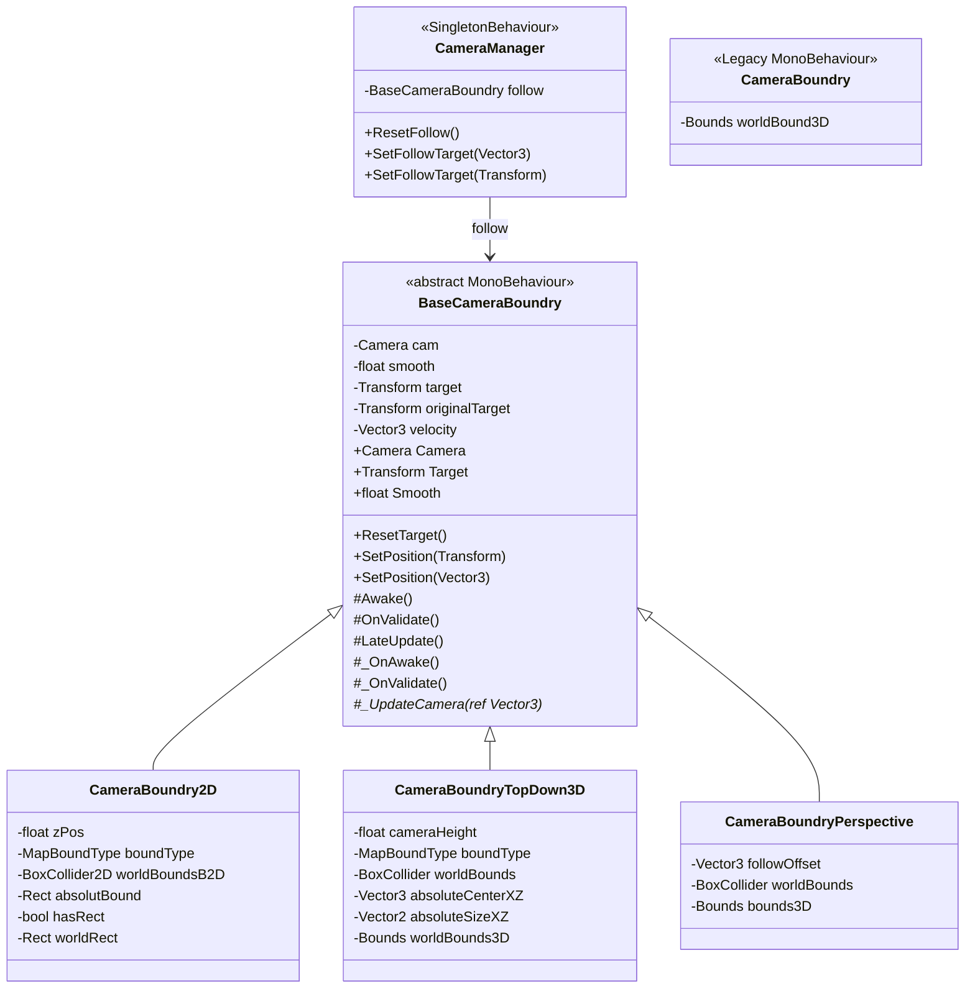
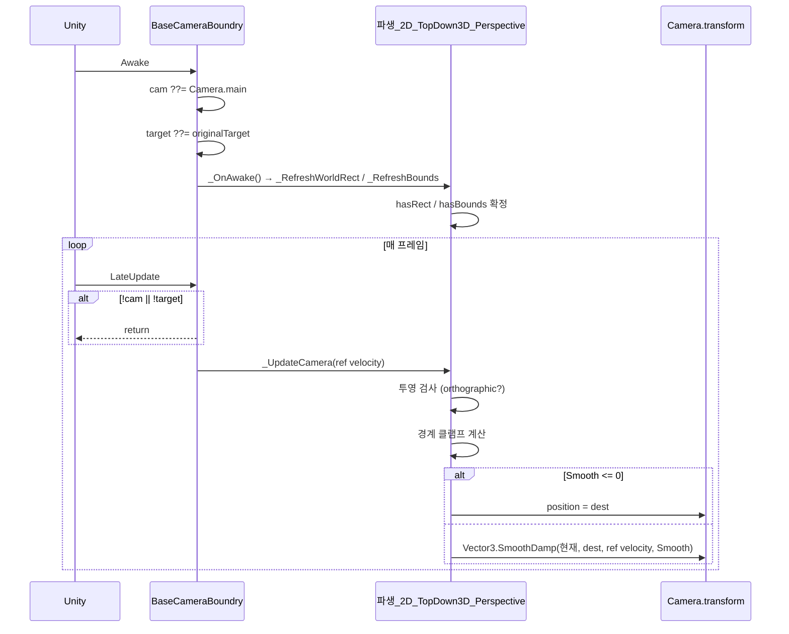
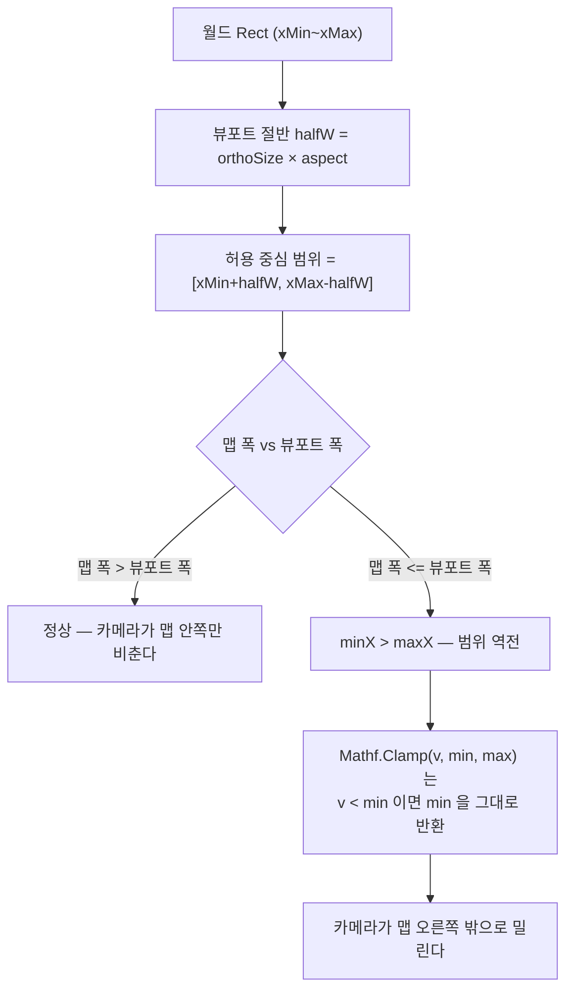
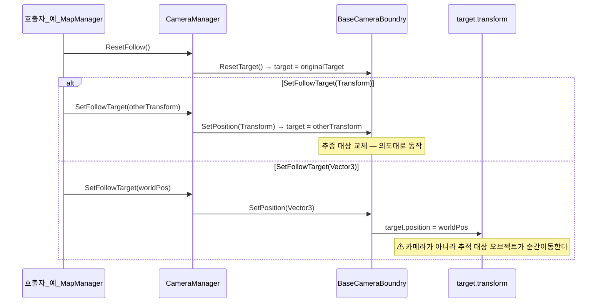
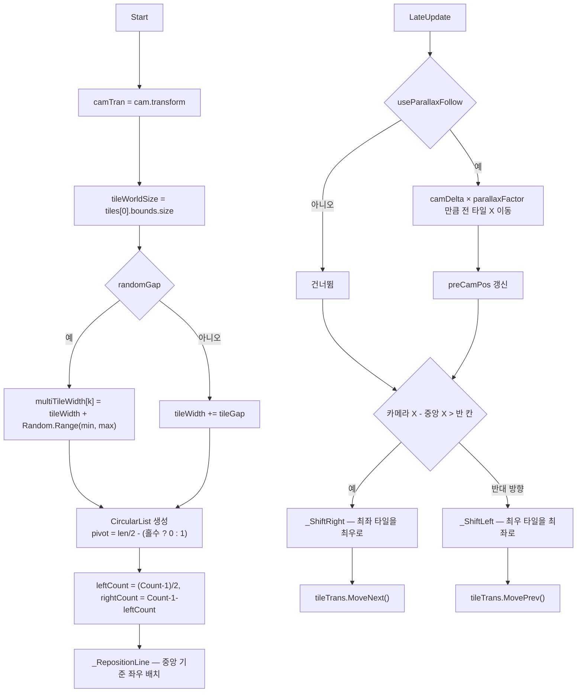

# Camera — 경계 클램프 추종과 패럴랙스

> 어셈블리: `HCUP.HGame` · 네임스페이스: `HGame.Cam`, `HGame.H2D.Cam`, `HGame.H3D.Cam`, `HGame.H2D.Layer`
> 파일: `Runtime/HGame/Camera/` 3개 + `H2D/Camera/` 1개 + `H3D/Camera/` 2개 + `H2D/Layer/` 1개 · 상위: [`../Runtime/README.md`](../Runtime/README.md)

2D 와 3D 파생을 한 문서로 묶는 이유: 셋 다 `BaseCameraBoundry` 하나를 상속하고 `_UpdateCamera`
한 메서드만 다르게 구현한다 — 나눠 쓰면 같은 골격을 세 번 설명하게 된다. `ParallexLayer` 도
여기 둔다. 파일 1개짜리 독립 문서를 만들 만큼 크지 않고, **카메라 이동 델타를 소비하는
유일한 다른 컴포넌트**라 성격이 가장 가깝다.

---

## 요약

카메라 시스템은 **"추적 대상 위치를 경계 안으로 클램프한 뒤 `SmoothDamp` 로 따라간다"**
한 문장으로 요약된다. 파생 클래스가 바꾸는 것은 세 가지뿐이다.

| 파생 | 투영 | 클램프 축 | 특이사항 |
|---|---|---|---|
| `CameraBoundry2D` | 직교 전용 (`:43`) | X, Y — 뷰포트 인셋 | z 를 `zPos` 로 고정 |
| `CameraBoundryTopDown3D` | 직교 전용 (`:54`) | X, Z — 뷰포트 인셋 | y 를 `cameraHeight` 로 고정 |
| `CameraBoundryPerspective` | 원근 전용 (`:42`) | X, Y, Z — 인셋 없음 | 오프셋 추종 + `LookAt` |

**투영 방식이 맞지 않으면 조용히 아무 일도 하지 않는다.** 세 파생 모두 첫 줄에서
`Camera.orthographic` 을 검사하고 반환한다.

---

## 파일 지도

| 경로 | 역할 | 행 |
|---|---|---|
| `Camera/BaseCameraBoundry.cs` | 추종 대상·스무딩·Unity 수명주기 골격 (abstract) | 68 |
| `Camera/CameraManager.cs` | 추종 컴포넌트 1개를 감싸는 싱글톤 파사드 | 17 |
| `Camera/CameraBoundry.cs` | **Legacy.** `BaseCameraBoundry` 미상속 독립 3D 클램프 | 105 |
| `H2D/Camera/CameraBoundry2D.cs` | 직교 2D — 뷰포트 인셋 클램프 | 122 |
| `H3D/Camera/CameraBoundryTopDown3D.cs` | 직교 XZ 탑다운 — 뷰포트 인셋 클램프 | 139 |
| `H3D/Camera/CameraBoundryPerspective.cs` | 원근 TPS — 오프셋 추종 + LookAt | 98 |
| `H2D/Layer/ParallexLayer.cs` | 카메라 델타 기반 배경 스크롤 + 타일 순환 | 156 |

---

## 계층 구조



`CameraBoundry`(legacy) 는 이 계층 밖에 홀로 있다 — 파일 상단에 `// Legacy Script` 주석이
붙어 있고 (`CameraBoundry.cs:5`), `BaseCameraBoundry` 를 상속하지 않아
`CameraManager.follow` 에 넣을 수 없다.

---

## 데이터 모델 — 경계 소스

경계는 [`Map`](Map.md) 의 `MapBoundType` 열거형으로 선택한다.

```csharp
// Map/MapBoundType.cs:2-6
public enum MapBoundType { WorldBox, BoundSource, Absolute }
```

| 파생 | WorldBox | BoundSource | Absolute |
|---|---|---|---|
| `CameraBoundry2D` | `BoxCollider2D.bounds` (`:74-79`) | **미지원 — `hasRect = false`** (`:88-90`) | `absolutBound` Rect (`:81-86`) |
| `CameraBoundryTopDown3D` | `BoxCollider.bounds` (`:84-88`) | **미지원 — `hasBounds = false`** (`:97-99`) | center/size 조합 (`:89-96`) |
| `CameraBoundryPerspective` | `BoxCollider` 고정 — `boundType` 필드 자체가 없다 (`:16, 72-78`) | — | — |
| `CameraBoundry`(legacy) | `BoxCollider.bounds` (`:68-72`) | 미지원 | **미지원 — `hasRect = false`** (`:73-75`) |

**`MapBoundType.BoundSource` 를 지원하는 카메라는 하나도 없다.** 그 모드는
[`MapManager`](Map.md) 전용이다.

`CameraBoundry`(legacy) 는 `Absolute` 모드를 선언만 하고 `hasRect = false` 로 처리한다
(`CameraBoundry.cs:73-75`) — `absolutBound` 필드는 기즈모 그리기에만 쓰인다 (`:92-97`).

---

## 흐름 1 — 프레임당 갱신



`velocity` 는 베이스가 소유하고 `ref` 로 파생에 전달한다 (`BaseCameraBoundry.cs:21, 58, 65`).
`SmoothDamp` 가 프레임 간 상태를 유지해야 하기 때문이다.

`LateUpdate` 는 `hasRect` / `hasBounds` 를 검사하지 않는다 (`BaseCameraBoundry.cs:56-59`) —
경계 유효성은 파생의 `_UpdateCamera` 첫 줄이 각각 확인한다 (`CameraBoundry2D.cs:42`,
`CameraBoundryTopDown3D.cs:53`, `CameraBoundryPerspective.cs:41`).

---

## 흐름 2 — 뷰포트 인셋 클램프

직교 파생 두 개가 공유하는 계산이다. 여기가 이 시스템에서 가장 실수하기 쉬운 부분이다.

```csharp
// H2D/Camera/CameraBoundry2D.cs:45-55
float halfH = Camera.orthographicSize;
float halfW = halfH * Camera.aspect;

float minX = worldRect.xMin + halfW;
float maxX = worldRect.xMax - halfW;
float minY = worldRect.yMin + halfH;
float maxY = worldRect.yMax - halfH;

Vector3 desired = Target.position;
float newX = Mathf.Clamp(desired.x, minX, maxX);
float newY = Mathf.Clamp(desired.y, minY, maxY);
```



**Unity 의 `Mathf.Clamp` 는 `min > max` 를 검사하지 않는다.** 구현은
`if (value < min) value = min; else if (value > max) value = max;` 이므로, 범위가 역전된
상태에서는 대상 위치와 무관하게 `minX`(= `xMin + halfW`) 가 반환된다. 화면이 맵보다 넓으면
카메라 중심이 맵 우측 경계 밖으로 고정된다.

같은 계산이 `CameraBoundryTopDown3D.cs:56-66` (X/Z 축) 과 [`MapManager`](Map.md)
`_MoveCameraToWorld`(`MapManager.cs:231-235`) 에도 그대로 복제되어 있다.

### Perspective 파생의 다른 방식

```csharp
// H3D/Camera/CameraBoundryPerspective.cs:44-55
Vector3 desired = Target.position + Target.rotation * followOffset;
Vector3 clamped = _ClampPosition(desired);       // min/max 인셋 없이 Bounds 그대로
...
Camera.transform.LookAt(Target.position);
```

인셋을 빼지 않으므로 범위 역전이 없다. 대신 카메라가 경계면에 딱 붙을 수 있고,
`LookAt` 이 `SmoothDamp` 이후 매 프레임 강제 적용되어 회전에는 스무딩이 걸리지 않는다.

---

## 흐름 3 — 추종 대상 전환



```csharp
// Camera/BaseCameraBoundry.cs:35-41
public void ResetTarget() => target = originalTarget;
public void SetPosition(Transform target) => this.target = target;
public virtual void SetPosition(Vector3 position) {
    if (!target) target = originalTarget;
    if (!target) return;
    target.position = position;     // ← 카메라가 아니다
}
```

**`SetPosition(Vector3)` 은 카메라 좌표를 지정하는 API 가 아니다.** 추적 대상 Transform 을
옮기고, 카메라는 다음 `LateUpdate` 에서 그것을 따라간다. `originalTarget` 이 플레이어라면
**플레이어가 텔레포트한다.** [`MapManager`](Map.md) 의 미니맵 클릭이 정확히 이 함정을 밟는다
(`MapManager.cs:241`).

---

## ParallexLayer — 배경 스크롤

카메라 이동 델타에 계수를 곱해 타일을 밀고, 카메라가 중앙 타일에서 반 칸 이상 벗어나면
타일 링을 회전시킨다. 링 자료구조는 `HCollection.CircularList<Transform>` 이다.



```csharp
// H2D/Layer/ParallexLayer.cs:126-138
private void _ShiftRight() {
    var left  = tileTrans.PeekOffset(-leftCount);
    var right = tileTrans.PeekOffset(rightCount);
    left.position = right.position + Vector3.right * _GetTileWith;
    tileTrans.MoveNext();
}
```

파일 하단의 Dev Log 가 짝수/홀수 타일 수의 중앙 결정 규칙을 명시한다 —
2개면 1번째, 4개면 2번째, 5개면 3번째가 센터다 (`ParallexLayer.cs:146-151`).

```csharp
// H2D/Layer/ParallexLayer.cs:78-80 — 빌드에서는 참조 배열을 놓아준다
#if !UNITY_EDITOR
        tiles = null;
#endif
```

---

## 사용 예

```csharp
// 1) 씬 배선 — 카메라 GameObject 에 파생 하나를 붙인다
//    cam(비우면 Camera.main), smooth(0=즉시), target / originalTarget, boundType + 경계 참조

// 2) 코드에서 추종 대상 전환
CameraManager.Instance.SetFollowTarget(bossTransform);   // 보스 연출
CameraManager.Instance.ResetFollow();                    // 플레이어로 복귀

// 3) 주의 — 이 호출은 카메라가 아니라 현재 추적 대상을 옮긴다
CameraManager.Instance.SetFollowTarget(new Vector3(10f, 0f, -10f));

// 4) 카메라를 특정 좌표로만 보내고 싶다면 더미 Transform 을 추적 대상으로 쓴다
CameraManager.Instance.SetFollowTarget(cameraAnchor);    // 더미로 교체
cameraAnchor.position = new Vector3(10f, 0f, 0f);        // 더미를 이동
```

---

## 주의할 점

### 계약

1. **투영 방식이 맞지 않으면 무동작이다.** `CameraBoundry2D.cs:43` 과
   `CameraBoundryTopDown3D.cs:54` 는 `!Camera.orthographic` 일 때,
   `CameraBoundryPerspective.cs:42` 는 `Camera.orthographic` 일 때 즉시 반환한다.
   로그가 없어 "카메라가 안 움직인다" 로만 나타난다.
2. **경계는 `Awake` / `OnValidate` 에서만 갱신된다** (`BaseCameraBoundry.cs:45-54`).
   런타임에 `BoxCollider` 를 옮기거나 크기를 바꿔도 반영되지 않는다. 갱신 API 는 없고
   `_RefreshWorldRect` / `_RefreshBounds` 는 전부 `private` 이다.
3. **`Awake` 는 `cam` 이 비어 있으면 `Camera.main` 을 잡는다** (`BaseCameraBoundry.cs:46`).
   `MainCamera` 태그가 없으면 `null` 이 되고 `LateUpdate` 가 매 프레임 조기 반환한다.
4. **`SetPosition(Vector3)` 은 추적 대상을 옮긴다** (`BaseCameraBoundry.cs:37-41`).
   위 [흐름 3](#흐름-3--추종-대상-전환) 참조.
5. **`Smooth <= 0` 이면 스무딩 없이 즉시 이동한다** (세 파생 모두). `Smooth` 세터는
   음수를 0 으로 클램프한다 (`BaseCameraBoundry.cs:29-31`) — 다만 인스펙터 필드는
   `[Range(0f, 1f)]` 라 세터를 거치지 않는다 (`:11-13`).
6. **`ParallexLayer` 는 `cam` 을 인스펙터 필수 배선으로 요구한다** (`ParallexLayer.cs:53`).
   `Camera.main` 폴백이 없어 비어 있으면 `Start` 에서 `NullReferenceException` 이다.

### 정리 대상

7. **맵이 뷰포트보다 작으면 클램프 범위가 역전된다** — `CameraBoundry2D.cs:48-51` 및
   `CameraBoundryTopDown3D.cs:59-62`. 맵 폭 ≤ 뷰포트 폭이면 `minX > maxX` 가 되고,
   `Mathf.Clamp` 가 범위 역전을 검사하지 않으므로 카메라 중심이 `xMin + halfW` 에 고정된다.
   결과적으로 카메라가 맵 밖을 비춘다. 축소 화면·와이드 모니터·작은 실내 맵에서 재현된다.
   `if (minX > maxX) minX = maxX = worldRect.center.x;` 같은 축별 폴백이 필요하다.
   같은 결함이 [`MapManager`](Map.md) `_MoveCameraToWorld`(`MapManager.cs:234-235`) 에도 있다.

8. **`CameraBoundry`(legacy) 는 `zPos` 를 선언만 하고 쓰지 않는다**
   (`CameraBoundry.cs:16` vs `:50-53`). `worldBound3D.ClosestPoint` 결과의 z 를 그대로 쓰므로
   카메라가 3D 박스 안으로 끌려 들어간다. `Absolute` 모드도 `hasRect = false` 로 죽어 있다
   (`:73-75`) — `BoundSource` 를 포함한 3개 모드 중 `WorldBox` 하나만 동작한다.
9. **`CameraBoundry`(legacy) 의 `OnDrawGizmosSelected` 가 `hasRect` 를 변경한다**
   (`CameraBoundry.cs:99`). 에디터 기즈모 그리기가 런타임 상태를 건드린다.
10. **`CameraBoundry`(legacy) 의 `SetPosition(Vector3)` 은 null 검사가 없다**
    (`CameraBoundry.cs:59-62`). `target` 과 `originalTarget` 이 모두 비면
    `NullReferenceException` 이다. 베이스 쪽(`BaseCameraBoundry.cs:39`)에는 가드가 있다.
11. **`CameraBoundry2D.zPos` 는 카메라 z 를 강제한다** (`:57`). 직교 2D 에서는 무해하지만
    URP 2D Renderer 의 Pixel Perfect Camera 와 함께 쓸 때 z 를 다른 값으로 잡아둔 세팅과
    충돌할 수 있다.
12. **`CameraBoundryTopDown3D` 의 `Absolute` 모드는 `cameraHeight` 를 경계 계산에 섞는다**
    (`:92-93`). 카메라 높이를 바꾸면 XZ 클램프 범위와 무관한 Y 크기가 함께 변한다 —
    기즈모(`:120-124`)도 같은 값을 쓴다.
13. **`CameraBoundryPerspective` 는 `using HGame.Map;` 을 걸지만 `MapBoundType` 을 쓰지 않는다**
    (`:4`). `boundType` 필드 없이 `BoxCollider` 직결이다 (`:16`).
14. **`ParallexLayer.Start` 에 `tiles` 유효성 검사가 없다** (`:58`). 배열이 비어 있거나
    `tiles[0]` 이 null 이면 `IndexOutOfRangeException` / `NullReferenceException` 이다.
    `[HRequired]` 도 붙어 있지 않다 (`:37-38`).
15. **`randomGap` 모드에서 타일 폭이 피벗에 따라 달라진다**
    (`_GetTileWith`, `ParallexLayer.cs:48`). `_RepositionLine`(`:115, 120`) 과
    `_ShiftRight`/`_ShiftLeft`(`:129, 136`) 가 **현재 피벗의 폭**으로 좌우 거리를 계산하므로,
    피벗이 회전하면 이미 배치된 타일과 새 계산이 어긋나 간격이 벌어지거나 겹칠 수 있다.
16. **`_GetTileWith` 는 오타다** — `Width` 여야 한다 (`ParallexLayer.cs:48`).
17. **`CameraManager` 에 null 가드가 없다** (`:13-15`). `follow` 미배선 시 세 메서드 모두
    `NullReferenceException` 이며, `[HRequired]` 도 없다 (`:7-8`).
18. **`CameraManager` 의 "Camera Effect" 섹션이 비어 있다** (`:10-11`). `[HTitle]` 만 있고
    필드가 없어 인스펙터에 헤더만 뜬다.

---

## 확장 지점

| 하고 싶은 것 | 손댈 곳 |
|---|---|
| 새 투영/추종 방식 | `BaseCameraBoundry` 상속 → `_UpdateCamera(ref Vector3)` 구현 + `_OnAwake` 에서 경계 캐시 |
| 런타임 경계 갱신 | 각 파생의 `_RefreshWorldRect` / `_RefreshBounds` 를 `public` 으로 승격 |
| 경계 소스 통합 | `IWorldBoundSource` ([`Map`](Map.md)) 를 카메라 파생에서도 소비하도록 `boundType` 에 `BoundSource` 분기 추가 |
| 카메라 흔들림·줌 등 이펙트 | `CameraManager` 의 "Camera Effect" 섹션 (`:10-11`) — 예약된 자리 |
| 패럴랙스 레이어 추가 | `ParallexLayer` 를 배경 오브젝트마다 붙이고 `parallaxFactor` 를 깊이별로 다르게 |
| 세로 패럴랙스 | `ParallexLayer` 는 X 축 전용 (`:92, 115, 120, 129, 136`) — Y 축 분기 추가 필요 |
