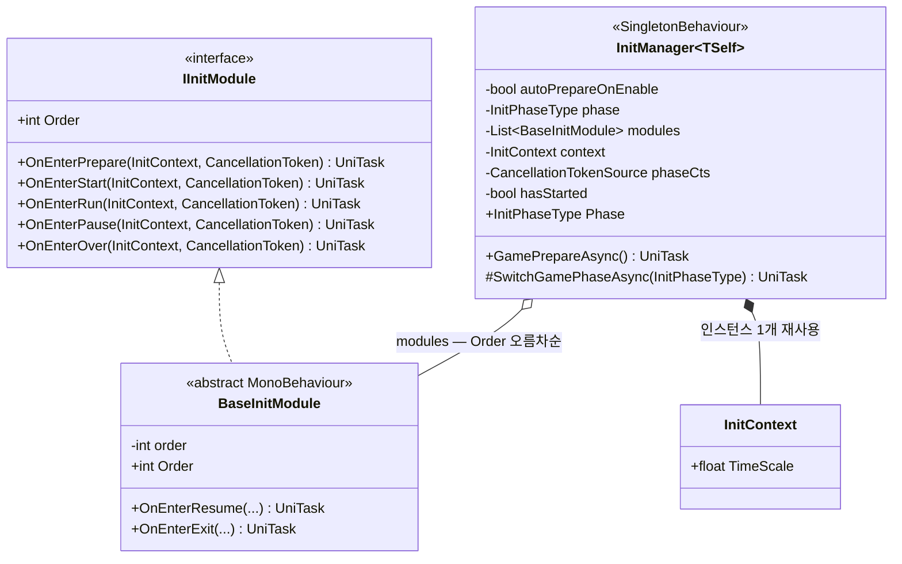
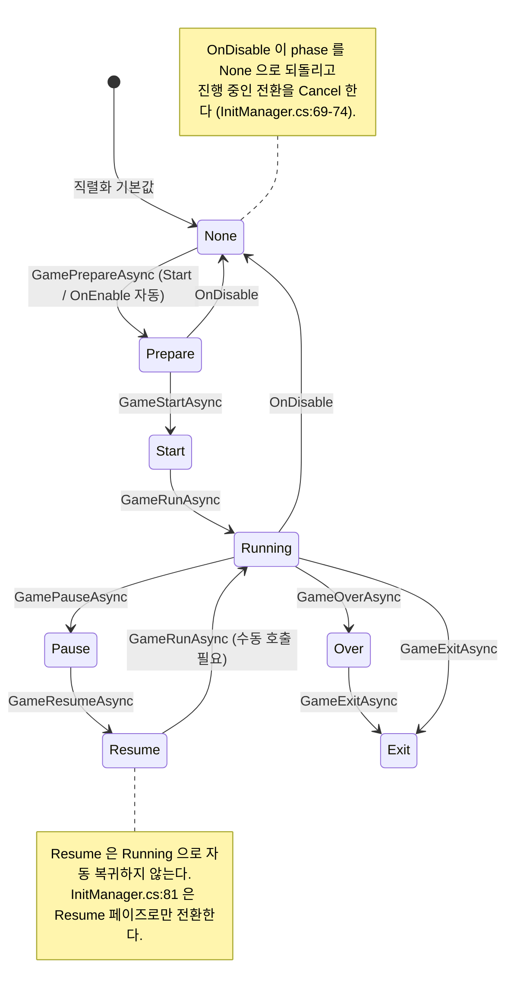
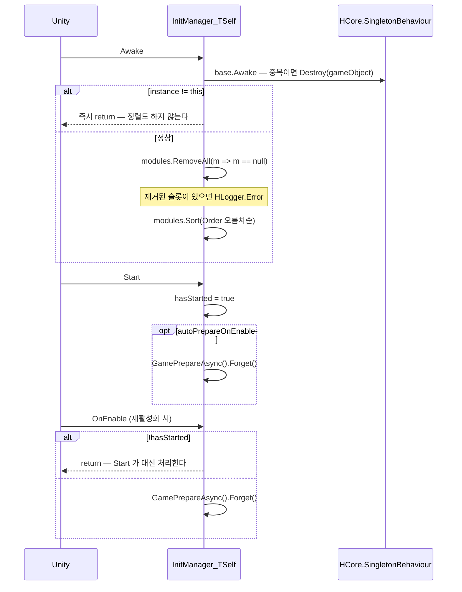
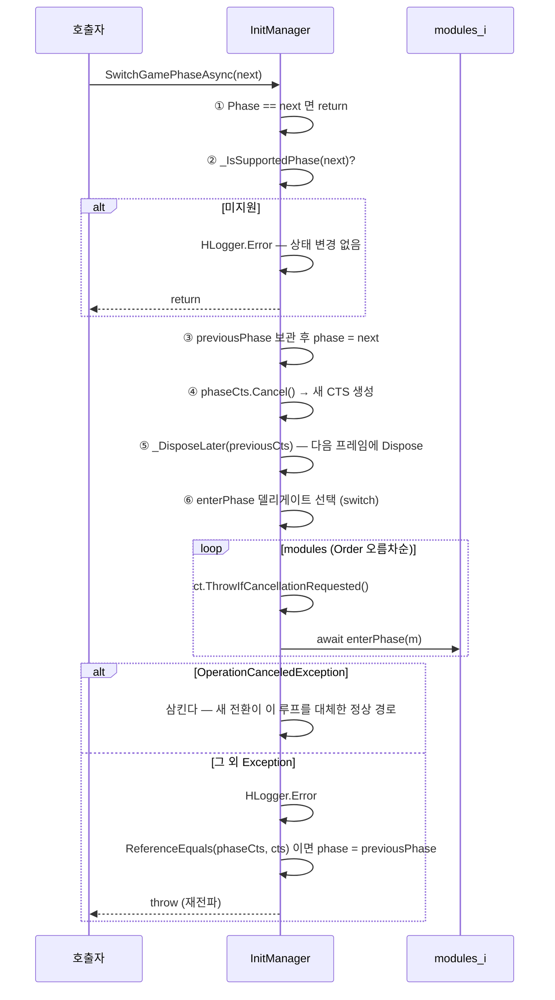
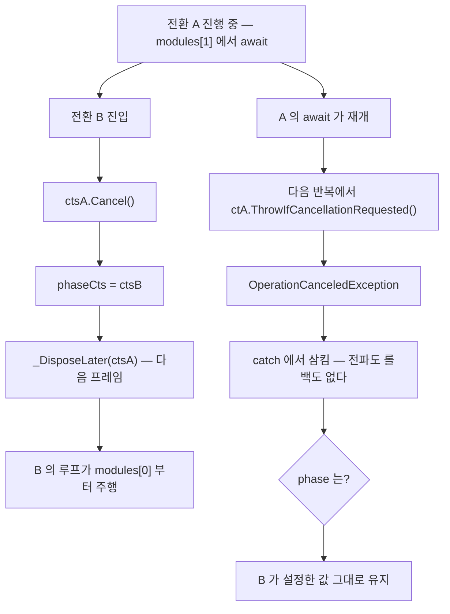

# InitModule — 게임 페이즈 상태머신

> 어셈블리: `HCUP.HGame` · 네임스페이스: `HGame.Flow` (단, `IInitModule` / `InitPhaseType` 은 전역)
> 파일: `Runtime/HGame/InitModule/` 5개 · 상위: [`../Runtime/README.md`](../Runtime/README.md)

---

## 요약

InitModule 은 **하나의 `InitManager` 가 자식 `BaseInitModule` 들을 정해진 순서로 순회하며
페이즈 훅을 await 하는 구조**다. 상태는 `InitPhaseType` 하나뿐이고, 전환은
`SwitchGamePhaseAsync` 한 메서드를 통과한다.

핵심 규약 세 가지.

1. **전환은 취소 가능하고, 새 전환이 옛 전환을 무효화한다.** 페이즈마다 `CancellationTokenSource`
   를 새로 만들고 직전 것을 `Cancel` 한다 (`InitManager.cs:99-103`).
2. **검증은 상태 변경보다 앞선다.** 지원하지 않는 페이즈를 넘기면 상태가 그대로 유지된 채
   에러 로그만 남는다 (`InitManager.cs:91-94`).
3. **비취소 예외는 페이즈를 롤백한 뒤 상위로 전파한다** (`InitManager.cs:130-136`).
   전환에 실패했는데 `Phase` 만 성공을 주장하는 상태를 만들지 않는다.

이 셋은 모두 과거 결함에 대한 대응이며, 그 이유가 코드 주석으로 남아 있다.

---

## 파일 지도

| 경로 | 역할 | 행 |
|---|---|---|
| `InitManager.cs` | 상태머신 싱글톤 베이스 `InitManager<TSelf>` | 178 |
| `BaseInitModule.cs` | 페이즈 훅 7종 virtual 구현 `MonoBehaviour` | 55 |
| `IInitModule.cs` | 훅 계약 5종 (**전역 네임스페이스**) | 40 |
| `InitContext.cs` | 훅 공유 컨텍스트 — `TimeScale` 1개 | 29 |
| `InitPhaseType.cs` | 페이즈 열거형 8종 (**전역 네임스페이스**) | 34 |

---

## 계층 구조



**리스트의 원소 타입이 `IInitModule` 이 아니라 `BaseInitModule` 이다** (`InitManager.cs:34`).
그래서 계약에 없는 `OnEnterResume` / `OnEnterExit` 도 호출할 수 있고, 반대로 인터페이스만
구현한 타입은 매니저에 등록할 수 없다.

---

## 데이터 모델

```csharp
// InitPhaseType.cs:9-18 — 전역 네임스페이스
public enum InitPhaseType {
    None, Prepare, Start, Running, Pause, Resume, Over, Exit
}
```

```csharp
// InitContext.cs:10-12 — 훅 전체가 공유하는 단 하나의 인스턴스
public sealed class InitContext {
    public float TimeScale = 1f;
}
```

`InitContext` 는 매니저 필드로 한 번 생성되고 (`InitManager.cs:36`) 이후 교체되지 않는다.
**페이즈가 바뀌어도 초기화되지 않으므로**, 훅에서 쓴 값은 다음 페이즈에도 그대로 보인다.

---

## 페이즈 전이



전이 순서를 강제하는 코드는 없다. `SwitchGamePhaseAsync` 는 **동일 페이즈 재진입만 차단**하고
(`InitManager.cs:87`), 나머지 조합은 전부 허용한다. 위 다이어그램은 API 이름이 의도한
표준 경로이지 기계적 제약이 아니다.

---

## 흐름 1 — 기동



`Awake` 의 null 슬롯 제거가 정렬보다 먼저인 이유가 코드에 명시되어 있다 — 비교자
`(a, b) => a.Order.CompareTo(b.Order)` 는 `a` 가 null 이면 `NullReferenceException` 을 던지고,
`Awake` 가 중단되면 **싱글톤 참조는 살아 있는데 정렬은 안 된 반쯤 초기화된 매니저**가 남는다
(`InitManager.cs:47-52`).

`hasStarted` 가드는 `OnEnable` 이 `Start` 보다 먼저 도는 Unity 수명주기 때문이다. 필드명은
"OnEnable 마다"를 약속하는데 실제 소비 지점이 `Start` 뿐이었고, `OnDisable` 이 phase 를
`None` 으로 되돌려 **비활성→재활성 후 매니저가 `None` 에 갇혔던** 것이 배경이다
(`InitManager.cs:56-57`).

---

## 흐름 2 — 페이즈 전환

이 시스템의 전부다. 순서 자체가 계약이다.



```csharp
// InitManager.cs:99-106 — CTS 교체와 지연 Dispose
phaseCts?.Cancel();
var previousCts = phaseCts;
phaseCts = new CancellationTokenSource();
var cts = phaseCts;
var ct = cts.Token;
// 관측 중인 토큰의 소스를 즉시 Dispose 하면 이후 등록에서 ObjectDisposedException 이 난다.
// Cancel 신호만 먼저 보내고 실제 해제는 한 프레임 뒤로 미룬다.
_DisposeLater(previousCts);
```

```csharp
// InitManager.cs:150-158
private static void _DisposeLater(CancellationTokenSource target) {
    if (target == null) return;
    _DisposeNextFrameAsync(target).Forget();
}
private static async UniTaskVoid _DisposeNextFrameAsync(CancellationTokenSource target) {
    await UniTask.NextFrame();
    target.Dispose();
}
```

---

## 흐름 3 — 취소 경쟁

새 전환이 진행 중인 전환을 어떻게 밀어내는지가 이 시스템에서 가장 미묘한 부분이다.



**모듈 사이마다 취소를 검사하는 것이 핵심이다** (`InitManager.cs:123`). 이 검사가 없으면
A 의 루프가 B 의 취소를 무시하고 끝까지 주행해 두 상태머신이 동시에 도는 상황이 된다
(`InitManager.cs:121-122`).

`await enterPhase(m)` 자체가 `ct` 를 존중하는지는 **모듈 구현에 달려 있다.** 훅이 `ct` 를
무시하고 긴 `UniTask.Delay` 를 걸면 (샘플 `DemoPhaseModule.cs:49` 가 그렇다) 그 훅 하나는
끝까지 실행되고, 취소는 그 다음 모듈 경계에서야 반영된다.

### 롤백 조건

```csharp
// InitManager.cs:130-136
catch (System.Exception e) {
    // 종전에는 비취소 예외가 catch 를 통과해 탈출하면서도 phase 는 새 페이즈를
    // 주장했다 — Phase 를 읽는 모든 코드가 전환 성공으로 오판했다.
    HLogger.Error($"[InitManager] Phase transition to '{phase}' failed: {e}");
    if (ReferenceEquals(phaseCts, cts)) this.phase = previousPhase;
    throw;
}
```

`ReferenceEquals(phaseCts, cts)` 가드가 있어야 하는 이유: 실패한 전환이 **이미 다른 전환에
밀려난 뒤였다면** 롤백이 최신 페이즈를 덮어써 버린다. 자기가 여전히 현재 전환일 때만 되돌린다.

---

## 사용 예

```csharp
// 1) 매니저 — CRTP 로 자기 타입을 넘긴다
public sealed class MyGameManager : InitManager<MyGameManager> { }

// 2) 모듈 — 필요한 훅만 override, order 로 실행 순서 지정
public sealed class SaveLoadModule : BaseInitModule {
    public override async UniTask OnEnterPrepare(InitContext ctx, CancellationToken ct) {
        await SaveSystem.LoadAsync(ct);      // ct 를 전달해야 취소가 즉시 먹는다
    }
    public override UniTask OnEnterOver(InitContext ctx, CancellationToken ct) {
        SaveSystem.Flush();
        return UniTask.CompletedTask;
    }
}

// 3) 진행 — 예외를 관측하려면 await, 아니면 Forget
try { await MyGameManager.Instance.GameStartAsync(); }
catch (Exception) { /* Phase 는 이미 이전 값으로 롤백되어 있다 */ }
```

인스펙터에서 `modules` 리스트에 `SaveLoadModule` 을 넣고 `order` 를 지정한다. 툴팁이 밝히듯
모듈은 같은 GameObject 이거나 자식이어야 배선이 자연스럽다 (`InitManager.cs:33`) — 다만
**코드가 부모/자식 관계를 검사하지는 않는다.** 리스트에 있으면 어디 있든 호출된다.

---

## 주의할 점

### 계약

1. **동일 페이즈 재진입은 무시된다** (`InitManager.cs:87`). `GamePauseAsync()` 를 두 번 부르면
   두 번째는 아무 일도 하지 않고 즉시 완료된다.
2. **`Resume` 은 `Running` 으로 자동 복귀하지 않는다** (`InitManager.cs:81`). 재개 후
   `GameRunAsync()` 를 별도로 호출해야 한다. 그러지 않으면 `Phase` 가 `Resume` 에 머문다.
3. **`OnEnterResume` / `OnEnterExit` 은 `IInitModule` 계약에 없다** (`IInitModule.cs:16-23`).
   `BaseInitModule` 전용 확장 훅이며 (`BaseInitModule.cs:33, 35`), `InitManager` 는
   `List<BaseInitModule>` 를 들고 있어 호출이 가능하다 (`InitManager.cs:34, 113, 115`).
4. **취소는 모듈 경계에서만 즉시 반영된다** (`InitManager.cs:123`). 훅 안에서 `ct` 를 쓰지
   않으면 해당 훅은 끝까지 실행된다.
5. **훅에서 던진 비취소 예외는 나머지 모듈의 진입을 막고 상위로 전파된다**
   (`InitManager.cs:135`). `GamePrepareAsync().Forget()` 경로(`InitManager.cs:60, 66`)에서는
   UniTask 의 기본 예외 핸들러가 로그를 남기며, 이것이 `Forget` 을 쓰는 이유다
   (`InitManager.cs:65`).
6. **`InitContext` 는 전환마다 초기화되지 않는다** (`InitManager.cs:36`). 페이즈를 넘나들며
   상태가 누적된다는 뜻이다.
7. **중복 인스턴스는 정렬조차 하지 않고 반환한다** (`InitManager.cs:46`). base 가 이미
   `Destroy(gameObject)` 를 예약한 상태이므로 의도된 조기 반환이다.

### 정리 대상

8. **`OnDisable` 은 `phaseCts` 를 즉시 `Dispose` 한다** (`InitManager.cs:70-72`).
   전환 경로가 지연 Dispose 를 쓰는 이유(`InitManager.cs:104-105`)와 비대칭이다. `Cancel` 이
   먼저 호출되므로 루프는 `ThrowIfCancellationRequested` 에서 빠져나오고, in-flight 훅이
   그 토큰에 새 콜백을 등록하려 하면 `ObjectDisposedException` 이 날 수 있다.
9. **`enterPhase` 의 `_ => null` 분기는 도달 불가능하다** (`InitManager.cs:116`).
   `_IsSupportedPhase` 가 앞에서 `None` 을 걸러내므로 (`InitManager.cs:91-94, 139-148`)
   `enterPhase` 가 null 이 되는 경로는 없다. 두 switch 가 같은 목록을 중복 관리하고 있어,
   페이즈를 추가할 때 한쪽만 고치면 조용히 어긋난다.
10. **`IInitModule` 과 `InitPhaseType` 만 전역 네임스페이스에 있다**
    (`IInitModule.cs:16`, `InitPhaseType.cs:9`). 같은 폴더의 나머지 3개는 `HGame.Flow` 안이다.
    `IInitModule.cs:14` 는 `InitContext` 를 참조하려고 `using HGame.Flow;` 를 걸고 있다.
11. **`BaseInitModule` 에 `[Serializable]` 이 붙어 있다** (`BaseInitModule.cs:22`).
    `MonoBehaviour` 파생에는 효과가 없다.
12. **`IInitModule` 을 타입으로 소비하는 코드가 어셈블리 안에 없다.** `BaseInitModule` 이
    유일한 구현체이고 매니저도 구현 타입으로 리스트를 든다 — 인터페이스가 다형성 지점으로
    기능하지 않는다.

---

## 확장 지점

| 하고 싶은 것 | 손댈 곳 |
|---|---|
| 새 페이즈 추가 | `InitPhaseType` + `BaseInitModule` 훅 + `InitManager._IsSupportedPhase` + `enterPhase` switch — **네 곳 전부** |
| 훅에 데이터 전달 | `InitContext` 필드 추가 (현재 `TimeScale` 하나) |
| 모듈 실행 순서 | `BaseInitModule.order` (인스펙터, 오름차순) |
| 자동 Prepare 끄기 | `autoPrepareOnEnable = false` 후 수동 `GamePrepareAsync()` |
| 페이즈 전환 후처리 | `InitManager<TSelf>` 를 상속한 뒤 `GameXxxAsync` 를 `override` — 전부 `virtual` (`InitManager.cs:77-83`) |
| 모듈 병렬 실행 | `SwitchGamePhaseAsync` 의 `foreach` 를 `UniTask.WhenAll` 로 교체 (`InitManager.cs:120-125`) — Order 보장은 포기 |
