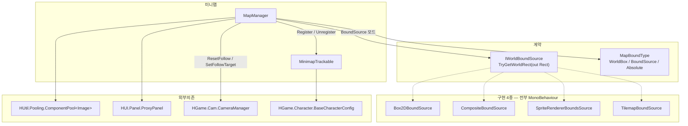
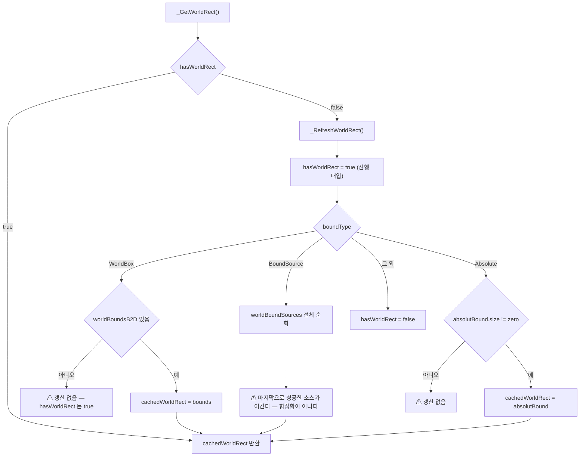
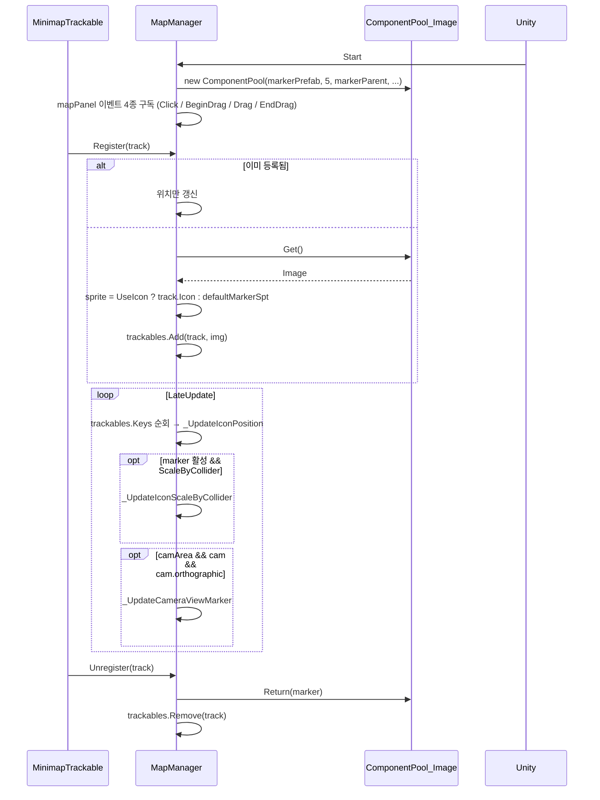
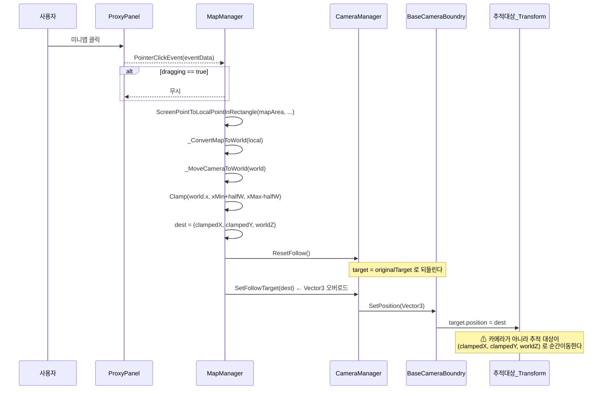
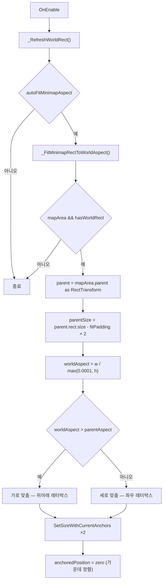

# Map — 월드 경계와 미니맵

> 어셈블리: `HCUP.HGame` · 네임스페이스: `HGame.Map`, `HGame.H2D.Map`
> 파일: `Runtime/HGame/Map/` 2개 + `Runtime/HGame/H2D/Map/` 6개 · 상위: [`../Runtime/README.md`](../Runtime/README.md)

---

## 요약

Map 은 두 개의 작은 관심사를 담는다.

1. **월드 경계 추상화** — `IWorldBoundSource.TryGetWorldRect(out Rect)` 하나의 계약과
   구현 4종 (`BoxCollider2D` / `CompositeCollider2D` / `SpriteRenderer` / `Tilemap`).
   각 구현은 해당 컴포넌트의 `bounds` 를 `Rect` 로 옮기는 것이 전부다.
2. **미니맵** (`MapManager`) — 마커 풀링, 아이콘 위치/크기 갱신, 카메라 뷰포트 사각형 표시,
   클릭·드래그 내비게이션, 월드 종횡비에 맞춘 미니맵 Rect 자동 피팅.

`MapManager` 는 이 어셈블리에서 **다른 시스템을 호출하는 유일한 컴포넌트**다 —
[`CameraManager`](Camera.md) 에 이동을 요청한다 (`MapManager.cs:240-241`).

---

## 파일 지도

| 경로 | 타입명 | 역할 | 행 |
|---|---|---|---|
| `Map/IWorldBoundSource.cs` | `IWorldBoundSource` | `TryGetWorldRect(out Rect)` 단일 계약 | 7 |
| `Map/MapBoundType.cs` | `MapBoundType` | WorldBox / BoundSource / Absolute | 7 |
| `H2D/Map/Box2DBoundSource.cs` | `Box2DBoundSource` | `BoxCollider2D.bounds` → Rect | 22 |
| `H2D/Map/CompositeBoundSource.cs` | `CompositeBoundSource` | `CompositeCollider2D.bounds` → Rect (size > 0 검사) | 22 |
| `H2D/Map/SpriteRendererBoundSource.cs` | **`SpriteRendererBoundsSource`** | `SpriteRenderer.bounds` → Rect | 22 |
| `H2D/Map/TilemapBoundSource.cs` | `TilemapBoundSource` | `cellBounds` → 월드 Rect (size > 0 검사) | 26 |
| `H2D/Map/MinimapTracker.cs` | **`MinimapTrackable`** | 추적 대상 마커 설정 컴포넌트 | 49 |
| `H2D/Map/MapManager.cs` | `MapManager` | 미니맵 본체 (`SingletonBehaviour`) | 350 |

**굵게 표시한 두 파일은 파일명과 타입명이 다르다.**

---

## 계층 구조



---

## 데이터 모델

### 경계 소스 계약

```csharp
// Map/IWorldBoundSource.cs:4-6
public interface IWorldBoundSource {
    bool TryGetWorldRect(out Rect rect);
}
```

구현 4종이 반환 조건에서 갈린다.

| 구현 | `false` 반환 조건 | 크기 0 검사 |
|---|---|---|
| `Box2DBoundSource` | `box` 가 null (`:14`) | **없음** — 빈 콜라이더도 `true` |
| `CompositeBoundSource` | `composite` 가 null (`:14`) | **있음** — `b.size.x > 0 && b.size.y > 0` (`:19`) |
| `SpriteRendererBoundsSource` | `spriteRender` 가 null (`:14`) | **없음** |
| `TilemapBoundSource` | `tilemap` 이 null (`:15`) | **있음** — `size.x > 0 && size.y > 0` (`:23`) |

```csharp
// H2D/Map/TilemapBoundSource.cs:17-23 — 셀 좌표를 월드로 변환한다
var cell = tilemap.cellBounds;              // Grid space
var min = tilemap.CellToWorld(cell.min);
var max = tilemap.CellToWorld(cell.max);
var size = (Vector2)(max - min);
rect = new Rect(min, size);
return size.x > 0 && size.y > 0;
```

### 추적 대상

```csharp
// H2D/Map/MinimapTracker.cs:8-47 — MinimapTrackable
public bool  UseIcon             // false 면 MapManager.defaultMarkerSpt 사용
public bool  ScaleByCollider     // 콜라이더 크기에 비례해 마커 크기 조절
public bool  ShowWhenOutOfBounds // false 면 월드 Rect 밖일 때 마커 숨김
public float IconSizeMin / IconSizeMax
public Sprite Icon => config.Icon          // BaseCharacterConfig 경유
public Transform Target                    // Init 시 미배선이면 자기 transform
public Collider2D Collider
```

`config` 필드는 `[HReadOnly]` 로 인스펙터에서 잠겨 있고 (`:10-11`) `Init(config)` 로만
주입된다 (`:44-47`).

---

## 흐름 1 — 월드 Rect 결정



```csharp
// H2D/Map/MapManager.cs:246-272
private void _RefreshWorldRect() {
    hasWorldRect = true;                 // ← 먼저 true 로 두고 시작한다
    switch (boundType) {
    case MapBoundType.WorldBox:
        if (worldBoundsB2D) { var b = worldBoundsB2D.bounds; cachedWorldRect = new Rect(b.min, b.size); }
        break;                           // 참조가 없어도 hasWorldRect 는 true 로 남는다
    case MapBoundType.BoundSource:
        foreach (var bound in worldBoundSources) {
            if (bound is IWorldBoundSource src && src.TryGetWorldRect(out var rect)) {
                cachedWorldRect = rect;  // 덮어쓰기 — 합치지 않는다
            }
        }
        break;
    case MapBoundType.Absolute:
        if (absolutBound.size != Vector2.zero) { cachedWorldRect = absolutBound; }
        break;
    default:
        hasWorldRect = false;
        break;
    }
}
```

[`CameraBoundry2D._RefreshWorldRect`](Camera.md) 는 반대로 `hasRect = false` 로 시작해
성공한 경로에서만 `true` 로 올린다 (`CameraBoundry2D.cs:71, 78, 84`). **두 구현의 규약이
정반대다.**

`worldBoundSources` 의 타입이 `List<MonoBehaviour>` 인 것은 (`MapManager.cs:27`) Unity 가
인터페이스 필드를 직렬화하지 못하기 때문이며, `is IWorldBoundSource` 로 런타임 필터링한다
(`:258`).

---

## 흐름 2 — 마커 등록과 프레임 갱신



### 좌표 변환

미니맵과 월드 사이 변환은 두 함수가 대칭을 이룬다.

```csharp
// H2D/Map/MapManager.cs:146-166
private Vector2 _ConvertWorldToMap(Vector2 worldPos) {
    var pivot = mapArea.pivot;
    var rect  = mapArea.rect.size;
    var worldRect = _GetWorldRect();
    var newX = Mathf.InverseLerp(worldRect.xMin, worldRect.xMax, worldPos.x);
    var newY = Mathf.InverseLerp(worldRect.yMin, worldRect.yMax, worldPos.y);
    if (!isYAxisUp) newY = 1f - newY;
    return new Vector2((newX - pivot.x) * rect.x, (newY - pivot.y) * rect.y);
}

private Vector2 _ConvertMapToWorld(Vector2 localMiniPos) {
    var rect  = mapArea.rect.size;
    var pivot = mapArea.pivot;
    var worldRect = _GetWorldRect();
    var newX = (localMiniPos.x / rect.x) + pivot.x;
    var newY = (localMiniPos.y / rect.y) + pivot.y;
    if (!isYAxisUp) newY = 1f - newY;
    var worldX = Mathf.Lerp(worldRect.xMin, worldRect.xMax, newX);
    var worldY = Mathf.Lerp(worldRect.yMin, worldRect.yMax, newY);
    return new Vector2(worldX, worldY);
}
```

`_ConvertWorldToMap` 은 `InverseLerp` 라 **0~1 로 클램프되지만**, `_ConvertMapToWorld` 는
직접 나눗셈이라 클램프가 없다. 미니맵 Rect 밖 좌표를 넣으면 월드 Rect 밖 좌표가 나온다.

### 아이콘 크기 근사

```csharp
// H2D/Map/MapManager.cs:198-206
var wr = _GetWorldRect();
float sizeX = Mathf.Clamp01(size.x / wr.width);
float sizeY = Mathf.Clamp01(size.y / wr.height);
float sizeN = Mathf.Clamp01(Mathf.Sqrt(sizeX * sizeY));   // 기하평균
float fix = Mathf.Lerp(track.IconSizeMin, track.IconSizeMax, sizeN);
marker.rectTransform.SetSizeWithCurrentAnchors(RectTransform.Axis.Horizontal, fix);
marker.rectTransform.SetSizeWithCurrentAnchors(RectTransform.Axis.Vertical, fix);
```

가로/세로 비율의 기하평균을 `IconSizeMin~Max` 사이로 보간한다. 마커는 항상 정사각형이다.

---

## 흐름 3 — 클릭/드래그 내비게이션

여기가 이 시스템에서 가장 주의해야 할 부분이다.



```csharp
// H2D/Map/MapManager.cs:229-242
private void _MoveCameraToWorld(Vector2 world) {
    var worldRect = _GetWorldRect();
    float halfH = cam.orthographicSize;
    float halfW = halfH * cam.aspect;

    float clampedX = Mathf.Clamp(world.x, worldRect.xMin + halfW, worldRect.xMax - halfW);
    float clampedY = Mathf.Clamp(world.y, worldRect.yMin + halfH, worldRect.yMax - halfH);

    var current = cam.transform.position;          // 읽고 쓰지 않는다
    var dest = new Vector3(clampedX, clampedY, worldZ);

    CameraManager.Instance.ResetFollow();
    CameraManager.Instance.SetFollowTarget(dest);   // → BaseCameraBoundry.SetPosition(Vector3)
}
```

**두 개의 결함이 겹쳐 있다.**
- `SetFollowTarget(Vector3)` 은 [`BaseCameraBoundry.SetPosition(Vector3)`](Camera.md) 로
  내려가고, 그 구현은 카메라가 아니라 `target.position` 을 대입한다
  (`BaseCameraBoundry.cs:37-41`). 바로 앞줄의 `ResetFollow()` 로 target 이
  `originalTarget`(보통 플레이어)로 되돌아간 직후이므로, **미니맵을 클릭하면 플레이어가
  그 지점으로 텔레포트한다.** `worldZ`(기본 −10, `MapManager.cs:23`)가 z 축으로 함께 들어간다.
- 클램프 범위가 뷰포트 인셋을 쓰므로 맵이 화면보다 작으면 `min > max` 로 역전된다
  ([`Camera`](Camera.md) 문서의 동일 항목 참조).

---

## 흐름 4 — 미니맵 Rect 자동 피팅



에디터에서 즉시 적용할 컨텍스트 메뉴도 있다 — `Minimap/Snap Fit To World Aspect`
(`MapManager.cs:335-341`). 씬 dirty 표시까지 함께 한다.

---

## 사용 예

```csharp
// 1) 씬 배선 (MapManager 인스펙터)
//    cam / boundType + 경계 참조 / camArea·mapArea·mapPanel(ProxyPanel)
//    markerPrefab(Image) / defaultMarkerSpt / markerParent (mapArea 의 자식이어야 한다)

// 2) 추적 대상 등록 — 대상 GameObject 에 MinimapTrackable 을 붙이고
var trackable = enemy.GetComponent<MinimapTrackable>();
trackable.Init(enemyConfig);              // Icon 이 여기서 결정된다
MapManager.Instance.Register(trackable);

// 3) 파괴 시 반드시 해제 — 안 하면 마커가 풀로 돌아가지 않는다
void OnDestroy() {
    if (MapManager.HasInstance) MapManager.Instance.Unregister(trackable);
}

// 4) BoundSource 모드 — 경계 컴포넌트를 worldBoundSources 리스트에 넣는다
//    (Box2D / Composite / SpriteRenderer / Tilemap 중 택 1, 여러 개면 마지막 것이 이긴다)
```

---

## 주의할 점

### 계약

1. **`MinimapTrackable.Init` 을 호출해야 `Icon` 이 유효하다** (`MinimapTracker.cs:40, 44-47`).
   `config` 는 `[HReadOnly]` 라 인스펙터로 넣을 수 없다. `Init` 없이 `UseIcon = true` 로
   `Register` 하면 `config.Icon` 에서 `NullReferenceException` 이다 (`MapManager.cs:122`).
2. **`Unregister` 를 부르지 않으면 마커가 풀로 반납되지 않는다** (`MapManager.cs:128-133`).
   `MapManager` 는 대상의 파괴를 감지하지 않으며, `LateUpdate` 가 파괴된 키를 계속 순회한다.
3. **`markerParent` 는 미니맵의 자식이어야 한다** (`MapManager.cs:44` 툴팁). 마커 위치는
   `mapArea` 기준 `anchoredPosition` 이므로 (`:181`) 다른 부모에 붙으면 좌표가 어긋난다.
4. **`OnDestroy` 는 `protected override` + `base.OnDestroy()` 다** (`MapManager.cs:86-94`).
   `SingletonBehaviour` 파생에서 이 규칙을 어기면 `CS0114` 로 base 가 가려져 static
   `instance` 가 영구 잔류한다 — 코드 주석이 그 이유를 남기고 있다 (`:84-85`).
5. **미니맵 갱신은 `cam.orthographic` 일 때만 뷰포트 사각형을 그린다** (`MapManager.cs:111`).
   원근 카메라에서는 `camArea` 가 갱신되지 않고 마지막 크기로 남는다.
6. **`_GetWorldRect` 는 캐시를 쓴다** (`MapManager.cs:141-144`). 경계는 `OnEnable`
   (`:97`) 에서만 갱신되므로, 런타임에 맵이 확장되면 반영되지 않는다.

### 정리 대상

7. **미니맵 클릭이 카메라가 아니라 추적 대상 Transform 을 옮긴다**
   (`MapManager.cs:240-241` → `BaseCameraBoundry.cs:37-41`).
   `ResetFollow()` 로 target 을 `originalTarget` 으로 되돌린 직후 `SetFollowTarget(Vector3)`
   를 호출하므로, `originalTarget` 이 플레이어면 **미니맵 클릭·드래그가 플레이어를
   순간이동시킨다.** z 값도 `worldZ`(기본 −10) 로 덮인다. 카메라만 옮기려면 전용 앵커
   Transform 을 두고 `SetFollowTarget(Transform)` 으로 교체한 뒤 그 앵커를 움직여야 한다.

8. **`_MoveCameraToWorld` 의 클램프가 맵 &lt; 뷰포트 조건에서 역전된다**
   (`MapManager.cs:234-235`). `xMin + halfW > xMax - halfW` 가 되고 `Mathf.Clamp` 는
   범위 역전을 검사하지 않는다. [`Camera`](Camera.md) 의 동일 결함과 같은 뿌리다.

9. **`_MoveCameraToWorld` 의 `current` 지역 변수가 사용되지 않는다**
   (`MapManager.cs:237`). `cam.transform.position` 을 읽고 버린다.

10. **`_RefreshWorldRect` 가 `hasWorldRect = true` 를 선행 대입한다**
    (`MapManager.cs:247`). `WorldBox` 모드에서 `worldBoundsB2D` 가 비었거나, `BoundSource`
    모드에서 유효한 소스가 하나도 없거나, `Absolute` 모드에서 크기가 0 이면
    **`cachedWorldRect` 는 갱신되지 않은 채 `hasWorldRect` 만 `true`** 로 남는다.
    이후 `_ConvertWorldToMap` 의 `InverseLerp` 가 0 폭 Rect 를 만나 전 마커가 같은 자리에
    겹치고, `_UpdateIconScaleByCollider`(`:201-202`) 와
    `_UpdateCameraViewMarker`(`:219-220`) 는 0 으로 나눠 `NaN`/`Infinity` 를 만든다.
    [`CameraBoundry2D`](Camera.md) 는 같은 함수를 `hasRect = false` 로 시작하도록 짜여 있어
    (`CameraBoundry2D.cs:71`) 두 구현의 규약이 반대다.

11. **`BoundSource` 모드가 여러 소스를 합치지 않는다** (`MapManager.cs:257-261`).
    루프가 매번 `cachedWorldRect` 를 덮어쓰므로 **마지막으로 성공한 소스만 남는다.**
    필드가 `List` 이고 이름이 복수형(`worldBoundSources`)이라 합집합을 기대하게 되는데,
    실제 동작은 그렇지 않다. `Rect` 합집합(min/max 확장)이 의도로 보인다(추론).

12. **`LateUpdate` 가 `track.Target` 의 null 을 검사하지 않는다**
    (`MapManager.cs:175, 181`). `MinimapTrackable.Init` 을 거치지 않고 `target` 도
    미배선이면 (`MinimapTracker.cs:15, 46`) 매 프레임 `NullReferenceException` 이다.
    파괴된 대상도 `Unregister` 전까지 계속 순회된다 (`:105`).

13. **`_UpdateIconScaleByCollider` 가 매 프레임 `GetComponent<SpriteRenderer>` 를 호출한다**
    (`MapManager.cs:193`). `Collider` 가 없는 추적 대상 × `ScaleByCollider = true` 조합에서
    프레임마다 발생한다. `MinimapTrackable` 에 캐시하는 편이 낫다.

14. **`Start` 에 배선 null 검사가 없다** (`MapManager.cs:68-82`).
    `markerPrefab` / `mapPanel` 중 하나만 비어도 `NullReferenceException` 이며,
    `[HRequired]` 도 붙어 있지 않다.

15. **파일명과 타입명이 어긋난 파일 2개.**
    `MinimapTracker.cs:8` → `MinimapTrackable`,
    `SpriteRendererBoundSource.cs:7` → `SpriteRendererBoundsSource`.

16. **`Box2DBoundSource` 와 `SpriteRendererBoundsSource` 에는 크기 0 검사가 없다**
    (`:12-20` 양쪽). 형제 구현 둘(`CompositeBoundSource.cs:19`,
    `TilemapBoundSource.cs:23`)은 검사한다 — 계약 해석이 구현마다 다르다.

17. **`_UpdateIconPosition` 이 `ContainsKey` 후 인덱서로 다시 조회한다**
    (`MapManager.cs:171-172`, 같은 패턴이 `:184`, `:107`). `TryGetValue` 한 번이면 된다.

18. **`MapManager` 는 `HGame.H2D.Map` 인데 `HGame.Map`(계약·열거형)과 폴더가 분리되어 있다.**
    [`World`](World.md) 의 `BaseEventPoint<T>` 도 `HGame.H2D.Map` 네임스페이스를 쓰면서
    파일은 `World/EventPoint/` 에 있다 (`BaseEventPoint.cs:8`) — 네임스페이스 소유권이 모호하다.

---

## 확장 지점

| 하고 싶은 것 | 손댈 곳 |
|---|---|
| 새 경계 소스 | `IWorldBoundSource` 구현 → `MapManager.worldBoundSources` 에 등록 (`BoundSource` 모드) |
| 여러 경계 합집합 | `MapManager._RefreshWorldRect` 의 `BoundSource` 분기 (`:257-261`) 를 min/max 확장으로 교체 |
| 마커 외형 | `markerPrefab`(`Image`) 교체 + `MinimapTrackable.UseIcon` / `IconSizeMin~Max` |
| 마커 풀 크기 | `MapManager.Start` 의 `ComponentPool` 초기 개수 (`:69-76`, 현재 5) |
| 미니맵 상하 반전 | `isYAxisUp` (`:57`) — `_ConvertWorldToMap`/`_ConvertMapToWorld` 양쪽에 반영된다 |
| 드래그 내비게이션 비활성 | `allowDragNavigate` (`:59`) — 단 클릭은 여전히 동작한다 (`:307-313`) |
| 미니맵 종횡비 수동 고정 | `autoFitMinimapAspect = false` 또는 컨텍스트 메뉴 `Minimap/Snap Fit To World Aspect` (`:335`) |
