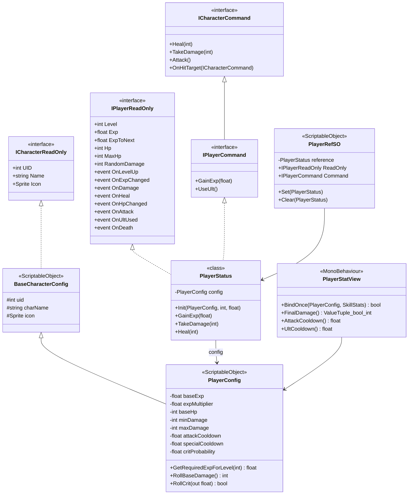
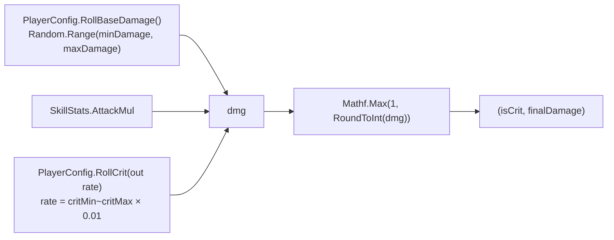
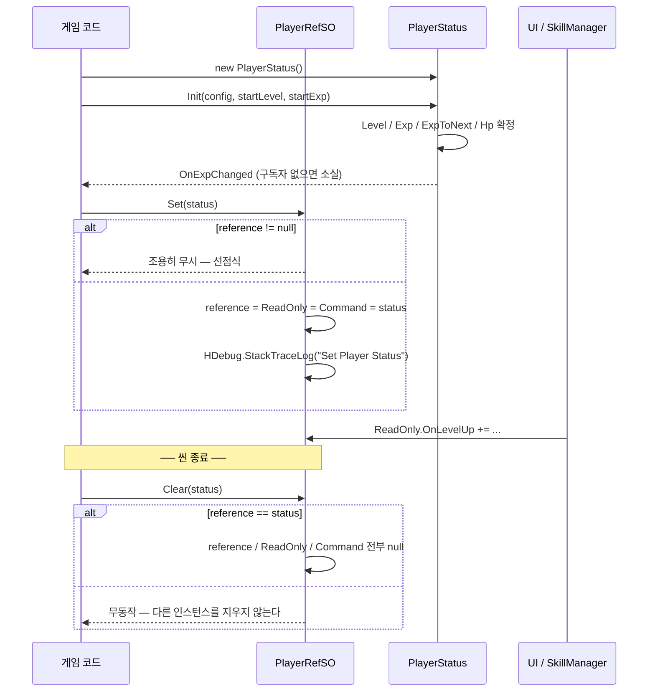
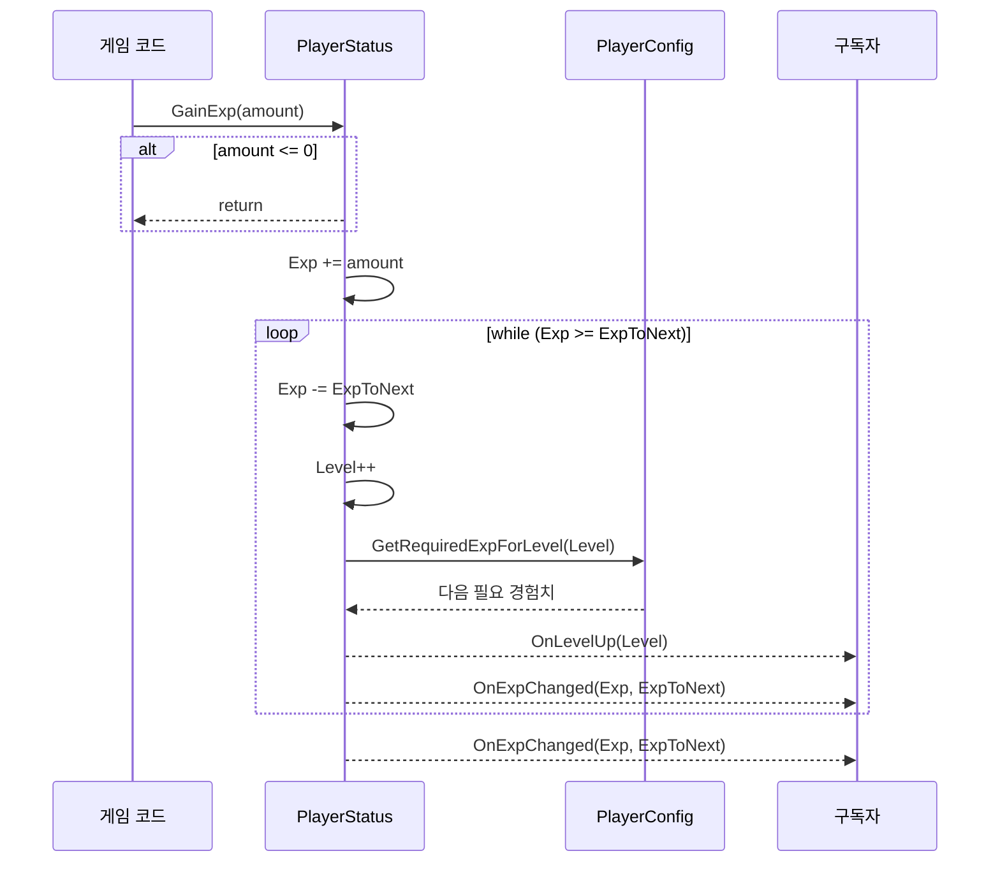
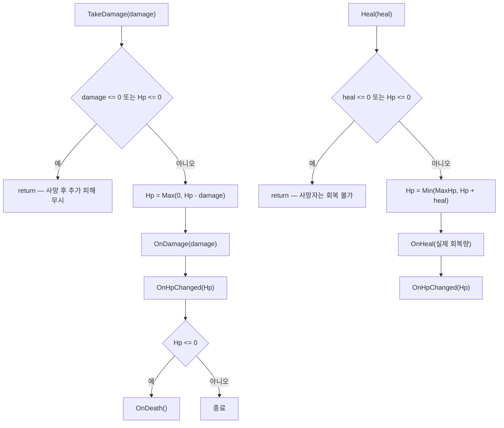

# Player — 캐릭터 계약과 플레이어 상태

> 어셈블리: `HCUP.HGame` · 네임스페이스: `HGame.Character`, `HGame.Player`
> 파일: `Runtime/HGame/Character/` 3개 + `Runtime/HGame/Player/` 6개 · 상위: [`../Runtime/README.md`](../Runtime/README.md)

`Character` 는 독립 시스템이 아니라 Player 의 추상 베이스다 — 3개 파일 전부 인터페이스이거나
필드만 있는 SO 이고, 어셈블리 안의 유일한 구체 파생이 `PlayerConfig` / `PlayerStatus` 이므로
한 문서로 묶는다.

---

## 요약

이 시스템은 **읽기와 쓰기를 인터페이스 수준에서 분리한 스탯 보유 계층**이다.

```
설정(불변)          상태(가변)              합성(파생)
BaseCharacterConfig  ──▶ PlayerStatus ◀──  PlayerRefSO
     ▲                        ▲                 (중계)
PlayerConfig ─────────────────┴──▶ PlayerStatView ◀── SkillStats
```

- `PlayerConfig`(SO) 는 레벨 곡선·데미지 범위·크리티컬 확률을 담는다. **런타임에 변하지 않는다.**
- `PlayerStatus`(순수 C# 클래스) 는 Level / Exp / Hp 를 소유하고 8종 이벤트를 발화한다.
  `MonoBehaviour` 가 아니므로 씬 오브젝트에 붙지 않는다.
- `PlayerRefSO`(SO) 는 그 인스턴스를 `IPlayerReadOnly` / `IPlayerCommand` 두 얼굴로 중계한다.
- `PlayerStatView`(MonoBehaviour) 는 Config × [`SkillStats`](Skill.md) 를 곱해 최종 수치를 낸다.

---

## 파일 지도

| 경로 | 역할 | 행 |
|---|---|---|
| `Character/ICharacterReadOnly.cs` | `UID` / `Name` / `Icon` 조회 계약 | 7 |
| `Character/ICharacterCommand.cs` | `Heal` / `TakeDamage` / `Attack` / `OnHitTarget` | 7 |
| `Character/BaseCharacterConfig.cs` | 캐릭터 설정 SO 베이스 (`ICharacterReadOnly` 구현) | 21 |
| `Player/IPlayerReadOnly.cs` | 레벨·경험치·HP 조회 + 이벤트 8종 | 20 |
| `Player/IPlayerCommand.cs` | `ICharacterCommand` + `GainExp` / `UseUlt` | 5 |
| `Player/PlayerConfig.cs` | 레벨 곡선·데미지·크리티컬 설정 SO | 66 |
| `Player/PlayerStatus.cs` | 런타임 상태 소유 + 이벤트 발화 | 88 |
| `Player/PlayerRefSO.cs` | `PlayerStatus` 를 SO 로 중계 (선점식) | 47 |
| `Player/PlayerStatView.cs` | Config × SkillStats 합성 뷰 | 58 |

---

## 계층 구조



**`IPlayerReadOnly` 와 `IPlayerCommand` 는 서로를 상속하지 않는다.** 같은 `PlayerStatus`
인스턴스가 두 인터페이스를 모두 구현하고 (`PlayerStatus.cs:7`), `PlayerRefSO` 가 그것을
두 프로퍼티로 나눠 내보낸다 (`PlayerRefSO.cs:14-15, 21-22`).

---

## 데이터 모델

### 레벨 곡선

```csharp
// PlayerConfig.cs:48-51
public float GetRequiredExpForLevel(int level) {
    var mul = Mathf.Pow(expMultiplier, Mathf.Max(0, level - 1));
    return Mathf.Ceil(baseExp * mul);
}
```

기본값은 `baseExp = 100`, `expMultiplier = 1.25` (`PlayerConfig.cs:16, 18`) — 즉
`Lv1 = 100`, `Lv2 = 125`, `Lv3 = 157`, `Lv4 = 196` 의 등비 곡선이다. `Mathf.Ceil` 로 정수화한다.

### 데미지 합성



```csharp
// PlayerStatView.cs:38-44
public (bool, int) FinalDamage() {
    int baseRoll = config.RollBaseDamage();
    bool isCrit = config.RollCrit(out float critRate);
    float mulAtk = skill.AttackMul;
    float dmg = baseRoll * mulAtk * critRate;
    return (isCrit, Mathf.Max(1, Mathf.RoundToInt(dmg)));
}
```

`RollCrit` 은 실패해도 `rate = 1f` 를 내보내므로 (`PlayerConfig.cs:62`) 곱셈식이 분기 없이
성립한다. 최소 데미지는 1 로 바닥이 잡힌다.

### 쿨다운 합성

| 메서드 | 식 | 하한 |
|---|---|---|
| `AttackCooldown()` | `attackCooldown / max(0.0001, AttackSpeedMul)` | `0.01f` |
| `UltCooldown()` | `specialCooldown * max(0.0001, UltCooldownMul)` | `0.01f` |

공격 속도는 **나눗셈**, 궁극기 쿨다운은 **곱셈**이다 (`PlayerStatView.cs:49, 55`).
`SkillStats.AddUltCoolStacks` 가 `1f - K*stacks` 로 1 미만 값을 만들기 때문이다
(`SkillStats.cs:39`).

---

## 흐름 1 — 참조 등록과 해제



```csharp
// PlayerRefSO.cs:25-34 — Clear 가 세 필드를 함께 비우는 이유
public void Clear(PlayerStatus status) {
    if (reference == status) {
        HDebug.StackTraceLog("Clear Player Status");
        // reference 를 남기면 Set 의 조기 반환 조건에 걸려 재설정이 영구 불가.
        // SO 특성상 씬 재진입에도 상태가 남으므로 반드시 함께 비운다.
        reference = null;
        ReadOnly = null;
        Command = null;
    }
}
```

**`Clear` 를 부르지 않으면 다음 플레이 모드에서 `Set` 이 통째로 무시된다.** 에디터에서 SO
인스턴스가 도메인 리로드를 건너뛰고 살아남기 때문이다.

---

## 흐름 2 — 경험치 획득과 레벨업



**한 번의 `GainExp` 로 여러 레벨이 오를 수 있고, 레벨당 `OnLevelUp` 이 각각 발화한다.**
[`SkillManager`](Skill.md) 가 이 발화를 `pendingLevelUps` 카운터로 큐잉하는 이유다
(`SkillManager.cs:62-65`).

루프 안에서도 `OnExpChanged` 를 쏘고 루프 밖에서 한 번 더 쏜다 (`PlayerStatus.cs:47, 50`) —
레벨업이 한 번이라도 일어나면 마지막 값으로 **중복 발화**된다.

---

## 흐름 3 — 피해와 사망



`Hp <= 0` 가드가 `TakeDamage`(`PlayerStatus.cs:54`) / `Heal`(`:64`) / `OnHitTarget`(`:74`) /
`Attack`(`:79`) / `UseUlt`(`:84`) 다섯 곳에 모두 있다. **사망 후에는 어떤 명령도 통과하지 않고,
`OnDeath` 는 정확히 한 번만 발화한다.**

`Heal` 은 클램프 이후의 **실제 회복량**을 전달한다 (`PlayerStatus.cs:67-68`) — 요청량이 아니라
`Hp - prev` 다. 만피 상태에서 회복하면 `OnHeal(0)` 이 발화한다.

---

## 사용 예

```csharp
// 1) 상태 생성 (MonoBehaviour 가 아니므로 그냥 new 한다)
var status = new PlayerStatus();
status.Init(playerConfig);                 // ExpToNext 가 여기서 처음 채워진다
playerRef.Set(status);

// 2) 읽기 전용 구독 — UI 는 Command 를 받지 않는다
IPlayerReadOnly ro = playerRef.ReadOnly;
ro.OnHpChanged += hp => hpBar.SetValue(hp, ro.MaxHp);
ro.OnLevelUp   += lv => levelText.text = $"Lv.{lv}";

// 3) 쓰기 — 전투 코드만 Command 를 잡는다
playerRef.Command.GainExp(50f);
playerRef.Command.TakeDamage(3);

// 4) 데미지 합성 뷰 (스킬 스탯과 함께)
statView.BindOnce(playerConfig, skillStats);   // 최초 1회만 true
var (isCrit, dmg) = statView.FinalDamage();

// 5) 정리 — 생략하면 다음 플레이에서 Set 이 무시된다
playerRef.Clear(status);
```

---

## 주의할 점

### 계약

1. **`PlayerStatus.Init` 을 호출하기 전에는 어떤 API 도 안전하지 않다.** `config` 가 `null`
   이므로 `MaxHp`(`PlayerStatus.cs:14`), `RandomDamage`(`:15`), `GainExp`(`:44`) 가 모두
   `NullReferenceException` 이다. 생성자가 없어 컴파일러가 강제하지 못한다.
2. **`PlayerRefSO.Set` 은 선점식이다** (`PlayerRefSO.cs:18`). 두 번째 호출은 로그도 없이
   무시된다. 재설정하려면 반드시 `Clear` 를 먼저 부른다.
3. **`PlayerStatView.BindOnce` 도 1회성이다** (`PlayerStatView.cs:30-31`). 이미 바인딩되어
   있으면 `false` 를 반환하고 아무것도 바꾸지 않는다. 해제 API 는 없다.
4. **`MaxHp` 는 `config.BaseHp` 를 그대로 위임한다** (`PlayerStatus.cs:14`). 레벨업으로
   최대 체력이 오르지 않고, 스킬로 늘리는 경로도 없다.
5. **`Hp` 필드 초기값 `5` 는 `Init` 이 덮어쓴다** (`PlayerStatus.cs:13, 32`). `Init` 전에
   `Hp` 를 읽으면 config 와 무관한 5 가 나온다.
6. **`OnHitTarget` 은 매번 `RandomDamage` 를 새로 굴린다** (`PlayerStatus.cs:75` → `:15`).
   `SkillStats` 의 공격력 배율이 적용되지 않는 경로다 — 배율이 필요하면
   `PlayerStatView.FinalDamage()` 를 써야 한다.
7. **`PlayerConfig` 는 `[Serializable]` + `[CreateAssetMenu]` 를 동시에 단다**
   (`PlayerConfig.cs:9-12`). `ScriptableObject` 파생이므로 `[Serializable]` 은 무의미하다.
   `PlayerRefSO.cs:6` 도 같다.

### 정리 대상

8. **`PlayerConfig.RollBaseDamage` 가 `maxDamage` 를 절대 굴리지 않는다** —
   `PlayerConfig.cs:54` 의 `Random.Range(int, int)` 는 **max 배타**다. 기본값
   `minDamage = 90`, `maxDamage = 100` (`:24-25`) 에서 실제 범위는 90~99 다.
   같은 파일의 `GetCritRate`(`:46`) 와 `RollCrit`(`:59`) 은 `Random.Range(float, float)`
   포함 오버로드를 쓰므로 경계 의미가 일관되지 않다. `maxDamage + 1` 또는 float 오버로드로
   맞춰야 한다.

9. **`PlayerStatus.GainExp` 의 while 루프에 `ExpToNext <= 0` 가드가 없다**
   (`PlayerStatus.cs:40`). 두 경로로 무한 루프에 빠진다.
   - `Init` 을 부르지 않은 상태: `ExpToNext` 가 초기값 `0` (`:12`) 이라 `Exp >= 0` 이 항상 참
     → 첫 반복에서 `config.GetRequiredExpForLevel` (`:44`) 이 `NullReferenceException` 을 던져
     루프가 예외로 끝난다.
   - `PlayerConfig.baseExp = 0` 인 에셋: `GetRequiredExpForLevel` 이 항상 `0` 을 반환해
     (`PlayerConfig.cs:50`) 루프가 영원히 돌고 매 반복 `OnLevelUp` 을 발화한다. **에디터가
     응답 불능이 된다.** `baseExp` 에 `[HMin(0.0001f)]` 같은 하한이 없어 0 입력이 가능하다
     (`PlayerConfig.cs:15-16`).

10. **`PlayerStatView` 의 속성 절반이 하드코딩 스텁이다** (`PlayerStatView.cs:16-27`).
    `FireEnabled` / `FrostEnabled` / `ThunderEnabled` / `PoisonEnabled` 는 무조건 `true` 이고
    대응 `*Chance` 는 전부 `0` 이다. "활성인데 확률 0" 이라는 모순된 상태를 소비 측에 노출한다.

11. **`PlayerStatView.config` 필드는 `BindOnce` 의 가드 외에는 쓰이지 않는 것처럼 보이나**
    실제로는 `FinalDamage`/`AttackCooldown`/`UltCooldown` 이 모두 참조한다 (`:39, 47, 53`) —
    **`BindOnce` 없이 호출하면 전부 `NullReferenceException` 이다.** `MonoBehaviour` 인데
    인스펙터 노출 필드가 없어 (`:7-8` 둘 다 `[SerializeField]` 없음) 바인딩 누락이
    에디터에서 드러나지 않는다.

12. **`PlayerStatView.cs:5` 의 한글 주석이 인코딩 깨짐 상태다.**

13. **`Character/` 의 주석 처리된 `iconPath` / `SpritePath` 잔재** (`BaseCharacterConfig.cs:13-14, 19`,
    `ICharacterReadOnly.cs:5`). 경로 기반 아이콘 로딩을 검토하다 만 흔적으로 보인다(추론).

14. **`IPlayerReadOnly` 를 `PlayerStatus` 외에 구현하는 타입이 없고, `ICharacterCommand` 의
    구현체도 `PlayerStatus` 하나다.** [`World`](World.md) 의 `BaseEventPoint<T>` 가
    `where T : ICharacterCommand` 제약을 걸지만 (`BaseEventPoint.cs:9`), 어셈블리 안에서
    그 제약을 만족하는 `Component` 는 존재하지 않는다 — `PlayerStatus` 는
    `MonoBehaviour` 가 아니라서 `TryGetComponent<T>` 로 잡히지 않는다
    (`BaseEventPoint.cs:49, 55, 61, 67`).

---

## 확장 지점

| 하고 싶은 것 | 손댈 곳 |
|---|---|
| 다른 캐릭터 종류 (몬스터 등) | `BaseCharacterConfig` 상속 + `ICharacterCommand` 를 구현한 `MonoBehaviour` 작성 |
| 레벨 곡선 교체 | `PlayerConfig.GetRequiredExpForLevel` (`:48-51`) — 등비식 하드코딩 |
| 최대 체력 성장 | `PlayerStatus.MaxHp` (`:14`) 가 config 직결이라 여기부터 갈라야 한다 |
| 새 파생 수치 | `PlayerStatView` 에 메서드 추가 — Config × SkillStats 합성 지점 |
| 스탯 저장/복원 | `PlayerStatus` 에 직렬화 추가. `SkillStats.cs:55` 의 TODO 와 같은 과제 |
| 멀티 플레이어 | `PlayerRefSO` 가 단일 참조라 구조 교체 필요 — `PlayerRefSO.cs:42` 의 Dev Log 가 같은 점을 지적한다 |
