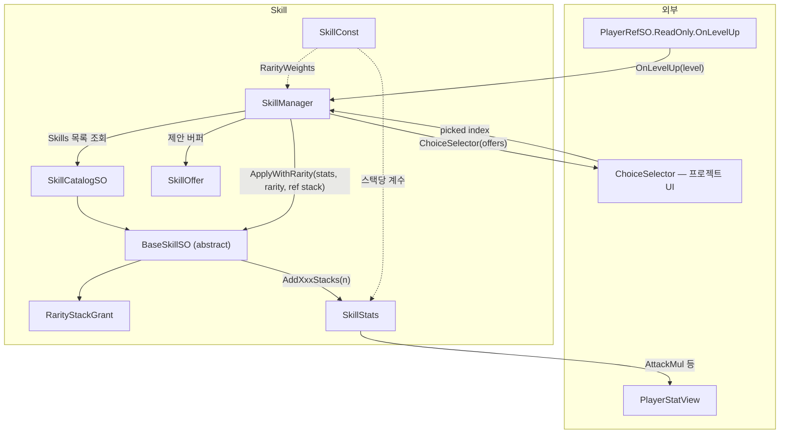
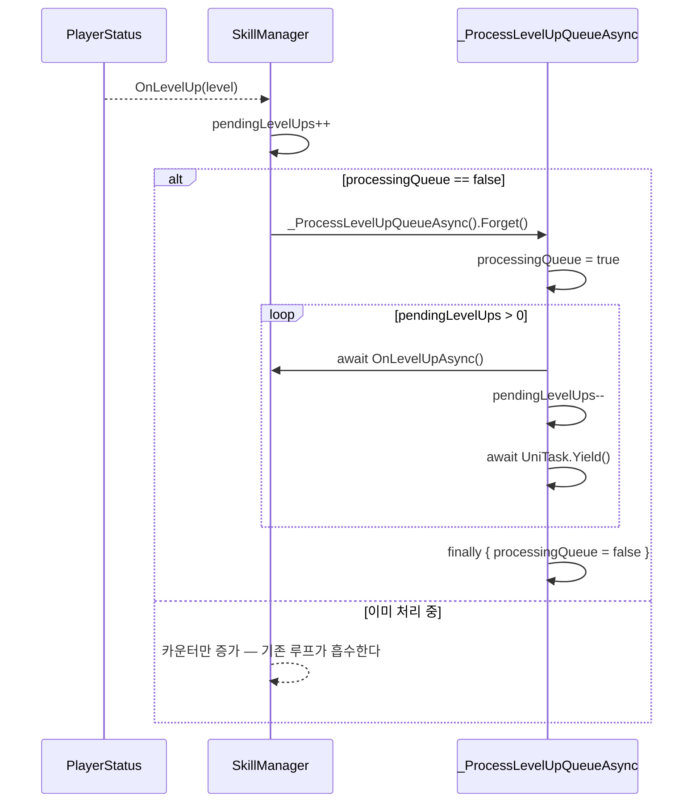
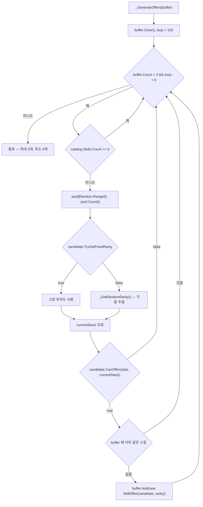
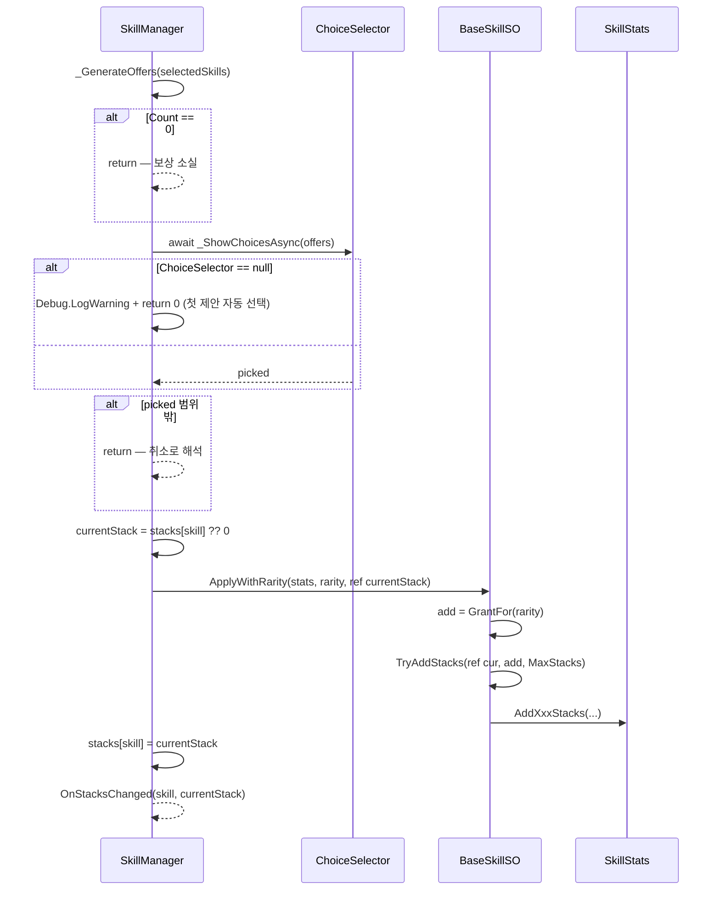
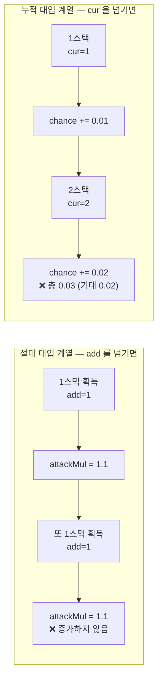

# Skill — 레벨업 보상 선택과 스택 스탯

> 어셈블리: `HCUP.HGame` · 네임스페이스: `HGame.Skill`
> 파일: `Runtime/HGame/Skill/` 8개 · 상위: [`../Runtime/README.md`](../Runtime/README.md)

---

## 요약

Skill 은 **"레벨업 → 3택 제안 → 하나 선택 → 스택 증가 → 곱연산 스탯 갱신"** 한 줄기를
구현한다. 로그라이크 계열의 표준 보상 루프다.

구조의 중심에 세 가지 규약이 있다.

1. **선택 UI 는 주입된다.** `SkillManager` 는 UI 를 모른다 —
   `Func<List<SkillOffer>, UniTask<int>>` 델리게이트 하나를 받아 인덱스를 돌려받을 뿐이다
   (`SkillManager.cs:102`). 미주입이면 경고 후 첫 제안을 자동 선택한다 (`:109-110`).
2. **레벨업은 큐잉된다.** 한 번의 `GainExp` 로 여러 레벨이 올라도
   (`PlayerStatus.cs:40-48`) 선택 창은 하나씩 순차 처리된다 (`SkillManager.cs:113-130`).
3. **스택 수는 매니저가, 스탯 값은 `SkillStats` 가 소유한다.** `BaseSkillSO` 는 두 저장소를
   잇는 순수 함수 역할이며 상태를 갖지 않는다 (`BaseSkillSO.cs:35`).

---

## 파일 지도

| 경로 | 역할 | 행 |
|---|---|---|
| `SkillManager.cs` | 레벨업 큐 → 제안 생성 → 선택 → 적용 (`SingletonBehaviour`) | 132 |
| `BaseSkillSO.cs` | 스킬 정의 베이스 — 제안 가능 여부 / 스택 적용 | 49 |
| `SkillCatalogSO.cs` | 스킬 풀 (`List<BaseSkillSO>`) | 17 |
| `SkillStats.cs` | 곱연산 스탯 8종 보유 `MonoBehaviour` | 57 |
| `SkillConst.cs` | 희귀도 가중치 배열 + 스택당 계수 7종 | 22 |
| `SkillOffer.cs` | (스킬, 희귀도) `readonly struct` | 11 |
| `SkillRarityStack.cs` | 희귀도별 부여 스택 수 `RarityStackGrant` | 27 |
| `SkillRarityType.cs` | `SkillRarity` — Normal / Common / Rare / Epic | 7 |

---

## 계층 구조



**`BaseSkillSO` 가 `SkillStats` 를 직접 호출한다.** 매니저는 어떤 스탯이 바뀌는지 모른다 —
스킬 SO 가 자기 효과를 알고 있고, 매니저는 스택 수만 관리한다.

---

## 데이터 모델

### 희귀도와 부여 스택

```csharp
// SkillRarityStack.cs:6-25 — 희귀도별로 몇 스택을 줄지 SO 에 직렬화된다
[System.Serializable]
public struct RarityStackGrant {
    [HMin(0)][SerializeField] int normal;
    [HMin(0)][SerializeField] int common;
    [HMin(0)][SerializeField] int rare;
    [HMin(0)][SerializeField] int epic;

    public int Get(SkillRarity rarity) => rarity switch {
        SkillRarity.Normal => normal,
        SkillRarity.Common => common,
        SkillRarity.Rare   => rare,
        _                  => epic     // Epic 이 아닌 미정의 값도 epic 으로 떨어진다
    };
}
```

### 희귀도 추첨 가중치

```csharp
// SkillConst.cs:3-8
public static readonly float[] RarityWeights = {
    60f, // Normal
    25f, // Common
    12f, // Rare
     3f  // Epic
};
```

| 희귀도 | 가중치 | 확률 (합 100) |
|---|---|---|
| Normal | 60 | 60 % |
| Common | 25 | 25 % |
| Rare | 12 | 12 % |
| Epic | 3 | 3 % |

합이 정확히 100 이라 가중치가 곧 확률이지만, `_GetRandomRarity` 는 합을 매번 다시 계산하므로
(`SkillManager.cs:86-88`) 값을 바꿔도 동작한다.

### 스택당 계수

| 상수 | 값 | 주석이 말하는 것 | 실제 |
|---|---|---|---|
| `ATK_MULT_STACK` | `0.1f` | +10 % | +10 % |
| `ATK_SPEED_MULT_STACK` | `0.05f` | +5 % | +5 % |
| `ULT_COOLDOWN_STACK` | `0.02f` | −2 % | −2 % |
| `KNOCKBACK_MULT_STACK` | `0.5f` | **+5 %** | **+50 %** |
| `EXPLODE_CHANCE_STACK` | `0.01f` | +1 %p | +1 %p |
| `EXPLODE_DMG_STACK` | `0.1f` | +10 % | +10 % |
| `EXPLODE_RADIUS_STACK` | `0.05f` | +5 % | +5 % |

`KNOCKBACK_MULT_STACK` 만 주석과 값이 어긋난다 (`SkillConst.cs:16`).

---

## 흐름 1 — 레벨업 큐 처리



```csharp
// SkillManager.cs:62-65
private void _OnLevelUp(int level) {
    pendingLevelUps++;
    if (!processingQueue) _ProcessLevelUpQueueAsync().Forget();
}
```

**`processingQueue` 가 중복 루프 기동을 막는 유일한 장치다.** `pendingLevelUps` 를 먼저
증가시키고 플래그를 검사하므로, 처리 중에 도착한 레벨업은 진행 중인 while 루프가 그대로
소화한다 (`SkillManager.cs:119-123`).

`finally` 블록에서 플래그를 내리므로 (`:125-129`) 선택 UI 가 예외를 던져도 큐가 영구
잠기지는 않는다 — 다만 그 예외는 `Forget` 경로로 로그만 남고 남은 `pendingLevelUps` 는
그대로 잔류한다.

---

## 흐름 2 — 제안 생성



`loop = 100` 이 무한 루프 방어선이다 (`SkillManager.cs:69`). 카탈로그가 비었거나 모든 스킬이
`CanOffer == false` 인 상황에서도 100회 안에 빠져나온다. **제안이 0개면
`OnLevelUpAsync` 가 조기 반환하고 (`:48`) 그 레벨의 보상은 사라진다.**

```csharp
// BaseSkillSO.cs:34 — 기본 제안 조건은 "최대 스택 미만"
public virtual bool CanOffer(SkillStats stats, int currentStacks) => currentStacks < MaxStacks;
```

샘플이 이 훅을 어떻게 쓰는지가 설계 의도를 보여준다 — 폭발 관련 스킬은 폭발이 해금된
뒤에만 제안된다.

```csharp
// Samples~/Skill/Scripts/Arrow/SkillExplosiveChanceSO.cs:17
public override bool CanOffer(SkillStats stats, int stacks) => stats.EnableExplosive && stacks < MaxStacks;
```

### 희귀도 추첨

```csharp
// SkillManager.cs:85-99
private SkillRarity _GetRandomRarity() {
    float sum = 0f;
    foreach (var weight in SkillConst.RarityWeights) sum += weight;
    float rare = Random.Range(0f, sum);

    int index = 0;
    while (index < SkillConst.RarityWeights.Length) {
        if (rare < SkillConst.RarityWeights[index]) break;
        rare -= SkillConst.RarityWeights[index];
        index++;
    }
    index = Mathf.Clamp(index, 0, 3);
    return (SkillRarity)index;
}
```

누적 감산 방식이다. `Random.Range(float, float)` 가 상한 포함이라 `rare == sum` 인 극단에서
`index` 가 배열 길이를 넘을 수 있고, 그 경우를 `Mathf.Clamp(index, 0, 3)` 가 받는다.

---

## 흐름 3 — 선택과 적용



```csharp
// BaseSkillSO.cs:42-47 — 스택 증가는 베이스가 제공하는 유일한 상태 조작 헬퍼
protected bool TryAddStacks(ref int current, int add, int max) {
    if (current >= max) return false;
    int before = current;
    current = Mathf.Min(max, current + Mathf.Max(0, add));
    return current > before;
}
```

`add` 가 음수여도 `Mathf.Max(0, add)` 로 걸러지고, `max` 를 넘지 않도록 클램프된다.
**반환값이 `false` 면 스탯을 건드리지 않는다** — 상한 도달 후 중복 적용을 막는 장치다.

### `ChoiceSelector` 미주입 시

```csharp
// SkillManager.cs:104-111
private async UniTask<int> _ShowChoicesAsync(List<SkillOffer> offers) {
    if (ChoiceSelector != null) return await ChoiceSelector(offers);

    // 선택 UI 미연결 상태에서 항상 -1 을 반환하던 종전 코드는 레벨업 보상을 로그 한 줄
    // 없이 소실시켰다 — 무음 실패 대신 경고 + 첫 제안 자동 선택으로 대체.
    Debug.LogWarning("[SkillManager] ChoiceSelector is not set. Auto-picking the first offer.");
    return 0;
}
```

---

## SkillStats 의 갱신 방식

여기에 이 시스템에서 가장 헷갈리는 규약이 있다.

```csharp
// SkillStats.cs:37-45
public void AddAttackStacks(int stacks)      => attackMul       = 1f + SkillConst.ATK_MULT_STACK * stacks;
public void AddAttackSpeedStacks(int stacks) => attackSpeedMul  = 1f + SkillConst.ATK_SPEED_MULT_STACK * stacks;
public void AddUltCoolStacks(int stacks)     => ultCooldownMul  = 1f - SkillConst.ULT_COOLDOWN_STACK * stacks;
public void AddKnockbackStacks(int stacks)   => knockbackMul    = 1f + SkillConst.KNOCKBACK_MULT_STACK * stacks;

public void UnlockExplosive()                => enableExplosive = true;
public void AddExplChanceStacks(int stacks)  => explosiveChance += SkillConst.EXPLODE_CHANCE_STACK * stacks;
public void AddExplDamageStacks(int stacks)  => explosiveDamageMul = 1f + SkillConst.EXPLODE_DMG_STACK * stacks;
public void AddExplRadiusStacks(int stacks)  => explosiveRadiusMul = 1f + SkillConst.EXPLODE_RADIUS_STACK * stacks;
```

**이름은 `Add` 인데 7개는 절대 대입이고 1개만 누적 대입이다.** 절대 대입 계열은 인자로
**누적 총 스택 수**를 받아야 정상 동작하고, `AddExplChanceStacks` 만 **증분**을 받아야 한다.

샘플은 두 경우 모두 증분(`add`)을 넘긴다.

```csharp
// Samples~/Skill/Scripts/Stats/SkillAttackUpSO.cs:6-10
public override void ApplyWithRarity(SkillStats stats, SkillRarity rarity, ref int cur) {
    int add = GrantFor(rarity);
    if (TryAddStacks(ref cur, add, MaxStacks))
        stats.AddAttackStacks(add);        // ← cur 이 아니라 add
}
```



**두 계열 중 어느 쪽에 맞추든 나머지 하나는 틀린다.** 절대 대입 계열에는 `cur`(누적 총량),
누적 대입 계열에는 `add`(증분)를 넘겨야 하는데, 호출부는 이를 구분할 근거가 없다.

`ResetAll` (`SkillStats.cs:47-53`) 은 `explosiveChance` 를 `0f` 로 되돌리지만
직렬화 기본값은 `0.1f` 다 (`:21`) — 리셋 후 값이 초기 상태와 달라진다.

---

## 사용 예

```csharp
// 1) 선택 UI 주입 — 반환값은 offers 인덱스, 취소는 음수
SkillManager.Instance.ChoiceSelector = async offers => {
    var popup = await UIManager.OpenAsync<SkillChoicePopup>();
    return await popup.WaitForPickAsync(offers);   // 취소 시 -1
};

// 2) 게임 시작 — PlayerRefSO.Set 이 반드시 선행되어야 한다
SkillManager.Instance.OnPrepareGame();

// 3) 스택 변화 관측
SkillManager.Instance.OnStacksChanged += (skill, stack) =>
    hud.SetSkillStack(skill.UiIcon, stack, skill.MaxStacks);

// 4) 게임 종료
SkillManager.Instance.OnGameOver();
```

새 스킬을 만들 때는 `BaseSkillSO` 를 상속한다.

```csharp
[CreateAssetMenu(menuName = "Game/Skill/Stats/Attack Up")]
public class SkillAttackUpSO : BaseSkillSO {
    public override void ApplyWithRarity(SkillStats stats, SkillRarity rarity, ref int cur) {
        int add = GrantFor(rarity);
        if (TryAddStacks(ref cur, add, MaxStacks))
            stats.AddAttackStacks(cur);   // 절대 대입 계열에는 누적 총량 cur 을 넘긴다
    }
}
```

---

## 주의할 점

### 계약

1. **`OnPrepareGame` 전에 `PlayerRefSO.Set` 이 끝나 있어야 한다** (`SkillManager.cs:35`).
   `playerRef.ReadOnly` 가 `null` 이면 `NullReferenceException` 이다.
2. **`ChoiceSelector` 는 음수를 "취소"로 쓴다** (`SkillManager.cs:50`). 범위 밖 인덱스도
   같은 취급이며, 그 레벨의 보상은 소실된다.
3. **제안이 0개면 보상이 조용히 사라진다** (`SkillManager.cs:48`). 로그가 없다.
   모든 스킬이 최대 스택에 도달한 후반부에 반복적으로 일어난다.
4. **레벨업 처리는 직렬화된다** (`SkillManager.cs:64, 119-123`). 동시에 두 개의 선택 창이
   뜨지 않는다.
5. **`ApplyWithRarity` 구현체가 `TryAddStacks` 결과를 무시하면 상한이 무력화된다**
   (`BaseSkillSO.cs:42`). 상한 강제는 베이스가 아니라 **구현체의 규율**이다.
6. **`SkillManager` 는 `sealed` 다** (`SkillManager.cs:10`). 상속으로 확장할 수 없고
   `ChoiceSelector` 주입이 유일한 커스터마이즈 지점이다.

### 정리 대상

7. **`SkillStats` 의 `Add*` 계열 8개 중 `AddExplChanceStacks` 만 `+=` 다**
   (`SkillStats.cs:43` vs `:37-40, 44-45`). 나머지 7개는 `= 1f + K*stacks` 절대 대입이다.
   같은 이름 규칙(`AddXxxStacks`)으로 정반대 의미를 갖는 API 가 섞여 있어, 호출부가
   무엇을 넘겨야 하는지 시그니처만으로 판단할 수 없다. 샘플 8종은 전부 증분(`add`)을
   넘기므로 (`Samples~/Skill/Scripts/**`) 절대 대입 계열 7개가 스택 2 이상에서 값이
   증가하지 않는다.

8. **`SkillConst.KNOCKBACK_MULT_STACK` 의 주석과 값이 어긋난다** (`SkillConst.cs:16`).
   `0.5f` 인데 주석은 `+5%` — 실제로는 스택당 +50 % 다. 다른 계수들과 자릿수가 한 단계 다르다.

9. **`SkillManager.OnGameOver` 가 `stacks` 와 `selectedSkills` 를 비우지 않는다**
   (`SkillManager.cs:39-43`). `pendingLevelUps` / `processingQueue` 만 초기화한다.
   싱글톤이 `dontDestroyOnLoad` 인 구성에서 재시작하면 **이전 판의 스택이 그대로 남아**
   `CanOffer` 판정이 오염된다. `SkillStats.ResetAll()` (`SkillStats.cs:47`) 도 호출되지 않아
   스탯 배율도 잔류한다.

10. **`OnGameOver` 는 `OnStacksChanged` 구독을 해제하지 않는다** (`SkillManager.cs:39-43`).
    `OnPrepareGame` 의 주석(`:36`)이 이 이벤트로 UI 를 배선할 것을 예고하고 있어, 그대로
    구현하면 씬 재진입마다 구독이 누적된다.

11. **`_ShowChoicesAsync` 의 `async` 가 폴백 경로에서 낭비다** (`SkillManager.cs:104-111`).
    `ChoiceSelector` 가 null 이면 await 없이 `return 0` 이므로 상태 머신만 한 번 도는다.

12. **`SkillConst.cs:12, 15, 19, 20` 의 한글 주석이 인코딩 깨짐 상태다.**

13. **`SkillManager.OnPrepareGame` / `OnGameOver` 는 [`InitModule`](InitModule.md) 과
    연결되어 있지 않다.** 이름은 페이즈 훅처럼 보이지만 `BaseInitModule` 을 상속하지 않으므로
    프로젝트가 직접 호출해야 한다.

14. **`BaseSkillSO.uid` 는 읽기만 되고 어디서도 조회 키로 쓰이지 않는다**
    (`BaseSkillSO.cs:8, 27`). 카탈로그도 `List<BaseSkillSO>` 로 참조를 직접 들고
    (`SkillCatalogSO.cs:13`), 스택 딕셔너리도 SO 참조를 키로 쓴다 (`SkillManager.cs:28`).

15. **`SkillCatalogSO.Skills` 가 내부 `List` 를 그대로 노출한다** (`SkillCatalogSO.cs:15`).
    외부에서 `Add`/`Clear` 가 가능하다 — `IReadOnlyList<BaseSkillSO>` 가 적절하다.

---

## 확장 지점

| 하고 싶은 것 | 손댈 곳 |
|---|---|
| 새 스킬 | `BaseSkillSO` 상속 → `ApplyWithRarity` 구현 → `SkillCatalogSO.skills` 등록 |
| 조건부 제안 | `BaseSkillSO.CanOffer` override (`:34`) — 샘플의 폭발 해금 게이트가 선례 |
| 고정 희귀도 스킬 | `BaseSkillSO.TryGetFixedRarity` override (`:36-39`) |
| 선택 UI | `SkillManager.ChoiceSelector` 주입 (`:102`) |
| 희귀도 확률 조정 | `SkillConst.RarityWeights` (`:3-8`) — 합이 100 일 필요는 없다 |
| 제안 개수 변경 | `SkillConst.SKILL_CHOICE_COUNT` (`:10`) + `selectedSkills` 초기 용량 (`SkillManager.cs:27`) |
| 새 스탯 축 | `SkillStats` 필드 + 프로퍼티 + `AddXxxStacks` + `ResetAll` + `SkillConst` 계수 |
| 레벨업 중 게임 일시정지 | `_ProcessLevelUpQueueAsync` 의 주석 처리된 두 줄 (`SkillManager.cs:116, 127`) — `InitManager.GamePauseAsync` / `GameRunAsync` 연결 지점 |
