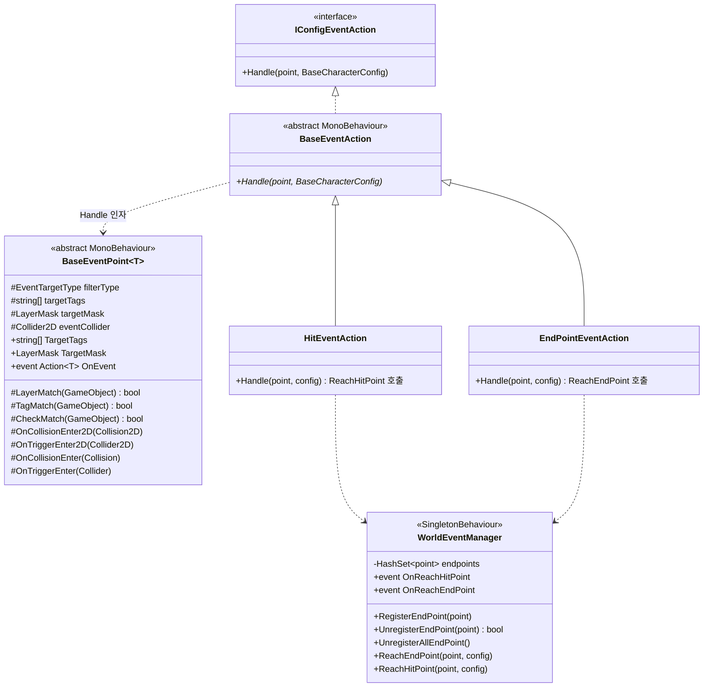
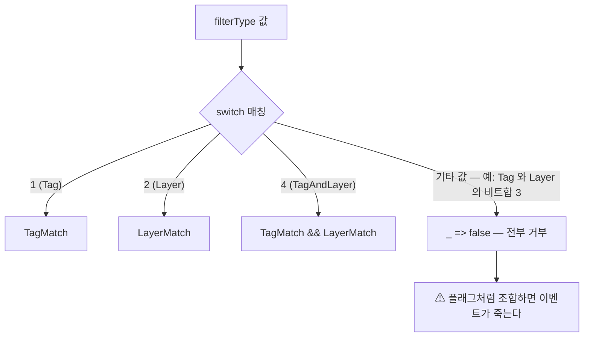
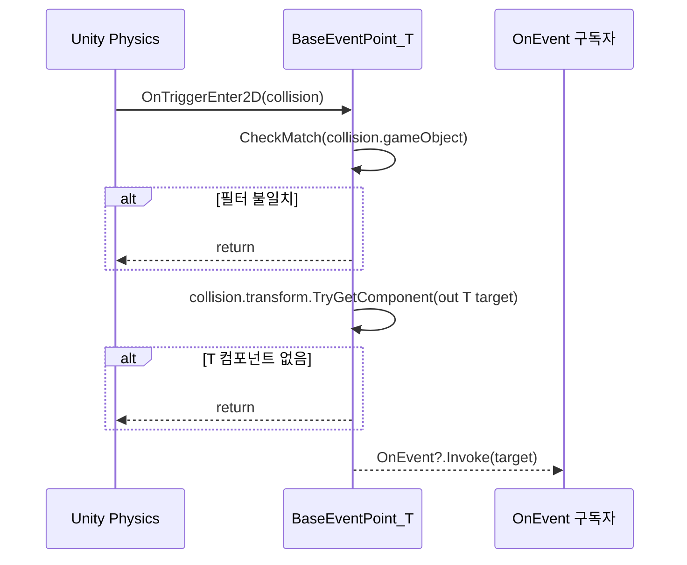
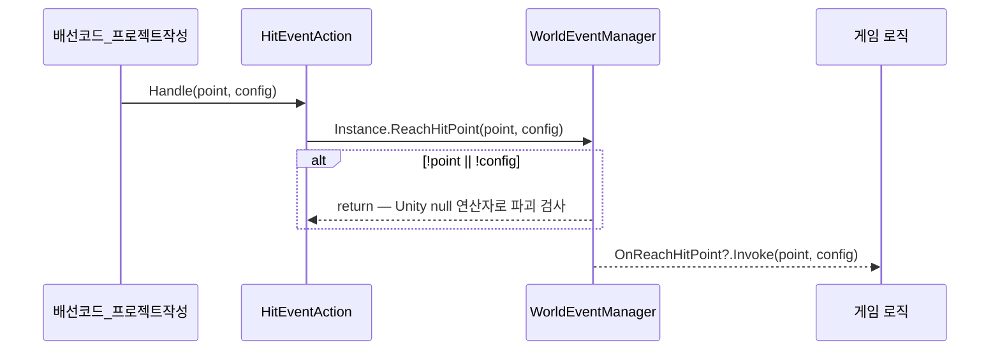
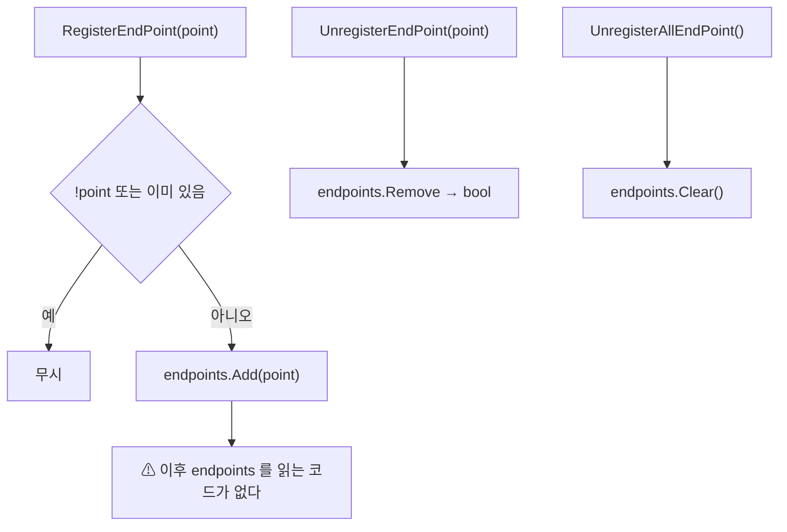

# World — 이벤트 포인트와 액션 디스패치

> 어셈블리: `HCUP.HGame` · 네임스페이스: `HGame.World.EventAction`, `HGame.H2D.Map`(`BaseEventPoint`)
> 파일: `Runtime/HGame/World/EventPoint/` 1개 + `Runtime/HGame/World/EventAction/` 6개 · 상위: [`../Runtime/README.md`](../Runtime/README.md)

---

## 요약

World 는 **"콜라이더에 무언가 들어왔다"를 필터링해 전역 이벤트로 승격시키는 3단 파이프**다.

```
BaseEventPoint<T>          BaseEventAction            WorldEventManager
 (트리거 + 필터)      →      (어떤 이벤트인가)     →     (전역 브로드캐스트)
```

이 어셈블리에서 **가장 완성도가 낮은 시스템**이기도 하다. 세 단계가 코드로 이어져 있지 않다 —
`BaseEventPoint.OnEvent` 를 구독해 `BaseEventAction.Handle` 을 부르는 배선 코드가 존재하지 않고,
`WorldEventManager` 가 등록받는 endpoints 집합도 어디서도 읽히지 않는다.

---

## 파일 지도

| 경로 | 역할 | 행 |
|---|---|---|
| `EventPoint/BaseEventPoint.cs` | 태그/레이어 필터 + Unity 트리거 4종 → `OnEvent` 발화 | 100 |
| `EventAction/IConfigEventAction.cs` | `Handle(point, config)` 단일 계약 | 7 |
| `EventAction/BaseEventAction.cs` | 액션 베이스 (`MonoBehaviour` + 계약) | 8 |
| `EventAction/HitEventAction.cs` | → `WorldEventManager.ReachHitPoint` | 9 |
| `EventAction/EndPointEventAction.cs` | → `WorldEventManager.ReachEndPoint` | 9 |
| `EventAction/EventTargetType.cs` | Tag / Layer / TagAndLayer | 6 |
| `EventAction/WorldEventManager.cs` | 도달 이벤트 브로드캐스트 허브 (`SingletonBehaviour`) | 41 |

---

## 계층 구조



**`BaseEventPoint<T>` 와 `BaseEventAction` 사이에 코드상의 연결이 없다.**
`Handle` 의 첫 인자로 point 를 받을 뿐, point 가 action 을 부르는 경로가 없다.

---

## 데이터 모델

### 필터 타입

```csharp
// EventAction/EventTargetType.cs:2-6
public enum EventTargetType : byte {
    Tag         = 1 << 0,   // 1
    Layer       = 1 << 1,   // 2
    TagAndLayer = 1 << 2,   // 4
};
```

값이 비트 플래그처럼 배정되어 있지만 **`[Flags]` 가 없고, 소비 측은 정확한 값 비교를 한다.**

```csharp
// EventPoint/BaseEventPoint.cs:38-43
protected bool CheckMatch(GameObject go) => filterType switch {
    EventTargetType.Tag         => TagMatch(go),
    EventTargetType.Layer       => LayerMatch(go),
    EventTargetType.TagAndLayer => TagMatch(go) && LayerMatch(go),
    _ => false
};
```



`Tag | Layer` 는 `3` 이고 `TagAndLayer` 는 `4` 이므로, 비트 조합으로 만든 값은
`_ => false` 로 떨어져 **모든 대상이 거부된다.**

### 매칭 규칙

```csharp
// EventPoint/BaseEventPoint.cs:30-37
protected bool LayerMatch(GameObject go) => ((1 << go.layer) & targetMask) != 0;
protected bool TagMatch(GameObject go) {
    if (targetTags == null || targetTags.Length == 0) return false;   // 빈 배열 = 전부 거부
    for (int k = 0; k < targetTags.Length; k++) {
        if (go.CompareTag(targetTags[k])) return true;                // OR 매칭
    }
    return false;
}
```

`targetMask` 기본값은 `~0`(Everything) 이므로 (`:18`) **레이어 필터는 기본적으로 통과**이고,
`targetTags` 기본값은 빈 배열이라 **태그 필터는 기본적으로 차단**이다. 방향이 반대다.

---

## 흐름 1 — 트리거에서 이벤트까지



네 개의 Unity 콜백이 **완전히 동일한 4줄 본문**을 반복한다 —
`OnCollisionEnter2D`(`:47-51`) / `OnTriggerEnter2D`(`:53-57`) /
`OnCollisionEnter`(`:59-63`) / `OnTriggerEnter`(`:65-69`).

2D 와 3D 콜백이 모두 있지만 `eventCollider` 필드는 `Collider2D` 로 고정이다 (`:22`) —
3D 경로는 기즈모(`:92, 95`)와 `OnValidate` 자동 배선(`:80`) 지원을 받지 못한다.

**`Enter` 만 있고 `Exit` / `Stay` 는 없다.** 진입 이벤트 전용 컴포넌트다.

---

## 흐름 2 — 액션에서 전역 브로드캐스트까지



```csharp
// EventAction/HitEventAction.cs:5-9
public sealed class HitEventAction : BaseEventAction {
    public override void Handle(BaseEventPoint<ICharacterCommand> point, BaseCharacterConfig target) {
        WorldEventManager.Instance.ReachHitPoint(point, target);
    }
}
```

두 액션의 차이는 호출하는 매니저 메서드 이름 하나뿐이다 (`HitEventAction.cs:7` vs
`EndPointEventAction.cs:7`).

```csharp
// EventAction/WorldEventManager.cs:32-40
public void ReachEndPoint(BaseEventPoint<ICharacterCommand> point, BaseCharacterConfig character) {
    if (!point || !character) return;      // UnityEngine.Object 의 bool 연산자 — 파괴된 객체도 걸린다
    OnReachEndPoint?.Invoke(point, character);
}
```

---

## 흐름 3 — endpoints 레지스트리



```csharp
// EventAction/WorldEventManager.cs:26-29
public void UnregisterAllEndPoint() {
    // 순회 중 Remove 는 요소가 1개 이상이면 InvalidOperationException — 일괄 비움으로 대체.
    endpoints.Clear();
}
```

`endpoints` 는 **쓰기만 되고 읽히지 않는다.** `ReachEndPoint` / `ReachHitPoint` 도
집합을 조회하지 않고 이벤트만 쏜다 (`:32-40`). 등록 여부가 동작에 아무 영향을 주지 않는다.

---

## 사용 예

현재 코드만으로는 파이프가 자동으로 이어지지 않는다. 프로젝트가 배선을 작성해야 한다.

```csharp
// 1) 이벤트 포인트 정의 — 제네릭 인자를 구체화한다
public sealed class GoalPoint : BaseEventPoint<ICharacterCommand> { }

// 2) 배선 — point 의 OnEvent 를 액션에 연결하는 코드는 이 어셈블리에 없다
public sealed class GoalWiring : MonoBehaviour {
    [SerializeField] GoalPoint point;
    [SerializeField] EndPointEventAction action;
    [SerializeField] BaseCharacterConfig config;

    void OnEnable()  { point.OnEvent += _Handle; WorldEventManager.Instance.RegisterEndPoint(point); }
    void OnDisable() {
        point.OnEvent -= _Handle;
        if (WorldEventManager.HasInstance) WorldEventManager.Instance.UnregisterEndPoint(point);
    }
    void _Handle(ICharacterCommand _) => action.Handle(point, config);
}

// 3) 전역 구독 — 게임 진행 로직 쪽
WorldEventManager.Instance.OnReachEndPoint += (point, config) => stageDirector.Clear(config);
```

인스펙터에서는 `filterType` 을 `Layer`(기본) 로 두고 `targetMask` 를 좁히거나,
`Tag` 로 바꾸고 `targetTags` 를 채운다. `[HShowIf]` 조건식이 두 필드의 노출을 제어한다
(`BaseEventPoint.cs:13, 16`).

---

## 주의할 점

### 계약

1. **진입 이벤트 전용이다.** `Exit` / `Stay` 콜백이 없다 (`BaseEventPoint.cs:47-69`).
2. **`targetTags` 가 비면 태그 매칭은 항상 실패한다** (`BaseEventPoint.cs:32`).
   레이어 마스크 기본값 `~0` 과 정반대 방향의 기본 동작이다 (`:18`).
3. **`TryGetComponent<T>` 는 충돌한 `transform` 에서만 찾는다** (`:49, 55, 61, 67`).
   자식·부모 콜라이더 구조에서는 대상 컴포넌트를 놓친다.
4. **`WorldEventManager.Reach*` 는 Unity null 연산자로 파괴 검사를 한다** (`:33, 38`).
   이미 파괴된 point/config 는 이벤트를 쏘지 않는다.
5. **`UnregisterAllEndPoint` 는 `Clear()` 다** (`:26-29`). 개별 해제 콜백이 필요하면
   순회는 복사본에서 해야 한다 — 주석이 그 이유를 남기고 있다 (`:27`).
6. **액션은 `MonoBehaviour` 다** (`BaseEventAction.cs:6`). 씬 오브젝트에 붙여
   인스펙터로 참조해야 하며, `ScriptableObject` 나 정적 호출이 아니다.

### 정리 대상

7. **`EventTargetType` 이 플래그처럼 생겼는데 플래그가 아니다** (`EventTargetType.cs:2-6`).
   `TagAndLayer = 1 << 2`(=4) 라서 `Tag | Layer`(=3) 와 다르고, `[Flags]` 도 없다.
   인스펙터에서 조합을 만들 수는 없지만, 코드에서 `Tag | Layer` 를 대입하면
   `CheckMatch` 가 `_ => false` 로 떨어져 (`BaseEventPoint.cs:42`) **모든 충돌이 무시된다.**
   `TagAndLayer = Tag | Layer` 로 두고 `[Flags]` 를 붙이거나, 값을 `0,1,2` 연번으로
   바꾸는 편이 안전하다.

8. **`WorldEventManager.endpoints` 는 쓰기 전용 죽은 상태다** (`:13, 19-29`).
   등록/해제 API 3종이 있지만 집합을 읽는 코드가 어셈블리 전체에 없다.

9. **`[SerializeField] readonly HashSet<...>` 은 직렬화되지 않는다**
   (`WorldEventManager.cs:12-13`). `readonly` 필드는 Unity 직렬화 대상이 아니고
   `HashSet<T>` 도 직렬화 불가 타입이다. 앞줄의 `[HTitle("Controllers")]` 와 함께
   인스펙터에 아무것도 나타나지 않는다.

10. **`BaseEventPoint<T>` 가 `World/EventPoint/` 에 있으면서 `namespace HGame.H2D.Map` 을 쓴다**
    (`BaseEventPoint.cs:8`). 그 결과 `EventAction/` 6개 파일 중 5개가
    `using HGame.H2D.Map;` 을 걸고 있다 (`BaseEventAction.cs:3`, `HitEventAction.cs:2`,
    `EndPointEventAction.cs:2`, `IConfigEventAction.cs:2`, `WorldEventManager.cs:5`).

11. **`BaseEventPoint` 와 `BaseEventAction` 을 잇는 코드가 없다.**
    `OnEvent`(`:27`) 를 구독하는 곳도, `Handle`(`BaseEventAction.cs:7`) 을 호출하는 곳도
    어셈블리 안에 없다. 3단 파이프의 중간 배선이 통째로 비어 있다.

12. **`Handle` 의 두 번째 인자가 어디서 오는지 정의되어 있지 않다.**
    `BaseEventPoint.OnEvent` 는 `T`(= `ICharacterCommand`) 를 전달하는데
    (`BaseEventPoint.cs:50`), `Handle` 은 `BaseCharacterConfig` 를 요구한다
    (`BaseEventAction.cs:7`). 두 타입 사이 변환 경로가 없어 호출자가 별도로 config 를
    조달해야 한다.

13. **제약 `where T : ICharacterCommand` 를 만족하는 `Component` 가 어셈블리에 없다**
    (`BaseEventPoint.cs:9`). 유일한 구현체 `PlayerStatus` 는 `MonoBehaviour` 가 아닌
    순수 C# 클래스라 (`PlayerStatus.cs:7`) `TryGetComponent<T>` 로 잡히지 않는다
    (`:49, 55, 61, 67`). [`Player`](Player.md) 문서의 같은 항목 참조.

14. **`IConfigEventAction` 을 타입으로 소비하는 코드가 없다**
    (`IConfigEventAction.cs:5`). `BaseEventAction` 이 유일한 구현체이고 파생 2종도
    베이스 타입으로 쓰인다 — 인터페이스가 다형성 지점으로 기능하지 않는다.
    파라미터 이름도 `monster` 로 남아 있다 (`:6`).

15. **`OnDrawGizmosSelected` 가 `eventCollider` null 을 검사하지 않는다**
    (`BaseEventPoint.cs:89-97`). `[HRequired]` (`:21`) 와 `OnValidate` 자동 배선 (`:80`) 이
    있지만, GameObject 에 `Collider2D` 가 없으면 선택할 때마다 에디터에서
    `NullReferenceException` 이 난다.

16. **`OnValidate` 의 태그 검증이 에디터 전용 API 를 직접 부른다**
    (`BaseEventPoint.cs:81` — `UnityEditorInternal.InternalEditorUtility.tags`).
    `#if UNITY_EDITOR` 안이라 빌드는 통과하지만 internal API 의존이다.

17. **네 트리거 콜백의 본문이 완전히 동일하게 4번 반복된다**
    (`BaseEventPoint.cs:47-69`). 공통 헬퍼 하나로 접을 수 있다.

18. **3D 물리 지원이 반쪽이다.** `OnCollisionEnter`/`OnTriggerEnter` 는 있는데
    `eventCollider` 는 `Collider2D` 고정이다 (`:22`) — 기즈모와 자동 배선이 3D 에서 동작하지 않는다.

---

## 확장 지점

| 하고 싶은 것 | 손댈 곳 |
|---|---|
| 새 이벤트 종류 | `BaseEventAction` 상속 + `WorldEventManager` 에 `event` / `Reach*` 메서드 추가 |
| 새 필터 조건 | `EventTargetType` + `BaseEventPoint.CheckMatch` (`:38-43`) — 두 곳 동시 수정 |
| Exit / Stay 이벤트 | `BaseEventPoint` 에 `OnTriggerExit2D` 등 추가 + 별도 `event` 노출 |
| 3D 전용 이벤트 포인트 | `eventCollider` 타입 분기 또는 3D 전용 파생 작성 (`:22`) |
| 액션을 데이터로 | `IConfigEventAction` 을 `ScriptableObject` 로 구현 — 현재는 `MonoBehaviour` 만 (`BaseEventAction.cs:6`) |
| endpoints 활용 | `WorldEventManager.endpoints` (`:13`) 를 읽는 조회 API 추가 — 현재 죽은 상태 |
