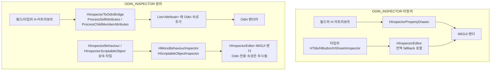
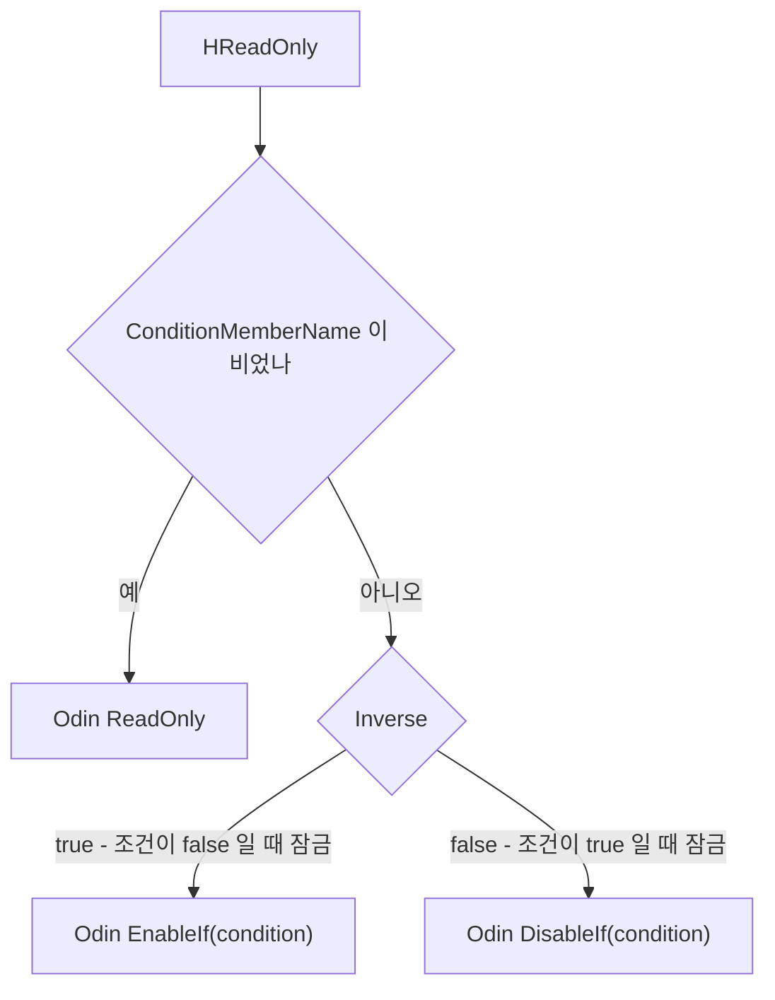

# HCUP.HInspector.Odin.Editor

> 어셈블리: `HCUP.HInspector.Odin.Editor` (`Editor/Odin/HCUP.HInspector.Odin.Editor.asmdef`, rootNamespace `HInspector.Odin.Editor`)
> 의존: `HCUP.HInspector`, `HCUP.HInspector.Editor` / `includePlatforms: ["Editor"]` / **`defineConstraints: ["ODIN_INSPECTOR"]`**
> 동반 어셈블리: `HCUP.HInspector`(어트리뷰트 정의), `HCUP.HInspector.Editor`(비-Odin 렌더러)

---

## 요약

파일 1개, 클래스 2개짜리 어셈블리다. **HInspector 어트리뷰트를 Odin 어트리뷰트로 번역해 Odin 렌더러가 그리게 만든다.** 자체 렌더링은 하지 않는다. 두 번째 클래스 `HDropdownOdinItemSource` 는 `[HDropdown]` 을 번역한 `ValueDropdown` 표현식이 호출하는 항목 공급 창구다.

`defineConstraints` 가 `ODIN_INSPECTOR` 를 요구하므로 **Odin 미설치 환경에서는 이 어셈블리 자체가
컴파일되지 않는다.** asmdef 는 Odin 어셈블리를 `references` 에 넣지 않고 `HCUP.HInspector` 와 `HCUP.HInspector.Editor` 만 참조한다. `HCUP.HInspector.Editor` 는 `HDropdownSourceRegistry` 를 쓰기 위한 참조다. `Sirenix.OdinInspector` / `Sirenix.OdinInspector.Editor` 는 Odin 이 `autoReferenced` 로 배포되기 때문에 별도 명시 없이 해결된다.

등록 코드는 없다. `OdinAttributeProcessor` 파생 클래스는 Odin 의
`DefaultOdinAttributeProcessorLocator` 가 자동 수집한다 (`HInspectorToOdinBridge.cs:7-8`).

---

## 파일 지도

| 경로 | 행수 | 역할 |
|---|---|---|
| `HInspectorToOdinBridge.cs` | 410 | `OdinAttributeProcessor` 구현(`HInspectorToOdinBridge`). `_MapAll` 이 19종 매핑 메서드 호출. `[HDropdown]` 항목 공급 창구 `HDropdownOdinItemSource`(public static) 포함 |

---

## 동작 위치



Odin 이 설치돼 있어도 `HInspectorBehaviour` / `HInspectorScriptableObject` 를 상속하면
브릿지를 우회해 HInspector 파이프라인으로 그려진다. Unity 의 CustomEditor 선택 규칙(더 구체적인
타겟이 우선)을 이용한 opt-out 이다.

---

## 매핑 표

`_MapAll` 이 아래 순서로 호출한다 (`HInspectorToOdinBridge.cs:44-64`). 순서에 의미가 있는 것은
`_MapHHideIf` → `_MapHShowIf` 한 쌍뿐이다.

| HInspector | Odin | 비고 |
|---|---|---|
| `HTitle` | `Title` | `:66-74` |
| `HOnValueChanged` | `OnValueChanged(method, IncludeChildren)` | `IncludeChildren` 이 **여기서만 실제로 쓰인다** (`:84`) |
| `HHideIf` | `HideIf` | 표현식 / 멤버명 / 멤버명+비교값 3형태 (`:108-126`) |
| `HShowIf` | `ShowIf` | `HHideIf` 를 `FirstOrDefault(a => !(a is HHideIfAttribute))` 로 제외 (`:91`) |
| `HEnableIf` | `EnableIf` | 표현식·조건 통합 (`:128-138`) |
| `HReadOnly` | `ReadOnly` / `EnableIf` / `DisableIf` | **논리 변환**, 아래 참조 |
| `HRequired` | `Required` | 메시지 유무로 오버로드 분기 (`:163-175`) |
| `HLabelText` | `LabelText` | 빈 문자열이면 매핑 안 함 (`:182`) |
| `HHideLabel` | `HideLabel` | `:187-194` |
| `HMin` | `MinValue` | `:196-203` |
| `HMax` | `MaxValue` | `:205-212` |
| `HMinMaxSlider` | `MinMaxSlider(min, max, showFields: true)` | `showFields: true` 로 HInspector 동작과 맞춤 (`:221`) |
| `HBoxGroup` | `BoxGroup` | 빈 그룹명이면 매핑 안 함 (`:229`) |
| `HHorizontalGroup` | `HorizontalGroup` | `:234-242` |
| `HVerticalGroup` | `VerticalGroup` | `:244-252` |
| `HButton` | `Button` | 라벨 유무로 오버로드 분기 (`:254-266`) |
| `HShowInInspector` | `ShowInInspector` **+** `LabelText` | 1:2 매핑 - Label 파라미터를 별도 속성으로 (`:268-280`) |
| `HListDrawer` | `ListDrawerSettings` | **`[Obsolete]` 5개 옵션까지 전달** (`:296-300`) |
| `HDropdown` | `ValueDropdown("@HDropdownOdinItemSource.GetItems(...)")` | `HDropdownSourceRegistry` 재사용. 표현식은 짧은 타입 이름만 지원, `FullName` 금지. `SearchThreshold` -> `NumberOfItemsBeforeEnablingSearch` (기본 0 = 검색 항상 켬, Odin 기본 10 을 덮는다). 항목은 `HDropdownOdinItemSource.GetItems` 가 등록소에서 받아 `ValueDropdownItem<int>` 로 번역한다 (`:306-331`, `:337-350`) |

### `HReadOnly` 의 논리 변환

조건 유무에 따라 세 갈래로 갈린다. `Inverse` 는 Odin 에 대응 속성이 없어 `EnableIf` 로 뒤집는다.



---

## 중복 방지 규약

모든 매핑 메서드는 **대응 Odin 속성이 이미 붙어 있으면 즉시 반환한다.** 점진 마이그레이션 중
`[HTitle("A")]` 와 `[Title("B")]` 가 한 필드에 공존해도 이중 렌더가 발생하지 않는다.

```csharp
// HInspectorToOdinBridge.cs:66-74
private static void _MapHTitle(List<Attribute> attributes) {
    // 이미 Odin [Title]이 붙어 있으면 중복 추가 금지. 점진 마이그레이션 혼재 상태를 안전하게 처리한다.
    if (attributes.OfType<TitleAttribute>().Any()) return;

    HTitleAttribute hTitle = attributes.OfType<HTitleAttribute>().FirstOrDefault();
    if (hTitle == null) return;

    attributes.Add(new TitleAttribute(hTitle.Title));
}
```

**`_MapHReadOnly` 만 이 패턴에서 벗어난다** - 가드가 메서드 진입부가 아니라 세 분기 안에 각각
들어 있다 (`:146`, `:154`, `:158`). 조건 유무에 따라 검사할 Odin 속성이 다르기 때문이다.

---

## 주의할 점

### 계약

1. **`CanProcessSelfAttributes` / `CanProcessChildMemberAttributes` 가 무조건 `true` 다**
   (`:32`, `:34`). 프로젝트의 모든 프로퍼티가 `_MapAll` 을 통과한다. `_MapAll` 은 19번의
   `OfType<T>().Any()` / `FirstOrDefault()` LINQ 순회를 수행하므로, 어트리뷰트가 하나도 없는
   프로퍼티에서도 그 비용이 든다. Odin 의 속성 수집은 프로퍼티 트리 구축 시점에 일어나고 매
   프레임 반복되지 않으므로 실사용 영향은 제한적이다.
2. **`AllowMultiple` 어트리뷰트도 첫 번째 하나만 번역된다.** 모든 매핑이
   `FirstOrDefault()` 를 쓴다. `HBoxGroup` / `HShowIf` / `HMin` 등은 런타임 정의상
   `AllowMultiple = true` 지만, Odin 경로에서는 두 번째 이후가 사라진다.
3. **`HInspector` 전용 옵션이 Odin 경로에서만 살아난다.** `HListDrawer` 의 `[Obsolete]` 5개
   옵션(`DraggableItems` 등)은 `HInspectorPropertyDrawer` 가 무시하지만 브릿지는 그대로
   전달한다 (`:296-300`). 같은 코드가 Odin 유무에 따라 다르게 보인다.
4. **`HSpritePreview` 는 매핑되지 않는다.** `_MapAll` 목록에 없다. Odin 환경에서 이 어트리뷰트는
   `HSpritePreviewDrawer`(`[CustomPropertyDrawer]`)를 통해서만 동작하며, Odin 이 해당
   프로퍼티를 자체 드로어로 처리하면 미리보기가 나타나지 않을 수 있다.
5. **`HCompareType` 이 전달되지 않는다.** `_MapHShowIf` / `_MapHHideIf` 는
   `ShowIfAttribute(memberName, compareValue)` 만 만들고 `CompareType` 을 버린다
   (`:100-105`, `:120-125`). Odin 의 `ShowIf` 는 등가 비교만 지원하므로,
   `[HShowIf(nameof(level), 10, HCompareType.GreaterOrEqual)]` 는 **Odin 환경에서
   `level == 10` 으로 동작한다.** 부등호 비교가 필요하면 `@표현식` 형태를 써야 한다 -
   표현식은 문자열 그대로 Odin 에 전달되어 Odin 표현식 엔진이 평가한다.
6. **Odin `@` 표현식은 짧은 타입 이름만 해석한다.** `_MapHDropdown` 은 `typeof(HDropdownOdinItemSource).Name` 으로 표현식을 만들고, 그래서 `HDropdownOdinItemSource` 는 public top-level 클래스여야 한다 (`:317-321`, `:334-337`). `FullName` 을 쓰면 "Unable to locate identifier" 로 실패한다.

---

## 확장 지점

| 하고 싶은 것 | 손댈 곳 |
|---|---|
| 새 어트리뷰트 매핑 추가 | `_MapAll` 에 호출 한 줄 + `_MapHXxx` 메서드 (중복 가드 패턴 복제) |
| 비교 연산 손실 해소 | `_MapHShowIf` 에서 `CompareType` 을 Odin 표현식 문자열로 합성 |
| Odin 전용 속성을 H-어트리뷰트로 노출 | 새 `HXxxAttribute`(Runtime) + 매핑 메서드. 단 비-Odin 렌더러에도 대응 구현 필요 |

---

## 히스토리

### 2026-09-04 :: HDropdown 비-Odin 렌더러 검색 구현

- 이전: 매핑 표의 `HDropdown` 행은 `SearchThreshold` 가 Odin 경로에서만 반영되고 비-Odin 렌더러는 미구현이라고 적었다. 비-Odin 경로가 `AdvancedDropdown` 을 썼고, 그 타입은 검색 관련 멤버를 공개하지 않는다.
- 현재: 비-Odin 경로는 `HDropdownSearchPopup` 으로 검색 필드를 그리고 `SearchThreshold` 를 반영한다 ([Editor README](../README.md)). 두 렌더 경로 모두 같은 임계값 의미를 쓴다.
