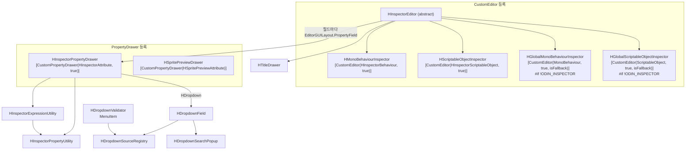
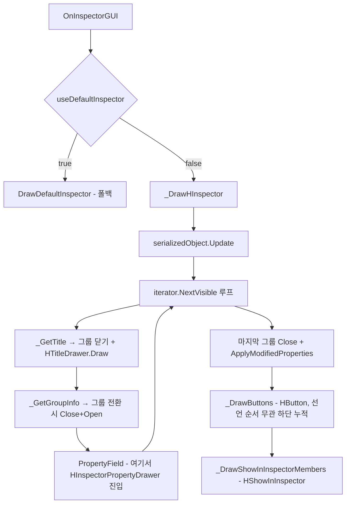
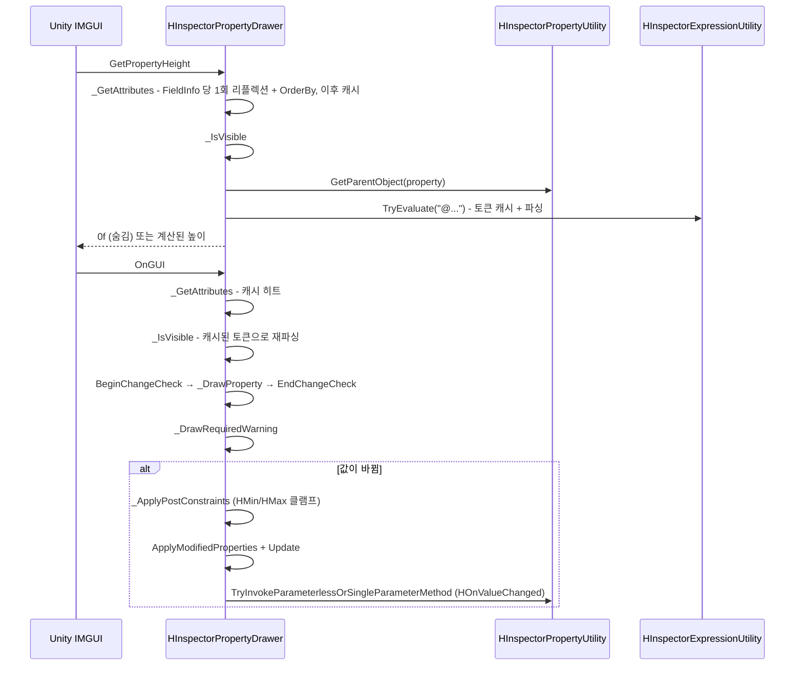
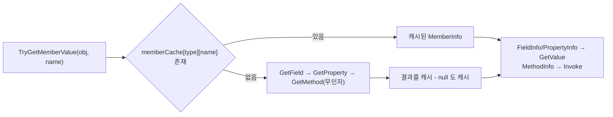
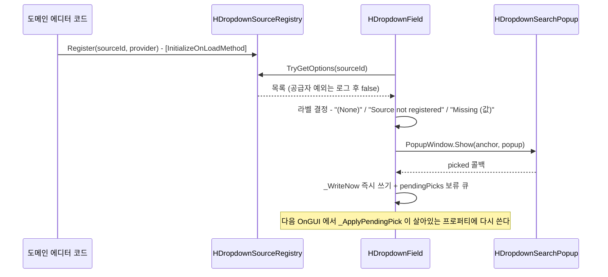

# HCUP.HInspector.Editor

> 어셈블리: `HCUP.HInspector.Editor` (`Editor/HCUP.HInspector.Editor.asmdef`, rootNamespace `HInspector.Editor`)
> 의존: `HCUP.HInspector`, `HCUP.HDiagnosis`, `Unity.Addressables`, `Unity.ResourceManager` (`includePlatforms: ["Editor"]`)
> 동반 어셈블리: `HCUP.HInspector`(어트리뷰트 정의), `HCUP.HInspector.Odin.Editor`(Odin 번역)

---

## 요약

이 어셈블리가 HInspector 의 **실제 렌더링 전부**를 담당한다. 진입점은 세 갈래이고, 어떤
어트리뷰트가 어느 갈래로 들어가는지가 이 시스템 이해의 전부다.

1. **`HInspectorPropertyDrawer`** - `[CustomPropertyDrawer(typeof(HInspectorAttribute), true)]`
   하나가 `HInspectorAttribute` 파생 **전체**를 받는다. 필드 단위 처리.
2. **`HInspectorEditor`** - `CustomEditor` 베이스. `HTitle` / `HButton` / `HShowInInspector`
   3종을 리플렉션으로 직접 수집하고, 그룹 레이아웃(`HBoxGroup` 등)의 여닫기를 관장한다.
3. **`HSpritePreviewDrawer`** - `HSpritePreviewAttribute` 전용 별도 드로어.

`HTitleDrawer` 는 이 중 어디에도 속하지 않는 **public IMGUI 헬퍼**다. `SettingsProvider` /
`IMGUIContainer` 등 CustomEditor 경로 밖에서 `HTitle` 과 같은 시각 규격을 쓰기 위한 것이고,
실제로 `HDeploy` 와 `HExcel`, `HWindows` 의 설정 패널이 이것을 소비한다.

`[HDropdown]` 은 드로어 경로 안의 하위 시스템이다. `HInspectorPropertyDrawer._DrawProperty` 가 `HDropdownField.Draw` 로 위임하고, `HDropdownField` 는 `HDropdownSourceRegistry` 에서 목록을 받아 `HDropdownSearchPopup` 을 연다. `HDropdownValidator` 는 메뉴 **`HCUP/Inspector/Validate Dropdown References`** 로 직렬화된 값이 아직 목록에 있는지 전수 점검한다.

---

## 파일 지도

| 경로 | 행수 | 역할 |
|---|---|---|
| `Inspector/HInspectorEditor.cs` | 528 | 추상 `CustomEditor` 베이스. 그룹 레이아웃 + 버튼 + 비직렬화 멤버 렌더 |
| `Inspector/HMonoBehaviourInspector.cs` | 36 | `HInspectorBehaviour` 타겟 쉘 + `!ODIN_INSPECTOR` 시 전역 fallback |
| `Inspector/HScriptableObjectInspector.cs` | 35 | `HInspectorScriptableObject` 타겟 쉘 + 전역 fallback |
| `Inspector/HInspectorPropertyDrawer.cs` | 436 | `HInspectorAttribute` 파생 전체를 받는 단일 드로어 |
| `Inspector/HInspectorPropertyUtility.cs` | 342 | 리플렉션 멤버 조회(**타입별 캐시 보유**) + 타입 비교/변환 |
| `Inspector/HInspectorExpressionUtility.cs` | 560 | `@표현식` 토크나이저 + 재귀 하강 파서. 토큰·실패 캐시 보유 |
| `Inspector/HSpritePreviewDrawer.cs` | 312 | `[HSpritePreview]` 전용 드로어. Foldout + 스프라이트 렌더 |
| `Inspector/HTitleDrawer.cs` | 96 | `HTitle` 시각 규격(볼드 라벨 + 1px 구분선)의 public 진입점 |
| `Inspector/HDropdownSourceRegistry.cs` | 132 | `[HDropdown]` 목록 등록소 (public static). `HDropdownOption` 구조체 포함 |
| `Inspector/HDropdownField.cs` | 275 | `[HDropdown]` 필드 그리기 (public static). "Missing (값)" 표시 + 선택값 쓰기 |
| `Inspector/HDropdownSearchPopup.cs` | 466 | `PopupWindowContent` 기반 검색 + 계층 목록 팝업 (internal) |
| `Inspector/HDropdownValidator.cs` | 266 | 프리팹·ScriptableObject·열린 씬의 `[HDropdown]` 값 전수 점검 메뉴 |

---

## 에디터 선택 계층



**Odin 유무가 등록 집합을 바꾼다.** `#if !ODIN_INSPECTOR` 로 감싼 전역 fallback 두 개는
Odin 이 있으면 컴파일되지 않아 Odin 과 경쟁하지 않는다
(`HMonoBehaviourInspector.cs:27-34`, `HScriptableObjectInspector.cs:27-33`).

`HInspectorEditor` 는 BoxGroup 헤더를 그릴 때 `HTitleDrawer._DrawTitleCore` 를, 독립 타이틀을 그릴 때 `HTitleDrawer.Draw` 를 호출한다 (`HInspectorEditor.cs:398-408`).

---

## 어트리뷰트 → 처리 주체 매칭

**HInspector 전체에서 이 표가 유일한 정본이다.** Runtime 쪽 문서는 이 절을 링크한다.

| 어트리뷰트 | 처리 주체 | 처리 지점 |
|---|---|---|
| `HShowIf` / `HHideIf` | `HInspectorPropertyDrawer` | `_IsVisible` (`:105-129`) - 높이 0 반환으로 숨김 |
| `HEnableIf` | `HInspectorPropertyDrawer` | `_EvaluateReadOnly` → `_EvaluateEnableIf` (`:159-176`) |
| `HReadOnly` | `HInspectorPropertyDrawer` | `_EvaluateReadOnly` (`:131-157`) |
| `HLabelText` / `HHideLabel` | `HInspectorPropertyDrawer` | `_ResolveLabel` (`:178-186`) |
| `HDropdown` | `HInspectorPropertyDrawer` → `HDropdownField` | `_DrawProperty` (`:266-273`) - 다른 그리기보다 먼저 분기 |
| `HMinMaxSlider` | `HInspectorPropertyDrawer` | `_DrawMinMaxSlider` (`:284-335`) - Vector2/float/int |
| `HMin` / `HMax` | `HInspectorPropertyDrawer` | `_ApplyPostConstraints` (`:337-388`) - **변경 후** 클램프 |
| `HRequired` | `HInspectorPropertyDrawer` | `_DrawRequiredWarning` (`:201-214`) |
| `HOnValueChanged` | `HInspectorPropertyDrawer` | `_ProcessOnValueChanged` (`:390-404`) |
| `HListDrawer` | `HInspectorPropertyDrawer` | `_ApplyListDrawerState` (`:406-422`) + `_EvaluateReadOnly` 의 `IsReadOnly` (`:133`) - **2개 옵션만** |
| `HBoxGroup` / `HHorizontalGroup` / `HVerticalGroup` | `HInspectorEditor` | `_GetGroupInfo` (`:410-433`) |
| `HTitle` | `HInspectorEditor` | `_GetTitle` (`:385-396`) → `HTitleDrawer.Draw` |
| `HButton` | `HInspectorEditor` | `_CollectButtonMethods` (`:358-364`) / `_BuildButtonMethods` (`:366-383`) |
| `HShowInInspector` | `HInspectorEditor` | `_CollectShowInInspectorMembers` (`:281-287`) / `_BuildShowInInspectorMembers` (`:289-313`) |
| `HSpritePreview` | `HSpritePreviewDrawer` | 별도 `CustomPropertyDrawer` |

### 매칭 규칙 3가지

1. **`HInspectorAttribute` 파생이면 드로어, 아니면 CustomEditor.** `[CustomPropertyDrawer(..., true)]`
   의 `useForChildren: true` 가 파생 전체를 한 드로어로 모은다. `HTitle` / `HButton` /
   `HShowInInspector` 는 `System.Attribute` 직접 상속이라 이 경로에 없다.
2. **그룹 어트리뷰트는 드로어가 볼 수 없다.** 그룹은 여러 필드에 걸친 `Begin*/End*` 쌍이므로
   단일 필드만 보는 `PropertyDrawer` 로는 표현 불가다. `HInspectorEditor` 가
   `SerializedProperty` 이터레이션 중에 그룹 경계를 계산한다.
3. **`HTitle` 은 그룹보다 강하다.** 타이틀을 만나면 열려 있는 그룹을 먼저 닫고 타이틀을 그린 뒤 필드의 그룹을 새로 연다 (`HInspectorEditor.cs:112-126`). 그래서 타이틀은 항상 그룹 경계 밖에 있다.

### 렌더 순서



`useDefaultInspector` 는 **`OnEnable` 에서 1회만** 판정된다 (`HInspectorEditor.cs:82-85`). H-어트리뷰트가 하나도 없으면(`_HasAnyHInspectorAttribute`) 이후 전부 `DrawDefaultInspector` 로 빠진다 - 전역 fallback 등록이 일반 `MonoBehaviour` 를 방해하지 않는 이유다.

`_DrawButtons` 는 버튼을 누르면 `Undo.RecordObjects(targets, label)` 후 선택된 모든 대상에서 메서드를 부르고 `EditorUtility.SetDirty` 한다 (`HInspectorEditor.cs:203-216`). 메서드가 던진 `TargetInvocationException` 은 `Debug.LogException` 으로 남기고 인스펙터 그리기는 계속한다.

---

## 드로어 내부 흐름

`GetPropertyHeight` 와 `OnGUI` 는 **같은 전처리를 각각 수행한다.** 어트리뷰트 배열과 표현식 토큰은 캐시되므로, 두 번째 호출부터 재계산되는 것은 멤버 값 조회와 파서 실행이다.



`HMin` / `HMax` 는 **입력을 막지 않고 입력 후 값을 되돌린다.** 슬라이더가 아니라 사후 클램프이므로,
`HMinMaxSlider` 와 병용하면 슬라이더가 이미 클램프한 값을 한 번 더 클램프한다(무해).

---

## 표현식 평가 (`HInspectorExpressionUtility`)

`@` 로 시작하는 조건 문자열은 손으로 쓴 토크나이저 + 재귀 하강 파서로 평가된다.
외부 라이브러리도, `Roslyn` 도 쓰지 않는다.

| 요소 | 지원 |
|---|---|
| 리터럴 | 정수(`long`) / 실수(`double`) / 문자열(`"..."`, `'...'`) / `true` `false` / `null` |
| 식별자 | 필드 / 프로퍼티 / **파라미터 없는 메서드**, `this.` 접두 허용 |
| 비교 | `==` `!=` `>` `<` `>=` `<=` |
| 논리 | `&&` `\|\|` `!`, 괄호 |
| enum | 상대편이 enum 이면 미해결 식별자를 enum 값으로 승격 (`_ResolveEnumLiteralIfNeeded`, `:247-271`) |

**연산자 우선순위는 `Or → And → Equality → Relational → Unary → Primary` 다** (`HInspectorExpressionUtility.cs:81-197`). 산술 연산(`+` `-` `*` `/`)은 **없다** - 토크나이저가 `-` 를 숫자 앞에서만 인식하고(`:476`), 그 외 위치의 `-` 는 "Invalid character" 예외가 된다 (`:511`).

미해결 식별자는 `IdentifierLiteral` 로 감싸 반환되고, `_ToBool` 에서 항상 `false` 로 접힌다 (`:280-281`). 즉 **오타 난 멤버명은 조건을 false 로 만들어 필드를 숨긴다.** 이 무음 실패를 드러내기 위해 파싱 실패 시 표현식당 1회 경고를 남긴다.

```csharp
// HInspectorExpressionUtility.cs:347-357 (경고 메시지 일부 생략)
catch (Exception e) {
    // 무음 삼킴은 멤버 오타·문법 오류 시 인스펙터 필드가 이유 없이 사라지게 만든다.
    parseFailureCache.Add(expression);
    if (warnedExpressions.Add(expression)) {
        UnityEngine.Debug.LogWarning(
            $"[HInspector] Expression evaluation failed ... expression='{expression}' :: {e.Message}");
    }
    result = false;
    return false;
}
```

캐시는 셋이고 전부 표현식 문자열을 키로 한다 (`:9-23`).

| 캐시 | 담는 것 | 이유 |
|---|---|---|
| `tokenCache` | 토큰 리스트. 토큰화 실패면 `null` | 토큰화는 대상 오브젝트와 무관하다. `GetPropertyHeight` + `OnGUI` 가 프레임당 각각 돌아 재스캔·재할당을 막는다 |
| `parseFailureCache` | 파싱 예외가 난 표현식 | 파서 예외는 토큰 구조 문제라 대상과 무관하게 항상 재현된다. 재시도하지 않는다 |
| `warnedExpressions` | 경고를 이미 남긴 표현식 | 파싱이 프레임당 2회 이상 불리므로 경고를 1회로 억제한다 |

파싱(멤버 해석)은 대상 오브젝트에 따라 결과가 달라지므로 캐시하지 않는다.

---

## 멤버 조회 캐시

`HInspectorPropertyUtility._GetCachedMember` 는 `Dictionary<Type, Dictionary<string, MemberInfo>>`
로 조회 결과를 **영구 캐시**한다. 실패(`null`)도 캐시한다 (`:274`).



**조회 순서는 필드 → 프로퍼티 → 메서드다** (`:256-272`). 같은 이름의 필드와 프로퍼티가 함께
있으면 필드가 이긴다.

`GetParentObject` 는 `propertyPath` 를 `.Array.data[` → `[` 로 정규화한 뒤 마지막 요소 직전까지 따라간다 (`:21-30`). 그래서 **리스트 원소 안의 필드에 붙은 조건 어트리뷰트도 동작한다** - 부모가 리스트 원소 객체로 해석되기 때문이다.

---

## `HDropdown` - 등록소와 필드



| 멤버 | 접근 | 동작 |
|---|---|---|
| `HDropdownSourceRegistry.Register(sourceId, provider)` | `public` | 덮어쓰기 허용. 빈 ID·null 공급자는 `HLogger.Error` 후 무시 (`HDropdownSourceRegistry.cs:50-63`) |
| `HDropdownSourceRegistry.TryGetOptions` | `public` | 미등록이면 `false`. 공급자 예외를 격리해 로그 후 `false` (`:77-93`) |
| `HDropdownSourceRegistry.TryGetLabel` | `public` | 값에 대응하는 라벨. 없으면 `false` (`:96-108`) |
| `HDropdownField.Draw` | `public` | `int` 가 아니면 기본 필드 + "[HDropdown] int only" (`HDropdownField.cs:40-83`) |
| `HDropdownValidator.Validate` | `public`, `MenuItem` | 프리팹·ScriptableObject·열린 씬을 훑고 닫힌 씬 수를 결과에 표기 (`HDropdownValidator.cs:62-76`) |

`HDropdownSearchPopup` 은 검색어가 없으면 라벨의 `/` 를 폴더로 접는 계층 모드, 검색어가 있으면 매칭된 잎만 전체 라벨로 보여주는 평탄 모드로 그린다. 항목 수가 `SearchThreshold` 이하이면 검색 필드를 그리지 않는다 (`HDropdownSearchPopup.cs:11-17`).

---

## `HTitleDrawer` - 외부 공개 API

`HTitle` 의 시각 규격을 CustomEditor 밖에서 재사용하기 위한 유일한 진입점이다.

```csharp
using HInspector.Editor;

void OnGUI(string searchContext) {
    HTitleDrawer.Draw("Snap Settings");     // 볼드 라벨 + 3px 간격 + 1px 구분선 + 4px 간격
    EditorGUILayout.PropertyField(...);
}
```

| 멤버 | 접근 | 용도 |
|---|---|---|
| `Draw(string)` | `public` | 레이아웃 흐름에 타이틀 블록 삽입 (상단 패딩 6px 포함) |
| `_DrawTitleCore(Rect, string)` | `internal` | 주어진 Rect 안에 그리기. `HInspectorEditor` 의 BoxGroup 헤더가 사용 |
| `_GetTitleBlockHeight()` | `internal` | 블록 높이 계산 |

시각 상수(`TITLE_TOP_PADDING` 6f / `TITLE_TO_LINE_GAP` 3f / `TITLE_LINE_THICKNESS` 1f /
`TITLE_LINE_TO_FIELD_GAP` 4f)는 전부 `const` 이고 외부에서 바꿀 수 없다 (`HTitleDrawer.cs:32-35`).

**패키지 밖 소비처**: `HDeploy.Vercel.VercelDeployWindow`(4곳), `HExcel.Core.Editor.ExcelLoaderEditor`(5곳),
`HWindows.Editor.NodeWindow.Settings.NodeWindowSettingsProvider`(1곳). 이들 asmdef 가
`HCUP.HInspector.Editor` 를 참조하는 이유가 대부분 이 클래스 하나다.

---

## 주의할 점

### 계약

1. **`_IsVisible` 이 false 면 높이가 0 이 되고 `OnGUI` 가 아무것도 그리지 않는다.** 숨김은
   레이아웃 제거가 아니라 "높이 0 + 무렌더"다. `EditorGUILayout` 흐름에는 여전히 항목이
   존재하므로, 인접 항목 간 간격이 미세하게 남는 경우가 있다.
2. **조건 평가에 실패하면 `HShowIf` 는 숨기고 `HHideIf` 는 무시한다.** `_IsVisible` 에서 `HShowIf` 는 평가 실패 시 `return false`(숨김), `HHideIf` 는 `continue`(다음 어트리뷰트)로 갈린다 (`HInspectorPropertyDrawer.cs:109-126`). 비대칭이지만 "확실하지 않으면 감춘다"는 보수적 선택이다.
3. **`HReadOnly(조건)` 은 조건 조회 실패 시 잠근다.** `TryGetMemberValue` 실패도, bool 이 아닌 값도 전부 `return true`(읽기 전용)로 수렴한다 (`:145-156`).
4. **`_ApplyListDrawerState` 의 `DefaultExpandedState` 는 세션당 1회만 적용된다.** `instanceID:propertyPath` 키를 `static HashSet` 에 남겨 이후 프레임의 사용자 조작을 존중한다 (`:416-421`). 이 HashSet 은 비워지지 않으므로 에디터 세션 동안 계속 자란다(항목당 수십 바이트).
5. **`HSpritePreviewDrawer` 의 Addressables 핸들은 의도적으로 해제하지 않는다** (`HSpritePreviewDrawer.cs:167`, 근거는 헤더 `:14`). 해제하면 refcount 0 → 텍스처 언로드 → 미리보기가 깨진다. 에디터 세션 동안 누적된다.
6. **`[HButton]` 메서드가 계층을 바꾸면 스스로 Undo 를 등록해야 한다.** `Undo.RecordObjects` 는 대상의 직렬화 필드 스냅샷만 기록한다. `Instantiate` / `DestroyImmediate` / 컴포넌트 추가는 버튼 메서드 안에서 `Undo.RegisterCreatedObjectUndo` / `Undo.DestroyObjectImmediate` 를 불러야 Undo 스택에 남는다 (`HInspectorEditor.cs:197-203`).
7. **`HDropdownSourceRegistry` 는 정적 상태라 도메인 리로드마다 비워진다.** 등록은 `[InitializeOnLoadMethod]` 로 해야 리로드 후 복구된다. 공급자는 호출마다 실행되므로 비싼 스캔은 공급자 쪽에서 캐시한다 (`HDropdownSourceRegistry.cs:16-19`).
8. **`HDropdownValidator` 는 닫힌 씬을 점검하지 않는다.** 점검하지 못한 씬 수를 결과 마지막 줄에 표기한다 (`HDropdownValidator.cs:229-232`). 값 0 은 `AllowNone` 필드에서 결함으로 보지 않는다 (`:169`).

### 정리 대상 - 성능

IMGUI 는 한 프레임에 Layout/Repaint 이벤트로 `OnInspectorGUI` 를 최소 2회 호출하므로, "프레임당"은 실제로 그 배수가 된다.

9. **`_GetTitle` / `_GetGroupInfo` 는 `FieldInfo` 조회만 캐시하고 어트리뷰트 조회는 매번 다시 한다.** `_FindField` 는 `(Type, fieldName)` 캐시를 쓰지만(`HInspectorEditor.cs:435-449`), 이어지는 `GetCustomAttributes` 는 가시 프로퍼티마다 `_GetTitle` 에서 1회(`:392`), `_GetGroupInfo` 에서 최대 3회(`:417-428`) 호출되고 매번 새 `object[]` 를 할당한다.

---

## 확장 지점

| 하고 싶은 것 | 손댈 곳 |
|---|---|
| 새 필드 어트리뷰트 렌더 | `HInspectorPropertyDrawer._DrawProperty` 분기 + 필요 시 `GetPropertyHeight` 가산 |
| 새 베이스 타입에 CustomEditor 등록 | `HInspectorEditor` 상속 빈 쉘 + `[CustomEditor]` + `[CanEditMultipleObjects]` |
| 표현식 문법 확장 (산술 등) | `HInspectorExpressionUtility._Tokenize` 토큰 추가 + `Parser` 에 우선순위 레벨 삽입 |
| `HShowInInspector` 지원 타입 추가 | `HInspectorEditor._DrawReadOnlyValue` 의 타입 분기 (`:315-356`) |
| 타이틀 시각 규격 변경 | `HTitleDrawer` 의 `TITLE_*` 상수 - **단일 위치** |
| 스프라이트 탐색 경로 추가 | `HSpritePreviewDrawer._LoadFromKey` / `_LoadFromObject` |
| 드롭다운 목록 공급 | 도메인 에디터 코드에서 `HDropdownSourceRegistry.Register` 호출 |
| 드롭다운 팝업 동작 변경 | `HDropdownSearchPopup` (행 높이·최대 높이 상수, 키 입력 처리) |

---

## 히스토리

### 2026-09-04 :: HDropdown 비-Odin 경로를 검색 팝업으로 교체

- 이전: 비-Odin 경로의 `[HDropdown]` 은 `HDropdownSelector`(UnityEditor `AdvancedDropdown` 기반)로 그렸다. `AdvancedDropdown` 이 검색 관련 멤버를 공개하지 않아 `SearchThreshold` 가 비-Odin 경로에 반영되지 않았다.
- 현재: `HDropdownSelector` 를 삭제하고 `PopupWindowContent` 기반 `HDropdownSearchPopup` 을 추가했다. 검색 필드와 `/` 계층 접기를 직접 그리고 `SearchThreshold` 로 검색 필드 표시를 정한다.

### 2026-08-07 :: 에디터 캐시 도입 (성능 지적 해소)

- 이전: `HInspectorPropertyDrawer._GetAttributes()` 가 `GetPropertyHeight` 와 `OnGUI` 양쪽에서 매번 `GetCustomAttributes` + LINQ 체인을 돌렸다. `@표현식` 은 매 호출 재토큰화됐다. `HSpritePreviewDrawer._LoadFromObject` 는 `Texture2D` 전용 에셋에 대해 매 `OnGUI` 마다 새 `Sprite` 를 만들었다. `HInspectorEditor` 는 매 `OnInspectorGUI` 마다 버튼·`HShowInInspector` 멤버를 타입 계층 전체에서 재수집했고, `_FindField` 가 가시 프로퍼티마다 계층을 다시 훑었다.
- 현재: `FieldInfo` 별 어트리뷰트 캐시(`HInspectorPropertyDrawer.cs:24`), 표현식별 토큰·실패 캐시(`HInspectorExpressionUtility.cs:9-23`), 경로별 생성 스프라이트 캐시와 어셈블리 리로드 직전 일괄 파괴(`HSpritePreviewDrawer.cs:41-69`), 타입별 버튼·멤버 캐시와 `(Type, fieldName)` 필드 캐시(`HInspectorEditor.cs:66-74`)를 둔다.

### 2026-08-06 :: 상위 README 어트리뷰트 목록 정정

- 이전: `HInspector/README.md` 가 어트리뷰트를 8종만 나열했고, 동작 조건을 `HInspectorBehaviour` / `HInspectorScriptableObject` 상속 타겟으로만 적었다.
- 현재: 상위 README 는 전체 목록을 이 문서의 매칭표로 넘기고, Odin 미설치 환경의 전역 fallback 을 함께 적는다.
