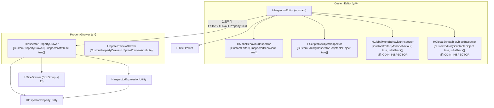
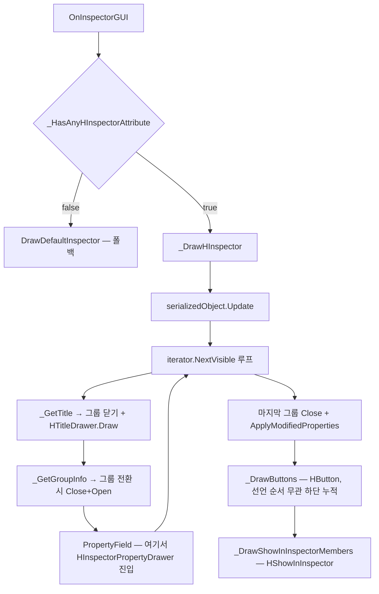
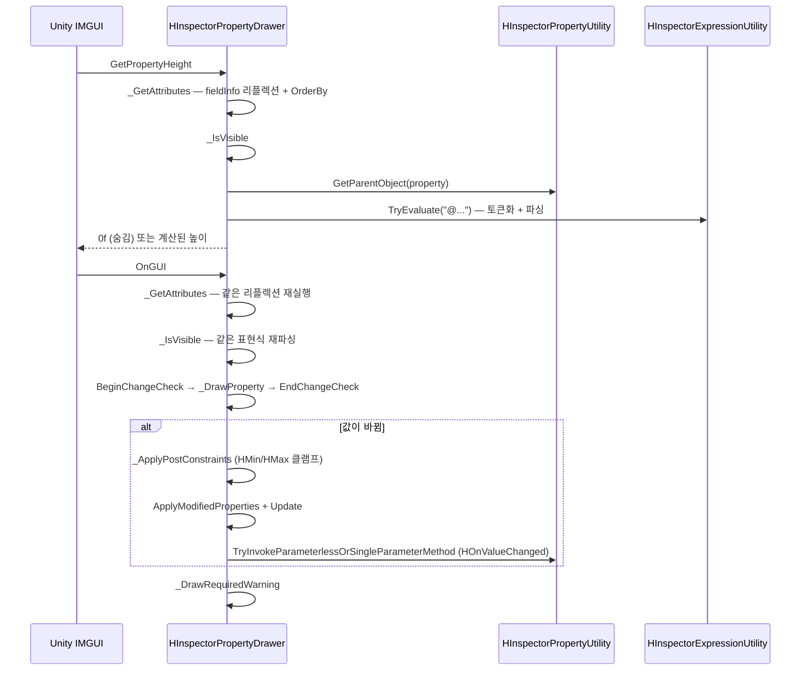
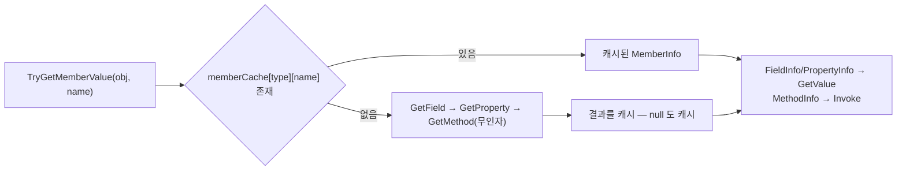

# HCUP.HInspector.Editor

> 어셈블리: `HCUP.HInspector.Editor` (`Editor/HCUP.HInspector.Editor.asmdef`, rootNamespace `HInspector.Editor`)
> 의존: `HCUP.HInspector`, `HCUP.HDiagnosis`, `Unity.Addressables`, `Unity.ResourceManager` (`includePlatforms: ["Editor"]`)
> 동반 어셈블리: `HCUP.HInspector`(어트리뷰트 정의), `HCUP.HInspector.Odin.Editor`(Odin 번역)

---

## 요약

이 어셈블리가 HInspector 의 **실제 렌더링 전부**를 담당한다. 진입점은 세 갈래이고, 어떤
어트리뷰트가 어느 갈래로 들어가는지가 이 시스템 이해의 전부다.

1. **`HInspectorPropertyDrawer`** — `[CustomPropertyDrawer(typeof(HInspectorAttribute), true)]`
   하나가 `HInspectorAttribute` 파생 **전체**를 받는다. 필드 단위 처리.
2. **`HInspectorEditor`** — `CustomEditor` 베이스. `HTitle` / `HButton` / `HShowInInspector`
   3종을 리플렉션으로 직접 수집하고, 그룹 레이아웃(`HBoxGroup` 등)의 여닫기를 관장한다.
3. **`HSpritePreviewDrawer`** — `HSpritePreviewAttribute` 전용 별도 드로어.

`HTitleDrawer` 는 이 중 어디에도 속하지 않는 **public IMGUI 헬퍼**다. `SettingsProvider` /
`IMGUIContainer` 등 CustomEditor 경로 밖에서 `HTitle` 과 같은 시각 규격을 쓰기 위한 것이고,
실제로 `HDeploy` 와 `HExcel`, `HWindows` 의 설정 패널이 이것을 소비한다.

---

## 파일 지도

| 경로 | 행수 | 역할 |
|---|---|---|
| `Inspector/HInspectorEditor.cs` | 445 | 추상 `CustomEditor` 베이스. 그룹 레이아웃 + 버튼 + 비직렬화 멤버 렌더 |
| `Inspector/HMonoBehaviourInspector.cs` | 36 | `HInspectorBehaviour` 타겟 쉘 + `!ODIN_INSPECTOR` 시 전역 fallback |
| `Inspector/HScriptableObjectInspector.cs` | 35 | `HInspectorScriptableObject` 타겟 쉘 + 전역 fallback |
| `Inspector/HInspectorPropertyDrawer.cs` | 406 | `HInspectorAttribute` 파생 전체를 받는 단일 드로어 |
| `Inspector/HInspectorPropertyUtility.cs` | 342 | 리플렉션 멤버 조회(**타입별 캐시 보유**) + 타입 비교/변환 |
| `Inspector/HInspectorExpressionUtility.cs` | 490 | `@표현식` 토크나이저 + 재귀 하강 파서 |
| `Inspector/HSpritePreviewDrawer.cs` | 207 | `[HSpritePreview]` 전용 드로어. Foldout + 스프라이트 렌더 |
| `Inspector/HTitleDrawer.cs` | 96 | `HTitle` 시각 규격(볼드 라벨 + 1px 구분선)의 public 진입점 |

---

## 에디터 선택 계층



**Odin 유무가 등록 집합을 바꾼다.** `#if !ODIN_INSPECTOR` 로 감싼 전역 fallback 두 개는
Odin 이 있으면 컴파일되지 않아 Odin 과 경쟁하지 않는다
(`HMonoBehaviourInspector.cs:27-34`, `HScriptableObjectInspector.cs:27-33`).

---

## 어트리뷰트 → 처리 주체 매칭

**HInspector 전체에서 이 표가 유일한 정본이다.** Runtime 쪽 문서는 이 절을 링크한다.

| 어트리뷰트 | 처리 주체 | 처리 지점 |
|---|---|---|
| `HShowIf` / `HHideIf` | `HInspectorPropertyDrawer` | `_IsVisible` (`:83-107`) — 높이 0 반환으로 숨김 |
| `HEnableIf` | `HInspectorPropertyDrawer` | `_EvaluateReadOnly` → `_EvaluateEnableIf` (`:137-154`) |
| `HReadOnly` | `HInspectorPropertyDrawer` | `_EvaluateReadOnly` (`:116-134`) |
| `HLabelText` / `HHideLabel` | `HInspectorPropertyDrawer` | `_ResolveLabel` (`:156-164`) |
| `HMinMaxSlider` | `HInspectorPropertyDrawer` | `_DrawMinMaxSlider` (`:254-305`) — Vector2/float/int |
| `HMin` / `HMax` | `HInspectorPropertyDrawer` | `_ApplyPostConstraints` (`:307-358`) — **변경 후** 클램프 |
| `HRequired` | `HInspectorPropertyDrawer` | `_DrawRequiredWarning` (`:179-192`) |
| `HOnValueChanged` | `HInspectorPropertyDrawer` | `_ProcessOnValueChanged` (`:360-374`) |
| `HListDrawer` | `HInspectorPropertyDrawer` | `_ApplyListDrawerState` (`:376-392`) — **2개 옵션만** |
| `HBoxGroup` / `HHorizontalGroup` / `HVerticalGroup` | `HInspectorEditor` | `_GetGroupInfo` (`:364-387`) |
| `HTitle` | `HInspectorEditor` | `_GetTitle` (`:339-350`) → `HTitleDrawer.Draw` |
| `HButton` | `HInspectorEditor` | `_CollectButtonMethods` (`:320-337`) |
| `HShowInInspector` | `HInspectorEditor` | `_CollectShowInInspectorMembers` (`:251-275`) |
| `HSpritePreview` | `HSpritePreviewDrawer` | 별도 `CustomPropertyDrawer` |

### 매칭 규칙 3가지

1. **`HInspectorAttribute` 파생이면 드로어, 아니면 CustomEditor.** `[CustomPropertyDrawer(..., true)]`
   의 `useForChildren: true` 가 파생 전체를 한 드로어로 모은다. `HTitle` / `HButton` /
   `HShowInInspector` 는 `System.Attribute` 직접 상속이라 이 경로에 없다.
2. **그룹 어트리뷰트는 드로어가 볼 수 없다.** 그룹은 여러 필드에 걸친 `Begin*/End*` 쌍이므로
   단일 필드만 보는 `PropertyDrawer` 로는 표현 불가다. `HInspectorEditor` 가
   `SerializedProperty` 이터레이션 중에 그룹 경계를 계산한다.
3. **`HTitle` 은 그룹보다 강하다.** 타이틀을 만나면 열려 있는 그룹을 먼저 닫고 타이틀을 그린 뒤
   필드의 그룹을 새로 연다 (`HInspectorEditor.cs:102-116`). 그래서 타이틀은 항상 그룹 경계 밖에 있다.

### 렌더 순서



`useDefaultInspector` 는 **`OnEnable` 에서 1회만** 판정된다 (`HInspectorEditor.cs:72-75`).
H-어트리뷰트가 하나도 없으면 이후 전부 `DrawDefaultInspector` 로 빠진다 — 전역 fallback 등록이
일반 `MonoBehaviour` 를 방해하지 않는 이유다.

---

## 드로어 내부 흐름

`GetPropertyHeight` 와 `OnGUI` 는 **같은 전처리를 각각 수행한다.**



`HMin` / `HMax` 는 **입력을 막지 않고 입력 후 값을 되돌린다.** 슬라이더가 아니라 사후 클램프이므로,
`HMinMaxSlider` 와 병용하면 슬라이더가 이미 클램프한 값을 한 번 더 클램프한다(무해).

---

## 표현식 평가 (`HInspectorExpressionUtility`)

`@` 로 시작하는 조건 문자열은 손으로 쓴 토크나이저 + 재귀 하강 파서로 평가된다.
외부 라이브러리도, `Roslyn` 도 쓰지 않는다.

| 요소 | 지원 |
|---|---|
| 리터럴 | 정수(`long`) / 실수(`double`) / 문자열(`"..."`, `'...'`) / `true` `false` / `null` |
| 식별자 | 필드 / 프로퍼티 / **파라미터 없는 메서드**, `this.` 접두 허용 |
| 비교 | `==` `!=` `>` `<` `>=` `<=` |
| 논리 | `&&` `\|\|` `!`, 괄호 |
| enum | 상대편이 enum 이면 미해결 식별자를 enum 값으로 승격 (`_ResolveEnumLiteralIfNeeded`, `:233-257`) |

**연산자 우선순위는 `Or → And → Equality → Relational → Unary → Primary` 다**
(`HInspectorExpressionUtility.cs:67-183`). 산술 연산(`+` `-` `*` `/`)은 **없다** — 토크나이저가
`-` 를 숫자 앞에서만 인식하고(`:432`), 그 외 위치의 `-` 는 "Invalid character" 예외가 된다.

미해결 식별자는 `IdentifierLiteral` 로 감싸 반환되고, `_ToBool` 에서 항상 `false` 로 접힌다
(`:266-267`). 즉 **오타 난 멤버명은 조건을 false 로 만들어 필드를 숨긴다.** 이 무음 실패를
드러내기 위해 파싱 실패 시 표현식당 1회 경고를 남긴다.

```csharp
// HInspectorExpressionUtility.cs:324-332
catch (Exception e) {
    // 무음 삼킴은 멤버 오타·문법 오류 시 인스펙터 필드가 이유 없이 사라지게 만든다.
    if (warnedExpressions.Add(expression)) {
        UnityEngine.Debug.LogWarning(
            $"[HInspector] Expression evaluation failed — field will be hidden. expression='{expression}' :: {e.Message}");
    }
    result = false;
    return false;
}
```

경고 중복 억제(`warnedExpressions`)가 필요한 이유는 아래 "정리 대상 2번"에 있다 — 파싱이
프레임당 2회 일어난다.

---

## 멤버 조회 캐시

`HInspectorPropertyUtility._GetCachedMember` 는 `Dictionary<Type, Dictionary<string, MemberInfo>>`
로 조회 결과를 **영구 캐시**한다. 실패(`null`)도 캐시한다 (`:274`).



**조회 순서는 필드 → 프로퍼티 → 메서드다** (`:256-272`). 같은 이름의 필드와 프로퍼티가 함께
있으면 필드가 이긴다.

`GetParentObject` 는 `propertyPath` 를 `.Array.data[` → `[` 로 정규화한 뒤 마지막 요소 직전까지
따라간다 (`:21-30`). 그래서 **리스트 원소 안의 필드에 붙은 조건 어트리뷰트도 동작한다** —
부모가 리스트 원소 객체로 해석되기 때문이다.

---

## `HTitleDrawer` — 외부 공개 API

`HTitle` 의 시각 규격을 CustomEditor 밖에서 재사용하기 위한 유일한 진입점이다.

```csharp
using HInspector.Editor;

void OnGUI(string searchContext) {
    HTitleDrawer.Draw("Snap Settings");     // 볼드 라벨 + 3px 간격 + 1px 구분선 + 4px 간격
    EditorGUILayout.PropertyField(...);
}
```

| 멤버 | 접근 | 용도 |
|---|---|---|
| `Draw(string)` | `public` | 레이아웃 흐름에 타이틀 블록 삽입 (상단 패딩 6px 포함) |
| `_DrawTitleCore(Rect, string)` | `internal` | 주어진 Rect 안에 그리기. `HInspectorEditor` 의 BoxGroup 헤더가 사용 |
| `_GetTitleBlockHeight()` | `internal` | 블록 높이 계산 |

시각 상수(`TITLE_TOP_PADDING` 6f / `TITLE_TO_LINE_GAP` 3f / `TITLE_LINE_THICKNESS` 1f /
`TITLE_LINE_TO_FIELD_GAP` 4f)는 전부 `const` 이고 외부에서 바꿀 수 없다 (`HTitleDrawer.cs:32-35`).

**패키지 밖 소비처**: `HDeploy.Vercel.VercelDeployWindow`(4곳), `HExcel.Core.Editor.ExcelLoaderEditor`(5곳),
`HWindows.Editor.NodeWindow.Settings.NodeWindowSettingsProvider`(1곳). 이들 asmdef 가
`HCUP.HInspector.Editor` 를 참조하는 이유가 대부분 이 클래스 하나다.

---

## 주의할 점

### 계약

1. **`_IsVisible` 이 false 면 높이가 0 이 되고 `OnGUI` 가 아무것도 그리지 않는다.** 숨김은
   레이아웃 제거가 아니라 "높이 0 + 무렌더"다. `EditorGUILayout` 흐름에는 여전히 항목이
   존재하므로, 인접 항목 간 간격이 미세하게 남는 경우가 있다.
2. **조건 평가에 실패하면 `HShowIf` 는 숨기고 `HHideIf` 는 무시한다.** `_IsVisible` 에서
   `HShowIf` 는 평가 실패 시 `return false`(숨김), `HHideIf` 는 `continue`(다음 어트리뷰트)
   로 갈린다 (`HInspectorPropertyDrawer.cs:88-103`). 비대칭이지만 "확실하지 않으면 감춘다"는
   보수적 선택이다.
3. **`HReadOnly(조건)` 은 조건 조회 실패 시 잠근다.** `TryGetMemberValue` 실패도, bool 이 아닌
   값도 전부 `return true`(읽기 전용)로 수렴한다 (`:126-134`).
4. **`_ApplyListDrawerState` 의 `DefaultExpandedState` 는 세션당 1회만 적용된다.**
   `instanceID:propertyPath` 키를 `static HashSet` 에 남겨 이후 프레임의 사용자 조작을 존중한다
   (`:386-391`). 이 HashSet 은 비워지지 않으므로 에디터 세션 동안 계속 자란다(항목당 수십 바이트).
5. **`HSpritePreviewDrawer` 의 Addressables 핸들은 의도적으로 해제하지 않는다**
   (`HSpritePreviewDrawer.cs:107`, 근거는 `:201`). 해제하면 refcount 0 → 텍스처 언로드 →
   미리보기가 깨진다. 에디터 세션 동안 누적된다.

### 정리 대상 — 성능

아래 4건은 코드에서 직접 확인한 사실이다. IMGUI 는 한 프레임에 Layout/Repaint 이벤트로
`OnInspectorGUI` 를 최소 2회 호출하므로, "프레임당"은 실제로 그 배수가 된다.

6. **`_GetAttributes()` 의 리플렉션이 `GetPropertyHeight` 와 `OnGUI` 양쪽에서 재실행된다**
   (`HInspectorPropertyDrawer.cs:22`, `:43`). `fieldInfo.GetCustomAttributes(...)` +
   `Cast` + `OrderBy` + `ToArray` 가 필드 하나당 프레임당 2회 이상 돌고, 매번 새 배열을
   할당한다. `fieldInfo` 는 드로어 인스턴스 수명 동안 불변이므로 캐시 가능하다.
7. **`@표현식` 이 프레임당 2회 파싱된다.** `_IsVisible` 이 `GetPropertyHeight`(`:23`)와
   `OnGUI`(`:44`) 양쪽에서 호출되고, 각 호출이 `HInspectorExpressionUtility.TryEvaluate` →
   `_Tokenize` + `new Parser` 를 새로 수행한다. 토큰 리스트와 `Token`/`IdentifierLiteral`
   객체가 매번 새로 할당된다. 코드 자신이 이 사실을 인정한다 —
   `HInspectorExpressionUtility.cs:8` 의 "OnGUI 에서 프레임당 2회 파싱되므로 스팸 방지가 필수".
   토큰 리스트를 표현식 문자열 키로 캐시하면 파서만 재실행하면 된다.
8. **`HSpritePreviewDrawer._LoadFromObject` 의 `Sprite.Create` 가 캐시 없이 매 `OnGUI` 마다
   새 `Sprite` 를 만든다** (`HSpritePreviewDrawer.cs:136-139`). `_LoadFromKey`(string 필드)는
   `spriteCache` 로 보호되지만, **Object 필드 경로에는 캐시가 없다.** `Texture2D` 만 있고
   `Sprite` 가 없는 에셋을 물린 필드가 인스펙터에 보이는 동안, 프레임마다 `Sprite` 인스턴스가
   생성되어 GC 대상으로 쌓인다. `AssetDatabase.GetAssetPath` + `LoadAssetAtPath` 두 번도 같은
   빈도로 호출된다.
9. **`HInspectorEditor` 가 타입 계층 전체를 매 `OnInspectorGUI` 마다 재수집한다.**
   `_CollectButtonMethods`(`:320-337`)와 `_CollectShowInInspectorMembers`(`:251-275`)는
   `BaseType` 을 타고 올라가며 `GetMethods` / `GetFields` / `GetProperties` 를 호출하고 새
   `List` 를 만든다. `_DrawHInspector` 끝에서 무조건 호출되므로(`:125-126`) 어트리뷰트가
   0개여도 전체 계층 스캔이 일어난다. 추가로 `_GetTitle`(`:102`)과 `_GetGroupInfo`(`:110`)가
   **가시 프로퍼티마다** `_FindField` 로 계층을 다시 훑는다(`:389-398`) — 필드 N개면 프레임당
   2N 회 계층 순회다. 타입별 정적 캐시가 자연스러운 해법이다.

### 정리 대상 — 문서

10. **상위 폴더 `HInspector/README.md` 의 어트리뷰트 표가 8종만 싣고 있다.** 실제 구현은 22종이며,
    `HShowIf` / `HMin` / `HMax` / `HMinMaxSlider` / `HRequired` / `HOnValueChanged` /
    `HEnableIf` / `HListDrawer` / `HLabelText` / `HSpritePreview` 가 빠져 있다. 또 "동작 조건"을
    "`HInspectorBehaviour` 또는 `HInspectorScriptableObject` 를 상속한 타겟"으로만 적고 있으나,
    Odin 미설치 환경에서는 전역 fallback 이 일반 `MonoBehaviour` / `ScriptableObject` 도 처리한다.

---

## 확장 지점

| 하고 싶은 것 | 손댈 곳 |
|---|---|
| 새 필드 어트리뷰트 렌더 | `HInspectorPropertyDrawer._DrawProperty` 분기 + 필요 시 `GetPropertyHeight` 가산 |
| 새 베이스 타입에 CustomEditor 등록 | `HInspectorEditor` 상속 빈 쉘 + `[CustomEditor]` + `[CanEditMultipleObjects]` |
| 표현식 문법 확장 (산술 등) | `HInspectorExpressionUtility._Tokenize` 토큰 추가 + `Parser` 에 우선순위 레벨 삽입 |
| `HShowInInspector` 지원 타입 추가 | `HInspectorEditor._DrawReadOnlyValue` 의 타입 분기 (`:277-318`) |
| 타이틀 시각 규격 변경 | `HTitleDrawer` 의 `TITLE_*` 상수 — **단일 위치** |
| 스프라이트 탐색 경로 추가 | `HSpritePreviewDrawer._LoadFromKey` / `_LoadFromObject` |
