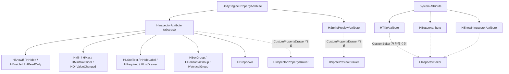

# HCUP.HInspector

> 어셈블리: `HCUP.HInspector` (`Runtime/HCUP.HInspector.asmdef`, rootNamespace `HInspector`)
> 의존: 없음 (`references: []`, `noEngineReferences: false` - UnityEngine 만 사용)
> 동반 어셈블리: `HCUP.HInspector.Editor`(드로어·CustomEditor), `HCUP.HInspector.Odin.Editor`(`ODIN_INSPECTOR` 조건부)

---

## 요약

이 어셈블리는 **어트리뷰트 정의만 담는다.** 렌더링 코드는 한 줄도 없다. 값을 읽고 그리는 일은
전부 `HCUP.HInspector.Editor` 가 하고, Odin 환경에서는 `HCUP.HInspector.Odin.Editor` 가
같은 어트리뷰트를 Odin 속성으로 번역한다.

`includePlatforms` 가 비어 있어 **플레이어 빌드에도 포함된다.** 이는 의도된 설계다 -
어트리뷰트 타입이 빌드에서 사라지면 이를 참조하는 런타임 클래스가 CS0246 으로 깨지기 때문이며,
2026.06.29 에 여러 파일의 `#if UNITY_EDITOR` 클래스 가드를 제거한 이유가 그것이다
(`HBoxGroupAttribute.cs:43-47`, `HMinAttribute.cs:32-36`).

빌드 부담은 **`[Conditional("UNITY_EDITOR")]`** 로 줄인다. 호출처(call site) IL 을 빌드에서 제거하고, 로직이 없는 순수 장식 어트리뷰트에 붙는다 (`HHideLabel` / `HLabelText` / `HTitle` / `HButton` / `HShowInInspector` / `HSpritePreview`).

**클래스 정의를 `#if UNITY_EDITOR` 로 감싼 파일은 없다.** 가드는 헤더 주석과 Dev Log 에만 쓰고 클래스 본체는 빌드에 남긴다. `[Conditional]` 은 적용부 IL 만 지울 뿐 타입 이름 해석은 컴파일 타임에 여전히 필요하므로, 클래스를 가드하면 런타임 어셈블리의 사용처가 CS0246 으로 깨진다 (`HSpritePreviewAttribute.cs:42-44`).

---

## 파일 지도

| 경로 | 역할 |
|---|---|
| `Inspector/HInspectorAttribute.cs` | 모든 필드 어트리뷰트의 추상 베이스. `PropertyAttribute` 파생 + `Order` |
| `Inspector/HCompareType.cs` | `HCompareType` - 조건 비교 6종 열거형 |
| `Inspector/HInspectorBehaviour.cs` | Odin 우회용 opt-in 베이스 `MonoBehaviour` |
| `Inspector/HInspectorScriptableObject.cs` | Odin 우회용 opt-in 베이스 `ScriptableObject` |
| `Inspector/HShowIfAttribute.cs` | 조건부 표시. 멤버명 / 비교값 / `@표현식` 3형태 |
| `Inspector/HHideIfAttribute.cs` | `HShowIfAttribute` **파생**. 논리 반전 |
| `Inspector/HEnableIfAttribute.cs` | 조건부 편집 허용. 멤버명 또는 `@표현식` |
| `Inspector/HReadOnlyAttribute.cs` | 편집 잠금. 무조건 / 조건부(`Inverse` 지원) |
| `Inspector/HRequiredAttribute.cs` | 빈 값일 때 경고 박스 |
| `Inspector/HMinAttribute.cs` / `HMaxAttribute.cs` | 값 하한 / 상한 (변경 후 클램프) |
| `Inspector/HMinMaxSliderAttribute.cs` | Min/Max 슬라이더 |
| `Inspector/HOnValueChangedAttribute.cs` | 값 변경 시 메서드 호출 |
| `Inspector/HLabelTextAttribute.cs` | 라벨 텍스트 교체 |
| `Inspector/HHideLabelAttribute.cs` | 라벨 숨김 |
| `Inspector/HListDrawerAttribute.cs` | 리스트/배열 표시 옵션 (2개 유효 + 5개 예약) |
| `Inspector/HDropdownAttribute.cs` | `int` 필드를 등록된 목록에서 고르게 한다. `SourceId` / `AllowNone` / `SearchThreshold` |
| `Inspector/HBoxGroupAttribute.cs` | 테두리 박스 그룹 |
| `Inspector/HHorizontalGroupAttribute.cs` | 가로 배치 그룹 |
| `Inspector/HVerticalGroupAttribute.cs` | 세로 배치 그룹 |
| `Inspector/HTitleAttribute.cs` | 섹션 헤더. **`System.Attribute` 직접 상속** |
| `Inspector/HButtonAttribute.cs` | 메서드 → 버튼. **`System.Attribute` 직접 상속** |
| `Inspector/HShowInInspectorAttribute.cs` | 비직렬화 멤버 노출. **`System.Attribute` 직접 상속** |
| `Inspector/HSpritePreviewAttribute.cs` | 인라인 스프라이트 미리보기. **`PropertyAttribute` 직접 상속** |

---

## 상속 계층 - 세 갈래로 갈리는 이유



**세 갈래는 우연이 아니라 각각 다른 제약에서 나왔다.**

1. `HInspectorAttribute` 파생 - `[CustomPropertyDrawer(typeof(HInspectorAttribute), true)]`
   한 개가 전부를 받는다. 필드에만 붙을 수 있고, 드로어가 필드 단위로 처리한다. `HDropdown` 이 이 계열인 이유도 같다. 독립 `PropertyAttribute` 로 두면 Unity 가 필드당 드로어를 하나만 적용해 같은 필드의 `[HShowIf]` 등과 공존하지 못한다 (`HDropdownAttribute.cs:123-125`).
2. `System.Attribute` 직접 상속 (`HTitle` / `HButton` / `HShowInInspector`) -
   **Odin 이 `PropertyAttribute` 파생을 "Field 전용"으로 사전 검증**하기 때문이다. 메서드에
   `[HTitle]` 이 붙으면 Odin 에러가 나고, 필드에 붙어도 PropertyDrawer 경로로 먼저 떨어져
   브릿지 번역이 누락된다 (`HTitleAttribute.cs:32-35`). 직접 상속이 그 검증을 우회한다.
   부수 효과로 이 3종은 `HInspectorPropertyDrawer` 가 보지 못하고 `HInspectorEditor` 가
   리플렉션으로 직접 수집한다.
3. `PropertyAttribute` 직접 상속 (`HSpritePreview`) - `HInspectorAttribute` 파생이면 `HInspectorPropertyDrawer` 의 필드 사전 검증 경로와 충돌하므로 계열 밖에 둔다 (`HSpritePreviewAttribute.cs:76-77`).

---

## `Order` 의 의미

`HInspectorAttribute.Order` 는 **드로어 안에서 어트리뷰트를 정렬하는 값**이지 렌더 순서가 아니다. `HInspectorPropertyDrawer._GetAttributes()` 가 `OrderBy(Order)` 로 정렬한 배열을 만들어 `FieldInfo` 당 1회 캐시하고 (`HInspectorPropertyDrawer.cs:80-93`), 이후 `_FindAttribute<T>()` 가 배열 앞에서부터 첫 일치를 뽑는다 (`:97-103`). 같은 종류가 여러 개 붙으면 **Order 가 작은 것이 이긴다.**

| 어트리뷰트 | 기본 Order |
|---|---|
| `HShowIf` / `HHideIf` | -100 |
| `HTitle` | -50 |
| `HBoxGroup` / `HHorizontalGroup` / `HVerticalGroup` | -40 |
| `HLabelText` / `HHideLabel` / `HListDrawer` | -30 |
| `HButton` / `HShowInInspector` / `HDropdown` | 0 |
| `HMin` / `HMax` | 100 |
| `HMinMaxSlider` | 110 |
| `HReadOnly` / `HEnableIf` | 500 |
| `HRequired` | 600 |
| `HOnValueChanged` | 1000 |

---

## 조건 표현 - 두 가지 문법

`HShowIf` / `HHideIf` / `HEnableIf` 는 생성자에서 첫 글자를 보고 문법을 스스로 가른다.

```csharp
// HShowIfAttribute.cs:33-47
public HShowIfAttribute(string condition, int order = -100) : base(order) {
    if (!string.IsNullOrEmpty(condition) && condition[0] == '@') {
        Expression = condition;   // "@level >= 10" - 표현식 평가기로
        MemberName = null;
    }
    else {
        MemberName = condition;   // "isAdvanced" - 리플렉션 멤버 조회로
        Expression = null;
    }
    ...
}
```

`@` 접두 문자열은 `HInspectorExpressionUtility` 의 토크나이저·파서로 넘어간다. 지원 문법과
한계는 [`../Editor/README.md`](../Editor/README.md#표현식-평가-hinspectorexpressionutility) 를 볼 것.

두 번째 생성자(`memberName, compareValue, compareType`)는 **표현식을 받지 않는다.**
`Expression = null` 로 고정되므로 `@`로 시작하는 문자열을 첫 인자에 넣어도 멤버명으로 취급된다
(`HShowIfAttribute.cs:49-56`).

---

## 어트리뷰트 → 드로어 매칭 규칙

어떤 어트리뷰트를 누가 처리하는지는 한 곳에 정리해 두었다 -
[`../Editor/README.md` 의 "어트리뷰트 → 처리 주체 매칭"](../Editor/README.md#어트리뷰트--처리-주체-매칭) 절.

---

## 사용 예

```csharp
using HInspector;
using UnityEngine;

public class Enemy : MonoBehaviour {          // HInspectorBehaviour 상속은 대부분 불필요
    [HTitle("Stats")]
    [HBoxGroup("Combat")] [HMin(0)] [HMax(9999)]
    public int hp;

    [HBoxGroup("Combat")] [HMinMaxSlider(0, 100)]
    public Vector2 damageRange;

    [HShowIf(nameof(isBoss))]
    [HRequired("보스 프리팹을 지정하세요")]
    public GameObject bossAura;

    public bool isBoss;

    [HShowIf("@hp > 0 && isBoss")]
    [HReadOnly]
    public float threatLevel;

    [HDropdown("Sample.Items")]               // 목록은 에디터 쪽 HDropdownSourceRegistry 에 등록한다
    [SerializeField] int dropItemUid;

    [HShowInInspector]
    public float HpRatio => hp / 9999f;       // 직렬화되지 않아도 표시된다

    [HButton("체력 초기화")]
    private void _ResetHp() => hp = 100;
}
```

---

## 주의할 점

### 계약

1. **상속은 대부분 불필요하다.** Odin 미설치 시 `HGlobalMonoBehaviourInspector` /
   `HGlobalScriptableObjectInspector` 가 `isFallback` 전역 에디터로 등록되고
   (`../Editor/Inspector/HMonoBehaviourInspector.cs:31`, `HScriptableObjectInspector.cs:30`),
   Odin 설치 시에는 브릿지가 번역한다. `HInspectorBehaviour` /
   `HInspectorScriptableObject` 상속이 실제로 필요한 경우는 **Odin 설치 환경에서 특정 타입만
   Odin 대신 HInspector 파이프라인으로 그리고 싶을 때**뿐이다.
2. **`HTitle` / `HButton` / `HShowInInspector` 는 CustomEditor 경로에서만 그려진다.** 전역
   fallback 이 없는 환경(=Odin 설치 + 브릿지 미적용 타입)에서는 무시된다.
3. **`HSpritePreviewAttribute` 는 런타임 코드에서 참조할 수 있다.** 클래스는 빌드에 남고 적용부만 `[Conditional]` 로 제거된다 (`HSpritePreviewAttribute.cs:24-29`). 클래스를 다시 `#if UNITY_EDITOR` 로 감싸면 런타임 사용처가 CS0246 으로 깨진다 (`:55-56`).
4. **`HHideIf` 는 `HShowIf` 의 파생이다** (`HHideIfAttribute.cs:21`). `OfType<HShowIfAttribute>()` 가 `HHideIf` 도 잡으므로, 소비 측은 항상 `HHideIf` 를 먼저 걸러야 한다. 실제로 `HInspectorPropertyDrawer._IsVisible` 은 `is HHideIfAttribute` 를 먼저 검사하고 (`HInspectorPropertyDrawer.cs:110`), Odin 브릿지도 `_MapHHideIf` 를 `_MapHShowIf` 앞에 둔다 (`HInspectorToOdinBridge.cs:47-48`).
5. **`HDropdown` 은 `int` 필드 전용이다.** 목록의 출처를 이 어셈블리는 모른다. `SourceId` 문자열만 들고, 실제 항목은 각 도메인이 에디터 어셈블리의 `HDropdownSourceRegistry` 에 등록한다 (`HDropdownAttribute.cs:6-9`). 음수 `searchThreshold` 는 생성자에서 0(검색 항상 표시)으로 접힌다 (`:50`).

### 정리 대상

6. **`HListDrawerAttribute` 의 5개 옵션은 `[Obsolete]` 표식만 있고 드로어가 읽지 않는다**
   (`HListDrawerAttribute.cs:40-50`). `DraggableItems` / `ShowIndexLabels` / `HideAddButton` /
   `HideRemoveButton` / `NumberOfItemsPerPage` - API 계약을 미리 고정하려는 예약 필드다.
   **Odin 환경에서는 이 값들이 실제로 적용된다** (브릿지가 `ListDrawerSettingsAttribute` 로
   전달, `HInspectorToOdinBridge.cs:296-300`). 즉 같은 코드가 Odin 유무에 따라 다르게 동작한다.
7. **`HOnValueChangedAttribute.IncludeChildren` 은 HInspector 드로어가 읽지 않는다**
   (`HOnValueChangedAttribute.cs:18-21`). `BeginChangeCheck` 가 자식 변경까지 감지하므로 기본
   동작이 `true` 와 동치이고, 이 필드는 Odin 브릿지 전달용으로만 존재한다.
8. **`HHorizontalGroupAttribute` 의 헤더 주석이 `HBoxGroup(추후)` 라고 적고 있다**
   (`HHorizontalGroupAttribute.cs:18`). `HBoxGroup` 은 이미 구현되어 있다 - 주석이 낡았다.
9. **`HDropdownAttribute` 의 헤더 주의사항 4 가 낡았다** (`HDropdownAttribute.cs:24-27`). "`SearchThreshold` 는 Odin 렌더러에서만 반영되고 비-Odin 경로는 `AdvancedDropdown` 이라 검색창을 띄울 수 없다" 고 적고 있으나, 현재 비-Odin 경로의 `HDropdownField` 는 자체 팝업 `HDropdownSearchPopup` 을 열고 `SearchThreshold` 로 검색 필드 표시를 정한다.

---

## 확장 지점

| 하고 싶은 것 | 손댈 곳 |
|---|---|
| 새 필드 어트리뷰트 추가 | `HInspectorAttribute` 상속 + `HInspectorPropertyDrawer` 에 처리 분기 추가 |
| 새 메서드/프로퍼티 어트리뷰트 | `System.Attribute` 직접 상속 + `HInspectorEditor._Collect*` 에 수집 루프 추가 |
| Odin 환경 동작 맞추기 | `HInspectorToOdinBridge._MapAll` 에 매핑 메서드 추가 |
| 조건 비교 연산 추가 | `HCompareType` 에 값 추가 → `HInspectorPropertyDrawer._TryEvaluateCondition` + `HInspectorExpressionUtility.Parser._Compare` 양쪽 switch |
| 리스트 옵션 실구현 | `HListDrawerAttribute` 의 `[Obsolete]` 제거 + `HInspectorPropertyDrawer._ApplyListDrawerState` 확장 |
| 새 드롭다운 목록 | 에디터 어셈블리에서 `HDropdownSourceRegistry.Register(sourceId, provider)` 를 `[InitializeOnLoadMethod]` 로 호출 |

---

## 히스토리

### 2026-08-13 :: HSpritePreviewAttribute 클래스 가드 해제

- 이전: 2026-05-13 부터 `HSpritePreviewAttribute` 만 클래스 본체까지 `#if UNITY_EDITOR` 로 감쌌다. 런타임 어셈블리에서 참조할 수 없었고, 런타임 사용처가 생기자 플레이어 빌드가 CS0246 으로 실패했다.
- 현재: 헤더 주석만 가드하고 클래스 본체는 빌드에 남긴다. 적용부는 `[Conditional("UNITY_EDITOR")]` 로 계속 제거된다.

### 2026-08-07 :: CompareType.cs 를 HCompareType.cs 로 개명

- 이전: 열거형 `HCompareType` 이 `Inspector/CompareType.cs` 에 있었다.
- 현재: 파일명을 H 접두 규칙에 맞춰 `Inspector/HCompareType.cs` 로 바꿨다.
