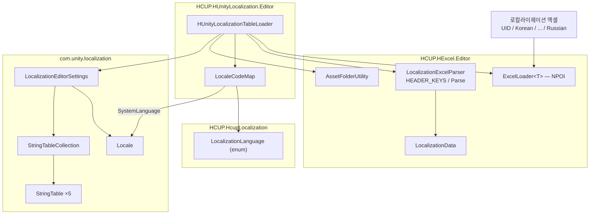
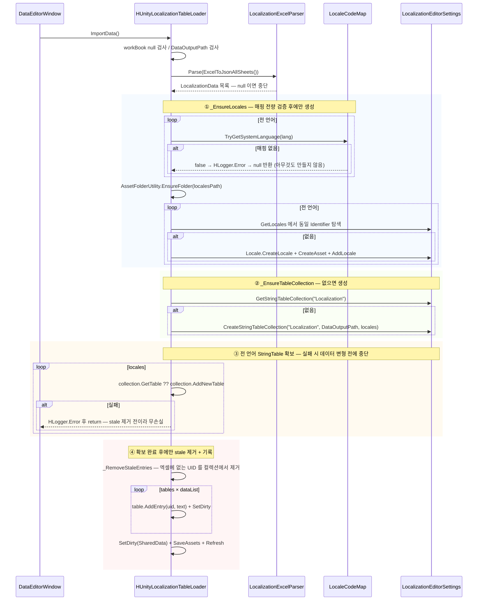
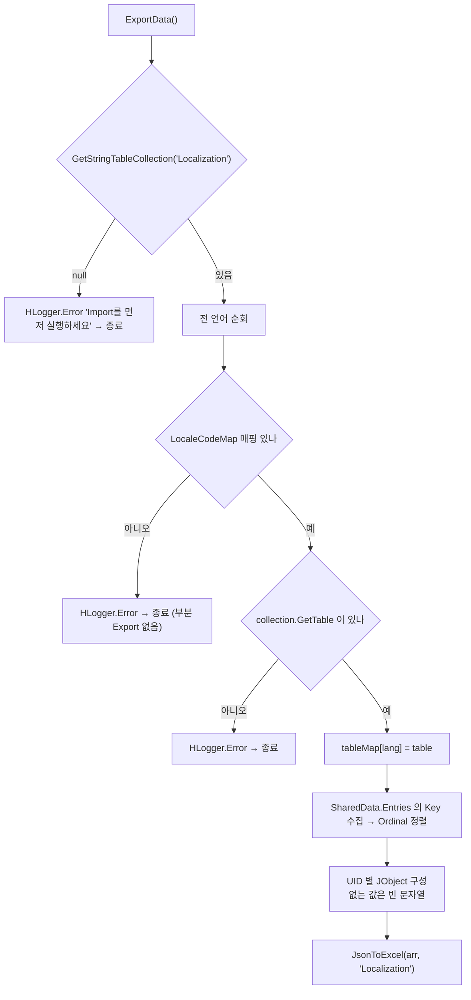

# HCUP.HUnityLocalization.Editor

> 어셈블리: `HCUP.HUnityLocalization.Editor` (`HUnityLocalization/Editor/HCUP.HUnityLocalization.Editor.asmdef`, rootNamespace `HUnityLocalization`, `includePlatforms: ["Editor"]`)
> 의존: `HCUP.HExcel.Editor`, `HCUP.HcupLocalization`, `HCUP.HDiagnosis`, `Unity.Localization`, `Unity.Localization.Editor`
> 컴파일 조건: `defineConstraints: ["HCUP_UNITY_LOCALIZATION"]` + `versionDefines` — `com.unity.localization` `[1.5, 999.0.0]` 설치 시 자동 정의
> 동반 어셈블리: `HCUP.HcupLocalization` (별개 시스템 — 아래 "두 시스템의 선택" 참조)

---

## 요약

`HUnityLocalization` 은 **엑셀 → Unity 네이티브 Localization 데이터 파이프라인**이다.
런타임 코드가 없다. 어셈블리 전체가 에디터 전용이고, 하는 일은 하나다 —
**로컬라이제이션 엑셀을 `Locale` 5개 + `StringTableCollection` 1개로 변환한다.**

변환이 끝나면 이 어셈블리의 역할은 종료된다. **런타임 소비는 Unity 네이티브 API
(`LocalizationSettings`, `LocalizeStringEvent`)가 직접 담당하고, 이 어셈블리를 거치지
않는다.**

### 두 시스템의 선택

`HLocalization/` 우산 폴더 아래에는 **서로 독립적인 두 어셈블리**가 있다.

| | `HCUP.HUnityLocalization.Editor` (이 문서) | `HCUP.HcupLocalization` |
|---|---|---|
| 성격 | Unity Localization 연동 **에디터 전용** | 자체 구현 **런타임** |
| 산출물 | `Locale` 에셋 + `StringTableCollection` | `LocalizationSO` 5개 |
| 런타임 소비 | Unity 네이티브 API (이 어셈블리 밖) | `HTextLocalizer.GetText` 델리게이트 |
| 외부 패키지 | `com.unity.localization` 1.5+ **필수** | 없음 (Addressables/UniTask 만) |
| 언어 전환 API | `LocalizationSettings.SelectedLocale` | `LocalizationManager.SwitchLanguageAsync` |
| 얻는 것 | Smart String, Locale 자동 감지, 폰트/에셋 테이블, Addressables 통합 | 의존 최소화, 코드 전량 소유 |

**둘은 같은 엑셀에서 출발한다.** 헤더 규격(`UID | Korean | English | Japanese | Chinese |
Russian`)과 파서(`LocalizationExcelParser.HEADER_KEYS`)를 공유하므로, 같은 파일로 어느
쪽 데이터든 만들 수 있다. 다만 **런타임 소비 경로가 완전히 달라 한 프로젝트에서 둘 다
쓸 이유는 없다.**

`LocalizationLanguage` enum 은 `HCUP.HcupLocalization` 소유다. 이 어셈블리는 그것을
참조만 하고, `LocaleCodeMap` 으로 Unity 의 `SystemLanguage` 에 매핑한다.

---

## 파일 지도

| 경로 | 행수 | 역할 |
|---|---|---|
| `HUnityLocalization/HUnityLocalizationTableLoader.cs` | 246 | 엑셀 Import / Export. `ExcelLoader<T>` 파생 |
| `HUnityLocalization/LocaleCodeMap.cs` | 48 | `LocalizationLanguage` → `SystemLanguage` 매핑 단일 소스 |

---

## 계층 구조



`HcupLocalizationTableLoader`(같은 엑셀로 `LocalizationSO` 를 만드는 쌍둥이 로더)는
`HCUP.HExcel.Editor` 소속이지 이 어셈블리가 아니다.

---

## 데이터 모델

```csharp
// LocaleCodeMap.cs:22-28 — 매직 값 금지. 언어 식별의 유일한 기준이다.
static readonly Dictionary<LocalizationLanguage, SystemLanguage> systemLanguageMap = new() {
    { LocalizationLanguage.Korean,   SystemLanguage.Korean },
    { LocalizationLanguage.English,  SystemLanguage.English },
    { LocalizationLanguage.Japanese, SystemLanguage.Japanese },
    { LocalizationLanguage.Chinese,  SystemLanguage.ChineseSimplified },
    { LocalizationLanguage.Russian,  SystemLanguage.Russian },
};
```

`LocaleIdentifier` 를 **코드 문자열(`"ko"`, `"zh-Hans"`)이 아니라
`new LocaleIdentifier(SystemLanguage)` 로 만든다.** 코드 문자열 하드코딩을 피하려는
선택이고, 결과적으로 `ko` / `en` / `ja` / `zh-Hans` / `ru` 가 자동 결정된다.

**Chinese 는 간체(`ChineseSimplified`)로 고정이다** (`:26`). 번체가 필요하면
`LocalizationLanguage` enum 자체를 확장해야 한다.

| 산출물 | 위치 | 이름 |
|---|---|---|
| `Locale` ×5 | `{dataOutputPath}/Locales/` | `{LocalizationLanguage}.asset` (예: `Korean.asset`) |
| `StringTableCollection` | `{dataOutputPath}` | `"Localization"` |
| `StringTable` ×5 | 컬렉션 내부 | `LocaleIdentifier` 별 |

---

## 흐름 1 — Import (엑셀 → Unity Localization)

**Import 는 멱등하고, 원자성을 위해 순서가 설계돼 있다.**



| 단계 | 코드 | 행 |
|---|---|---|
| 사전 검증 (workBook / DataOutputPath) | `ImportData` 도입부 | `:53-61` |
| 파싱 | `LocalizationExcelParser.Parse(ExcelToJsonAllSheets())` | `:63-64` |
| Locale 확보 | `_EnsureLocales()` | `:66-67`, `:147-187` |
| 컬렉션 확보 | `_EnsureTableCollection(locales)` | `:69-70`, `:191-201` |
| **전 테이블 선확보** | `tables` 딕셔너리 구성 | `:72-83` |
| stale 제거 | `_RemoveStaleEntries` | `:86`, `:203-214` |
| 기록 | `pair.Value.AddEntry(uid, text)` | `:88-93` |
| 저장 | `SetDirty` + `SaveAssets` + `Refresh` | `:95-98` |

### 두 번의 "선검증" 이 원자성의 핵심이다

**① `_EnsureLocales` 는 매핑 검증 루프를 Locale 생성 루프 앞으로 분리했다** (`:150-158`).
enum 이 확장됐는데 `LocaleCodeMap` 에 매핑을 안 넣으면, 검증 없이는 앞쪽 언어만 Locale
에셋으로 만들어지고 뒤에서 실패해 **고아 Locale** 이 남는다.

**② `ImportData` 는 전 언어 `StringTable` 확보를 stale 제거 앞으로 옮겼다** (`:72-83`
주석). 순서가 반대면 `AddNewTable` 이 중간에 실패했을 때 "stale 은 이미 지웠는데 일부
언어만 갱신된" 상태가 남는다. 테이블 신설은 추가적 부수효과라 무손실이다.

```csharp
// HUnityLocalizationTableLoader.cs:72-83
// 1) 모든 언어의 StringTable 을 먼저 확보 — 실패 시 데이터 변형 전에 중단 (테이블 신설은 추가적 부수효과라 무손실)
var tables = new Dictionary<LocalizationLanguage, StringTable>(locales.Count);
foreach (var pair in locales) {
    var identifier = pair.Value.Identifier;
    var table = collection.GetTable(identifier) as StringTable;
    if (table == null) table = collection.AddNewTable(identifier) as StringTable;
    if (table == null) {
        HLogger.Error($"[HUnityLocalizationTableLoader] '{identifier.Code}' StringTable 생성 실패. ...");
        return;
    }
    tables[pair.Key] = table;
}
```

### stale UID 정리

```csharp
// HUnityLocalizationTableLoader.cs:203-214 — 역방향 순회로 RemoveEntry
var sharedEntries = collection.SharedData.Entries;
for (int k = sharedEntries.Count - 1; k >= 0; k--) {
    if (importedUids.Contains(sharedEntries[k].Key)) continue;
    collection.RemoveEntry(sharedEntries[k].Id);
}
```

**엑셀에서 지운 UID 는 컬렉션에서도 사라진다.** 엑셀이 유일한 source of truth 라는 뜻이고,
Localization Tables 창에서 직접 추가한 항목은 다음 Import 때 조용히 삭제된다.

---

## 흐름 2 — Export (Unity Localization → 엑셀)



Export 도 Import 와 같은 방침이다 — **전 언어 테이블을 먼저 확보하고, 하나라도 없으면
아무것도 내보내지 않는다** (`:113-124`).

UID 를 `StringComparer.Ordinal` 로 정렬하므로(`:130`) Export 결과는 결정적이다. diff 가
의미를 갖는다.

---

## 사용 예

**코드로 호출하는 경로가 아니다.** `[DataEditorEntry("01. HUnityLocalization")]` 로
`HExcel` 의 Data Editor Window 에 항목으로 등록된다 (`:40`).

1. `HCUP/Windows/Data Editor Window` → `01. HUnityLocalization` 선택
2. 엑셀 파일 할당 (컬럼: `UID | Korean | English | Japanese | Chinese | Russian`)
3. `dataOutputPath` 지정 (예: `Assets/Data/Localization`) — **필수**
4. `ImportData()` 실행 → `{경로}/Locales/*.asset` 5개 + `Localization` 컬렉션 생성 확인

런타임에서는 이 어셈블리를 전혀 쓰지 않는다.

```csharp
// 언어 전환도 Unity 네이티브 API 다 — LocalizationManager 가 아니다
LocalizationSettings.SelectedLocale = LocalizationSettings.AvailableLocales.GetLocale(SystemLanguage.English);
```

---

## 주의할 점

### 계약

1. **`com.unity.localization` 1.5 미만 / 미설치 환경에서는 어셈블리 자체가 컴파일되지
   않는다.** `versionDefines` 가 `[1.5,999.0.0]` 범위에서만
   `HCUP_UNITY_LOCALIZATION` 을 정의하고, `defineConstraints` 가 그것을 요구한다.
2. **`dataOutputPath` 설정이 필수다** (`:58-61`). `Locale` 은
   `{dataOutputPath}/Locales/` 에, 컬렉션은 `{dataOutputPath}` 에 만들어진다. Assets
   하위의 유효한 경로여야 한다 (`:198` 에러 메시지).
3. **엑셀이 유일한 source of truth 다.** Import 는 엑셀에 없는 UID 를
   `collection.RemoveEntry` 로 제거한다 (`:203-214`). Localization Tables 창에서 직접
   넣은 항목은 다음 Import 에 사라진다.
4. **Import 는 멱등하다.** `AddEntry` 는 같은 키를 갱신하고, `Locale` 과 컬렉션은
   존재하면 재사용한다 (`:171-182`, `:192-193`).
5. **`LocalizationLanguage` enum 을 확장하면 `LocaleCodeMap` 도 반드시 확장해야 한다.**
   매핑이 없으면 Import / Export 모두 **아무것도 하지 않고** 실패한다 (`:153-156`,
   `:114-117`). 이는 부분 생성을 막기 위한 의도된 설계다.
6. **Chinese 는 간체 고정이다** (`LocaleCodeMap.cs:26`). 번체 지원은 enum 확장 경로다.
7. **`Locale` 매칭은 파일명이 아니라 `LocaleIdentifier` 비교다** (`:171-176`). 이미
   프로젝트에 같은 Identifier 의 Locale 이 있으면 그것을 재사용하고 새로 만들지 않는다 —
   에셋 파일명이 `Korean.asset` 이 아니어도 상관없다.

### 정리 대상

8. **클래스 본체가 `#if UNITY_EDITOR` 로 한 번 더 감싸여 있다** (`:42`, `:216`).
   asmdef 가 이미 `includePlatforms: ["Editor"]` 이므로 중복 가드다. 다만 파일 헤더의
   Dev Log 가 "디렉터리 관용 정합" 을 이유로 명시했으므로 의도된 중복이다.
9. **`Export` 의 언어 순회가 `Enum.GetValues` 순서에 의존한다** (`:110`, `:136`).
   `LocalizationLanguage` 항목 순서를 바꾸면 Export 엑셀의 컬럼 순서가 바뀐다. Import
   쪽은 `HEADER_KEYS` 기준이라 영향이 없어, 두 방향의 컬럼 순서 기준이 다르다.
10. **`_EnsureTableCollection` 은 기존 컬렉션의 Locale 구성을 검증하지 않는다**
    (`:191-201`). 이미 `"Localization"` 컬렉션이 있으면 그대로 반환하므로, 그 컬렉션이
    5개 언어를 다 갖고 있지 않아도 통과한다. 뒤의 `AddNewTable` 이 메워주긴 하지만,
    컬렉션 자체가 다른 목적으로 만들어진 동명 컬렉션이어도 그대로 쓴다.
11. **`ExportData` 는 `dataOutputPath` 를 검사하지 않는다** (`:103-143`). `JsonToExcel`
    이 어디에 쓰는지가 `HExcel` 쪽 규약에 달려 있고, Import 와 달리 사전 가드가 없다.
12. **`Newtonsoft.Json.Linq` 를 참조하지만 asmdef references 에 없다** (`:33`).
    `HCUP.HExcel.Editor` 를 통해 전이적으로 들어오는 것으로 보이나, 직접 참조를 명시하는
    편이 안전하다.

---

## 확장 지점

| 하고 싶은 것 | 손댈 곳 |
|---|---|
| 언어 추가 | `LocalizationLanguage` enum(`HCUP.HcupLocalization`) → `LocaleCodeMap.systemLanguageMap` (`:22-28`) → 엑셀 컬럼 |
| 중국어 번체 지원 | enum 에 `ChineseTraditional` 추가 후 `LocaleCodeMap` 매핑 (`:26` 주변) |
| 컬렉션 이름 변경 | `TABLE_COLLECTION_NAME` (`:44`) — Export 의 조회 키이기도 하다 |
| Locale 출력 폴더 변경 | `LOCALES_FOLDER_NAME` (`:45`) + `_EnsureLocales` 의 `localesPath` (`:161`) |
| stale 제거 비활성화 | `ImportData` 에서 `_RemoveStaleEntries` 호출 제거 (`:86`) |
| 엑셀 헤더 규격 변경 | `LocalizationExcelParser.HEADER_KEYS` (`HCUP.HExcel.Editor`) — 두 로더가 공유하므로 양쪽에 반영된다 |
| Data Editor Window 표시명 | `[DataEditorEntry("01. HUnityLocalization")]` (`:40`) |
