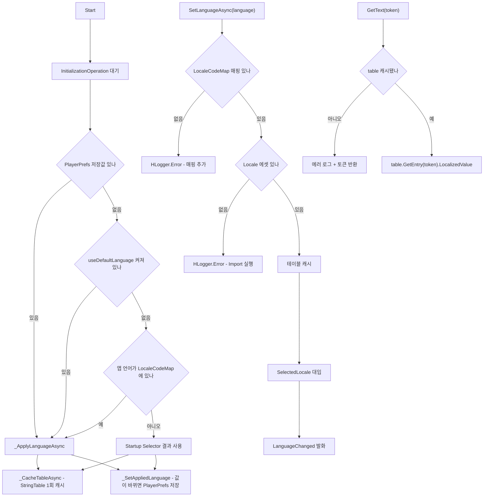

# HCUP.HUnityLocalization

> 어셈블리: `HCUP.HUnityLocalization` (`HUnityLocalization/Runtime/HCUP.HUnityLocalization.asmdef`, rootNamespace `HUnityLocalization`)
> 의존: `UniTask`, `Unity.Localization`, `Unity.ResourceManager`, `HCUP.HCore`, `HCUP.HDiagnosis`, `HCUP.HInspector`, `HCUP.HcupLocalization`
> 컴파일 조건: `defineConstraints: ["HCUP_UNITY_LOCALIZATION"]` + `versionDefines` - `com.unity.localization` `[1.5, 999.0.0]` 설치 시 자동 정의
> 동반 어셈블리: `HCUP.HUnityLocalization.Editor` (엑셀 → Locale / StringTableCollection 변환 파이프라인)

---

## 요약

Unity 네이티브 Localization 의 **언어 전환 단일 경로**와 **코드용 문자열 토큰 조회**를 담는다.

이 어셈블리가 없어도 네이티브 Localization 은 동작한다. `LocalizeStringEvent` 로 배선된 UI 는
`LocalizationSettings.SelectedLocale` 만 바뀌면 스스로 갱신된다. 이 어셈블리가 메우는 것은 그
경로가 답하지 못하는 두 가지다.

1. **전환 경로가 흩어진다.** 씬마다 코드마다 `SelectedLocale` 을 직접 대입하면 전환 시점에
   함께 해야 할 일(폰트 교체 등)을 걸 지점이 없다.
2. **동적 값이 끼는 문자열은 배선으로 만들 수 없다.** `{count}개` 처럼 값이 런타임에 정해지는
   문자열은 코드가 토큰을 조회해 조립해야 한다.

## 파일 지도

| 경로 | 역할 |
|---|---|
| `HUnityLocalization/UnityLocalizationManager.cs` | 싱글톤 매니저 + static 파사드. 전환과 토큰 조회 |
| `HUnityLocalization/LocaleCodeMap.cs` | `LocalizationLanguage` ↔ Unity 언어 식별자 매핑 단일 소스 |

Import 와 런타임 전환이 같은 매핑을 써야 하므로 `LocaleCodeMap` 은 런타임에 두고 Editor 어셈블리가 참조한다.

---

## API

| 멤버 | 성격 | 하는 일 |
|---|---|---|
| `SetLanguage(LocalizationLanguage)` | static | 전환한다. 완료를 기다리지 않는다 |
| `SetLanguageAsync(LocalizationLanguage)` | static, `UniTask<bool>` | 전환하고 테이블 준비까지 기다린다 |
| `GetText(string token)` | static | 토큰의 현재 언어 문자열. 자리표시자는 그대로 둔다 |
| `GetText(string token, params (string, object)[])` | static | 이름 있는 자리표시자를 치환한 문자열 |
| `IsReady` | static | 테이블 캐시 완료 여부 |
| `LanguageChanged` | static event | 전환이 적용된 뒤 1회 발화 |
| `DefaultLanguage` / `AppliedLanguage` / `TableName` | 인스턴스 | 등록된 기본값(미사용 시 null)과 실제 적용값 |

```csharp
// 전환 - 전역 단일 경로
await UnityLocalizationManager.SetLanguageAsync(LocalizationLanguage.English);

// 조회 - 값이 끼지 않는 문자열
string title = UnityLocalizationManager.GetText("some.token");

// 조립 - 이름 있는 자리표시자
string amount = UnityLocalizationManager.GetText("some.count_token", ("count", 3));
```

---

## 동작



### 시작 언어 결정 순서

`Start` 가 시작 언어를 정한다. 순서는 **저장값 → 매니저 기본값 → 앱(기기) 언어**다. 적용 언어가
바뀌면 그때마다 `PlayerPrefsHandler` 로 저장되므로, 두 번째 실행부터는 항상 1번 갈래로 들어온다.
세 갈래가 모두 비면(앱 언어가 `LocaleCodeMap` 에 없는 경우) 강제하지 않고 Startup Locale Selector
결과를 그대로 쓴다. 그 결과는 Localization Settings 에셋의 Startup Locale Selectors 구성 순서가 정한다. 이 경로도 `_SyncAppliedLanguage` 를 거쳐 적용 언어를 저장한다.

인스펙터에는 토글 `useDefaultLanguage` 와 언어 `defaultLanguage` 가 있다. 토글이 꺼져 있으면 2번 갈래를
건너뛰고 앱 언어를 쓴다. 매니저가 씬에 없으면 Startup Selector 가 시작 언어를 정하고, 배선된 UI
텍스트는 그대로 동작한다.

직렬화 필드에 `Nullable<T>` 를 쓰지 않는다. Odin 환경에서 직렬화된 `Nullable<enum>` 필드를 인스펙터에
그리면 `OnInspectorGUI` 에서 빠져나오지 못해 에디터가 멈추는 것을 확인했다. 선택적 값은 동반 `bool` 로
표현하고, `Nullable<T>` 는 프로퍼티 반환형으로만 쓴다.

### 조회는 동기 API 를 쓰지 않는다

`LocalizedStringDatabase.GetLocalizedString` 의 동기 오버로드는 `AsyncOperationUtility.SynchronousLoad`
를 타고, 그 구현은 `op.IsDone ? op.Result : op.WaitForCompletion()` 이다. 미로드 핸들에서는
`WaitForCompletion` 으로 떨어지고 **WebGL 은 이를 지원하지 않는다.**

그래서 전환 시점에 `StringTable` 을 캐시하고, 조회는 `GetEntry(token)` 의 메모리 조회로 끝낸다.
WebGL 안전성이 구조로 보장되고, 조회 비용이 프레임에 영향을 주지 않는다.

### 자리표시자를 직접 치환한다

Import 는 `SmartFormatTag` 메타데이터를 심지 않으므로 **생성된 엔트리는 전부 비 Smart** 다.
비 Smart 엔트리는 `string.Format` 규칙을 따르는데, 엑셀의 자리표시자는 `{0}` 이 아니라
`{count}` 같은 **이름 형태**다. 이 조합에서는 인자를 넘기면 `FormatException` 이 나고, 넘기지
않으면 중괄호가 그대로 출력된다.

`GetText(token, ("count", 3))` 는 원문을 받아 `StringBuilder.Replace` 로 직접 치환한다. 엑셀
표기와 importer 를 건드리지 않고 이름 있는 자리표시자를 쓸 수 있다.

---

## 주의할 점

1. **static 파사드는 씬에 매니저가 있어야 동작한다.** 없으면 에러 로그를 남기고 전환은 무동작,
   조회는 토큰 문자열을 반환한다. 조용한 실패를 만들지 않는다.
2. **조회 실패는 모두 토큰 반환 + 에러 로그다.** 미로드 / 키 없음 / 값이 빈 문자열 세 경우를
   각각 다른 메시지로 구분한다 (`UnityLocalizationManager.cs:307-331`). 엑셀에서 비워 둔 언어 칸은 세 번째 경우에 걸린다.
3. **테이블 이름은 Import 규약과 같아야 한다.** 기본값 `"Localization"` 은
   `HUnityLocalizationTableLoader.TABLE_COLLECTION_NAME` 과 같은 값이다. 한쪽을 바꾸면 양쪽을 바꾼다.
4. **클래스 이름이 `LocalizationManager` 가 아니다.** `HCUP.HcupLocalization` 에 같은 이름의
   매니저가 있고 두 어셈블리 모두 `autoReferenced` 라, 한 파일에서 두 네임스페이스를 함께 쓰면
   `CS0104` 가 난다. 타입 이름으로 갈래를 드러내 충돌을 없앤다.
5. **언어 선택은 `PlayerPrefsHandler` 로 보존된다.** 적용 언어가 바뀔 때마다 키
   `UnityLocalizationManager.Language` 에 저장되고 다음 실행에서 가장 먼저 복원된다.
   `PlayerPrefLocaleSelector` 는 쓰지 않는다. 그 클래스는 XML 주석과 달리 `PostInitialization` 에서
   1회만 기록하고, 평문 `PlayerPrefs` 를 쓴다. 첫 실행 이후에는 저장값이 우선하므로 OS 언어를 바꿔도
   앱 언어는 따라 바뀌지 않는다.
6. **`LocalizationLanguage` enum 을 확장하면 `LocaleCodeMap` 도 확장한다.** 매핑이 없으면
   전환이 에러 로그를 남기고 실패한다.

---

## 확장 지점

| 하고 싶은 것 | 손댈 곳 |
|---|---|
| 언어 추가 | `LocalizationLanguage` enum(`HCUP.HcupLocalization`) → `LocaleCodeMap.systemLanguageMap` |
| 전환 시 폰트 교체 | `UnityLocalizationManager.LanguageChanged` 구독 |
| 테이블 컬렉션 이름 변경 | 매니저의 `tableName` 필드 + `HUnityLocalizationTableLoader.TABLE_COLLECTION_NAME` |
| 저장 키 변경 | `UnityLocalizationManager` 의 `PREFS_LANGUAGE_KEY` |
| 기기 언어를 다시 따르게 | 저장 키(`UnityLocalizationManager.Language`) 삭제 |
| 토큰 조회 실패 정책 변경 | `_TryGetEntryValue` (현재는 에러 로그 + 토큰 반환) |

---

## 히스토리

### 2026-09-17 :: `LocaleCodeMap` 을 Editor 에서 Runtime 으로 이동

- 이전: `LocaleCodeMap` 은 `HCUP.HUnityLocalization.Editor` 소속이었다.
- 현재: 이 어셈블리로 옮기고 역방향 조회(`TryGetLanguage(LocaleIdentifier, out LocalizationLanguage)`)를 추가했다.
