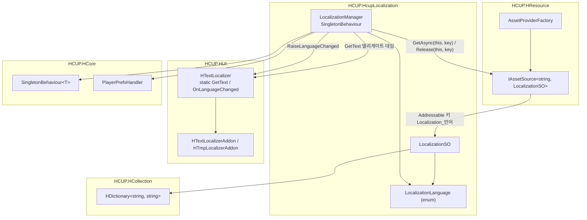
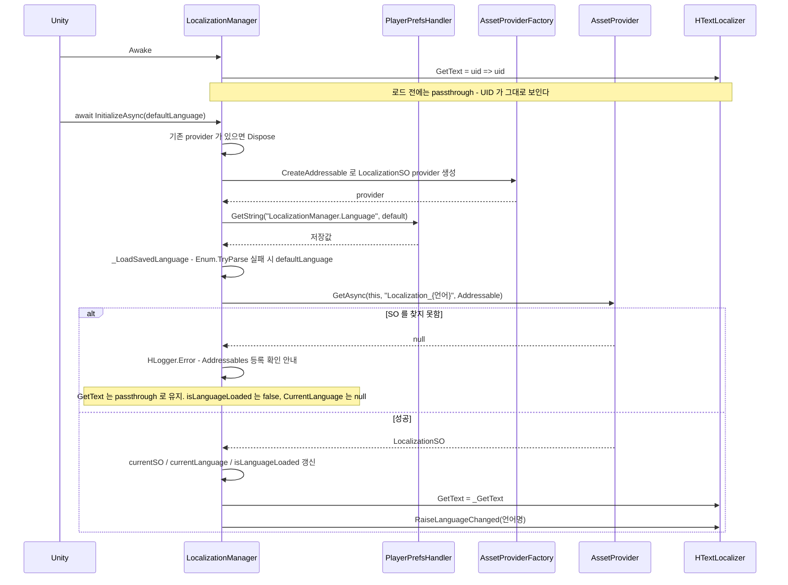
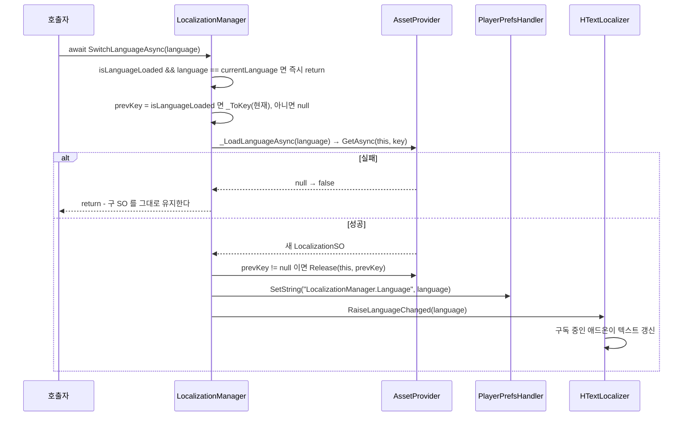
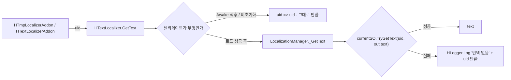

# HCUP.HcupLocalization

> 어셈블리: `HCUP.HcupLocalization` (`HcupLocalization/Runtime/HCUP.HcupLocalization.asmdef`, rootNamespace `HcupLocalization`)
> 의존: `UniTask`, `UniTask.Addressables`, `Unity.Addressables`, `Unity.ResourceManager`, `HCUP.HCore`, `HCUP.HUtil`, `HCUP.HCollection`, `HCUP.HDiagnosis`, `HCUP.HUI`, `HCUP.HResource`
> 동반 어셈블리: 없음. `HCUP.HUnityLocalization` / `HCUP.HUnityLocalization.Editor` 는 별개 시스템이다 (아래 "두 시스템의 선택" 참조)

---

## 요약

`HcupLocalization` 은 **HCUP 자체 구현 로컬라이제이션 런타임**이다. Unity 의
`com.unity.localization` 패키지를 쓰지 않고, `ScriptableObject` 하나에 언어별
`UID → 번역문` 테이블을 담아 Addressables 로 갈아 끼운다.

동작의 전부가 세 줄로 요약된다.

1. **언어 하나 = `LocalizationSO` 에셋 하나.** Addressable 키는 `Localization_{언어}` 다.
2. **`LocalizationManager` 가 현재 언어 SO 를 하나만 붙잡는다.** 전환하면 새 SO 를 완전히
   로드한 뒤 구 SO 를 해제한다.
3. **UI 는 이 어셈블리를 모른다.** `HUI.TextUI.HTextLocalizer.GetText` 델리게이트에
   `LocalizationManager` 가 자기 조회 함수를 꽂아 주는 것이 유일한 접점이다.

### 두 시스템의 선택

`HLocalization/` 우산 폴더 아래에는 **서로 독립적인 두 갈래**가 있다. 이 어셈블리가 자체 구현 갈래이고, 네이티브 갈래는 `HCUP.HUnityLocalization`(Runtime) + `HCUP.HUnityLocalization.Editor` 두 어셈블리다.

| | `HCUP.HcupLocalization` (이 문서) | `HCUP.HUnityLocalization[.Editor]` |
|---|---|---|
| 성격 | 자체 구현 **런타임** | Unity Localization 연동. **에디터 파이프라인 + 런타임 전환** |
| 런타임 소비 | `HTextLocalizer.GetText` 델리게이트 | `LocalizeStringEvent` (UI) + `UnityLocalizationManager.GetText` (코드) |
| 데이터 실체 | `LocalizationSO` (HDictionary 테이블) | `Locale` + `StringTableCollection` |
| 로드 경로 | Addressables (`Localization_{언어}`) | Unity Localization 패키지가 관리 |
| 외부 패키지 의존 | 없음 (Addressables/UniTask 만) | `com.unity.localization` 1.5+ 필수 |
| 엑셀 임포터 | `HcupLocalizationTableLoader` (`HExcel` 소재) | `HUnityLocalizationTableLoader` |

**한 프로젝트에서 둘 다 쓸 이유는 없다.** 엑셀 규격(`UID | Korean | English | Japanese |
Chinese | Russian`)과 파서(`LocalizationExcelParser`)를 공유하므로, 같은 엑셀에서 어느
쪽 데이터든 만들어낼 수 있다. Unity 네이티브 기능(Smart String, Locale 자동 감지, 폰트
에셋 테이블)이 필요하면 `HUnityLocalization`, 의존을 줄이고 싶으면 이쪽이다.

`HUnityLocalization` 은 이 어셈블리를 참조한다 - `LocalizationLanguage` enum 을 공용
언어 식별자로 쓰기 때문이다. **enum 은 이쪽이 원본이다.**

---

## 파일 지도

| 경로 | 행수 | 역할 |
|---|---|---|
| `HcupLocalization/LocalizationLanguage.cs` | 9 | 언어 enum 5종 (Korean / English / Japanese / Chinese / Russian) |
| `HcupLocalization/LocalizationSO.cs` | 80 | 언어 1개분 번역 테이블 `ScriptableObject` |
| `HcupLocalization/LocalizationManager.cs` | 199 | 싱글톤. 로드·전환·델리게이트 배선 |
| `Samples~/Localization/LocalizationSampleDriver.cs` | 104 | **컴파일되지 않음** (`Samples~`). 호출 패턴 참조용 |

---

## 계층 구조



**`HTextLocalizer` 는 `HCUP.HUI` 소속이고 이 어셈블리를 모른다.** 의존 방향이
`HcupLocalization → HUI` 단방향이라, 로컬라이제이션 없이도 UI 어셈블리가 컴파일된다.
`HTextLocalizer.GetText` 가 `null` 이면 UI 애드온은 UID 를 그대로 표시한다.

---

## 데이터 모델

```csharp
// LocalizationSO.cs:27-34
public class LocalizationSO : ScriptableObject {
    [SerializeField] LocalizationLanguage language;
    [SerializeField] HDictionary<string, string> table = new();

    public LocalizationLanguage Language => language;
    public bool TryGetText(string uid, out string text) => table.TryGetValue(uid, out text);
}
```

| 요소 | 값 |
|---|---|
| 에셋 파일명 규약 | `Localization_{언어}` (예: `Localization_Korean`) |
| Addressable 키 | 파일명과 동일 - `_ToKey` 가 `$"Localization_{language}"` 생성 (`LocalizationManager.cs:117`) |
| `CreateAssetMenu` | `HCUP/HcupLocalization/LocalizationSO` (`LocalizationSO.cs:26`) |
| 테이블 | `HDictionary<string, string>` - 중복 UID 는 3게이트가 차단 |

**런타임 공개 API 는 `Language` 와 `TryGetText` 둘뿐이다.** 나머지 5개
(`SetLanguageCode` / `SetEntry` / `ClearTable` / `GetUIDs` / `GetRawText`)는 전부
`#if UNITY_EDITOR` 안에 있다 (`LocalizationSO.cs:36-42`). 임포터 전용이다.

---

## 흐름 1 - 초기화



`Awake` 에서 먼저 passthrough 델리게이트를 꽂는 것이 중요하다 (`:60`). `InitializeAsync`
가 완료되기 전이나 실패했을 때도 UI 가 `null` 델리게이트를 만나지 않는다.

`_LoadSavedLanguage` 는 PlayerPrefs 가 손상됐거나 알 수 없는 언어명이 저장돼 있으면
`defaultLanguage` 로 폴백한다 (`:136-139`).

---

## 흐름 2 - 언어 전환

**새 SO 를 완전히 로드한 뒤에야 구 SO 를 해제한다.** 순서가 계약이다.



```csharp
// LocalizationManager.cs:90-102
public async UniTask SwitchLanguageAsync(LocalizationLanguage language) {
    // 미로드 상태에서는 종전 nullable 비교가 false 였다. isLanguageLoaded 를 함께 보아 의미를 보존한다.
    if (isLanguageLoaded && language == currentLanguage) return;

    string prevKey = isLanguageLoaded ? _ToKey(currentLanguage) : null;
    bool loaded = await _LoadLanguageAsync(language);
    if (!loaded) return;

    // 새 SO 완전히 로드된 후 구 SO 해제 (교체 간 gap 방지 + 실패 시 구 SO 유지)
    if (prevKey != null) provider.Release(this, prevKey);
    PlayerPrefsHandler.SetString(PREFS_LANGUAGE_KEY, language.ToString());
    HTextLocalizer.RaiseLanguageChanged(language.ToString());
}
```

`isLanguageLoaded` 가 따로 있는 이유가 여기서 드러난다. **"초기화 전" 과 "Korean 으로 초기화됨" 을 구분해야** `prevKey` 계산이 존재하지 않는 키를 해제하는 일을 막을 수 있다 (`:42-46`, `:94`). `currentLanguage` 는 enum 이라 항상 값(기본 `Korean`)을 가지므로 로드 여부는 동반 `bool` 이 표현한다. 외부에는 `CurrentLanguage` 프로퍼티(`LocalizationLanguage?`, 미로드 시 `null`)로 노출한다 (`:54`).

---

## 흐름 3 - 조회



**번역 누락은 절대 예외를 던지지 않는다.** 로그를 남기고 UID 자체를 반환하므로, 화면에
`UI.MAIN.PLAY` 같은 원문이 보이는 것이 누락의 신호다 (`:126-130`).

---

## 흐름 4 - 종료

```csharp
// LocalizationManager.cs:63-75
protected override void OnDestroy() {
    // base.OnDestroy() 가 instance == this 를 null 로 정리하므로, 판정은 그 전에 캡처한다.
    bool isOwner = instance == this;
    base.OnDestroy();
    if (!isOwner) return;

    HTextLocalizer.GetText = null;
    provider?.Dispose();
    provider = null;
}
```

**정리는 소유자 인스턴스일 때만 한다.** `SingletonBehaviour` 의 중복 인스턴스가 파괴되는 경로에서는 `isOwner` 가 `false` 라 살아 있는 본 인스턴스의 델리게이트와 provider 를 건드리지 않는다. provider 는 `InitializeAsync` 가 만들었으므로 폐기(`Dispose`)도 이 매니저가 맡는다.

`HTextLocalizer` 는 `static` 이므로 Domain Reload 비활성 환경에서 이전 플레이의
델리게이트가 잔존한다. `HTextLocalizer` 쪽에도 `RuntimeInitializeOnLoadMethod` 리셋이
있고(`HUI/.../HTextLocalizer.cs:12-16`), 매니저의 `OnDestroy` 가 그 이중 방어다.

---

## 사용 예

```csharp
// 1) 부트스트랩 - 씬 어딘가에서 1회
await LocalizationManager.Instance.InitializeAsync(LocalizationLanguage.Korean);

// 2) 전환 - PlayerPrefs 에 저장되고 UI 가 자동 갱신된다
await LocalizationManager.Instance.SwitchLanguageAsync(LocalizationLanguage.English);

// 3) 동적 텍스트 - 애드온 없이 직접 조회
string template = HTextLocalizer.GetText?.Invoke("MSG.WELCOME") ?? "MSG.WELCOME";
label.text = string.Format(template, playerName);
```

정적 UI 는 `HTmpLocalizerAddon` / `HTextLocalizerAddon` 을 붙이고 `localizationId` 에
UID 만 넣으면 된다 - `HTextLocalizer.OnLanguageChanged` 구독이 이미 되어 있다.

에셋 준비 절차는 `Samples~/Localization/LocalizationSampleDriver.cs:9-19` 의 체크리스트가
정본이다.

1. `HCUP/Windows/Data Editor Window` → 엑셀 할당 → `dataOutputPath` 지정 → Import
2. 생성된 5개 SO 를 Addressables 에 `Localization_{언어}` 키로 등록
3. 씬에 `LocalizationManager` 배치 + `dontDestroyOnLoad` 체크

---

## 주의할 점

### 계약

1. **`InitializeAsync` 는 반드시 1회 호출해야 한다.** 미호출 시 `HTextLocalizer.GetText` 는 `Awake` 가 꽂아 둔 passthrough 인 채로 남아 UID 가 그대로 표시된다 (`:60`). 다시 호출하면 기존 provider 를 `Dispose` 한 뒤 새로 만든다 (`:81-82`).
2. **Addressable 키 규약이 강제다.** `Localization_{언어}` (`:134`). enum 이름을 그대로 쓰므로 `LocalizationLanguage` 항목명을 바꾸면 기존 에셋 등록이 전부 깨진다.
3. **`SwitchLanguageAsync` 는 로드 실패 시 아무것도 바꾸지 않는다** (`:96`). 구 SO, 구 `currentLanguage`, 구 PlayerPrefs 값이 전부 유지된다.
4. **번역 누락은 UID 를 반환한다** (`:126-130`). 예외도, 빈 문자열도 아니다.
5. **`dontDestroyOnLoad` 는 인스펙터에서 수동으로 켜야 한다** (파일 헤더 `:14`).
   코드가 자동으로 설정하지 않는다.
6. **`LocalizationSO` 의 변경 API 는 빌드에 없다** (`LocalizationSO.cs:36-42`).
   런타임에 번역을 주입하는 경로는 존재하지 않는다.
7. **provider 점유는 매니저 컴포넌트가 소유자다.** `GetAsync(this, key, ...)` / `Release(this, prevKey)` 로 `this` 를 owner 로 넘긴다 (`:99`, `:108`).

### 정리 대상

8. **`InitializeAsync` 는 PlayerPrefs 에 쓰지 않는다** (`:79-86`). 저장은 `SwitchLanguageAsync` 만 한다 (`:100`). 첫 실행에서 기본 언어로 시작한 경우 그 선택이 저장되지 않으므로, `_LoadSavedLanguage` 는 매번 `defaultLanguage` 폴백을 탄다. 동작 자체는 일관되지만 "저장은 전환할 때만" 이 의도인지 명시가 없다.
9. **`RaiseLanguageChanged` 가 `string` 을 넘긴다** (`:85`, `:101`). `LocalizationLanguage.ToString()` 결과다. enum 으로 타입 안전성을 확보한 이 어셈블리와 달리 이벤트 경계에서 다시 문자열이 된다. `HTextLocalizer` 가 `HCUP.HUI` 소속이라 enum 을 알 수 없어서 생긴 제약이다.
10. **`isLanguageLoaded` / `currentLanguage` 가 `[SerializeField]` 다** (`:42-46`). 런타임 상태를 직렬화하고 있어, 인스펙터에서 임의로 바꾸면 실제 로드된 SO 와 어긋난다.
11. **`Samples~` 는 컴파일되지 않는다.** `LocalizationSampleDriver.cs` 를 수정할 때
    잔존 참조는 grep 으로 직접 확인해야 한다.

---

## 확장 지점

| 하고 싶은 것 | 손댈 곳 |
|---|---|
| 언어 추가 | `LocalizationLanguage` enum (`LocalizationLanguage.cs:2-8`) → 엑셀 컬럼 → SO 에셋 + Addressable 등록. `HUnityLocalization` 을 함께 쓴다면 `LocaleCodeMap` 도 |
| Addressable 대신 Resources 로드 | `_LoadLanguageAsync` (`:106-122`)의 `AssetLoadMode.Addressable` 과 `AssetProviderFactory.CreateAddressable` (`:82`) |
| 키 규약 변경 | `_ToKey` (`:134`) 한 곳 |
| 번역 누락 정책 변경 (빈 문자열 등) | `_GetText` (`:126-130`) |
| 폴백 언어 체인 (ja 없으면 en) | `_GetText` 에 보조 SO 조회 추가. 현재는 `currentSO` 단일 |
| 런타임 번역 주입 (개발 도구) | `LocalizationSO.SetEntry` 의 `#if UNITY_EDITOR` 가드 (`LocalizationSO.cs:36-42`) 해제 |

---

## 히스토리

### 2026-09-17 :: 직렬화 Nullable 필드를 `bool` 동반 필드로 교체

- 이전: `currentLanguage` 가 `[SerializeField] LocalizationLanguage?` 였고, `null` 이 "초기화 전" 을 뜻했다. `SwitchLanguageAsync` 는 `currentLanguage.HasValue` 로 `prevKey` 를 계산했다.
- 현재: `[SerializeField] bool isLanguageLoaded` + `[SerializeField] LocalizationLanguage currentLanguage` 두 필드다. 공개 조회는 `CurrentLanguage` 프로퍼티(`LocalizationLanguage?`)가 맡는다. 직렬화 필드의 Nullable 은 Odin 인스펙터가 `OnInspectorGUI` 에서 빠져나오지 못하는 원인이라 제거했다 (`LocalizationManager.cs:41`).

### 2026-09-17 :: `HUnityLocalization` 에 런타임 어셈블리 추가

- 이전: "두 시스템의 선택" 표의 상대 갈래가 `HCUP.HUnityLocalization.Editor` 하나였고, 성격이 "에디터 전용", 런타임 소비가 Unity 네이티브 API 직접 사용이었다.
- 현재: `HCUP.HUnityLocalization`(Runtime) 이 추가되어 언어 전환(`UnityLocalizationManager.SetLanguageAsync`)과 코드용 토큰 조회(`UnityLocalizationManager.GetText`)를 맡는다.

### 2026-09-07 :: provider 를 `IAssetSource` 로 전환하고 owner 를 넘기도록 변경

- 이전: `provider` 가 `AssetProvider<string, LocalizationSO>` 였고, `GetAsync(key, mode)` / `Release(prevKey)` 가 owner 를 넘기지 않았다. "정리 대상" 에 `HAudio` 의 `AssetOwnerId` 단위 반납 규약과 어긋난다는 항목이 있었다.
- 현재: `IAssetSource<string, LocalizationSO>` 이고 `GetAsync(this, key, mode)` / `Release(this, prevKey)` 로 매니저를 owner 로 넘긴다.

### 2026-08-07 :: 재호출 provider 누수 · 중복 인스턴스 파괴 오염 수정

- 이전: `InitializeAsync` 재호출 가드가 없어 두 번 부르면 이전 provider 가 점유한 에셋이 해제되지 않은 채 참조를 잃었다. `OnDestroy` 는 `base.OnDestroy()` 뒤에 무조건 `HTextLocalizer.GetText = null` + `provider?.ReleaseAll()` 을 실행해, 중복 인스턴스 파괴 경로에서 본 인스턴스의 델리게이트를 끊을 수 있었다.
- 현재: `InitializeAsync` 가 재생성 전에 기존 provider 를 `Dispose` 한다. `OnDestroy` 는 `base.OnDestroy()` 전에 `instance == this` 를 캡처해 소유자일 때만 정리한다.
