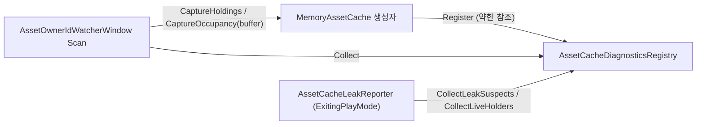
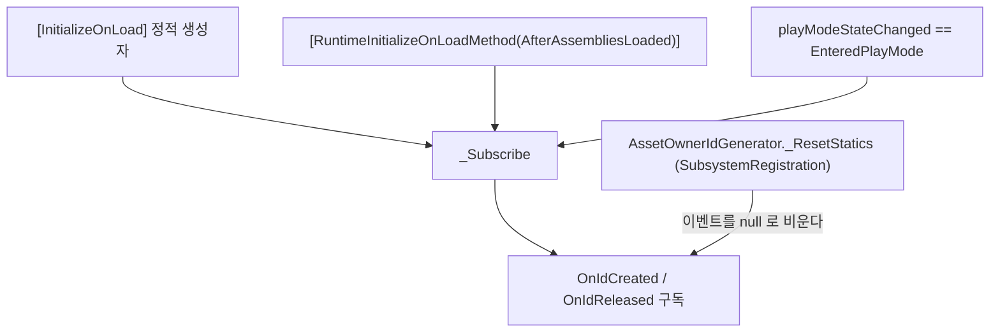

# HCUP.HResource.Editor

> 어셈블리: `HCUP.HResource.Editor` (`Editor/HCUP.HResource.Editor.asmdef`, rootNamespace `HResource`)
> 의존: `HCUP.HResource`, `HCUP.HDiagnosis` (`includePlatforms: ["Editor"]`)
> 동반 어셈블리: `HCUP.HResource` - [Runtime/README.md](../Runtime/README.md)

---

## 요약

파일 3개짜리 진단 도구다. **소유자의 수명**과 **캐시의 점유**를 한 창에서 두 방향으로 보고, 플레이 종료 시점에 회수되지 않은 점유를 콘솔로 알린다.

- 수명 축은 `AssetOwnerIdGenerator` 의 발급·해제 이벤트로 유지한다.
- 점유 축은 `AssetCacheDiagnosticsRegistry` 에 등록된 살아 있는 캐시에서 스냅샷을 받아 온다.

**두 축은 서로 독립이다.** `AssetProvider` 와 `MemoryAssetCache` 는 `AssetOwnerIdGenerator` 를 참조하지 않는다. 그래서 점유는 남아 있는데 소유자 기록이 없는 상태가 성립하고, 창은 그것을 `ORPHAN` 으로 드러낸다.

## 파일 지도

| 경로 | 역할 |
|---|---|
| `Subscription/AssetOwnerIdWatchRegistry.cs` | `[InitializeOnLoad]` 정적 레지스트리. 이벤트 구독 + `ownerId → Entry` 표 + 묘비 표 유지 |
| `Subscription/AssetOwnerIdWatcherWindow.cs` | `EditorWindow`. 메뉴 `HCUP/Resource/Owner Watcher` |
| `Cache/AssetCacheLeakReporter.cs` | `[InitializeOnLoad]`. 플레이 종료 시 미회수 점유 보고 |

점유 자료의 출처는 런타임 쪽에 있다 (전부 `#if UNITY_EDITOR`).

| 경로 | 역할 |
|---|---|
| `Runtime/Cache/IAssetCacheDiagnostics.cs` | 제네릭을 지운 진단 계약 |
| `Runtime/Cache/AssetCacheDiagnosticsRegistry.cs` | 약한 참조 레지스트리. 캐시가 생성자에서 자가등록 |
| `Runtime/Cache/AssetCacheDiagnosticsHandle.cs` | 캐시보다 오래 사는 기록. 미폐기 누수 판정 근거 |
| `Runtime/Cache/AssetOccupancySnapshot.cs` | key 하나의 총 점유와 소유자 목록 |
| `Runtime/Cache/AssetOwnerOccupancy.cs` | key 를 잡고 있는 소유자 id |

`Entry` 는 `OwnerId` / `UnityOwner` / `ClassName` / `ContainerName` / `OwnerDisplayName` / `SourceTypeName` / `CreatedAt` / `IsUnityObject` / `IsAlive` / `PlainOwnerRef` 에 `[NonSerialized]` 기록용 `OwnerType` / `CreatedTicks` / `HasLabels` 를 더한 13필드다 (`Subscription/AssetOwnerIdWatchRegistry.cs:13-37`). 표시 문자열 필드는 발급 때 비어 있고 뒤에서 채운다(아래 "표 유지" 절). 점유 정보는 여기에 없고 스냅샷에서 합쳐 붙인다. 소유자의 `Holds` 열은 그 소유자가 잡고 있는 key 수다.

`PlainOwnerRef` 는 비 Unity 소유자에만 채우는 `WeakReference` 다. 순수 C# 객체에는 파괴 이벤트가 없어 이것 말고는 죽음을 알 방법이 없다. 강한 참조로 바꾸면 이 창이 소유자를 살려두어, 누수를 관측하려다 누수를 만든다.

## 두 탭

| 탭 | 보여주는 것 |
|---|---|
| **Owner Tracker** | 소유자 기준. 목록에 `Holds` 열과 펼침 key 목록이 붙는다. 점유는 있는데 소유자 기록이 없으면 `ORPHAN` 행으로 따로 나열한다 |
| **Resource Ownership** | 리소스 기준. 캐시별로 묶어 key 마다 그것을 잡고 있는 소유자 수와 목록을 표시한다 |

두 탭은 **각자 자기 방향의 스냅샷**을 쓴다. `Owner Tracker` 는 `CaptureHoldings`(캐시의 `ownerTable` 을 그대로 옮김), `Resource Ownership` 은 `CaptureOccupancy`(`ownerTable` 을 key 기준으로 뒤집음)다. 툴바 `Scan` 은 활성 탭의 방향만 캡처하므로 두 탭은 서로 다른 순간을 보여줄 수 있다. 상태 줄이 탭별 Scan 경과 시간을 표시한다.

## 점유 자료 경로

캐시는 provider 마다 `new` 로 만들어져 어디에도 등록되지 않는다. 그래서 캐시가 생성자에서 스스로 손을 드는 구조를 택했다. 레지스트리는 **약한 참조**로 담는다. 강한 참조면 진단 도구가 캐시의 수명을 붙잡아 그 자체로 누수가 된다.

## 누수 보고

`AssetCacheLeakReporter` 는 `ExitingPlayMode` 에서 `GC.Collect` 를 한 번 돌린 뒤 레지스트리를 두 갈래로 훑는다 (`Cache/AssetCacheLeakReporter.cs:43-55`).

| 갈래 | 판정 | 심각도 |
|---|---|---|
| 이미 GC 된 캐시가 점유를 들고 있었다 | `Dispose` 누락의 확정 증거. 그 캐시는 사라져 어떤 API 로도 핸들을 되돌릴 수 없다 | `HLogger.Error` |
| 아직 살아 있는 캐시가 점유를 들고 있다 | 회수 누락이거나 세션 내내 상주하는 provider 의 정상 상태 | `HLogger.Warning` |

`ExitingPlayMode` 시점에는 GC 가 끝나지 않았을 수 있어 첫 갈래가 과소 보고될 수 있다.

## 구독 경로

구독 경로가 3개인 이유가 이 파일의 핵심이다. 런타임의 `_ResetStatics` 가 `SubsystemRegistration` 에서 정적 이벤트를 비우므로 (`Runtime/Subscription/AssetOwnerIdGenerator.cs:43-48`), 정적 생성자 구독만으로는 플레이 모드에서 끊긴다. `AfterAssembliesLoaded` 는 리셋 **이후**임이 순서상 보장되는 재구독 지점이고 (`Subscription/AssetOwnerIdWatchRegistry.cs:72-82`), `EnteredPlayMode` 는 `RuntimeInitializeOnLoadMethod` 가 동작하지 않는 환경을 위한 2차 보완이다. Awake 이후일 수 있어 초기 발급을 놓칠 수 있다는 점이 주석에 명시돼 있다 (`:291-298`).

`_Subscribe` 는 항상 `-=` 후 `+=` 로 중복 구독을 막는다 (`:84-91`).

## 표 유지

- `_OnIdCreated` → `_BuildEntry` 는 id, 참조, 타입, 발급 시각(UTC ticks)만 기록한다 (`:139-189`). 신원 발급마다 도는 경로라 이름 문자열(네이티브 이름 조회 포함)을 만들지 않는다.
- 표시명은 `_FillLabels` 가 나중에 채운다 (`:191-226`). 창이 그리기 전에 부르는 `EnsureLabels` (`:115-125`) 와 창이 열려 있을 때 도는 `_ScanOnce` 가 이름이 빈 항목을 채운다. `Component` 는 `gameObject.name` 을 컨테이너로, `GameObject` 는 자기 이름을, 비 Unity 객체는 `(Non-Unity Owner)` 를 넣는다.
- 채우기 전에 파괴된 Unity 소유자는 이름을 읽을 수 없어 타입 이름과 `(destroyed before it was inspected)` 만 남는다. 창이 닫혀 있을 때뿐 아니라, 열려 있어도 발급 뒤 다음 그리기나 스캔 전에 파괴되면 같다.
- 창이 열려 있을 때 1초 간격으로 전 항목의 생사를 재검사해 **죽은 owner 를 표에서 제거**한다 (`:234-280`, 간격 상수 `SCAN_INTERVAL` `:52`). Unity 객체는 `UnityOwner != null`, 순수 C# 객체는 `PlainOwnerRef.IsAlive` 로 판정한다. 즉 `NotifyReleased` 가 빠져도 두 축 모두 자동으로 사라지고, 그 owner 가 잡고 있던 점유는 남으므로 `ORPHAN` 으로 넘어간다.
- 제거 직전에 마지막 정체를 **묘비(tombstone)** 로 남긴다. `ORPHAN` 행이 id 와 개수만 보여주면 무엇이 샜는지 알 수 없기 때문이다. 정상 회수(`NotifyReleased`)는 묘비를 남기지 않는다. 점유가 사라진 묘비는 창이 `ORPHAN` 을 집계할 때 버린다.
- `EnteredEditMode` / `ExitingPlayMode` 에서 표를 통째로 비운다 (`:300-303`).

창은 검색어와 `Unity Only` / `Alive Only` 필터를 걸고 `OwnerId` 순으로 그린다. `ORPHAN` 행은 이 필터를 타지 않는다. 누수는 필터로 숨길 수 없어야 한다.

`GC Probe` 버튼은 `GC.Collect` 를 강제한 뒤 즉시 판정한다 (`CollectAndPrune`, `:108-113`). 약한 참조는 수집이 일어나야 죽었다고 답하므로, 순수 C# 소유자의 죽음을 지금 확인하려면 이 버튼이 필요하다.

`Orphan Clean` 버튼은 목록에 잡힌 `ORPHAN` 의 점유를 확인창 1회 뒤 `IAssetCacheDiagnostics.ForceReleaseOwner` 로 강제 해제한다. `ORPHAN` 이 0 이면 비활성이다. 내려놓는 것은 점유뿐이고 leash 엔트리는 그대로 두는데, 창에서 provider 에 닿을 수 없기 때문이다. 남은 엔트리는 앵커 파괴나 `IAssetSource.ReclaimOrphans()` 가 나중에 걷어간다.

행 클릭은 `PingObject` + `Selection.activeObject` 다. 창이 열려 있는 동안 `EditorApplication.update` 로 0.25초마다 스스로 다시 그린다 (`Subscription/AssetOwnerIdWatcherWindow.cs:50`). 이 리페인트는 소유자 생사 표시용이고 점유를 캡처하지 않는다.

`Scan` 버튼은 요청만 표시하고, 캡처는 다음 Layout 패스 선두에서 한다 (`_RunPendingScans`, `:179-190`). 그리는 도중 행 수가 바뀌면 IMGUI 레이아웃이 어긋나기 때문이다. 캡처가 끝나면 창은 캐시 참조를 비운다 (`:229-232`). 강한 참조를 쥐고 있으면 플레이 종료 시 누수 보고기가 그 캐시를 살아있는 누수로 센다. `Orphan Clean` 뒤에는 이미 Scan 한 탭만 다시 캡처한다. 플레이 모드 진입과 종료 때 스냅샷을 비운다 (`:146-151`).

## 주의할 점

1. **파괴 감지는 창이 열려 있을 때만 돈다.** 창을 닫아 두면 표의 생사 판정이 갱신되지 않는다. 창을 열 때와 `GC Probe` 는 `ScanNow` 로 주기 게이트를 건너뛴다 (`Subscription/AssetOwnerIdWatchRegistry.cs:131-134`).
2. **점유 축은 플레이 중에 `Scan` 을 눌러야 채워진다.** 누르기 전에는 `not scanned` 를, 등록된 캐시가 없으면 `no live cache registered` 를 상태 줄에 표시한다.
3. **캡처는 Scan 한 번마다 할당한다.** `CaptureOccupancy` 는 `ownerTable` 을 뒤집는 사전과 key 마다 소유자 리스트를, `CaptureHoldings` 는 소유자마다 key 리스트를 새로 만든다. 누를 때만 돌고 에디터 전용이라 풀링은 두지 않았다.
4. **누수 보고 직전의 `GC.Collect` 는 플레이 종료마다 1회 돈다.** 에디터 전용 비용이다.

---

## 히스토리

### 2026-09-07 :: `Orphan Clean` 과 런타임 회수 창구

- 이전: `ORPHAN` 으로 드러난 점유를 내릴 수단이 `ClearCache` 뿐이었다.
- 현재: 툴바 `Orphan Clean` 과 `IAssetSource.ReclaimOrphans()` 로 그 점유만 골라 내린다.

### 2026-09-04 :: 점유 축 추가와 창 동작 정정

- 이전: 표는 점유 내용을 몰랐다. 비 Unity owner 는 `IsAlive` 가 `true` 로 고정되어 `NotifyReleased` 가 유일한 제거 경로였고, Dispose 없이 버려진 순수 owner 가 건강한 owner 와 화면상 구분되지 않았다. `Unity Only` 기본값이 `true` 라 순수 C# owner 가 숨겨졌다. 창은 스스로 리페인트하지 않아 `Refresh` 를 눌러야 갱신됐다. 파괴 감지는 매 에디터 프레임 전수 순회였다.
- 현재: `IAssetCacheDiagnostics` 로 점유를 읽어 `Holds` 열과 `Resource Ownership` 탭에 표시한다. 순수 owner 는 `WeakReference` 로 생사를 판정한다. `Unity Only` 기본값은 `false` 다. 0.25초 자동 리페인트가 들어가고 `Refresh` 버튼은 제거됐다. `AssetCacheLeakReporter` 가 추가됐다.

### 2026-08-06 :: 네임스페이스와 메뉴 경로 정정

- 이전: 네임스페이스가 `HUtil.Editor.Subscription`, 메뉴 경로가 `HCUP/Data/Owner Watcher` 였다. 수동 등록용 `Register` / `Unregister` public API 가 있었다.
- 현재: 네임스페이스는 `HResource.Editor.Subscription`, 메뉴는 `HCUP/Resource/Owner Watcher` 다. 레지스트리는 이벤트 구독으로만 표를 채우고 수동 등록 API 는 없다.
