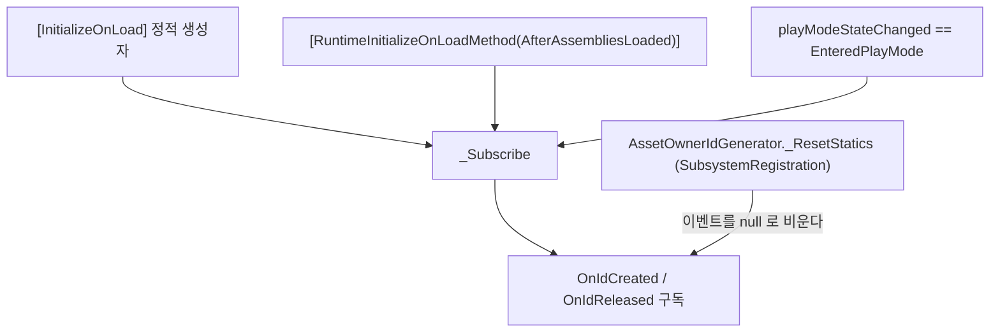

# HCUP.HResource.Editor

> 어셈블리: `HCUP.HResource.Editor` (`Editor/HCUP.HResource.Editor.asmdef`, rootNamespace `HResource`)
> 의존: `HCUP.HResource` (`includePlatforms: ["Editor"]`)
> 동반 어셈블리: `HCUP.HResource` — [Runtime/README.md](../Runtime/README.md)

---

## 요약

파일 2개짜리 진단 도구다. `AssetOwnerIdGenerator` 의 발급·해제 이벤트를 받아 **살아 있는
`AssetOwnerId` 목록**을 에디터 창에 표시한다. 런타임 동작에 관여하지 않으며, 캐시 점유 내용
(어떤 key 를 잡고 있는지)은 보여주지 않는다 — 보이는 것은 **owner 의 수명**뿐이다.

## 파일 지도

| 경로 | 역할 |
|---|---|
| `Subscription/AssetOwnerIdWatchRegistry.cs` | `[InitializeOnLoad]` 정적 레지스트리. 이벤트 구독 + `ownerId → Entry` 표 유지 |
| `Subscription/AssetOwnerIdWatcherWindow.cs` | `EditorWindow`. 메뉴 `HCUP/Data/Owner Watcher` |

`Entry` 는 `OwnerId` / `UnityOwner` / `ClassName` / `ContainerName` / `OwnerDisplayName` /
`SourceTypeName` / `CreatedAt` / `IsUnityObject` / `IsAlive` 9필드다
(`AssetOwnerIdWatchRegistry.cs:12-23`).

## 구독 경로

구독 경로가 3개인 이유가 이 파일의 핵심이다. 런타임의 `_ResetStatics` 가
`SubsystemRegistration` 에서 정적 이벤트를 비우므로(`Runtime/Subscription/AssetOwnerIdGenerator.cs:40-45`),
정적 생성자 구독만으로는 플레이 모드에서 끊긴다. `AfterAssembliesLoaded` 는 리셋 **이후**임이
순서상 보장되는 재구독 지점이고(`AssetOwnerIdWatchRegistry.cs:45-55`), `EnteredPlayMode` 는
`RuntimeInitializeOnLoadMethod` 가 동작하지 않는 환경을 위한 2차 보완이다 — Awake 이후일 수
있어 초기 발급을 놓칠 수 있다는 점이 주석에 명시돼 있다(`:167-174`).

`_Subscribe` 는 항상 `-=` 후 `+=` 로 중복 구독을 막는다(`:58-64`).

## 표 유지

- `_OnIdCreated` → `_BuildEntry` 로 owner 타입별 표시명을 채운다. `Component` 는 `gameObject.name`
  을 컨테이너로, `GameObject` 는 자기 이름을, 비-Unity 객체는 `(Non-Unity Owner)` 를 넣는다
  (`:88-138`).
- `EditorApplication.update` 마다 전 항목의 `UnityOwner != null` 을 재검사해 **파괴된 owner 를
  표에서 제거**한다(`:142-165`). 즉 `NotifyReleased` 를 빠뜨려도 Unity 객체 owner 는 자동으로
  사라진다.
- `EnteredEditMode` / `ExitingPlayMode` 에서 표를 통째로 비운다(`:176-179`).

창은 검색어 + `Unity Only` + `Alive Only` 필터를 걸고 `OwnerId` 순으로 그린다
(`AssetOwnerIdWatcherWindow.cs:64-92`). 행 클릭은 `PingObject` + `Selection.activeObject` 다(`:98-102`).

## 주의할 점

1. **namespace 가 어셈블리와 어긋난다.** 두 파일 모두 `HUtil.Editor.Subscription` 인데
   asmdef 의 `rootNamespace` 는 `HResource` 다(`AssetOwnerIdWatchRegistry.cs:8`,
   `AssetOwnerIdWatcherWindow.cs:8`, `HCUP.HResource.Editor.asmdef`). HUtil 에서 분리될 때
   남은 잔재로 보인다 — 컴파일은 되지만 `HResource.*` 로 찾으면 나오지 않는다.
2. **메뉴 경로가 `HCUP/Data/Owner Watcher` 다**(`AssetOwnerIdWatcherWindow.cs:18`).
   모듈명(`Resource`)과 맞지 않는다.
3. **`Register` / `Unregister` public API 는 호출처가 0건이다**
   (`AssetOwnerIdWatchRegistry.cs:68-69`, 전역 grep). 이벤트 구독으로 같은 일을 하고 있어
   수동 등록 경로가 필요하지 않다.
4. **파괴 감지가 매 에디터 프레임 전수 순회다**(`:142-158`). 항목 수가 적어 문제되지 않으나,
   owner 가 대량으로 늘면 에디터 부하가 된다.
5. **비-Unity owner 는 자동 제거되지 않는다**(`:150` 에서 스킵). `NotifyReleased` 호출이
   유일한 제거 경로이므로, 순수 C# owner 는 통지를 빠뜨리면 표에 영구 잔류한다.
6. **표는 점유 내용을 모른다.** 어떤 key 를 몇 개 잡고 있는지는 `MemoryAssetCache` 내부에만
   있고 노출 API 가 없다 — 누수 추적 시 owner 존재 여부까지만 확인할 수 있다.
