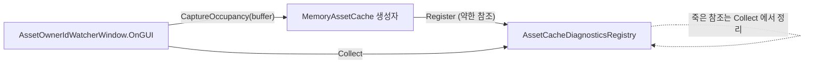
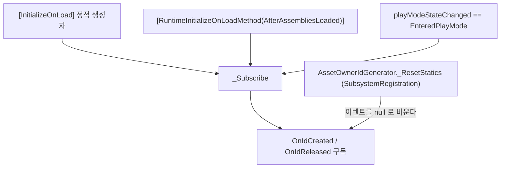

# HCUP.HResource.Editor

> 어셈블리: `HCUP.HResource.Editor` (`Editor/HCUP.HResource.Editor.asmdef`, rootNamespace `HResource`)
> 의존: `HCUP.HResource` (`includePlatforms: ["Editor"]`)
> 동반 어셈블리: `HCUP.HResource` - [Runtime/README.md](../Runtime/README.md)

---

## 요약

파일 2개짜리 진단 도구다. **소유자의 수명**과 **캐시의 점유**를 한 창에서 두 방향으로 본다.

- 수명 축은 `AssetOwnerIdGenerator` 의 발급·해제 이벤트로 유지한다.
- 점유 축은 `AssetCacheDiagnosticsRegistry` 에 등록된 살아 있는 캐시에서 스냅샷을 받아 온다.

**두 축은 서로 독립이다.** `AssetProvider` 와 `MemoryAssetCache` 에는 `AssetOwnerIdGenerator`
참조가 0건이다. 그래서 점유는 남아 있는데 소유자 기록이 없는 상태가 성립하고, 창은 그것을
`ORPHAN` 으로 드러낸다. 이 상태가 워처만으로는 잡히지 않던 누수다.

## 파일 지도

| 경로 | 역할 |
|---|---|
| `Subscription/AssetOwnerIdWatchRegistry.cs` | `[InitializeOnLoad]` 정적 레지스트리. 이벤트 구독 + `ownerId → Entry` 표 유지 |
| `Subscription/AssetOwnerIdWatcherWindow.cs` | `EditorWindow`. 메뉴 `HCUP/Resource/Owner Watcher` |

점유 자료의 출처는 런타임 쪽에 있다 (전부 `#if UNITY_EDITOR`).

| 경로 | 역할 |
|---|---|
| `Runtime/Cache/IAssetCacheDiagnostics.cs` | 제네릭을 지운 진단 계약 |
| `Runtime/Cache/AssetCacheDiagnosticsRegistry.cs` | 약한 참조 레지스트리. 캐시가 생성자에서 자가등록 |
| `Runtime/Cache/AssetCacheDiagnosticsHandle.cs` | 캐시보다 오래 사는 기록. 미폐기 누수 판정 근거 |
| `Editor/Cache/AssetCacheLeakReporter.cs` | 플레이 종료 시 미회수 점유 보고 |
| `Runtime/Cache/AssetOccupancySnapshot.cs` | key 하나의 총 참조와 소유자 목록 |
| `Runtime/Cache/AssetOwnerOccupancy.cs` | key 를 잡고 있는 소유자 id |

`Entry` 는 `OwnerId` / `UnityOwner` / `ClassName` / `ContainerName` / `OwnerDisplayName` /
`SourceTypeName` / `CreatedAt` / `IsUnityObject` / `IsAlive` / `PlainOwnerRef` 10필드다.
점유 정보는 여기에 없고 스냅샷에서 합쳐 붙인다. 소유자의 `Holds` 열은 그 소유자가 잡고 있는 key 수다.

`PlainOwnerRef` 는 비 Unity 소유자에만 채우는 `WeakReference` 다. 순수 C# 객체에는 파괴
이벤트가 없어 이것 말고는 죽음을 알 방법이 없다. 강한 참조로 바꾸면 이 창이 소유자를
살려두어, 누수를 관측하려다 누수를 만든다.

## 두 탭

| 탭 | 보여주는 것 |
|---|---|
| **Owner Tracker** | 소유자 기준. 기존 목록에 `Holds` 열과 펼침 key 목록이 붙는다. 점유는 있는데 소유자 기록이 없으면 `ORPHAN` 행으로 따로 나열한다 |
| **Resource Ownership** | 리소스 기준. 캐시별로 묶어 key 마다 그것을 잡고 있는 소유자 수와 목록을 표시한다 |

두 탭은 **같은 스냅샷 하나**에서 나온다. `Resource Ownership` 이 원본이고 `Owner Tracker` 는
그것을 소유자 기준으로 뒤집은 것이라 두 뷰가 서로 어긋날 수 없다.

## 점유 자료 경로

캐시는 provider 마다 `new` 로 만들어져 어디에도 등록되지 않는다. 그래서 캐시가 생성자에서
스스로 손을 드는 구조를 택했다. 레지스트리는 **약한 참조**로 담는다. 강한 참조면 진단 도구가
캐시의 수명을 붙잡아 그 자체로 누수가 된다.

## 구독 경로

구독 경로가 3개인 이유가 이 파일의 핵심이다. 런타임의 `_ResetStatics` 가
`SubsystemRegistration` 에서 정적 이벤트를 비우므로(`Runtime/Subscription/AssetOwnerIdGenerator.cs:43-49`),
정적 생성자 구독만으로는 플레이 모드에서 끊긴다. `AfterAssembliesLoaded` 는 리셋 **이후**임이
순서상 보장되는 재구독 지점이고(`AssetOwnerIdWatchRegistry.cs:45-55`), `EnteredPlayMode` 는
`RuntimeInitializeOnLoadMethod` 가 동작하지 않는 환경을 위한 2차 보완이다. Awake 이후일 수
있어 초기 발급을 놓칠 수 있다는 점이 주석에 명시돼 있다(`:167-174`).

`_Subscribe` 는 항상 `-=` 후 `+=` 로 중복 구독을 막는다(`:58-64`).

## 표 유지

- `_OnIdCreated` → `_BuildEntry` 로 owner 타입별 표시명을 채운다. `Component` 는 `gameObject.name`
  을 컨테이너로, `GameObject` 는 자기 이름을, 비-Unity 객체는 `(Non-Unity Owner)` 를 넣는다
  (`:88-138`).
- `EditorApplication.update` 마다 전 항목의 생사를 재검사해 **죽은 owner 를 표에서 제거**한다.
  Unity 객체는 `UnityOwner != null`, 순수 C# 객체는 `PlainOwnerRef.IsAlive` 로 판정한다.
  즉 `NotifyReleased` 를 빠뜨려도 두 축 모두 자동으로 사라지고, 그 owner 가 잡고 있던 점유는
  남으므로 `ORPHAN` 으로 넘어간다.
- 제거 직전에 마지막 정체를 **묘비(tombstone)** 로 남긴다. `ORPHAN` 행이 id 와 개수만
  보여주면 무엇이 샜는지 알 수 없기 때문이다. 정상 회수(`NotifyReleased`)는 묘비를 남기지
  않는다. 점유가 사라진 묘비는 창이 `ORPHAN` 을 집계할 때 버린다.
- `EnteredEditMode` / `ExitingPlayMode` 에서 표를 통째로 비운다(`:176-179`).

창은 검색어와 `Unity Only` / `Alive Only` 필터를 걸고 `OwnerId` 순으로 그린다.
`ORPHAN` 행은 이 필터를 타지 않는다. 누수는 필터로 숨길 수 없어야 한다.
`GC Probe` 버튼은 `GC.Collect` 를 강제한 뒤 즉시 판정한다. 약한 참조는 수집이 일어나야
죽었다고 답하므로, 순수 C# 소유자의 죽음을 지금 확인하려면 이 버튼이 필요하다.
`Orphan Clean` 버튼은 목록에 잡힌 `ORPHAN` 의 점유를 확인창 1회 뒤 강제 해제한다.
`ORPHAN` 이 0 이면 비활성이다. 내려놓는 것은 점유뿐이고 leash 엔트리는 그대로 두는데,
창에서 provider 에 닿을 수 없기 때문이다. 남은 엔트리는 앵커 파괴나
`IAssetSource.ReclaimOrphans()` 가 나중에 걷어간다.
행 클릭은 `PingObject` + `Selection.activeObject` 다. 창이 열려 있는 동안
`EditorApplication.update` 로 0.25초마다 스스로 다시 그린다.

## 주의할 점

1. ~~namespace 가 어셈블리와 어긋난다.~~ → 2026-08-06 해소. 두 파일 모두
   `HResource.Editor.Subscription` 으로 정정.
2. ~~메뉴 경로가 `HCUP/Data/Owner Watcher` 다.~~ → 2026-08-06 `HCUP/Resource/Owner Watcher`
   로 정정.
3. **`Register` / `Unregister` public API 는 호출처가 0건이다**
   (`AssetOwnerIdWatchRegistry.cs:68-69`, 전역 grep). 이벤트 구독으로 같은 일을 하고 있어
   수동 등록 경로가 필요하지 않다.
4. **파괴 감지가 매 에디터 프레임 전수 순회다**(`:142-158`). 항목 수가 적어 문제되지 않으나,
   owner 가 대량으로 늘면 에디터 부하가 된다.
5. ~~비-Unity owner 는 자동 제거되지 않는다. `NotifyReleased` 호출이 유일한 제거 경로이므로,
   순수 C# owner 는 통지를 빠뜨리면 표에 영구 잔류한다.~~ → 2026-09-04 해소.
   `WeakReference` 로 생사를 판정해 Unity owner 와 같은 경로로 제거하고 `ORPHAN` 으로 넘긴다.
   종전에는 `IsAlive` 가 `true` 로 하드코딩되어 있어, Dispose 없이 버려진 순수 owner 가
   건강한 owner 와 화면상 완전히 동일하게 보였다. 실제로는 캐시에 점유가 남아 `ClearCache`
   외에는 내릴 수단이 없는 영구 누수 상태였다. → 2026-09-07 해소. 툴바 `Orphan Clean` 과
   `IAssetSource.ReclaimOrphans()` 로 그 점유만 골라 내릴 수 있다.
6. ~~표는 점유 내용을 모른다.~~ → 2026-09-04 해소. `IAssetCacheDiagnostics` 로 점유를 읽어
   `Holds` 열과 `Resource Ownership` 탭에 표시한다.
7. ~~`Unity Only` 기본값이 `true` 라 순수 C# owner 가 조용히 숨겨진다.~~ → 2026-09-04 해소.
   기본값을 `false` 로 바꿨다. `Alive Only` 는 그대로 `true` 다.
8. ~~창이 스스로 리페인트하지 않아 `Refresh` 를 눌러야 값이 갱신된다.~~ → 2026-09-04 해소.
   자동 리페인트를 넣고 `Refresh` 버튼은 제거했다.
9. **점유 축은 플레이 중에만 채워진다.** 등록된 캐시가 없으면 두 탭 모두 비어 있는 것이 정상이고,
   툴바가 `no live cache registered` 로 알린다.
10. **`CaptureOccupancy` 는 key 마다 소유자 리스트를 새로 만든다.** 창이 초당 4회 다시 그리므로
    그만큼 할당이 생긴다. 에디터 전용이고 항목 수가 적어 풀링은 두지 않았다.
