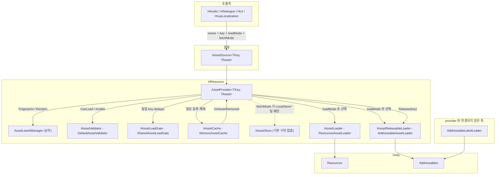
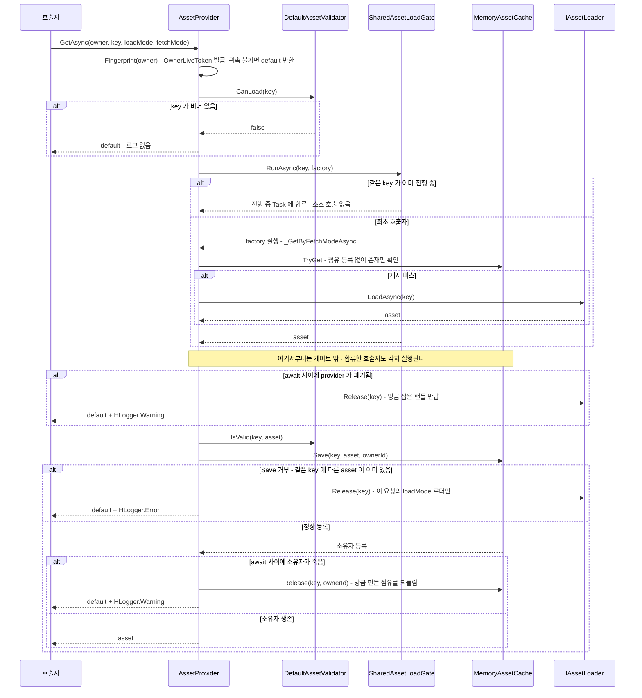
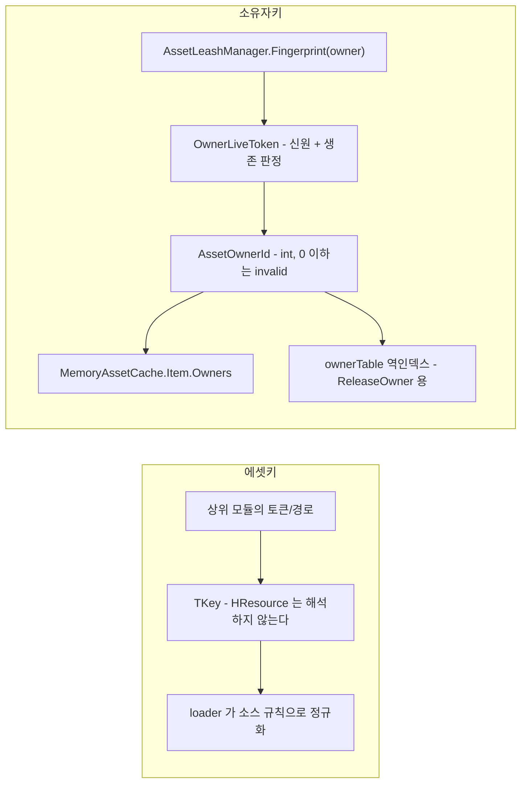

# HCUP.HResource

> 어셈블리: `HCUP.HResource` (`Runtime/HCUP.HResource.asmdef`, rootNamespace `HResource`)
> 의존: `Unity.Addressables`, `Unity.ResourceManager`, `UniTask`, `UniTask.Addressables`, `HCUP.HDiagnosis`
> 동반 어셈블리: `HCUP.HResource.Editor`(OwnerId 워처 + 누수 보고 - [Editor/README.md](../Editor/README.md))

---

## 요약

HResource 는 **`TKey` 하나로 에셋을 지목하고, 그 에셋을 누가 붙잡고 있는지를 추적하는 계층**이다. Unity 의 `Resources` / `Addressables` 두 소스를 하나의 `IAssetLoader` 계약 뒤로 숨기고, 그 위에 소유권 기반 점유 캐시를 얹는다. 도메인 지식은 없다 - 토큰 규칙·카탈로그·경로 규칙은 전부 상위 모듈(HAudio, HDialogue, HUI, HcupLocalization)의 몫이다.

설계의 중심에 네 가지 규약이 있다.

1. **점유의 실 보유자는 캐시 하나다.** `MemoryAssetCache` 의 `Item` 이 소유자 `HashSet` 을 들고, 그것이 비면 실제 제거된다. `AssetLeashManager` 는 그 위에서 "누가 소유자인가" 만 담당하고 점유 계산에는 관여하지 않는다.
2. **소스 해제는 이벤트 연쇄로만 일어난다.** 캐시가 항목을 실제로 지울 때 `OnAssetRemoved` 를 쏘고, `AssetProvider` 가 그것을 받아 그 key 를 로드했던 releasable 로더 하나에 `Release(key)` 를 호출한다 (`Provider/AssetProvider.cs:86`, `:489-498`). 캐시와 로더는 서로를 모른다.
3. **점유 등록은 dedupe 게이트 바깥에서 호출자마다 한다.** 게이트 안(factory)은 최초 호출자 1회만 실행되므로, 안에서 등록하면 합쳐진 후속 호출자가 미등록 상태로 asset 을 받는다 (`Provider/AssetProvider.cs:268-270` 의 주석).
4. **owner 는 객체가 아니라 `int` 다.** `AssetOwnerId` 는 `readonly struct` 이고, 캐시는 owner 객체를 참조하지 않는다. 그래서 GameObject 가 파괴돼도 점유 테이블은 무결하다.

---

## 파일 지도

| 경로 | 역할 | 시스템 문서 |
|---|---|---|
| `Data/AssetLoadMode.cs` | `Resources` / `Addressable` - **소스**를 고르는 축 | - |
| `Data/AssetFetchMode.cs` | 5 가지 조회 우선순위 - **순서**를 고르는 축 | [Provider](../docs/Provider.md) |
| `Data/AssetRequest.cs` | key + loadMode + fetchMode + ownerId 를 묶은 `readonly struct` | [Provider](../docs/Provider.md) |
| `Load/IAssetLoader.cs` | `LoadMode` + `LoadAsync(key)` 최소 계약 | [Load](../docs/Load.md) |
| `Load/IAssetReleasableLoader.cs` | 소스 해제가 필요한 로더 (`Release` / `ReleaseAll`) | [Load](../docs/Load.md) |
| `Load/ResourcesAssetLoader.cs` | `Resources.LoadAsync` await + 경로 정규화. **해제 없음** | [Load](../docs/Load.md) |
| `Load/AddressableAssetLoader.cs` | 주소 단위 `AsyncOperationHandle` 보관 + 해제 | [Load](../docs/Load.md) |
| `Load/AddressableLabelLoader.cs` | label 질의 전용(all/first/single/index). **provider 축과 분리** | [Load](../docs/Load.md) |
| `Load/IAddressableLabelLoader.cs` | 위의 계약 | [Load](../docs/Load.md) |
| `Load/IAssetLoadGate.cs` | 동시 요청 합류 계약 | [Load](../docs/Load.md) |
| `Load/SharedAssetLoadGate.cs` | 진행 중 `Task` 공유로 소스 호출 1회 dedupe | [Load](../docs/Load.md) |
| `Cache/IAssetReader.cs` / `IAssetWriter.cs` / `IAssetReleaser.cs` | 읽기·쓰기·해제 3분할 계약 | [Cache](../docs/Cache.md) |
| `Cache/IAssetCache.cs` | 위 셋 + `OnAssetRemoved` 이벤트 | [Cache](../docs/Cache.md) |
| `Cache/MemoryAssetCache.cs` | **점유의 실 보유자.** 소유자 집합 + 양방향 인덱스 | [Cache](../docs/Cache.md) |
| `Cache/IAssetCacheDiagnostics.cs` 외 4파일 | 에디터 진단 표면. 전부 `#if UNITY_EDITOR` | [Cache](../docs/Cache.md) |
| `Provider/IAssetSource.cs` | 시스템의 외부 경계. 소유자 없는 획득 멤버가 없다 | [Provider](../docs/Provider.md) |
| `Provider/AssetProvider.cs` | 5 컴포넌트 오케스트레이터 | [Provider](../docs/Provider.md) |
| `Provider/AssetProviderFactory.cs` | 기본 조합 조립 헬퍼 (`CreateResources` / `CreateAddressable` / `Create`) | [Provider](../docs/Provider.md) |
| `Store/IAssetStore.cs` | 로컬 영속 저장소 계약. **기본 구현 없음** | [Provider](../docs/Provider.md) |
| `Validation/IAssetValidator.cs` / `DefaultAssetValidator.cs` | key/asset 최소 유효성 (Unity `== null` 함정 처리) | [Provider](../docs/Provider.md) |
| `Subscription/AssetOwnerId.cs` | 점유 주체 식별자 `readonly struct` | [Subscription](../docs/Subscription.md) |
| `Subscription/AssetOwnerIdGenerator.cs` | `Interlocked` 단조 증가 발급기 + 추적 이벤트 | [Subscription](../docs/Subscription.md) |
| `Subscription/AssetLeashManager.cs` | 지문 발급 + 파괴 프로브 부착 + 소유자 단위 회수. **provider 상주** | [Subscription](../docs/Subscription.md) |
| `Subscription/ICSharpAssetLeash.cs` | 순수 C# 소유자용 창구. `using` 으로 반납 보증 | [Subscription](../docs/Subscription.md) |
| `Subscription/OwnerLeashProbe.cs` | 소유자 GameObject 파괴를 중계하는 내부 컴포넌트 | [Subscription](../docs/Subscription.md) |

**명명 규칙** : 이름에 `CSharp` 이 들어간 타입은 순수 C# 소유자 전용이다. `Component` 소유자는 쓰지 않으며, 반납 의무 규격도 그 타입에만 적용된다. `ICSharpAssetLeash` / `CSharpAssetLeash` 가 해당한다. 순수 C# 전용 타입을 새로 만들면 파일명부터 이 규칙을 따른다.

---

## 계층 구조



**책임 경계는 `AssetProvider` 하나다.** 위쪽은 key 와 소유자만 알고, 아래쪽(로더)은 소스 규칙만 안다. 그 사이의 "언제 캐시를 보고, 언제 소스를 치고, 누가 점유를 갖는가"가 provider 의 존재 이유다.

시스템별 세부는 아래 문서로 내렸다.

- [../docs/Load.md](../docs/Load.md) - 로더 3종 + 게이트. 소스 핸들의 수명.
- [../docs/Cache.md](../docs/Cache.md) - `MemoryAssetCache` 의 소유자 집합과 양방향 인덱스, 에디터 진단 표면.
- [../docs/Provider.md](../docs/Provider.md) - fetch mode 5종 분기, 조립, 검증, 저장소.
- [../docs/Subscription.md](../docs/Subscription.md) - `AssetOwnerId` 발급·통지, leash.

---

## 데이터 모델

요청 하나는 **직교하는 두 축 + 식별자 두 개**로 구성된다.

```csharp
// Data/AssetRequest.cs:27-49
public readonly struct AssetRequest<TKey> {
    public TKey Key { get; }                 // 에셋 식별자 - 규칙은 상위 모듈이 정한다
    public AssetOwnerId OwnerId { get; }     // 점유 주체. provider 경로에서는 항상 leash 가 발급한 유효 id
    public AssetLoadMode LoadMode { get; }   // 어느 소스에서    (Resources / Addressable)
    public AssetFetchMode FetchMode { get; } // 어떤 순서로      (5 종)
    public bool HasOwner => OwnerId.IsValid;
}
```

| 축 | 값 | 의미 |
|---|---|---|
| `AssetLoadMode` | `Resources` = 0 | `ResourcesAssetLoader` 로 라우팅 |
| | `Addressable` = 1 | `AddressableAssetLoader` 로 라우팅 |
| `AssetFetchMode` | `CacheFirst` = 0 | 캐시 → 소스 (기본값) |
| | `LocalStoreFirst` = 1 | 스토어 → 소스 |
| | `LocalStoreOnly` = 2 | 스토어만 |
| | `SourceFirst` = 3 | 소스 → 스토어 |
| | `SourceOnly` = 4 | 소스만 |

**두 축은 서로를 모른다.** `loadMode` 는 `_ResolveLoader` 의 Dictionary 키 (`Provider/AssetProvider.cs:456-464`), `fetchMode` 는 `_GetByFetchModeAsync` 의 switch 키 (`:314-333`)다. 라우팅과 순서 결정이 분리되어 있다.

---

## 흐름 - `GetAsync` 전 구간



핵심은 위 다이어그램의 **Note 아래 구간**이다. 게이트가 소스 호출은 합치지만 점유 등록은 합치지 않는다. 호출자 N 명이 합류했으면 `Save` 도 N 번 실행되어 **서로 다른 N 명의 소유자**가 등록되고, 각자 한 번씩 반납해야 항목이 제거된다. 같은 소유자가 N 번 합류한 경우라면 점유는 하나다.

소유자가 로딩 중에 죽었을 때 핸들을 직접 반납하지 않고 캐시의 정상 해제 경로를 태우는 이유도 게이트에 있다. 같은 key 를 기다리던 다른 소유자가 살아 있을 수 있어, 마지막 점유일 때만 `OnAssetRemoved` 로 핸들이 반납되어야 한다 (`Provider/AssetProvider.cs:285-308`).

---

## 식별자 체계

키는 두 종류다. **에셋 키(`TKey`)** 와 **소유자 키(`AssetOwnerId`)**.



`TKey` 의 의미를 아는 유일한 지점은 **로더**다. `ResourcesAssetLoader._NormalizeKey` 가 확장자 제거·슬래시 정리·rootPath 결합을 하고 (`Load/ResourcesAssetLoader.cs:62-87`), `AddressableAssetLoader._NormalizeKey` 는 `Trim()` 만 한다 (`Load/AddressableAssetLoader.cs:92-95`). 그 외 어디에서도 key 를 해석하지 않는다.

`AssetOwnerId` 는 `Value > 0` 일 때만 유효하다 (`Subscription/AssetOwnerId.cs:33`). 무효 id 로 들어온 `Save` 는 거부되고 에러가 남으며 (`Cache/MemoryAssetCache.cs:87-92`), 무효 id 의 `Release` 는 경고와 함께 `false` 를 돌려준다 (`:117-120`). 소유자 없는 점유는 만들어지지 않는다.

---

## 조립

```csharp
// Provider/AssetProviderFactory.cs:59-64 - 기본 조합은 한 곳에서만 정해진다
return new AssetProvider<string, TAsset>(
    assetLoaders: assetLoaders,
    assetCache:   new MemoryAssetCache<string, TAsset>(),
    assetValidator: new DefaultAssetValidator<string, TAsset>(),
    assetLoadGate:  new SharedAssetLoadGate<string, TAsset>(),
    assetStore:   assetStore);   // 기본 null
```

`CreateResources` / `CreateAddressable` 는 **로더를 하나만** 등록한다 (`:33-48`). 두 소스를 한 provider 에서 쓰려면 `Create(new IAssetLoader[]{ ... })` 로 직접 넘겨야 하고, 등록되지 않은 `loadMode` 로 요청하면 `_ResolveLoader` 가 던진다.

패키지 내 다른 모듈의 조립:

| 사용처 | 조합 |
|---|---|
| `HAudio/Runtime/Repository/AudioClipRepository.cs:245-246` | loadMode 에 따라 Resources / Addressable 택1 |
| `HDialogue/Runtime/Portrait/CharacterStageDirector.cs:75` | `CreateAddressable<Sprite>()` |
| `HUI/Runtime/HUI/Popup/ImagePopup.cs:94,101` | 두 provider 를 **각각** 만들어 병행 보유 |
| `HLocalization/HcupLocalization/Runtime/HcupLocalization/LocalizationManager.cs:82` | `CreateAddressable<LocalizationSO>()` |

---

## 사용 예

```csharp
// Component 소유자. id 를 발급받지도, 들고 있지도 않는다.
IAssetSource<string, Sprite> source = AssetProviderFactory.CreateAddressable<Sprite>();

// 1) 조회 - 없으면 로드하고, 있으면 이 소유자를 점유자로 등록만 한다. 첫 호출에서 지문이 발급되고
//    이 GameObject 에 파괴 프로브가 붙는다.
var sprite = await source.GetAsync(this, "Portrait/Hero", AssetLoadMode.Addressable);

// 2) 동기 조회 - 로드하지 않고 점유도 늘리지 않는다. 캐시에 있을 때만 참
if (source.TryGet("Portrait/Hero", out var cached)) { /* ... */ }

// 3) 단건 반납 - 정상 플로우
source.Release(this, "Portrait/Hero");

// 4) 이 소유자가 잡은 전부를 한 번에
source.ReleaseOwner(this);

// 5) OnDestroy 에서 4번을 빠뜨려도 프로브가 같은 회수를 한다.
//    provider 자체의 폐기는 이것을 만든 쪽 책임이다.
source.Dispose();
```

순수 C# 객체는 앵커가 필요하다. 앵커 파괴가 수명 상한이다.

```csharp
using var leash = source.Leash(this, anchorComponent);
var sprite = await leash.GetAsync("Portrait/Hero", AssetLoadMode.Addressable);
```

`HUI/Runtime/HUI/Popup/ImagePopup.cs` 가 Component 경로의 정본 예시다.

---

## 주의할 점

읽으면서 확인한 사실들이다. 앞쪽은 설계 의도(계약), 뒤쪽은 정리 대상이다.

### 계약

1. **`TryGet` 은 점유를 만들지 않는다.** `AssetProvider.TryGet` 은 `assetCache.TryGet` 직행이라 조회만 한다 (`Provider/AssetProvider.cs:159-166`). 반대로 `GetAsync` 는 **캐시 히트여도** `Save` 를 거쳐 호출자를 소유자로 등록한다. 같은 소유자가 여러 번 요청해도 점유는 하나이므로 반납도 한 번이면 된다.
2. **`ResourcesAssetLoader` 는 해제 경로가 없다.** `IAssetReleasableLoader` 를 구현하지 않으므로 캐시에서 지워져도 `Resources.UnloadAsset` 은 호출되지 않는다. Unity 의 씬 전환 정리에 맡긴다 (`Load/ResourcesAssetLoader.cs:31`, 헤더 `:15-16`).
3. **`LocalStoreFirst` / `LocalStoreOnly` 는 store 없이 호출하면 예외다.** `HLogger.Throw(InvalidOperationException)` 가 실제로 throw 한다 (`Provider/AssetProvider.cs:352-356`, `:371-375`; `HDiagnosis/Runtime/Logger/HLogger.cs:146-150`).
4. **등록되지 않은 `loadMode` 요청도 예외다** (`Provider/AssetProvider.cs:456-464`). 팩토리 편의 메서드는 로더를 하나만 등록하므로 이 함정에 걸리기 쉽다.
5. **같은 `LoadMode` 로더를 두 번 넘기면 뒤엣것이 이긴다.** 생성자는 막지 않고 경고만 남긴다 (`Provider/AssetProvider.cs:95-101`).
6. **폐기 후 호출은 거부된다.** `Dispose` 이후의 공개 API 는 경고를 남기고 무해값을 돌려준다 (`Provider/AssetProvider.cs:239-245`).
7. **정적 이벤트는 플레이 진입 시 비워진다.** `AssetOwnerIdGenerator._ResetStatics` 가 `SubsystemRegistration` 에서 `nextId` 와 두 이벤트를 초기화한다 (`Subscription/AssetOwnerIdGenerator.cs:43-48`). 런타임 구독자는 재구독 경로를 스스로 가져야 한다 - 에디터 워처가 그 짝을 맞춰 둔 사례다.

### 정리 대상

8. **`IAssetStore` 는 기본 구현이 없다** (`Store/IAssetStore.cs`). `LocalStoreFirst`/`LocalStoreOnly` 두 fetch mode 와 `IAssetSource.ClearStoreAsync` (`Provider/AssetProvider.cs:228-232`) 는 사용자가 store 를 직접 구현해 넘길 때만 동작하는 확장 슬롯이다. 팩토리의 `assetStore` 인자 기본값은 `null` 이다.
9. **`AddressableLabelLoader` / `IAddressableLabelLoader` 는 provider 와 분리된 축이다.** `IAssetLoader` 를 구현하지 않아 `AssetProvider` 에 등록할 수 없다. 캐시·소유권·게이트 어느 것도 적용되지 않으므로 핸들 해제는 호출자 책임이다. → [../docs/Load.md](../docs/Load.md)
10. **`MemoryAssetCache.ReleaseAll()` 과 `Clear()` 는 완전히 같은 동작이다** - 둘 다 `_ClearItems()` 한 줄이다 (`Cache/MemoryAssetCache.cs:158-164`). `IAssetReleaser` 가 두 이름을 계약으로 강제하고 있어 (`Cache/IAssetReleaser.cs:29-30`) 호출자는 의미 차이를 기대하게 된다.

---

## 확장 지점

| 하고 싶은 것 | 손댈 곳 |
|---|---|
| 새 소스 추가 (예: AssetBundle) | `AssetLoadMode` 에 값 추가 + `IAssetLoader` 구현 + `Create` 로 주입 |
| 소스 해제까지 필요 | `IAssetReleasableLoader` 로 구현 - 캐시 제거 시 자동 연쇄된다 |
| 캐시 정책 교체 (LRU·용량 상한) | `IAssetCache` 구현 후 `AssetProvider` 생성자 주입. `OnAssetRemoved` 발화 계약만 지키면 된다 |
| 디스크 캐시 / 다운로드 저장소 | `IAssetStore` 구현 → 팩토리 `assetStore` 인자. 기본 구현이 없는 확장점 |
| key 규칙 강제 (GUID 형식 등) | `IAssetValidator` 구현체 교체 |
| dedupe 정책 변경 (타임아웃·취소) | `IAssetLoadGate` 구현체 교체 |
| owner 수명 추적 도구 | `AssetOwnerIdGenerator.OnIdCreated` / `OnIdReleased` 구독 - [Editor/README.md](../Editor/README.md) 참조 |

---

## 히스토리

### 2026-09-05 :: 점유를 횟수에서 유무로

- 이전: `Item.Owners` 가 `Dictionary<AssetOwnerId, int>` 였다. 같은 소유자가 같은 key 를 두 번 잡으면 카운트만 오르고, 단건 `Release` 는 1회 1감소, `ReleaseOwner` 는 횟수를 무시하고 통째로 내려놓았다.
- 현재: `HashSet<AssetOwnerId>` 다. `Release` / `ReleaseOwner` / 파괴 프로브 세 경로가 같은 의미다.

### 2026-09-04 :: 익명 축 제거와 소유권 계층 개편

- 이전: 익명 카운터(`AnonymousDependency`)와 owner 카운터가 따로 있어 `Release(key)` 와 `Release(key, ownerId)` 가 서로 다른 카운터를 만졌다. 무효 `ownerId` 는 익명 경로로 강등됐다. 공개 계약은 `IAssetProvider` 였고 `Dispose()` 가 계약에 없었다. `AssetLeaseManager` / `IAssetLeaseManager` / `IAssetLease` / `IAssetOwner` 가 옵트인 lease 계층이었다.
- 현재: 익명 축을 제거했다. 무효 id 의 `Save` 는 거부된다. 공개 계약은 `IAssetSource` 이고 `IDisposable` 을 상속한다. lease 계층은 provider 상주 `AssetLeashManager` / `ICSharpAssetLeash` / `OwnerLeashProbe` 로 대체됐다.
- `AssetOwnerId` 생성자와 `NewId` / `NotifyReleased` 가 internal 이 됐고, 이벤트 페이로드가 `int` 로 바뀌었다.

### 2026-08-06 :: 로더 해제 범위를 key 단위로 좁힘

- 이전: `Save` 가 거부되면 provider 가 `_ReleaseAssetLoaders(key)` 로 **모든** releasable 로더의 해당 key 핸들을 해제했다. Resources + Addressable 을 함께 등록해 같은 key 를 공유하면 캐시가 아직 붙잡고 있는 쪽의 핸들까지 지울 수 있었다.
- 현재: 캐시 등록 이전 단계의 해제는 그 요청의 `loadMode` 로더 하나만(`_ReleaseLoaderHandle`), 캐시 제거 시점의 해제는 그 key 를 실제로 로드한 로더 하나만(`_ReleaseTrackedLoader`) 건드린다.

### 2026-08-06 :: `IAssetReader.TryLoad` 제거와 역방향 변환 제거

- 이전: `IAssetReader` 에 "조회하면서 점유를 늘리는" `TryLoad` 두 오버로드가 있었다. `int → AssetOwnerId` implicit 변환이 발급기를 우회했다.
- 현재: `IAssetReader` 는 `TryGet` 만 선언한다. 역방향 변환은 없다.
