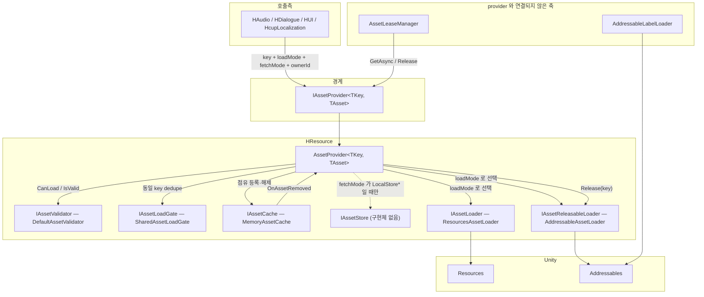
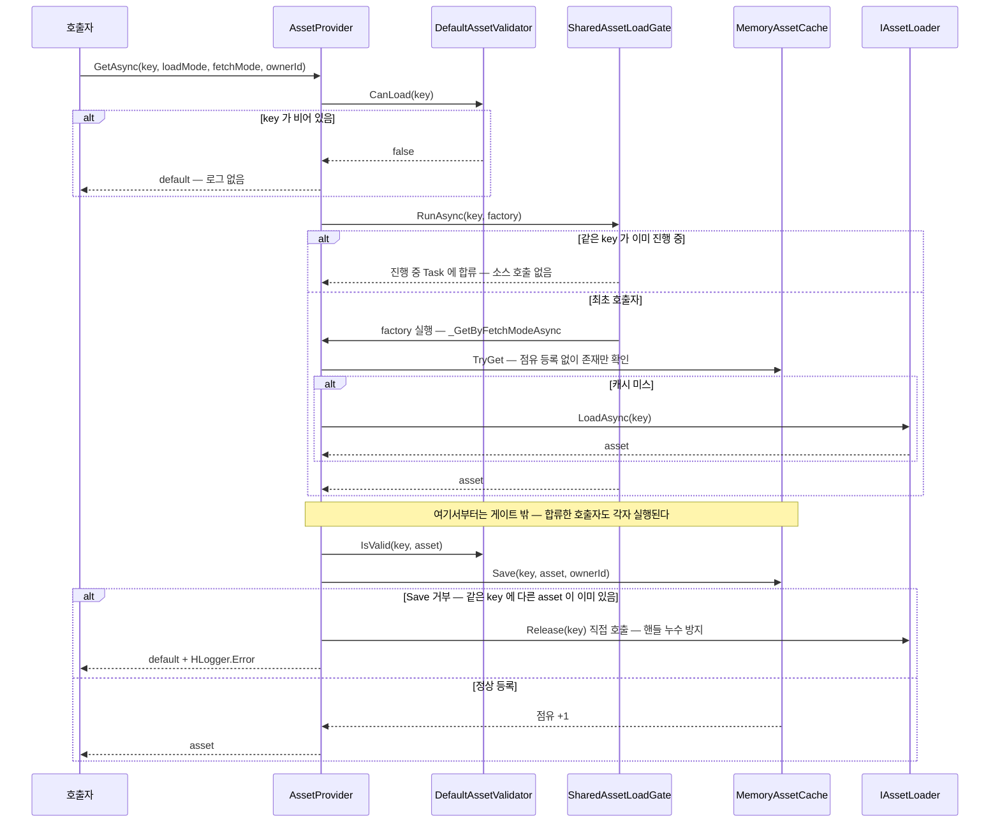
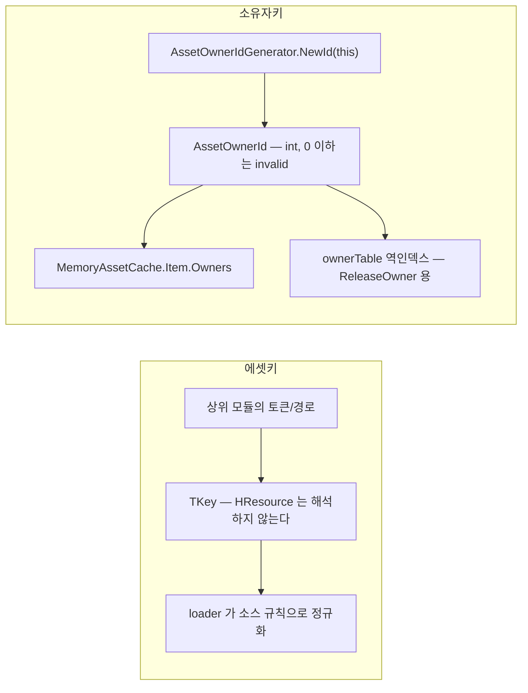

# HCUP.HResource

> 어셈블리: `HCUP.HResource` (`Runtime/HCUP.HResource.asmdef`, rootNamespace `HResource`)
> 의존: `Unity.Addressables`, `Unity.ResourceManager`, `UniTask`, `UniTask.Addressables`, `HCUP.HDiagnosis`
> 동반 어셈블리: `HCUP.HResource.Editor`(OwnerId 워처 — [Editor/README.md](../Editor/README.md))

---

## 요약

HResource 는 **`TKey` 하나로 에셋을 지목하고, 그 에셋을 누가 붙잡고 있는지를 세는 계층**이다.
Unity 의 `Resources` / `Addressables` 두 소스를 하나의 `IAssetLoader` 계약 뒤로 숨기고, 그 위에
소유권 기반 참조 카운트 캐시를 얹는다. 도메인 지식은 없다 — 토큰 규칙·카탈로그·경로 규칙은
전부 상위 모듈(HAudio, HDialogue, HUI, HcupLocalization)의 몫이다.

설계의 중심에 네 가지 규약이 있다.

1. **참조 카운트의 실 보유자는 캐시 하나다.** `MemoryAssetCache` 의 `Item` 이 익명 카운터 1개와
   owner 별 점유 횟수 Dictionary 1개를 동시에 들고 있고, **둘 다 0 이 되어야** 실제 제거된다
   (`Cache/MemoryAssetCache.cs:196-200`). `IAssetLease` 계열은 그 위에 얹힌 표현 계층일 뿐이다.
2. **소스 해제는 이벤트 연쇄로만 일어난다.** 캐시가 항목을 실제로 지울 때 `OnAssetRemoved` 를
   쏘고, `AssetProvider` 가 그것을 받아 `IAssetReleasableLoader.Release(key)` 를 호출한다
   (`Provider/AssetProvider.cs:74`, `:340-342`). 캐시와 로더는 서로를 모른다.
3. **점유 등록은 dedupe 게이트 바깥에서 호출자마다 한다.** 게이트 안(factory)은 최초 호출자
   1회만 실행되므로, 안에서 등록하면 합쳐진 후속 호출자가 미등록 상태로 asset 을 받는다
   (`Provider/AssetProvider.cs:161-179` 의 주석이 그 사고 기록이다).
4. **owner 는 객체가 아니라 `int` 다.** `AssetOwnerId` 는 `readonly struct` 이고, 캐시는 owner
   객체를 참조하지 않는다. 그래서 GameObject 가 파괴돼도 점유 테이블은 무결하다.

---

## 파일 지도

| 경로 | 역할 | 시스템 문서 |
|---|---|---|
| `Data/AssetLoadMode.cs` | `Resources` / `Addressable` — **소스**를 고르는 축 | — |
| `Data/AssetFetchMode.cs` | 5 가지 조회 우선순위 — **순서**를 고르는 축 | [Provider](../docs/Provider.md) |
| `Data/AssetRequest.cs` | key + loadMode + fetchMode + ownerId 를 묶은 `readonly struct` | [Provider](../docs/Provider.md) |
| `Load/IAssetLoader.cs` | `LoadMode` + `LoadAsync(key)` 최소 계약 | [Load](../docs/Load.md) |
| `Load/IAssetReleasableLoader.cs` | 소스 해제가 필요한 로더 (`Release` / `ReleaseAll`) | [Load](../docs/Load.md) |
| `Load/ResourcesAssetLoader.cs` | `Resources.Load` 동기 호출 + 경로 정규화. **해제 없음** | [Load](../docs/Load.md) |
| `Load/AddressableAssetLoader.cs` | 주소 단위 `AsyncOperationHandle` 보관 + 해제 | [Load](../docs/Load.md) |
| `Load/AddressableLabelLoader.cs` | label 질의 전용(all/first/single/index). **provider 축과 분리** | [Load](../docs/Load.md) |
| `Load/IAddressableLabelLoader.cs` | 위의 계약 | [Load](../docs/Load.md) |
| `Load/IAssetLoadGate.cs` | 동시 요청 합류 계약 | [Load](../docs/Load.md) |
| `Load/SharedAssetLoadGate.cs` | 진행 중 `Task` 공유로 소스 호출 1회 dedupe | [Load](../docs/Load.md) |
| `Cache/IAssetReader.cs` / `IAssetWriter.cs` / `IAssetReleaser.cs` | 읽기·쓰기·해제 3분할 계약 | [Cache](../docs/Cache.md) |
| `Cache/IAssetCache.cs` | 위 셋 + `OnAssetRemoved` 이벤트 | [Cache](../docs/Cache.md) |
| `Cache/MemoryAssetCache.cs` | **참조 카운트의 실 보유자.** 양방향 인덱스 | [Cache](../docs/Cache.md) |
| `Provider/IAssetProvider.cs` | 시스템의 외부 경계 | [Provider](../docs/Provider.md) |
| `Provider/AssetProvider.cs` | 5 컴포넌트 오케스트레이터 | [Provider](../docs/Provider.md) |
| `Provider/AssetProviderFactory.cs` | 기본 조합 조립 헬퍼 (`CreateResources` / `CreateAddressable`) | [Provider](../docs/Provider.md) |
| `Store/IAssetStore.cs` | 로컬 영속 저장소 계약. **구현체 0개** | [Provider](../docs/Provider.md) |
| `Validation/IAssetValidator.cs` / `DefaultAssetValidator.cs` | key/asset 최소 유효성 (Unity `== null` 함정 처리) | [Provider](../docs/Provider.md) |
| `Subscription/AssetOwnerId.cs` | 점유 주체 식별자 `readonly struct` | [Subscription](../docs/Subscription.md) |
| `Subscription/AssetOwnerIdGenerator.cs` | `Interlocked` 단조 증가 발급기 + 추적 이벤트 | [Subscription](../docs/Subscription.md) |
| `Subscription/IAssetOwner.cs` | `OwnerId` 만 노출하는 최소 owner 계약 | [Subscription](../docs/Subscription.md) |
| `Subscription/AssetLeaseManager.cs` / `IAssetLeaseManager.cs` / `IAssetLease.cs` | `IDisposable` 표현 계층. **호출처 0건** | [Subscription](../docs/Subscription.md) |

---

## 계층 구조



**책임 경계는 `AssetProvider` 하나다.** 위쪽은 key 만 알고, 아래쪽(로더)은 소스 규칙만 안다.
그 사이의 "언제 캐시를 보고, 언제 소스를 치고, 누가 점유를 갖는가"가 provider 의 존재 이유다.

시스템별 세부는 아래 문서로 내렸다.

- [../docs/Load.md](../docs/Load.md) — 로더 3종 + 게이트. 소스 핸들의 수명.
- [../docs/Cache.md](../docs/Cache.md) — `MemoryAssetCache` 의 이중 카운터와 양방향 인덱스.
- [../docs/Provider.md](../docs/Provider.md) — fetch mode 5종 분기, 조립, 검증, 저장소.
- [../docs/Subscription.md](../docs/Subscription.md) — `AssetOwnerId` 발급·통지·lease.

---

## 데이터 모델

요청 하나는 **직교하는 두 축 + 식별자 두 개**로 구성된다.

```csharp
// Data/AssetRequest.cs:24-45
public readonly struct AssetRequest<TKey> {
    public TKey Key { get; }                 // 에셋 식별자 — 규칙은 상위 모듈이 정한다
    public AssetOwnerId OwnerId { get; }     // 점유 주체. default 면 익명
    public AssetLoadMode LoadMode { get; }   // 어느 소스에서    (Resources / Addressable)
    public AssetFetchMode FetchMode { get; } // 어떤 순서로      (5 종)
    public bool HasOwner => OwnerId.IsValid;
}
```

| 축 | 값 | 의미 |
|---|---|---|
| `AssetLoadMode` | `Resources` = 0 | `ResourcesAssetLoader` 로 라우팅 |
| | `Addressable` = 1 | `AddressableAssetLoader` 로 라우팅 |
| `AssetFetchMode` | `CacheFirst` = 0 | 캐시 → 소스 (기본값) |
| | `LocalStoreFirst` = 1 | 스토어 → 소스 |
| | `LocalStoreOnly` = 2 | 스토어만 |
| | `SourceFirst` = 3 | 소스 → 스토어 |
| | `SourceOnly` = 4 | 소스만 |

**두 축은 서로를 모른다.** `loadMode` 는 `_ResolveLoader` 의 Dictionary 키
(`Provider/AssetProvider.cs:314-322`), `fetchMode` 는 `_GetByFetchModeAsync` 의 switch 키
(`:184-203`)다. 라우팅과 순서 결정이 분리되어 있다.

---

## 흐름 — `GetAsync` 전 구간



핵심은 위 다이어그램의 **Note 아래 구간**이다. 게이트가 소스 호출은 합치지만 점유 등록은 합치지 않는다. 호출자 N 명이
합류했으면 `Save` 도 N 번 실행되어 카운터가 N 이 되고, `Release` 도 N 번 필요하다
(`Provider/AssetProvider.cs:165-168`).

---

## 식별자 체계

키는 두 종류다. **에셋 키(`TKey`)** 와 **소유자 키(`AssetOwnerId`)**.



`TKey` 의 의미를 아는 유일한 지점은 **로더**다. `ResourcesAssetLoader._NormalizeKey` 가
확장자 제거·슬래시 정리·rootPath 결합을 하고(`Load/ResourcesAssetLoader.cs:58-77`),
`AddressableAssetLoader._NormalizeKey` 는 `Trim()` 만 한다(`Load/AddressableAssetLoader.cs:87-90`).
그 외 어디에서도 key 를 해석하지 않는다.

`AssetOwnerId` 는 `Value > 0` 일 때만 유효하고(`Subscription/AssetOwnerId.cs:30`), 무효 id 로
들어온 호출은 캐시가 **익명 경로로 강등**한다(`Cache/MemoryAssetCache.cs:66-68`, `:109`, `:140`).
즉 `ownerId` 를 빠뜨려도 동작은 하지만 `ReleaseOwner` 일괄 회수 대상에서 빠진다.

---

## 조립

```csharp
// Provider/AssetProviderFactory.cs:50-65 — 기본 조합은 한 곳에서만 정해진다
return new AssetProvider<string, TAsset>(
    assetLoaders: assetLoaders,
    assetCache:   new MemoryAssetCache<string, TAsset>(),
    assetValidator: new DefaultAssetValidator<string, TAsset>(),
    assetLoadGate:  new SharedAssetLoadGate<string, TAsset>(),
    assetStore:   assetStore);   // 기본 null
```

`CreateResources` / `CreateAddressable` 는 **로더를 하나만** 등록한다
(`:33-48`). 두 소스를 한 provider 에서 쓰려면 `Create(new IAssetLoader[]{ ... })` 로 직접 넘겨야
하고, 등록되지 않은 `loadMode` 로 요청하면 `_ResolveLoader` 가 던진다.

패키지 내 실제 사용처:

| 사용처 | 조합 |
|---|---|
| `HAudio/Repository/AudioClipRepository.cs:178-179` | loadMode 에 따라 Resources / Addressable 택1 |
| `HDialogue/Portrait/CharacterStageDirector.cs:70` | `CreateAddressable<Sprite>()` |
| `HUI/Popup/ImagePopup.cs:97,104` | 두 provider 를 **각각** 만들어 병행 보유 |
| `HLocalization/.../LocalizationManager.cs:67` | `CreateAddressable<LocalizationSO>()` |

---

## 사용 예

```csharp
// 1) owner 발급 — 보통 Awake
ownerId = AssetOwnerIdGenerator.NewId(this);

// 2) 조회 — 없으면 로드하고, 있으면 점유만 +1
var provider = AssetProviderFactory.CreateAddressable<Sprite>();
var sprite = await provider.GetAsync(
    key: "Portrait/Lisa",
    loadMode: AssetLoadMode.Addressable,
    fetchMode: AssetFetchMode.CacheFirst,
    ownerId: ownerId);

// 3) 동기 조회 — 로드하지 않는다. 캐시에 있을 때만 참
if (provider.TryGet("Portrait/Lisa", out var cached)) { /* ... */ }

// 4) 단건 반납
provider.Release("Portrait/Lisa", ownerId);

// 5) 수명 종료 — 이 owner 가 잡은 전부를 한 번에
provider.ReleaseOwner(ownerId);
AssetOwnerIdGenerator.NotifyReleased(ownerId);
```

`ImagePopup.cs:67-69` 가 이 형태의 정본 예시다.

---

## 주의할 점

읽으면서 확인한 사실들이다. 앞쪽은 설계 의도(계약), 뒤쪽은 정리 대상이다.

### 계약

1. **`TryGet` 은 점유를 늘리지 않는다.** `AssetProvider.TryGet` 은 `assetCache.TryGet` 직행이라
   조회만 한다(`Provider/AssetProvider.cs:118-120`). 반대로 `GetAsync` 는 **캐시 히트여도**
   `Save` 를 거쳐 점유를 +1 한다(`:169-179`). 즉 `GetAsync` 호출 수 = `Release` 호출 수여야 한다.
2. **`Release(key)` 와 `Release(key, ownerId)` 는 서로 다른 카운터를 만진다.** 익명 카운터와
   owner 카운터는 독립이고, **둘 다 0 이 되어야** 항목이 제거된다
   (`Cache/MemoryAssetCache.cs:196-200`). 익명으로 얻고 owner 로 반납하면 영구 잔류한다.
3. **`ReleaseOwner` 는 점유 횟수를 무시하고 통째로 내려놓는다** (`Cache/MemoryAssetCache.cs:166-167`).
   같은 owner 가 3번 잡았어도 1번의 `ReleaseOwner` 로 0 이 된다 — `Release(key, ownerId)` 의
   1회 1감소 규칙과 의도적으로 다르다.
4. **`ResourcesAssetLoader` 는 해제 경로가 없다.** `IAssetReleasableLoader` 를 구현하지 않으므로
   캐시에서 지워져도 `Resources.UnloadAsset` 은 호출되지 않는다. Unity 의 씬 전환 정리에 맡긴다
   (`Load/ResourcesAssetLoader.cs:29`, 헤더 `:119`).
5. **`LocalStoreFirst` / `LocalStoreOnly` 는 store 없이 호출하면 예외다.**
   `HLogger.Throw(InvalidOperationException)` 가 실제로 throw 한다
   (`Provider/AssetProvider.cs:221-226`, `:240-245`; `HDiagnosis/Logger/HLogger.cs:144-148`).
6. **등록되지 않은 `loadMode` 요청도 예외다** (`Provider/AssetProvider.cs:314-322`).
   팩토리 편의 메서드는 로더를 하나만 등록하므로 이 함정에 걸리기 쉽다.
7. **정적 이벤트는 플레이 진입 시 비워진다.** `AssetOwnerIdGenerator._ResetStatics` 가
   `SubsystemRegistration` 에서 `nextId` 와 두 이벤트를 초기화한다
   (`Subscription/AssetOwnerIdGenerator.cs:40-45`). 런타임 구독자는 재구독 경로를 스스로 가져야
   한다 — 에디터 워처가 그 짝을 맞춰 둔 유일한 사례다.

### 정리 대상

8. **`IAssetStore` 는 구현체가 0개다** (`Store/IAssetStore.cs`, 패키지 전역 `grep ": IAssetStore"`
   0건). `LocalStoreFirst`/`LocalStoreOnly` 두 fetch mode와 `IAssetProvider.ClearStoreAsync`
   (`Provider/AssetProvider.cs:149-152`)는 사용자가 store 를 직접 구현해 넘기지 않는 한
   도달 불가능한 코드다. 현재 패키지 내 모든 조립은 `assetStore: null` 이다.
9. **`IAssetReader.TryLoad` 두 오버로드는 호출처가 0건이다**
   (`Cache/IAssetReader.cs:26-27`, 구현 `Cache/MemoryAssetCache.cs:54-76`; 전역 `grep "\.TryLoad("`
   0건). provider 는 점유 없는 `TryGet` 만 쓰고(`Provider/AssetProvider.cs:295-298`), 점유 등록은
   `Save` 로 한다. "조회하면서 점유를 늘린다"는 이 API 는 설계상 대체됐다.
10. **`AddressableLabelLoader` / `IAddressableLabelLoader` 는 사용처가 0건이다** (315행,
    전역 grep 0건). `IAssetLoader` 를 구현하지 않아 `AssetProvider` 에 등록조차 불가능한
    독립 축이다. 캐시·소유권·게이트 어느 것도 적용되지 않으므로, 남긴다면 별도 계층임을
    문서로 명시해야 한다. → [../docs/Load.md](../docs/Load.md)
11. **`AssetLeaseManager` / `IAssetLeaseManager` / `IAssetLease` 는 사용처가 0건이다** (260행,
    전역 grep 0건). `IAssetOwner` 만 `HUI/Popup/ImagePopup.cs:12` 에서 쓰이는데, 그마저도
    lease 를 거치지 않고 `provider.ReleaseOwner(ownerId)` 를 직접 호출한다(`:67-68`).
12. **`AssetProvider.Dispose()` 는 호출처가 0건이고, 경계 인터페이스에도 없다.**
    `IAssetProvider` 는 `IDisposable` 을 상속하지 않으므로(`Provider/IAssetProvider.cs:30`),
    인터페이스 타입으로 provider 를 들고 있는 `AudioClipRepository`·`CharacterPortraitController`
    는 구독 해제 경로가 없다. 캐시가 provider 보다 오래 사는 조립에서 `OnAssetRemoved` 구독이
    남는다(`Provider/AssetProvider.cs:74`, `:145-147`).
13. **`MemoryAssetCache.ReleaseAll()` 과 `Clear()` 는 완전히 같은 동작이다** — 둘 다
    `_ClearItems()` 한 줄이다(`Cache/MemoryAssetCache.cs:176-182`). `IAssetReleaser` 가 두 이름을
    계약으로 강제하고 있어(`Cache/IAssetReleaser.cs:29-30`) 호출자는 의미 차이를 기대하게 된다.
14. **`AssetOwnerId` 의 양방향 implicit 변환은 발급기를 우회시킨다**
    (`Subscription/AssetOwnerId.cs:47-48`). `int` → `AssetOwnerId` 가 암묵이라 아무 정수나 owner
    가 될 수 있고, 컴파일러가 `NewId` 누락을 잡지 못한다.
15. **같은 key 에 서로 다른 asset 이 매핑될 때 핸들 오해제 위험이 있다.** `Save` 가 거부되면
    provider 가 `_ReleaseAssetLoaders(key)` 로 **모든** releasable 로더의 해당 key 핸들을 해제한다
    (`Provider/AssetProvider.cs:172-177`, `:326-336`). 로더가 하나뿐이면 무해하지만, `Create` 로
    Resources+Addressable 을 함께 등록해 같은 key 를 공유하면 캐시가 아직 붙잡고 있는 쪽의
    핸들까지 지운다. 현재 팩토리 편의 메서드만 쓰는 한 도달하지 않는다.

---

## 확장 지점

| 하고 싶은 것 | 손댈 곳 |
|---|---|
| 새 소스 추가 (예: AssetBundle) | `AssetLoadMode` 에 값 추가 + `IAssetLoader` 구현 + `Create` 로 주입 |
| 소스 해제까지 필요 | `IAssetReleasableLoader` 로 구현 — 캐시 제거 시 자동 연쇄된다 |
| 캐시 정책 교체 (LRU·용량 상한) | `IAssetCache` 구현 후 `AssetProvider` 생성자 주입. `OnAssetRemoved` 발화 계약만 지키면 된다 |
| 디스크 캐시 / 다운로드 저장소 | `IAssetStore` 구현 → 팩토리 `assetStore` 인자. 현재 유일한 미구현 확장점 |
| key 규칙 강제 (GUID 형식 등) | `IAssetValidator` 구현체 교체 |
| dedupe 정책 변경 (타임아웃·취소) | `IAssetLoadGate` 구현체 교체 |
| owner 수명 추적 도구 | `AssetOwnerIdGenerator.OnIdCreated` / `OnIdReleased` 구독 — [Editor/README.md](../Editor/README.md) 참조 |
