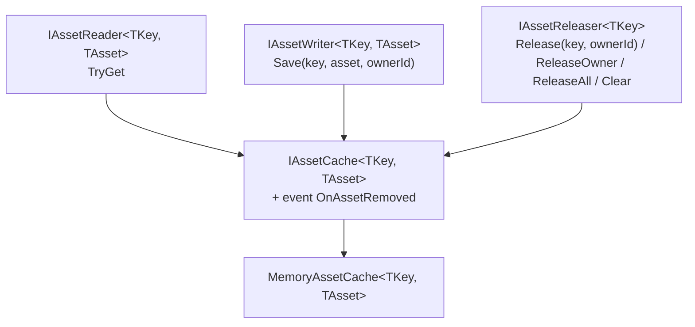
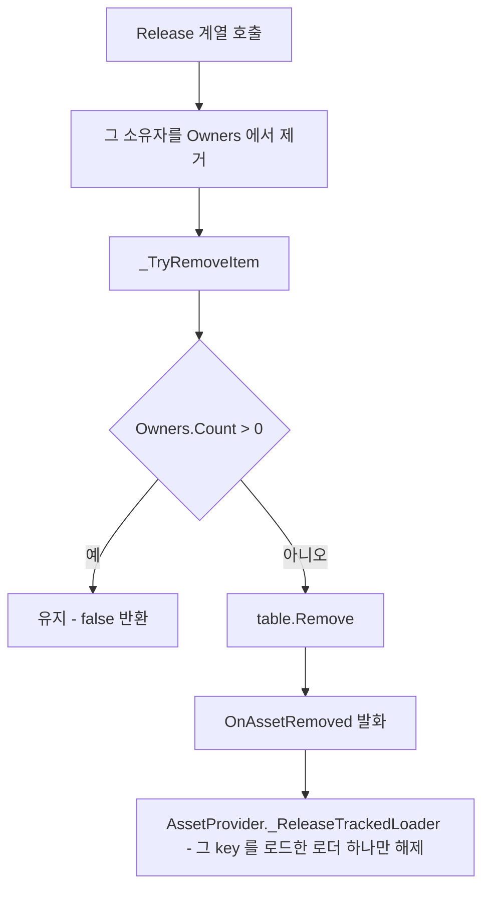
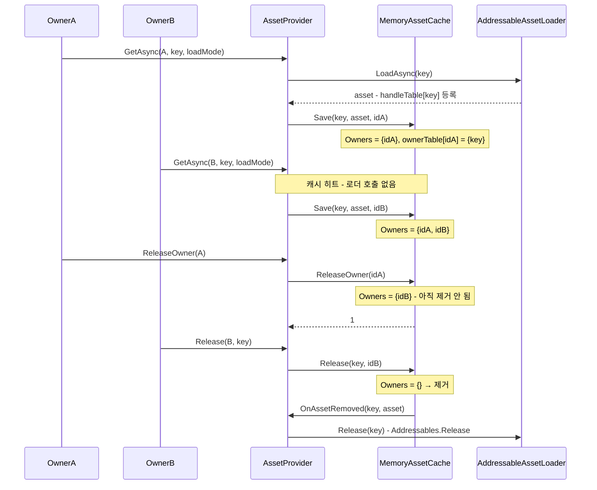

# Cache - 점유와 소유권

> 대상: `Runtime/Cache/*.cs` (`IAssetReader` / `IAssetWriter` / `IAssetReleaser` / `IAssetCache` / `MemoryAssetCache` + 에디터 진단 5파일)
> 상위 문서: [Runtime/README.md](../Runtime/README.md)

---

## 요약

캐시는 HResource 에서 **점유를 실제로 보유하는 유일한 지점**이다. provider·leash·owner 는 전부 이 점유를 조작하는 경로일 뿐이고, 에셋이 살아 있는지 여부는 `MemoryAssetCache` 의 항목 하나가 결정한다. 그 항목이 지워지는 순간에만 `OnAssetRemoved` 가 발화하고, 그 신호가 소스 핸들 해제로 이어진다.

---

## 계약 3분할



세 인터페이스를 나눠 둔 이유는 **부분 계약으로 주입할 여지**를 남기기 위해서다. 패키지 안에서 `IAssetReader` / `IAssetWriter` / `IAssetReleaser` 를 단독 타입으로 받는 코드는 없고, `AssetProvider` 는 `IAssetCache` 로만 다룬다 (`Provider/AssetProvider.cs:51`).

---

## 데이터 모델 - 소유자 집합 + 양방향 인덱스

```csharp
// Cache/MemoryAssetCache.cs:41-54
sealed class Item {
    public TAsset Asset;
    public HashSet<AssetOwnerId> Owners = new();   // 이 key 를 잡고 있는 소유자. 횟수가 아니라 유무
}

readonly Dictionary<TKey, Item> table = new();                        // key  → 항목
readonly Dictionary<AssetOwnerId, HashSet<TKey>> ownerTable = new();  // owner → 잡은 key 집합
```

`Owners` 가 `Dictionary<_, int>` 가 아니라 `HashSet` 인 것이 중요하다. 소유는 불린 관계다. "이 소유자가 이 key 를 살려둬야 하나" 는 예/아니오이고 "두 번 살려둬야 한다" 는 뜻이 없다. 횟수를 세면 소유자가 자기 획득 횟수를 기억해야 하는데, 그 기록을 들 자리가 없는 소유자가 있다 (`HDialogue` 의 `CharacterPortraitController` 는 `loadedSpriteKey` 필드 하나뿐이다).

`ownerTable` 은 역인덱스다. `ReleaseOwner` 가 전체 `table` 을 순회하지 않고 **그 owner 가 잡은 key 만** 도는 데 쓰인다 (`Cache/MemoryAssetCache.cs:137-156`).

### 제거 조건



**`Owners` 가 비면 제거된다.** 같은 소유자가 같은 key 를 여러 번 요청해도 상태는 바뀌지 않고, 한 번의 반납으로 끝난다.

---

## 네 개의 해제 경로

| 메서드 | 대상 | 감소 방식 | 반환 |
|---|---|---|---|
| `Release(key, ownerId)` | 그 owner 의 점유 | **제거**. 세트라 한 번이면 끝난다 | 항목까지 제거됐으면 `true` |
| `ReleaseOwner(ownerId)` | 그 owner 의 전 key | **제거**. 단건 Release 와 같은 의미 | 내려놓은 key 수 |
| `ReleaseAll()` | 전체 | 소유자를 가리지 않고 전량 제거 | - |
| `Clear()` (`:162-164`) | 전체 | `ReleaseAll` 과 동일 구현 | - |

`Release(key, ownerId)` 가 `false` 를 반환하는 경우가 두 가지라는 점에 주의한다 - **해당 owner 가 그 key 를 안 잡고 있을 때**(경고를 남긴다)와 **내려놓았지만 다른 owner 가 남아 항목이 유지될 때**가 같은 `false` 다. 후자는 정상 동작이다.

`Release` / `ReleaseOwner` / 파괴 프로브 세 경로는 같은 의미다. 어느 API 로 내려놓든 그 소유자의 점유가 사라진다.

---

## 흐름 - 두 소유자가 같은 key 를 공유



---

## `Save` 의 세 갈래

```csharp
// Cache/MemoryAssetCache.cs:85-112 - 요약
if (!ownerId.IsValid) { HLogger.Error(...); return false; } // ① 무효 id → 거부. 소유자 없는 점유는 만들지 않는다
if (table.TryGetValue(key, out var item)) {
    if (ReferenceEquals(item.Asset, asset))               // ② 같은 asset → 소유자 등록만
        { _AddOwnerDependency(item, ownerId, key); return true; }
    HLogger.Error(...);                                   // ③ 다른 asset → 거부 + 에러
    return false;
}
```

③ 이 provider 의 롤백 경로와 짝을 이룬다 - 거부되면 provider 가 방금 로드한 핸들을 그 요청의 로더에 직접 돌려준다 (`Provider/AssetProvider.cs:274-279`). silent overwrite 를 하지 않는 대신 호출자에게 `default` 를 돌려준다.

**`Save` 는 소유자 단위로 멱등하다.** 같은 소유자가 같은 asset 을 다시 넣어도 상태가 바뀌지 않는다. provider 가 캐시 히트에도 `Save` 를 부르는 이유는 **새 소유자를 등록**하기 위해서다.

---

## `Clear` 의 재진입 방어

```csharp
// Cache/MemoryAssetCache.cs:218-242
const int MAX_CLEAR_PASSES = 8;
for (int pass = 0; pass < MAX_CLEAR_PASSES; pass++) {
    if (table.Count < 1) return;
    var removeItems = new List<KeyValuePair<TKey, Item>>(table);
    table.Clear();
    ownerTable.Clear();
    foreach (var pair in removeItems) _NotifyRemoved(pair.Key, pair.Value.Asset);
}
if (table.Count > 0) HLogger.Error("[AssetCache] Clear did not converge: ...");
```

`OnAssetRemoved` 구독자가 알림 도중 `Save` 를 다시 호출하면 그 항목이 `Clear` 를 통과해 살아남는다. 그래서 잔존이 없어질 때까지 반복하고 8회로 끊는다. **수렴 실패는 에러 로그로만 드러나고 항목은 남는다** - 예외를 던지지 않는다.

`_NotifyRemoved` 는 구독자별로 `try/catch` 를 둔다 (`:303-317`). 구독자 하나가 던져도 나머지 구독자와 남은 항목의 알림은 계속된다. 끊기면 이미 `table` 에서 빠진 항목의 로더 핸들이 아무도 회수하지 않는 상태로 남기 때문이다.

---

## 에디터 진단 표면

`#if UNITY_EDITOR` 안에서만 존재하는 축이다. 빌드에는 코드가 남지 않고 런타임 공개 표면도 늘지 않는다.

| 파일 | 역할 |
| --- | --- |
| `IAssetCacheDiagnostics.cs` | 제네릭을 지운 진단 계약 |
| `AssetCacheDiagnosticsRegistry.cs` | 약한 참조 레지스트리. 캐시가 생성자에서 자가등록 |
| `AssetCacheDiagnosticsHandle.cs` | 캐시보다 오래 사는 기록. 표시 이름과 마지막 항목 수 |
| `AssetOccupancySnapshot.cs` | key 하나의 총 점유와 소유자 목록 |
| `AssetOwnerOccupancy.cs` | key 를 잡고 있는 소유자 id |

`MemoryAssetCache` 가 `IAssetCacheDiagnostics` 를 구현하고, 생성자에서 `AssetCacheDiagnosticsRegistry` 에 자신을 **약한 참조**로 등록한다 (`Cache/MemoryAssetCache.cs:67-69`). 캐시는 provider 마다 `new` 로 만들어져 어디에도 등록되지 않으므로, 에디터 창이 살아 있는 캐시에 닿으려면 캐시가 스스로 손을 드는 수밖에 없다.

| 멤버 | 내용 |
| --- | --- |
| `CacheLabel` | 등록 시 발급된 표시용 문자열. 같은 제네릭 조합이 여러 개여도 순번으로 구분된다 |
| `EntryCount` | `table.Count` |
| `CaptureOccupancy(buffer)` | 버퍼를 비우고 key 마다 `AssetOccupancySnapshot` 을 채운다 |
| `ForceReleaseOwner(int)` | 그 소유자의 점유를 `ReleaseOwner` 로 강제 해제. 워처의 `Orphan Clean` 이 쓴다 |

스냅샷은 **key 중심 한 가지 모양**이다. 점유가 유무이므로 `TotalCount` 는 곧 그 key 를 잡고 있는 소유자 수다. owner 기준 뷰는 에디터가 이것을 뒤집어 만든다. 두 뷰가 같은 원본에서 나와 서로 어긋날 수 없게 하려는 선택이다.

반환값이 아니라 호출자의 버퍼를 채운다. 진단 창이 0.25초마다 다시 그리므로 매번 리스트를 새로 만들면 에디터에 불필요한 GC 압력이 된다.

약한 참조를 쓰는 이유는 단순하다. 강한 참조면 캐시가 영원히 GC 되지 않아, 누수를 잡으려고 만든 도구가 누수를 만든다. `AssetCacheDiagnosticsHandle` 은 캐시가 GC 된 뒤에도 남아, "점유를 든 채 수집된 캐시" 를 판정하는 근거가 된다 (에디터의 `AssetCacheLeakReporter` 가 쓴다).

---

## 주의할 점

1. **`ReleaseAll()` 과 `Clear()` 는 동일 구현이다** (`:158-164`). 계약상 두 이름이 있으나 의미 차이가 없다.
2. **스레드 안전하지 않다. 시스템 전체가 메인 스레드 전제다.** `Dictionary` 를 잠금 없이 쓴다. `AssetOwnerIdGenerator` 의 `Interlocked` (`Subscription/AssetOwnerIdGenerator.cs:56`) 는 방어적 선택이며, id 발급을 다른 스레드에서 해도 된다는 계약이 아니다.
3. **`OnAssetRemoved` 의 구독자는 `AssetProvider` 하나다.** 구독 해제는 `AssetProvider.Dispose()` 에서 `ReleaseAll` 로 연쇄를 태운 뒤에 한다 (`Provider/AssetProvider.cs:213-226`). 순서를 뒤집으면 남은 점유의 로더 핸들이 반납되지 않는다.
4. **진단 표면도 잠금이 없다.** `CaptureOccupancy` 는 2번과 같은 메인 스레드 전제를 따른다. 캐시 조작 중에 다른 스레드에서 캡처하면 열거 도중 수정 예외가 난다.

---

## 히스토리

### 2026-09-07 :: `CaptureOwners` 제거

- 이전: 2026-09-06 에 소유자 테이블의 키를 버퍼에 담는 `CaptureOwners` 가 추가됐다.
- 현재: 제거됐다. 캐시는 소유자 생존을 모르므로 orphan 판정의 출발점이 될 수 없었다. `ForceReleaseOwner` 는 남았다.

### 2026-09-05 :: 점유를 횟수에서 유무로

- 이전: `Item.Owners` 가 `Dictionary<AssetOwnerId, int>` 였다. 같은 소유자가 같은 key 를 두 번 잡으면 카운트만 올랐고, `ReleaseOwner` 는 카운트를 무시하고 통째로 내려놓아 단건 `Release` 와 의미가 달랐다. 획득 횟수를 기억할 자리가 없는 소비자에서 누수가 났다.
- 현재: `HashSet<AssetOwnerId>` 다. 세 해제 경로의 의미가 같다. `AssetOwnerOccupancy.Count` 는 항상 1 이 되어 제거됐다.

### 2026-09-04 :: 익명 축 제거와 에디터 진단 표면 추가

- 이전: `Item` 에 익명 카운터 `AnonymousDependency` 가 따로 있어 두 카운터가 모두 비어야 제거됐다. 무효 id 의 `Save` 는 익명 경로로 강등됐고, 익명으로 얻고 owner 로 반납하면 항목이 영구 잔류했다. `ReleaseOwner` 는 익명 카운터를 건드리지 않았다.
- 현재: 익명 축이 없다. 무효 id 의 `Save` 는 거부된다. 에디터 진단 표면이 추가됐다.

### 2026-08-06 :: `TryLoad` 제거와 구독자 예외 격리

- 이전: `IAssetReader` 에 "조회하면서 점유를 올리는" `TryLoad` 두 오버로드가 있었다. `_NotifyRemoved` 는 `OnAssetRemoved?.Invoke` 한 번이라 구독자 하나가 던지면 나머지 알림이 끊겼다. `AssetProvider.Dispose()` 는 구독 해제만 했다.
- 현재: `TryLoad` 는 없다. 구독자별 `try/catch` 로 격리한다. `Dispose` 는 `ReleaseAll` 후 구독을 해제한다.
