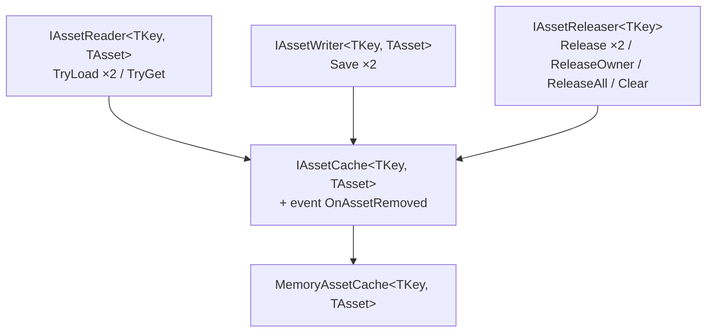
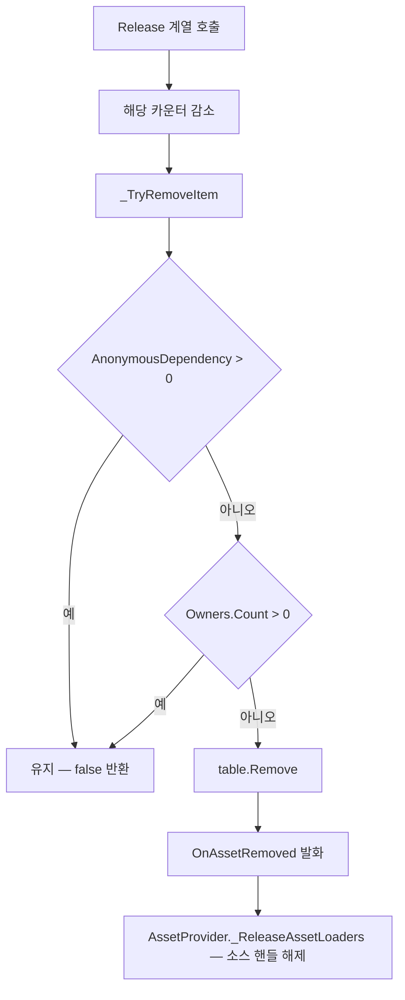
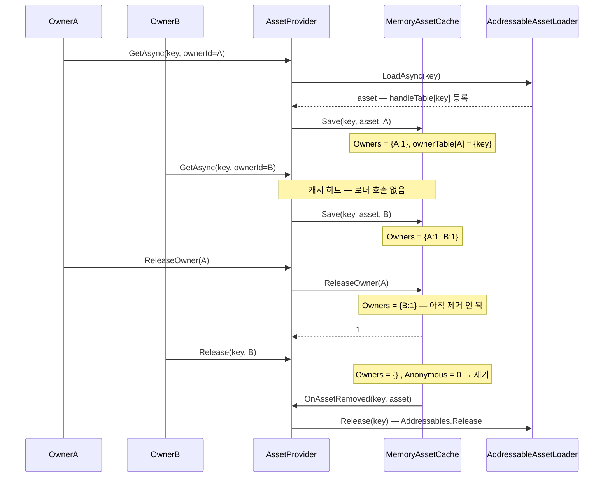

# Cache — 참조 카운트와 소유권

> 대상: `Runtime/Cache/*.cs` (`IAssetReader` / `IAssetWriter` / `IAssetReleaser` / `IAssetCache` / `MemoryAssetCache`)
> 상위 문서: [Runtime/README.md](../Runtime/README.md)

---

## 요약

캐시는 HResource 에서 **참조 카운트를 실제로 보유하는 유일한 지점**이다. provider·lease·owner 는
전부 이 카운터를 조작하는 경로일 뿐이고, 에셋이 살아 있는지 여부는 `MemoryAssetCache` 의 항목
하나가 결정한다. 그 항목이 지워지는 순간에만 `OnAssetRemoved` 가 발화하고, 그 신호가 소스
핸들 해제로 이어진다.

---

## 계약 3분할



세 인터페이스를 나눠 둔 이유는 **부분 계약으로 주입할 여지**를 남기기 위해서다. 다만 현재
패키지 안에서 `IAssetReader` / `IAssetWriter` / `IAssetReleaser` 를 단독 타입으로 받는 코드는
없다 — 전부 `IAssetCache` 로만 다룬다(`Provider/AssetProvider.cs:49`).

---

## 데이터 모델 — 이중 카운터 + 양방향 인덱스

```csharp
// Cache/MemoryAssetCache.cs:35-47
sealed class Item {
    public TAsset Asset;
    public int AnonymousDependency;                       // ownerId 없이 잡은 횟수
    public Dictionary<AssetOwnerId, int> Owners = new();  // owner 별 점유 "횟수"
}

readonly Dictionary<TKey, Item> table = new();                        // key  → 항목
readonly Dictionary<AssetOwnerId, HashSet<TKey>> ownerTable = new();  // owner → 잡은 key 집합
```

`Owners` 가 `HashSet` 이 아니라 `Dictionary<_, int>` 인 것이 중요하다. 주석이 그 사고를 기록해
두었다 — 같은 owner 의 2회 점유(직접 prewarm + 카탈로그 prewarm 등)가 1로 접혀 한 번의
`Release` 로 조기 해제되던 문제다(`Cache/MemoryAssetCache.cs:38-40`).

`ownerTable` 은 역인덱스다. `ReleaseOwner` 가 전체 `table` 을 순회하지 않고 **그 owner 가 잡은
key 만** 도는 데 쓰인다(`:155-174`).

### 제거 조건



**두 카운터가 모두 비어야 제거된다**(`Cache/MemoryAssetCache.cs:196-200`). 익명 경로와 owner
경로는 서로를 대신하지 못한다 — 익명으로 얻고 owner 로 반납하면 항목이 영구 잔류한다.

---

## 다섯 개의 해제 경로

| 메서드 | 대상 | 감소 방식 | 반환 |
|---|---|---|---|
| `Release(key)` (`:132-137`) | 익명 카운터 | 1 감소 | 실제 제거됐으면 `true` |
| `Release(key, ownerId)` (`:139-153`) | 그 owner 의 점유 | **1 감소**. 남아 있으면 `false` | 실제 제거됐으면 `true` |
| `ReleaseOwner(ownerId)` (`:155-174`) | 그 owner 의 전 key | **횟수 무시, 통째로 제거** | 내려놓은 key 수 |
| `ReleaseAll()` (`:176-178`) | 전체 | 카운터 무시, 전량 제거 | — |
| `Clear()` (`:180-182`) | 전체 | `ReleaseAll` 과 동일 구현 | — |

`Release(key, ownerId)` 가 `false` 를 반환하는 경우가 두 가지라는 점에 주의한다 — **해당 owner
가 그 key 를 안 잡고 있을 때**(`:143`)와 **감소는 했지만 아직 남았을 때**(`:145-148`)가 같은
`false` 다. 호출자가 실패와 부분 해제를 구별할 수 없다.

`ReleaseOwner` 가 카운트를 무시하는 것은 명시적 의도다 — "owner 일괄 회수는 점유 횟수와 무관하게
해당 owner 의 점유 전부를 내려놓는다"(`:166`).

---

## 흐름 — 두 소유자가 같은 key 를 공유



---

## `Save` 의 세 갈래

```csharp
// Cache/MemoryAssetCache.cs:108-128 (owner 오버로드)
if (!ownerId.IsValid) return Save(key, asset);            // ① 무효 id → 익명 경로로 강등
if (table.TryGetValue(key, out var item)) {
    if (ReferenceEquals(item.Asset, asset))               // ② 같은 asset → 카운터만 +1
        { _AddOwnerDependency(item, ownerId, key); return true; }
    HLogger.Error(...);                                   // ③ 다른 asset → 거부 + 에러
    return false;
}
```

③ 이 provider 의 롤백 경로와 짝을 이룬다 — 거부되면 provider 가 방금 로드한 핸들을 직접
해제한다(`Provider/AssetProvider.cs:172-177`). silent overwrite 를 하지 않는 대신 호출자에게
`default` 를 돌려준다.

**`Save` 는 멱등하지 않다.** 같은 asset 을 다시 넣으면 카운터가 오른다 — 이것이 provider 가
캐시 히트에도 `Save` 를 부르는 이유다.

---

## `Clear` 의 재진입 방어

```csharp
// Cache/MemoryAssetCache.cs:238-261
const int MAX_CLEAR_PASSES = 8;
for (int pass = 0; pass < MAX_CLEAR_PASSES; pass++) {
    if (table.Count < 1) return;
    var removeItems = new List<KeyValuePair<TKey, Item>>(table);
    table.Clear();
    ownerTable.Clear();
    foreach (var pair in removeItems) _NotifyRemoved(pair.Key, pair.Value.Asset);
}
if (table.Count > 0) HLogger.Error("[AssetCache] Clear did not converge: ...");
```

`OnAssetRemoved` 구독자가 알림 도중 `Save` 를 다시 호출하면 그 항목이 `Clear` 를 통과해
살아남는다. 그래서 잔존이 없어질 때까지 반복하고 8회로 끊는다. **수렴 실패는 에러 로그로만
드러나고 항목은 남는다** — 예외를 던지지 않는다.

---

## 주의할 점

1. **`TryLoad` 두 오버로드는 호출처가 0건이다**(`:54-76`, 전역 `grep "\.TryLoad("` 0건).
   `TryGet` + `Save` 조합이 provider 에서 그 역할을 대신한다. 남겨두면 "조회하면서 점유가
   오르는" 두 번째 규약이 계약(`Cache/IAssetReader.cs:26-27`)에 남는다.
2. **`ReleaseAll()` 과 `Clear()` 는 동일 구현이다**(`:176-182`). 계약상 두 이름이 있으나 의미
   차이가 없다.
3. **`ReleaseOwner` 는 익명 카운터를 건드리지 않는다**(`:164-171`). 같은 key 를 익명으로도
   잡아 두었다면 owner 를 전부 회수해도 항목은 남는다 — 설계상 맞지만, 익명·owner 혼용은
   추적이 어려워지므로 상위 모듈은 한쪽으로 통일하는 편이 낫다.
4. **스레드 안전하지 않다.** `Dictionary` 를 잠금 없이 쓴다. `AssetOwnerIdGenerator` 만
   `Interlocked` 로 보호되어 있어(`Subscription/AssetOwnerIdGenerator.cs:50`) id 발급은
   스레드 안전하지만 캐시 조작은 메인 스레드 전제다.
5. **`OnAssetRemoved` 구독 해제 경로가 얇다.** 구독자는 `AssetProvider` 하나이고, 그 해제는
   `AssetProvider.Dispose()` 뿐인데 호출처가 0건이다(`Provider/AssetProvider.cs:145-147`).
