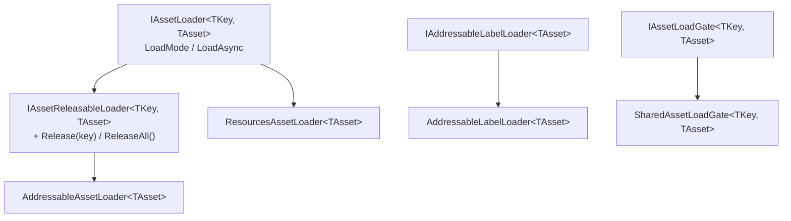
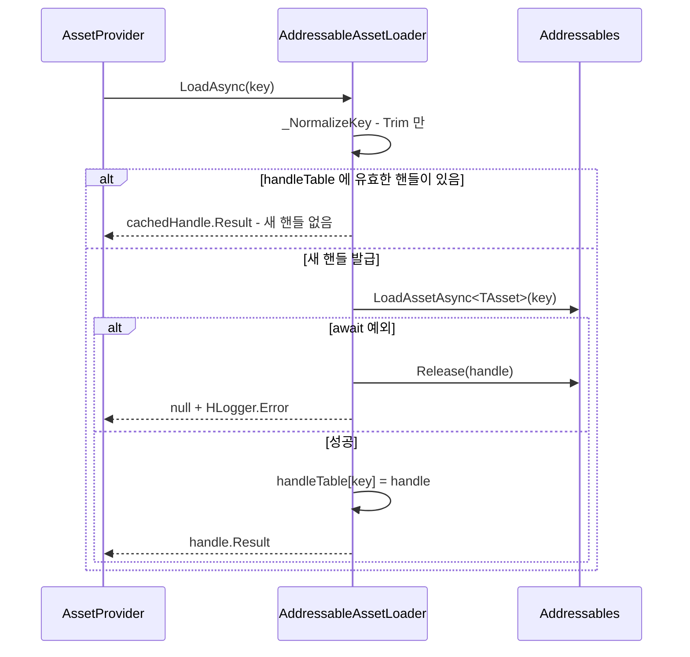
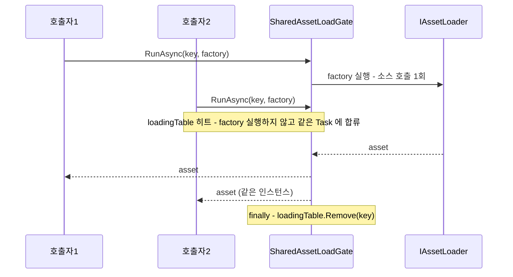

# Load - 소스 로더와 동시성 게이트

> 대상: `Runtime/Load/*.cs` (`IAssetLoader` / `IAssetReleasableLoader` / `ResourcesAssetLoader` /
> `AddressableAssetLoader` / `IAddressableLabelLoader` / `AddressableLabelLoader` /
> `IAssetLoadGate` / `SharedAssetLoadGate`)
> 상위 문서: [Runtime/README.md](../Runtime/README.md)

---

## 요약

로더는 **`TKey` 를 실제 소스 API 호출로 번역하는 유일한 지점**이다. 캐시·소유권·fetch 순서는
전부 위층의 일이고, 로더는 "이 key 로 이 소스에서 하나 가져와라"와 "그 핸들을 돌려줘라" 둘만
안다. 게이트는 그 호출이 같은 key 로 겹칠 때 하나로 합친다.

---

## 계약 계층



`AddressableLabelLoader` 는 `IAssetLoader` 를 구현하지 **않는다**. `AssetProvider` 의
`loaderTable` 에 등록될 수 없는 별개의 축이다(`Load/AddressableLabelLoader.cs:24-25`).

| 로더 | `LoadMode` | 소스 해제 | 핸들 보관 |
|---|---|---|---|
| `ResourcesAssetLoader` | `Resources` | 없음 (`IAssetReleasableLoader` 미구현) | 없음 |
| `AddressableAssetLoader` | `Addressable` | `Addressables.Release` | `Dictionary<string, AsyncOperationHandle<TAsset>>` |
| `AddressableLabelLoader` | 해당 없음 | 4종 label 별 Release | single/multi 두 테이블 |

---

## ResourcesAssetLoader - 정규화만 한다

```csharp
// Load/ResourcesAssetLoader.cs:58-77
private string _NormalizeKey(string key) {
    var normalizedKey = _TrimExtension(key).TrimStart('/');          // 확장자 제거 + 선행 슬래시
    if (string.IsNullOrEmpty(resourcesRootPath)) return normalizedKey;
    if (normalizedKey.StartsWith(resourcesRootPath, OrdinalIgnoreCase))
        return normalizedKey;                                         // 이미 root 로 시작하면 그대로
    return $"{resourcesRootPath}/{normalizedKey}";
}
```

`LoadAsync` 는 `Resources.Load` 동기 호출을 `UniTask.FromResult` 로 감싼 즉시 완료 비동기다
(`:48-54`). 즉 **`Resources` 모드에서는 프레임이 넘어가지 않는다** - 로드 비용이 호출 프레임에
전부 실린다.

`StartsWith` 방어(`:72-74`)에는 한계가 있다. rootPath 가 `Audio` 일 때 key `AudioClip/Foo` 는
접두사가 일치하므로 결합을 건너뛴다 - 경로 경계(`/`)를 검사하지 않기 때문이다. 패키지 내 실제
호출은 전부 `rootPath = string.Empty` 라(`Provider/AssetProviderFactory.cs:38`,
`HAudio/.../AudioClipRepository.cs:178`, `HUI/Popup/ImagePopup.cs:97`) 현재는 도달하지 않는다.

---

## AddressableAssetLoader - 핸들 1:1 보관



**실패 판정은 `try/catch` 로만 한다.** UniTask 에서 실패한 핸들의 `await` 는 예외를 던지므로
사후 `Status` 검사는 도달할 수 없다 - 코드 주석이 그 근거를 남겨 두었다
(`Load/AddressableAssetLoader.cs:44-51`).

핸들 테이블은 **key 당 1개**다(`:53`). 같은 key 를 두 번 로드해도 Addressables 참조 카운트는
1 이고, `Release(key)` 한 번이면 사라진다(`:59-75`). 다중 점유 계산은 전적으로 캐시의 몫이라는
전제 위에 서 있는 구조다 - provider 가 캐시 미스일 때만 로더를 부르고, 캐시 항목이 실제로
제거될 때만 `Release` 를 부르기 때문에 1:1 이 유지된다.

`ReleaseAll()` (`:77-83`)은 캐시와 무관하게 전 핸들을 지운다. **캐시에는 항목이 남아 있는데
핸들만 사라진 상태**를 만들 수 있으므로, 셧다운 경로에서만 써야 한다.

---

## AddressableLabelLoader - 별개 축

label 질의 4종(`All` / `First` / `Single` / `Index`)을 제공하고, 조회 방식까지 포함한 복합 키로
핸들을 나눠 보관한다.

```csharp
// Load/AddressableLabelLoader.cs:34-43
readonly struct LabelHandleKey : IEquatable<LabelHandleKey> {
    public string Label { get; }
    public AddressableLabelLoadMode LoadMode { get; }   // All / First / Single / Index
    public int Index { get; }                            // Index 모드에서만 의미
}
```

`_LoadSingleAsync` 는 **위치 질의 핸들과 에셋 핸들의 수명을 분리**한다 - 위치 핸들은 `finally`
에서 반드시 해제하고, 에셋 핸들만 테이블에 남긴다(`:146-190`, 해제는 `:185-189`).

| 질의 | 위치 해석 | 실패 조건 |
|---|---|---|
| `LoadFirstAsync` | `locations[0]` (`:194-197`) | 결과 0건 |
| `LoadSingleAsync` | `locations.Count != 1` 이면 실패 (`:199-202`) | 0건 또는 2건 이상 |
| `LoadByIndexAsync` | `(uint)index >= (uint)Count` 검사 (`:204-208`) | 범위 밖 (음수 포함) |
| `LoadAllAsync` | `Addressables.LoadAssetsAsync` (`:67-90`) | await 예외 |

**이 로더는 패키지 어디에서도 호출되지 않는다** (`AddressableLabelLoader` / `LoadAllAsync` /
`LoadFirstAsync` / `LoadSingleAsync` / `LoadByIndexAsync` 전역 grep - 자기 파일과 인터페이스
정의 외 0건). 캐시·소유권·게이트가 적용되지 않는 축이므로, 쓰게 될 경우 해제 책임은 전적으로
호출자에게 있다.

---

## SharedAssetLoadGate - 진행 중 작업 합류

```csharp
// Load/SharedAssetLoadGate.cs:32-50
public async UniTask<TAsset> RunAsync(TKey key, Func<UniTask<TAsset>> factory) {
    if (factory == null) HLogger.Throw(new ArgumentNullException(...));
    if (loadingTable.TryGetValue(key, out var runningTask)) return await runningTask;

    var newTask = factory.Invoke().AsTask();   // UniTask → Task : multi-continuation 허용
    loadingTable[key] = newTask;
    try { return await newTask; }
    finally { loadingTable.Remove(key); }
}
```

`AsTask()` 변환이 이 클래스의 존재 이유다. `UniTask` 는 single-continuation 제약이 있어 여러
호출자가 같은 인스턴스를 `await` 할 수 없다 - Dev Log 가 `Preserve` 시도 후 `Task` 전환으로
정정한 경위를 남겨 두었다(`:59-63`).



**게이트는 결과 캐시가 아니다.** 완료 즉시 테이블에서 빠지므로 다음 요청은 다시 소스를 친다
(캐시 히트 여부는 factory 안, 즉 provider 의 fetch mode 가 결정한다).

주의 지점:

- `finally` 의 `Remove(key)` 는 **키 존재만 보고 지운다**. 첫 호출이 완료된 뒤 새 호출이
  같은 key 를 등록했다면 이론상 남의 항목을 지울 수 있으나, `await` 완료와 `finally` 사이에
  다른 코드가 끼어들 지점이 메인 스레드 단일 루프에서는 없다.
- **예외는 합류한 전원에게 전파된다.** 최초 호출자의 factory 가 던지면 `await runningTask` 를
  하던 후속 호출자도 같은 예외를 받는다.
- 호출마다 `AsTask()` 로 `Task` 를 할당한다 - 게이트를 통과하는 모든 `GetAsync` 에 붙는 비용이다.

---

## 주의할 점

1. **`ResourcesAssetLoader` 는 해제 계약이 없다.** 캐시에서 지워져도 메모리에서 내려가지
   않는다(`:29`). `Resources` 모드는 씬 전환 시 Unity 의 자동 정리에 의존한다.
2. **`AddressableAssetLoader.LoadAsync` 는 캐시된 핸들을 반환할 때 Addressables 참조 카운트를
   올리지 않는다**(`:37-40`). provider 를 우회해 로더를 직접 여러 번 호출하면 첫 `Release` 로
   전부 무효화된다.
3. **`ReleaseAll()` 은 상위 캐시와 동기화되지 않는다**(`AddressableAssetLoader.cs:77-83`,
   `AddressableLabelLoader.cs:131-142`). 캐시에 항목이 남은 채 핸들만 사라져 `null` 참조를
   들고 있는 상태가 된다.
4. **`AddressableLabelLoader` 는 사용처 0건이다** (264행 + 계약 51행). 정리 대상 후보다.
5. **로더는 `loadMode` 당 하나만 등록된다.** `loaderTable[assetLoader.LoadMode] = assetLoader`
   가 덮어쓰기라(`Provider/AssetProvider.cs:103`), 같은 `LoadMode` 로더를 둘 넘기면 뒤엣것만
   남고 경고도 없다.
