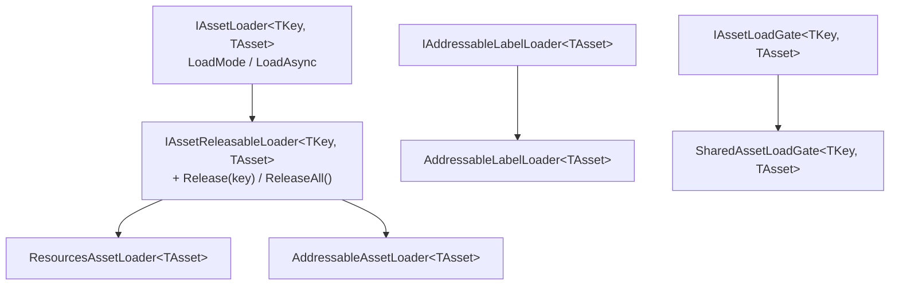
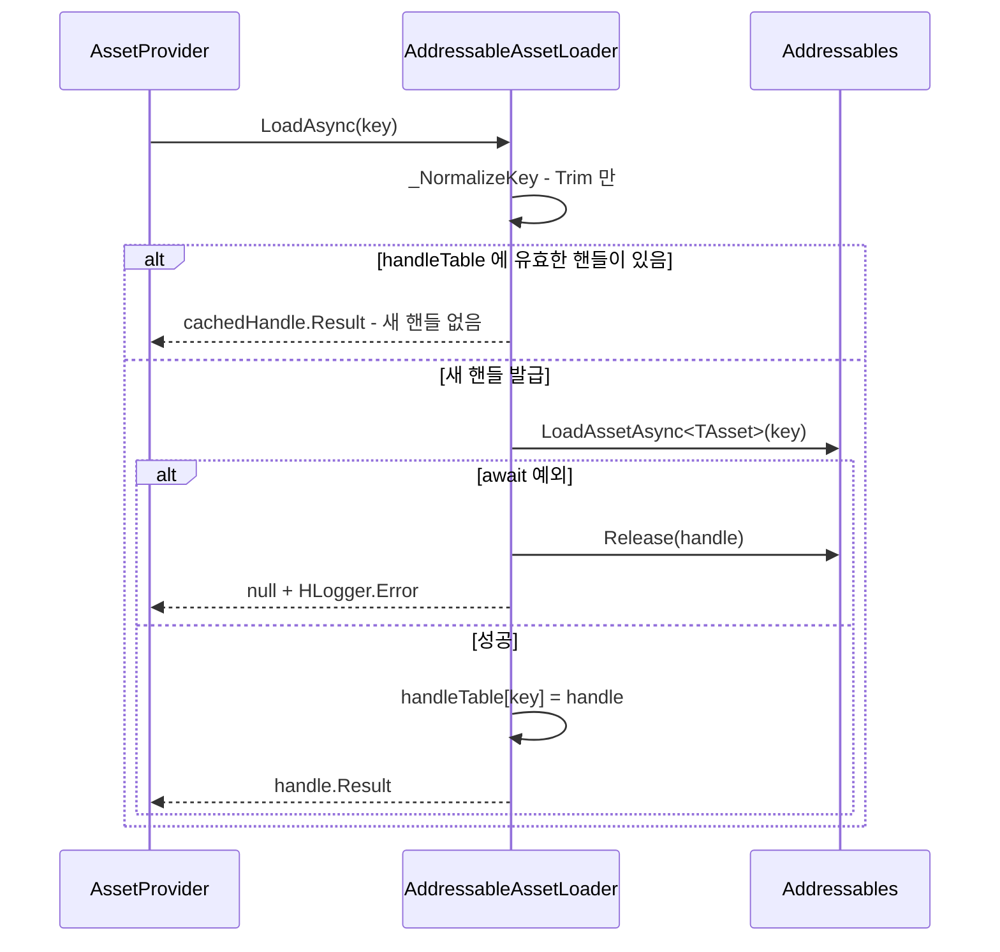
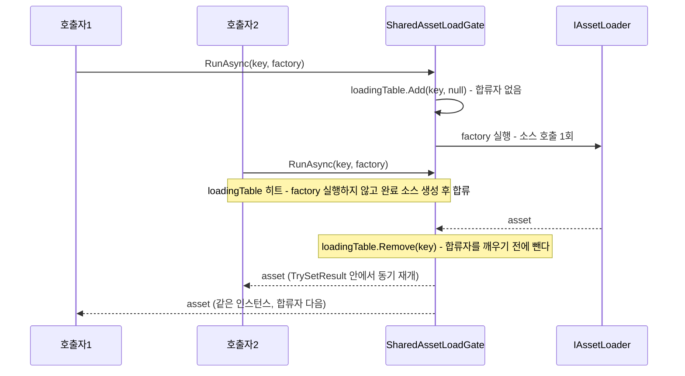

# Load - 소스 로더와 동시성 게이트

> 대상: `Runtime/Load/*.cs` (`IAssetLoader` / `IAssetReleasableLoader` / `ResourcesAssetLoader` / `AddressableAssetLoader` / `IAddressableLabelLoader` / `AddressableLabelLoader` / `IAssetLoadGate` / `SharedAssetLoadGate`)
> 상위 문서: [Runtime/README.md](../Runtime/README.md)

---

## 요약

로더는 **`TKey` 를 실제 소스 API 호출로 번역하는 유일한 지점**이다. 캐시·소유권·fetch 순서는 전부 위층의 일이고, 로더는 "이 key 로 이 소스에서 하나 가져와라"와 "그 핸들을 돌려줘라" 둘만 안다. 게이트는 그 호출이 같은 key 로 겹칠 때 하나로 합친다.

---

## 계약 계층



`AddressableLabelLoader` 는 `IAssetLoader` 를 구현하지 **않는다**. `AssetProvider` 의 `loaderTable` 에 등록될 수 없는 별개의 축이다 (`Load/AddressableLabelLoader.cs:24-25`).

| 로더 | `LoadMode` | 소스 해제 | 핸들 보관 |
|---|---|---|---|
| `ResourcesAssetLoader` | `Resources` | `Resources.UnloadAsset` (GameObject / Component 제외) | `Dictionary<string, TAsset>` |
| `AddressableAssetLoader` | `Addressable` | `Addressables.Release` | `Dictionary<string, AsyncOperationHandle<TAsset>>` |
| `AddressableLabelLoader` | 해당 없음 | 4종 label 별 Release | single/multi 두 테이블 |

---

## ResourcesAssetLoader - 정규화, 비동기 로드, 해제

```csharp
// Load/ResourcesAssetLoader.cs:108-133 - 요약
private string _NormalizeKey(string key) {
    var normalizedKey = _TrimExtension(key).TrimStart('/');          // 확장자 제거 + 선행 슬래시
    if (string.IsNullOrEmpty(resourcesRootPath)) return normalizedKey;
    bool isUnderRootPath = normalizedKey.Equals(resourcesRootPath, OrdinalIgnoreCase)
        || normalizedKey.StartsWith(resourcesRootPath + "/", OrdinalIgnoreCase);
    if (isUnderRootPath) return normalizedKey;                        // 이미 root 하위면 그대로
    return $"{resourcesRootPath}/{normalizedKey}";
}
```

"이미 rootPath 하위" 판정은 경로 경계까지 본다. rootPath 가 `Icon` 일 때 key `IconSet/A` 는 `Icon` 으로 시작하지만 뒤에 `/` 가 오지 않으므로 하위로 보지 않고 `Icon/IconSet/A` 로 결합한다.

`LoadAsync` 는 `Resources.LoadAsync<TAsset>` 가 돌려준 `ResourceRequest` 를 `ToUniTask()` 로 await 한다 (`Load/ResourcesAssetLoader.cs:55-67`). 메인 스레드 부담을 여러 프레임으로 나눌 뿐 없애지는 않는다. 로드 후 오브젝트 통합과 텍스처 업로드는 모든 플랫폼에서 메인 스레드에서 일어나고, WebGL 은 기본 설정에 로딩 스레드가 없어 로드 자체도 메인 스레드에서 진행된다. 완료는 다음 프레임 이후에 온다. 자산이 없으면 예외 없이 `null` 을 반환한다.

로드에 성공한 에셋은 정규화된 key 로 `loadedTable` 에 기록한다. `Release(key)` 는 그 에셋을 표에서 빼고 `Resources.UnloadAsset` 으로 내린다 (`:71-83`). `ReleaseAll()` 은 전부 내린다 (`:85-91`). provider 가 이 로더를 releasable 로 인식하므로 캐시 제거(`OnAssetRemoved`) 때 자동으로 불린다.

`Resources.UnloadAsset` 은 개별 에셋 전용이라 `GameObject` / `Component` 에 부르면 Unity 가 에러를 낸다. 그 둘은 추적만 풀고 메모리 회수는 `Resources.UnloadUnusedAssets` 에 맡긴다 (`:95-104`). 내린 에셋을 씬이나 다른 provider 가 계속 참조하면 Unity 가 디스크에서 다시 읽으므로 참조가 깨지지는 않는다.

---

## AddressableAssetLoader - 핸들 1:1 보관



**실패 판정은 `try/catch` 로만 한다.** UniTask 에서 실패한 핸들의 `await` 는 예외를 던지므로 사후 `Status` 검사는 도달할 수 없다 - 코드 주석이 그 근거를 남겨 두었다 (`Load/AddressableAssetLoader.cs:47-56`).

핸들 테이블은 **key 당 1개**다 (`:30`). 같은 key 를 두 번 로드해도 Addressables 참조 카운트는 1 이고, `Release(key)` 한 번이면 사라진다 (`:64-80`). 다중 점유 계산은 전적으로 캐시의 몫이라는 전제 위에 서 있는 구조다 - provider 가 캐시 미스일 때만 로더를 부르고, 캐시 항목이 실제로 제거될 때만 `Release` 를 부르기 때문에 1:1 이 유지된다.

`ReleaseAll()` (`:82-88`)은 캐시와 무관하게 전 핸들을 지운다. **캐시에는 항목이 남아 있는데 핸들만 사라진 상태**를 만들 수 있으므로, 셧다운 경로에서만 써야 한다.

---

## AddressableLabelLoader - 별개 축

label 질의 4종(`All` / `First` / `Single` / `Index`)을 제공하고, 조회 방식까지 포함한 복합 키로 핸들을 나눠 보관한다.

```csharp
// Load/AddressableLabelLoader.cs:34-43
readonly struct LabelHandleKey : IEquatable<LabelHandleKey> {
    public string Label { get; }
    public AddressableLabelLoadMode LoadMode { get; }   // All / First / Single / Index
    public int Index { get; }                            // Index 모드에서만 의미
}
```

`_LoadSingleAsync` 는 **위치 질의 핸들과 에셋 핸들의 수명을 분리**한다 - 위치 핸들은 `finally` 에서 반드시 해제하고, 에셋 핸들만 테이블에 남긴다 (`:146-190`, 해제는 `:185-189`).

| 질의 | 위치 해석 | 실패 조건 |
|---|---|---|
| `LoadFirstAsync` | `locations[0]` (`:194-197`) | 결과 0건 |
| `LoadSingleAsync` | `locations.Count != 1` 이면 실패 (`:199-202`) | 0건 또는 2건 이상 |
| `LoadByIndexAsync` | `(uint)index >= (uint)Count` 검사 (`:204-208`) | 범위 밖 (음수 포함) |
| `LoadAllAsync` | `Addressables.LoadAssetsAsync` (`:67-90`) | await 예외 |

캐시·소유권·게이트가 적용되지 않는 축이므로 해제 책임은 전적으로 호출자에게 있다. 같은 질의를 반복하면 테이블의 기존 핸들을 돌려주고, `Release*ByLabel` 한 번으로 그 핸들이 사라진다.

---

## SharedAssetLoadGate - 진행 중 작업 합류

```csharp
// Load/SharedAssetLoadGate.cs:46-79 - 요약
public async UniTask<TAsset> RunAsync(TKey key, Func<UniTask<TAsset>> factory) {
    if (factory == null) HLogger.Throw(new ArgumentNullException(...));

    if (loadingTable.TryGetValue(key, out var joined)) {
        if (joined == null) loadingTable[key] = joined = new UniTaskCompletionSource<TAsset>();   // 첫 합류자가 생성
        return await joined.Task;
    }

    loadingTable.Add(key, null);                      // null = 진행 중, 합류자 없음
    TAsset result;
    try { result = await factory.Invoke(); }
    catch (Exception exception) {                     // 삼키지 않고 전파
        loadingTable.Remove(key, out var failed);
        failed?.TrySetException(exception);
        throw;
    }

    loadingTable.Remove(key, out var source);         // 먼저 뺀다
    source?.TrySetResult(result);                     // 합류자가 이 스택 안에서 동기로 재개
    return result;
}
```

**완료 소스는 첫 합류자가 만든다.** `UniTaskCompletionSource` 는 여러 곳에서 await 할 수 있지만, 항상 만들면 결함이 둘 생긴다. 합류자 없이 실패하면 아무도 읽지 않은 `ExceptionHolder` 가 GC 시점에 소멸자에서 `PublishUnobservedTaskException` 으로 한 번 더 보고되고, 생성자가 `TaskTracker` 에 등록한 항목이 결과를 읽는 `MarkHandled` 없이 남는다. 지연 생성은 둘 다 없애고, 합류가 없는 흔한 경우의 할당을 0 으로 만든다.

**합류자는 동기로 재개된다.** `TrySetResult` 가 lock 안에서 continuation 을 차례로 호출하므로 합류자는 최초 호출자와 같은 프레임, 같은 호출 스택에서 깨어나고 최초 호출자는 그 뒤에 반환한다. 이전 구현(`AsTask()` 로 만든 `Task` 공유)은 합류자의 await 가 `SynchronizationContext` 를 거쳐 늦게 재개될 수 있었다.

**`Preserve()` 로는 대신할 수 없다.** `UniTaskCompletionSource<T>` **클래스**는 진행 중에 들어온 continuation 을 `singleContinuation` 과 `secondaryContinuationList` 에 모아 두므로 여러 합류자가 동시에 await 할 수 있다. `async UniTask` 메서드의 결과(`UniTaskCompletionSourceCore` 기반)와 `Preserve()` 의 `MemoizeSource` 는 진행 중 continuation 슬롯이 하나라서, 두 번째 합류자가 `"Already continuation registered"` 로 던진다. `Preserve` 가 보장하는 것은 완료 **뒤의** 반복 await 뿐이고, 게이트는 완료 즉시 항목을 빼므로 그 구간에 도달하는 호출자가 없다.

게이트는 **정합성 장치**다. `AddressableAssetLoader` 는 `handleTable` 조회가 await 앞, 등록이 await 뒤라서 게이트가 없으면 동시 요청 2건이 모두 `LoadAssetAsync` 를 불러 Addressables 참조 카운트가 2 가 되고, `handleTable` 은 뒤엣것으로 덮여 `Release` 1회로는 0 에 도달하지 못한다. `ResourcesAssetLoader` 도 `LoadAsync` 가 진행 중 구간을 가지므로 같은 key 동시 요청은 합쳐진다. Resources 는 핸들 참조 카운트가 없어 게이트가 없어도 잔존은 생기지 않는다.



**게이트는 결과 캐시가 아니다.** 완료 즉시 테이블에서 빠지므로 다음 요청은 다시 factory 를 실행한다 (캐시 히트 여부는 factory 안, 즉 provider 의 fetch mode 가 결정한다).

주의 지점:

- **`Remove` 가 합류자 재개보다 먼저다.** 재개된 합류자(또는 그 호출자)가 같은 key 를 다시 요청하면 끝난 항목에 합류하지 않고 새 로드로 간다.
- **예외는 합류한 전원에게 전파된다.** 최초 호출자의 factory 가 던지면 합류자도 같은 예외를 받는다. 취소(`OperationCanceledException`)는 `TrySetException` 이 `TrySetCanceled` 로 넘겨 합류자에게 취소로 전달된다.
- **factory 안에서 같은 key 로 게이트를 다시 부르면 교착한다.** 등록이 factory 호출 앞이라 자기 자신에게 합류한다. 등록을 뒤로 미루면 교착 대신 이중 로드가 되어 Addressables 참조 카운트 잔존이 생기므로, 교착을 택하고 `IAssetLoadGate` 계약으로 금지한다.
- **동기 재개는 "획득 직후 동기 반납" 경합을 닫지 않는다.** 합류자 쪽 호출자가 받자마자 `Release` 하면 점유가 0 이 되어 핸들이 반납되고, 뒤이어 재개되는 최초 호출자는 반납된 에셋을 받는다 (`Provider/AssetProvider.cs:256-311`). 이전 구현에서도 프레임을 사이에 두고 같은 일이 생길 수 있었고, 닫으려면 결과를 나눠 주는 동안 임시 점유를 잡는 별도 설계가 필요하다.
- 동작은 `HResource/Tests/Editor/SharedAssetLoadGateTests.cs` 가 EditMode 로 검증한다.

---

## 주의할 점

1. **`ResourcesAssetLoader` 는 프리팹을 내리지 못한다.** `GameObject` / `Component` 는 `Resources.UnloadAsset` 대상이 아니라 추적만 풀린다 (`Load/ResourcesAssetLoader.cs:95-104`). 회수는 `Resources.UnloadUnusedAssets` 나 씬 전환 정리에 의존한다.
2. **`AddressableAssetLoader.LoadAsync` 는 캐시된 핸들을 반환할 때 Addressables 참조 카운트를 올리지 않는다** (`Load/AddressableAssetLoader.cs:42-45`). provider 를 우회해 로더를 직접 여러 번 호출하면 첫 `Release` 로 전부 무효화된다.
3. **`ReleaseAll()` 은 상위 캐시와 동기화되지 않는다** (`AddressableAssetLoader.cs:82-88`, `AddressableLabelLoader.cs:131-142`). 캐시에 항목이 남은 채 핸들만 사라져 `null` 참조를 들고 있는 상태가 된다.
4. **로더는 `loadMode` 당 하나만 등록된다.** `loaderTable[assetLoader.LoadMode] = assetLoader` 가 덮어쓰기라 (`Provider/AssetProvider.cs:95-101`), 같은 `LoadMode` 로더를 둘 넘기면 뒤엣것만 남는다. 생성자가 경고를 남긴다.
5. **같은 Resources 에셋을 provider 여럿이 들면 한쪽 해제가 에셋을 내린다.** Resources 는 참조 카운트가 없어 한 provider 의 캐시에서 빠지는 순간 `UnloadAsset` 이 불린다. 다른 쪽 참조는 Unity 가 디스크에서 다시 읽어 살아나지만 그 재로드 비용이 든다.

---

## 히스토리

### 2026-09-21 :: `ResourcesAssetLoader` 에 해제 경로 추가

- 이전: `IAssetLoader` 만 구현해 해제 수단이 없었다. 캐시에서 빠져도 에셋은 씬 전환이나 `Resources.UnloadUnusedAssets` 까지 메모리에 남았다.
- 현재: `IAssetReleasableLoader` 를 구현한다. 캐시 제거 시 provider 가 `Release(key)` 를 부르고, 로더가 `Resources.UnloadAsset` 으로 내린다.

### 2026-09-21 :: `SharedAssetLoadGate` 를 지연 생성 완료 소스로 교체

- 이전: 최초 호출자가 `factory.Invoke().AsTask()` 로 만든 `Task` 를 표에 두고 합류자가 그것을 await 했다. `finally` 에서 표를 정리했다. 합류 여부와 관계없이 호출마다 `Task` 를 할당했고, 합류자는 `SynchronizationContext` 를 거쳐 늦게 재개될 수 있었다. factory 를 먼저 불러 같은 key 재진입은 이중 로드였다.
- 현재: 첫 합류자가 `UniTaskCompletionSource` 를 만들고 합류자는 `TrySetResult` 안에서 동기로 재개된다. 같은 key 재진입은 교착이며 계약으로 금지한다. 2026-05-01 에 시도했다 되돌린 `Preserve` 는 진행 중 동시 합류를 지원하지 않아 쓰지 않았다.

### 2026-09-21 :: `ResourcesAssetLoader` 를 비동기 로드로 전환

- 이전: `Resources.Load` 동기 호출을 `UniTask.FromResult` 로 감싼 즉시 완료 비동기였다. 로드 비용이 호출 프레임에 전부 실렸고, 진행 중 구간이 없어 게이트가 Resources 요청을 합칠 일이 없었다.
- 현재: `Resources.LoadAsync` 를 await 한다. Resources 요청도 게이트에서 합쳐진다.

### 2026-08-06 :: rootPath 경계 검사와 중복 로더 경고

- 이전: `_NormalizeKey` 의 "이미 rootPath 하위" 판정이 `StartsWith(rootPath)` 하나라서 rootPath `Audio` 와 key `AudioClip/Foo` 처럼 접두사가 겹치면 결합을 건너뛰었다. 같은 `LoadMode` 로더를 두 번 넘기면 경고 없이 덮어썼다.
- 현재: `Equals(rootPath)` 또는 `StartsWith(rootPath + "/")` 로 경로 경계를 본다. 중복 로더는 경고를 남긴다.
