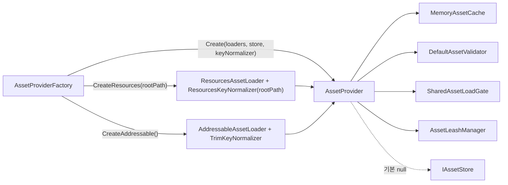
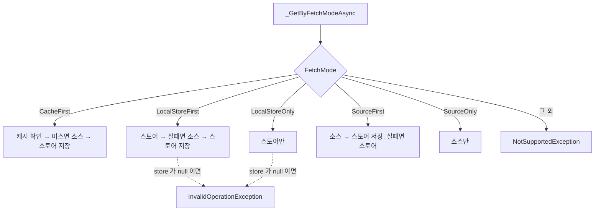
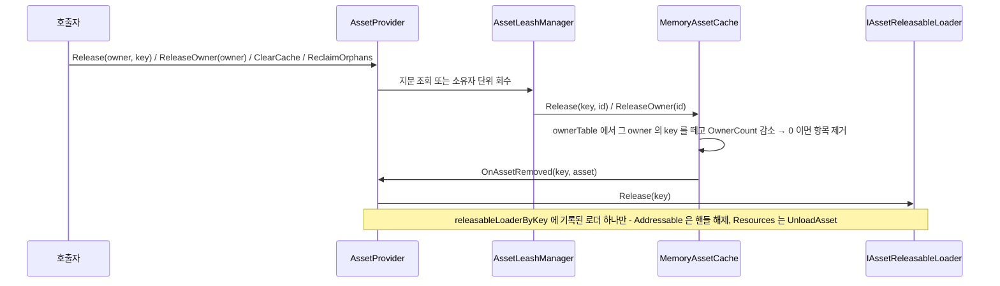

# Provider - 오케스트레이션·조회 정책·검증·저장소

> 대상: `Runtime/Provider/*.cs`, `Runtime/Store/IAssetStore.cs`, `Runtime/Validation/*.cs`, `Runtime/Data/*.cs`
> 상위 문서: [Runtime/README.md](../Runtime/README.md)

---

## 요약

`AssetProvider<TKey, TAsset>` 는 6 개 컴포넌트(Cache / Store / Loader[] / Validator / LoadGate / KeyNormalizer)를 생성자로 주입받아 **조율만** 한다. key 는 입구(획득 · 조회 · 반납)에서 KeyNormalizer 로 한 번 맞추고 그 뒤로는 모든 표가 같은 key 를 쓴다. 점유는 캐시가, 소스 핸들은 로더가, 소유자 지문은 상주 `AssetLeashManager` 가 갖는다. provider 가 직접 들고 있는 표는 `loaderTable`(loadMode → 로더 라우팅)과 `releasableLoaderByKey`(key → 그 key 를 실제로 로드한 releasable 로더) 둘뿐이다 (`Provider/AssetProvider.cs:60-61`).

외부에 드러나는 계약은 `IAssetSource<TKey, TAsset>` 다 (`Provider/IAssetSource.cs:47-82`). 자산을 얻는 멤버가 전부 소유자를 요구하므로, 소유자 없는 획득은 컴파일되지 않는다.

---

## 조립과 fail-fast

```csharp
// Provider/AssetProvider.cs:73-120 - 요약
if (assetLoaders   == null) HLogger.Throw(new ArgumentNullException(...));
if (assetCache     == null) HLogger.Throw(...);
if (assetValidator == null) HLogger.Throw(...);
if (assetLoadGate  == null) HLogger.Throw(...);
if (keyNormalizer  == null) HLogger.Throw(...);   // store 만 null 허용

this.assetCache.OnAssetRemoved += _OnAssetRemoved; // 해제 연쇄의 유일한 배선

foreach (var assetLoader in assetLoaders) {
    if (assetLoader == null) HLogger.Throw(new ArgumentException(...));
    if (loaderTable.ContainsKey(assetLoader.LoadMode)) HLogger.Warning(...);  // 덮어쓰기 경고
    loaderTable[assetLoader.LoadMode] = assetLoader;
}
if (loaderTable.Count < 1) HLogger.Throw(new ArgumentException("No asset loader registered."));

leashManager = new AssetLeashManager<TKey, TAsset>(this);   // 지문 발급·파괴 감지 전담
```

`HLogger.Throw` 는 기본 인자 `doThrow: true` 로 실제로 던진다 (`HDiagnosis/Runtime/Logger/HLogger.cs:146-150`). 즉 생성자 통과 = 모든 컴포넌트 유효가 보장된다. `assetStore` 만 `null` 을 허용하고, 그 결과가 fetch mode 5종 중 2종의 가용성을 가른다.



**팩토리는 로더를 하나만 등록한다** (`Provider/AssetProviderFactory.cs:34-49`). 규칙을 직접 넘기지 않는 한 **한 provider = 한 key 규칙 = 한 소스**다. 두 소스가 필요하면 provider 를 둘 만든다. `Create` 에 규칙 없이 Resources 와 Addressable 로더를 함께 넘기면 조립 시점에 `ArgumentException` 이 난다 (`_InferKeyNormalizer`). 규칙을 직접 넘기면 혼합도 조립되고, 그 규칙이 두 소스에 맞는지는 호출자 책임이다. 규칙 하나로는 두 소스 중 한쪽이 틀리고, `Release` / `TryGet` 이 `loadMode` 를 받지 않아 요청마다 규칙을 고를 수 없기 때문이다. 등록되지 않은 `loadMode` 로 요청하면 `_ResolveLoader` 가 `InvalidOperationException` 을 던진다 (`Provider/AssetProvider.cs:486-494`).

---

## fetch mode 5종



| 모드 | 캐시 조회 | 스토어 | 소스 | store 없이 호출 시 |
|---|---|---|---|---|
| `CacheFirst` (`:367-377`) | 있음 | 저장만 시도 | 미스일 때 | 정상 (저장이 no-op) |
| `LocalStoreFirst` (`:381-398`) | **없음** | 읽기+쓰기 | 폴백 | **예외** |
| `LocalStoreOnly` (`:400-411`) | **없음** | 읽기 | 안 함 | **예외** |
| `SourceFirst` (`:415-428`) | **없음** | 폴백 읽기 + 쓰기 | 항상 | 정상 (`:422` 에서 `default` 반환) |
| `SourceOnly` (`:430-434`) | **없음** | 안 함 | 항상 | 정상 |

**캐시를 읽는 모드는 `CacheFirst` 하나뿐이다.** 나머지 4종은 캐시를 건너뛰고 소스/스토어를 직접 친다. 다만 결과는 **모든 모드에서** 캐시에 `Save` 된다 (`_SaveCache`) - 즉 `SourceOnly` 를 반복 호출하면 매번 소스를 치지만 그 소유자의 점유는 하나로 유지된다.

`_SaveStoreOrReleaseSourceAsync` 는 store 가 없으면 바로 반환한다 (`:470-471`). store 저장이 예외를 던지면 방금 잡은 로더 핸들을 되돌린 뒤 예외를 다시 던진다 (`:473-481`). 캐시 등록 전이라 `OnAssetRemoved` 연쇄로는 그 핸들이 회수되지 않기 때문이다.

---

## 캐시 히트 빠른 경로

`GetForOwnerAsync` 는 `_GetAsync` 를 부르기 전에 `_TryAcquireCached` 를 먼저 본다. 아래 조건이 모두 맞으면 게이트와 async 체인을 건너뛰고 `UniTask.FromResult` 로 동기 반환한다.

| 순서 | 조건 | 실패 시 |
|---|---|---|
| 1 | `FetchMode == CacheFirst` | 기존 경로 |
| 2 | `liveToken.IsLive` | 기존 경로 |
| 3 | `assetValidator.CanLoad(key)` | 기존 경로 |
| 4 | 캐시에 key 가 있음 | 기존 경로 (로드) |
| 5 | `_IsValidAsset(key, asset)` | 기존 경로 |
| 6 | `_SaveCache` 성공 (점유 등록) | 기존 경로 (로그 · 롤백은 그쪽이 맡음) |

- 게이트가 지키는 불변식은 **"로더 호출은 반드시 게이트를 지난다"** 이다. 히트는 로더를 부르지 않으므로 이 불변식 밖이다.
- 빠른 경로는 async 가 아닌 `GetForOwnerAsync` 안에 있다. `_GetAsync` 안에 두면 진입만으로 클로저와 상태 기계가 할당된다.
- 의미가 바뀌는 경우가 하나 있다. 같은 key 에 다른 fetch mode 의 로드(예: `SourceOnly`)가 진행 중이면, 예전에는 `CacheFirst` 요청도 그 로드에 합류했지만 이제는 캐시본을 즉시 받는다.
- 동기로 끝나므로 await 사이의 소유자 사망(RACE-1)은 이 경로에 없다. 생존 판정은 2 번 조건이 한 번 한다.

---

## 게이트 밖 점유 등록 - 이 시스템의 핵심 결정

```csharp
// Provider/AssetProvider.cs:258-319 - 요약
private async UniTask<TAsset> _GetAsync(AssetRequest<TKey> request, OwnerLiveToken liveToken) {
    if (!assetValidator.CanLoad(request.Key)) return default;

    var asset = await assetLoadGate.RunAsync(request.Key, request, fetchByModeFactory);   // factory 는 생성자에서 1 회 생성

    if (disposed) { _ReleaseLoaderHandle(request.LoadMode, request.Key); return default; }

    // 점유 등록은 게이트 밖에서 호출자마다 수행한다.
    if (_IsValidAsset(request.Key, asset)) {
        if (!_SaveCache(request, asset)) {
            _ReleaseLoaderHandle(request.LoadMode, request.Key);   // 이 요청의 로더만
            return default;
        }
        _TrackReleasableLoader(request.Key, request.LoadMode);    // 이후 해제 대상 기록
        if (!liveToken.IsLive) {                                   // await 사이에 소유자 사망
            assetCache.Release(request.Key, request.OwnerId);
            return default;
        }
    }
    return asset;
}
```

다섯 가지가 이 메서드에 겹쳐 있다.

1. **dedupe 와 점유의 분리.** 소스 호출은 합치고 점유 등록은 호출자마다 따로 한다. 게이트 안(factory)은 최초 호출자 1회만 실행되므로, 안에서 등록하면 합류한 후속 호출자가 미등록 상태로 asset 을 받아 다른 호출자의 `Release` 한 번에 조기 해제된다.
2. **캐시 조회 자체는 점유를 만들지 않는다.** `_TryPeekCache` 는 `TryGet` 이라 점유를 건드리지 않고 등록은 게이트 밖 `_SaveCache` 한 곳에서만 일어난다. 캐시 히트/미스 어느 경로든 호출자당 정확히 1회 등록이 보장된다.
3. **거부 시 핸들 롤백.** 캐시가 소유하지 않으면 `OnAssetRemoved` 연쇄가 돌지 않으므로, 이 요청이 쓴 `loadMode` 의 로더 하나에 직접 돌려준다 (`:281-286`, `:501-506`). 다른 로더가 같은 key 로 이미 캐시에 올려 둔 핸들은 건드리지 않는다.
4. **추적 순서.** `_TrackReleasableLoader` 는 소유자 사망 검사보다 앞에 있어야 한다. 죽은 소유자가 유일한 보유자라면 그 `Release` 가 `OnAssetRemoved` 연쇄를 태우는데, 추적이 비어 있으면 Addressable 핸들이 남는다 (`:292-308` 의 주석).
5. **폐기와 사망의 처리 차이.** provider 폐기는 모든 대기자가 함께 빠지므로 핸들을 직접 반납한다. 소유자 사망은 같은 key 를 기다린 다른 소유자가 살아 있을 수 있어 캐시의 정상 해제 경로를 태운다.

---

## 해제 연쇄



| 공개 API | 경로 |
|---|---|
| `Release(owner, key)` (`:180-186`) | `TryFingerprint` 로 기존 지문만 조회 → `assetCache.Release`. 점유한 적 없는 소유자면 발급하지 않고 `false` |
| `ReleaseOwner(owner)` (`:189-193`) | `leashManager.Reclaim` → `ReleaseOwnerId` + `NotifyReleased` |
| `ClearCache()` (`:206-209`) | `assetCache.Clear`. 에디터 · 개발 빌드 전용 디버그 도구. 소유자와 무관하게 비워 살아있는 소유자가 반납된 에셋을 든다 |
| `ReclaimOrphans()` (`:212-215`) | `leashManager.ReclaimDeadOwners` - 파괴된 Unity 소유자의 항목만 |
| `Dispose()` (`:222-235`) | `disposed` 표시 → `assetCache.ReleaseAll` → 구독 해제 → `leashManager.Dispose` |

정책은 캐시에, 소스 정리는 이벤트 구독자에, 소유자 판정은 leash 계층에 있다. provider 는 위임과 순서만 정한다.

---

## Validation

```csharp
// Validation/DefaultAssetValidator.cs:26-50
public bool CanLoad(TKey key) {
    if (key is string s) return !string.IsNullOrWhiteSpace(s);
    return !ReferenceEquals(key, null);
}
public bool IsValid(TKey key, TAsset asset) {
    if (!CanLoad(key)) return false;
    if (asset is Object unityObject) return unityObject != null;   // Unity 의 == null 오버로드
    return !ReferenceEquals(asset, null);
}
```

두 규칙을 분리한 이유는 **파괴된 Unity 객체**다. `ReferenceEquals` 로는 null 이 아니지만 `==` 로는 null 인 상태를 잡아내야 한다.

`CanLoad` 실패는 **조용하다** - `_GetAsync` 가 로그 없이 `default` 를 돌려준다 (`Provider/AssetProvider.cs:261-263`). 빈 key 로 호출하면 아무 흔적도 남지 않는다.

`IsValid` 가 false 인 경우(로드 실패 등)에는 `Save` 자체를 건너뛰고 `asset`(= `default`)을 그대로 반환한다 (`:278`, `:318`) - provider 는 예외도 로그도 남기지 않는다. **로드 실패는 `null` 반환으로만 표현된다** (Addressable 로더 내부에서는 `HLogger.Error` 가 남는다: `Load/AddressableAssetLoader.cs:53`).

---

## Store

`IAssetStore<TKey, TAsset>` 는 5개 비동기 메서드 계약이다 (`Store/IAssetStore.cs:23-29`).

| 메서드 | provider 에서의 호출처 |
|---|---|
| `HasAsync` | `_LoadFromStoreAsync` (`:449`) |
| `LoadAsync` | `_LoadFromStoreAsync` (`:450`) |
| `SaveAsync` | `_SaveStoreOrReleaseSourceAsync` (`:474`) |
| `ClearAsync` | `ClearStoreAsync` (`:237-241`) |
| `DeleteAsync` | **없음** - 계약에만 존재 |

**패키지는 `IAssetStore` 의 기본 구현을 제공하지 않는다.** `LocalStoreFirst`/`LocalStoreOnly` 두 fetch mode, `ClearStoreAsync` 는 사용자가 store 를 구현해 팩토리의 `assetStore` 인자로 넘길 때만 동작하는 확장 슬롯이다. `DeleteAsync` 는 provider 가 부르지 않으므로 구현하더라도 호출 경로는 사용자가 만든다.

---

## 주의할 점

1. **`GetAsync` 는 호출자를 점유자로 등록한다.** 캐시 히트여도 그렇다. 같은 소유자가 같은 key 를 여러 번 요청해도 점유는 하나이며, 한 번의 `Release` 로 끝난다. 소유자가 자기 획득 횟수를 기억할 필요가 없다.
2. **`TryGet` 은 점유를 늘리지 않는다** (`:168-175`). 조회 전용이므로 이 경로로 얻은 참조를 장기 보관하면 다른 소유자의 `Release` 로 밑에서 사라질 수 있다.
3. **`CacheFirst` 외의 fetch mode 는 캐시를 읽지 않는다.** 반복 호출이 소스 호출로 직결된다.
4. **store 가 없을 때 `LocalStore*` 는 예외**다 (`:382-386`, `:401-405`). 기본 팩토리 조립에서 이 두 모드를 쓰면 반드시 터진다.
5. **폐기 후 호출은 거부된다.** `_RejectIfDisposed` 가 경고를 남기고 무해값을 돌려준다 (`:248-254`). 로딩 중 폐기되면 재개 시점에 핸들을 반납하고 `default` 를 돌려준다 (`:268-273`).
6. **`AssetProvider` 는 `sealed`** 다 (`:49`). 동작을 바꾸려면 컴포넌트 5종 중 하나를 교체한다.
7. **fetch mode 의 `default` 분기는 `NotSupportedException` 을 던진다** (`:333-338`). `AssetFetchMode` 에 값을 추가하면 switch 를 같이 고쳐야 한다 - 컴파일러가 잡아주지 않는다.

---

## 히스토리

### 2026-09-04 :: 공개 계약을 `IAssetSource` 로 교체

- 이전: 공개 계약은 `IAssetProvider` 였다. 소유자를 생략한 `GetAsync(key, ...)` / `Release(key)` 가 있었고, `IDisposable` 을 상속하지 않아 인터페이스 타입 필드로 들고 있는 소유자가 `Dispose()` 를 부를 수 없었다.
- 현재: `IAssetSource` 는 `IDisposable` 을 상속하고, 자산을 얻는 멤버가 전부 소유자를 요구한다. `ownerId` 를 직접 받던 오버로드는 `GetForOwnerAsync` / `ReleaseForOwner` / `ReleaseOwnerId` 로 이름을 바꿔 internal 이 됐다.

### 2026-08-06 :: 로더 해제를 key 단위로

- 이전: provider 가 `releasableLoaders` 목록을 들고, `Save` 거부 시 `_ReleaseAssetLoaders(key)` 로 **모든** releasable 로더의 해당 key 핸들을 해제했다. Resources + Addressable 을 함께 등록해 같은 key 를 공유하면 캐시가 아직 붙잡고 있는 쪽의 핸들까지 지울 수 있었다. 같은 `LoadMode` 로더 중복 등록은 경고 없이 덮어썼다.
- 현재: 캐시 등록 이전 해제는 `_ReleaseLoaderHandle`(그 요청의 로더 하나), 캐시 제거 시점 해제는 `_ReleaseTrackedLoader`(그 key 를 로드한 로더 하나)로 나뉜다. 중복 등록은 경고를 남긴다.
- 같은 날 `_SaveStoreAsync` 가 `_SaveStoreOrReleaseSourceAsync` 로 바뀌어 store 저장 실패 시 로더 핸들을 되돌린다. 폐기 후 진입 가드도 이날 들어왔다.
