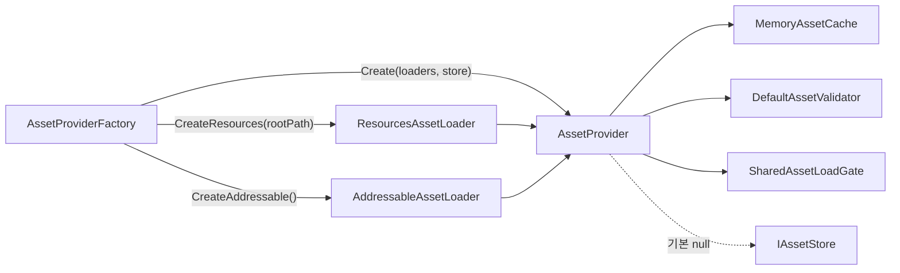
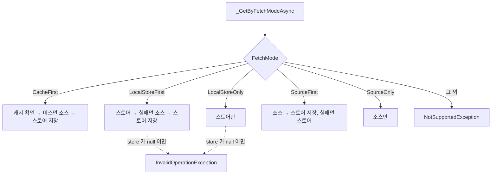
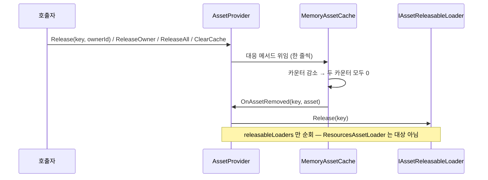

# Provider — 오케스트레이션·조회 정책·검증·저장소

> 대상: `Runtime/Provider/*.cs`, `Runtime/Store/IAssetStore.cs`, `Runtime/Validation/*.cs`,
> `Runtime/Data/*.cs`
> 상위 문서: [Runtime/README.md](../Runtime/README.md)

---

## 요약

`AssetProvider<TKey, TAsset>` 는 5 개 컴포넌트(Cache / Store / Loader[] / Validator / LoadGate)를
생성자로 주입받아 **조율만** 한다. 자기 자신은 어떤 자료도 보유하지 않는다 — 참조 카운트는
캐시가, 소스 핸들은 로더가 갖는다. provider 가 소유하는 것은 `loaderTable`(라우팅 표)과
`releasableLoaders`(해제 연쇄 대상 목록) 둘뿐이다(`Provider/AssetProvider.cs:53-54`).

---

## 조립과 fail-fast

```csharp
// Provider/AssetProvider.cs:58-95 — 요약
if (assetLoaders   == null) HLogger.Throw(new ArgumentNullException(...));
if (assetCache     == null) HLogger.Throw(...);
if (assetValidator == null) HLogger.Throw(...);
if (assetLoadGate  == null) HLogger.Throw(...);   // store 만 null 허용

this.assetCache.OnAssetRemoved += _OnAssetRemoved; // 해제 연쇄의 유일한 배선

foreach (var assetLoader in assetLoaders) {
    if (assetLoader == null) HLogger.Throw(new ArgumentException(...));
    loaderTable[assetLoader.LoadMode] = assetLoader;
    if (assetLoader is IAssetReleasableLoader<TKey, TAsset> r) releasableLoaders.Add(r);
}
if (loaderTable.Count < 1) HLogger.Throw(new ArgumentException("No asset loader registered."));
```

`HLogger.Throw` 는 기본 인자 `doThrow: true` 로 실제로 던진다
(`HDiagnosis/Logger/HLogger.cs:144-148`). 즉 생성자 통과 = 모든 컴포넌트 유효가 보장된다.
`assetStore` 만 `null` 을 허용하고, 그 결과가 fetch mode 5종 중 2종의 가용성을 가른다.



**팩토리는 로더를 하나만 등록한다**(`Provider/AssetProviderFactory.cs:33-48`). 두 소스를 함께
쓰려면 `Create` 오버로드에 배열을 직접 넘겨야 한다. 그렇지 않은 상태에서 다른 `loadMode` 로
요청하면 `_ResolveLoader` 가 `InvalidOperationException` 을 던진다
(`Provider/AssetProvider.cs:314-322`).

---

## fetch mode 5종



| 모드 | 캐시 조회 | 스토어 | 소스 | store 없이 호출 시 |
|---|---|---|---|---|
| `CacheFirst` (`:207-217`) | 있음 | 저장만 시도 | 미스일 때 | 정상 (저장이 no-op) |
| `LocalStoreFirst` (`:221-238`) | **없음** | 읽기+쓰기 | 폴백 | **예외** |
| `LocalStoreOnly` (`:240-251`) | **없음** | 읽기 | 안 함 | **예외** |
| `SourceFirst` (`:255-268`) | **없음** | 폴백 읽기 + 쓰기 | 항상 | 정상 (`:262` 에서 `default` 반환) |
| `SourceOnly` (`:270-274`) | **없음** | 안 함 | 항상 | 정상 |

**캐시를 읽는 모드는 `CacheFirst` 하나뿐이다.** 나머지 4종은 캐시를 건너뛰고 소스/스토어를
직접 친다. 다만 결과는 **모든 모드에서** 캐시에 `Save` 된다(`:169-179`) — 즉 `SourceOnly` 를
반복 호출하면 매번 소스를 치면서 캐시 점유 카운터만 계속 오른다.

`_SaveStoreAsync` 는 store 가 없으면 조용히 `CompletedTask` 를 돌려주므로(`:307-310`),
`CacheFirst` / `SourceFirst` / `SourceOnly` 는 store 부재를 신경 쓰지 않는다.

---

## 게이트 밖 점유 등록 — 이 시스템의 핵심 결정

```csharp
// Provider/AssetProvider.cs:156-182
private async UniTask<TAsset> _GetAsync(AssetRequest<TKey> request) {
    if (!assetValidator.CanLoad(request.Key)) return default;

    var asset = await assetLoadGate.RunAsync(request.Key, () => _GetByFetchModeAsync(request));

    // 점유 등록은 게이트 밖에서 호출자마다 수행한다. 게이트 안(factory)은 최초 호출자
    // 1회만 실행되므로, 안에서 등록하면 dedupe 로 합쳐진 후속 호출자들이 미등록 상태로
    // asset 을 받아 다른 호출자의 Release 한 번에 조기 해제되는 사고가 난다.
    if (_IsValidAsset(request.Key, asset)) {
        if (!_SaveCache(request, asset)) {
            HLogger.Error("[AssetProvider] Cache rejected key ... Releasing the freshly loaded asset ...");
            _ReleaseAssetLoaders(request.Key);
            return default;
        }
    }
    return asset;
}
```

세 가지가 이 12줄에 겹쳐 있다.

1. **dedupe 와 참조 카운트의 분리.** 소스 호출은 합치고 점유는 합치지 않는다.
2. **캐시 조회도 점유를 늘린다.** `_TryPeekCache` 는 `TryGet` 이라 카운터를 건드리지 않고
   (`:295-298`), 등록은 게이트 밖 `_SaveCache` 한 곳에서만 일어난다. 캐시 히트/미스 어느
   경로든 호출자당 정확히 1회 등록이 보장된다.
3. **거부 시 핸들 롤백.** 캐시가 소유하지 않으면 `OnAssetRemoved` 연쇄가 돌지 않으므로
   로더에 직접 돌려준다(`:175-176`).

> 3번에는 조건부 위험이 있다. `_ReleaseAssetLoaders` 는 **모든** releasable 로더의 해당 key
> 핸들을 해제한다(`:326-336`). 로더가 하나면 무해하지만, `Create` 로 Resources+Addressable 을
> 함께 등록하고 같은 key 를 공유하면 캐시가 아직 붙잡고 있는 쪽의 핸들까지 지운다.
> 팩토리 편의 메서드만 쓰는 현재 조립에서는 도달하지 않는다.

---

## 해제 연쇄



`AssetProvider` 의 release 계열은 전부 캐시 위임 한 줄이다(`:124-142`). 정책은 캐시에,
소스 정리는 이벤트 구독자에 있다 — provider 자신은 아무 판단도 하지 않는다.

---

## Validation

```csharp
// Validation/DefaultAssetValidator.cs:27-51
public bool CanLoad(TKey key) {
    if (key is string s) return !string.IsNullOrWhiteSpace(s);
    return !ReferenceEquals(key, null);
}
public bool IsValid(TKey key, TAsset asset) {
    if (!CanLoad(key)) return false;
    if (asset is Object unityObject) return unityObject != null;   // Unity 의 == null 오버로드
    return !ReferenceEquals(asset, null);
}
```

두 규칙을 분리한 이유는 **파괴된 Unity 객체**다. `ReferenceEquals` 로는 null 이 아니지만
`==` 로는 null 인 상태를 잡아내야 한다.

`CanLoad` 실패는 **조용하다** — `_GetAsync` 가 로그 없이 `default` 를 돌려준다
(`Provider/AssetProvider.cs:157-159`). 빈 key 로 호출하면 아무 흔적도 남지 않는다.

`IsValid` 가 false 인 경우(로드 실패 등)에는 `Save` 자체를 건너뛰고 `asset`(= `default`)을
그대로 반환한다(`:169`, `:181`) — 예외도 로그도 없다. **로드 실패는 `null` 반환으로만 표현된다**
(로더 내부에서는 `HLogger.Error` 가 남는다: `Load/AddressableAssetLoader.cs:49`).

---

## Store

`IAssetStore<TKey, TAsset>` 는 5개 비동기 메서드 계약이다(`Store/IAssetStore.cs:23-29`).

| 메서드 | provider 에서의 호출처 |
|---|---|
| `HasAsync` | `_LoadFromStoreAsync` (`:289`) |
| `LoadAsync` | `_LoadFromStoreAsync` (`:290`) |
| `SaveAsync` | `_SaveStoreAsync` (`:307-310`) |
| `ClearAsync` | `ClearStoreAsync` (`:149-152`) |
| `DeleteAsync` | **없음** — 계약에만 존재 |

**패키지 전역에 구현체가 0개다** (`grep ": IAssetStore"` 0건, `IAssetStore` 를 참조하는 파일은
HResource 내부 4개뿐). 따라서 `LocalStoreFirst`/`LocalStoreOnly` 두 fetch mode, `ClearStoreAsync`,
`DeleteAsync` 는 전부 사용자 구현 없이는 도달할 수 없는 확장 슬롯이다. 이 모듈에서 유일하게
"뼈대만 있는" 축이다.

---

## 주의할 점

1. **`GetAsync` 는 항상 점유를 +1 한다.** 캐시 히트여도 그렇다. `Release` 호출 횟수를 맞추지
   않으면 누수다(`:169-179`).
2. **`TryGet` 은 점유를 늘리지 않는다**(`:118-120`). 조회 전용이므로 이 경로로 얻은 참조를
   장기 보관하면 다른 소유자의 `Release` 로 밑에서 사라질 수 있다.
3. **`CacheFirst` 외의 fetch mode 는 캐시를 읽지 않는다.** 반복 호출이 소스 호출로 직결된다.
4. **store 가 없을 때 `LocalStore*` 는 예외**다(`:221-226`, `:240-245`). 기본 팩토리 조립에서
   이 두 모드를 쓰면 반드시 터진다.
5. **`Dispose()` 는 호출처가 0건이고 `IAssetProvider` 에도 없다**(`:145-147`,
   `Provider/IAssetProvider.cs:30`). 인터페이스로 provider 를 들고 있는 소비자
   (`AudioClipRepository`, `CharacterPortraitController`)는 `OnAssetRemoved` 구독을 끊을 방법이
   없다.
6. **`AssetProvider` 는 `sealed`** 다(`:47`). 동작을 바꾸려면 컴포넌트 5종 중 하나를 교체한다.
7. **fetch mode 의 `default` 분기는 `NotSupportedException` 을 던진다**(`:196-201`).
   `AssetFetchMode` 에 값을 추가하면 switch 를 같이 고쳐야 한다 — 컴파일러가 잡아주지 않는다.
